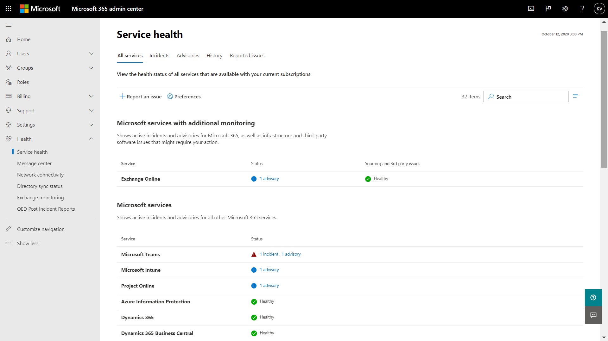

# Supervisión de Exchange Online para Microsoft 365Exchange Online monitoring for Microsoft 365

Puede usar la supervisión de Exchange Online en el Centro de administración de Microsoft 365 para supervisar el estado del servicio de Exchange para la suscripción de Microsoft 365 de su organización.You can use Exchange Online monitoring in the Microsoft 365 admin center to monitor the health of the Exchange service for your organization’s Microsoft 365 subscription. La supervisión de Exchange Online ofrece información sobre incidentes y avisos que se recopilan en estas categorías:Exchange Online monitoring provides you with information about incidents and advisories that are collected in these categories:

- **Infraestructura**: se detecta un problema en la infraestructura de Microsoft 365 que es propiedad de Microsoft para proporcionar actualizaciones periódicas y solucionar el problema.**Infrastructure**: Issue is detected in the Microsoft 365 infrastructure that Microsoft owns for providing regular updates and resolving the issue. Por ejemplo, los usuarios no pueden acceder a Exchange Online debido a problemas con Exchange u otra infraestructura en la nube de Microsoft 365.For example, users cannot access Exchange Online because of issues with Exchange or other Microsoft 365 cloud infrastructure.
- **Infraestructura de terceros**: se detecta un problema en una infraestructura de terceros en la que la organización tiene una dependencia y necesita una acción de su organización para su resolución.**Third-party infrastructure**: Issue is detected in third-party infrastructure on which your organization has taken a dependency and requires action from your organization for resolution. Por ejemplo, las transacciones de autenticación de usuario se limitan con un proveedor de servicio de token de seguridad (STS) de terceros que impide que los usuarios se conecten a Exchange Online.For example, user authentication transactions are getting throttled by a third-party security token service (STS) provider that prevents users from connecting to Exchange Online.
- **Infraestructura del cliente**: se detecta un problema en la infraestructura de la organización y requiere una acción de su organización para su resolución.**Customer infrastructure**: Issue is detected in your organization's infrastructure and requires action from your organization for resolution. Por ejemplo, los usuarios no pueden acceder a Exchange Online porque no pueden obtener un token de autenticación de un proveedor de STS hospedado por la organización debido a un certificado caducado.For example, users cannot access Exchange Online because they are unable to obtain an authentication token from STS provider hosted by your organization because of an expired certificate.

Aquí se muestra un ejemplo de la página **Estado del servicio** en el Centro de administración de Microsoft 365, disponible en **Estado > Estado del servicio**.Here is an example of the **Service health** page in the Microsoft 365 admin center, available from **Health > Service health**.

El valor de la columna **Estado** indica si el servicio está en buen estado o tiene avisos o incidentes basados en los servicios en la nube que mantiene Microsoft.The value of the **Status** column indicates whether the service is healthy or has advisories or incidents based on the cloud services that Microsoft maintains. 

El valor de la columna **Problemas de su organización y de terceros** indica que la infraestructura de su organización o el software de terceros afecta a la experiencia del estado del servicio de sus usuarios con Exchange Online.The value of the **Your org and 3rd party issues** column indicates that your organization's infrastructure or third-party software affects your users service health experience with Exchange Online. Los avisos o incidencias requieren *sus* acciones para resolverse.Advisories or incidents require *your* actions to resolve.

Aquí se muestra un ejemplo de la página de supervisión de **Exchange Online** en el Centro de administración de Microsoft 365, disponible en **Estado > Estado del servicio > Exchange Online**.Here is an example of the **Exchange Online** monitoring page in the Microsoft 365 admin center, available from **Health > Service health > Exchange Online**.

Con la página de supervisión de **Exchange Online**, puede ver si el servicio de Exchange Online está en buen estado o no y si hay incidentes o avisos asociados.With the **Exchange Online** monitoring page, you can see whether the Exchange Online service is healthy or not and whether there are any associated incidents or advisories. Con la supervisión de Exchange Online, puede observar el estado del servicio para escenarios de correo electrónico específicos y ver señales casi en tiempo real para determinar el impacto por escenario.With Exchange Online monitoring, you can look at the service health for specific email scenarios and view near real-time signals to determine the impact by scenario. 

## RequisitosRequirements

Esta vista previa está habilitada para los clientes que cumplan estos requisitos:This preview is enabled for customers who meet these requirements: 

- Su organización necesita tener un número de licencias de al menos 10 000, de uno o de una combinación de estos productos: Office 365 E3, Microsoft 365 E3, Office 365 E5, Microsoft 365 E5.Your organization needs to have a license count of at least 10,000, from one or a combination of these products: Office 365 E3, Microsoft 365 E3, Office 365 E5, Microsoft 365 E5. 

  Por ejemplo, su organización puede tener 3 000 licencias de Office 365 E3 y 8 500 de Microsoft 365 E5, con un total de 11 500 licencias de productos aptos.For example, your organization can have 3,000 Office 365 E3 licenses and 8,500 Microsoft 365 E5, for a total of 11,500 licenses from the qualifying products.

- Su organización necesita tener al menos 50 usuarios activos de Exchange Online mensuales.Your organization needs to have at least 50 monthly active Exchange Online users.

Con la supervisión de Exchange Online, puede ver el estado de los siguientes clientes de correo electrónico basándose en la actividad de lectura de correo electrónico:With Exchange Online monitoring you can view the health for the following email clients based on email read activity:

- Versión de escritorio de Outlook  Outlook Desktop
- Outlook en la WebOutlook on the Web
- Clientes de correo electrónico nativo de iOS y AndroidNative mail clients of iOS and Android 
- Aplicación móvil de Outlook en iOS y AndroidOutlook Mobile app in iOS and Android 
- Cliente de Outlook para MacOutlook Mac client

Para estos clientes, puede ver el número de usuarios activos en los últimos 30 minutos basándose en los usuarios que lean un correo electrónico, así como la cantidad de incidentes y avisos en el panel.For these clients, you can see the number of active users in the last 30 minutes based on users reading an email, along with number of incidents and advisories in the dashboard. Estos datos se comparan con el mismo intervalo de la semana anterior para ver si hay un problema.This data is compared to the same interval for the previous week to see if there’s an issue. 

>[!Note]
> El recuento de usuarios activos se mide por una única actividad, por ejemplo, cuando un usuario lee un correo electrónico.Active user count is measured by a single activity, for example, when a user reads an email. Solo se tienen en cuenta los últimos 30 minutos de actividad.It only accounts for the last 30 minutes of activity.
>

También puede supervisar el estado de Exchange Online en las siguientes situaciones:You can also monitor Exchange Online health for the following scenarios:

- **Flujo de correo**: el número de mensajes entregados correctamente a un buzón sin retraso desde que el mensaje llegó a la red Microsoft 365.**Mail flow**: The number of messages successfully delivered to a mailbox without any delay after the message reached the Microsoft 365 network. 
- **Autenticación básica y autenticación moderna**: número de usuarios validados correctamente en el servicio de Exchange Online.**Basic Authentication and Modern Authentication**: The number of users successfully validated in the Exchange Online service.

Para todos estos escenarios, los números clave son para los últimos 30 minutos en el panel principal.For all these scenarios, the key numbers are for the last 30 minutes in the main dashboard. Las vistas detalladas de cada uno de estos escenarios muestran la tendencia en tiempo casi real durante siete días con un agregado de 30 minutos en comparación con la semana anterior.Detailed views for each of these scenarios shows the near real-time trend for seven days with the 30-minute aggregate compared with the previous week. 

## Enviarnos comentariosSend us feedback

Hay dos formas de proporcionar comentarios:There are two ways you can provide feedback:

- Usar la opción **Enviar comentarios** disponible en cada página del Centro de administración de Microsoft 365.Use the **Give feedback** option available on every page of the Microsoft 365 admin center.
- Enviar comentarios usando el vínculo **¿Es útil esta publicación?** para un incidente o aviso específico.Submit feedback using the **Is this post helpful?** link for a specific incident or advisory.

## Preguntas frecuentesFrequently asked questions

#### 1. ¿Por qué no veo “Supervisión de Exchange Online” en Estado en el Centro de administración de Microsoft 365?1. Why don’t I see “Exchange Online monitoring” under Health in the Microsoft 365 admin center? 

En primer lugar, asegúrese de que ha habilitado el nuevo Centro de administración en la página **Inicio** del Centro de administración de Microsoft 365.First, make sure you’ve enabled the new admin center on the **Home** page of the Microsoft 365 admin center. 

Después, asegúrese de que cumple los siguientes requisitos:Then make sure you meet both of the following requirements: 

- Su organización necesita tener un número de licencias de al menos 10 000, de uno o de una combinación de estos productos: Office 365 E3, Microsoft 365 E3, Office 365 E5, Microsoft 365 E5.Your organization needs to have a license count of at least 10,000, from one or a combination of these products: Office 365 E3, Microsoft 365 E3, Office 365 E5, Microsoft 365 E5. 
- Su organización necesita tener al menos 50 usuarios activos de Exchange Online mensuales.Your organization needs to have at least 50 monthly active Exchange Online users.

Si el número de licencias de la organización es inferior a 10 000 usuarios y los usuarios activos mensuales son menos de 50, no se habilitará la supervisión de Exchange Online hasta que se cumplan estos requisitos.If the license count for your organization goes below 10,000 users and the monthly active users goes below 50 users, Exchange Online monitoring won’t be enabled until these requirements are met.

#### 2. El número de usuarios activos en el panel de control de cada cliente parece ser bajo.2. The active user count in the dashboard for each client appears to be low. Tenemos muchas licencias activas asignadas a los usuarios.We have a lot of active licenses assigned to users. ¿Qué significa esto?What does this mean? 

El recuento de usuarios activos que se muestra en la supervisión se basa en una ventana de 30 minutos donde los usuarios han realizado la actividad indicada en la característica.The active user count shown in monitoring is based on a 30-minute window where users have performed the activity called out in the feature. No debe confundirse con los números de uso.This shouldn’t be confused with usage numbers. Para ver los números de uso, utilice los informes de actividad en el Centro de administración de Microsoft 365 (**Informes > Uso**).To view usage numbers, use activity reports in the Microsoft 365 admin center (**Reports > Usage**).

#### 3. ¿Hay otros escenarios de supervisión para otros servicios, como Microsoft Teams y SharePoint?3. Will there be other monitoring scenarios for other services such as Teams and SharePoint? 

Microsoft está integrando esta experiencia directamente en el panel de Estado del servicio en el Centro de administración de Microsoft 365.Microsoft is integrating this experience directly inside the Service Health dashboard in the Microsoft 365 admin center. Esto ofrecerá oportunidades para que Microsoft extienda escenarios de supervisión a otros servicios, que se anunciarán cuando haya novedades para compartir.This will provide opportunities for Microsoft to extend monitoring scenarios for other services, which will be announced when there is news to share. 

#### 4. ¿Cuál es el plan para la disponibilidad general de esta experiencia?4. What is the plan for general availability of this experience? 

Microsoft ha integrado la supervisión de Exchange Online directamente en el panel de **Estado del servicio** en el Centro de administración de Microsoft 365.Microsoft has integrated Exchange Online monitoring directly on the **Service Health** dashboard in the Microsoft 365 admin center. 

Con esta nueva experiencia integrada, el plan de Microsoft es recopilar sus comentarios y definir nuestro plan de disponibilidad general.With this new integrated experience, Microsoft's plan is to collect your feedback and then define our plan for general availability.

#### 5. ¿Es una característica gratuita (incluida) o de pago (extra)?5. Is this a free (included) or paid (extra) feature? 

Esta característica está en versión preliminar pública y solo está disponible para los clientes que cumplan los requisitos de la pregunta 1.This feature is in Public preview and only available for customers that meet the requirements in question 1.

<!--
>[!Note]
>INTERNAL: That decision is pending
>
--> 

#### 6. ¿Cómo puedo proporcionar comentarios?6. How do I provide feedback? 

Para los comentarios generales, use el icono **Enviar comentarios** en la esquina inferior derecha de la página de supervisión de **Exchange Online**.For general feedback, use the **Give feedback** icon on the bottom-right corner of the **Exchange Online** monitoring page. 

Para los comentarios sobre incidentes o avisos use el vínculo **¿Es útil esta publicación?**.For feedback on incidents or advisories, use the **Is this post helpful?** link.

#### 7. ¿Dónde están los datos instrumentados para los escenarios que muestran las tendencias de actividad?7. Where is the data instrumented for the scenarios that show activity trends?

Los datos se instrumentan en el servicio de Exchange Online.The data is instrumented in the Exchange Online service. Si se produce un error antes de que la solicitud llegue a Exchange Online o existe un error en Exchange Online, verá una caída en la señal de actividad.If there is a failure that happens before the request reaches Exchange Online or there is a failure in Exchange Online, you will see a drop in the activity signal.

