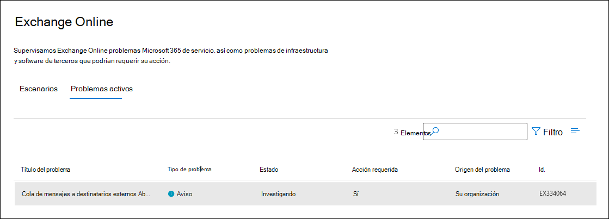
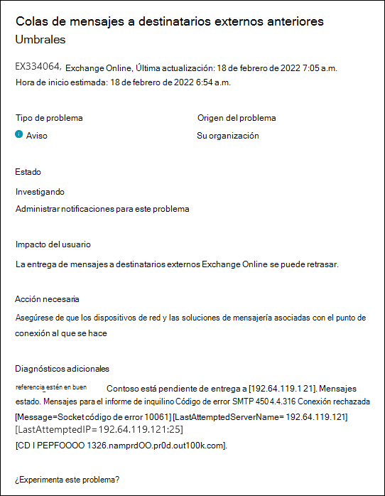

# Alertas de servicio para mensajes pendientes de entrega a destinatarios externos en Exchange Online supervisión

Las alertas de servicio informan a los administradores de la cola de correo a destinatarios externos fuera de Exchange Online. Estas alertas pueden requerir acciones de corrección que están fuera de Microsoft, pero pueden proporcionarle la información necesaria para corregir.

Estas alertas de servicio se muestran en el Centro de administración de Microsoft 365. Para ver estas alertas de servicio, vaya a **Estado** >  <a href="https://go.microsoft.com/fwlink/p/?linkid=842900" target="_blank">**Estado del servicio**</a> >  **Exchange Online** y, a continuación, haga clic en la pestaña **Problemas activos**. El nombre de estas alertas de servicio es "Message Queueing to External Recipients Above Thresholds".

Al hacer doble clic en la alerta de servicio, se muestra una página de control flotante similar a la siguiente.

## ¿Qué indican estas alertas de servicio?

Las alertas de servicio para los mensajes pendientes de entrega a destinatarios externos le informan de que los mensajes destinados a destinatarios fuera de Exchange Online pueden retrasarse. La puesta en cola de mensajes puede deberse a un entorno local o a una solución de mensajería o registro en diario de terceros.

Estas son algunas razones comunes para poner mensajes en cola en destinatarios externos. Sin embargo, es posible que los problemas que provocan estas alertas de servicio no se limite a estos motivos.

- Cambios de DNS

- Tasas de envío excesivas

- Agentes de transferencia de mensajes locales (MTA) o soluciones de registro en diario con poco o ningún espacio libre en disco

- MTA en contrapresión

- Problemas de red, incluidos los equilibradores de carga

- Problemas de certificado

Cada alerta de servicio contiene recomendaciones de alto nivel para corregir el problema. La alerta de servicio también indica el número de mensajes en cola en el momento de la alerta, el dominio en el que se ponen en cola los mensajes y el código de error SMTP asociado a la mayoría de los mensajes en cola.

Para obtener más información sobre cómo determinar la causa principal de estas alertas de servicio, consulte [Inteligencia de flujo de correo en Exchange Online](../security/office-365-security/mail-flow-intelligence-in-office-365.md). En este artículo también se incluyen acciones sugeridas para corregir la causa principal.

> [!NOTE]
> Microsoft no puede tener en cuenta cada código de error SMTP proporcionado por proveedores de terceros. Por lo tanto, es posible que se requiera a los administradores que investiguen los códigos de errores específicos de sus soluciones MTA o de registro en diario usadas por su organización.

## Más información

Si su organización ha creado o cambiado recientemente conectores de flujo de correo en su organización local o Exchange Online, consulte los siguientes artículos para obtener más información.

- [Configuración del flujo de correo mediante conectores en Exchange Online](/exchange/mail-flow-best-practices/use-connectors-to-configure-mail-flow/use-connectors-to-configure-mail-flow)

- [Configurar conectores para enrutar el correo](/exchange/mail-flow-best-practices/use-connectors-to-configure-mail-flow/set-up-connectors-to-route-mail)

- [Procedimientos recomendados de flujo de correo](/exchange/mail-flow-best-practices/mail-flow-best-practices)

- [Reportes de flujo de Correo en el Centro de seguridad y cumplimiento](/microsoft-365/security/office-365-security/mail-flow-insights-v2)

- [Información sobre colas en el panel flujo de correo](/microsoft-365/security/office-365-security/mfi-queue-alerts-and-queues#queues-insight-in-the-mail-flow-dashboard)

- [Seguimiento de un mensaje de correo electrónico en Exchange Online](/exchange/monitoring/trace-an-email-message/trace-an-email-message)
