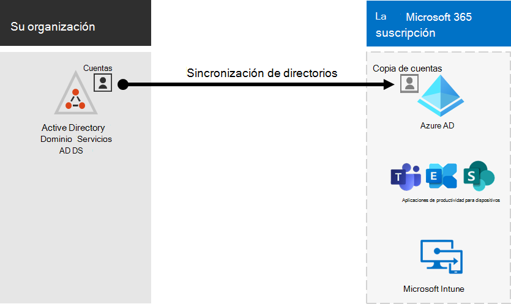
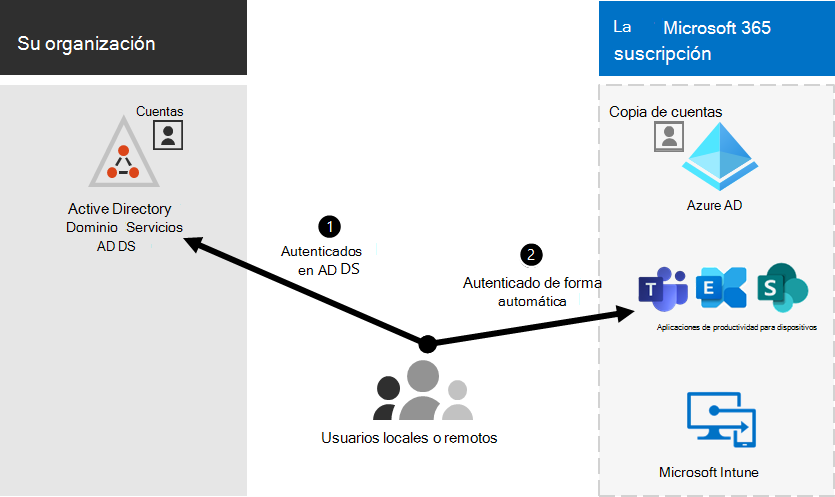

# Integración de Microsoft 365 con entornos locales

*Este artículo afecta tanto a Office 365 Enterprise como a Microsoft 365 Enterprise*

Puede integrar Microsoft 365 con los Servicios de dominio de Active Directory (AD DS) locales existentes y con instalaciones locales de Exchange Server, Skype Empresarial Server 2015 o SharePoint Server.
  
 - Al integrar AD DS, puede sincronizar y administrar cuentas de usuario para ambos entornos. También puede agregar la sincronización de hash de contraseña (PHS) o el inicio de sesión único (SSO) para que los usuarios puedan iniciar sesión en ambos entornos con sus credenciales locales.
 - Cuando se integra con productos de servidor locales, se crea un entorno híbrido. Un entorno híbrido puede ayudarle a migrar usuarios o información a Microsoft 365, o puede seguir teniendo algunos usuarios o información local y otros en la nube. Para obtener más información acerca de los entornos híbridos, vea [la nube híbrida.](../solutions/cloud-architecture-models.md#hybrid)

También puede usar los asesores de Azure Active Directory (Azure AD) para obtener instrucciones de configuración personalizadas en el Centro de administración de Microsoft 365 (debe haber iniciado sesión en Microsoft 365):

- [Guía de configuración de Azure AD](https://aka.ms/aadpguidance)
- [Sincronizar usuarios desde el directorio de su organización](https://aka.ms/aadconnectpwsync)
- [Asesor de implementación de servicios de federación de Active Directory (AD FS)](https://aka.ms/adfsguidance)
   
## Antes de empezar

Antes de integrar Microsoft 365 y un entorno local, también debe realizar la planeación de red y [el ajuste del rendimiento.](network-planning-and-performance.md) También querrá comprender los modelos de [identidad disponibles.](about-microsoft-365-identity.md) 

Consulte [administrar cuentas de Microsoft 365](manage-microsoft-365-accounts.md) para obtener una lista de las herramientas que puede usar para administrar cuentas de usuario de Microsoft 365. 
  
## Integrar Microsoft 365 con AD DS

Si tiene cuentas de usuario existentes en AD DS, no desea volver a crear todas esas cuentas en Microsoft 365 y corre el riesgo de introducir diferencias o errores entre los entornos. La sincronización de directorios le ayuda a reflejar esas cuentas entre sus entornos locales y en línea. Con la sincronización de directorios, los usuarios no tienen que recordar información nueva para cada entorno y no tiene que crear o actualizar cuentas dos veces. Deberá preparar el [directorio local para la](prepare-for-directory-synchronization.md) sincronización de directorios.
  

  
Si desea que los usuarios puedan iniciar sesión en Microsoft 365 con sus credenciales locales, también puede configurar SSO. Con SSO, Microsoft 365 está configurado para confiar en el entorno local para la autenticación de usuarios.
  

### Sincronización de directorios con o sin sincronización de hash de contraseña o autenticación de paso a través (PTA)

Un usuario inicia sesión en su entorno local con su cuenta de usuario (dominio #A0 o nombredeusuario). Cuando vayan a Microsoft 365, deben iniciar sesión de nuevo con su cuenta de trabajo o escuela (user@domain.com). El nombre de usuario es el mismo en ambos entornos. Al agregar PHS o PTA, el usuario tiene la misma contraseña para ambos entornos, pero tendrá que proporcionar esas credenciales de nuevo al iniciar sesión en Microsoft 365. La sincronización de directorios con PHS es la sincronización de directorios más usada.

Para configurar la sincronización de directorios, use Azure AD Connect. Para obtener instrucciones, consulte [Configurar la sincronización de directorios para Microsoft 365](set-up-directory-synchronization.md) y Azure AD Connect con la configuración [express.](https://go.microsoft.com/fwlink/p/?LinkId=698537)

Obtenga más información [sobre cómo preparar la sincronización de directorios en Microsoft 365.](prepare-for-directory-synchronization.md)

### Sincronización de directorios con SSO

Un usuario inicia sesión en su entorno local con su cuenta de usuario. Cuando van a Microsoft 365, inician sesión automáticamente o inician sesión con las mismas credenciales que usan para su entorno local (dominio #A0 o nombredeusuario).

Para configurar SSO, también usa Azure AD Connect. Para obtener instrucciones, [consulte Instalación personalizada de Azure AD Connect.](https://go.microsoft.com/fwlink/p/?LinkID=698430)

Para obtener más información, vea [inicio de sesión único.](https://go.microsoft.com/fwlink/p/?LinkId=698604)

## Azure AD Connect

Azure AD Connect reemplaza las versiones anteriores de las herramientas de integración de identidades, como DirSync y Azure AD Sync. Si desea actualizar de Azure Active Directory Sync a Azure AD Connect, vea [las instrucciones de actualización.](https://go.microsoft.com/fwlink/p/?LinkId=733240) 

## Vea también

[Información general de Microsoft 365 Enterprise](microsoft-365-overview.md)
