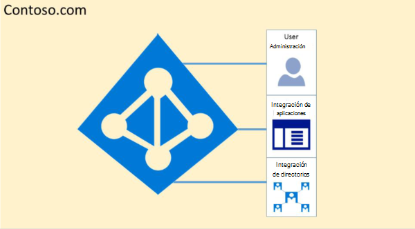
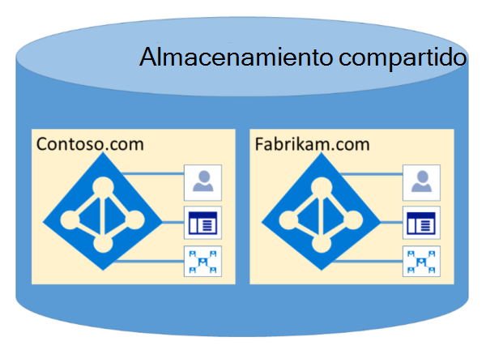

# Aislamiento y control de acceso de Microsoft 365 en Azure Active DirectoryMicrosoft 365 Isolation and Access Control in Azure Active Directory

Azure Active Directory (Azure AD) se diseñó para hospedar varios inquilinos de forma altamente segura a través del aislamiento de datos lógicos.Azure Active Directory (Azure AD) was designed to host multiple tenants in a highly secure way through logical data isolation. El acceso a Azure AD está privado por una capa de autorización.Access to Azure AD is gated by an authorization layer. Azure AD aísla a los clientes que usan contenedores de inquilinos como límites de seguridad para proteger el contenido de un cliente de modo que los coinquilinos no puedan acceder al contenido ni comprometerlo.Azure AD isolates customers using tenant containers as security boundaries to safeguard a customer's content so that the content cannot be accessed or compromised by co-tenants. La capa de autorización de Azure AD realiza tres comprobaciones:Three checks are performed by Azure AD's authorization layer:

- ¿La entidad de seguridad está habilitada para el acceso al inquilino de Azure AD?Is the principal enabled for access to Azure AD tenant?
- ¿La entidad de seguridad está habilitada para obtener acceso a los datos de este espacio empresarial?Is the principal enabled for access to data in this tenant?
- ¿El rol de la entidad de seguridad en este espacio empresarial está autorizado para el tipo de acceso a datos solicitado?Is the principal's role in this tenant authorized for the type of data access requested?

Ninguna aplicación, usuario, servidor o servicio puede acceder a Azure AD sin la autenticación y el token o certificado adecuados.No application, user, server, or service can access Azure AD without the proper authentication and token or certificate. Las solicitudes se rechazan si no van acompañadas de las credenciales adecuadas.Requests are rejected if they are not accompanied by proper credentials.

De hecho, Azure AD hospeda cada inquilino en su propio contenedor protegido, con directivas y permisos en y dentro del contenedor que solo es propiedad y está administrado por el inquilino.Effectively, Azure AD hosts each tenant in its own protected container, with policies and permissions to and within the container solely owned and managed by the tenant.
 

El concepto de contenedores de inquilinos está profundamente arraigado en el servicio de directorio en todas las capas, desde portales hasta el almacenamiento persistente.The concept of tenant containers is deeply ingrained in the directory service at all layers, from portals all the way to persistent storage. Incluso cuando se almacenan varios metadatos de inquilino de Azure AD en el mismo disco físico, no hay ninguna relación entre los contenedores que no sea la definida por el servicio de directorio, que a su vez está dictada por el administrador de inquilinos.Even when multiple Azure AD tenant metadata is stored on the same physical disk, there is no relationship between the containers other than what is defined by the directory service, which in turn is dictated by the tenant administrator. No puede haber conexiones directas al almacenamiento de Azure AD desde cualquier aplicación o servicio solicitante sin pasar primero por la capa de autorización.There can be no direct connections to Azure AD storage from any requesting application or service without first going through the authorization layer.

En el ejemplo siguiente, Contoso y Fabrikam tienen contenedores independientes y dedicados, y aunque estos contenedores pueden compartir parte de la misma infraestructura subyacente, como servidores y almacenamiento, permanecen separados y aislados entre sí, y aislados por capas de autorización y control de acceso.In the example below, Contoso and Fabrikam both have separate, dedicated containers, and even though those containers may share some of the same underlying infrastructure, such as servers and storage, they remain separate and isolated from each other, and gated by layers of authorization and access control.
 

Además, no hay componentes de aplicación que se puedan ejecutar desde Azure AD y no es posible que un inquilino incumbe la integridad de otro inquilino, acceda a las claves de cifrado de otro inquilino o lea datos sin procesar del servidor.In addition, there are no application components that can execute from within Azure AD, and it is not possible for one tenant to forcibly breach the integrity of another tenant, access encryption keys of another tenant, or read raw data from the server.

De forma predeterminada, Azure AD no permite todas las operaciones emitidas por identidades en otros inquilinos.By default, Azure AD disallows all operations issued by identities in other tenants. Cada inquilino se aísla lógicamente en Azure AD a través de controles de acceso basados en notificaciones.Each tenant is logically isolated within Azure AD through claims-based access controls. Las lecturas y escrituras de datos de directorio se aplican a contenedores de inquilinos y están delimitadas por una capa de abstracción interna y una capa de control de acceso basado en roles (RBAC), que, en conjunto, aplican el inquilino como límite de seguridad.Reads and writes of directory data are scoped to tenant containers, and gated by an internal abstraction layer and a role-based access control (RBAC) layer, which together enforce the tenant as the security boundary. Estas capas procesan todas las solicitudes de acceso a datos de directorio y cada solicitud de acceso de Microsoft 365 está bajo la protección de la lógica anterior.Every directory data access request is processed by these layers and every access request in Microsoft 365 is policed by the logic above.

Azure AD tiene particiones de Norteamérica, Estados Unidos, Unión Europea, Alemania y todo el mundo.Azure AD has North America, U.S. Government, European Union, Germany, and World Wide partitions. Un inquilino existe en una sola partición y las particiones pueden contener varios inquilinos.A tenant exists in a single partition, and partitions can contain multiple tenants. La información de partición se abstrae de los usuarios.Partition information is abstracted away from users. Una partición determinada (incluidos todos los inquilinos dentro de ella) se replica en varios centros de datos.A given partition (including all the tenants within it) is replicated to multiple datacenters. La partición de un inquilino se elige en función de las propiedades del inquilino (por ejemplo, el código de país).The partition for a tenant is chosen based on properties of the tenant (e.g., the country code). Los secretos y otra información confidencial de cada partición se cifran con una clave dedicada.Secrets and other sensitive information in each partition is encrypted with a dedicated key. Las claves se generan automáticamente cuando se crea una partición nueva.The keys are generated automatically when a new partition is created.

Las funcionalidades del sistema de Azure AD son una instancia única para cada sesión de usuario.Azure AD system functionalities are a unique instance to each user session. Además, Azure AD usa tecnologías de cifrado para proporcionar aislamiento de los recursos compartidos del sistema en el nivel de red para evitar la transferencia no autorizada y no intencionado de información.In addition, Azure AD uses encryption technologies to provide isolation of shared system resources at the network level to prevent unauthorized and unintended transfer of information.
