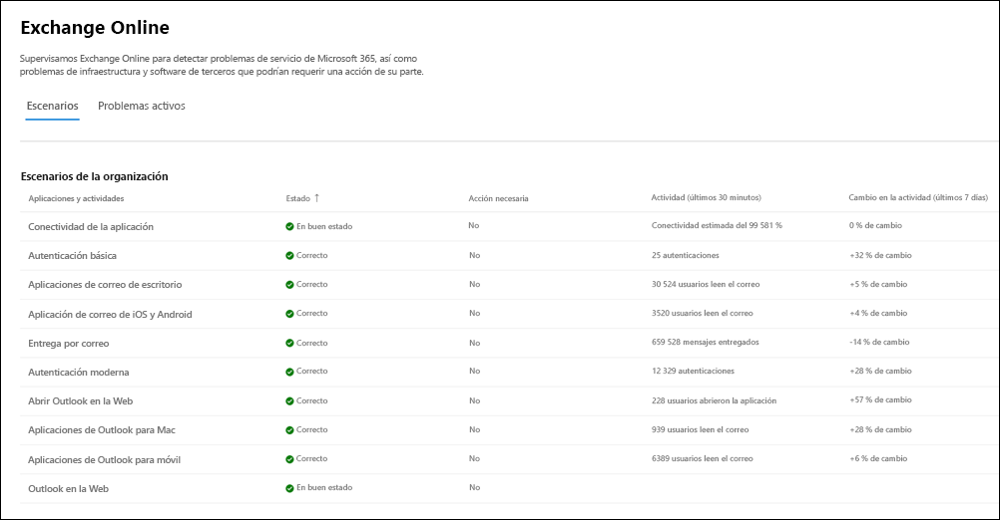

# Más información sobre la supervisión de Microsoft 365

Puede usar paneles en el [Centro de administración de Microsoft 365](https://go.microsoft.com/fwlink/p/?linkid=2024339) para supervisar el estado de varios servicios de Microsoft para la suscripción de Microsoft 365 de su organización. Esta funcionalidad se inició inicialmente con Exchange Online y ahora se expandió a otros servicios de Microsoft, como Microsoft Teams, Aplicaciones Microsoft 365 y más servicios en el futuro. La supervisión proporciona información sobre incidentes y avisos que se recopilan en estas categorías:

- **Infraestructura**. El problema se detecta en la infraestructura de Microsoft 365 que Microsoft posee para proporcionar actualizaciones periódicas y resolver el problema. Por ejemplo, los usuarios no pueden acceder a Exchange Online debido a problemas con Exchange u otra infraestructura en la nube de Microsoft 365.

- **Infraestructura de terceros**. El problema se detecta en la infraestructura de terceros en la que su organización ha tomado una dependencia y requiere que su organización realice una acción para su resolución. Por ejemplo, las transacciones de autenticación de usuario se limitan con un proveedor de servicio de token de seguridad (STS) de terceros que impide que los usuarios se conecten a Exchange Online.

- **Infraestructura del cliente**. El problema se detecta en la infraestructura de la organización y requiere la acción de la organización para su resolución. Por ejemplo, los usuarios no pueden acceder a Exchange Online porque no pueden obtener un token de autenticación del proveedor sts hospedado por su organización debido a un certificado expirado.

Este es un ejemplo de la página **Estado del servicio** de la Centro de administración de Microsoft 365, que está disponible en **Health** >  **Estado del servicio** para escenarios de organización y escenarios de [cuenta de prioridad](../admin/setup/priority-accounts.md).

**Los problemas de la organización** se identificarán y usarán mediante la supervisión de nivel organizativo y la supervisión de cuentas prioritarias.

The value of the **Health** column under **Issues in your organization** indicates whether your organization's infrastructure or third-party software affects the service health experience of your organization's users and/or priority accounts in Exchange Online. Advisories or incidents require your actions to resolve.

El valor de la columna **Estado** en **Estado del servicio Microsoft** indica que el servicio está en buen estado o tiene avisos o incidentes basados en los servicios en la nube que mantiene Microsoft.

Este es un ejemplo de la página de supervisión de Exchange Online en la Centro de administración de Microsoft 365 que muestra el estado de los escenarios de cuenta de nivel de organización y prioridad disponibles en **Health** >  **Estado del servicio** >  **Exchange Online**.

Con la página de lista de escenarios, puede ver si el servicio de Microsoft está en buen estado o no y si hay incidentes o avisos asociados. Por ejemplo, con Exchange Online supervisión, puede examinar el estado del servicio para escenarios de correo electrónico específicos y ver señales casi en tiempo real para determinar el impacto en el escenario de nivel de organización. También puede ver el estado de los escenarios de cuenta de prioridad, si está disponible.

## Requisitos para la supervisión

Esta versión preliminar está habilitada para los clientes que cumplen los siguientes requisitos:

- Su organización debe tener un recuento de licencias de al menos 5000 de uno o una combinación de estos productos: Office 365 E3, Microsoft 365 E3, Office 365 E5 o Microsoft 365 E5.

   Por ejemplo, su organización podría tener 3000 licencias de Office 365 E3 y 2500 de Microsoft 365 E5, con un total de 5500 licencias de productos aptos.

- Su organización necesita tener al menos 50 usuarios activos mensuales para uno o más servicios principales de Microsoft 365, entre los que se incluyen Microsoft Teams, OneDrive para la Empresa, SharePoint Online, Exchange Online y aplicaciones de Office.

- Cualquier rol con permisos de nivel de panel de Estado del servicio puede tener acceso a la supervisión de Exchange Online. Para más información, consulte [Cómo comprobar el estado del servicio de Microsoft 365](view-service-health.md).

## Supervisión adicional para los servicios de Microsoft

La supervisión específica del servicio también está habilitada para los siguientes servicios de Microsoft. Seleccione el vínculo correspondiente para obtener más información sobre la supervisión de ese servicio.

- [Exchange Online](microsoft-365-exchange-monitoring.md)

- [Aplicaciones de Microsoft 365](microsoft-365-apps-monitoring.md)

- [Microsoft Teams](microsoft-365-teams-monitoring.md)

## Enviarnos comentarios

Hay dos formas de proporcionar comentarios:

- Usar la opción **Enviar comentarios** disponible en cada página del Centro de administración de Microsoft 365.

- Enviar comentarios con **¿Es útil esta publicación? vínculo para un incidente o aviso específico.

  

## Preguntas frecuentes

### 1. ¿Por qué no veo el vínculo "Ver" en la columna Supervisión organizativa en la Centro de administración de Microsoft 365 dentro de Service Health?

En primer lugar, asegúrese de que ha habilitado el nuevo centro de administración en la página **Inicio** del [Centro de administración de Microsoft 365](https://go.microsoft.com/fwlink/p/?linkid=2024339).

Después, asegúrese de que cumple los siguientes requisitos:

- Su organización debe tener un recuento de licencias de al menos 5 000, de uno o una combinación de estos productos: Office 365 E3, Microsoft 365 E3, Office 365 E5 o Microsoft 365 E5.

- Su organización necesita tener al menos 50 usuarios activos mensuales para uno o más servicios principales de Microsoft 365, entre los que se incluyen Microsoft Teams, OneDrive para la Empresa, SharePoint Online, Exchange Online y aplicaciones de Office.

Si el número de licencias de la organización es inferior a 5000 usuarios y los usuarios activos mensuales son menos de 50 para los servicios principales, no se habilitará la supervisión de Exchange Online hasta que se cumplan estos requisitos.

### 2. ¿Habrá otros escenarios de supervisión para otros servicios en el futuro?

Sí. Ahora tenemos algunos servicios más en versión preliminar pública. Seguiremos trabajando para expandir la superficie a otros servicios.

### 3. ¿Cuál es el plan para la disponibilidad general de esta experiencia?

El plan de Microsoft es recopilar sus comentarios sobre la experiencia en versión preliminar y, a continuación, definir nuestro plan de disponibilidad general.

### 4. ¿Se trata de una característica gratuita (incluida) o de pago (adicional)?

This is a free feature that is in preview and only available for customers that meet the requirements in question 1. There isn't a paid option to receive this content.

### 5. Cómo proporcionar comentarios?

Para obtener comentarios generales, use el icono **Dar comentarios** en la esquina inferior derecha de la página de supervisión.

Para obtener comentarios sobre incidentes o avisos, use **¿Es útil esta publicación? Enlace.

### 6. ¿Hay algún problema de privacidad?

La supervisión se centra en los metadatos del servicio y no se supervisa el contenido del usuario.
