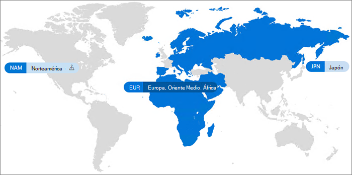

# Microsoft 365 Multi-GeoMicrosoft 365 Multi-Geo

Con Microsoft 365 Multi-Geo, su organización puede expandir su presencia en Microsoft 365 a varias regiones geográficas y países dentro de su espacio empresarial existente.With Microsoft 365 Multi-Geo, your organization can expand its Microsoft 365 presence to multiple geographic regions and/or countries within your existing tenant. Póngase en contacto con su equipo de cuentas de Microsoft para registrar su compañía multinacional a Microsoft 365 Multi-Geo.Reach out to your Microsoft Account Team to sign up your Multi-National Company for Microsoft 365 Multi-Geo.
  
Con Microsoft 365 Multi-Geo, puede aprovisionar y almacenar los datos en reposo en las ubicaciones geográficas que haya elegido para cumplir los requisitos de residencia de datos y, al mismo tiempo, puede permitir la implementación global de experiencias de productividad modernas para sus empleados.With Microsoft 365 Multi-Geo, you can provision and store data at rest in the geo locations that you've chosen to meet data residency requirements, and at the same time unlock your global roll out of modern productivity experiences to your workforce.

Para obtener una introducción en vídeo a Microsoft 365 Multi-Geo, vea [SharePoint Online y OneDrive Multi-Geo para controlar dónde residen los datos.](https://www.youtube.com/watch?v=Do9U3JuROhk)For a video introduction to Microsoft 365 Multi-Geo, see [SharePoint Online and OneDrive Multi-Geo to control where your data resides](https://www.youtube.com/watch?v=Do9U3JuROhk).

## Arquitectura multigeósicaMulti-Geo architecture

En un entorno multigeográfico, su espacio empresarial de Microsoft 365 cuenta con una ubicación central (donde se aprovisionó originalmente la suscripción a Microsoft 365) y una o varias ubicaciones satélites.In a Multi-Geo environment, your Microsoft 365 tenant consists of a central location (where your Microsoft 365 subscription was originally provisioned) and one or more satellite locations. En un espacio empresarial multigeográfico, la información sobre las ubicaciones geográficas, grupos y la información de usuario, se controla en Azure Active Directory (Azure AD).In a multi-geo tenant, the information about geo locations, groups, and user information, is mastered in Azure Active Directory (Azure AD). Como la información del espacio empresarial se controla de forma centralizada y se sincroniza en cada ubicación geográfica, el uso compartido y las experiencias que involucran a todos los empleados de su compañía comparten una conciencia global.Because your tenant information is mastered centrally and synchronized into each geo location, sharing and experiences involving anyone from your company contain global awareness.

Tenga en cuenta que Microsoft 365 Multi-Geo no está diseñado principalmente para optimizar el rendimiento, sino para cumplir con los requisitos de residencia de datos.Note that Microsoft 365 Multi-Geo is not designed for performance optimization, it is designed to meet data residency requirements. Para obtener información sobre la optimización del rendimiento de Microsoft 365, vea [Network planning and performance tuning for Microsoft 365](https://support.office.com/article/e5f1228c-da3c-4654-bf16-d163daee8848) (Planeamiento de red y ajuste de rendimiento para Microsoft 365) o póngase en contacto con su grupo de soporte técnico.For information about performance optimization for Microsoft 365, see [Network planning and performance tuning for Microsoft 365](https://support.office.com/article/e5f1228c-da3c-4654-bf16-d163daee8848) or contact your support group.

## TerminologíaTerminology

Estos son los términos clave utilizados para describir Microsoft 365 Multi-Geo:Here are the key terms used in describing Microsoft 365 Multi-Geo:

- **Ubicación central**: la ubicación geográfica en la que se ha aprovisionado originalmente el espacio empresarial.**Central location** - the geo location where your tenant was originally provisioned.
- **Administrador geográfico**: un administrador que puede administrar una o varias ubicaciones satélites especificadas.**Geo administrator** - An administrator who can administer one or more specified satellite locations.
- **Código geográfico**: un código de tres letras de una ubicación geográfica determinada.**Geo code** - a three-letter code for a given geo location.
- **Ubicación geográfica**: una ubicación geográfica que puede usarse en un espacio empresarial multigeográfico para alojar datos, como los buzones de Exchange y los sitios de SharePoint y OneDrive.**Geo location** – A geographic location that can be used in a multi-geo tenant to host data, including Exchange mailboxes and OneDrive and SharePoint sites.
- **Ubicación de datos preferida (PDL)**: una propiedad de usuario que establece el administrador e indica la ubicación geográfica donde se deben aprovisionar los buzones de Exchange de usuarios y OneDrive.**Preferred Data Location (PDL)** – A user property set by the administrator that indicates where the geo location where the users Exchange mailbox and OneDrive should be provisioned. La PDL también determina dónde aprovisionar sitios de SharePoint creados por el usuario.The PDL also determines where SharePoint sites that are created by the user are provisioned.
- **Ubicación satélite**: las ubicaciones geográficas donde están habilitadas las cargas de trabajo compatibles geográficamente de Microsoft 365 (Exchange, OneDrive y SharePoint) en un espacio empresarial multigeográfico.**Satellite location** – The geo locations where the geo-aware Microsoft 365 workloads (SharePoint, OneDrive, and Exchange) are enabled in a multi-geo tenant.
- **Cuenta empresarial**: la representación de una organización de Microsoft 365, que suele tener uno o más dominios asociados (por ejemplo, contoso.com).**Tenant** – An organization's representation in Microsoft 365 which typically has one or more domains associated with it (for example, contoso.com).

## LicenciasLicensing

Microsoft 365 Multi-Geo está disponible como complemento para los siguientes planes de suscripción de Microsoft 365 para clientes de Contrato Enterprise con un mínimo de 250 puestos de Microsoft 365 en su inquilino y un mínimo del 5 % de esos puestos con multigefiación.Microsoft 365 Multi-Geo is available as an add-on to the following Microsoft 365 subscription plans for Enterprise Agreement customers with a minimum of 250 Microsoft 365 seats in their tenant, and a minimum of 5% of those seats using multi-geo. Las licencias de suscripción de usuario deben estar en el mismo Contrato Enterprise que las licencias de servicios multigeómicos.User subscription licenses must be on the same Enterprise Agreement as the Multi-Geo Services licenses. Póngase en contacto con el equipo de su cuenta de Microsoft para obtener más información.Please contact your Microsoft account team for details.

- Microsoft 365 F1, F3, E3 o E5Microsoft 365 F1, F3, E3, or E5
- Office 365 F3, E1, E3 o E5Office 365 F3, E1, E3, or E5
- Exchange Online (plan 1 o plan 2)Exchange Online Plan 1 or Plan 2
- OneDrive para la Empresa (plan 1 o plan 2)OneDrive for Business Plan 1 or Plan 2
- SharePoint Online (plan 1 o plan 2)SharePoint Online Plan 1 or Plan 2

## Disponibilidad de Microsoft 365 Multi-GeoMicrosoft 365 Multi-Geo availability

Actualmente, se ofrece Microsoft 365 Multi-Geo en estos países y regiones:Microsoft 365 Multi-Geo is currently offered in these regions and countries:

[!INCLUDE [Microsoft 365 Multi-Geo locations](../includes/microsoft-365-multi-geo-locations.md)]

## IntroducciónGetting started

Siga estos pasos para empezar a usar Multi-Geo:Follow these steps to get started with multi-geo:

1. Trabaje con el equipo de cuentas para agregar el plan de servicio _Funciones multigeográficas en Microsoft 365_.Work with your account team to add the _Multi-Geo Capabilities in Microsoft 365_ service plan. Le guiará para agregar el número de licencias necesarias.They will guide you to add the number of licenses needed. La característica multigeográfica está disponible actualmente para los clientes EA con un mínimo de 250 suscripciones a Microsoft 365.Multi-Geo feature is available to EA customers with a minimum of 250 Microsoft 365 subscriptions.

   Antes de empezar a usar Microsoft 365 Multi-Geo, Microsoft necesita configurar el espacio empresarial de Exchange Online para la compatibilidad con Multi-Geo.Before you can start using Microsoft 365 Multi-Geo, Microsoft needs to configure your Exchange Online tenant for multi-geo support. Este proceso de configuración única se activa después de pedir el plan de servicio de las *Capacidades multigeográficas de Microsoft 365* y después de que las licencias se muestren en el espacio empresarial.This one-time configuration process is triggered after you order the *Multi-Geo Capabilities in Microsoft 365* service plan and the licenses show up in your tenant. Recibirá notificaciones específicas de la carga de trabajo en el Centro de mensajes de [Microsoft 365](https://support.office.com/article/38FB3333-BFCC-4340-A37B-DEDA509C2093) una vez que el inquilino haya completado el proceso de configuración de cada carga de trabajo y, a continuación, pueda empezar a configurar y usar sus capacidades multigeógrámicas de Microsoft 365.You will receive workload-specific notifications in the [Microsoft 365 message center](https://support.office.com/article/38FB3333-BFCC-4340-A37B-DEDA509C2093) once your tenant has completed the configuration process for each workload, and you then may begin configuring and using your Microsoft 365 Multi-Geo capabilities. El tiempo necesario para configurar un espacio empresarial para la compatibilidad multigeón varía de inquilino a inquilino, pero la mayoría de los inquilinos finalizan en un mes después de la recepción de las licencias de características.The time required to configure a tenant for Multi-Geo support varies from tenant to tenant, but most tenants finish within a month after receipt of the feature licenses. Es posible que los inquilinos más grandes o más complejos necesiten más tiempo para completar el proceso de configuración.Larger or more complex tenants may require more time to complete the configuration process. Póngase en contacto con el equipo de su cuenta para obtener más información sobre su inquilino específico en caso de que lo necesite.Please contact your account team for details on your specific tenant should you require it.

2. Lea [Planificar el entorno multigeográfico](plan-for-multi-geo.md).Read [Plan your multi-geo environment](plan-for-multi-geo.md).

3. Obtenga información sobre cómo [administrar un entorno multigeográfico](administering-a-multi-geo-environment.md) y [cómo los usuarios experimentarán el entorno](multi-geo-user-experience.md).Learn about [administering a multi-geo environment](administering-a-multi-geo-environment.md) and [how your users will experience the environment](multi-geo-user-experience.md).

4. Cuando esté listo para configurar Microsoft 365 Multi-Geo, [configure su espacio empresarial multigeográfico](multi-geo-tenant-configuration.md).When you are ready to set up Microsoft 365 Multi-Geo, [configure your tenant for multi-geo](multi-geo-tenant-configuration.md).

5. [Configure la búsqueda](configure-search-for-multi-geo.md).[Set up search](configure-search-for-multi-geo.md).

## Vea tambiénSee also

[Capacidades multigeográficas en Exchange Online y OneDriveMulti-Geo in Exchange Online and OneDrive](https://Aka.ms/GoMultiGeo)

[Capacidades multigeográficas de OneDrive y SharePoint OnlineMulti-Geo Capabilities in OneDrive and SharePoint Online](multi-geo-capabilities-in-onedrive-and-sharepoint-online-in-microsoft-365.md)

[Capacidades multigeográficas de Exchange OnlineMulti-Geo Capabilities in Exchange Online](multi-geo-capabilities-in-exchange-online.md)

[Experiencia de equipos en un entorno multigeoTeams experience in a multi-geo environment](/microsoftteams/teams-experience-o365odb-spo-multi-geo)