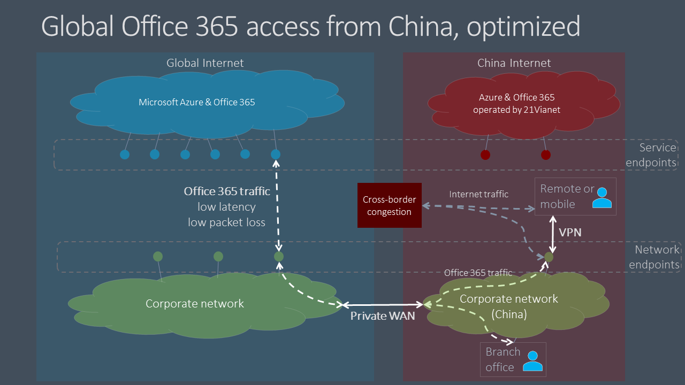

# Optimización del rendimiento global de inquilinos de Microsoft 365 para usuarios de China

>[!IMPORTANT]
>Esta guía es específica para escenarios de uso en los que los usuarios de **Microsoft 365** de empresa ubicados en China se conectan a un inquilino global de **Microsoft 365.** Esta guía no **se aplica** a los inquilinos de Office 365 operados por 21Vianet.

Para las empresas con inquilinos globales de Microsoft 365 y una presencia corporativa en China, el rendimiento del cliente de Microsoft 365 para usuarios basados en China puede ser complicado por factores exclusivos de la arquitectura de Internet de China Telco.

Los ISP de China han regulado conexiones offshore a Internet pública global que pasan por dispositivos perimetrales propensos a altos niveles de congestión de red transfronteriza. Esta congestión crea pérdida de paquetes y latencia para todo el tráfico de Internet que entra y sale de China.

La pérdida de paquetes y la latencia son perjudiciales para el rendimiento de los servicios de red, especialmente los servicios que requieren grandes intercambios de datos (como transferencias de archivos grandes) o que requieren un rendimiento casi en tiempo real (aplicaciones de audio y vídeo).

El objetivo de este tema es proporcionar procedimientos recomendados para mitigar el impacto de la congestión de red transfronteriza de China en los servicios de Microsoft 365. En este tema no se abordan otros problemas comunes de rendimiento de última milla, como problemas de alta latencia de paquetes debido al enrutamiento complejo dentro de los operadores de China.

## Procedimientos recomendados de red corporativa

Muchas empresas con inquilinos y usuarios globales de Microsoft 365 en China han implementado redes privadas que transportan tráfico de red corporativa entre ubicaciones de oficinas de China y ubicaciones offshore en todo el mundo. Estas empresas pueden aprovechar esta infraestructura de red para evitar la congestión de red transfronteriza y optimizar el rendimiento del servicio de Microsoft 365 en China.

>[!IMPORTANT]
>Al igual que con todas las implementaciones de WAN privadas, siempre debe consultar los requisitos normativos de su país o región para asegurarse de que la configuración de red está en cumplimiento.

Como primer paso, es fundamental que siga nuestra guía de red comparativa en Planificación de red y ajuste del rendimiento [para Microsoft 365](./network-planning-and-performance.md). El objetivo principal debe ser evitar el acceso a los servicios globales de Microsoft 365 desde Internet en China si es posible.

- Aproveche la red privada existente para llevar el tráfico de red de Microsoft 365 entre las redes de oficina de China y las ubicaciones de alta mar que se encuentran fuera de China. Casi cualquier ubicación fuera de China proporcionará una ventaja clara. Los administradores de red pueden optimizar aún más la salida en áreas con una interconexión de baja latencia con la [red global de Microsoft.](/azure/networking/microsoft-global-network) Hong Kong, Japón y Corea del Sur son ejemplos.
- Configure los dispositivos de usuario para que accedan a la red corporativa a través de una conexión VPN para permitir que el tráfico de Microsoft 365 transite el vínculo offshore privado de la red corporativa. Asegúrese de que los clientes VPN no estén configurados para usar túnel dividido o de que los dispositivos de usuario estén configurados para omitir el túnel dividido para el tráfico de Microsoft 365.
- Configure la red para enrutar todo el tráfico de Microsoft 365 a través de su vínculo privado offshore. Si debe minimizar el volumen de tráfico en su vínculo privado, puede elegir enrutar  solo  los puntos de conexión en la categoría **Optimizar** y permitir que las solicitudes permitan que los puntos de conexión predeterminados transiten por Internet. Esto mejorará el rendimiento y minimizará el consumo de ancho de banda al limitar el tráfico optimizado a los servicios críticos que son más sensibles a la alta latencia y la pérdida de paquetes.
- Si es posible, usa UDP en lugar de TCP para el tráfico de streaming de medios en directo, como para Teams. UDP ofrece un mejor rendimiento de streaming de medios en directo que TCP.

Para obtener información sobre cómo enrutar selectivamente el tráfico de Microsoft 365, vea [Managing Office 365 endpoints](managing-office-365-endpoints.md). Para obtener una lista de todas las direcciones URL y direcciones IP de Office 365 en todo el mundo, vea Direcciones URL e intervalos de [direcciones IP de Office 365.](urls-and-ip-address-ranges.md)

## Procedimientos recomendados para el usuario

Los usuarios de China que se conectan a inquilinos globales de Microsoft 365 desde ubicaciones remotas como casas, cafeterías, hoteles y sucursales sin conexión a redes empresariales pueden experimentar un rendimiento de red deficiente porque el tráfico entre sus dispositivos y Microsoft 365 debe transitar por los circuitos de red transfronterizos congestionados de China.

Si las redes privadas transfronterizas o el acceso VPN a la red corporativa no son una opción, los problemas de rendimiento por usuario aún pueden mitigarse mediante la formación de los usuarios basados en China para que sigan estos procedimientos recomendados.

- Use clientes enriquecidos de Office que admitan el almacenamiento en caché (por ejemplo, Outlook, Teams, OneDrive, etc.) y eviten clientes basados en web. El almacenamiento en caché de clientes de Office y las características de acceso sin conexión pueden reducir considerablemente el impacto de la congestión y la latencia de la red.
- Si el inquilino de Microsoft 365 se ha configurado con la característica _de audioconferencia,_ los usuarios de Teams pueden unirse a reuniones a través de la red telefónica conmutada (RTC). Para obtener más información, [vea Audioconferencia en Office 365](/microsoftteams/audio-conferencing-in-office-365).
- Si los usuarios experimentan problemas de rendimiento de red, deben informar a su departamento de TI para solucionar problemas y escalar a soporte técnico de Microsoft si se sospecha que hay problemas con los servicios de Microsoft 365. No todos los problemas son causados por el rendimiento de la red transfronteriza.

Microsoft está trabajando continuamente para mejorar la experiencia del usuario de Microsoft 365 y el rendimiento de los clientes en la gama más amplia posible de arquitecturas y características de red. Visite la Comunidad técnica de [Office 365](https://techcommunity.microsoft.com/t5/office-365/bd-p/Office365General) para iniciar o unirse a una conversación, buscar recursos y enviar sugerencias y solicitudes de características.

## Temas relacionados

[Planeamiento de red y ajuste del rendimiento para Microsoft 365](./network-planning-and-performance.md)

[Principios de conectividad de red de Microsoft 365](microsoft-365-network-connectivity-principles.md)

[Administrar puntos de conexión de Office 365](managing-office-365-endpoints.md)

[Direcciones URL e intervalos de direcciones IP de Office 365](urls-and-ip-address-ranges.md)

[Red global de Microsoft](/azure/networking/microsoft-global-network)