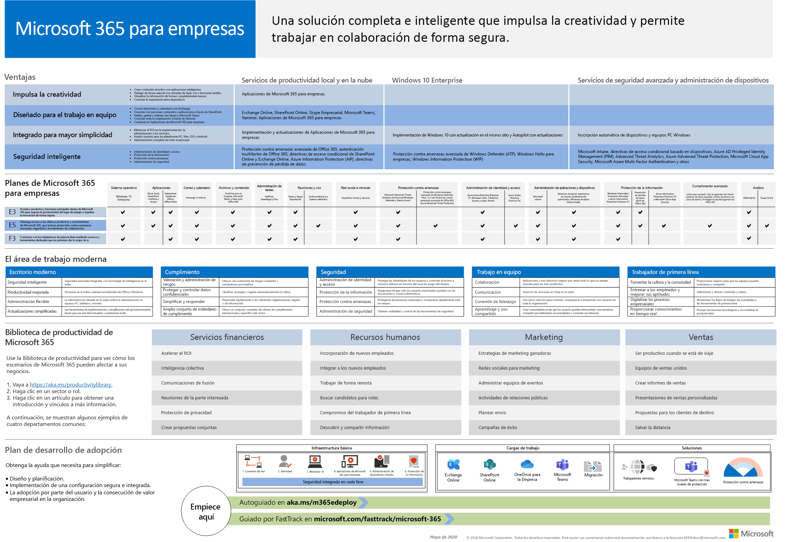

# Información general de Microsoft 365 EnterpriseMicrosoft 365 for enterprise overview

Microsoft 365 para empresas es una solución completa e inteligente que permite a todo el mundo ser creativo y trabajar conjuntamente de manera segura.Microsoft 365 for enterprise is a complete, intelligent solution that empowers everyone to be creative and work together securely. 

Aunque se ha diseñado para organizaciones de gran tamaño, Microsoft 365 para empresas también se puede usar para pequeñas y medianas empresas que necesitan las capacidades más avanzadas de seguridad y productividad.Although designed for large organizations, Microsoft 365 for enterprise can also be used for medium-sized and small businesses that need the most advanced security and productivity capabilities. 

## ComponentesComponents

Microsoft 365 para empresas consta de:Microsoft 365 for enterprise consists of:

|||
|:-------|:-----|
| Aplicaciones locales y basadas en la nube y servicios de productividadLocal and cloud-based apps and productivity services | Incluye Office 365 ProPlus, las aplicaciones de Office más recientes para su equipo PC y Mac (por ejemplo, Word, Excel, PowerPoint, Outlook, etc.) y un conjunto completo de servicios en línea para el correo electrónico, el almacenamiento de archivos y la colaboración, reuniones, entre otros.Includes both Office 365 ProPlus, the latest Office apps for your PC and Mac (such as Word, Excel, PowerPoint, Outlook, and others), and a full suite of online services for email, file storage and collaboration, meetings, and more. |
| Windows 10 EnterpriseWindows 10 Enterprise | Aborda las necesidades de organizaciones grandes y medianas, lo que proporciona a los usuarios la versión más productiva y segura de Windows y profesionales de TI con una completa administración de aplicaciones, dispositivos y implementación.Addresses the needs of both large and midsize organizations, providing users with the most productive and secure version of Windows and IT professionals with comprehensive deployment, device, and app management. |
| Administración de dispositivos y servicios de seguridad avanzadaDevice management and advanced security services | Incluye Microsoft Intune, que es un servicio de administración de movilidad empresarial (EMM) basado en la nube que ayuda a permitir que el personal sea productivo mientras los datos de la empresa se mantienen protegidos.Includes Microsoft Intune, which is a cloud-based enterprise mobility management (EMM) service that helps enable your workforce to be productive while keeping your corporate data protected. |
|||

## PlanesPlans

Microsoft 365 para empresas está disponible en tres planes.Microsoft 365 for enterprise is available in three plans.

|||
|:-------|:-----|
| E3E3 | Obtenga acceso a los productos principales y características de Microsoft 365 para mejorar la productividad del lugar de trabajo y impulsar la innovación de manera segura.Access core products and features within Microsoft 365 to enhance workplace productivity and drive innovation, securely. |
| E5E5 | Obtenga acceso a los productos y características más recientes de Microsoft 365, incluidas la protección contra amenazas avanzada, las herramientas de colaboración y seguridad..Access the latest products and features within Microsoft 365, including advanced threat protection, security and collaboration tools.. Incluye todas las capacidades de E3's además de seguridad avanzada, voz y herramientas de análisis de datos.Includes all of E3's capabilities plus advanced security, voice, and data analysis tools. |
| F1F1 | Conéctese con sus trabajadores de Firstline a través de herramientas y recursos creados con un objetivo que les permitan hacer su mejor trabajo.Connect with your Firstline Workers through purpose-built tools and resources that allow them to do their best work. |
|||

Si tiene Microsoft 365 E3, también puede obtener estas [ofertas](https://www.microsoft.com/microsoft-365/blog/2019/01/02/introducing-new-advanced-security-and-compliance-offerings-for-microsoft-365/):If you have Microsoft 365 E3, you can also get these [offerings](https://www.microsoft.com/microsoft-365/blog/2019/01/02/introducing-new-advanced-security-and-compliance-offerings-for-microsoft-365/):

- Protección contra amenazas de identidad &Identity & Threat Protection
- Protección de la información & cumplimientoInformation Protection & Compliance

Estas ofertas contienen características adicionales que se incluyen con Microsoft 365 E5.These offerings contain additional features that are included with Microsoft 365 E5.

Para obtener más información, consulte [features and Capabilities for each plan](https://www.microsoft.com/microsoft-365/compare-all-microsoft-365-plans).For more information, see [Features and capabilities for each plan](https://www.microsoft.com/microsoft-365/compare-all-microsoft-365-plans).

## Obtener una visión generalGet the big picture

El [póster de Microsoft 365 para empresas](../media/m365-poster/Microsoft365Enterprise.pdf) es una ubicación central que puede ver:The [Microsoft 365 for enterprise poster](../media/m365-poster/Microsoft365Enterprise.pdf) is a central location for you to view:

- Las ventajas de Microsoft 365 para empresas y cómo se asignan las aplicaciones y los servicios a sus pilares de valorThe benefits of Microsoft 365 for enterprise and how apps and services map to its value pillars
- Microsoft 365 para planes empresariales y qué componentes contienenMicrosoft 365 for enterprise plans and which components they contain 
- Los componentes clave del lugar de trabajo moderno, que Microsoft 365 para Enterprise permiteThe key components of the Modern Workplace, which Microsoft 365 for enterprise enables
- La [biblioteca de productividad de 365 de Microsoft](https://www.microsoft.com/microsoft-365/success/) y los escenarios representativos para algunos departamentos comunes de la organizaciónThe [Microsoft 365 Productivity Library](https://www.microsoft.com/microsoft-365/success/) and representative scenarios for some common organization departments
- La guía básica de adopción que destaca la guía de [implementación](deploy-microsoft-365-enterprise.md) de Microsoft 365 para empresasThe adoption roadmap that highlights the Microsoft 365 for enterprise [Deployment Guide](deploy-microsoft-365-enterprise.md)

Para descargar una copia del póster, haga clic [aquí](https://github.com/MicrosoftDocs/microsoft-365-docs/raw/public/microsoft-365/media/m365-poster/Microsoft365Enterprise.pdf).To download a copy of the poster, click [here](https://github.com/MicrosoftDocs/microsoft-365-docs/raw/public/microsoft-365/media/m365-poster/Microsoft365Enterprise.pdf).

## Realizar la transición en toda la organizaciónTransition your entire organization

Para obtener una imagen mejor sobre cómo mover toda la organización a los productos y servicios de Microsoft 365 para empresas, vea el [póster de transición](../media/deploy-microsoft-365-enterprise/transition-org-to-m365.pdf).To get a better picture of how to move your entire organization to the products and services in Microsoft 365 for enterprise, see the [transition poster](../media/deploy-microsoft-365-enterprise/transition-org-to-m365.pdf).

Este póster de dos páginas es una forma rápida de realizar un inventario de su infraestructura existente y conseguir las instrucciones para moverse al producto o servicio correspondiente de Microsoft 365 Enterprise.This two-page poster is a quick way to inventory your existing infrastructure and get to the guidance for moving to the corresponding product or service in Microsoft 365 for enterprise. Incluye productos de Windows y Office y otros elementos de infraestructura y seguridad, tales como la administración de dispositivos, la identidad, la información y la protección contra amenazas.It includes Windows and Office products and other infrastructure and security elements such as device management, identity, and information and threat protection.

Puede [descargar este póster](https://github.com/MicrosoftDocs/microsoft-365-docs/raw/public/microsoft-365/media/deploy-microsoft-365-enterprise/transition-org-to-m365.pdf) para imprimirlo en formato de carta, DIN o cartel (11 x 17 pulgadas).You can also [download this poster](https://github.com/MicrosoftDocs/microsoft-365-docs/raw/public/microsoft-365/media/deploy-microsoft-365-enterprise/transition-org-to-m365.pdf) and print it in letter, legal, or tabloid (11 x 17) formats.

## Evite el fin de soporte para clientes y servidores de Windows 7 y Office 2010Avoid end of support for Windows 7 and Office 2010 clients and servers

Los siguientes productos han llegado al final del soporte técnico el **14 de enero de 2020**:The following products reached end of support on **January 14, 2020**:

- [Windows 7Windows 7](https://aka.ms/win7upgrade)

Los siguientes productos alcanzarán el final del soporte técnico el **13 de octubre de 2020**:The following products will reach end of support on **October 13, 2020**:

- [Office 2010Office 2010](https://docs.microsoft.com/DeployOffice/office-2010-end-support-roadmap)
- [Exchange Server 2010Exchange Server 2010](https://docs.microsoft.com/office365/enterprise/exchange-2010-end-of-support)
- [SharePoint Server 2010SharePoint Server 2010](https://docs.microsoft.com/office365/enterprise/upgrade-from-sharepoint-2010)

Para obtener un resumen visual de las opciones de actualización, migración y desplazamiento a la nube de estos productos, vea el [póster de fin de soporte técnico.](../media/migration-microsoft-365-enterprise-workload/Office2010Windows7EndOfSupport.pdf)For a visual summary of the upgrade, migrate, and move-to-the-cloud options for these products, see the [end of support poster](../media/migration-microsoft-365-enterprise-workload/Office2010Windows7EndOfSupport.pdf).

Este póster de una página es una forma rápida de comprender las diversas rutas que puede realizar para evitar que los productos de cliente y servidor de Windows 7 y Office 2010 alcancen la finalización del soporte técnico, con las rutas de soporte y la compatibilidad preferida en Microsoft 365 para Enterprise resaltado.This one-page poster is a quick way to understand the various paths you can take to prevent Windows 7 and Office 2010 client and server products from reaching end of support, with preferred paths and support in Microsoft 365 for enterprise highlighted.

Puede [descargar este póster](https://github.com/MicrosoftDocs/microsoft-365-docs/raw/public/microsoft-365/media/migration-microsoft-365-enterprise-workload/Office2010Windows7EndOfSupport.pdf) para imprimirlo en formato de carta, DIN o cartel (11 x 17 pulgadas).You can also [download this poster](https://github.com/MicrosoftDocs/microsoft-365-docs/raw/public/microsoft-365/media/migration-microsoft-365-enterprise-workload/Office2010Windows7EndOfSupport.pdf) and print it in letter, legal, or tabloid (11 x 17) formats.

## ImplementaciónDeploy

Hay tres formas de implementar los productos, las características y los componentes de Microsoft 365 para empresas:There are three ways to deploy the products, features, and components of Microsoft 365 for enterprise:

1. En asociación con FastTrackIn partnership with FastTrack
  
   Con FastTrack, los ingenieros de Microsoft le ayudan a pasar a la nube a su propio ritmo.With FastTrack, Microsoft engineers help you move to the cloud at your own pace. Vea [FastTrack para Microsoft 365](https://fasttrack.microsoft.com/microsoft365).See [FastTrack for Microsoft 365](https://fasttrack.microsoft.com/microsoft365).
  
2. Con la ayuda de Microsoft Consulting Services o un [socio de Microsoft](https://partner.microsoft.com/).With the help of Microsoft Consulting Services or a [Microsoft partner](https://partner.microsoft.com/).

   Los asesores pueden analizar su infraestructura actual y desarrollar un plan para incorporar todo el software y los servicios de Microsoft 365 para empresas.Consultants can analyze your current infrastructure and help you develop a plan to incorporate all of the software and services of Microsoft 365 for enterprise.

3. Hágalo usted mismoDo it yourself

   La [Guía de implementación de Microsoft 365 para empresas le guía](deploy-microsoft-365-enterprise.md) paso a paso por el proceso de creación de las cargas de trabajo de infraestructura y productividad.The [Microsoft 365 for enterprise deployment guide](deploy-microsoft-365-enterprise.md) takes you step by step through building out the infrastructure and productivity workloads. 

Para obtener más información sobre la implementación, consulte How:For more deployment information, see how:

- [Los clientes](deploy-microsoft-365-enterprise.md#how-customers-use-microsoft-365-for-enterprise) usan Microsoft 365 para empresas.[Customers](deploy-microsoft-365-enterprise.md#how-customers-use-microsoft-365-for-enterprise)  use Microsoft 365 for enterprise.
- [Microsoft](deploy-microsoft-365-enterprise.md#how-microsoft-uses-microsoft-365-for-enterprise) usa Microsoft 365 para empresas.[Microsoft](deploy-microsoft-365-enterprise.md#how-microsoft-uses-microsoft-365-for-enterprise) uses Microsoft 365 for enterprise.
- [La empresa Contoso](contoso-overview.md), una organización multinacional ficticia pero representativa, ha implementado Microsoft 365 para empresas.[The Contoso Corporation](contoso-overview.md), a fictional but representative multinational organization, has deployed Microsoft 365 for enterprise.

## Soluciones adicionales de Microsoft 365Additional Microsoft 365 solutions

- [Microsoft 365 EmpresaMicrosoft 365 Business](https://docs.microsoft.com/microsoft-365/business/)
 
  Reúna las mejores capacidades de productividad y colaboración de Office 365 con soluciones de seguridad y administración de dispositivos para proteger los datos empresariales para pequeñas y medianas empresas (PYMES).Bring together the best-in-class productivity and collaboration capabilities of Office 365 with device management and security solutions to safeguard business data for small and midsize businesses (SMB).

- [Microsoft 365 EducaciónMicrosoft 365 Education](https://docs.microsoft.com/education)
 
  Permita a los educadores desbloquear la creatividad, fomentar el trabajo en equipo y proporcionar una experiencia sencilla y segura en una sola solución asequible diseñada para el ámbito educativo.Empower educators to unlock creativity, promote teamwork, and provide a simple and safe experience in a single, affordable solution built for education.

- [Microsoft 365 GovernmentMicrosoft 365 Government](https://www.microsoft.com/microsoft-365/government)
 
  Permita a los empleados del sector público de Estados Unidos trabajar juntos de forma segura.Empower United States public sector employees to work together, securely.

## Aprendizaje de Microsoft 365Microsoft 365 training

|||
|:-------|:-----|
| Obtenga formación y trabaje para obtener una certificación de 365 de Microsoft.Get yourself trained and work towards a Microsoft 365 certification.   Comience con los [conceptos básicos de Microsoft 365](https://docs.microsoft.com/learn/paths/m365-fundamentals/).Start with [Microsoft 365 Fundamentals](https://docs.microsoft.com/learn/paths/m365-fundamentals/).
|||

## Siguiente pasoNext step

Si va a realizar la implementación usted mismo, inicie el [viaje de la implementación de Microsoft 365 para empresas](deploy-microsoft-365-enterprise.md).If you're doing the deployment yourself, start your [Microsoft 365 for enterprise deployment journey](deploy-microsoft-365-enterprise.md).

## Recursos adicionalesSee also

[Página de producto de Microsoft 365 para empresasMicrosoft 365 for enterprise product page](https://www.microsoft.com/microsoft-365/enterprise)
