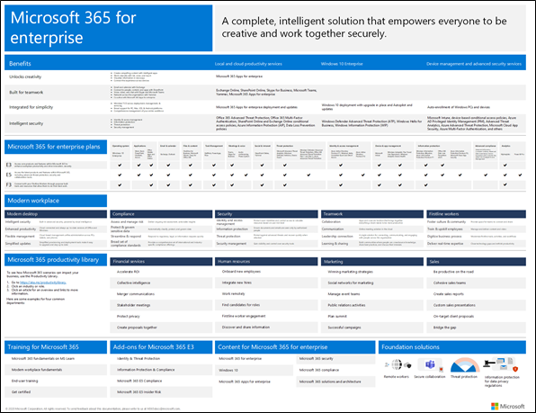

# Información general de Microsoft 365 para empresas

Microsoft 365 para empresas es una solución completa e inteligente que impulsa la creatividad y permite trabajar en colaboración de forma segura. 

Aunque está diseñado para organizaciones grandes, Microsoft 365 para empresas también se puede usar para pequeñas y medianas empresas que necesiten las funciones de seguridad y productividad más avanzadas. 

## Componentes

Microsoft 365 para empresas consiste en lo siguiente:

| Servicios | Descripción |
|:-------|:-----|
| Aplicaciones y servicios de productividad locales y en la nube | Incluye tanto las aplicaciones de Microsoft 365 para empresas como las aplicaciones de Office más recientes para su equipo PC y Mac (por ejemplo, Word, Excel, PowerPoint, Outlook, etc.) y un conjunto completo de servicios en línea para el correo electrónico, el almacenamiento de archivos y la colaboración, reuniones, entre otros. |
| Windows 10 Enterprise | Se ocupa de las necesidades de las organizaciones grandes y medianas, lo que proporciona a los usuarios la versión más productiva y segura de Windows y los profesionales de IT con una administración completa de aplicaciones, dispositivos y implementación. |
| Servicios de seguridad avanzada y administración de dispositivos | Incluye Microsoft Intune, que es un servicio de administración de movilidad empresarial (EMM) basado en la nube que ayuda a los empleados a ser productivos mientras protege los datos de su organización. |
|||

## Planes

Microsoft 365 para empresas está disponible en tres planes.

| Nombre del plan | Capacidades |
|:-------|:-----|
| E3 | Acceda a productos y funciones principales dentro de Microsoft 365 para mejorar la productividad del lugar de trabajo e impulsar la innovación de forma segura. |
| E5 | Obtenga acceso a los últimos productos y características de Microsoft 365, que incluye protección contra amenazas avanzada, seguridad y herramientas de colaboración. Incluye todas las funciones del plan E3 más avanzadas de seguridad, voz y herramientas de análisis de datos. |
| F3 | Conéctese con los trabajadores de primera línea mediante recursos y herramientas dedicadas que les permiten dar lo mejor de sí. |
|||

Si cuenta con Microsoft 365 E3, puede obtener también estos complementos:

- Protección contra amenazas e identidad
- Information Protection y Centro de cumplimiento de Microsoft 365
- [Cumplimiento de Microsoft 365 E5](https://www.microsoft.com/microsoft-365/business/e5-compliance)
- Riesgos internos de Microsoft 365 E5

Estas ofertas contienen características adicionales que se incluyen en Microsoft 365 E5.

Para obtener más información, consulte [Características y funcionalidades de cada plan](https://www.microsoft.com/microsoft-365/compare-all-microsoft-365-plans)

## Esquema general

El [póster de Microsoft 365 para empresas](../downloads/Microsoft365Enterprise.pdf) muestra una ubicación central para que la pueda observar:

- Ventajas de Microsoft 365 para empresas y cómo las aplicaciones y servicios se asocian con los valores esenciales de su empresa
- Los planes de Microsoft 365 para empresas y los componentes que contienen 
- Los componentes clave del Modern Workplace, que Microsoft 365 para empresas dispone
- La [Biblioteca de productividad de Microsoft 365](https://www.microsoft.com/microsoft-365/success/) y escenarios representativos para algunos de los departamentos comunes de la organización

Para descargar una copia del póster, haga clic [aquí](https://github.com/MicrosoftDocs/microsoft-365-docs/raw/public/microsoft-365/downloads/Microsoft365Enterprise.pdf).

## Realizar la transición en toda la organización

Para tener una mejor idea de cómo mover toda la organización a los productos y servicios de Microsoft 365 para empresas, consulte el [póster de transición](../downloads/transition-org-to-m365.pdf).

Este póster de dos páginas es una forma rápida de realizar un inventario de su infraestructura existente y conseguir las instrucciones y moverse al producto o servicio correspondiente de Microsoft 365 para empresas. Incluye productos de Windows y Office y otros elementos de infraestructura y seguridad, tales como la administración de dispositivos, la identidad, la información y la protección contra amenazas.

Puede [descargar este póster](https://github.com/MicrosoftDocs/microsoft-365-docs/raw/public/microsoft-365/downloads/transition-org-to-m365.pdf) para imprimirlo en formato de carta, DIN o cartel (11 x 17 pulgadas).

## Finalización del soporte técnico para clientes y servidores de Windows 7 y Office 2010

El soporte de [Windows 7](https://aka.ms/win7upgrade) terminó el **14 de enero de 2020**.

El soporte técnico para estos productos terminará el **13 de octubre de 2020**:

- [Office 2010](https://docs.microsoft.com/DeployOffice/office-2010-end-support-roadmap)
- [Exchange Server 2010](exchange-2010-end-of-support.md)

El soporte técnico para [SharePoint Server 2010](upgrade-from-sharepoint-2010.md) terminará el **13 de abril de 2021**.

Para obtener un resumen visual de las opciones de actualización, migración y desplazamiento a la nube de estos productos, vea el [póster de fin de soporte técnico.](../downloads/Office2010Windows7EndOfSupport.pdf)

En este póster de una página verá de forma rápida las distintas rutas para evitar que finalice el soporte técnico de los productos de cliente y servidor de Windows 7 y Office 2010. Se han resaltado las rutas de acceso preferentes y la compatibilidad con las opciones de Microsoft 365 para empresas.

Puede [descargar este póster](https://github.com/MicrosoftDocs/microsoft-365-docs/raw/public/microsoft-365/downloads/Office2010Windows7EndOfSupport.pdf) para imprimirlo en formato de carta, DIN o cartel (11 x 17 pulgadas).

## Planear e implementar

Existen tres formas de planear la implementación de los productos, las características y los componentes de Microsoft 365 para empresas:

1. En asociación con FastTrack
  
   Con FastTrack, los ingenieros de Microsoft le ayudan a pasarse a la nube a su propio ritmo. Consulte [FastTrack para Microsoft 365](https://fasttrack.microsoft.com/microsoft365).
  
2. Con la ayuda de los servicios de consultoría de Microsoft o un [partner de Microsoft](https://partner.microsoft.com/).

   Los consultores pueden analizar su infraestructura actual y crear un plan para incorporar todo el software y los servicios de Microsoft 365 para empresas.

3. Por cuenta propia

   Empiece con un [plan de red](networking-roadmap-microsoft-365.md) para crear o comprobar la infraestructura existente y las cargas de trabajo de productividad. 

Vea cómo [The Contoso Corporation](contoso-overview.md), una empresa multinacional ficticia pero representativa, implementó Microsoft 365 para empresas.

## Productos adicionales de Microsoft 365

- [Microsoft 365 Empresa Premium](https://docs.microsoft.com/microsoft-365/business/)
 
  Obtenga información sobre cómo combinar las mejores funciones de productividad y colaboración con soluciones de seguridad y administración de dispositivos para proteger los datos empresariales para pequeñas y medianas empresas (pymes).

- [Microsoft 365 Educación](https://docs.microsoft.com/education)
 
  Permite a los profesores impulsar la creatividad, fomentar el trabajo en equipo y proporcionar una experiencia segura y sencilla en una única solución asequible diseñada para el ámbito educativo.

- [Microsoft 365 y la Administración pública](https://www.microsoft.com/microsoft-365/government)
 
  Permita a los empleados del sector público de Estados Unidos trabajar juntos de forma segura.

## Formación de Microsoft 365

Obtenga formación y trabaje para obtener la certificación de Microsoft 365. Empiece con los [Aspectos básicos de Microsoft 365](https://docs.microsoft.com/learn/paths/m365-fundamentals/)

## Consulte también

[Página del producto Microsoft 365 para empresas](https://www.microsoft.com/microsoft-365/enterprise)
