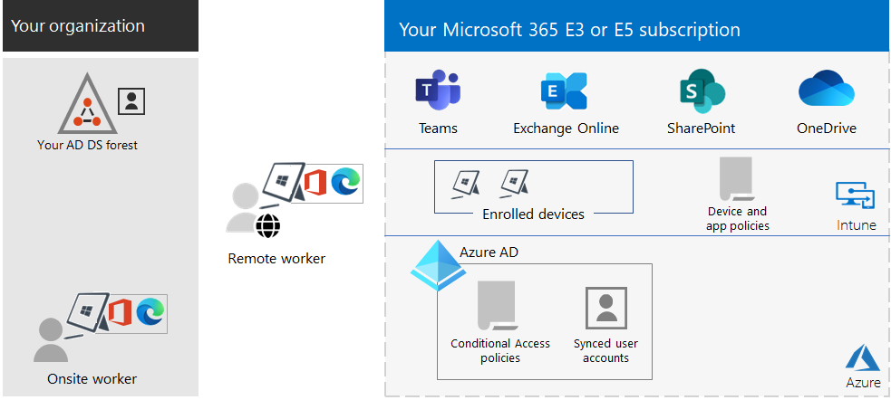

# Información general de Microsoft 365 para empresas

Microsoft 365 para empresas es una solución completa e inteligente que impulsa la creatividad y permite trabajar en colaboración de forma segura.

Aunque está diseñado para organizaciones grandes, Microsoft 365 para empresas también puede usarse para empresas pequeñas y medianas que necesiten funciones de seguridad y productividad más avanzadas.

## Componentes

Microsoft 365 para empresas consiste en lo siguiente:

|Servicios|Descripción|
|---|---|
|Aplicaciones locales y basadas en la nube, y servicios de productividad|Incluye tanto las aplicaciones de Microsoft 365 para empresas como las aplicaciones de Office más recientes para su equipo PC y Mac (por ejemplo, Word, Excel, PowerPoint, Outlook, etc.) y un conjunto completo de servicios en línea para el correo electrónico, el almacenamiento de archivos y la colaboración, reuniones, entre otros.|
|Windows 10 Enterprise|Satisface las necesidades de organizaciones grandes y medianas. Es la versión más productiva y segura de Windows para los usuarios. Para los profesionales de IT, también proporciona una administración completa de implementación, dispositivos y aplicaciones.|
|Servicios de seguridad avanzada y administración de dispositivos|Incluye Microsoft Intune, un servicio de administración de movilidad empresarial basado en la nube que ayuda a los empleados a ser productivos mientras protegen los datos de su organización.|
|||

## Planes

Microsoft 365 para empresas está disponible en tres planes.

|Nombre del plan|Capacidades|
|---|---|
|E3|Acceda a los productos y funciones principales de Microsoft 365 para mejorar la productividad del lugar de trabajo e impulsar la innovación de forma segura.|
|E5|Acceda a los productos y las características más recientes de Microsoft 365. Estos incluyen Microsoft Defender para Office 365, herramientas de seguridad y herramientas de colaboración. Este plan incluye todas las funciones de E3, además de herramientas avanzadas seguridad, voz y herramientas de análisis de datos.|
|F3|Conéctese con los trabajadores de primera línea a través de recursos y herramientas dedicados que los ayuden a hacer su mejor trabajo.|
|||

Si cuenta con Microsoft 365 E3, puede obtener también estos complementos:

- Protección contra amenazas e identidad
- Information Protection y Centro de cumplimiento de Microsoft 365
- [Cumplimiento de Microsoft 365 E5](https://www.microsoft.com/microsoft-365/business/e5-compliance)
- Riesgos internos de Microsoft 365 E5

Los usuarios de Microsoft 365 E3 pueden usar estos complementos para aprovechar algunas de las características adicionales que incluye Microsoft 365 E5.

Para obtener más información, consulte [Características y funcionalidades de cada plan](https://www.microsoft.com/microsoft-365/compare-all-microsoft-365-plans)

## Esquema general

El [póster de Microsoft 365 para empresas](../downloads/Microsoft365Enterprise.pdf) muestra una ubicación central para que la pueda observar:

- Las ventajas de Microsoft 365 para empresas y cómo sus aplicaciones y servicios se asocian con los valores esenciales de la empresa.
- Los planes de Microsoft 365 para empresas y los componentes que contiene.
- Los componentes clave del ambiente de trabajo moderno que propicia Microsoft 365 para empresas.
- La [Biblioteca de productividad de Microsoft 365](https://www.microsoft.com/microsoft-365/success/) y escenarios representativos para algunos de los departamentos comunes de la organización.

También puede [descargar una copia del póster](https://github.com/MicrosoftDocs/microsoft-365-docs/raw/public/microsoft-365/downloads/Microsoft365Enterprise.pdf).

## Realizar la transición en toda la organización

Para tener una mejor idea de cómo trasladar a toda la organización a los productos y servicios de Microsoft 365 para empresas, consulte el [póster de transición](https://download.microsoft.com/download/2/c/7/2c7bcc04-aae3-4604-9707-1ffff66b9851/transition-org-to-m365.pdf).

Este póster de dos páginas es una forma rápida de hacer un inventario de la infraestructura existente. Le ayuda a encontrar las instrucciones para pasar al producto o servicio correspondiente en Microsoft 365 para empresas. Incluye los productos de Windows y Office, así como otros elementos de infraestructura y seguridad, como la administración de dispositivos, la identidad y la información y protección contra amenazas.

## Finalización del soporte técnico para clientes y servidores de Windows 7 y Office 2010

El soporte de [Windows 7](https://aka.ms/win7upgrade) terminó el **14 de enero de 2020**.

El soporte técnico para estos productos terminó el **13 de octubre de 2020**:

- [Office 2010](/DeployOffice/office-2010-end-support-roadmap)
- [Exchange Server 2010](exchange-2010-end-of-support.md)

El soporte técnico para [SharePoint Server 2010](upgrade-from-sharepoint-2010.md) terminará el **13 de abril de 2021**.

Para obtener un resumen visual de las opciones de actualización, migración y desplazamiento a la nube de estos productos, vea el [póster de fin de soporte técnico.](../downloads/Office2010Windows7EndOfSupport.pdf)

En este póster de una página verá de forma rápida las distintas rutas para evitar que finalice el soporte técnico de los productos de cliente y servidor de Windows 7 y Office 2010. Se han resaltado las rutas de acceso preferentes y la compatibilidad con las opciones de Microsoft 365 para empresas.

Puede [descargar este póster](https://github.com/MicrosoftDocs/microsoft-365-docs/raw/public/microsoft-365/downloads/Office2010Windows7EndOfSupport.pdf) para imprimirlo en formato de carta, DIN o cartel (11 x 17 pulgadas).

## Planear e implementar

Existen tres formas de planear e implementar los productos, las características y los componentes de Microsoft 365 para empresas:

- En asociación con FastTrack

   Con FastTrack, los ingenieros de Microsoft le ayudan a pasarse a la nube a su propio ritmo. Consulte [FastTrack para Microsoft 365](https://fasttrack.microsoft.com/microsoft365).

- Con la ayuda de los Servicios de consultoría de Microsoft o de un [asociado de Microsoft](https://partner.microsoft.com/)

   Los consultores pueden analizar su infraestructura actual y ayudarle a desarrollar un plan para incorporar todo el software y los servicios de Microsoft 365 para empresas.

- Por cuenta propia

   Empiece con el [Plan de desarrollo de redes](networking-roadmap-microsoft-365.md) para crear o comprobar la infraestructura existente y las cargas de trabajo de productividad.

Para obtener un ejemplo de cómo una organización multinacional ficticia pero representativa implementó Microsoft 365 para empresas, consulte el [Caso práctico de Contoso Corporation](contoso-overview.md).

## Productos adicionales de Microsoft 365

- [Microsoft 365 Empresa Premium](../business/index.yml)

  Obtenga las mejores funciones de productividad y colaboración de su clase con las soluciones de seguridad y administración de dispositivos para proteger los datos del negocio para empresas pequeñas y medianas.

- [Microsoft 365 Educación](/education)

  Permite a los profesores impulsar la creatividad, fomentar el trabajo en equipo y proporcionar una experiencia segura y sencilla en una única solución asequible diseñada para el ámbito educativo.

- [Microsoft 365 y la Administración pública](https://www.microsoft.com/microsoft-365/government)

  Permita a los empleados del sector público de Estados Unidos trabajar juntos de forma segura.

## Mejor con Surface y el explorador Microsoft Edge

Optimice la productividad segura y integrada de su usuario con la combinación óptima de Microsoft 365 para empresas, dispositivos Microsoft Surface y el explorador Microsoft Edge. Esta integración entre productos proporciona:

- Una infraestructura de seguridad de identidad e inicio de sesión común.
- Aplicaciones locales y en la nube integradas para búsquedas, colaboración, productividad y cumplimiento.
- Seguridad completa e integrada para el hardware, el explorador, las aplicaciones locales y las aplicaciones en la nube.
- Una infraestructura común para la administración de TI de las instalaciones y actualizaciones.

Este es un ejemplo para una organización empresarial.

Para más información y ejemplos de configuración de una pequeña y mediana empresa y una institución educativa, descargue el [póster "Mejor juntos"](https://download.microsoft.com/download/2/8/d/28db0cf9-2f5a-4f63-91e2-46ff5c4d3baf/microsoft-best-together-poster.pdf).

## Formación de Microsoft 365

Para obtener más información sobre Microsoft 365 y sobre cómo obtener la certificación de Microsoft 365, puede empezar con los [Fundamentos de la certificación de Microsoft 365](/learn/paths/m365-fundamentals/).

## Consulte también

[Página del producto Microsoft 365 para empresas](https://www.microsoft.com/microsoft-365/enterprise)