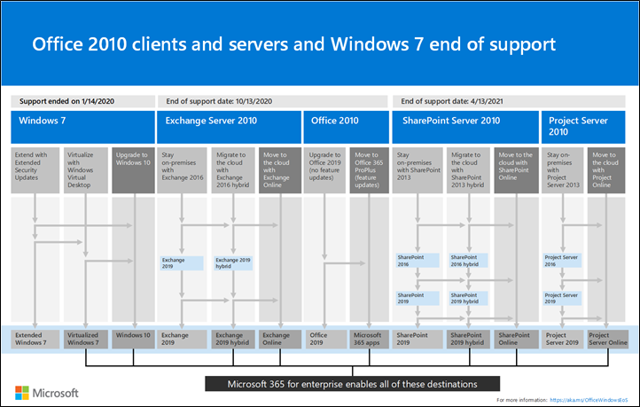

# Información general de Microsoft 365 para empresasMicrosoft 365 for enterprise overview

Microsoft 365 para empresas es una solución completa e inteligente que impulsa la creatividad y permite trabajar en colaboración de forma segura.Microsoft 365 for enterprise is a complete, intelligent solution that empowers everyone to be creative and work together securely.

Aunque está diseñado para organizaciones grandes, Microsoft 365 para empresas también puede usarse para empresas pequeñas y medianas que necesiten funciones de seguridad y productividad más avanzadas.Microsoft 365 for enterprise is designed for large organizations, but it can also be used for medium-sized and small businesses that need the most advanced security and productivity capabilities.

## ComponentesComponents

Microsoft 365 para empresas consiste en lo siguiente:Microsoft 365 for enterprise consists of:

|ServiciosServices|DescripciónDescription|
|---|---|
|Aplicaciones locales y basadas en la nube, y servicios de productividadLocal apps and cloud-based apps and productivity services|Incluye tanto las aplicaciones de Microsoft 365 para empresas como las aplicaciones de Office más recientes para su equipo PC y Mac (por ejemplo, Word, Excel, PowerPoint, Outlook, etc.) y un conjunto completo de servicios en línea para el correo electrónico, el almacenamiento de archivos y la colaboración, reuniones, entre otros.Includes both Microsoft 365 Apps for enterprise, the latest Office apps for your PC and Mac (such as Word, Excel, PowerPoint, Outlook, and others), and a full suite of online services for email, file storage and collaboration, meetings, and more.|
|Windows 10 EnterpriseWindows 10 Enterprise|Satisface las necesidades de organizaciones grandes y medianas.Meets the needs of both large and midsize organizations. Es la versión más productiva y segura de Windows para los usuarios.It's the most productive and secure version of Windows for users. Para los profesionales de IT, también proporciona una administración completa de implementación, dispositivos y aplicaciones.For IT professionals, it also provides comprehensive deployment, device, and app management.|
|Servicios de seguridad avanzada y administración de dispositivosDevice management and advanced security services|Incluye Microsoft Intune, un servicio de administración de movilidad empresarial basado en la nube que ayuda a los empleados a ser productivos mientras protegen los datos de su organización.Includes Microsoft Intune, which is a cloud-based enterprise mobility management service that helps enable your workforce to be productive while protecting your organization data.|
|||

## PlanesPlans

Microsoft 365 para empresas está disponible en tres planes.Microsoft 365 for enterprise is available in three plans.

|Nombre del planPlan name|CapacidadesCapabilities|
|---|---|
|E3E3|Acceda a los productos y funciones principales de Microsoft 365 para mejorar la productividad del lugar de trabajo e impulsar la innovación de forma segura.Access the Microsoft 365 core products and features to securely enhance workplace productivity and drive innovation.|
|E5E5|Acceda a los productos y las características más recientes de Microsoft 365.Access the Microsoft 365 latest products and features. Estos incluyen Microsoft Defender para Office 365, herramientas de seguridad y herramientas de colaboración.These include Defender for Office 365, security tools, and collaboration tools. Este plan incluye todas las funciones de E3, además de herramientas avanzadas seguridad, voz y herramientas de análisis de datos.This plan includes all E3 capabilities, plus advanced security, voice, and data analysis tools.|
|F3F3|Conéctese con los trabajadores de primera línea a través de recursos y herramientas dedicados que los ayuden a hacer su mejor trabajo.Connect with your first-line workers through purpose-built tools and resources that they can use to help them do their best work.|
|||

Si cuenta con Microsoft 365 E3, puede obtener también estos complementos:If you have Microsoft 365 E3, you can also get these add-ons:

- Protección contra amenazas e identidadIdentity & Threat Protection
- Information Protection y Centro de cumplimiento de Microsoft 365Information Protection & Compliance
- [Cumplimiento de Microsoft 365 E5Microsoft 365 E5 Compliance](https://www.microsoft.com/microsoft-365/business/e5-compliance)
- Riesgos internos de Microsoft 365 E5Microsoft 365 E5 Insider Risk

Los usuarios de Microsoft 365 E3 pueden usar estos complementos para aprovechar algunas de las características adicionales que incluye Microsoft 365 E5.Microsoft 365 E3 users can use these add-ons to take advantage of some of the additional features Microsoft 365 E5 includes.

Para obtener más información, consulte [Características y funcionalidades de cada plan](https://www.microsoft.com/microsoft-365/compare-all-microsoft-365-plans)For more information, see [Features and capabilities for each plan](https://www.microsoft.com/microsoft-365/compare-all-microsoft-365-plans).

## Esquema generalGet the big picture

El [póster de Microsoft 365 para empresas](../downloads/Microsoft365Enterprise.pdf) muestra una ubicación central para que la pueda observar:The [Microsoft 365 for enterprise poster](../downloads/Microsoft365Enterprise.pdf) is a central location for you to view:

- Las ventajas de Microsoft 365 para empresas y cómo sus aplicaciones y servicios se asocian con los valores esenciales de la empresa.The benefits of Microsoft 365 for enterprise, and how apps and services map to its value pillars.
- Los planes de Microsoft 365 para empresas y los componentes que contiene.Microsoft 365 for enterprise plans and which components they contain.
- Los componentes clave del ambiente de trabajo moderno que propicia Microsoft 365 para empresas.The key components of the Microsoft modern workplace, which Microsoft 365 for enterprise enables.
- La [Biblioteca de productividad de Microsoft 365](https://www.microsoft.com/microsoft-365/success/) y escenarios representativos para algunos de los departamentos comunes de la organización.The [Microsoft 365 Productivity Library](https://www.microsoft.com/microsoft-365/success/) and representative scenarios for some common organization departments.

También puede [descargar una copia del póster](https://github.com/MicrosoftDocs/microsoft-365-docs/raw/public/microsoft-365/downloads/Microsoft365Enterprise.pdf).You can also [download a copy of the poster](https://github.com/MicrosoftDocs/microsoft-365-docs/raw/public/microsoft-365/downloads/Microsoft365Enterprise.pdf).

## Realizar la transición en toda la organizaciónTransition your entire organization

Para tener una mejor idea de cómo trasladar a toda la organización a los productos y servicios de Microsoft 365 para empresas, consulte el [póster de transición](https://download.microsoft.com/download/2/c/7/2c7bcc04-aae3-4604-9707-1ffff66b9851/transition-org-to-m365.pdf).To get a better picture about how to move your entire organization to the products and services in Microsoft 365 for enterprise, see the [transition poster](https://download.microsoft.com/download/2/c/7/2c7bcc04-aae3-4604-9707-1ffff66b9851/transition-org-to-m365.pdf).

Este póster de dos páginas es una forma rápida de hacer un inventario de la infraestructura existente.This two-page poster is a quick way to inventory your existing infrastructure. Le ayuda a encontrar las instrucciones para pasar al producto o servicio correspondiente en Microsoft 365 para empresas.It helps you to find guidance and move to the corresponding product or service in Microsoft 365 for enterprise. Incluye los productos de Windows y Office, así como otros elementos de infraestructura y seguridad, como la administración de dispositivos, la identidad y la información y protección contra amenazas.It includes Windows and Office products and other infrastructure and security elements, such as device management, identity, and information and threat protection.

## Finalización del soporte técnico para clientes y servidores de Windows 7 y Office 2010End of support for Windows 7 and Office 2010 clients and servers

El soporte de [Windows 7](https://aka.ms/win7upgrade) terminó el **14 de enero de 2020**.[Windows 7](https://aka.ms/win7upgrade) reached end of support on **January 14, 2020**.

El soporte técnico para estos productos terminó el **13 de octubre de 2020**:These products reached end of support on **October 13, 2020**:

- [Office 2010Office 2010](/DeployOffice/office-2010-end-support-roadmap)
- [Exchange Server 2010Exchange Server 2010](exchange-2010-end-of-support.md)

El soporte técnico para [SharePoint Server 2010](upgrade-from-sharepoint-2010.md) terminará el **13 de abril de 2021**.[SharePoint Server 2010](upgrade-from-sharepoint-2010.md) will reach end of support on **April 13, 2021**.

Para obtener un resumen visual de las opciones de actualización, migración y desplazamiento a la nube de estos productos, vea el [póster de fin de soporte técnico.](../downloads/Office2010Windows7EndOfSupport.pdf)For a visual summary of the upgrade, migrate, and move-to-the-cloud options for these products, see the [end of support poster](../downloads/Office2010Windows7EndOfSupport.pdf).

En este póster de una página verá de forma rápida las distintas rutas para evitar que finalice el soporte técnico de los productos de cliente y servidor de Windows 7 y Office 2010. Se han resaltado las rutas de acceso preferentes y la compatibilidad con las opciones de Microsoft 365 para empresas.This one-page poster is a quick way to understand the various paths you can take to prevent Windows 7 and Office 2010 client and server products from reaching end of support, with preferred paths and support in Microsoft 365 for enterprise highlighted.

Puede [descargar este póster](https://github.com/MicrosoftDocs/microsoft-365-docs/raw/public/microsoft-365/downloads/Office2010Windows7EndOfSupport.pdf) para imprimirlo en formato de carta, DIN o cartel (11 x 17 pulgadas).You can also [download this poster](https://github.com/MicrosoftDocs/microsoft-365-docs/raw/public/microsoft-365/downloads/Office2010Windows7EndOfSupport.pdf) and print it in letter, legal, or tabloid (11 x 17) formats.

## Planear e implementarPlan for and deploy

Existen tres formas de planear e implementar los productos, las características y los componentes de Microsoft 365 para empresas:There are three ways to plan for and deploy the products, features, and components of Microsoft 365 for enterprise:

- En asociación con FastTrackIn partnership with FastTrack

   Con FastTrack, los ingenieros de Microsoft le ayudan a pasarse a la nube a su propio ritmo.With FastTrack, Microsoft engineers help you move to the cloud at your own pace. Consulte [FastTrack para Microsoft 365](https://fasttrack.microsoft.com/microsoft365).See [FastTrack for Microsoft 365](https://fasttrack.microsoft.com/microsoft365).

- Con la ayuda de los Servicios de consultoría de Microsoft o de un [asociado de Microsoft](https://partner.microsoft.com/)With the help of Microsoft Consulting Services or a [Microsoft partner](https://partner.microsoft.com/)

   Los consultores pueden analizar su infraestructura actual y ayudarle a desarrollar un plan para incorporar todo el software y los servicios de Microsoft 365 para empresas.Consultants can analyze your current infrastructure and help you develop a plan to incorporate all the software and services of Microsoft 365 for enterprise.

- Por cuenta propiaDo it yourself

   Empiece con el [Plan de desarrollo de redes](networking-roadmap-microsoft-365.md) para crear o comprobar la infraestructura existente y las cargas de trabajo de productividad.Start with the [Networking roadmap](networking-roadmap-microsoft-365.md) to build out or verify your existing infrastructure and productivity workloads.

Para obtener un ejemplo de cómo una organización multinacional ficticia pero representativa implementó Microsoft 365 para empresas, consulte el [Caso práctico de Contoso Corporation](contoso-overview.md).For an example of how a fictional but representative multinational organization has deployed Microsoft 365 for enterprise, see the [Contoso Corporation case study](contoso-overview.md).

## Productos adicionales de Microsoft 365Additional Microsoft 365 products

- [Microsoft 365 Empresa PremiumMicrosoft 365 Business Premium](../business/index.yml)

  Obtenga las mejores funciones de productividad y colaboración de su clase con las soluciones de seguridad y administración de dispositivos para proteger los datos del negocio para empresas pequeñas y medianas.Bring together the best-in-class productivity and collaboration capabilities with device management and security solutions to safeguard business data for small and midsize businesses.

- [Microsoft 365 EducaciónMicrosoft 365 Education](/education)

  Permite a los profesores impulsar la creatividad, fomentar el trabajo en equipo y proporcionar una experiencia segura y sencilla en una única solución asequible diseñada para el ámbito educativo.Empower educators to unlock creativity, promote teamwork, and provide a simple and safe experience in a single, affordable solution built for education.

- [Microsoft 365 y la Administración públicaMicrosoft 365 Government](https://www.microsoft.com/microsoft-365/government)

  Permita a los empleados del sector público de Estados Unidos trabajar juntos de forma segura.Empower United States public sector employees to work together, securely.

## Mejor con Surface y el explorador Microsoft EdgeBest together with Surface and the Edge browser

Optimice la productividad segura y integrada de su usuario con la combinación óptima de Microsoft 365 para empresas, dispositivos Microsoft Surface y el explorador Microsoft Edge.Optimize your user’s integrated and secure productivity with the best-together combination of Microsoft 365 for enterprise, Microsoft Surface devices, and the Microsoft Edge browser. Esta integración entre productos proporciona:This cross-product integration provides:

- Una infraestructura de seguridad de identidad e inicio de sesión común.A common identity and sign-in security infrastructure.
- Aplicaciones locales y en la nube integradas para búsquedas, colaboración, productividad y cumplimiento.Integrated local and cloud apps for search, collaboration, productivity, and compliance.
- Seguridad completa e integrada para el hardware, el explorador, las aplicaciones locales y las aplicaciones en la nube.Comprehensive and integrated security for hardware, browser, local app, and cloud apps.
- Una infraestructura común para la administración de TI de las instalaciones y actualizaciones.A common infrastructure for IT management of installs and updates.

Este es un ejemplo para una organización empresarial.Here is an example for an enterprise organization.

Para más información y ejemplos de configuración de una pequeña y mediana empresa y una institución educativa, descargue el [póster "Mejor juntos"](https://download.microsoft.com/download/2/8/d/28db0cf9-2f5a-4f63-91e2-46ff5c4d3baf/microsoft-best-together-poster.pdf).For more information and configuration examples for a small and medium business and an educational institution, download the [Best together poster](https://download.microsoft.com/download/2/8/d/28db0cf9-2f5a-4f63-91e2-46ff5c4d3baf/microsoft-best-together-poster.pdf).

## Formación de Microsoft 365Microsoft 365 training

Para obtener más información sobre Microsoft 365 y sobre cómo obtener la certificación de Microsoft 365, puede empezar con los [Fundamentos de la certificación de Microsoft 365](/learn/paths/m365-fundamentals/).To learn more about Microsoft 365 and work toward a Microsoft 365 certification, you can start with [Microsoft 365 Certified: Fundamentals](/learn/paths/m365-fundamentals/).

## Consulte tambiénSee also

[Página del producto Microsoft 365 para empresasMicrosoft 365 for enterprise product page](https://www.microsoft.com/microsoft-365/enterprise)