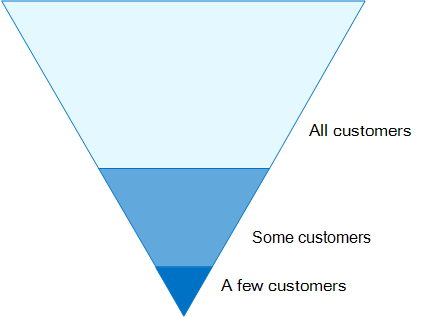
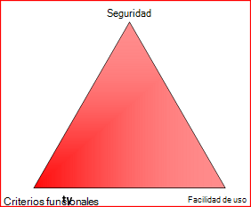

# Configuraciones de acceso a dispositivos e identidades

En esta serie de artículos se describe cómo configurar el acceso seguro a los servicios en la nube mediante productos de Enterprise Mobility + Security (EMS) mediante la implementación de un entorno y una configuración recomendados, incluido un conjunto de directivas de acceso condicional y funcionalidades relacionadas. EMS es un componente principal de Microsoft 365. Puede usar esta guía para proteger el acceso a todos los servicios que están integrados con Azure Active Directory, incluidos los servicios de Microsoft 365, otros servicios de SaaS y aplicaciones locales publicadas con el proxy de aplicación de Azure AD. 

Estas recomendaciones están alineadas con la puntuación segura de Microsoft, así como con la [puntuación de identidad en Azure ad](https://docs.microsoft.com/azure/active-directory/fundamentals/identity-secure-score), y aumentan estos resultados para la organización. Estas recomendaciones también le ayudarán a implementar estos [cinco pasos para proteger su infraestructura de identidades](https://docs.microsoft.com/azure/security/azure-ad-secure-steps). 

Microsoft entiende que algunas organizaciones tienen requisitos de entorno únicos o complejidades. Si es una de estas organizaciones, use estas recomendaciones como punto de partida. Sin embargo, la mayoría de las organizaciones pueden implementar estas recomendaciones como se recomiendan. 

## Público objetivo

Estas recomendaciones están destinadas a arquitectos empresariales y profesionales de ti familiarizados con [Office 365](https://technet.microsoft.com/library/dn127064(v=office.14).aspx) y [Microsoft Enterprise Mobility + Security](https://microsoft.com/ems), que incluye, entre otros, Azure Active Directory (identidad), Microsoft Intune (administración de dispositivos) y Azure Information Protection (protección de datos).

### Entorno del cliente

Las directivas recomendadas se aplican a las organizaciones empresariales que operan completamente en la nube de Microsoft y a los clientes con una infraestructura híbrida (implementada tanto en local como en la nube de Microsoft).

Muchas de las recomendaciones proporcionadas dependen de los servicios disponibles solo con licencias de Enterprise Mobility + Security (EMS) E5. Las recomendaciones presentadas suponen plenas capacidades de licencia EMS E5.

Para las organizaciones que no tienen licencias de Enterprise Mobility + Security E5, Microsoft le recomienda al menos implementar capacidades de protección de Azure AD Baseline que estén incluidas en todos los planes. Encontrará más información en el artículo, [What is Baseline Protection](/azure/active-directory/active-directory-conditional-access-baseline-protection), en la biblioteca de Azure ad.

### ADVERTENCIAS

Es posible que su organización esté sujeta a requisitos normativos o de cumplimiento normativo, incluidas recomendaciones específicas que puedan requerir la aplicación de directivas que difieran de estas configuraciones recomendadas. Estas configuraciones recomiendan controles de uso que históricamente no han estado disponibles. Estos controles se recomiendan porque se cree que representan un equilibrio entre la seguridad y la productividad.  

Hemos hecho lo mejor para contar con una amplia variedad de requisitos de protección organizacional, pero no podemos tener en cuenta todos los requisitos posibles o todos los aspectos exclusivos de su organización.

## Tres niveles de protección

La mayoría de las organizaciones tienen requisitos concretos relacionados con la seguridad y la protección de datos. Estos requisitos varían dentro de las organizaciones según el segmento sectorial y las funciones de trabajo. Por ejemplo, el departamento legal y los administradores pueden requerir controles adicionales de protección de la información y seguridad en torno a su correspondencia de correo electrónico que no son necesarios para otros usuarios de la unidad de negocio. 

Cada sector además tiene su propio conjunto de normas especializadas. En lugar de proporcionar una lista de todas las opciones de seguridad posibles o una recomendación por segmento de la industria o función de trabajo, se han proporcionado recomendaciones para tres niveles distintos de seguridad y protección que se pueden aplicar en función de la granularidad de sus necesidades.

- **Protección de línea base**: le recomendamos que establezca un estándar mínimo para la protección de datos, así como las identidades y los dispositivos que tienen acceso a sus datos. Puede seguir estas recomendaciones de línea base para proporcionar una protección segura predeterminada que satisfaga las necesidades de muchas organizaciones.
- **Protección confidencial**: algunos clientes tienen un subconjunto de datos que deben protegerse en niveles superiores o pueden requerir que todos los datos estén protegidos en un nivel superior. Puede aplicar una mayor protección a todos o conjuntos de datos específicos en su entorno de Microsoft 365. Se recomienda proteger las identidades y los dispositivos que acceden a información confidencial con niveles de seguridad comparables.  
- **Altamente regulado**: algunas organizaciones pueden tener una pequeña cantidad de datos clasificados con mucha clasificación, secretos comerciales consititutes o datos regulados. Microsoft proporciona capacidades para ayudar a las organizaciones a cumplir estos requisitos, incluida protección adicional para identidades y dispositivos.

En esta guía se muestra cómo implementar la protección de las identidades y los dispositivos de cada uno de estos niveles de protección. Use esta guía como punto de partida para su organización y ajuste las directivas para cumplir los requisitos específicos de su organización.

Es importante usar niveles de protección coherentes en los datos, las identidades y los dispositivos. Por ejemplo, si implementa esta guía, asegúrese de proteger los datos en niveles comparables. Estos modelos de arquitectura muestran las capacidades comparables.

**Protección de identidades y dispositivos para Office 365** 
 
[PDF](https://go.microsoft.com/fwlink/p/?linkid=841656) | [Visio](https://go.microsoft.com/fwlink/p/?linkid=841657) | [Más idiomas](https://www.microsoft.com/download/details.aspx?id=55032)

**Soluciones de protección de archivos en Office 365** 
 
[PDF](https://download.microsoft.com/download/7/8/9/789645A5-BD10-4541-BC33-F8D1EFF5E911/MSFT_cloud_architecture_O365%20file%20protection.pdf) | [Visio](https://download.microsoft.com/download/7/8/9/789645A5-BD10-4541-BC33-F8D1EFF5E911/MSFT_cloud_architecture_O365%20file%20protection.vsdx)

## Equilibrio entre seguridad y productividad

La implementación de cualquier estrategia de seguridad requiere equilibrio entre la seguridad y la productividad. Es útil evaluar cómo afecta cada decisión al equilibrio de seguridad, funcionalidad y facilidad de uso.

Las recomendaciones proporcionadas se basan en los siguientes principios:

- Conozca a su público y sea flexible con respecto a sus requisitos de seguridad y funcionamiento.
- Aplique una directiva de seguridad justo a tiempo y asegúrese de que es significativa.

## Servicios y conceptos de protección de acceso a dispositivos e identidades

Microsoft 365 Enterprise está diseñado para grandes organizaciones e integra Office 365 Enterprise, Windows 10 Enterprise y Enterprise Mobility + Security (EMS), para que todo el mundo pueda ser creativo y trabajar juntos de manera segura.

En esta sección se proporciona información general sobre los servicios y capacidades de Microsoft 365 que son importantes para el acceso a los dispositivos e identidades.

### Microsoft Azure Active Directory

Azure AD ofrece un conjunto completo de capacidades de administración de identidades. Para proteger el acceso, le recomendamos que use las siguientes capacidades:

- **[Autoservicio de restablecimiento de contraseña (SSPR)](/azure/active-directory/authentication/concept-sspr-howitworks)**: permita que los usuarios restablezcan sus contraseñas de forma segura y sin intervención del Departamento de soporte técnico; para ello, proporcione la comprobación de varios métodos de autenticación que el administrador puede controlar.

- **[Autenticación multifactor (MFA)](/azure/active-directory/authentication/concept-mfa-howitworks)**: MFA requiere que los usuarios proporcionen dos formas de verificación, como una contraseña de usuario y una notificación de la aplicación Microsoft Authenticator o una llamada telefónica. La MFA reduce en gran medida el riesgo de que se pueda usar una identidad robada para tener acceso al entorno.

- **[Acceso condicional](/azure/active-directory/conditional-access/overview)**: Azure ad evalúa las condiciones del inicio de sesión de usuario y usa directivas de acceso condicional que se crean para permitir el acceso. Por ejemplo, en esta guía le mostramos cómo crear una directiva de acceso condicional para exigir el cumplimiento de dispositivos para el acceso a datos confidenciales. Esto reduce en gran medida el riesgo de que un pirata informático con una identidad robada pueda tener acceso a sus datos confidenciales. También protege los datos confidenciales de los dispositivos, ya que los dispositivos cumplen requisitos específicos para la seguridad y la salud.

- **[Grupos de Azure ad](/azure/active-directory/fundamentals/active-directory-manage-groups)**: las reglas de acceso condicional, la administración de dispositivos con Intune e incluso los permisos para archivos y sitios de la organización, dependen de la asignación a los grupos de Azure ad y usuarios. Le recomendamos que cree grupos de Azure AD que se correspondan con los niveles de protección que está implementando. Por ejemplo, el personal ejecutivo probablemente es un objetivo de mayor valor para los hackers. Por lo tanto, tiene sentido asignar estos empleados a un grupo de Azure AD y asignar este grupo a las directivas de acceso condicional y otras directivas que impongan un mayor nivel de protección para el acceso.

- **[Registro de dispositivos](/azure/active-directory/devices/overview)**: registra un dispositivo en Azure ad para proporcionar una identidad al dispositivo. Esta identidad se usa para autenticar el dispositivo cuando un usuario inicia sesión y aplica reglas de acceso condicional que requieren equipos compatibles o Unidos a un dominio. Para esta guía, usamos el registro de dispositivos para registrar automáticamente equipos con Windows Unidos a un dominio. El registro de dispositivos es un requisito previo para la administración de dispositivos con Intune. 

- **[Protección de identidad de Azure ad](/azure/active-directory/identity-protection/overview)**: Azure ad Identity Protection le permite detectar posibles vulnerabilidades que afectan a las identidades de su organización y configurar la Directiva de corrección automatizada para el riesgo de inicio de sesión de usuario, el riesgo de inicio de sesión de alta, medio e insuficiente. Esta guía se basa en esta evaluación de riesgos para aplicar directivas de acceso condicional para la autenticación multifactor. Esta guía también incluye una directiva de acceso condicional que requiere que los usuarios cambien su contraseña si se detecta una actividad de alto riesgo para su cuenta.

### Microsoft Intune

[Intune](https://docs.microsoft.com/intune/introduction-intune) es el servicio de administración de dispositivos móviles basado en la nube de Microsoft. Esta guía recomienda la administración de dispositivos de Windows con Intune y recomienda la configuración de directivas de cumplimiento de dispositivos. Intune determina si los dispositivos son compatibles y envía los datos a Azure AD para usarlos cuando se aplican directivas de acceso condicional.

#### Protección de aplicaciones de Intune

Las directivas de [protección de aplicaciones de Intune](https://docs.microsoft.com/intune/app-protection-policy) se pueden usar para proteger los datos de su organización en aplicaciones móviles, con o sin inscribir los dispositivos en la administración. Intune ayuda a proteger la información, asegurándose de que sus empleados todavía puedan ser productivos y evitando la pérdida de datos. Mediante la implementación de directivas de nivel de aplicación, puede restringir el acceso a los recursos de la empresa y mantener los datos dentro del control del Departamento de ti.

En esta guía se muestra cómo crear directivas recomendadas para exigir el uso de aplicaciones aprobadas y determinar cómo se pueden usar estas aplicaciones con los datos profesionales.

### Microsoft 365

En esta guía se muestra cómo implementar un conjunto de directivas para proteger el acceso a Office 365, incluidos Exchange Online, SharePoint Online y OneDrive para la empresa. Además de implementar estas directivas, se recomienda aumentar también el nivel de protección del espacio empresarial con estos recursos:

- [Configure el espacio empresarial para aumentar la seguridad](https://docs.microsoft.com/microsoft-365/security/office-365-security/tenant-wide-setup-for-increased-security): estas recomendaciones se aplican a la seguridad de línea base de su espacio empresarial.
- [Plan de seguridad 365 de Microsoft: principales prioridades de los primeros 30 días, 90 días y versiones posteriores](https://docs.microsoft.com/microsoft-365/security/office-365-security/security-roadmap): estas recomendaciones incluyen el registro, el gobierno de datos, el acceso de administrador y la protección contra amenazas.

### Aplicaciones de Microsoft 365 para empresas y Windows 10

Windows 10 y Microsoft 365 apps for Enterprise es el entorno de cliente recomendado para equipos PC. Recomendamos Windows 10, ya que Azure está diseñado para proporcionar la experiencia más fluida posible tanto en local como en Azure AD. Windows 10 también incluye funciones de seguridad avanzada que se pueden administrar a través de Intune. Microsoft 365 apps for Enterprise incluye las versiones más recientes de las aplicaciones de Office. Estos usan la autenticación moderna, que es más segura y un requisito de acceso condicional. Estas aplicaciones también incluyen herramientas de seguridad y cumplimiento mejoradas.

## Aplicación de estas funcionalidades en los tres niveles de protección

La siguiente tabla resume nuestras recomendaciones para usar estas capacidades en los tres niveles de protección.

|Mecanismo de protección|Línea base|Confidencial|Extremadamente regulado|
|:-------------------|:-------|:--------|:---------------|
|**Exigir MFA**|En riesgo de inicio de sesión medio o superior|En riesgo de inicio de sesión bajo o superior|En todas las sesiones nuevas|
|**Exigir cambio de contraseña**|Para usuarios de alto riesgo|Para usuarios de alto riesgo|Para usuarios de alto riesgo|
|**Exigir la protección de Intune Application**|Sí|Sí|Sí|
|**Exigir inscripciones de Intune (DQO)**|Requerir un equipo compatible o unido a un dominio, pero permitir teléfonos/tabletas BYOD|Requerir un dispositivo compatible o unido a un dominio|Requerir un dispositivo compatible o unido a un dominio|

## Propiedad del dispositivo

La tabla anterior refleja la tendencia de muchas organizaciones para admitir una combinación de dispositivos de propiedad corporativa, así como personal o poner sus propios dispositivos (BYODs) para habilitar la productividad móvil en el personal. Las directivas de protección de aplicaciones de Intune garantizan que el correo electrónico esté protegido de la exfiltrating de la aplicación móvil de Outlook y otras aplicaciones móviles de Office, tanto en los dispositivos de propiedad corporativa como en los BYODs.  

Recomendamos que los dispositivos de propiedad corporativa se administren con Intune o con un dominio Unido para aplicar protecciones y control adicionales. En función de la sensibilidad de los datos, su organización puede optar por no permitir BYODs para determinados grupos de usuarios o aplicaciones específicas.

## Siguientes pasos

[Trabajo de requisitos previos para implementar directivas de acceso a dispositivos e identidades](identity-access-prerequisites.md)
