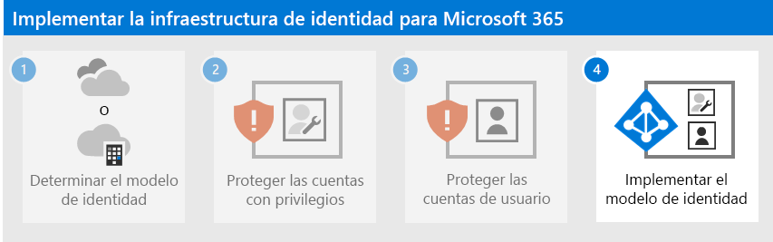

# Paso 3: Proteger las cuentas de usuario de Microsoft 365

Para aumentar la seguridad de los inicios de sesión de los usuarios:

- Usar Windows Hello para empresas
- Use la protección de contraseñas de Azure Active Directory
- Use la autenticación multifactor (MFA)
- Implementar configuraciones de acceso a dispositivos e identidades
- Protegerse frente al compromiso de credenciales con Azure AD Identity Protection

## Windows Hello para empresas

Windows Hello para empresas en Windows 10 Enterprise reemplaza el mero uso de contraseñas por la ultrasegura autenticación de dos factores cuando inicie sesión en un dispositivo Windows. Esta es un nueva forma de inicio de sesión que vincula el dispositivo de un usuario con un factor biométrico o un PIN.

Para más información, consulte [Información general para Windows Hello para empresas](/windows/security/identity-protection/hello-for-business/hello-overview).

## Protección de contraseñas de Azure AD

La protección de contraseñas de Azure AD detecta y bloquea las contraseñas que son conocidas por ser vulnerables y sus variantes. Además, también puede bloquear los términos vulnerables adicionales que sean específicos de su organización. Las listas de contraseñas desvetadas global predeterminada se aplican automáticamente a todos los usuarios de un inquilino de Azure AD. Se puede definir entradas adicionales en una lista personalizada de contraseñas prohibidas. Cuando los usuarios cambien o restablezcan sus contraseñas, estas listas de contraseñas prohibidas se comprueban para exigir el uso de contraseñas seguras.

Para obtener más información, consulte [Configurar la protección de contraseñas de Azure AD](/azure/active-directory/authentication/concept-password-ban-bad).

## MFA

MFA requiere que los inicios de sesión de usuario estén sujetos a una comprobación adicional más allá de la contraseña de la cuenta de usuario. Incluso si un usuario malintencionado determina la contraseña de una cuenta de usuario, también debe poder responder a una comprobación adicional, como un mensaje de texto que se envía a un smartphone, antes de que se otorgue el acceso.

El primer paso en el uso de MFA es que sea [necesario para todas las cuentas de administrador](protect-your-global-administrator-accounts.md), también conocidas como cuentas con privilegios. Después de este primer paso, Microsoft recomienda el uso de MFA para todos los usuarios.

Existen tres formas de requerir que los usuarios usen MFA basándose en su plan de Microsoft 365.

| Plan | Recomendación |
|---------|---------|
|Todos los planes de Microsoft 365 (sin licencias de Azure AD Premium P1 o P2)     |[Habilitar los valores predeterminados de seguridad en Azure AD](/azure/active-directory/fundamentals/concept-fundamentals-security-defaults). Los valores predeterminados de seguridad en Azure AD incluyen MFA para los usuarios y administradores.   |
|Microsoft 365 E3 (incluye las licencias de Azure AD Premium P1)     | Use las [Directivas comunes de acceso condicional](/azure/active-directory/conditional-access/concept-conditional-access-policy-common) para configurar las directivas siguientes:  - [Requerir MFA para los administradores](/azure/active-directory/conditional-access/howto-conditional-access-policy-admin-mfa)  - [Requerir MFA para todos los usuarios](/azure/active-directory/conditional-access/howto-conditional-access-policy-all-users-mfa)   - [Bloquear la autenticación heredada](/azure/active-directory/conditional-access/howto-conditional-access-policy-block-legacy)       |
|Microsoft 365 E5 (incluye las licencias de Azure AD Premium P2)     | Aprovechando la protección de identidades de Azure AD Identity Protection, comience a implementar el conjunto recomendado de directivas de acceso condicional de Microsoft y relacionadas creando estas dos directivas:  - [Exigir la autenticación multifactor (MFA) cuando el riesgo de inicio de sesión es medio o alto](/azure/active-directory/conditional-access/howto-conditional-access-policy-risk)  - [Los usuarios de riesgo alto tienen que cambiar la contraseña](/azure/active-directory/conditional-access/howto-conditional-access-policy-risk-user)       |
| | |

### Valores predeterminados de seguridad

Los valores predeterminados de seguridad son una nueva característica para las suscripciones pago o de prueba de Microsoft 365 y Office 365 creadas después del 21 de octubre de 2019. Estas suscripciones tienen los valores predeterminados de seguridad activados, lo que ***obliga a que todos los usuarios usen MFA con la aplicación Microsoft Authenticator***.
 
Los usuarios tienen 14 días para registrarse en MFA con la aplicación Microsoft Authenticator desde sus teléfonos inteligentes, que comienzan a contar desde la primera vez que inician sesión después de que se hayan habilitado los valores predeterminados de seguridad. Transcurridos 14 días, el usuario no podrá iniciar sesión hasta que el registro de MFA se haya completado.

Los valores predeterminados de seguridad garantizan que todas las organizaciones tengan un nivel básico de seguridad para el inicio de sesión de usuario habilitado de forma predeterminada. Puede deshabilitar los valores predeterminados de seguridad y usar MFA con directivas de acceso condicional o para cuentas individuales.

Para más información, vea esta [información general de los valores predeterminados de seguridad](/azure/active-directory/fundamentals/concept-fundamentals-security-defaults).

### Directivas de acceso condicional

Las directivas de acceso condicional son un conjunto de reglas que especifican las condiciones en las que se evalúan y se conceden los accesos. Por ejemplo, puede crear una directiva de acceso condicional que indique lo siguiente:

- Si el nombre de la cuenta de usuario es miembro de un grupo de usuarios a los que se han asignado los roles de Exchange, usuario, contraseña, seguridad, SharePoint, **administrador de Exchange**, **administrador de SharePoint** o **administrador global**, requiere MFA antes de permitir el acceso.

Esta directiva le permite exigir MFA en función de la pertenencia a grupos, en lugar de intentar configurar cuentas de usuario individuales para MFA cuando se asignan o se quitan estos roles de administrador.

También puede usar directivas de acceso condicionales para funciones más avanzadas, como requerir que el inicio de sesión se realice desde un dispositivo que cumpla las normativas, como su equipo portátil que ejecuta Windows 10.

El acceso condicional requiere licencias de Azure AD Premium P1, que se incluyen con Microsoft 365 E3 y E5.

Para más información, vea la [información general sobre el acceso condicional](/azure/active-directory/conditional-access/overview).

### Usar estos métodos conjuntamente

Tenga en cuenta lo siguiente:

- No puede habilitar los valores predeterminados de seguridad si tiene habilitadas directivas de acceso condicional.
- No puede habilitar ninguna directiva de acceso condicional si tiene habilitados los valores predeterminados de seguridad.

Si los valores predeterminados de seguridad están habilitados, se le pedirá al usuario el registro de MFA y el uso de la aplicación Microsoft Authenticator. 

Esta tabla muestra los resultados de habilitar MFA con los valores predeterminados de seguridad y las directivas de acceso condicional.

| Método | Habilitado | Deshabilitado | Método de autenticación adicional |
|:-------|:-----|:-------|:-------|
| **Valores predeterminados de seguridad**  | No se pueden usar directivas de acceso condicional | Se pueden usar directivas de acceso condicional | Aplicación Microsoft Authenticator |
| **Directivas de acceso condicional** | Si hay alguna habilitada, no puede habilitar los valores predeterminados de seguridad | Si se deshabilitan todos, puede habilitar los valores predeterminados de seguridad  | Especificado por el usuario durante el registro de MFA  |
||||

## Configuraciones de identidad y acceso a dispositivos de Confianza cero

Las directivas y configuraciones de acceso a dispositivos e identidades de confianza cero son las características de requisitos previos recomendadas. Estas opciones de configuración, combinadas con el acceso condicional, Intune y las directivas de Azure AD Identity Protection, determinan cuándo se debe conceder una solicitud de acceso y en qué condiciones. Esta determinación se basa en la cuenta de usuario del inicio de sesión, el dispositivo que se usa, la aplicación que el usuario usa para obtener acceso, la ubicación desde la que se realiza la solicitud de acceso y una valoración del riesgo de la solicitud. Esta funcionalidad le permite garantizar que solo los usuarios y dispositivos aprobados puedan acceder a los recursos críticos.

>[!Note]
>Azure AD Identity Protection requiere licencias de Azure AD Premium P2, que se incluyen con Microsoft 365 E5.
>

Las directivas de acceso a dispositivos e identidades están definidas para usarse en tres niveles: 

- La protección de línea base es un nivel mínimo de seguridad para las identidades y dispositivos que tienen acceso a sus aplicaciones y datos.
- La protección confidencial ofrece seguridad adicional para datos específicos. Las identidades y los dispositivos están sujetos a los niveles más altos de requisitos de seguridad y estado del dispositivo.
- La protección para entornos con información altamente regulada o clasificada se aplica a una pequeña cantidad de datos que están clasificados en niveles superiores, contienen secretos comerciales o están sometidos a regulaciones de datos. Las identidades y los dispositivos están sujetos a los niveles incluso más altos de requisitos de seguridad y estado del dispositivo. 

Estos niveles y sus configuraciones correspondientes proporcionan niveles de protección coherentes en los datos, las identidades y los dispositivos.

Microsoft recomienda la configuración e implementación de directivas de acceso a dispositivos e identidades de confianza cero en la organización, incluidas las configuraciones específicas para Microsoft Teams, Exchange Online y SharePoint. Para más información, consulte las [Configuraciones de acceso a dispositivos e identidades de confianza cero](../security/office-365-security/microsoft-365-policies-configurations.md).

## Azure AD Identity Protection

En este paso, obtendrá información sobre cómo configurar directivas para proteger contra credenciales en peligro, donde un atacante determina el nombre de la cuenta y la contraseña de un usuario para obtener acceso a los servicios y datos en la nube de una organización. Azure AD Identity Protection ofrece distintas formas de impedir que un atacante comprometa las credenciales de una cuenta de usuario.

Con Azure AD Identity Protection, puede:

|Funcionalidad|Descripción|
|:---------|:---------|
| Determinar y corregir posibles vulnerabilidades en las identidades de su organización | Azure AD usa el aprendizaje automático para detectar anomalías y actividades sospechosas como los inicios de sesión y actividades posteriores al inicio de sesión. Con estos datos, Azure AD Identity Protection genera informes y alertas que le permiten evaluar los problemas y tomar medidas.|
|Detectar acciones sospechosas relacionadas con las identidades de su organización y responder a ellas automáticamente|Puede configurar directivas basadas en riesgos que responden automáticamente a los problemas que se hayan detectado cuando se alcanza un nivel de riesgo específico. Estas directivas, junto con otros controles de acceso condicional proporcionados por Azure AD y Microsoft Intune, pueden automáticamente impedir el acceso o realizar acciones correctivas como restablecer contraseñas y pedir la autenticación multifactor para los inicios de sesión posteriores. |
| Investigar incidentes sospechosos y solucionarlos con acciones administrativas | Puede investigar eventos de riesgo con información sobre el incidente de seguridad. Hay disponibles flujos de trabajo básicos para realizar un seguimiento de las investigaciones e iniciar acciones de corrección, como restablecimientos de contraseña. |
|||

Vea [más información sobre Azure AD Identity Protection](/azure/active-directory/identity-protection/overview-identity-protection).

Vea los [pasos para habilitar Azure AD Identity Protection](/azure/active-directory/identity-protection/howto-identity-protection-configure-risk-policies).

## Recursos técnicos de administración para MFA e inicios de sesión seguros

- [MFA para Microsoft 365](../admin/security-and-compliance/multi-factor-authentication-microsoft-365.md)
- [Implementar identidad para Microsoft 365](deploy-identity-solution-overview.md)
- [Vídeos de aprendizaje de Azure Academy Azure AD](https://www.youtube.com/watch?v=pN8o0owHfI0&list=PL-V4YVm6AmwUFpC3rXr2i2piRQ708q_ia)
- [Configurar la directiva de registro de autenticación multi-factor de Azure AD](/azure/active-directory/identity-protection/howto-identity-protection-configure-mfa-policy)
- [Configuraciones de acceso a dispositivos e identidades](../security/office-365-security/microsoft-365-policies-configurations.md)

## Paso siguiente

Continúe con el Paso 4 para implementar la infraestructura de identidad en función del modelo de identidad elegido:

- [Identidad solo de nube](cloud-only-identities.md)
- [Identidad híbrida](prepare-for-directory-synchronization.md)
