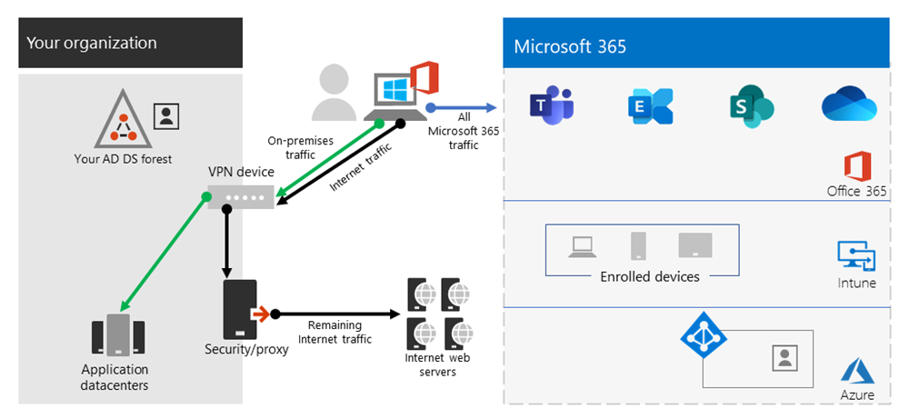
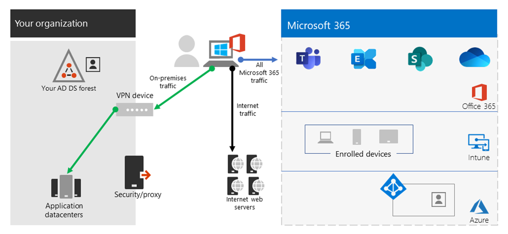

# Escenarios comunes de tunelización dividida de VPN para Microsoft 365

>[!NOTE]
>Este artículo forma parte de un conjunto de artículos que abordan la optimización de Microsoft 365 para usuarios remotos.

>- Para obtener información general sobre el uso de la tunelización dividida de VPN para optimizar la conectividad de Microsoft 365 para usuarios remotos, consulte [Información general: Túnel dividido de VPN para Microsoft 365](microsoft-365-vpn-split-tunnel.md).
>- Para obtener instrucciones detalladas sobre la implementación de la tunelización dividida de VPN, consulte [Implementación de la tunelización dividida de VPN para Microsoft 365](microsoft-365-vpn-implement-split-tunnel.md).
>- Para obtener instrucciones sobre cómo proteger el tráfico multimedia de Teams en entornos de tunelización dividida de VPN, consulte [Protección del tráfico multimedia de Teams para la tunelización dividida de VPN](microsoft-365-vpn-securing-teams.md).
>- Para obtener información sobre cómo configurar stream y eventos en directo en entornos VPN, consulte [Consideraciones especiales para stream y eventos en directo en entornos VPN](microsoft-365-vpn-stream-and-live-events.md).
>- Para obtener información sobre cómo optimizar el rendimiento de los inquilinos de Microsoft 365 en todo el mundo para los usuarios de China, consulte [Optimización del rendimiento de Microsoft 365 para los usuarios de China](microsoft-365-networking-china.md).

En la lista siguiente, verá los escenarios de VPN más comunes que se ven en entornos empresariales. La mayoría de los clientes utiliza el modelo 1 de forma tradicional (túnel forzado de VPN). Esta sección le ayudará a realizar una transición rápida y segura al **modelo 2**, que se puede lograr con relativamente poco esfuerzo y tiene enormes ventajas para el rendimiento de la red y la experiencia del usuario.

| Model | Descripción |
| --- | --- |
| [1. Túnel forzado de VPN](#1-vpn-forced-tunnel) | El 100 % del tráfico entra en el túnel VPN, incluido el local, Internet y todo O365/M365 |
| [2. Túnel forzado de VPN con unas pocas excepciones](#2-vpn-forced-tunnel-with-a-small-number-of-trusted-exceptions) | El túnel de VPN se usa de forma predeterminada (la ruta predeterminada apunta a la VPN), con pocos escenarios de exención especialmente importantes que se pueden dirigir directamente |
| [3. Túnel forzado de VPN con muchas excepciones](#3-vpn-forced-tunnel-with-broad-exceptions) | El túnel VPN se usa de forma predeterminada (puntos de ruta predeterminados a VPN), con amplias excepciones que pueden ir directamente (por ejemplo, todo Microsoft 365, All Salesforce, All Zoom) |
| [4. Túnel de VPN selectivo](#4-vpn-selective-tunnel) | El túnel VPN solo se usa para los servicios basados en redes corporativas. La ruta predeterminada (Internet y todos los servicios basados en Internet) es directa. |
| [5. No VPN](#5-no-vpn) | Variación del número 2. En lugar de vpn heredada, todos los servicios de red corporativa se publican a través de enfoques de seguridad modernos (como Zscaler ZPA, Azure Active Directory (Azure AD) Proxy/MCAS, etc.) |

## 1. Túnel forzado de VPN

El escenario de inicio más común para la mayoría de los clientes empresariales. Se usa una VPN forzada, lo que significa que el 100 % del tráfico se dirige a la red corporativa independientemente de si el punto de conexión reside dentro de la red corporativa o no. Cualquier tráfico externo (Internet) enlazado, como Microsoft 365 o la exploración por Internet, se vuelve a anclar hacia atrás fuera del equipo de seguridad local, como los servidores proxy. En el clima actual, con casi el 100 % de los usuarios trabajando de forma remota, este modelo supone una carga alta en la infraestructura vpn y es probable que obstaculice significativamente el rendimiento de todo el tráfico corporativo y, por tanto, la empresa funcione de forma eficaz en un momento de crisis.

## 2. Túnel forzado de VPN con unas pocas excepciones de confianza

Significativamente más eficiente para que una empresa funcione. Este modelo permite que algunos puntos de conexión controlados y definidos que sean sensibles a la alta carga y latencia omitan el túnel VPN y vayan directamente al servicio Microsoft 365. Esto mejora significativamente el rendimiento de los servicios descargados y también reduce la carga en la infraestructura vpn, lo que permite que los elementos que todavía lo requieren funcionen con una contención menor para los recursos. Es este modelo el que este artículo se centra en ayudar con la transición a, ya que permite que las acciones sencillas y definidas se tomen rápidamente con numerosos resultados positivos.

## 3. Túnel forzado de VPN con muchas excepciones

Amplía el ámbito del modelo 2. En lugar de simplemente enviar un pequeño grupo de puntos de conexión definidos directamente, envía todo el tráfico directamente a servicios de confianza como Microsoft 365 y SalesForce. Esto reduce aún más la carga en la infraestructura VPN corporativa y mejora el rendimiento de los servicios definidos. Dado que es probable que este modelo tarde más tiempo en evaluar la viabilidad de e implementarlo, es probable que sea un paso que se pueda dar iterativamente en una fecha posterior una vez que el modelo dos se haya implementado correctamente.

## 4. Túnel de VPN selectivo

Invierte el tercer modelo en que solo el tráfico identificado como que tiene una dirección IP corporativa se envía por el túnel VPN y, por tanto, la ruta de acceso a Internet es la ruta predeterminada para todo lo demás. Este modelo requiere que la organización se encuentre en una fase avanzada de implementación de [Confianza cero](https://www.microsoft.com/security/zero-trust?rtc=1) para poder implementar el modelo de forma segura. Debe tenerse en cuenta que este modelo o alguna variación del mismo probablemente se convertirá en el valor predeterminado necesario con el tiempo a medida que más servicios se alejen de la red corporativa y de la nube.

Microsoft usa este modelo internamente. Puede encontrar más información sobre la implementación de La tunelización dividida de VPN de Microsoft [en Ejecución en VPN: Cómo Microsoft mantiene conectado a su personal remoto](https://www.microsoft.com/itshowcase/blog/running-on-vpn-how-microsoft-is-keeping-its-remote-workforce-connected/?elevate-lv).

## 5. No VPN

Una versión más avanzada del modelo número 2, por la que cualquier servicio interno se publica a través de un enfoque de seguridad moderno o una solución SDWAN, como Azure AD Proxy, Defender for Cloud Apps, Zscaler ZPA, etc.

## Artículos relacionados

[Información general: Túnel dividido de VPN para Microsoft 365](microsoft-365-vpn-split-tunnel.md)

[Implementación de la tunelización dividida de VPN para Microsoft 365](microsoft-365-vpn-implement-split-tunnel.md)

[Protección del tráfico multimedia Teams para la tunelización dividida VPN](microsoft-365-vpn-securing-teams.md)

[Consideraciones especiales para stream y eventos en directo en entornos VPN](microsoft-365-vpn-stream-and-live-events.md)

[Optimización del rendimiento de Microsoft 365 para usuarios de China](microsoft-365-networking-china.md)

[Principios de conectividad de red de Microsoft 365](microsoft-365-network-connectivity-principles.md)

[Evaluar la conectividad de red de Microsoft 365](assessing-network-connectivity.md)

[Optimización de rendimiento y red de Microsoft 365](network-planning-and-performance.md)

[Formas alternativas para que los profesionales de seguridad y de TI logren controles de seguridad modernos en los escenarios de trabajo remoto específicos (blog del Equipo de Seguridad de Microsoft)](https://www.microsoft.com/security/blog/2020/03/26/alternative-security-professionals-it-achieve-modern-security-controls-todays-unique-remote-work-scenarios/)

[Mejorando el rendimiento de la VPN en Microsoft: usando perfiles de VPN de Windows 10 para permitir conexiones automáticas ](https://www.microsoft.com/itshowcase/enhancing-remote-access-in-windows-10-with-an-automatic-vpn-profile)

[Funcionando con VPN: cómo Microsoft mantiene conectado a su personal remoto](https://www.microsoft.com/itshowcase/blog/running-on-vpn-how-microsoft-is-keeping-its-remote-workforce-connected/?elevate-lv)

[Red global de Microsoft](/azure/networking/microsoft-global-network)
