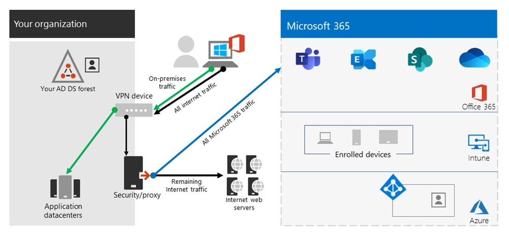

# <a name="implementing-vpn-split-tunneling-for-microsoft-365"></a>Implementación de túnel dividido de VPN para Microsoft 365

>[!NOTE]
>Este artículo forma parte de un conjunto de artículos que abordan la optimización Microsoft 365 usuarios remotos.

>- Para obtener información general sobre cómo usar el túnel dividido de VPN para optimizar la conectividad Microsoft 365 usuarios remotos, vea [Overview: VPN split tunneling for Microsoft 365](microsoft-365-vpn-split-tunnel.md).
>- Para obtener información sobre cómo optimizar Microsoft 365 el rendimiento de los inquilinos en todo el mundo para los usuarios de China, vea [Microsoft 365 optimización del rendimiento para los usuarios de China](microsoft-365-networking-china.md).

Durante muchos años, las empresas han estado usando VPN para admitir experiencias remotas para sus usuarios. Mientras las cargas de trabajo principales seguían siendo locales, una VPN desde el cliente remoto enrutada a través de un centro de datos en la red corporativa era el método principal para que los usuarios remotos puedan acceder a los recursos corporativos. Para salvaguardar estas conexiones, las empresas crean capas de soluciones de seguridad de red a lo largo de las rutas VPN. Esta seguridad se creó para proteger la infraestructura interna y proteger la navegación móvil de sitios web externos mediante el reenrutación del tráfico en la VPN y, a continuación, a través del perímetro de Internet local. Las VPN, los perímetros de red y la infraestructura de seguridad asociada a menudo se basaban y escalaban para un volumen de tráfico definido, normalmente con la mayor parte de la conectividad iniciada desde la red corporativa y la mayor parte de ella se encontraba dentro de los límites de la red interna.

Durante bastante tiempo, los modelos de VPN en los que todas las conexiones del dispositivo del usuario remoto se enrutan de nuevo a la red local (conocido como _forzar el uso del túnel_) eran en gran medida sostenibles siempre que la escala concurrente de usuarios remotos fuera modesta y los volúmenes de tráfico que atravesaban la VPN fueran bajos.  Algunos clientes siguieron utilizando el túnel de fuerza VPN como el status quo incluso después de que sus aplicaciones se movieron desde el perímetro corporativo a las nubes saas públicas.

El uso de VPN tuneladas forzadas para conectarse a aplicaciones en la nube distribuidas y sensibles al rendimiento es subóptimo, pero algunas empresas han aceptado los efectos negativos para mantener el statu quo de seguridad. A continuación se muestra un diagrama de ejemplo de este escenario:


Este problema ha estado creciendo durante muchos años, ya que muchos clientes informan de un cambio significativo de los patrones de tráfico de red. El tráfico que solía permanecer local ahora se conecta a puntos de conexión de nube externos. Muchos clientes de Microsoft informan que anteriormente, alrededor del 80 % de su tráfico de red era a algún origen interno (representado por la línea punteada en el diagrama anterior). In 2020 that number is now around 20% or lower as they have shifted major workloads to the cloud, these trends aren't uncommon with other enterprises. Con el tiempo, a medida que avanza el recorrido en la nube, el modelo anterior se vuelve cada vez más engorroso e insostenible, lo que impide que una organización sea ágil a medida que avanza a un mundo de primera nube.

La crisis mundial de la COVID-19 ha escalado este problema, de forma que necesita una solución inmediata. La necesidad de garantizar la seguridad de los empleados ha generado demandas sin precedentes en TI empresarial para dar soporte a la productividad del trabajo desde el hogar a una escala masiva. Microsoft 365 está bien posicionado para ayudar a los clientes a satisfacer esa demanda, pero la alta concurrencia de los usuarios que trabajan desde casa genera un gran volumen de tráfico de Microsoft 365 que, si se enruta a través de VPN de túnel forzado y perímetros de red locales, provoca una saturación rápida y ejecuta la infraestructura VPN fuera de capacidad. En esta nueva realidad, el uso de VPN para obtener acceso a Microsoft 365 ya no es solo un impedimento de rendimiento, sino un muro duro que no solo afecta Microsoft 365 las operaciones empresariales críticas que aún tienen que depender de la VPN para funcionar.

Microsoft ha trabajado codo con codo con los clientes y las grandes empresas durante muchos años para ofrecer soluciones eficaces y modernas para estos problemas desde dentro de sus propios servicios, así como para adoptar las prácticas recomendadas del sector. [Los principios de](./microsoft-365-network-connectivity-principles.md) conectividad para el servicio Microsoft 365 han sido diseñados para funcionar eficazmente para los usuarios remotos, a la vez que permiten a una organización mantener la seguridad y el control sobre su conectividad. Estas soluciones también se pueden implementar rápidamente con un trabajo limitado pero logran un efecto positivo significativo en los problemas descritos anteriormente.

La estrategia recomendada por Microsoft para optimizar la conectividad de los trabajadores remotos se centra en mitigar rápidamente los problemas y proporcionar un alto rendimiento con unos sencillos pasos. Estos pasos ajustan el enfoque de VPN heredado para algunos puntos de conexión definidos que omiten los servidores VPN con cuello de botella. Se puede aplicar un modelo de seguridad equivalente o incluso superior en diferentes capas para que no sea necesario proteger todo el tráfico de salida de la red corporativa. En la mayoría de los casos, esto se puede lograr eficazmente en cuestión de horas y, a continuación, es escalable a otras cargas de trabajo según la demanda de requisitos y el tiempo lo permita.

## <a name="common-vpn-scenarios"></a>Escenarios de VPN comunes

En la lista siguiente, verás los escenarios de VPN más comunes que se ven en entornos empresariales. La mayoría de los clientes utiliza el modelo 1 de forma tradicional (túnel forzado de VPN). Esta sección le ayudará a realizar una transición rápida y segura al modelo **2**, que se puede lograr con relativamente poco esfuerzo y tiene enormes ventajas para el rendimiento de la red y la experiencia del usuario.

| Model | Descripción |
| --- | --- |
| [1. Túnel forzado de VPN](#1-vpn-forced-tunnel) | El 100 % del tráfico entra en el túnel VPN, incluidos los entornos locales, Internet y todo O365/M365 |
| [2. Túnel forzado de VPN con unas pocas excepciones](#2-vpn-forced-tunnel-with-a-small-number-of-trusted-exceptions) | El túnel de VPN se usa de forma predeterminada (la ruta predeterminada apunta a la VPN), con pocos escenarios de exención especialmente importantes que se pueden dirigir directamente |
| [3. Túnel forzado de VPN con muchas excepciones](#3-vpn-forced-tunnel-with-broad-exceptions) | El túnel VPN se usa de forma predeterminada (la ruta predeterminada apunta a VPN), con amplias excepciones que pueden ir directamente (como todas las Microsoft 365, All Salesforce, All Zoom) |
| [4. Túnel de VPN selectivo](#4-vpn-selective-tunnel) | El túnel VPN solo se usa para los servicios basados en corpnet. La ruta predeterminada (Internet y todos los servicios basados en Internet) va directamente. |
| [5. No VPN](#5-no-vpn) | Variación de #2. En lugar de vpn heredada, todos los servicios corpnet se publican a través de enfoques de seguridad modernos (como Zscaler ZPA, Azure Active Directory (Azure AD) Proxy/MCAS, etc.) |

### <a name="1-vpn-forced-tunnel"></a>1. Túnel forzado de VPN

El escenario de inicio más común para la mayoría de los clientes empresariales. Se usa una VPN forzada, lo que significa que el 100 % del tráfico se dirige a la red corporativa independientemente de si el extremo reside dentro de la red corporativa o no. Cualquier tráfico externo (Internet) enlazado, como Microsoft 365 o navegación por Internet, se vuelve a anclar de nuevo fuera del equipamiento de seguridad local, como servidores proxy. En el actual entorno en el que casi el 100 % de los usuarios trabajan de forma remota, este modelo pone una gran carga en la infraestructura VPN y es probable que dificulte significativamente el rendimiento de todo el tráfico corporativo y, por lo tanto, la empresa funcione de forma eficaz en un momento de crisis.



### <a name="2-vpn-forced-tunnel-with-a-small-number-of-trusted-exceptions"></a>2. Túnel forzado de VPN con unas pocas excepciones de confianza

Significativamente más eficaz para que una empresa funcione bajo. Este modelo permite que algunos puntos de conexión controlados y definidos que son sensibles a la alta carga y la latencia omitan el túnel VPN y vayan directamente al servicio Microsoft 365 cliente. Esto mejora significativamente el rendimiento de los servicios descargados y también disminuye la carga en la infraestructura VPN, lo que permite que los elementos que aún lo requieran funcionen con menor contención de recursos. Este modelo se centra en ayudar con la transición a, ya que permite realizar acciones sencillas y definidas rápidamente con numerosos resultados positivos.


### <a name="3-vpn-forced-tunnel-with-broad-exceptions"></a>3. Túnel forzado de VPN con muchas excepciones

Amplía el ámbito del modelo 2. En lugar de enviar un pequeño grupo de puntos de conexión definidos directamente, en su lugar envía todo el tráfico directamente a servicios de confianza como Microsoft 365 y SalesForce. Esto reduce aún más la carga en la infraestructura VPN corporativa y mejora el rendimiento de los servicios definidos. Dado que es probable que este modelo tarde más tiempo en evaluar la viabilidad de e implementarlo, es probable que sea un paso que se pueda realizar iterativamente en una fecha posterior una vez que el modelo dos se haya implementado correctamente.


### <a name="4-vpn-selective-tunnel"></a>4. Túnel de VPN selectivo

Invierte el tercer modelo en que solo el tráfico identificado como tener una dirección IP corporativa se envía por el túnel VPN y, por lo tanto, la ruta de acceso a Internet es la ruta predeterminada para todo lo demás. Este modelo requiere que la organización se encuentre en una fase avanzada de implementación de [Confianza cero](https://www.microsoft.com/security/zero-trust?rtc=1) para poder implementar el modelo de forma segura. Debe tenerse en cuenta que este modelo o alguna variación del mismo probablemente se convertirá en el valor predeterminado necesario con el tiempo a medida que más servicios se alejan de la red corporativa y de la nube.

Microsoft usa este modelo internamente. Encontrará más información sobre la implementación de túnel dividido de VPN de Microsoft en [Running on VPN: How Microsoft is keeping its remote workforce connected](https://www.microsoft.com/itshowcase/blog/running-on-vpn-how-microsoft-is-keeping-its-remote-workforce-connected/?elevate-lv).


### <a name="5-no-vpn"></a>5. No VPN

Una versión más avanzada del modelo número 2, en la que cualquier servicio interno se publica a través de un enfoque de seguridad moderno o una solución SDWAN como Azure AD Proxy, Defender para aplicaciones en la nube, Zscaler ZPA, etc.


## <a name="implement-vpn-split-tunneling"></a>Implementación de túnel dividido de VPN

En esta sección, encontrará los _sencillos_ pasos necesarios para migrar la arquitectura de cliente VPN de un túnel forzado de _VPN_ a un túnel forzado de VPN con algunas excepciones de confianza, modelo de túnel dividido [de VPN #2](#2-vpn-forced-tunnel-with-a-small-number-of-trusted-exceptions) en [escenarios](#common-vpn-scenarios) comunes de VPN.

En el siguiente diagrama se muestra cómo funciona la solución recomendada de túnel dividido de VPN:


### <a name="1-identify-the-endpoints-to-optimize"></a>1. Identificar los puntos de conexión que se deben optimizar

En el [Microsoft 365 direcciones URL e intervalos](urls-and-ip-address-ranges.md) de direcciones IP, Microsoft identifica claramente los puntos de conexión clave que necesita para optimizarlos y los clasifica como **Optimizar**. Actualmente, solo hay cuatro direcciones URL y 20 subredes IP que deben optimizarse. Este pequeño grupo de puntos de conexión representa entre el 70 % y el 80 % del volumen de tráfico al servicio de Microsoft 365, incluidos los puntos de conexión confidenciales de latencia, como los de Teams medios. Básicamente, este es el tráfico que debemos tener especial cuidado y es también el tráfico que pondrá una presión increíble en las rutas de red tradicionales y la infraestructura VPN.

Las direcciones URL de esta categoría tienen las siguientes características:

- Son los puntos de conexión que pertenecen a Microsoft, que también se encarga de administrarlos y alojarlos en su infraestructura
- Se les ofrece IP
- Tienen una baja tasa de cambio y un número esperado reducido (actualmente, 20 subredes IP)
- Tienen ancho de banda o son sensibles a la latencia
- Se les puede proporcionar elementos de seguridad necesarios directamente en el servicio en lugar de en línea en la red
- Cuenta con alrededor del 70-80 % del volumen de tráfico al servicio Microsoft 365 cliente

Para obtener más información sobre Microsoft 365 y cómo se clasifican y administran, vea [Managing Microsoft 365 endpoints](managing-office-365-endpoints.md).

#### <a name="optimize-urls"></a>Optimización de direcciones URL

Las direcciones URL que se deben optimizar actualmente se muestran en la siguiente tabla. En la mayoría de los casos, solo debería necesitar usar puntos de conexión de URL en un [archivo PAC de explorador](managing-office-365-endpoints.md#use-a-pac-file-for-direct-routing-of-vital-office-365-traffic) en el que los puntos de conexión se configuren para enviarse directamente, en lugar de hacerlo al proxy.

| Optimización de direcciones URL | Puerto/Protocolo | Objetivo |
| --- | --- | --- |
| <https://outlook.office365.com> | TCP 443 | Esta es una de las direcciones URL primarias que Outlook usa para conectarse a su servidor de Exchange Online y tiene un alto volumen de uso de ancho de banda y recuento de conexiones. Se requiere una baja latencia de red para las características en línea, entre las que se incluyen: búsqueda instantánea, otros calendarios de buzón, búsqueda libre/ocupada, administrar reglas y alertas, archivo de Exchange Online y mensajes de correo electrónico que salen de la bandeja de salida. |
| <https://outlook.office.com> | TCP 443 | Esta dirección URL se usa para que Outlook Online Web Access se conecte al servidor de Exchange Online y es sensible a la latencia de red. La conectividad es especialmente importante para la carga y descarga de archivos grandes con SharePoint Online. |
| \<tenant\>https://.sharepoint.com | TCP 443 | Esta es la dirección URL principal de SharePoint Online y tiene un uso de ancho de banda alto. |
| \<tenant\>https://-my.sharepoint.com | TCP 443 | Esta es la dirección URL principal de OneDrive para la Empresa y tiene un gran uso de ancho de banda y posiblemente un alto número de conexiones de la Herramienta de sincronización de OneDrive para la Empresa. |
| Direcciones IP del contenido multimedia de Teams (sin URL) | UDP 3478, 3479, 3480 y 3481 | Asignación de detección de retransmisión y tráfico en tiempo real (3478), audio (3479), vídeo (3480) y uso compartido de pantalla de vídeo (3481). Estos son los puntos de conexión usados para Skype Empresarial y Microsoft Teams tráfico multimedia (llamadas, reuniones, etc.). La mayoría de los puntos de conexión se proporcionan cuando el cliente de Microsoft Teams establece una llamada (que se incluye en las direcciones IP mostradas para el servicio). El uso del protocolo UDP es necesario para obtener la calidad multimedia ideal.   |

En los ejemplos anteriores, **el espacio** empresarial debe reemplazarse por su Microsoft 365 de inquilino. Por ejemplo, **contoso.onmicrosoft.com** usaría _contoso.sharepoint.com_ y _contoso-my.sharepoint.com_.

#### <a name="optimize-ip-address-ranges"></a>Optimización de intervalos de direcciones IP

En el momento de escribir los intervalos de direcciones IP a los que corresponden estos puntos de conexión son los siguientes. Se recomienda encarecidamente que use un [script](https://github.com/microsoft/Office365NetworkTools/tree/master/Scripts/Display%20URL-IPs-Ports%20per%20Category) como este ejemplo, el servicio web [DE IP y URL de Microsoft 365](microsoft-365-ip-web-service.md) o la página [URL/IP](urls-and-ip-address-ranges.md) para comprobar si hay actualizaciones al aplicar la configuración y poner una directiva en su lugar para hacerlo con regularidad.

```
104.146.128.0/17
13.107.128.0/22
13.107.136.0/22
13.107.18.10/31
13.107.6.152/31
13.107.64.0/18
131.253.33.215/32
132.245.0.0/16
150.171.32.0/22
150.171.40.0/22
204.79.197.215/32
23.103.160.0/20
40.104.0.0/15
40.108.128.0/17
40.96.0.0/13
52.104.0.0/14
52.112.0.0/14
52.96.0.0/14
52.120.0.0/14
```

### <a name="2-optimize-access-to-these-endpoints-via-the-vpn"></a>2. Optimizar el acceso a estos puntos de conexión a través de la VPN

Ya identificados los puntos de conexión críticos, se deben desviar del túnel de VPN y permitirles usar la conexión a Internet local del usuario para conectarse directamente al servicio. La forma en que se logra esto varía en función de la plataforma del equipo y del producto de VPN que se use, pero la mayoría de las soluciones de VPN permite una configuración sencilla de las directivas para aplicar esta lógica. Para obtener instrucciones sobre el túnel dividido específico de la plataforma de VPN, consulte [Guías para obtener más información sobre las plataformas VPN comunes](#howto-guides-for-common-vpn-platforms).

Si desea probar la solución manualmente, puede ejecutar el siguiente ejemplo de PowerShell para emular la solución en el nivel de la tabla de rutas. Este ejemplo agrega una ruta para cada subred IP del contenido multimedia de Teams a la tabla de rutas. Puede probar el rendimiento del contenido multimedia de Teams antes y después, y observar la diferencia de rutas en los extremos especificados.

#### <a name="example-add-teams-media-ip-subnets-into-the-route-table"></a>Ejemplo: agregar subredes IP del contenido multimedia de Teams a la tabla de rutas

```powershell
$intIndex = "" # index of the interface connected to the internet
$gateway = "" # default gateway of that interface
$destPrefix = "52.120.0.0/14", "52.112.0.0/14", "13.107.64.0/18" # Teams Media endpoints
# Add routes to the route table
foreach ($prefix in $destPrefix) {New-NetRoute -DestinationPrefix $prefix -InterfaceIndex $intIndex -NextHop $gateway}
```

En el script anterior, _$intIndex_ es el índice de la interfaz conectada a Internet (puede buscarla si ejecuta **get-netadapter** en PowerShell y se fija en el valor de _ifIndex_) y _$Gateway_ es la puerta de enlace predeterminada de esa interfaz (puede buscarla si ejecuta **ipconfig** en un símbolo del sistema o **(Get-NetIPConfiguration | Foreach IPv4DefaultGateway).NextHop** en PowerShell).

Una vez que haya agregado las rutas, puede confirmar que la tabla de rutas es la correcta, para ello, ejecute **route print** en un símbolo del sistema o PowerShell. El resultado debe contener las rutas que agregó y mostrar el índice de la interfaz (_22_ en este ejemplo) y la puerta de enlace para dicha interfaz (_192.168.1.1_ en este ejemplo):


Para agregar rutas para  todos los intervalos de direcciones IP actuales en la categoría Optimizar, puede usar la siguiente variación de script para consultar el servicio [web DE IP y DIRECCIÓN URL de Microsoft 365](microsoft-365-ip-web-service.md) para el conjunto actual de subredes IP de Optimizar y agregarlas a la tabla de rutas.

#### <a name="example-add-all-optimize-subnets-into-the-route-table"></a>Ejemplo: agregar subredes IP de la categoría Optimizar a la tabla de rutas

```powershell
$intIndex = "" # index of the interface connected to the internet
$gateway = "" # default gateway of that interface
# Query the web service for IPs in the Optimize category
$ep = Invoke-RestMethod ("https://endpoints.office.com/endpoints/worldwide?clientrequestid=" + ([GUID]::NewGuid()).Guid)
# Output only IPv4 Optimize IPs to $optimizeIps
$destPrefix = $ep | where {$_.category -eq "Optimize"} | Select-Object -ExpandProperty ips | Where-Object { $_ -like '*.*' }
# Add routes to the route table
foreach ($prefix in $destPrefix) {New-NetRoute -DestinationPrefix $prefix -InterfaceIndex $intIndex -NextHop $gateway}
```

Si ha agregado accidentalmente rutas con parámetros incorrectos o si simplemente desea revertir los cambios, puede quitar las rutas que acaba de agregar con el siguiente comando:

```powershell
foreach ($prefix in $destPrefix) {Remove-NetRoute -DestinationPrefix $prefix -InterfaceIndex $intIndex -NextHop $gateway}
```

<!--- remmed until we add more reliable interface selection logic
#### Example script to add Teams Media subnets to the route table

```powershell
$adapter = get-netadapter | ? {$_.Status -eq "Up"}
$adapterIndex = $adapter.ifIndex
$gateway = (Get-NetIPConfiguration | Foreach IPv4DefaultGateway).NextHop

$destPrefix = "52.120.0.0/14", "52.112.0.0/14", "13.107.64.0/18"
foreach ($prefix in $destPrefix) {New-NetRoute -DestinationPrefix $prefix -InterfaceIndex $intIndex -NextHop $gateway}
```
-->

El cliente VPN debe configurarse para que el tráfico a las direcciones IP de la categoría **Optimizar** se enrute de esta forma. Esto permite que el tráfico use recursos locales de Microsoft, como puertas frontales de servicio de Microsoft 365, como la puerta principal de [Azure](https://azure.microsoft.com/blog/azure-front-door-service-is-now-generally-available/) que proporcionan servicios Microsoft 365 y puntos de conexión de conectividad lo más cerca posibles de los usuarios. Esto nos permite ofrecer niveles de alto rendimiento a los usuarios en cualquier lugar del mundo y aprovecha al máximo la red [global de clase mundial de Microsoft](https://azure.microsoft.com/blog/how-microsoft-builds-its-fast-and-reliable-global-network/), que probablemente se encuentra a unos milisegundos de la salida directa de los usuarios.

## <a name="configuring-and-securing-teams-media-traffic"></a>Configuración y protección del tráfico multimedia de Teams

Algunos administradores pueden requerir información más detallada sobre la forma en que funcionan los flujos de llamadas en Teams que utilizan un modelo de túnel dividido y cómo se aseguran las conexiones.

### <a name="configuration"></a>Configuración

Tanto para las llamadas como para las reuniones, siempre y cuando las subredes IP de Optimización necesarias para medios de Teams estén correctamente en la tabla de rutas, cuando Teams llame a la función [GetBestRoute](/windows/win32/api/iphlpapi/nf-iphlpapi-getbestroute) para determinar qué interfaz local corresponde a la ruta que debe usar para un destino determinado, la interfaz local se devolverá para los destinos de Microsoft en los bloques IP de Microsoft enumerados anteriormente.

Algunos programas de cliente de VPN permiten la manipulación del enrutamiento en función de la dirección URL. Pero el tráfico multimedia de Teams no tiene una dirección URL asociada, por lo que el control del enrutamiento para este tráfico tiene que realizarse mediante subredes IP.

En determinadas situaciones, a menudo no relacionadas con la configuración del cliente de Teams, el tráfico multimedia atraviesa igualmente el túnel de VPN aunque se hayan dispuesto las rutas correctas. Si se produce este escenario, debe bastar con usar una regla de firewall para impedir que las subredes IP o los puertos Teams la VPN.

>[!IMPORTANT]
>Para asegurarse de que Teams tráfico multimedia se enruta Microsoft Teams través del método deseado en todos los escenarios de VPN, asegúrese de que los usuarios ejecutan una versión **de cliente 1.3.00.13565** o posterior. Esta versión incluye mejoras en la forma en que el cliente detecta las rutas de red disponibles.

El tráfico de señalización se realiza a través de HTTPS y no es tan sensible a la latencia como el tráfico multimedia y se marca como **Permitir** en los datos URL/IP y, por lo tanto, se puede enrutar de forma segura a través del cliente VPN si se desea.

>[!NOTE]
>Microsoft Edge **96 y** posteriores también admiten el túnel dividido de VPN para el tráfico punto a punto. Esto significa que los clientes pueden beneficiarse de la tunelización dividida de VPN Teams clientes web en Edge, por ejemplo. Los clientes que quieran configurarlo para sitios web que se ejecutan en Edge pueden lograrlo si toman el paso adicional de habilitar la directiva [Edge WebRtcRespectOsRoutingTableEnabled](/deployedge/microsoft-edge-policies#webrtcrespectosroutingtableenabled) .

### <a name="security"></a>Seguridad

Un argumento común para evitar túneles divididos es que es menos seguro hacerlo, es decir, cualquier tráfico que no pase por el túnel VPN no se beneficiará de cualquier esquema de cifrado que se aplique al túnel VPN y, por lo tanto, es menos seguro.

El principal argumento contra esta idea es que el tráfico multimedia ya está cifrado mediante _protocolo de transporte en tiempo real seguro (SRTP)_, un perfil del protocolo de transporte en tiempo real (RTP) que proporciona confidencialidad, autenticación y protección contra ataques de reproducciones al tráfico RTP. SRTP se basa en una clave de sesión generada al azar, que se intercambia mediante el canal de señalización protegida de TLS. Este se trata de forma detallada en [esta guía de seguridad](/skypeforbusiness/optimizing-your-network/security-guide-for-skype-for-business-online), pero la sección principal de interés es el cifrado multimedia.

El tráfico multimedia se cifra con SRTP, que usa una clave de sesión generada por un generador de números aleatorios seguros y se intercambia con el canal TLS de señalización. Además, el contenido multimedia que fluye en ambas direcciones entre el servidor de mediación y el próximo salto interno también se cifra con SRTP.

Skype Empresarial Online genera nombres de usuario o contraseñas para proteger el acceso a relés multimedia mediante _retransmisiones de uso de recorrido por NAT (TURN)_. Los relés multimedia intercambian el nombre de usuario/contraseña a través de un canal SIP protegido con TLS. Vale la pena tener en cuenta que, aunque se puede usar un túnel VPN para conectar el cliente a la red corporativa, el tráfico todavía debe fluir en su forma SRTP cuando deja la red corporativa para llegar al servicio.

En [5.1 Security Considerations for Implementers](/openspecs/office_protocols/ms-ice2/69525351-8c68-4864-b8a6-04bfbc87785c) se puede encontrar información sobre cómo Teams mitigar problemas de seguridad comunes, como los ataques de amplificación de las utilidades de recorrido de sesión o de voz para ataques de amplificación NAT _(STUN_).

También podrá obtener más información acerca de los controles de seguridad modernos en los escenarios de trabajo remoto en [Formas alternativas para que los profesionales de seguridad y de TI logren controles de seguridad modernos en los escenarios de trabajo remoto de hoy día (blog del Equipo de seguridad de Microsoft)](https://www.microsoft.com/security/blog/2020/03/26/alternative-security-professionals-it-achieve-modern-security-controls-todays-unique-remote-work-scenarios/).

### <a name="testing"></a>Pruebas

Una vez que la directiva está en su lugar, debe confirmar que funciona según lo esperado. Hay varias formas de probar si la ruta de acceso se ha configurado correctamente para usar la conexión a Internet local:

- Ejecute la [Microsoft 365 de conectividad que](https://aka.ms/netonboard) ejecutará pruebas de conectividad por usted, incluidas las rutas de seguimiento como las anteriores. También estamos agregando pruebas de VPN a esta herramienta que también debe proporcionar información adicional.

- Un **tracert simple** a un punto de conexión dentro del ámbito del túnel dividido debe mostrar la ruta de acceso tomada, por ejemplo:

  ```powershell
  tracert worldaz.tr.teams.microsoft.com
  ```

  A continuación, debe ver una ruta de acceso a través del ISP local a este punto de conexión que debe resolverse en una DIRECCIÓN IP en los intervalos de Teams que hemos configurado para la tunelización dividida.

- Realice una captura de red con una herramienta como Wireshark. Filtre por UDP durante una llamada y debería ver el tráfico que fluye a una dirección IP en el intervalo **Optimizar** de Teams. Si el túnel VPN se usa para este tráfico, el tráfico multimedia no será visible en el seguimiento.

### <a name="additional-support-logs"></a>Registros de soporte adicional

Si necesita más datos para solucionar problemas o bien asistencia del soporte técnico de Microsoft, la obtención de la siguiente información le permite acelerar la búsqueda de una solución. El TSS de microsoft Windows conjunto de herramientas de **script de troubleShooting universal** basado en CMD puede ayudarle a recopilar los registros relevantes de una manera sencilla. La herramienta y las instrucciones de uso se pueden encontrar en <https://aka.ms/TssTools>.

## <a name="how-to-optimize-stream--live-events"></a>Cómo optimizar stream & live events

Microsoft 365 tráfico de eventos en directo (esto incluye los asistentes a eventos en directo producidos por Teams y los producidos con un codificador externo a través de Teams, Stream o Yammer) y el tráfico de secuencia a petición se clasifica actualmente como Predeterminado frente a **Optimizar** en la lista  [url/IP](urls-and-ip-address-ranges.md) del servicio. Estos puntos de conexión se clasifican como **predeterminados** porque están hospedados en las CDN que también pueden usar otros servicios. Por lo general, los clientes prefieren proxy de este tipo de tráfico y aplicar los elementos de seguridad que normalmente se realizan en puntos de conexión como estos.

Muchos clientes han solicitado los datos url/IP necesarios para conectar a sus usuarios a eventos stream/live directamente desde su conexión a Internet local, en lugar de enrutar el tráfico de alto volumen y sensible a la latencia a través de la infraestructura VPN. Normalmente, esto no es posible sin espacios de nombres dedicados e información IP precisa para los puntos de conexión, que no se proporciona para los puntos de conexión Microsoft 365 categorizados como **Predeterminados**.

Siga estos pasos para habilitar la conectividad directa para el servicio Stream/Live Events desde clientes que usan una VPN de túnel forzada. Esta solución está diseñada para proporcionar a los clientes una opción para evitar el enrutamiento del tráfico de eventos en directo a través de VPN mientras hay un tráfico de red alto debido a escenarios de trabajo desde casa. Si es posible, se recomienda tener acceso al servicio a través de un proxy de inspección.

>[!NOTE]
>Con esta solución, puede haber elementos de servicio que no se resuelven en las direcciones IP proporcionadas y, por lo tanto, atraviesan la VPN, pero la mayor parte del tráfico de alto volumen, como los datos de streaming, deberían hacerlo. Puede haber otros elementos fuera del ámbito de Live Events/Stream que se capturan por esta descarga, pero estos deben ser limitados, ya que deben cumplir tanto el _FQDN como_ la coincidencia IP antes de ir directo.

>[!IMPORTANT]
>Se recomienda a los clientes sopesar el riesgo de enviar más tráfico que omite la VPN sobre la ganancia de rendimiento de los eventos en directo.

Para implementar la excepción de túnel forzado para Teams Live Events y Stream, se deben aplicar los siguientes pasos:

### <a name="1-configure-external-dns-resolution"></a>1. Configurar la resolución dns externa

Los clientes necesitan que la resolución dns recursiva y externa esté disponible para que los siguientes nombres de host se puedan resolver en direcciones IP.

- \*.azureedge.net
- \*.media.azure.net
- \*.bmc.cdn.office.net

**\*.azureedge.net** se usa para eventos Stream (Configurar codificadores para streaming en directo en [Microsoft Stream - Microsoft Stream | Microsoft Docs](/stream/live-encoder-setup)).

**\*.media.azure.net** **\*y .bmc.cdn.office.net** se usan para eventos en directo producidos por Teams (eventos de inicio rápido, eventos compatibles con RTMP-In [Id. de guía 84960]) programados desde el cliente Teams.

 Algunos de estos puntos de conexión se comparten con otros elementos fuera de Stream/Live Events, no se recomienda usar estos FQDN para configurar la descarga de VPN incluso si técnicamente es posible en la solución VPN (por ejemplo, si funciona en el FQDN en lugar de ip).

Los FQDN no son necesarios en la configuración de VPN, son puramente para su uso en archivos PAC en combinación con los IP para enviar el tráfico relevante directo.

### <a name="2-implement-pac-file-changes-where-required"></a>2. Implementar cambios en el archivo PAC (cuando sea necesario)

Para las organizaciones que usan un archivo PAC para enrutar el tráfico a través de un proxy mientras están en VPN, esto se logra normalmente con FQDN. Sin embargo, con Stream/Live Events, los nombres de host proporcionados **\*** contienen caracteres comodín como .azureedge.net, que también incluye otros elementos para los que no es posible proporcionar listas de IP completa. Por lo tanto, si la solicitud se envía directamente en función de la coincidencia de caracteres comodín DNS solo, el tráfico a estos puntos de conexión se bloqueará, ya que no hay ninguna ruta a través de la ruta directa para ella en el paso [3](#3-configure-routing-on-the-vpn-to-enable-direct-egress).

Para solucionar esto, podemos proporcionar las siguientes direcciones IP y usarlas en combinación con los nombres de host del paso [1](#1-configure-external-dns-resolution) en un archivo PAC de ejemplo. El archivo PAC comprueba si la dirección URL coincide con las usadas para los eventos Stream/Live y, si lo hace, también comprueba si la IP devuelta de una búsqueda DNS coincide con las proporcionadas para el servicio. Si _ambos_ coinciden, el tráfico se enruta directamente. Si cualquiera de los elementos (FQDN/IP) no coincide, el tráfico se envía al proxy. Como resultado, la configuración garantiza que cualquier cosa que se resuelva en una DIRECCIÓN IP fuera del ámbito de la IP y los espacios de nombres definidos atravesará el proxy a través de la VPN de forma normal.

#### <a name="gathering-the-current-lists-of-cdn-endpoints"></a>Recopilación de las listas actuales de CDN extremos

Live Events usa varios CDN para transmitir a los clientes, para proporcionar la mejor cobertura, calidad y resistencia. Actualmente, se usan Azure CDN de Microsoft y de Verizon. Con el tiempo, esto podría cambiarse debido a situaciones como la disponibilidad regional. Este artículo es un origen que le permite mantenerse al día en los intervalos IP.

Para Azure CDN de Microsoft, puede descargar la lista desde Descargar [intervalos IP de Azure y etiquetas](https://www.microsoft.com/download/details.aspx?id=56519) de servicio : nube pública desde el Centro de descarga oficial de Microsoft: tendrá que buscar específicamente la etiqueta de servicio *AzureFrontdoor.Frontend* en json; *addressPrefixes mostrará las subredes* IPv4/IPv6. Con el tiempo, las direcciones IP pueden cambiar, pero la lista de etiquetas de servicio siempre se actualiza antes de que se pongan en uso.

For Azure CDN from Verizon (Edgecast) you can find an exhaustive list using [https://docs.microsoft.com/rest/api/cdn/edge-nodes/list](/rest/api/cdn/edge-nodes/list) (click **Try It** ) - you will need to look specifically for the **Premium\_ Verizon** section. Tenga en cuenta que esta API muestra todas las IP de edgecast (origin y Anycast). Actualmente no hay un mecanismo para que la API distinga entre origin y Anycast.

Para implementar esto en un archivo PAC, puede usar el siguiente ejemplo que envía el tráfico directo de optimización de Microsoft 365 (que se recomienda práctica recomendada) a través del FQDN, y el tráfico crítico de stream/live events directamente a través de una combinación del FQDN y la dirección IP devuelta. El nombre del marcador _de posición Contoso_ tendría que editarse en el nombre del inquilino específico donde _contoso_ es de contoso.onmicrosoft.com

##### <a name="example-pac-file"></a>Archivo PAC de ejemplo

Este es un ejemplo de cómo generar los archivos PAC:

1. Guarde el script siguiente en el disco duro local como _Get-TLEPacFile.ps1_.
1. Vaya a la [dirección URL de Verizon](/rest/api/cdn/edge-nodes/list#code-try-0) y descargue el JSON resultante (cópielo en un archivo como cdnedgenodes.json)
1. Coloque el archivo en la misma carpeta que el script.
1. En una ventana de PowerShell, ejecute el siguiente comando. Cambie el nombre del inquilino para otra cosa si desea las direcciones URL de SPO. Este es el tipo 2, por lo que **optimizar** y **permitir** (el tipo 1 es optimizar solamente).

   ```powershell
   .\Get-TLEPacFile.ps1 -Instance Worldwide -Type 2 -TenantName <contoso> -CdnEdgeNodesFilePath .\cdnedgenodes.json -FilePath TLE.pac
   ```

5. El archivo TLE.pac contendrá todos los espacios de nombres e IP (IPv4/IPv6).

###### <a name="get-tlepacfileps1"></a>Get-TLEPacFile.ps1

```powershell
# Copyright (c) Microsoft Corporation. All rights reserved.
# Licensed under the MIT License.

<#PSScriptInfo

.VERSION 1.0.4

.AUTHOR Microsoft Corporation

.GUID 7f692977-e76c-4582-97d5-9989850a2529

.COMPANYNAME Microsoft

.COPYRIGHT
Copyright (c) Microsoft Corporation. All rights reserved.
Licensed under the MIT License.

.TAGS PAC Microsoft Microsoft365 365

.LICENSEURI

.PROJECTURI http://aka.ms/ipurlws

.ICONURI

.EXTERNALMODULEDEPENDENCIES

.REQUIREDSCRIPTS

.EXTERNALSCRIPTDEPENDENCIES

.RELEASENOTES

#>

<#

.SYNOPSIS

Create a PAC file for Microsoft 365 prioritized connectivity

.DESCRIPTION

This script will access updated information to create a PAC file to prioritize Microsoft 365 Urls for
better access to the service. This script will allow you to create different types of files depending
on how traffic needs to be prioritized.

.PARAMETER Instance

The service instance inside Microsoft 365.

.PARAMETER ClientRequestId

The client request id to connect to the web service to query up to date Urls.

.PARAMETER DirectProxySettings

The direct proxy settings for priority traffic.

.PARAMETER DefaultProxySettings

The default proxy settings for non priority traffic.

.PARAMETER Type

The type of prioritization to give. Valid values are 1 and 2, which are 2 different modes of operation.
Type 1 will send Optimize traffic to the direct route. Type 2 will send Optimize and Allow traffic to
the direct route.

.PARAMETER Lowercase

Flag this to include lowercase transformation into the PAC file for the host name matching.

.PARAMETER TenantName

The tenant name to replace wildcard Urls in the webservice.

.PARAMETER ServiceAreas

The service areas to filter endpoints by in the webservice.

.PARAMETER FilePath

The file to print the content to.

.EXAMPLE

Get-TLEPacFile.ps1 -ClientRequestId b10c5ed1-bad1-445f-b386-b919946339a7 -DefaultProxySettings "PROXY 4.4.4.4:70" -FilePath type1.pac

.EXAMPLE

Get-TLEPacFile.ps1 -ClientRequestId b10c5ed1-bad1-445f-b386-b919946339a7 -Instance China -Type 2 -DefaultProxySettings "PROXY 4.4.4.4:70" -FilePath type2.pac

.EXAMPLE

Get-TLEPacFile.ps1 -ClientRequestId b10c5ed1-bad1-445f-b386-b919946339a7 -Instance WorldWide -Lowercase -TenantName tenantName -ServiceAreas Sharepoint

#>

#Requires -Version 2

[CmdletBinding(SupportsShouldProcess=$True)]
Param (
    [Parameter(Mandatory = $false)]
    [ValidateSet('Worldwide', 'Germany', 'China', 'USGovDoD', 'USGovGCCHigh')]
    [String] $Instance = "Worldwide",

    [Parameter(Mandatory = $false)]
    [ValidateNotNullOrEmpty()]
    [guid] $ClientRequestId = [Guid]::NewGuid().Guid,

    [Parameter(Mandatory = $false)]
    [ValidateNotNullOrEmpty()]
    [String] $DirectProxySettings = 'DIRECT',

    [Parameter(Mandatory = $false)]
    [ValidateNotNullOrEmpty()]
    [String] $DefaultProxySettings = 'PROXY 10.10.10.10:8080',

    [Parameter(Mandatory = $false)]
    [ValidateRange(1, 2)]
    [int] $Type = 1,

    [Parameter(Mandatory = $false)]
    [switch] $Lowercase = $false,

    [Parameter(Mandatory = $false)]
    [ValidateNotNullOrEmpty()]
    [string] $TenantName,

    [Parameter(Mandatory = $false)]
    [ValidateSet('Exchange', 'SharePoint', 'Common', 'Skype')]
    [string[]] $ServiceAreas,

    [Parameter(Mandatory = $false)]
    [ValidateNotNullOrEmpty()]
    [string] $FilePath,

    [Parameter(Mandatory = $false)]
    [ValidateNotNullOrEmpty()]
    [string] $CdnEdgeNodesFilePath
)

##################################################################################################################
### Global constants
##################################################################################################################

$baseServiceUrl = "https://endpoints.office.com/endpoints/$Instance/?ClientRequestId={$ClientRequestId}"
$directProxyVarName = "direct"
$defaultProxyVarName = "proxyServer"
$bl = "`r`n"

##################################################################################################################
### Functions to create PAC files
##################################################################################################################

function Get-PacClauses
{
    param(
        [Parameter(Mandatory = $false)]
        [string[]] $Urls,

        [Parameter(Mandatory = $true)]
        [ValidateNotNullOrEmpty()]
        [String] $ReturnVarName
    )

    if (!$Urls)
    {
        return ""
    }

    $clauses =  (($Urls | ForEach-Object { "shExpMatch(host, `"$_`")" }) -Join "$bl        || ")

@"
    if($clauses)
    {
        return $ReturnVarName;
    }
"@
}

function Get-PacString
{
    param(
        [Parameter(Mandatory = $true)]
        [ValidateNotNullOrEmpty()]
        [array[]] $MapVarUrls
    )

@"
// This PAC file will provide proxy config to Microsoft 365 services
//  using data from the public web service for all endpoints
function FindProxyForURL(url, host)
{
    var $directProxyVarName = "$DirectProxySettings";
    var $defaultProxyVarName = "$DefaultProxySettings";

$( if ($Lowercase) { "    host = host.toLowerCase();" })

$( ($MapVarUrls | ForEach-Object { Get-PACClauses -ReturnVarName $_.Item1 -Urls $_.Item2 }) -Join "$bl$bl" )

$( if (!$ServiceAreas -or $ServiceAreas.Contains('Skype')) { Get-TLEPacConfiguration })

    return $defaultProxyVarName;
}
"@ -replace "($bl){3,}","$bl$bl" # Collapse more than one blank line in the PAC file so it looks better.
}

##################################################################################################################
### Functions to get and filter endpoints
##################################################################################################################

function Get-TLEPacConfiguration {
    param ()
    $PreBlock = @"
    // Don't Proxy Teams Live Events traffic

    if(shExpMatch(host, "*.azureedge.net")
    || shExpMatch(host, "*.bmc.cdn.office.net")
    || shExpMatch(host, "*.media.azure.net"))
    {
        var resolved_ip = dnsResolveEx(host);

"@
    $TLESb = New-Object 'System.Text.StringBuilder'
    $TLESb.Append($PreBlock) | Out-Null

    if (![string]::IsNullOrEmpty($CdnEdgeNodesFilePath) -and (Test-Path -Path $CdnEdgeNodesFilePath)) {
        $CdnData = Get-Content -Path $CdnEdgeNodesFilePath -Raw -ErrorAction SilentlyContinue | ConvertFrom-Json | Select-Object -ExpandProperty value | 
            Where-Object { $_.name -eq 'Premium_Verizon'} | Select-Object -First 1 -ExpandProperty properties | 
            Select-Object -ExpandProperty ipAddressGroups
        $CdnData | Select-Object -ExpandProperty ipv4Addresses | ForEach-Object {
            if ($TLESb.Length -eq $PreBlock.Length) {
                $TLESb.Append("        if(") | Out-Null
            }
            else {
                $TLESb.AppendLine() | Out-Null
                $TLESb.Append("        || ") | Out-Null
            }
            $TLESb.Append("isInNetEx(resolved_ip, `"$($_.BaseIpAddress)/$($_.prefixLength)`")") | Out-Null
        }
        $CdnData | Select-Object -ExpandProperty ipv6Addresses | ForEach-Object {
            if ($TLESb.Length -eq $PreBlock.Length) {
                $TLESb.Append("        if(") | Out-Null
            }
            else {
                $TLESb.AppendLine() | Out-Null
                $TLESb.Append("        || ") | Out-Null
            }
            $TLESb.Append("isInNetEx(resolved_ip, `"$($_.BaseIpAddress)/$($_.prefixLength)`")") | Out-Null
        }
    }
    $AzureIPsUrl = Invoke-WebRequest -Uri "https://www.microsoft.com/en-us/download/confirmation.aspx?id=56519" -UseBasicParsing -ErrorAction SilentlyContinue  | 
            Select-Object -ExpandProperty Links | Select-Object -ExpandProperty href | 
            Where-Object { $_.EndsWith('.json') -and $_ -match 'ServiceTags' } | Select-Object -First 1
    if ($AzureIPsUrl) {
        Invoke-RestMethod -Uri $AzureIPsUrl -ErrorAction SilentlyContinue | Select-Object -ExpandProperty values | 
            Where-Object { $_.name -eq 'AzureFrontDoor.Frontend' } | Select-Object -First 1 -ExpandProperty properties |
            Select-Object -ExpandProperty addressPrefixes | ForEach-Object {
                if ($TLESb.Length -eq $PreBlock.Length) {
                    $TLESb.Append("        if(") | Out-Null
                }
                else {
                    $TLESb.AppendLine() | Out-Null
                    $TLESb.Append("        || ") | Out-Null
                }
                $TLESb.Append("isInNetEx(resolved_ip, `"$_`")") | Out-Null
            }
    }
    if ($TLESb.Length -gt $PreBlock.Length) {
        $TLESb.AppendLine(")") | Out-Null
        $TLESb.AppendLine("        {") | Out-Null
        $TLESb.AppendLine("            return $directProxyVarName;") | Out-Null
        $TLESb.AppendLine("        }") | Out-Null
    }
    else {
        $TLESb.AppendLine("        // no addresses found for service via script") | Out-Null
    }
    $TLESb.AppendLine("    }") | Out-Null
    return $TLESb.ToString()
}

function Get-Regex
{
    param(
        [Parameter(Mandatory = $true)]
        [ValidateNotNullOrEmpty()]
        [string] $Fqdn
    )

    return "^" + $Fqdn.Replace(".", "\.").Replace("*", ".*").Replace("?", ".?") + "$"
}

function Match-RegexList
{
    param(
        [Parameter(Mandatory = $true)]
        [ValidateNotNullOrEmpty()]
        [string] $ToMatch,

        [Parameter(Mandatory = $false)]
        [string[]] $MatchList
    )

    if (!$MatchList)
    {
        return $false
    }
    foreach ($regex in $MatchList)
    {
        if ($regex -ne $ToMatch -and $ToMatch -match (Get-Regex $regex))
        {
            return $true
        }
    }
    return $false
}

function Get-Endpoints
{
    $url = $baseServiceUrl
    if ($TenantName)
    {
        $url += "&TenantName=$TenantName"
    }
    if ($ServiceAreas)
    {
        $url += "&ServiceAreas=" + ($ServiceAreas -Join ",")
    }
    return Invoke-RestMethod -Uri $url
}

function Get-Urls
{
    param(
        [Parameter(Mandatory = $false)]
        [psobject[]] $Endpoints
    )

    if ($Endpoints)
    {
        return $Endpoints | Where-Object { $_.urls } | ForEach-Object { $_.urls } | Sort-Object -Unique
    }
    return @()
}

function Get-UrlVarTuple
{
    param(
        [Parameter(Mandatory = $true)]
        [ValidateNotNullOrEmpty()]
        [string] $VarName,

        [Parameter(Mandatory = $false)]
        [string[]] $Urls
    )
    return New-Object 'Tuple[string,string[]]'($VarName, $Urls)
}

function Get-MapVarUrls
{
    Write-Verbose "Retrieving all endpoints for instance $Instance from web service."
    $Endpoints = Get-Endpoints

    if ($Type -eq 1)
    {
        $directUrls = Get-Urls ($Endpoints | Where-Object { $_.category -eq "Optimize" })
        $nonDirectPriorityUrls = Get-Urls ($Endpoints | Where-Object { $_.category -ne "Optimize" }) | Where-Object { Match-RegexList $_ $directUrls }
        return @(
            Get-UrlVarTuple -VarName $defaultProxyVarName -Urls $nonDirectPriorityUrls
            Get-UrlVarTuple -VarName $directProxyVarName -Urls $directUrls
        )
    }
    elseif ($Type -eq 2)
    {
        $directUrls = Get-Urls ($Endpoints | Where-Object { $_.category -in @("Optimize", "Allow")})
        $nonDirectPriorityUrls = Get-Urls ($Endpoints | Where-Object { $_.category -notin @("Optimize", "Allow") }) | Where-Object { Match-RegexList $_ $directUrls }
        return @(
            Get-UrlVarTuple -VarName $defaultProxyVarName -Urls $nonDirectPriorityUrls
            Get-UrlVarTuple -VarName $directProxyVarName -Urls $directUrls
        )
    }
}

##################################################################################################################
### Main script
##################################################################################################################

$content = Get-PacString (Get-MapVarUrls)

if ($FilePath)
{
    $content | Out-File -FilePath $FilePath -Encoding ascii
}
else
{
    $content
}
```

El script analizará automáticamente la lista de Azure en función de la [dirección URL](https://www.microsoft.com/download/details.aspx?id=56519) de descarga y las claves de **AzureFrontDoor.Frontend**, por lo que no es necesario obtenerla manualmente.

De nuevo, no se recomienda realizar la descarga de VPN con solo los FQDN; usar **los** FQDN y las direcciones IP de la función ayuda a limitar el uso de esta descarga a un conjunto limitado de puntos de conexión, incluidos Live Events/Stream. La forma en que se estructura la función dará como resultado que se haga una búsqueda dns para el FQDN que coincida con los enumerados por el cliente directamente, es decir, la resolución DNS de los espacios de nombres restantes permanece sin cambios.

Si desea limitar el riesgo de descargar puntos de conexión que no están relacionados con Live Events y Stream, **\*** puede quitar el dominio .azureedge.net de la configuración, que es donde se encuentra la mayor parte de este riesgo, ya que se trata de un dominio compartido que se usa para todos los clientes de Azure CDN. La desventaja de esto es que cualquier evento que use un codificador externo no se optimizará, pero los eventos producidos o organizados dentro Teams lo serán.

### <a name="3-configure-routing-on-the-vpn-to-enable-direct-egress"></a>3. Configurar el enrutamiento en la VPN para habilitar la salida directa

El último paso es agregar una ruta directa para las IP de eventos en directo que se describen en **Recopilación** de las listas actuales de puntos de conexión de CDN en la configuración de VPN para garantizar que el tráfico no se envía a través del túnel forzado a la VPN. Encontrará información detallada sobre cómo hacerlo para los puntos de conexión de optimización de Microsoft 365 en la sección Implementar túnel dividido de [VPN](#implement-vpn-split-tunneling) y el proceso es exactamente el mismo para las IP stream/live events enumeradas en este documento.

Tenga en cuenta que solo los IP (no FQDN) de [recopilar](#gathering-the-current-lists-of-cdn-endpoints) las listas actuales de puntos de conexión CDN deben usarse para la configuración de VPN.

### <a name="stream--live-events-optimization-faq"></a>Preguntas más frecuentes & optimización de eventos en directo

#### <a name="will-this-send-all-my-traffic-to-the-service-direct"></a>¿Esto enviará todo mi tráfico al servicio directamente?

No, esto enviará el tráfico de streaming sensible a la latencia de un evento live o directo de vídeo Stream, cualquier otro tráfico seguirá usando el túnel VPN si no se resuelven en las IP publicadas.

#### <a name="do-i-need-to-use-the-ipv6-addresses"></a>¿Necesito usar las direcciones IPv6?

No, la conectividad solo puede ser IPv4 si es necesario.

#### <a name="why-are-these-ips-not-published-in-the-microsoft-365-urlip-service"></a>¿Por qué no se publican estas direcciones IP en el servicio Microsoft 365 URL/IP?

Microsoft tiene controles estrictos en torno al formato y el tipo de información que está en el servicio para garantizar que los clientes puedan usar de forma confiable la información para implementar un enrutamiento seguro y óptimo en función de la categoría de extremo.

La **categoría** de extremo predeterminado no proporciona información IP por numerosas razones (Los extremos predeterminados pueden estar fuera del control de Microsoft, cambiar con demasiada frecuencia o estar en bloques compartidos con otros elementos). Por este motivo, los extremos predeterminados están diseñados para enviarse a través de FQDN a un proxy de inspección, como el tráfico web normal.

En este caso, los puntos de conexión anteriores son CDN que pueden usar elementos que no son controlados por Microsoft que no sean Live Events o Stream, por lo que enviar el tráfico directo también significará cualquier otra cosa que se resuelva en estas IP también se enviará directamente desde el cliente. Debido a la naturaleza única de la crisis global actual y para satisfacer las necesidades a corto plazo de nuestros clientes, Microsoft ha proporcionado la información anterior para que los clientes puedan usarlo según lo que es conveniente.

Microsoft está trabajando para volver a configurar los puntos de conexión de eventos en directo para permitir que se incluyan en las categorías de extremo Permitir/optimizar en el futuro.

#### <a name="do-i-only-need-to-allow-access-to-these-ips"></a>¿Solo necesito permitir el acceso a estas IP?

No, el acceso a todos los puntos de **conexión marcados** requeridos en el servicio [URL/IP](urls-and-ip-address-ranges.md) es esencial para que el servicio funcione. Además, se requiere cualquier extremo opcional marcado para Stream (id. 41-45).

#### <a name="what-scenarios-will-this-advice-cover"></a>¿Qué escenarios abarcará este consejo?

1. Eventos en directo producidos en la Teams app
2. Visualización del contenido hospedado de Stream
3. Eventos producidos por dispositivo externo (codificador)

#### <a name="does-this-advice-cover-presenter-traffic"></a>¿Este consejo cubre el tráfico de moderador?

No es así, el consejo anterior es puramente para aquellos que consumen el servicio. La presentación desde dentro de Teams verá el tráfico del moderador fluyendo a los puntos de conexión UDP marcados optimizar que aparecen en la fila 11 del servicio URL/IP con el asesoramiento detallado de descarga de VPN descrito en la sección Implementar túnel dividido de [VPN](#implement-vpn-split-tunneling).

#### <a name="does-this-configuration-risk-traffic-other-than-live-events-amp-stream-being-sent-direct"></a>¿Esta configuración arriesga el tráfico que no sea Live Events &amp; Stream que se envía directamente?

Sí, debido a los FQDN compartidos usados para algunos elementos del servicio, esto es inevitable. Este tráfico normalmente se envía a través de un proxy corporativo que puede aplicar la inspección. En un escenario de túnel dividido de VPN, el uso de los FQDN y los IP reducirá este riesgo al mínimo, pero seguirá existiendo. Los clientes pueden quitar el dominio .azureedge.net de la configuración de descarga y reducir este riesgo al mínimo, pero esto quitará la descarga de eventos live compatibles con Stream (eventos de codificador externos programados por Teams, eventos Yammer producidos en Teams, eventos de codificador externo programados por Yammer y Eventos programados de secuencia o visualización a petición de Stream).**\*** Los eventos programados y producidos en Teams no se ven afectados.

## <a name="howto-guides-for-common-vpn-platforms"></a>Guías paso a paso para plataformas VPN comunes

En esta sección se proporcionan vínculos a guías detalladas para implementar túneles divididos para Microsoft 365 tráfico de los asociados más comunes en este espacio. Se agregarán guías adicionales a medida que estén disponibles.

- **Windows 10 vpn**: [optimizar el tráfico Microsoft 365 para](/windows/security/identity-protection/vpn/vpn-office-365-optimization) los trabajadores remotos con el cliente vpn Windows 10 nativo
- **Cisco AnyConnect**: [Optimize Anyconnect Split Tunnel for Office 365 (Optimización del túnel dividido de AnyConnect para Office 365)](https://www.cisco.com/c/en/us/support/docs/security/anyconnect-secure-mobility-client/215343-optimize-anyconnect-split-tunnel-for-off.html)
- **Palo Alto GlobalProtect**: [optimizar el tráfico Microsoft 365 mediante vpn split Tunnel excluir la ruta de acceso](https://live.paloaltonetworks.com/t5/Prisma-Access-Articles/GlobalProtect-Optimizing-Office-365-Traffic/ta-p/319669)
- **F5 Redes BIG-IP APM**: optimizar el tráfico Microsoft 365 acceso remoto a través de [VPN al usar BIG-IP APM](https://devcentral.f5.com/s/articles/SSL-VPN-Split-Tunneling-and-Office-365)
- **Citrix Gateway**: [optimización del túnel dividido de VPN de Citrix Gateway para Office365](https://docs.citrix.com/citrix-gateway/13/optimizing-citrix-gateway-vpn-split-tunnel-for-office365.html)
- **Pulse Secure**: [VPN Tunneling: How to configure split tunneling to exclude Microsoft 365 applications](https://kb.pulsesecure.net/articles/Pulse_Secure_Article/KB44417)
- **VPN de punto de** comprobación: [cómo configurar la configuración de Tunnel para Microsoft 365 aplicaciones SaaS y otras aplicaciones SaaS](https://supportcenter.checkpoint.com/supportcenter/portal?eventSubmit_doGoviewsolutiondetails=&solutionid=sk167000)

## <a name="vpn-split-tunneling-faq"></a>Preguntas más frecuentes sobre túnel dividido de VPN

El equipo de seguridad de Microsoft ha publicado Formas alternativas para que los profesionales de seguridad y TI puedan lograr controles de seguridad [modernos en los escenarios](https://www.microsoft.com/security/blog/2020/03/26/alternative-security-professionals-it-achieve-modern-security-controls-todays-unique-remote-work-scenarios/) de trabajo remoto únicos de hoy en día, una entrada de blog que describe formas clave para que los profesionales de seguridad y TI puedan lograr controles de seguridad modernos en los escenarios de trabajo remoto únicos actuales. Además, a continuación se muestran algunas de las preguntas de los clientes más comunes acerca de este tema, con sus respuestas.

### <a name="how-do-i-stop-users-accessing-other-tenants-i-do-not-trust-where-they-could-exfiltrate-data"></a>¿Cómo puedo evitar que los usuarios tengan acceso a otros inquilinos en los que se pueden filtrar datos?

La respuesta es una [característica denominada restricciones de inquilino](/azure/active-directory/manage-apps/tenant-restrictions). El tráfico de autenticación no es de gran volumen ni especialmente confidencial de latencia, por lo que se puede enviar a través de la solución VPN al proxy local donde se aplica la característica. Aquí se mantiene una lista de inquilinos de confianza y si el cliente intenta obtener un token para un inquilino que no es de confianza, el proxy simplemente deniega la solicitud. Si el inquilino es de confianza, se puede obtener el token si el usuario tiene las credenciales y los derechos adecuados.

Por lo tanto, aunque un usuario pueda realizar una conexión TCP/UDP a los puntos de conexión marcados anteriormente para Optimizar, sin un token válido para tener acceso al espacio empresarial en cuestión, simplemente no puede iniciar sesión ni acceder a los datos ni moverlo.

### <a name="does-this-model-allow-access-to-consumer-services-such-as-personal-onedrive-accounts"></a>¿Permite este modelo el acceso a los servicios al consumidor, como cuentas de OneDrive personales?

No, no es así, los puntos de conexión Microsoft 365 no son los mismos que los servicios de consumidor (Onedrive.live.com como ejemplo) por lo que el túnel dividido no permitirá que un usuario acceda directamente a los servicios de consumidor. El tráfico a los puntos de conexión de consumidor seguirá utilizando el túnel VPN y seguirán aplicándose las directivas existentes.

### <a name="how-do-i-apply-dlp-and-protect-my-sensitive-data-when-the-traffic-no-longer-flows-through-my-on-premises-solution"></a>¿Cómo puedo aplicar DLP y proteger mis datos confidenciales cuando el tráfico ya no circule por la solución local?

Para ayudarle a evitar la divulgación accidental de información confidencial, Microsoft 365 un amplio conjunto de herramientas [integradas](../compliance/information-protection.md). Puede usar las [funciones integradas de DLP](../compliance/dlp-learn-about-dlp.md) de Teams y SharePoint para detectar información confidencial compartida o almacenada de forma no adecuada. Si parte de la estrategia de trabajo remoto implica una directiva bring-your-own-device (BYOD), puedes usar el [](/azure/active-directory/conditional-access/app-based-conditional-access) acceso condicional basado en aplicaciones para evitar que los datos confidenciales se descarguen en los dispositivos personales de los usuarios

### <a name="how-do-i-evaluate-and-maintain-control-of-the-users-authentication-when-they-are-connecting-directly"></a>¿Cómo puedo evaluar y mantener el control de la autenticación de los usuarios cuando se conectan directamente?

Además de la característica de restricciones de inquilino que se indicó en la P1, se pueden aplicar [directivas de acceso condicional](/azure/active-directory/conditional-access/overview) para evaluar dinámicamente el riesgo de una solicitud de autenticación y reaccionar de forma adecuada. Microsoft recomienda que el [modelo de](https://www.microsoft.com/security/zero-trust?rtc=1) confianza cero se implemente con el tiempo y podemos usar Azure AD de acceso condicional para mantener el control en un mundo móvil y en la nube. Las directivas de acceso condicional se pueden usar para tomar decisiones en tiempo real acerca de si una solicitud de autenticación es satisfactoria basándose en varios factores, como:

- Dispositivo, ¿se ha unido un dominio conocido o de confianza?
- IP, ¿la solicitud de autenticación proviene de una dirección IP corporativa conocida? ¿O de un país en el que no confíe?
- Aplicación, ¿está autorizado el usuario a usar esta aplicación?

Entonces se puede desencadenar una directiva como aprobar, activar MFA o bloquear la autenticación de acuerdo con estas directivas.

### <a name="how-do-i-protect-against-viruses-and-malware"></a>¿Cómo puedo protegerme contra virus y malware?

De nuevo, Microsoft 365 proporciona protección para los puntos de conexión marcados de Optimize en varias capas del propio servicio, que [se describen en este documento](/office365/Enterprise/office-365-malware-and-ransomware-protection). Como se ha indicado, es mucho más eficaz proporcionar estos elementos de seguridad en el propio servicio en lugar de intentar hacerlo en línea con dispositivos que pueden no comprender completamente los protocolos o el tráfico. De forma predeterminada, SharePoint Online [examina automáticamente las cargas de archivos](../security/office-365-security/virus-detection-in-spo.md) en busca de malware conocido

Para los puntos de conexión Exchange mencionados anteriormente, [Exchange Online Protection](/office365/servicedescriptions/exchange-online-protection-service-description/exchange-online-protection-service-description) y [Microsoft Defender para Microsoft 365](/office365/servicedescriptions/office-365-advanced-threat-protection-service-description) realizar un excelente trabajo de proporcionar seguridad del tráfico al servicio.

### <a name="can-i-send-more-than-just-the-optimize-traffic-direct"></a>¿Puedo enviar algo más de forma directa que el tráfico de Optimizar?

Se debe dar prioridad a los puntos de conexión marcados como **Optimizar**, ya que aportan el máximo beneficio con un bajo nivel de trabajo. Sin embargo, si lo desea, es necesario permitir puntos de conexión marcados para que el servicio funcione y que se proporcionan direcciones IP para los puntos de conexión que se pueden usar si es necesario.

También hay varios proveedores que ofrecen soluciones de seguridad y proxy basadas en la nube denominadas puertas de enlace _web seguras_ que proporcionan seguridad central, control y aplicación de directiva corporativa para la exploración web general. Estas soluciones pueden funcionar bien en un mundo de primera nube, si es altamente disponible, eficaz y aprovisionado cerca de los usuarios al permitir que el acceso seguro a Internet se entregue desde una ubicación basada en la nube cercana al usuario. Esto elimina la necesidad de una horquilla a través de la red VPN/corporativa para el tráfico de exploración general, a la vez que se permite el control de seguridad central.

Sin embargo, incluso con estas soluciones en su lugar, Microsoft sigue recomendando encarecidamente que optimizar el tráfico Microsoft 365 marcado se envíe directamente al servicio.

Para obtener instrucciones sobre cómo permitir el acceso directo a una red virtual de Azure, consulte [Remote work using Azure VPN Gateway Point-to-site](/azure/vpn-gateway/work-remotely-support).

### <a name="why-is-port-80-required-is-traffic-sent-in-the-clear"></a>¿Por qué es necesario el puerto 80? ¿El tráfico se envía sin cifrar?

El puerto 80 solo se usa para cosas como redirigirse a una sesión de puerto 443, no se envían datos de clientes ni se obtiene acceso a ellos a través del puerto 80. [El](../compliance/encryption.md) cifrado describe el cifrado de los datos en tránsito y en reposo para Microsoft 365, y [Tipos](/microsoftteams/microsoft-teams-online-call-flows#types-of-traffic) de tráfico describe cómo usamos SRTP para proteger Teams tráfico multimedia.

### <a name="does-this-advice-apply-to-users-in-china-using-a-worldwide-instance-of-microsoft-365"></a>¿Se aplica este consejo a los usuarios de China que usan una instancia mundial de Microsoft 365?

**No**. La única advertencia a los consejos anteriores son los usuarios de la PRC que se conectan a una instancia mundial de Microsoft 365. Como la congestión en la red de servicios transfronterizos es habitual en la región, el rendimiento de salida de Internet directo puede variar. La mayoría de los clientes de la región operan con una VPN para dirigir el tráfico a la red corporativa y usan su circuito de MPLS autorizado o similares para realizar la salida fuera del país mediante una ruta optimizada. Esto se describe más adelante en el artículo Microsoft 365 [optimización del rendimiento para los usuarios de China](microsoft-365-networking-china.md).

### <a name="does-split-tunnel-configuration-work-for-teams-running-in-a-browser"></a>¿Funciona la configuración de túnel dividido Teams se ejecuta en un explorador?

Sí, con advertencias. La Teams funcionalidad se admite en los exploradores que se enumeran en [Obtener clientes para Microsoft Teams](/microsoftteams/get-clients#web-client).

Además, Microsoft Edge **96** y posteriores admiten el túnel dividido de VPN para el tráfico punto a punto habilitando la directiva [Edge WebRtcRespectOsRoutingTableEnabled](/deployedge/microsoft-edge-policies#webrtcrespectosroutingtableenabled). En este momento, es posible que otros exploradores no admitan el túnel dividido de VPN para el tráfico punto a punto.

## <a name="related-articles"></a>Artículos relacionados

[Información general: Túnel dividido de VPN para Microsoft 365](microsoft-365-vpn-split-tunnel.md)

[Microsoft 365 optimización del rendimiento para usuarios de China](microsoft-365-networking-china.md)

[Formas alternativas para que los profesionales de seguridad y de TI logren controles de seguridad modernos en los escenarios de trabajo remoto específicos (blog del Equipo de Seguridad de Microsoft)](https://www.microsoft.com/security/blog/2020/03/26/alternative-security-professionals-it-achieve-modern-security-controls-todays-unique-remote-work-scenarios/)

[Mejorando el rendimiento de la VPN en Microsoft: usando perfiles de VPN de Windows 10 para permitir conexiones automáticas ](https://www.microsoft.com/itshowcase/enhancing-remote-access-in-windows-10-with-an-automatic-vpn-profile)

[Funcionando con VPN: cómo Microsoft mantiene conectado a su personal remoto](https://www.microsoft.com/itshowcase/blog/running-on-vpn-how-microsoft-is-keeping-its-remote-workforce-connected/?elevate-lv)

[Principios de conectividad de red de Microsoft 365](microsoft-365-network-connectivity-principles.md)

[Evaluar la conectividad de red de Microsoft 365](assessing-network-connectivity.md)

[Microsoft 365 de red y rendimiento](network-planning-and-performance.md)
