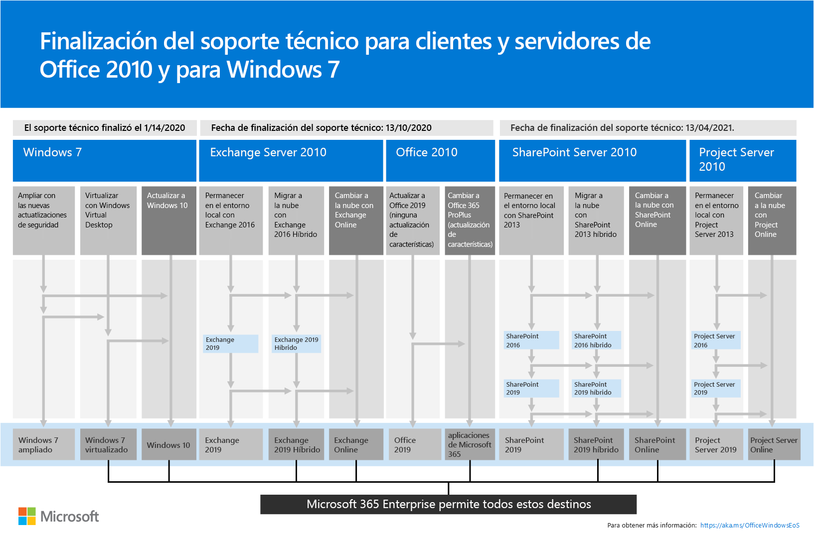
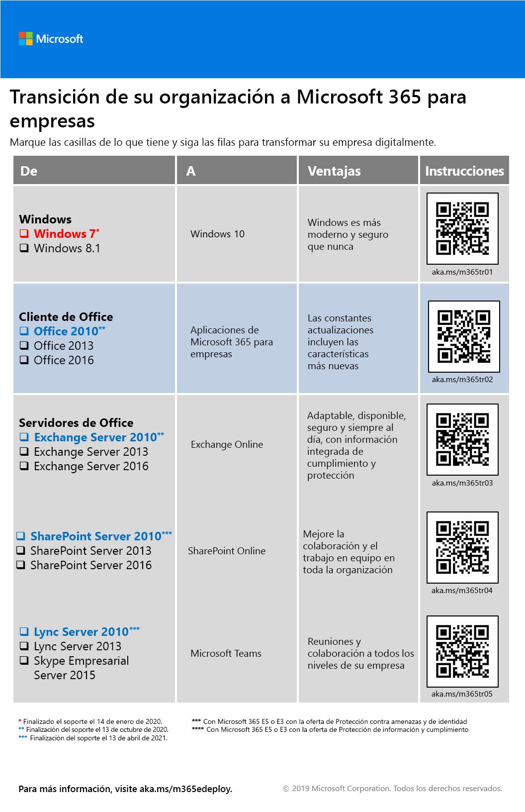

# Migración a Microsoft 365 Enterprise

La mayoría de las organizaciones empresariales poseen un entorno heterogéneo con varias versiones de sistemas operativos, software cliente y software de servidor. En Microsoft 365 Enterprise, se incluyen las versiones más seguras de estos componentes clave de su infraestructura de TI con características de productividad diseñadas para aprovechar las tecnologías de nube.

Para maximizar el valor empresarial del conjunto de productos integrados de Microsoft 365 Enterprise, empiece a planear e implementar una estrategia para migrar versiones de:

- El cliente de Office instalado en los equipos a Office 365 ProPlus
- Los servidores de Office instalados en sus servidores a servicios equivalentes en Office 365
- Windows 7 y Windows 8.1 en sus dispositivos a Windows 10 Enterprise

>[!Note]
>El soporte de Windows 7 terminó el **14 de enero de 2020**. Para más información, haga clic [aquí](https://support.microsoft.com/help/4057281/windows-7-support-will-end-on-january-14-2020).
>

Con el tiempo, completar todas estas migraciones permitirá a su organización estar más próxima al lugar de [trabajo moderno](https://www.microsoft.com/microsoft-365/blog/2018/04/27/making-it-simpler-with-a-modern-workplace/), un entorno seguro e integrado que impulsa el trabajo en equipo y la creatividad en su organización, todo ello con la tecnología de Microsoft 365 Enterprise. 

Para obtener información acerca de la migración de usuarios y datos para cargas de trabajo específicas de Office 365:

- Para los buzones de usuario de Exchange Server a Exchange Online, vea [Cargas de trabajo de Exchange Online](exchangeonline-workload.md).
- Para datos de SharePoint de SharePoint Server a SharePoint Online, vea [Cargas de trabajo de SharePoint Online](sharepoint-online-onedrive-workload.md).
- Para Skype Empresarial Online a Microsoft Teams, vea [Cargas de trabajo de Microsoft Teams](teams-workload.md).

## Migración de productos de cliente de Microsoft Office

En muchas organizaciones, tanto grandes como pequeñas, puede que se use una combinación de versiones anteriores de los productos de cliente de Office, como Word, Excel y PowerPoint. Estas versiones anteriores:

- Se pueden [actualizar](https://support.office.com/article/install-office-updates-2ab296f3-7f03-43a2-8e50-46de917611c5) con las correcciones de soporte técnico y actualizaciones de seguridad más recientes, pero a veces el proceso es manual y es posible que no pueda escalarse a toda la organización.
- No están preparadas óptimamente para aprovechar las tecnologías de nube de Microsoft y ayudarle a transformar digitalmente su negocio.
- No incluyen nuevas características.
 
Microsoft 365 Enterprise incluye Office 365 ProPlus, una versión de los productos de cliente de Office que está disponible con una licencia de Microsoft 365 Enterprise y se instala y actualiza desde la nube de Microsoft. Office 365 ProPlus incluye actualizaciones de seguridad y las características más recientes. Para más información, vea [Información sobre Office 365 ProPlus en un entorno empresarial](https://docs.microsoft.com/deployoffice/about-office-365-proplus-in-the-enterprise).

### Office 2007

Para las versiones de Office 2007, ya finalizó el período de soporte técnico. Para obtener más información, vea [Plan de fin del soporte técnico de Office 2007](https://docs.microsoft.com/deployoffice/office-2007-end-support-roadmap).

En lugar de actualizar los equipos que ejecuten Office 2007 con Office 2010, Office 2013 u Office 2016, también puede:

1. Obtener una licencia de Microsoft 365 y asignarla a los usuarios.
2. Desinstalar Office 2007 de sus equipos.
3. Instalar Office 365 ProPlus, tanto de forma individual como de forma conjunta con una implementación de TI. Para obtener más información, vea [Fase 4: Office 365 ProPlus](office365proplus-infrastructure.md).

Office 365 ProPlus instala automáticamente las actualizaciones y puede aprovechar los servicios basados en la nube de Office 365 para ofrecer una mayor seguridad y productividad.

### Office 2010

Para las versiones de Office 2010, el final del soporte técnico llegará el **13 de octubre de 2020**. Para obtener más información, vea [Guía de finalización del soporte para Office 2010](https://docs.microsoft.com/deployoffice/office-2010-end-support-roadmap).

En lugar de actualizar los equipos que ejecuten Office 2010 con Office 2013 u Office 2016 (ya que ambos tendrían que actualizarse de forma manual), también puede: 

1. Obtener una licencia de Microsoft 365 y asignarla a los usuarios.
2. Desinstalar Office 2010 de sus equipos.
3. Instalar Office 365 ProPlus, tanto de forma individual como de forma conjunta con una implementación de TI. Para obtener más información, vea [Fase 4: Office 365 ProPlus](office365proplus-infrastructure.md).

Office 365 ProPlus instala automáticamente actualizaciones de seguridad y de características nuevas y puede usar los servicios basados en la nube de Microsoft 365 para mejorar la seguridad y la productividad.

### Office 2013 y Office 2016

Aún no se ha determinado la fecha de fin del soporte técnico para las versiones de Office 2013 y Office 2016. Sin embargo, al igual que Office 2010, aún debe [instalar las actualizaciones de seguridad](https://support.office.com/article/install-office-updates-2ab296f3-7f03-43a2-8e50-46de917611c5), que podrían no ajustarse bien en función del tamaño de su organización.

En lugar de seguir actualizando los equipos con las actualizaciones de seguridad más recientes de Office 2013 u Office 2016, o de actualizar los equipos de Office 2013 a Office 2016, tenga en cuenta lo siguiente:

1. Obtener una licencia de Microsoft 365 y asignarla a los usuarios.
2. Desinstalar Office 2013 u Office 2016 en sus equipos.
3. Instalar Office 365 ProPlus, tanto de forma individual como de forma conjunta con una implementación de TI. Para obtener más información, vea [Fase 4: Office 365 ProPlus](office365proplus-infrastructure.md).

Office 365 ProPlus instala automáticamente actualizaciones de seguridad y de características nuevas y puede usar los servicios basados en la nube de Microsoft 365 para mejorar la seguridad y la productividad.

## Migración de productos de servidor de Microsoft Office

En muchas organizaciones, tanto grandes como pequeñas, puede que use una combinación de versiones anteriores de los productos de servidor de Office, como Exchange Server y SharePoint Server. Estas versiones anteriores:

- Tienen que actualizarse con las correcciones de soporte técnico y actualizaciones de seguridad más recientes. En algunos casos, estas actualizaciones se publican de forma mensual.
- No están preparadas óptimamente para aprovechar las tecnologías de nube de Microsoft y ayudarle a transformar digitalmente su negocio.
- No se incluyen las nuevas aplicaciones de productividad, como Microsoft Teams.
- No se incluyen las características de seguridad más recientes, como Protección contra amenazas avanzada de Exchange.

Microsoft 365 Enterprise incluye Office 365, que incluye las versiones basadas en la nube de servicios de servidor de Office que usan algunas de las herramientas de software de servidor de Office, como exploradores Web y el cliente de Outlook. Estos servicios se actualizan continuamente por seguridad sin involucrar a TI, lo que le ahorra tiempo en el mantenimiento y actualización de los servidores locales. Estos servicios también tienen mejoras de características nuevas que no están presentes en el software de servidor de Office. 

### Office Server 2007

Para los productos de servidor de la versión de Office 2007, ya finalizó el período de soporte técnico. Vea estos artículos para obtener más información:

- [Plan de fin del soporte técnico de Exchange 2007](https://docs.microsoft.com/office365/enterprise/exchange-2007-end-of-support)
- [Plan de fin del soporte técnico de SharePoint Server 2007](https://docs.microsoft.com/office365/enterprise/sharepoint-2007-end-of-support)
- [Plan de fin del soporte técnico de Project Server 2007](https://docs.microsoft.com/office365/enterprise/project-server-2007-end-of-support)
- [Plan de fin del soporte técnico del servidor Office Communications Server](https://docs.microsoft.com/skypeforbusiness/plan-your-deployment/upgrade)
- [Plan de fin del soporte técnico de PerformancePoint Server 2007](https://docs.microsoft.com/office365/enterprise/pps-2007-end-of-support)

En lugar de actualizar los productos de servidor en la versión de Office 2007 con las versiones de los productos de servidor de Office 2010, Office 2013 u Office 2016, también puede:

1. Migrar los datos de sus servidores de Office 2007 a Office 365. Para obtener ayuda, contrate a un partner de Microsoft.
2. Implementar la nueva función y los procesos de trabajo para los usuarios.
3. Cuando ya no se necesiten los servidores locales que ejecuten productos de servidor de Office 2007, retírelos.

### Office Server 2010

Para los productos de servidor en la versión de Office 2010, el final del soporte técnico es el **13 de octubre de 2020** para:

- [Exchange Server 2010](https://docs.microsoft.com/office365/enterprise/exchange-2010-end-of-support)
- [SharePoint Server 2010](https://docs.microsoft.com/office365/enterprise/upgrade-from-sharepoint-2010)

En lugar de actualizar los productos de servidor en la versión de Office 2010 con las versiones de los productos de servidor de Office 2013 u Office 2016, también puede:

1. Migrar los datos de los servidores de Office 2010 a Microsoft 365. Para obtener ayuda con esto, consulte [FastTrack para Microsoft 365](https://fasttrack.microsoft.com/microsoft365) o contrate a un partner de Microsoft.
2. Implementar la nueva función y los procesos de trabajo para los usuarios.
3. Cuando ya no se necesiten los servidores locales que ejecuten productos de servidor de Office 2010, retírelos.

### Office Server 2013

Para los productos de servidor de la versión de Office 2013, aún no se determinó el fin del soporte técnico. En lugar de actualizar los productos de servidor en la versión de Office 2013 con la versión de los productos de servidor de Office 2016, también puede:

1. Migrar los datos de sus servidores de Office 2013 a Office 365. Para obtener ayuda, vea [FastTrack para Microsoft 365](https://fasttrack.microsoft.com/microsoft365) o contrate a un partner de Microsoft.
2. Implementar la nueva función y los procesos de trabajo para los usuarios.
3. Cuando ya no se necesiten los servidores locales que ejecuten productos de servidor de Office 2013, retírelos.

### Office Server 2016

Para los productos de servidor de la versión de Office 2016, aún no se determinó el fin del soporte técnico. Para aprovechar las mejoras y el servicio basado en la nube para transformar digitalmente su negocio, puede:

1. Migrar los datos de sus servidores de Office 2016 a Office 365. Para obtener ayuda, vea [FastTrack para Microsoft 365](https://fasttrack.microsoft.com/microsoft365) o contrate a un partner de Microsoft.
2. Implementar la nueva función y los procesos de trabajo para los usuarios.
3. Cuando ya no se necesiten los servidores locales que ejecuten productos de servidor de Office 2016, retírelos.

## Migración para Microsoft Windows 7 y 8.1

El soporte de Windows 7 terminó el **14 de enero de 2020**. Para migrar los dispositivos que ejecuten Windows 7 o Windows 8.1, puede realizar una [actualización local](https://docs.microsoft.com/microsoft-365/enterprise/windows10-deploy-inplaceupgrade). 

Para obtener más métodos, [vea escenarios](https://docs.microsoft.com/windows/deployment/windows-10-deployment-scenarios) de implementación de Windows 10. También puede [planear la implementación de Windows 10](https://aka.ms/planforwin10deployment) por su cuenta.

## Resumen de las opciones para clientes y servidores de Office 2010 y Windows 7

Para obtener un resumen visual de las opciones de actualización, migración y desplazamiento a la nube de estos productos, vea el [póster de fin de soporte técnico.](../media/migration-microsoft-365-enterprise-workload/Office2010Windows7EndOfSupport.pdf)

Este póster de una página es una forma rápida de comprender los distintos caminos que puede seguir para evitar que los productos de cliente y servidor de Office 2010 y Windows 7 alcancen la finalización del soporte, con las rutas preferentes y la compatibilidad de destino resultante en Microsoft 365 Enterprise. resaltado.

Puede [descargar este póster](https://github.com/MicrosoftDocs/microsoft-365-docs/raw/public/microsoft-365/media/migration-microsoft-365-enterprise-workload/Office2010Windows7EndOfSupport.pdf) e imprimirlo en formato carta, legal o tabloide (11 x 17).

## Cómo Microsoft utiliza Microsoft 365 Enterprise

Vea cómo los expertos de TI de Microsoft migran la empresa a Microsoft 365 Enterprise con estos recursos: 

- [Implementar y actualizar Microsoft Office 365 ProPlus](https://www.microsoft.com/itshowcase/Article/Content/757/Deploying-and-updating-Microsoft-Office-365-ProPlus)
- [Microsoft migra 150.000 buzones a Exchange Online](https://www.microsoft.com/itshowcase/Article/Content/577/Microsoft-migrates-150000-mailboxes-to-Exchange-Online)
- [SharePoint en la nube: Obtenga información sobre cómo Microsoft llevó a cabo su propia migración](https://www.microsoft.com/itshowcase/Article/Content/691/SharePoint-to-the-cloud-Learn-how-Microsoft-ran-its-own-migration)
- [Implementar Windows 10 en Microsoft como una actualización local](https://www.microsoft.com/itshowcase/Article/Content/668/Deploying-Windows-10-at-Microsoft-as-an-inplace-upgrade)
- [Windows 10 deployment: tips and tricks from Microsoft IT (Implementación de Windows 10: sugerencias y trucos de TI de Microsoft)](https://www.microsoft.com/itshowcase/Article/Content/951/Windows-10-deployment-tips-and-tricks-from-Microsoft-IT) (vídeo)

## Realizar la transición en toda la organización

Para tener una mejor idea de cómo mover toda la organización a los productos y servicios de Microsoft 365 Enterprise, vea el [póster de transición](../media/deploy-microsoft-365-enterprise/transition-org-to-m365.pdf).

Este póster de dos páginas explica una forma rápida de realizar un inventario de su infraestructura existente y conseguir las instrucciones para moverse al producto o servicio correspondiente de Microsoft 365 Enterprise. Incluye productos de Windows y Office y otros elementos de infraestructura y seguridad, tales como la administración de dispositivos, la identidad, la información y la protección contra amenazas.

Puede [descargar este póster](https://github.com/MicrosoftDocs/microsoft-365-docs/raw/public/microsoft-365/media/deploy-microsoft-365-enterprise/transition-org-to-m365.pdf) en formato carta, legal o tabloide (11 x 17).

## Resultado

Su organización migró versiones antiguas de Microsoft Office, servidores de Office y Windows a Microsoft 365 Enterprise.
