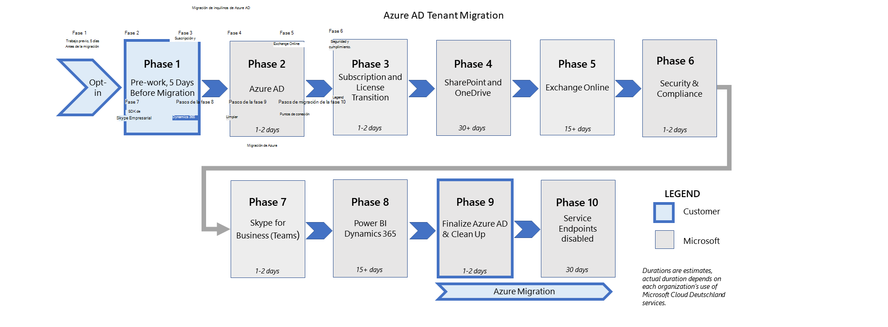

# Fases de migración acciones e impactos para la migración desde Microsoft Cloud Deutschland (avanzado)Migration phases actions and impacts for the migration from Microsoft Cloud Deutschland (advanced) 

Las migraciones de inquilinos de Microsoft Cloud Deutschland a la región alemana de los servicios de Office 365 de Microsoft se ejecutan como un conjunto de fases y sus acciones configuradas para cada carga de trabajo.Tenant migrations from Microsoft Cloud Deutschland to the Germany region of Microsoft's Office 365 services are executed as a set of phases and their configured actions for each workload. Esta figura muestra las nueve fases de migración a los nuevos centros de datos alemanes.This figure shows the nine phases of migration to the new German datacenters.

En las secciones siguientes se proporciona información adicional sobre las experiencias de los clientes al pasar de Microsoft Cloud Germany (Microsoft Cloud Deutschland) a los servicios de Office 365 en la nueva región del centro de datos alemán.The following sections provide additional information on customer experiences when moving from Microsoft Cloud Germany (Microsoft Cloud Deutschland) to Office 365 services in the new German datacenter region.

## Servicios del portal de Office 365Office 365 Portal Services

Entre la fase 2 de 9 y la fase 3 de 9, es posible que el Portal de partners no sea accesible.Between Phase 2 of 9 and Phase 3 of 9, Partner Portal may not be accessible. Durante este tiempo, es posible que el partner no pueda tener acceso a la información de los inquilinos en el Portal de partners.During this time, Partner may not be able to access the tenants information on the Partner Portal. Dado que cada migración es diferente, la duración de la accesibilidad podría ser en horas.Since each migration is different, the duration of in-accessibility could be in hours.

### Trabajo previo para Azure AD (fase 2)Prework for Azure AD (Phase 2)

| PasosStep(s) | DescripciónDescription | Se aplica aApplies to | ImpactoImpact |
|:-------|:-----|:-------|:-------|
| Inquilino de Azure AD en Microsoft Cloud Deutschland copiado en Servicios de Office 365.Azure AD tenant in Microsoft Cloud Deutschland copied to Office 365 Services. | Azure AD copia el espacio empresarial en los servicios de Office 365.Azure AD copies the tenant to Office 365 services. Se conservan los identificadores de inquilino y de usuario.Tenant and user identifiers are preserved. Las llamadas de servicio de Azure AD se redirigen desde Microsoft Cloud Deutschland a los servicios de Office 365 y son transparentes para los servicios.Azure AD service calls are redirected from Microsoft Cloud Deutschland to Office 365 services and are transparent to services. | Todos los clientes de OfficeAll Office customers | - Las solicitudes de interesados (DSR) del Reglamento general de protección de datos (RGPD) se ejecutan desde el Portal de administración de Azure para futuras solicitudes.- General Data Protection Regulation (GDPR) Data Subject Requests (DSRs) are executed from the Azure Admin portal for future requests. Los datos de diagnóstico heredados o que no son del cliente que residen en Microsoft Cloud Deutschland se eliminan en o antes de que transcurren 30 días.Any legacy or non-customer diagnostic data that is resident in Microsoft Cloud Deutschland is deleted at or before 30 days elapse.    - Los clientes que usan autenticaciones federadas con Servicios de federación de Active Directory (AD FS) no deben realizar cambios en los URI del emisor que se usan para todas las autenticaciones con Active Directory local durante la migración.- Customers who use federated authentications with Active Directory Federation Services (AD FS) shouldn't make changes to issuer URIs that are used for all authentications with on-premises Active Directory during migration. Cambiar los URI del emisor provocará errores de autenticación para los usuarios del dominio.Changing issuer URIs will lead to authentication failures for users in the domain. Los URI del emisor se pueden cambiar directamente en AD  FS o cuando un dominio se convierte de administrado a _federado_ y viceversa.Issuer URIs can be changed directly in AD FS or when a domain is converted from _managed_ to _federated_ and vice-versa. Se recomienda que los clientes no agreguen, quiten o conviertan un dominio federado en el inquilino de Azure AD que se ha migrado.We recommend that customers do not add, remove, or convert a federated domain in the Azure AD tenant that has been migrated. Los URI del emisor se pueden cambiar una vez completada la migración.Issuer URIs can be changed after the migration is fully complete.    - Solicitudes de autenticación multifactor (MFA) que usan la presentación de Microsoft Authenticator como objectid de usuario (GUID) mientras el inquilino se copia en los servicios de Office 365.- Multi-factor authentication (MFA) requests that use Microsoft Authenticator display as the user ObjectID (a GUID) while the tenant is copied to Office 365 services. Las solicitudes MFA se realizarán según lo esperado a pesar de este comportamiento de presentación.MFA requests will perform as expected despite this display behavior.  Las cuentas de Microsoft Authenticator que se activaron mediante puntos de conexión de servicios de Office 365 mostrarán el nombre principal de usuario (UPN).Microsoft Authenticator accounts that were activated by using Office 365 services endpoints will display the user principal name (UPN).  Las cuentas agregadas mediante puntos de conexión de Microsoft Cloud Deutschland mostrarán el ObjectID del usuario, pero funcionarán con puntos de conexión de servicios de Microsoft Cloud Deutschland y Office 365.Accounts added by using Microsoft Cloud Deutschland endpoints will display the user ObjectID but will work with both Microsoft Cloud Deutschland and Office 365 services endpoints.  |
| Migración de recursos de Azure.Migration of Azure resources. | Los clientes que usan recursos de Office 365 y Azure (por ejemplo, redes, proceso y almacenamiento) realizarán la migración de recursos a la instancia de servicios de Office 365.Customers who use Office 365 and Azure resources (for example, networking, compute, and storage) will perform the migration of resources to the Office 365 services instance. Esta migración es una responsabilidad de los clientes.This migration is a responsibility for customers. Las publicaciones del Centro de mensajes marcarán el inicio.Message Center posts will signal the start. La migración debe completarse antes de finalizar la organización de Azure AD en el entorno de servicios de Office 365.Migration must be completed before finalization of the Azure AD organization in the Office 365 services environment. | Clientes de AzureAzure Customers | Para las migraciones de Azure, consulte el libro de reproducción de migración de Azure, Información general sobre las instrucciones [de migración para Azure Germany](https://docs.microsoft.com/azure/germany/germany-migration-main).For Azure migrations, see the Azure migration playbook, [Overview of migration guidance for Azure Germany](https://docs.microsoft.com/azure/germany/germany-migration-main). |
|||||

### Exchange Online antes de la fase 5Exchange Online before phase 5

**Se aplica a:** Todos los clientes que usan una configuración híbrida de Exchange con servidores exchange locales**Applies to:** All customers using an Exchange Hybrid Configuration with Exchange servers on premises

| PasosStep(s) | DescripciónDescription | ImpactoImpact |
|:-------|:-------|:-------|
| Establecer AuthServer local que señale al servicio STS global.Establish AuthServer on-premises pointing to global STS service. | Esto garantiza que las solicitudes de los usuarios que migran a Microsoft Cloud Deutschland para solicitudes de disponibilidad de Exchange destinadas al entorno local híbrido se autentican para obtener acceso al servicio local.This ensures that requests from users who migrate to Microsoft Cloud Deutschland for Exchange availability requests that target the hybrid on-premises environment are authenticated to access the on-premises service. Del mismo modo, se garantizará la autenticación de solicitudes desde locales a puntos de conexión de servicios de Office 365.Similarly this will ensure authentication of requests from on-premises to Office 365 services endpoints. | Una vez completada la migración de Azure AD, el administrador de la topología local de Exchange (híbrida) debe agregar un nuevo extremo de servicio de autenticación para los servicios de Office 365.After Azure AD migration is complete, the administrator of the on-premises Exchange (hybrid) topology must add a new authentication service endpoint for the Office 365 services. Con este comando de Exchange PowerShell, reemplace por el identificador de inquilino de su organización (que se encuentra en `<TenantID>` Azure Portal en Azure Active **Directory**).With this command from Exchange PowerShell, replace `<TenantID>` with your organization's tenant ID (found in Azure portal on **Azure Active Directory**).  `New-AuthServer GlobalMicrosoftSts -AuthMetadataUrl https://accounts.accesscontrol.windows.net/<TenantId>/metadata/json/1`     Si no se completa esta tarea, es posible que las solicitudes híbridas de disponibilidad no proporcionen información a los usuarios de buzones que se han migrado de Microsoft Cloud Deutschland a los servicios de Office 365.Failing to complete this task may result in hybrid free-busy requests failing to provide information for mailbox users who have been migrated from Microsoft Cloud Deutschland to Office 365 services.  |
|Detener o eliminar cualquier movimiento de buzón de correo de incorporación o de salida, es decir, no mover buzones entre Exchange local y Exchange OnlineStop or delete any onboarding or offboarding mailbox moves, namely don't move mailboxes between Exchange on premises and Exchange Online  | Esto garantiza que las solicitudes de movimiento del buzón no fallen con un error.This ensures the mailbox move requests don't fail with an error. | Si no lo hace, puede producirse un error en el servicio o en clientes de software.Failure to do so may result in failure of the service or of software clients. |
||||

<!--
    Question from ckinder
    Not clear if this has to be done before, during or after phase 5
-->

**Se aplica a:** Todos los clientes que almacenan fotos de usuario en Exchange Online y usan **Set-UserPhoto**:**Applies to:** All customers storing user photos in Exchange Online and are  using **Set-UserPhoto**:

| PasosStep(s) | DescripciónDescription | ImpactoImpact |
|:-------|:-------|:-------|
| La nueva región "Alemania" se agrega a una configuración existente de la organización de Exchange Online y los buzones se mueven a los servicios de Office 365.The new region "Germany" is added to an existing Exchange Online organization setup, and mailboxes are moved to Office 365 services. | La configuración de Exchange Online agrega la nueva región alemana local a la organización de transición.Exchange Online configuration adds the new go-local German region to the transitioning organization. Esta región de servicios de Office 365 se establece como predeterminada, lo que permite al servicio de equilibrio de carga interno redistribuir buzones a la región predeterminada adecuada en los servicios de Office 365.This Office 365 services region is set as default, which enables the internal load-balancing service to redistribute mailboxes to the appropriate default region in Office 365 services. En esta transición, los usuarios de ambos lados (servicios de Alemania u Office 365) están en la misma organización y pueden usar cualquier extremo de dirección URL.In this transition, users on either side (Germany or Office 365 services) are in the same organization and can use either URL endpoint. | Si se ha migrado un buzón de usuario pero no se ha migrado un buzón de administrador, o viceversa, los administradores no podrán ejecutar **Set-UserPhoto**, un cmdlet de PowerShell.If a user mailbox has been migrated but an administrator mailbox hasn't been migrated, or vice-versa, administrators won't be able to run **Set-UserPhoto**, a PowerShell cmdlet. En esta situación, un administrador debe pasar una cadena adicional durante la configuración de la conexión `ConnectionUri` mediante la sintaxis siguiente:In this situation, an admin must pass an additional string in `ConnectionUri` during connection set up by using the following syntax:   `https://outlook.office.de/PowerShell-LiveID?email=<user_email>`   donde es el marcador de posición del identificador de correo electrónico del usuario cuya foto debe `<user_email>` cambiarse mediante **Set-UserPhoto**.where `<user_email>` is the placeholder for the email-ID of the user whose photo needs to be changed by using **Set-UserPhoto**. |
||||

## Durante la migraciónDuring migration

### Fase 4 de SharePoint OnlineSharePoint Online phase 4

**Se aplica a:** Todos los clientes que usan eDiscovery**Applies to:** All customers using eDiscovery

| PasosStep(s) | DescripciónDescription | ImpactoImpact |
|:-------|:-------|:-------|
| SharePoint y OneDrive se transiciónn.SharePoint and OneDrive are transitioned. | SharePoint y OneDrive se migran de Microsoft Cloud Deutschland a los servicios globales de Office 365 en la fase 4.SharePoint and OneDrive are migrated from Microsoft Cloud Deutschland to Office 365 Global services in phase 4. Las direcciones URL existentes de Microsoft Cloud Deutschland se conservan ( `contoso.sharepoint.de` ).Existing Microsoft Cloud Deutschland URLs are preserved (`contoso.sharepoint.de`). Los tokens emitidos por los servicios de Microsoft Cloud Deutschland u Office 365 son válidos durante la transición.Tokens issued by Microsoft Cloud Deutschland or Office 365 services are valid during the transition. | Los flujos de trabajo de SharePoint 2013 a bordo se romperán durante la migración y deben volver a publicarse después de la migración.Inflight SharePoint 2013 workflows will be broken during migration and must be republished after migration. |
||||

### Fase 4 de exhibición de documentos electrónicos al final de la fase 9eDiscovery phase 4 to the end of phase 9

**Se aplica a:** Todos los clientes que usan eDiscovery**Applies to:** All customers using eDiscovery

| PasosStep(s) | DescripciónDescription | ImpactoImpact |
|:-------|:-------|:-------|
| Desde el principio de la fase 4 hasta que se complete la fase 9, las búsquedas de exhibición de documentos electrónicos producirán un error o devolverán 0 resultados para las ubicaciones de SharePoint Online, OneDrive para la Empresa y Exchange Online que se han migrado.From the beginning of phase 4 until phase 9 is completed, eDiscovery searches will fail or return 0 results for SharePoint Online, OneDrive for Business, and Exchange Online locations that have been migrated. | Durante la migración, los clientes pueden seguir crear casos, retenciones, búsquedas y exportaciones en el Centro de seguridad [& cumplimiento,](https://docs.microsoft.com/microsoft-365/compliance/manage-legal-investigations)incluida [la búsqueda de contenido.](https://docs.microsoft.com/microsoft-365/compliance/search-for-content)During migration, customers can continue to create cases, holds, searches, and exports in the [Security & Compliance Center](https://docs.microsoft.com/microsoft-365/compliance/manage-legal-investigations), including [Content Search](https://docs.microsoft.com/microsoft-365/compliance/search-for-content).  Sin embargo, las búsquedas en las ubicaciones de SharePoint Online, OneDrive para la Empresa y Exchange Online que se han migrado devolverán 0 resultados o producirán un error.However, searches against SharePoint Online, OneDrive for Business, and Exchange Online locations that have been migrated will either return 0 results or produce an error. Para obtener información sobre la corrección, consulte la _columna Impacto._For remediation, see the _Impact_ column. | En caso de que una búsqueda devuelva cero resultados o un error durante la migración, haga lo siguiente para SharePoint Online:In the event that a search returns zero results or an error during migration, please take the following action for SharePoint Online: <ul><li>Descargue sitios directamente desde el sitio de SharePoint Online/ OneDrive para la Empresa siguiendo las instrucciones de Descargar archivos y carpetas [de OneDrive o SharePoint](https://support.office.com/article/download-files-and-folders-from-onedrive-or-sharepoint-5c7397b7-19c7-4893-84fe-d02e8fa5df05).Download sites directly from SharePoint Online/ OneDrive for Business site by following the instructions in [Download files and folders from OneDrive or SharePoint](https://support.office.com/article/download-files-and-folders-from-onedrive-or-sharepoint-5c7397b7-19c7-4893-84fe-d02e8fa5df05). Este método requerirá permisos de administrador de SharePoint Online o permisos de solo lectura en el sitio.This method will require SharePoint Online administrator permissions or read-only permissions on the site.</li><li>Si se superan los límites, como se explica en Descargar archivos y carpetas de OneDrive o [SharePoint,](https://support.office.com/article/download-files-and-folders-from-onedrive-or-sharepoint-5c7397b7-19c7-4893-84fe-d02e8fa5df05)los clientes pueden usar el cliente de sincronización de OneDrive para la Empresa siguiendo las instrucciones de Sincronizar archivos de SharePoint y Teams con el [equipo.](https://support.office.com/article/sync-sharepoint-files-with-the-new-onedrive-sync-app-6de9ede8-5b6e-4503-80b2-6190f3354a88)If limits are exceeded, as explained in [Download files and folders from OneDrive or SharePoint](https://support.office.com/article/download-files-and-folders-from-onedrive-or-sharepoint-5c7397b7-19c7-4893-84fe-d02e8fa5df05), customers can use the OneDrive for Business sync client by following the guidance in [Sync SharePoint and Teams files with your computer](https://support.office.com/article/sync-sharepoint-files-with-the-new-onedrive-sync-app-6de9ede8-5b6e-4503-80b2-6190f3354a88).</li><li>Para obtener más información, [vea Exhibición de](https://docs.microsoft.com/Exchange/policy-and-compliance/ediscovery/ediscovery) documentos electrónicos local en Exchange ServerFor more information see  [In-Place eDiscovery in Exchange Server](https://docs.microsoft.com/Exchange/policy-and-compliance/ediscovery/ediscovery) |
||||

## Después de la migraciónPost-migration

### Fase 9 de Azure ADAzure AD phase 9

**Se aplica a:** Todos los clientes sincronizan identidades con Azure AD connect**Applies to:** All customers synchronizing identities with Azure AD connect

| PasosStep(s) | DescripciónDescription | ImpactoImpact |
|:-------|:-------|:-------|
| Actualice Azure AD Connect.Update Azure AD Connect. | Una vez completado el recorte a Azure AD, la organización usa completamente los servicios de Office 365 y ya no está conectada a Microsoft Cloud Deutschland.After the cut over to Azure AD is complete, the organization is fully using Office 365 services and is no longer connected to Microsoft Cloud Deutschland. En este momento, el cliente debe asegurarse de que el proceso de sincronización delta se ha finalizado y, después, cambiar el valor de cadena de `AzureInstance` 3 (Microsoft Cloud Deutschland) a 0 en la ruta de acceso del Registro `Computer\HKEY_LOCAL_MACHINE\SOFTWARE\Microsoft\Azure AD Connect` .At this point, the customer needs to ensure that the delta sync process has been finalized, and after that, change the string value of `AzureInstance` from 3 (Microsoft Cloud Deutschland) to 0 in the registry path `Computer\HKEY_LOCAL_MACHINE\SOFTWARE\Microsoft\Azure AD Connect`. | Cambie el valor de `AzureInstance` , la clave del Registro.Change the value of `AzureInstance`, the registry key. Si no lo hace, los objetos no se sincronizarán después de que los puntos de conexión de Microsoft Cloud Deutschland ya no estén disponibles.Failing to do so, will lead to objects not being synchronized after the Microsoft Cloud Deutschland endpoints are no longer available. |
|||||

**Se aplica a:** Todos los clientes que usan autenticación federada con ADFS**Applies to:** All customers using federated authentication with ADFS

| PasosStep(s) | DescripciónDescription | ImpactoImpact |
|:-------|:-------|:-------|
| Quitar confianzas de usuario de confianza de Microsoft Cloud Deutschland AD FS.Remove relying party trusts from Microsoft Cloud Deutschland AD FS. | Una vez completado el recorte a Azure AD, la organización usa completamente los servicios de Office 365 y ya no está conectada a Microsoft Cloud Deutschland.After the cut over to Azure AD is complete, the organization is fully using Office 365 services and is no longer connected to Microsoft Cloud Deutschland. En este punto, el cliente debe quitar la confianza de usuario de confianza a los puntos de conexión de Microsoft Cloud Deutschland.At this point, the customer needs to remove the relying party trust to the Microsoft Cloud Deutschland endpoints. Esto solo se puede hacer cuando ninguna aplicación del cliente apunta a puntos de conexión de Microsoft Cloud Deutschland cuando Azure AD se aprovecha como proveedor de identidades (IdP).This can only be done when no applications of the customer point to Microsoft Cloud Deutschland endpoints when Azure AD is leveraged as an Identity Provider (IdP). | Organizaciones de autenticación federadaFederated Authentication organizations | Ninguna.None. |
|||||

<!--
    Question from ckinder
    The following paragraph is not clear
-->
Para Azure AD:For Azure AD:

| PasosStep(s) | DescripciónDescription | Se aplica aApplies to | ImpactoImpact |
|:-------|:-----|:-------|:-------|
| Las solicitudes para unirse a un grupo de Azure AD en los últimos 30 días antes de la migración tendrán que volver a solicitarse si la solicitud original no se aprobó.Requests to join an Azure AD group in the last 30 days before migration will need to be requested again if the original request wasn't approved. | Los clientes del usuario final tendrán que usar el panel de Access para enviar una solicitud para unirse de nuevo a un grupo de Azure AD si dichas solicitudes no se aprobaron en los últimos 30 días antes de la migración.End-user customers will need to use the Access panel to submit request to join an Azure AD group again if those requests weren't approved in the last 30 days before the migration. | Usuarios finales cuyas solicitudes de aprobación de grupo de Azure AD no se aprobaron en los últimos 30 días antes de la migraciónEnd users whose Azure AD group approval requests weren't approved in last 30 days before migration |  Como usuario final:As an end user: <ol><li>Vaya al [panel De acceso](https://account.activedirectory.windowsazure.com/r#/joinGroups).Navigate to [Access panel](https://account.activedirectory.windowsazure.com/r#/joinGroups).</li><li>Busque un grupo de Azure AD para el que la aprobación de pertenencia estaba pendiente en 30 días antes de la migración.Find an Azure AD group for which membership approval was pending in 30 days before migration.</li><li>Solicitar unirse de nuevo al grupo de Azure AD.Request to join the Azure AD group again.</li></ol> Las solicitudes para unirse a un grupo que están activos menos de 30 días antes de la migración no se pueden aprobar, a menos que se vuelvan a solicitar después de la migración.Requests to join a group that are active less than 30 days before migration cannot be approved, unless they're re-requested after migration. |
|||||

<!--
    Question from ckinder
    The following paragraph is not clear
-->
**Se aplica a:**  Todos los clientes que administran sus propias zonas DNS**Applies to:**  All customer managing their own DNS zones

| PasosStep(s) | DescripciónDescription | Se aplica aApplies to | ImpactoImpact |
|:-------|:-----|:-------|:-------|
| Actualice los servicios DNS locales para los puntos de conexión de servicios de Office 365.Update on-premises DNS services for Office 365 services endpoints. | Las entradas DNS administradas por el cliente que apuntan a Microsoft Cloud Deutschland deben actualizarse para que apunten a los extremos de servicios globales de Office 365.Customer-managed DNS entries that point to Microsoft Cloud Deutschland need to be updated to point to the Office 365 Global services endpoints. | Si no lo hace, puede producirse un error en el servicio o en clientes de software.Failure to do so may result in failure of the service or of software clients. |
||||

Para servicios de terceros para puntos de conexión de servicios de Office 365:For third-party services for Office 365 services endpoints:

| PasosStep(s) | DescripciónDescription | ImpactoImpact |
|:-------|:-------|:-------|
| Actualice los partners y servicios de terceros para los puntos de conexión de servicios de Office 365.Update partners and third-party services for Office 365 services endpoints. | <ul><li>Los servicios y asociados de terceros que apunten a Office 365 Germany deben actualizarse para que apunten a los extremos de servicios de Office 365.Third-party services and partners that point to Office 365 Germany need to be updated to point to the Office 365 services endpoints. Ejemplo: vuelva a registrar, en alineación con sus proveedores y asociados, la versión de la aplicación de galería de aplicaciones, si está disponible.Example: Re-register, in alignment with your vendors and partners, the gallery app version of applications, if available. </li><li>Apunte todas las aplicaciones personalizadas que aprovechan la API de Graph `graph.microsoft.de` de `graph.microsoft.com` a .Point all custom applications that leverage Graph API from `graph.microsoft.de` to `graph.microsoft.com`. Otras API con puntos de conexión modificados también deben actualizarse, si se aprovechan.Other APIs with changed endpoints also need to be updated, if leveraged. </li><li>Cambie todas las aplicaciones empresariales que no son de primera persona para redirigir a los puntos de conexión mundiales.Change all non-first-party enterprise applications to redirect to the worldwide endpoints. </li></ul>| Acción necesaria.Required action. Si no lo hace, puede producirse un error en el servicio o en clientes de software.Failure to do so may result in failure of the service or of software clients. |
||||

### Migración posterior a SharePoint OnlineSharePoint Online post migration

| PasosStep(s) | DescripciónDescription | Se aplica aApplies to | ImpactoImpact |
|:-------|:-----|:-------|:-------|
| Vuelva a publicar flujos de trabajo de SharePoint 2013.Republish SharePoint 2013 workflows. | En el trabajo previo a la migración, se redujo el número de flujos de trabajo de SharePoint 2013.In the pre-migration work, we reduced the number of SharePoint 2013 workflows. Ahora, una vez completada la migración, el cliente puede volver a publicar los flujos de trabajo.Now with migration complete, the customer can republish the workflows. | Se trata de una acción necesaria.This is a required action. Si no lo hace, puede provocar confusión del usuario y llamadas al servicio de ayuda.Failure to do so may result in user confusion and help desk calls. |
| Compartir elementos a través de OutlookShare items via Outlook | El uso compartido de elementos en SharePoint Online y OneDrive para la Empresa a través de Outlook ya no funciona después de la transferencia del espacio empresarial.Sharing items in  SharePoint Online and OneDrive for Business via Outlook no longer works after tenant cutover. |<ul><li>En SharePoint Online y OneDrive para la Empresa, puede compartir elementos a través de Outlook.In SharePoint Online and OneDrive for Business, you can share items via Outlook. Después de presionar el botón de Outlook, se crea un vínculo que se puede compartir y se inserta en un nuevo mensaje en Outlook Web App.After pressing the Outlook button, a shareable link is created and pushed into a new message in the Outlook Web App.</li><li>Después de la extensión del espacio empresarial, este método de uso compartido no funcionará.After tenant cutover, this method of sharing won't work. Reconocemos que se trata de un problema conocido.We recognize this is a known issue. Sin embargo, dado que esta característica de Outlook está en la ruta de desuso, no se planea solucionar el problema hasta que se desaproteje.However, since this Outlook feature is in the path of deprecation, fixing the issue is not planned until the deprecation is rolled out. </li></ul>|
||||

### Migración posterior a Exchange OnlineExchange Online post migration

Si usa una configuración híbrida de Exchange:If you're using a hybrid Exchange configuration:

| PasosStep(s) | DescripciónDescription | ImpactoImpact |
|:-------|:-------|:-------|
| Vuelva a ejecutar el Asistente para configuración híbrida (HCW) en los servicios de Office 365.Rerun Hybrid Configuration wizard (HCW) against Office 365 services. | La configuración de HCW existente está pensada para admitir Microsoft Cloud Deutschland.The existing HCW configuration is meant to support Microsoft Cloud Deutschland. Una vez completada la migración de los servicios exchange, desasociamos la configuración local de Microsoft Cloud Deutschland.With migration of Exchange services complete, we decouple on-premises configuration from Microsoft Cloud Deutschland. |<ul><li>Acción necesaria.Required action. Si no lo hace, puede producirse un error en el servicio o en clientes de software.Failure to do so may result in failure of the service or of software clients. Antes de que comience la migración de buzones de Exchange (con 5 o más días de aviso), notifique a los clientes que deben detener y eliminar cualquier movimiento de incorporación o desaborde de sus buzones.Before Exchange mailbox migration begins (with 5 or more days of notice), notify clients that they should stop and delete any onboarding or offboarding moves of their mailboxes.  Si no lo hacen, verán errores en sus solicitudes de movimiento.If they don't, they'll see errors in their move requests. </li><li>Una vez completada la migración de buzones de Exchange, notifique a los clientes que pueden reanudar los movimientos de incorporación y de salida.After Exchange mailbox migration is complete, notify clients that they can resume onboarding and offboarding moves.   Es posible que la ejecución de **Test-MigrationServerAvailabiilty**, un cmdlet de PowerShell, durante la migración de Exchange desde Microsoft Cloud Deutschland a los servicios de Office 365 no funcione.Running **Test-MigrationServerAvailabiilty**, a PowerShell cmdlet, during migration of Exchange from Microsoft Cloud Deutschland to Office 365 services might not work. Sin embargo, funcionará correctamente una vez completada la migración.However, it will work properly after migration is complete. </li><li>Si los clientes tienen problemas con las credenciales o la autorización después de migrar los buzones, los usuarios pueden volver a escribir sus credenciales de administrador local en el extremo de migración ejecutando o estableciendo lo mismo mediante el Panel de `Set-MigrationEndpoint endpointName -Credential $(Get-Credential)` control de Exchange (ECP).If clients run into issues with credentials or authorization after mailboxes are migrated, users can reenter their on-premises administrator credentials in the migration endpoint by running `Set-MigrationEndpoint endpointName -Credential $(Get-Credential)`, or by setting the same by using Exchange Control Panel (ECP). </li></ul>|

### eDiscovery post migrationeDiscovery post migration

| PasosStep(s) | DescripciónDescription | Se aplica aApplies to | ImpactoImpact |
|:-------|:-----|:-------|:-------|
|  Todas las ubicaciones de SharePoint Online, OneDrive para la Empresa y Exchange Online se han migrado junto con el Centro de seguridad y cumplimiento (SCC).All SharePoint Online, OneDrive for Business, and Exchange Online locations have been migrated along with Security and Compliance Center (SCC). | Toda la actividad de exhibición de documentos electrónicos debe ejecutarse desde el espacio empresarial mundial.All eDiscovery activity should be run from the worldwide tenant. Las búsquedas ahora serán 100% correctas.Searches will now be 100% successful.  Cualquier error o error debe seguir los canales de soporte técnico normales.Any failures or errors should follow normal support channels. | Todos los clientes que usan eDiscoveryAll customers who use eDiscovery | Ninguna.None. |
| Quitar directivas de retención de toda la organización que se crearon durante los pasos previos a la migraciónRemove organization-wide retention policies that were created during pre-migration steps | Los clientes pueden quitar las directivas de retención de toda la organización que se crearon durante el trabajo previo a la migración de los clientes.Customers can remove the organization-wide retention policies that were created during the customers' pre-migration work. | Todos los clientes que aplicaron una directiva de retención como parte de los pasos previos a la migración.All customers who applied a retention policy as part of pre-migration steps. | Ninguna.None. |
|||||

## Paso siguienteNext step

[Comprender las acciones y los impactos de las fases de migraciónUnderstand migration phases actions and impacts](ms-cloud-germany-transition-phases.md)

## Más informaciónMore information

Introducción:Getting started:

- [Migración de Microsoft Cloud Deutschland a servicios de Office 365 en las nuevas regiones del centro de datos alemánMigration from Microsoft Cloud Deutschland to Office 365 services in the new German datacenter regions](ms-cloud-germany-transition.md)
- [Asistencia para la migración a Microsoft Cloud AlemaniaMicrosoft Cloud Deutschland Migration Assistance](https://aka.ms/germanymigrateassist)
- [Cómo participar en la migraciónHow to opt-in for migration](ms-cloud-germany-migration-opt-in.md)
- [Experiencia del cliente durante la migraciónCustomer experience during the migration](ms-cloud-germany-transition-experience.md)

Pasar a través de la transición:Moving through the transition:

- [Impactos y acciones de las fases de migraciónMigration phases actions and impacts](ms-cloud-germany-transition-phases.md)
- [Pre-work adicionalAdditional pre-work](ms-cloud-germany-transition-add-pre-work.md)
- Información adicional para [Azure AD,](ms-cloud-germany-transition-azure-ad.md) [dispositivos,](ms-cloud-germany-transition-add-devices.md) [experiencias](ms-cloud-germany-transition-add-experience.md)y [AD FS](ms-cloud-germany-transition-add-adfs.md).Additional information for [Azure AD](ms-cloud-germany-transition-azure-ad.md), [devices](ms-cloud-germany-transition-add-devices.md), [experiences](ms-cloud-germany-transition-add-experience.md), and [AD FS](ms-cloud-germany-transition-add-adfs.md).

Aplicaciones en la nube:Cloud apps:

- [Información del programa de migración de Dynamics 365Dynamics 365 migration program information](https://aka.ms/d365ceoptin)
- [Información del programa de migración de Power BIPower BI migration program information](https://aka.ms/pbioptin)
- [Introducción a su actualización de Microsoft TeamsGetting started with your Microsoft Teams upgrade](https://aka.ms/SkypeToTeams-Home)
