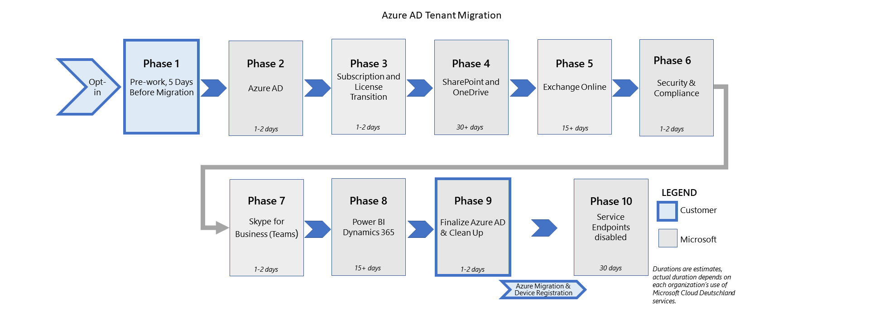

# Fases de migración acciones e impactos para la migración desde Microsoft Cloud Deutschland (avanzado) 

Las migraciones de inquilinos de Microsoft Cloud Deutschland a la región de Alemania de los servicios de Office 365 de Microsoft se ejecutan como un conjunto de fases y sus acciones configuradas para cada carga de trabajo. En esta figura se muestran las nueve fases de migración a los nuevos centros de datos alemanes.

Las secciones siguientes proporcionan información adicional sobre las experiencias de los clientes al pasar de Microsoft Cloud Alemania (Microsoft Cloud Deutschland) a los servicios de Office 365 en la nueva región del centro de datos alemán.

## Servicios

### Azure AD (fase 2 de 9)

| Pasos | Description | Se aplica a | Impacto |
|:-------|:-----|:-------|:-------|
| Inquilino de Azure AD en Microsoft Cloud Deutschland copiado a servicios de Office 365. | Azure AD copia el inquilino en los servicios de Office 365. Se conservan los identificadores de inquilino y usuario. Las llamadas de servicio de Azure AD se redirigen desde Microsoft Cloud Deutschland a los servicios de Office 365 y son transparentes para los servicios. | Todos los clientes de Office | - Las solicitudes de interesados (DSR) del Reglamento general de protección de datos (RGPD) se ejecutan desde el portal de administración de Azure para solicitudes futuras. Los datos de diagnóstico heredados o que no son de cliente que residen en Microsoft Cloud Deutschland se eliminan en un plazo de 30 días o antes.    - Los clientes que usan autenticaciones federadas con servicios de federación de Active Directory (AD FS) no deben realizar cambios en los URI del emisor que se usan para todas las autenticaciones con Active Directory local durante la migración. Cambiar los URI del emisor provocará errores de autenticación para los usuarios del dominio. Los URI del emisor se pueden cambiar directamente en AD  FS  o cuando un dominio se convierte de administrado a federado y viceversa. Se recomienda que los clientes no agreguen, quiten ni conviertan un dominio federado en el inquilino de Azure AD que se ha migrado. Los URI del emisor se pueden cambiar una vez completada por completo la migración.    - Las solicitudes de autenticación multifactor (MFA) que usan Microsoft Authenticator se muestran como el ObjectID de usuario (un GUID) mientras el inquilino se copia en los servicios de Office 365. Las solicitudes mfa se realizarán según lo esperado a pesar de este comportamiento de visualización.  Las cuentas de Microsoft Authenticator que se activaron con puntos de conexión de servicios de Office 365 mostrarán el nombre principal de usuario (UPN).  Las cuentas agregadas con puntos de conexión de Microsoft Cloud Deutschland mostrarán el ObjectID del usuario, pero funcionarán con los puntos de conexión de servicios de Microsoft Cloud Deutschland y Office 365.  |
| Establecer AuthServer local que señale al servicio STS global. | Esto garantiza que las solicitudes de los usuarios que migran a Microsoft Cloud Deutschland para las solicitudes de disponibilidad de Exchange destinadas al entorno local híbrido se autentican para acceder al servicio local. De forma similar, esto garantizará la autenticación de las solicitudes de los puntos de conexión locales a los servicios de Office 365. | Clientes de Exchange Online con implementaciones híbridas (locales) | Una vez completada la migración de Azure AD, el administrador de la topología de Exchange local (híbrida) debe agregar un nuevo punto de conexión de servicio de autenticación para los servicios de Office 365. Con este comando de Exchange PowerShell, reemplace por el id. de inquilino de su organización (que se encuentra en `<TenantID>` Azure Portal en Azure Active **Directory).**    - `New-AuthServer GlobalMicrosoftSts -AuthMetadataUrl https://accounts.accesscontrol.windows.net/<TenantId>/metadata/json/1`     Si no se completa esta tarea, las solicitudes híbridas de disponibilidad podrían no proporcionar información a los usuarios de buzones que han migrado de Microsoft Cloud Deutschland a los servicios de Office 365.  |
| Migración de recursos de Azure. | Los clientes que usan recursos de Office 365 y Azure (por ejemplo, redes, cálculo y almacenamiento) realizarán la migración de recursos a la instancia de servicios de Office 365. Esta migración es una responsabilidad de los clientes. Las publicaciones del Centro de mensajes señalarán el inicio. La migración debe completarse antes de finalizar la organización de Azure AD en el entorno de servicios de Office 365. | Clientes de Azure | Para las migraciones de Azure, vea el libro de reproducción de migración de Azure, Información general sobre las instrucciones de [migración para Azure Alemania.](https://docs.microsoft.com/azure/germany/germany-migration-main) |
|||||

### Exchange Online (fase 5 de 9)

Si usa **Set-UserPhoto:**

| Pasos | Description | Se aplica a | Impacto |
|:-------|:-----|:-------|:-------|
| La nueva región de Alemania se agrega a una configuración de organización existente y los buzones se mueven a los servicios de Office 365. | La configuración de Exchange Online agrega la nueva región alemana go-local a la organización de transición. Esta región de servicios de Office 365 está establecida como predeterminada, lo que permite que el servicio de equilibrio de carga interno redistribuya los buzones a la región predeterminada adecuada en los servicios de Office 365. En esta transición, los usuarios de cualquier lado (servicios de Alemania u Office 365) están en la misma organización y pueden usar cualquier punto de conexión de dirección URL. |  Exchange Online | Si se ha migrado un buzón de usuario pero no se ha migrado un buzón de administrador, o viceversa, los administradores no podrán ejecutar **Set-UserPhoto**, un cmdlet de PowerShell. En esta situación, un administrador debe pasar una cadena adicional durante la configuración de la conexión `ConnectionUri` mediante la siguiente sintaxis:    `https://outlook.office.de/PowerShell-LiveID?email=<user_email>`    donde se encuentra el marcador de posición del identificador de correo electrónico del usuario cuya foto debe `<user_email>` cambiarse mediante **Set-UserPhoto**. |
|||||

Si usa una implementación híbrida local:

| Pasos | Description | Se aplica a | Impacto |
|:-------|:-----|:-------|:-------|
|Detenga o elimine los movimientos de incorporación o baja de buzones.  | Esto garantiza que las solicitudes de movimiento no fallan con un error. | Clientes de Exchange Online con implementaciones híbridas (locales) | Acción necesaria. Si no lo hace, puede producirse un error en el servicio o en los clientes de software. |
|||||

### Dynamics (fase 8 de 9)

| Pasos | Description | Se aplica a | Impacto |
|:-------|:-----|:-------|:-------|
| Recursos de Microsoft Dynamics | Los clientes con Microsoft Dynamics serán contratados por Ingeniería o FastTrack para realizar la transición de Dynamics a la instancia de servicios de Office 365.* | Clientes de Microsoft Dynamics 365 | - Después de la migración, el administrador valida la organización.    - El administrador modifica los flujos de trabajo, según sea necesario.    - El administrador borra el modo AdminOnly según corresponda.    - El administrador cambia el tipo de organización del _espacio aislado,_ según corresponda    - Notificar a los usuarios finales de la nueva dirección URL para que accedan a la instancia (organización).    - Actualice las conexiones entrantes a la nueva dirección URL del punto de conexión.    - El servicio Dynamics no estará disponible para los usuarios durante la transición.    - Los usuarios deben validar el estado de la organización y las características después de la migración de cada organización.  |
|||||

\* (i) Los clientes con Microsoft Dynamics 365 deben tomar medidas en este escenario de migración según se define en el proceso de migración proporcionado. (ii) Si el cliente no toma medidas, Microsoft no podrá completar la migración. (iii) Cuando Microsoft no pueda completar la migración debido a la inacción del cliente, la suscripción del cliente expirará el 29 de octubre de 2021. 

### Power BI (fase 8 de 9)

| Pasos | Description | Se aplica a | Impacto |
|:-------|:-----|:-------|:-------|
| Migración de recursos de Power BI | Los clientes con Microsoft Power BI serán contratados por Ingeniería o FastTrack después de desencadenar manualmente una herramienta de migración de PBI existente para realizar la transición de Power BI a la instancia de servicios de Office 365.\*\* | Clientes de Microsoft Power BI | - Los siguientes elementos de Power BI _no_ se realizarán en la transición y tendrán que volver a crearse:    - Conjuntos de datos en tiempo real (por ejemplo, conjuntos de datos de streaming o inserción).   - Configuración de puerta de enlace de datos local de Power BI y origen de datos.   - Los informes creados sobre los conjuntos de datos en tiempo real no estarán disponibles después de la migración y deben volver a crearse.    - Los servicios de Power BI no estarán disponibles para los usuarios durante la transición. La falta de disponibilidad del servicio no debe ser superior a 24 horas.    - Los usuarios tendrán que volver a configurar los orígenes de datos y sus puertas de enlace de datos locales con el servicio Power BI después de la migración.  Hasta que lo hagan, los usuarios no podrán usar estos orígenes de datos para realizar actualizaciones programadas o consultas directas en estos orígenes de datos.    - No se pueden migrar las capacidades y las áreas de trabajo premium. Los clientes deben eliminar todas las capacidades antes de la migración y volver a crearlas después de la migración. Vuelva a mover las áreas de trabajo a las capacidades que desee.  |
|||||

\*\* (i) Los clientes con Microsoft Power BI deben tomar medidas en este escenario de migración según se define en el proceso de migración proporcionado. (ii) Si el cliente no toma medidas, Microsoft no podrá completar la migración. (iii) Cuando Microsoft no pueda completar la migración debido a la inacción del cliente, la suscripción del cliente expirará el 29 de octubre de 2021. 

### Aplicaciones de Office (fase 9 de 9)

| Pasos | Description | Se aplica a | Impacto |
|:-------|:-----|:-------|:-------|
| Clientes, Office Online durante la cutover del cliente de Office, Azure AD finaliza el ámbito de inquilino para apuntar a los servicios de Office 365. | Este cambio en la configuración permite a los clientes de Office actualizar y apuntar a los puntos de conexión de servicios de Office 365. | Todos los clientes de Office | - Notifique a los usuarios que cierren todas las aplicaciones de _Office_ y vuelvan a iniciar sesión (o fuercen a los clientes a reiniciarse y a los usuarios que inicien sesión) para permitir que los clientes de Office puedan elegir el cambio.    - Notifique a los  usuarios y al personal del servicio de ayuda que los usuarios pueden ver un banner de Office que les pide que vuelvan a activar las aplicaciones de Office en un plazo de 72 horas a partir de la escala.    - Todas las aplicaciones de Office en equipos personales deben cerrarse y los usuarios deben cerrar sesión y volver a iniciar sesión. En la barra de activación amarilla, inicie sesión para volver a activar los servicios de Office 365.    - Las máquinas compartidas requerirán acciones similares a las máquinas personales y no requerirán un procedimiento especial.    - En dispositivos móviles, los usuarios deben cerrar sesión en las aplicaciones, cerrarlas y volver a iniciarla. |
|||||

## Durante la migración

### SharePoint Online (fase 4 de 9)

| Pasos | Description | Se aplica a | Impacto |
|:-------|:-----|:-------|:-------|
| Se ha transición de SharePoint y OneDrive. | SharePoint y OneDrive se migran de Microsoft Cloud Deutschland a los servicios de Office 365 en esta fase. Las direcciones URL existentes de Microsoft Cloud Deutschland se conservan ( `contoso.sharepoint.de` ). Los tokens emitidos por microsoft Cloud Deutschland u servicios de Office 365 son válidos durante la transición. | Clientes de SharePoint | Los flujos de trabajo de SharePoint 2013 se romperán durante la migración y deben volver a publicarse después de la migración. |
|||||

### Exchange Online (fase 5 de 9)

Para eDiscovery:

| Pasos | Description | Se aplica a | Impacto |
|:-------|:-----|:-------|:-------|
| Durante la migración, las búsquedas de exhibición de documentos electrónicos producirán un error o devolverán 0 resultados para las ubicaciones de SharePoint Online, OneDrive para la Empresa y Exchange Online que se han migrado. | Durante la migración, los clientes pueden seguir crear casos, retenciones, búsquedas y exportaciones en el Centro de seguridad [& cumplimiento,](https://docs.microsoft.com/microsoft-365/compliance/manage-legal-investigations)incluida la [búsqueda de contenido.](https://docs.microsoft.com/microsoft-365/compliance/search-for-content)  Sin embargo, las búsquedas en las ubicaciones de SharePoint Online, OneDrive para la Empresa y Exchange Online que se han migrado devolverán 0 resultados o producirán un error. Para obtener información sobre la corrección, vea _la columna Impacto._ | Todos los clientes que usan eDiscovery |  En caso de que una búsqueda devuelva 0 resultados o un error durante la migración, haga lo siguiente para SharePoint Online:     Descargue sitios directamente desde el sitio de SharePoint Online/ OneDrive para la Empresa siguiendo las instrucciones de Descarga de archivos y carpetas [de OneDrive o SharePoint.](https://support.office.com/article/download-files-and-folders-from-onedrive-or-sharepoint-5c7397b7-19c7-4893-84fe-d02e8fa5df05) Este método requerirá permisos de administrador de SharePoint Online o permisos de solo lectura en el sitio.    Si se superan los límites, como se explica en Descargar archivos y carpetas de OneDrive o [SharePoint,](https://support.office.com/article/download-files-and-folders-from-onedrive-or-sharepoint-5c7397b7-19c7-4893-84fe-d02e8fa5df05)los clientes pueden usar el cliente de sincronización de OneDrive para la Empresa siguiendo las instrucciones de sincronización de archivos de [SharePoint](https://support.office.com/article/sync-sharepoint-files-with-the-new-onedrive-sync-app-6de9ede8-5b6e-4503-80b2-6190f3354a88)y Teams con el equipo.    - Exchange Online    - [Exhibición de documentos electrónicos local en Exchange Server](https://docs.microsoft.com/Exchange/policy-and-compliance/ediscovery/ediscovery) |
|||||

### Skype Empresarial Online (fase 7 de 9)

| Pasos | Description | Se aplica a | Impacto |
|:-------|:-----|:-------|:-------|
| Migración de Skype Empresarial a Teams. | Los clientes existentes de Skype Empresarial se migran a los servicios de Office 365 en Europa y, a continuación, se pasa a Microsoft Teams en la región de Alemania de los servicios de Office 365. | Clientes de Skype Empresarial |  PowerShell se usará para administrar la configuración y las directivas para el inquilino y los usuarios. Al conectarse a una sesión de PowerShell, agregue lo siguiente:    `-OverridePowershellUri "https://admin4E.online.lync.com/OcsPowershellOAuth"` |
|||||

## Después de la migración

### Azure AD (fase 9 de 9)

Para entornos híbridos:

| Pasos | Description | Se aplica a | Impacto |
|:-------|:-----|:-------|:-------|
| Actualizar Azure AD Connect. | Una vez completado el proceso de traslado a Azure AD, la organización está usando completamente los servicios de Office 365 y ya no está conectada a Microsoft Cloud Deutschland. En este punto, el cliente debe asegurarse de que el proceso de sincronización delta se ha finalizado y, después, cambiar el valor de cadena de `AzureInstance` 3 (Microsoft Cloud Deutschland) a 0 en la ruta de acceso del `Computer\HKEY_LOCAL_MACHINE\SOFTWARE\Microsoft\Azure AD Connect` Registro. | Organizaciones híbridas conectadas a Azure AD | Cambie el valor de `AzureInstance` la clave del Registro. Si no lo hace, los objetos no se sincronizarán después de que los puntos de conexión de Microsoft Cloud Deutschland ya no estén disponibles. |
|||||

Para la autenticación federada:

| Pasos | Description | Se aplica a | Impacto |
|:-------|:-----|:-------|:-------|
| Quitar confianzas de usuario de confianza de Microsoft Cloud Deutschland AD FS. | Una vez completado el proceso de traslado a Azure AD, la organización usa completamente los servicios de Office 365 y ya no está conectada a Microsoft Cloud Deutschland. En este punto, el cliente debe quitar la confianza de usuario de confianza a los puntos de conexión de Microsoft Cloud Deutschland. Esto solo se puede hacer cuando ninguna aplicación del cliente apunta a los puntos de conexión de Microsoft Cloud Deutschland cuando Azure AD se aprovecha como proveedor de identidades (IdP). | Organizaciones de autenticación federada | Ninguno. |
|||||

Para Azure AD:

| Pasos | Description | Se aplica a | Impacto |
|:-------|:-----|:-------|:-------|
| Las solicitudes para unirse a un grupo de Azure AD en los últimos 30 días antes de la migración tendrán que volver a solicitarse si no se aprobó la solicitud original. | Los clientes del usuario final tendrán que usar el panel de Acceso para enviar una solicitud para unirse a un grupo de Azure AD de nuevo si dichas solicitudes no se aprobaron en los últimos 30 días antes de la migración. | Usuarios finales cuyas solicitudes de aprobación de grupos de Azure AD no se aprobaron en los últimos 30 días antes de la migración |  Como usuario final: <ol><li>Vaya al [panel de acceso.](https://account.activedirectory.windowsazure.com/r#/joinGroups)</li><li>Busque un grupo de Azure AD para el que la aprobación de pertenencia estaba pendiente en 30 días antes de la migración.</li><li>Solicitar unirse de nuevo al grupo de Azure AD.</li></ol> Las solicitudes para unirse a un grupo que están activos menos de 30 días antes de la migración no se pueden aprobar, a menos que se vuelvan a solicitar después de la migración. |
|||||

Para DNS:

| Pasos | Description | Se aplica a | Impacto |
|:-------|:-----|:-------|:-------|
| Actualice los servicios DNS locales para los puntos de conexión de servicios de Office 365. | Las entradas DNS administradas por el cliente que apuntan a Office 365 Germany deben actualizarse para que apunten a los puntos de conexión de servicios de Office 365. | Todos los clientes de Office | Acción necesaria. Si no lo hace, puede producirse un error en el servicio o en los clientes de software. |
|||||

Para servicios de terceros para puntos de conexión de servicios de Office 365:

| Pasos | Description | Se aplica a | Impacto |
|:-------|:-----|:-------|:-------|
| Actualice los partners y servicios de terceros para los puntos de conexión de servicios de Office 365. | - Los servicios y partners de terceros que apuntan a Office 365 Germany deben actualizarse para que apunten a los puntos de conexión de servicios de Office 365. Ejemplo: vuelva a registrar, en alineación con sus proveedores y asociados, la versión de aplicación de la galería de aplicaciones, si está disponible.    - Apunte todas las aplicaciones personalizadas que aprovechan la API de Graph `graph.microsoft.de` a `graph.microsoft.com` . También es necesario actualizar otras API con puntos de conexión modificados, si se aprovechan.    - Cambiar todas las aplicaciones empresariales que no son de origen para redirigir a los puntos de conexión de todo el mundo.  | Todos los clientes de Office | Acción necesaria. Si no lo hace, puede producirse un error en el servicio o en los clientes de software. |
|||||

### SharePoint Online (fase 4 de 9)

| Pasos | Description | Se aplica a | Impacto |
|:-------|:-----|:-------|:-------|
| Vuelva a publicar flujos de trabajo de SharePoint 2013. | En el trabajo previo a la migración, se redujo el número de flujos de trabajo de SharePoint 2013. Una vez completada la migración, el cliente puede volver a publicar los flujos de trabajo. | Todos los clientes de Office | Se trata de una acción necesaria. Si no lo hace, el usuario puede confundirse y llamar al servicio de ayuda. |
| Compartir elementos a través de Outlook | Compartir elementos a través de Outlook ya no funciona después de la transferencia del espacio empresarial. | SharePoint Online y OneDrive para la Empresa | - En SharePoint Online y OneDrive para la Empresa, puede compartir elementos a través de Outlook. Después de presionar el botón de Outlook, se crea un vínculo que se puede compartir y se inserta en un nuevo mensaje en Outlook Web App.    - Después de la cutover del espacio empresarial, este método de uso compartido no funcionará. Sabemos que se trata de un problema conocido. Sin embargo, dado que esta característica de Outlook está en la ruta de desuso, no se planea solucionar el problema hasta que se descartó. |

### Exchange Online (fase 5 de 9)

Si usa una configuración híbrida de Exchange:

| Pasos | Description | Se aplica a | Impacto |
|:-------|:-----|:-------|:-------|
| Vuelva a ejecutar el Asistente para la configuración híbrida (HCW) en los servicios de Office 365. | La configuración existente de HCW está pensada para admitir Microsoft Cloud Deutschland. Una vez completada la migración de los servicios de Exchange, desacoplamos la configuración local de Microsoft Cloud Deutschland. | Clientes de Exchange Online que ejecutan una implementación híbrida | - Acción necesaria. Si no lo hace, puede producirse un error en el servicio o en los clientes de software. Antes de que comience la migración de buzones de Exchange (con 5 o más días de aviso), notifique a los clientes que deben detener y eliminar cualquier movimiento de incorporación o baja de sus buzones.  Si no lo hacen, verán errores en sus solicitudes de movimiento.    - Una vez completada la migración de buzones de Exchange, notifique a los clientes que pueden reanudar los movimientos de incorporación y baja.   Es posible que la ejecución de **Test-MigrationServerAvailabiilty**, un cmdlet de PowerShell, durante la migración de Exchange de Microsoft Cloud Deutschland a los servicios de Office 365 no funcione. Sin embargo, funcionará correctamente una vez completada la migración.    Si los clientes tienen problemas con credenciales o autorización después de migrar los buzones, los usuarios pueden volver a escribir sus credenciales de administrador local en el extremo de migración ejecutando o estableciendo la misma mediante el Panel de control de `Set-MigrationEndpoint endpointName -Credential $(Get-Credential)` Exchange (ECP).  |

Para eDiscovery:

| Pasos | Description | Se aplica a | Impacto |
|:-------|:-----|:-------|:-------|
|  Todas las ubicaciones de SharePoint Online, OneDrive para la Empresa y Exchange Online se han migrado junto con el Centro de seguridad y cumplimiento (SCC). | Toda la actividad de exhibición de documentos electrónicos debe ejecutarse desde el espacio empresarial mundial. Las búsquedas ahora serán correctas al 100 %.  Los errores o errores deben seguir los canales de soporte técnico normales. | Todos los clientes que usan eDiscovery | Ninguno. |
| Quitar directivas de retención en toda la organización que se crearon durante los pasos previos a la migración | Los clientes pueden quitar las directivas de retención de toda la organización que se crearon durante el trabajo previo a la migración de los clientes. | Todos los clientes que aplicaron una directiva de retención como parte de los pasos previos a la migración. | Ninguno. |
|||||

## Paso siguiente

[Comprender las acciones y los impactos de las fases de migración](ms-cloud-germany-transition-phases.md)

## Más información

Introducción:

- [Migración de Microsoft Cloud Deutschland a los servicios de Office 365 en las nuevas regiones del centro de datos alemán](ms-cloud-germany-transition.md)
- [Asistencia para la migración a Microsoft Cloud Alemania](https://aka.ms/germanymigrateassist)
- [Cómo participar en la migración](ms-cloud-germany-migration-opt-in.md)
- [Experiencia del cliente durante la migración](ms-cloud-germany-transition-experience.md)

Pasar por la transición:

- [Impactos y acciones de las fases de migración](ms-cloud-germany-transition-phases.md)
- [Trabajo previo adicional](ms-cloud-germany-transition-add-pre-work.md)
- Información adicional para [Azure AD,](ms-cloud-germany-transition-azure-ad.md) [dispositivos,](ms-cloud-germany-transition-add-devices.md) [experiencias](ms-cloud-germany-transition-add-experience.md)y [AD FS.](ms-cloud-germany-transition-add-adfs.md)

Aplicaciones en la nube:

- [Información del programa de migración de Dynamics 365](https://aka.ms/d365ceoptin)
- [Información del programa de migración de Power BI](https://aka.ms/pbioptin)
- [Introducción a su actualización de Microsoft Teams](https://aka.ms/SkypeToTeams-Home)
