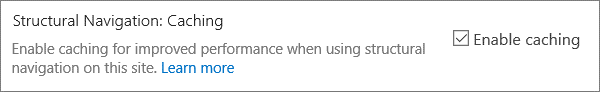

# <a name="navigation-options-for-sharepoint-online"></a>Opciones de navegación para SharePoint Online

En este artículo se describen los sitios de opciones de navegación con SharePoint publicación habilitada en SharePoint Online. La elección y configuración de la navegación afecta significativamente al rendimiento y la escalabilidad de los sitios en SharePoint Online. La plantilla de sitio de publicación de SharePoint solo debe usarse si es necesario para un portal centralizado y la característica de publicación solo debe habilitarse en sitios específicos y solo cuando sea absolutamente necesario, ya que puede afectar al rendimiento cuando se usa incorrectamente.

>[!NOTE]
>Si usas opciones modernas SharePoint de navegación como mega menú, navegación en cascada o navegación por concentradores, este artículo no se aplica a tu sitio. Las arquitecturas SharePoint de sitio modernas aprovechan una jerarquía de sitios más aplanada y un modelo de concentradores y radios. Esto permite lograr muchos escenarios que NO requieren el uso de la característica SharePoint publicación.

## <a name="overview-of-navigation-options"></a>Información general sobre las opciones de navegación

La configuración del proveedor de navegación puede afectar significativamente al rendimiento de todo el sitio y se debe tener en cuenta cuidadosamente la selección de un proveedor de navegación y una configuración que se escala eficazmente para los requisitos de un SharePoint sitio. Hay dos proveedores de navegación personalizados, así como implementaciones de navegación personalizadas.

La primera opción, [**Navegación**](#using-structural-navigation-in-sharepoint-online)estructural, es la opción de navegación recomendada en SharePoint Online para sitios clásicos de Sharepoint, si activa el almacenamiento en caché de navegación estructural **para el sitio**. Este proveedor de navegación muestra los elementos de navegación debajo del sitio actual y, opcionalmente, el sitio actual y sus elementos del mismo nivel. Proporciona capacidades adicionales, como el recorte de seguridad y la enumeración de la estructura del sitio. Si el almacenamiento en caché está deshabilitado, esto afectará negativamente al rendimiento y la escalabilidad, y puede estar sujeto a limitación.

La segunda opción, [**Navegación administrada (metadatos),**](#using-managed-navigation-and-metadata-in-sharepoint-online)representa elementos de navegación mediante un conjunto de términos de metadatos administrados. Se recomienda deshabilitar el recorte de seguridad a menos que sea necesario. El recorte de seguridad está habilitado como una configuración predeterminada de seguridad para este proveedor de navegación; sin embargo, muchos sitios no requieren la sobrecarga del recorte de seguridad, ya que los elementos de navegación suelen ser coherentes para todos los usuarios del sitio. Con la configuración recomendada para deshabilitar el recorte de seguridad, este proveedor de navegación no requiere enumerar la estructura del sitio y es altamente escalable con un impacto de rendimiento aceptable.

Además de los proveedores de navegación personalizados, muchos clientes han implementado correctamente implementaciones de navegación personalizada alternativas. Vea [Scripting del lado](#using-search-driven-client-side-scripting) cliente controlado por búsqueda en este artículo.
  
## <a name="pros-and-cons-of-sharepoint-online-navigation-options"></a>Ventajas y desventajas de SharePoint de navegación en línea

En la tabla siguiente se resumen las ventajas y desventajas de cada opción.

|Navegación estructural  |Navegación administrada  |Navegación basada en búsquedas  |Proveedor de navegación personalizada  |
|---------|---------|---------|---------|
|Profesionales:<br/><br/>Fácil de mantener<br/>Seguridad recortada<br/>Se actualiza automáticamente en 24 horas cuando se cambia el contenido<br/>     |Profesionales:<br/><br/>Fácil de mantener<br/>|Profesionales:<br/><br/>Seguridad recortada<br/>Actualizaciones automáticas a medida que se agregan sitios<br/>Tiempo de carga rápida y estructura de navegación almacenada localmente en caché<br/>|Profesionales:<br/><br/>Selección más amplia de opciones disponibles<br/>Carga rápida cuando el almacenamiento en caché se usa correctamente<br/>Muchas opciones funcionan bien con el diseño de página con capacidad de respuesta<br/>|
|Contras:<br/><br/>**Afecta al rendimiento si el almacenamiento en caché está deshabilitado**<br/>Sujeto a limitación<br/>|Contras:<br/><br/>No se actualiza automáticamente para reflejar la estructura del sitio<br/>**Afecta al rendimiento si el recorte de seguridad está habilitado** o cuando la estructura de navegación es compleja<br/>|Contras:<br/><br/>No hay capacidad para ordenar sitios fácilmente<br/>Requiere la personalización de la página maestra (se requieren aptitudes técnicas)<br/>|Contras:<br/><br/>Se requiere desarrollo personalizado<br/>El origen de datos externos /caché almacenada es necesario, por ejemplo, Azure<br/>|

La opción más adecuada para su sitio dependerá de los requisitos del sitio y de su capacidad técnica. Si desea un proveedor de navegación fácil de configurar que se actualice automáticamente cuando se cambia el contenido, la navegación estructural con el almacenamiento en caché habilitado [es](https://support.office.com/article/structural-navigation-and-performance-f163053f-8eca-4b9c-b973-36b395093b43) una buena opción.

>[!NOTE]
>Aplicar el mismo principio que los sitios SharePoint modernos simplificando la estructura general del sitio a una estructura más plana y no jerárquica mejora el rendimiento y simplifica el traslado a sitios SharePoint modernos. Esto significa que, en lugar de tener una sola colección de sitios con cientos de sitios (subwebs), un enfoque mejor es tener muchas colecciones de sitios con muy pocos subsitios (subwebs).

## <a name="analyzing-navigation-performance-in-sharepoint-online"></a>Análisis del rendimiento de navegación en SharePoint Online

La [herramienta Diagnóstico de](./page-diagnostics-for-spo.md) página para SharePoint es una extensión de explorador para exploradores Microsoft Edge y Chrome que analiza tanto SharePoint Portal moderno en línea como páginas de sitio de publicación clásicas. Esta herramienta solo funciona para SharePoint Online y no se puede usar en una SharePoint del sistema.

La herramienta genera un informe para cada página analizada que muestra el rendimiento de la página con un conjunto predefinido de reglas y muestra información detallada cuando los resultados de una prueba están fuera del valor de línea base. SharePoint Los administradores y diseñadores en línea pueden usar la herramienta para solucionar problemas de rendimiento para garantizar que las páginas nuevas estén optimizadas antes de la publicación.

**SPRequestDuration** en particular es el tiempo que tarda SharePoint procesar la página. La navegación intensa (como incluir páginas en la navegación), jerarquías de sitios complejas y otras opciones de configuración y topología pueden contribuir considerablemente a duraciones más largas.

## <a name="using-structural-navigation-in-sharepoint-online"></a>Uso de la navegación estructural en SharePoint Online

Esta es la navegación rápida que se usa de forma predeterminada y es la solución más sencilla. No requiere ninguna personalización y un usuario no técnico también puede agregar fácilmente elementos, ocultar elementos y administrar la navegación desde la página de configuración. Se recomienda [habilitar el almacenamiento en caché,](https://support.office.com/article/structural-navigation-and-performance-f163053f-8eca-4b9c-b973-36b395093b43)de lo contrario, hay una costosa operación de rendimiento.

### <a name="how-to-implement-structural-navigation-caching"></a>Cómo implementar el almacenamiento en caché de navegación estructural

En **Navegación Configuración** y aspecto del sitio, puede validar si la navegación estructural está seleccionada para la navegación global o la navegación  >    >  actual. Seleccionar Mostrar **páginas tendrá** un impacto negativo en el rendimiento.


El almacenamiento en caché se puede habilitar o deshabilitar en el nivel de colección de sitios y en el nivel de sitio, y está habilitado para ambos de forma predeterminada. Para habilitar en el nivel de colección de sitios, **en Navegación** de la colección de sitios Configuración de la colección de sitios, active la casilla Habilitar almacenamiento  >    >   **en caché.**


Para habilitar en el nivel de sitio, en **Navegación Configuración**  >  **sitio,** active la casilla **Habilitar almacenamiento en caché**.



## <a name="using-managed-navigation-and-metadata-in-sharepoint-online"></a>Uso de la navegación administrada y los metadatos en SharePoint Online

La navegación administrada es otra opción lista para usar para volver a crear la mayor parte de la misma funcionalidad que la navegación estructural. Los metadatos administrados se pueden configurar para que el recorte de seguridad esté habilitado o deshabilitado. Cuando se configura con el recorte de seguridad deshabilitado, la navegación administrada es bastante eficiente, ya que carga todos los vínculos de navegación con un número constante de llamadas de servidor. Sin embargo, al habilitar el recorte de seguridad, se niegan algunas de las ventajas de rendimiento de la navegación administrada.

Si necesita habilitar el recorte de seguridad, le recomendamos que:

- Actualizar todos los vínculos url descriptivos a vínculos sencillos
- Agregar nodos de recorte de seguridad necesarios como direcciones URL fáciles de usar
- Limitar el número de elementos de navegación a no más de 100 y no más de 3 niveles de profundidad

Muchos sitios no requieren recorte de seguridad, ya que la estructura de navegación suele ser coherente para todos los usuarios del sitio. Si el recorte de seguridad está deshabilitado y se agrega un vínculo a la navegación al que no todos los usuarios tienen acceso, el vínculo seguirá mostrándolo, pero dará lugar a un mensaje de acceso denegado. No existe ningún riesgo de acceso involuntario al contenido.

### <a name="how-to-implement-managed-navigation-and-the-results"></a>Cómo implementar la navegación administrada y los resultados

Hay varios artículos sobre docs.microsoft.com sobre los detalles de la navegación administrada. Por ejemplo, vea [Overview of managed navigation in SharePoint Server](/sharepoint/administration/overview-of-managed-navigation).

Para implementar la navegación administrada, se establecen términos con direcciones URL correspondientes a la estructura de navegación del sitio. La navegación administrada incluso se puede seleccionar manualmente para reemplazar la navegación estructural en muchos casos. Por ejemplo:

)

## <a name="using-search-driven-client-side-scripting"></a>Uso de scripts del lado cliente controlados por búsqueda

Una clase común de implementaciones de navegación personalizada adopta patrones de diseño representados por el cliente que almacenan una memoria caché local de nodos de navegación.

Estos proveedores de navegación tienen un par de ventajas clave:

- Por lo general, funcionan bien con diseños de página con capacidad de respuesta.
- Son extremadamente escalables y de rendimiento porque pueden representarse sin costo de recursos (y actualizar en segundo plano después de un tiempo de espera).
- Estos proveedores de navegación pueden recuperar datos de navegación mediante diversas estrategias, que van desde configuraciones estáticas simples hasta varios proveedores de datos dinámicos.

Un ejemplo de un proveedor de datos es usar una navegación basada en **búsqueda,** que permite flexibilidad para enumerar nodos de navegación y controlar el recorte de seguridad de forma eficaz.

Hay otras opciones populares para crear **proveedores de navegación personalizados.** Consulte Soluciones [de navegación para SharePoint portales en línea](/sharepoint/dev/solution-guidance/portal-navigation) para obtener más instrucciones sobre cómo crear un proveedor de navegación personalizado.

Con la búsqueda, puede aprovechar los índices que se han creado en segundo plano mediante el rastreo continuo. Los resultados de la búsqueda se sacan del índice de búsqueda y los resultados se recortan en seguridad. Por lo general, esto es más rápido que los proveedores de navegación personalizados cuando se requiere un recorte de seguridad. El uso de la búsqueda para la navegación estructural, especialmente si tiene una estructura de sitio compleja, acelerará considerablemente el tiempo de carga de páginas. La principal ventaja de esto sobre la navegación administrada es que se beneficia del recorte de seguridad.

Este enfoque implica crear una página maestra personalizada y reemplazar el código de navegación integrado por HTML personalizado. Siga este procedimiento descrito en el siguiente ejemplo para reemplazar el código de navegación en el archivo `seattle.html` . En este ejemplo, se abrirá el archivo `seattle.html` y se reemplazará todo el elemento `id="DeltaTopNavigation"` por código HTML personalizado.

### <a name="example-replace-the-out-of-the-box-navigation-code-in-a-master-page"></a>Ejemplo: reemplazar el código de navegación de forma rápida en una página maestra

1. Vaya a la página De Configuración sitio.
2. Abra la galería de páginas maestras haciendo clic en **Páginas maestras**.
3. Desde aquí puede navegar por la biblioteca y descargar el archivo `seattle.master` .
4. Edite el código con un editor de texto y elimine el bloque de código en la siguiente captura de pantalla.<br/><br/>
5. Quite el código entre las `<SharePoint:AjaxDelta id="DeltaTopNavigation">` etiquetas y `<\SharePoint:AjaxDelta>` y reempláctelo por el siguiente fragmento de código:<br/>

```javascript
<div id="loading">
  <!--Replace with path to loading image.-->
  <div style="background-image: url(''); height: 22px; width: 22px; ">
  </div>
</div>
<!-- Main Content-->
<div id="navContainer" style="display:none">
    <div data-bind="foreach: hierarchy" class="noindex ms-core-listMenu-horizontalBox">
        <a class="dynamic menu-item ms-core-listMenu-item ms-displayInline ms-navedit-linkNode" data-bind="attr: { href: item.Url, title: item.Title }">
            <span class="menu-item-text" data-bind="text: item.Title">
            </span>
        </a>
        <ul id="menu" data-bind="foreach: $data.children" style="padding-left:20px">
            <li class="static dynamic-children level1">
                <a class="static dynamic-children menu-item ms-core-listMenu-item ms-displayInline ms-navedit-linkNode" data-bind="attr: { href: item.Url, title: item.Title }">

                 <!-- ko if: children.length > 0-->
                    <span aria-haspopup="true" class="additional-background ms-navedit-flyoutArrow dynamic-children">
                        <span class="menu-item-text" data-bind="text: item.Title">
                        </span>
                    </span>
                <!-- /ko -->
                <!-- ko if: children.length == 0-->
                    <span aria-haspopup="true" class="ms-navedit-flyoutArrow dynamic-children">
                        <span class="menu-item-text" data-bind="text: item.Title">
                        </span>
                    </span>
                <!-- /ko -->
                </a>

                <!-- ko if: children.length > 0-->
                <ul id="menu"  data-bind="foreach: children;" class="dynamic  level2" >
                    <li class="dynamic level2">
                        <a class="dynamic menu-item ms-core-listMenu-item ms-displayInline  ms-navedit-linkNode" data-bind="attr: { href: item.Url, title: item.Title }">

          <!-- ko if: children.length > 0-->
          <span aria-haspopup="true" class="additional-background ms-navedit-flyoutArrow dynamic-children">
           <span class="menu-item-text" data-bind="text: item.Title">
           </span>
          </span>
           <!-- /ko -->
          <!-- ko if: children.length == 0-->
          <span aria-haspopup="true" class="ms-navedit-flyoutArrow dynamic-children">
           <span class="menu-item-text" data-bind="text: item.Title">
           </span>
          </span>
          <!-- /ko -->
                        </a>
          <!-- ko if: children.length > 0-->
         <ul id="menu" data-bind="foreach: children;" class="dynamic level3" >
          <li class="dynamic level3">
           <a class="dynamic menu-item ms-core-listMenu-item ms-displayInline ms-navedit-linkNode" data-bind="attr: { href: item.Url, title: item.Title }">
            <span class="menu-item-text" data-bind="text: item.Title">
            </span>
           </a>
          </li>
         </ul>
           <!-- /ko -->
                    </li>
                </ul>
                <!-- /ko -->
            </li>
        </ul>
    </div>
</div>
```

<br/>
6. Reemplace la dirección URL de la etiqueta de anclaje de la imagen de carga al principio, por un vínculo a una imagen de carga en la colección de sitios. Después de realizar los cambios, cambie el nombre del archivo y, a continuación, carguelo en la galería de páginas maestras. Esto genera un nuevo archivo .master.<br/>
7. Este HTML es el marcado básico que se rellenará con los resultados de búsqueda devueltos desde código JavaScript. Deberá editar el código para cambiar el valor de var root = "site collection URL" como se muestra en el siguiente fragmento de código:<br/>

```javascript
var root = "https://spperformance.sharepoint.com/sites/NavigationBySearch";
```

<br/>
8. Los resultados se asignan a la matriz self.nodes y una jerarquía se basa en los objetos mediante linq.js asignación del resultado a una matriz self.hierarchy. Esta matriz es el objeto enlazado al HTML. Esto se hace en la función toggleView() pasando el objeto self a la función ko.applyBinding().<br/>Esto hace que la matriz de jerarquía esté enlazada al siguiente HTML:<br/>

```javascript
<div data-bind="foreach: hierarchy" class="noindex ms-core-listMenu-horizontalBox">
```

Los controladores de eventos para y se agregan a la navegación de nivel superior para controlar los `mouseenter` menús desplegables del subsitio que se realizan `mouseexit` en la `addEventsToElements()` función.

En nuestro ejemplo de navegación compleja, una carga de página nueva sin el almacenamiento en caché local muestra que el tiempo invertido en el servidor se ha recortado de la navegación estructural comparativa para obtener un resultado similar al método de navegación administrada.

### <a name="about-the-javascript-file"></a>Acerca del archivo JavaScript...

>[!NOTE]
>Si usa JavaScript personalizado, asegúrese de que el CDN público está habilitado y de que el archivo se encuentra en una CDN ubicación.

Todo el archivo JavaScript es el siguiente:

```javascript
//Models and Namespaces
var SPOCustom = SPOCustom || {};
SPOCustom.Models = SPOCustom.Models || {}
SPOCustom.Models.NavigationNode = function () {

    this.Url = ko.observable("");
    this.Title = ko.observable("");
    this.Parent = ko.observable("");

};

var root = "https://spperformance.sharepoint.com/sites/NavigationBySearch";
var baseUrl = root + "/_api/search/query?querytext=";
var query = baseUrl + "'contentClass=\"STS_Web\"+path:" + root + "'&trimduplicates=false&rowlimit=300";

var baseRequest = {
    url: "",
    type: ""
};


//Parses a local object from JSON search result.
function getNavigationFromDto(dto) {
    var item = new SPOCustom.Models.NavigationNode();
    if (dto != undefined) {

        var webTemplate = getSearchResultsValue(dto.Cells.results, 'WebTemplate');

        if (webTemplate != "APP") {
            item.Title(getSearchResultsValue(dto.Cells.results, 'Title')); //Key = Title
            item.Url(getSearchResultsValue(dto.Cells.results, 'Path')); //Key = Path
            item.Parent(getSearchResultsValue(dto.Cells.results, 'ParentLink')); //Key = ParentLink
        }

    }
    return item;
}

function getSearchResultsValue(results, key) {

    for (i = 0; i < results.length; i++) {
        if (results[i].Key == key) {
            return results[i].Value;
        }
    }
    return null;
}

//Parse a local object from the serialized cache.
function getNavigationFromCache(dto) {
    var item = new SPOCustom.Models.NavigationNode();

    if (dto != undefined) {

        item.Title(dto.Title);
        item.Url(dto.Url);
        item.Parent(dto.Parent);
    }

    return item;
}

/* create a new OData request for JSON response */
function getRequest(endpoint) {
    var request = baseRequest;
    request.type = "GET";
    request.url = endpoint;
    request.headers = { ACCEPT: "application/json;odata=verbose" };
    return request;
};

/* Navigation Module*/
function NavigationViewModel() {
    "use strict";
    var self = this;
    self.nodes = ko.observableArray([]);
    self.hierarchy = ko.observableArray([]);;
    self.loadNavigatioNodes = function () {
        //Check local storage for cached navigation datasource.
        var fromStorage = localStorage["nodesCache"];
        if (false) {
            var cachedNodes = JSON.parse(localStorage["nodesCache"]);

            if (cachedNodes && timeStamp) {
                //Check for cache expiration. Currently set to 3 hrs.
                var now = new Date();
                var diff = now.getTime() - timeStamp;
                if (Math.round(diff / (1000 * 60 * 60)) < 3) {

                    //return from cache.
                    var cacheResults = [];
                    $.each(cachedNodes, function (i, item) {
                        var nodeitem = getNavigationFromCache(item, true);
                        cacheResults.push(nodeitem);
                    });

                    self.buildHierarchy(cacheResults);
                    self.toggleView();
                    addEventsToElements();
                    return;
                }
            }
        }
        //No cache hit, REST call required.
        self.queryRemoteInterface();
    };

    //Executes a REST call and builds the navigation hierarchy.
    self.queryRemoteInterface = function () {
        var oDataRequest = getRequest(query);
        $.ajax(oDataRequest).done(function (data) {
            var results = [];
            $.each(data.d.query.PrimaryQueryResult.RelevantResults.Table.Rows.results, function (i, item) {

                if (i == 0) {
                    //Add root element.
                    var rootItem = new SPOCustom.Models.NavigationNode();
                    rootItem.Title("Root");
                    rootItem.Url(root);
                    rootItem.Parent(null);
                    results.push(rootItem);
                }
                var navItem = getNavigationFromDto(item);
                results.push(navItem);
            });
            //Add to local cache
            localStorage["nodesCache"] = ko.toJSON(results);

            localStorage["nodesCachedAt"] = new Date().getTime();
            self.nodes(results);
            if (self.nodes().length > 0) {
                var unsortedArray = self.nodes();
                var sortedArray = unsortedArray.sort(self.sortObjectsInArray);

                self.buildHierarchy(sortedArray);
                self.toggleView();
                addEventsToElements();
            }
        }).fail(function () {
            //Handle error here!!
            $("#loading").hide();
            $("#error").show();
        });
    };
    self.toggleView = function () {
        var navContainer = document.getElementById("navContainer");
        ko.applyBindings(self, navContainer);
        $("#loading").hide();
        $("#navContainer").show();

    };
    //Uses linq.js to build the navigation tree.
    self.buildHierarchy = function (enumerable) {
        self.hierarchy(Enumerable.From(enumerable).ByHierarchy(function (d) {
            return d.Parent() == null;
        }, function (parent, child) {
            if (parent.Url() == null || child.Parent() == null)
                return false;
            return parent.Url().toUpperCase() == child.Parent().toUpperCase();
        }).ToArray());

        self.sortChildren(self.hierarchy()[0]);
    };


    self.sortChildren = function (parent) {

        // sjip processing if no children
        if (!parent || !parent.children || parent.children.length === 0) {
            return;
        }

        parent.children = parent.children.sort(self.sortObjectsInArray2);

        for (var i = 0; i < parent.children.length; i++) {
            var elem = parent.children[i];

            if (elem.children && elem.children.length > 0) {
                self.sortChildren(elem);
            }
        }
    };

    // ByHierarchy method breaks the sorting in chrome and firefox
    // we need to resort  as ascending
    self.sortObjectsInArray2 = function (a, b) {
        if (a.item.Title() > b.item.Title())
            return 1;
        if (a.item.Title() < b.item.Title())
            return -1;
        return 0;
    };


    self.sortObjectsInArray = function (a, b) {
        if (a.Title() > b.Title())
            return -1;
        if (a.Title() < b.Title())
            return 1;
        return 0;
    }
}

//Loads the navigation on load and binds the event handlers for mouse interaction.
function InitCustomNav() {
    var viewModel = new NavigationViewModel();
    viewModel.loadNavigatioNodes();
}

function addEventsToElements() {
    //events.
      $("li.level1").mouseover(function () {
          var position = $(this).position();
          $(this).find("ul.level2").css({ width: 100, left: position.left + 10, top: 50 });
      })
   .mouseout(function () {
     $(this).find("ul.level2").css({  left: -99999, top: 0 });
   
    });
   
     $("li.level2").mouseover(function () {
          var position = $(this).position();
          console.log(JSON.stringify(position));
          $(this).find("ul.level3").css({ width: 100, left: position.left + 95, top:  position.top});
      })
   .mouseout(function () {
     $(this).find("ul.level3").css({  left: -99999, top: 0 });
    });
} _spBodyOnLoadFunctionNames.push("InitCustomNav");

```

Para resumir el código mostrado anteriormente en la función, se crea una función y, a continuación, se llama `jQuery $(document).ready` a la función de ese `viewModel object` `loadNavigationNodes()` objeto. Esta función carga la jerarquía de navegación creada anteriormente almacenada en el almacenamiento local HTML5 del explorador cliente o llama a la función `queryRemoteInterface()` .

`QueryRemoteInterface()` crea una solicitud mediante la función con el parámetro de consulta definido anteriormente en el script y, a `getRequest()` continuación, devuelve datos del servidor. Estos datos son básicamente una matriz de todos los sitios de la colección de sitios representados como objetos de transferencia de datos con varias propiedades.

A continuación, estos datos se analizan en los objetos definidos anteriormente que usan para crear propiedades observables para su uso mediante el enlace de datos a los valores en el HTML que definimos `SPO.Models.NavigationNode` `Knockout.js` anteriormente.

A continuación, los objetos se ponen en una matriz de resultados. Esta matriz se analiza en JSON mediante Knockout y se almacena en el almacenamiento del explorador local para mejorar el rendimiento en futuras cargas de página.

### <a name="benefits-of-this-approach"></a>Ventajas de este enfoque

Una de las principales ventajas de [este](#example-replace-the-out-of-the-box-navigation-code-in-a-master-page) enfoque es que al usar el almacenamiento local html5, la navegación se almacena localmente para el usuario la próxima vez que cargue la página. Se obtienen mejoras importantes en el rendimiento del uso de la API de búsqueda para la navegación estructural; sin embargo, se necesita cierta capacidad técnica para ejecutar y personalizar esta funcionalidad.

En la [implementación de ejemplo,](#example-replace-the-out-of-the-box-navigation-code-in-a-master-page)los sitios se ordenan de la misma manera que la navegación estructural inmediata; orden alfabético. Si desea desviarse de este orden, sería más complicado desarrollar y mantener. Además, este enfoque requiere que se desvíe de las páginas maestras admitidas. Si no se mantiene la página maestra personalizada, el sitio perderá las actualizaciones y mejoras que Microsoft realiza en las páginas maestras.

El [código anterior](#about-the-javascript-file) tiene las siguientes dependencias:

- jQuery : https://jquery.com/
- KnockoutJS - https://knockoutjs.com/
- Linq.js - https://linqjs.codeplex.com/ , o github.com/neuecc/linq.js

La versión actual de LinqJS no contiene el método ByHierarchy usado en el código anterior y romperá el código de navegación. Para corregir esto, agregue el siguiente método al Linq.js archivo antes de la línea `Flatten: function ()` .

```javascript
ByHierarchy: function(firstLevel, connectBy, orderBy, ascending, parent) {
     ascending = ascending == undefined ? true : ascending;
     var orderMethod = ascending == true ? 'OrderBy' : 'OrderByDescending';
     var source = this;
     firstLevel = Utils.CreateLambda(firstLevel);
     connectBy = Utils.CreateLambda(connectBy);
     orderBy = Utils.CreateLambda(orderBy);

     //Initiate or increase level
     var level = parent === undefined ? 1 : parent.level + 1;

    return new Enumerable(function() {
         var enumerator;
         var index = 0;

        var createLevel = function() {
                 var obj = {
                     item: enumerator.Current(),
                     level : level
                 };
                 obj.children = Enumerable.From(source).ByHierarchy(firstLevel, connectBy, orderBy, ascending, obj);
                 if (orderBy !== undefined) {
                     obj.children = obj.children[orderMethod](function(d) {
                         return orderBy(d.item); //unwrap the actual item for sort to work
                     });
                 }
                 obj.children = obj.children.ToArray();
                 Enumerable.From(obj.children).ForEach(function(child) {
                     child.getParent = function() {
                         return obj;
                     };
                 });
                 return obj;
             };

        return new IEnumerator(

        function() {
             enumerator = source.GetEnumerator();
         }, function() {
             while (enumerator.MoveNext()) {
                 var returnArr;
                 if (!parent) {
                     if (firstLevel(enumerator.Current(), index++)) {
                         return this.Yield(createLevel());
                     }

                } else {
                     if (connectBy(parent.item, enumerator.Current(), index++)) {
                         return this.Yield(createLevel());
                     }
                 }
             }
             return false;
         }, function() {
             Utils.Dispose(enumerator);
         })
     });
 },

```
  
## <a name="related-topics"></a>Temas relacionados

[Información general sobre la navegación administrada en SharePoint Server](/sharepoint/administration/overview-of-managed-navigation)

[Almacenamiento en caché y rendimiento de navegación estructural](https://support.office.com/article/structural-navigation-and-performance-f163053f-8eca-4b9c-b973-36b395093b43)