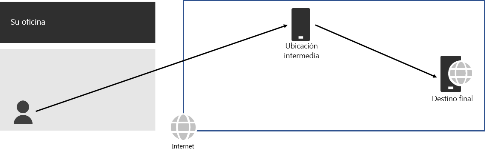
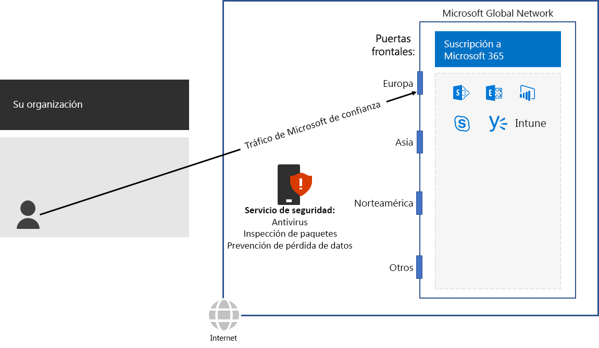

# Paso 3: Evitar las redirecciones de red

*Este paso es obligatorio y se aplica a las versiones E3 y E5 de Microsoft 365 Enterprise*

Una [redirección de red](https://docs.microsoft.com/office365/enterprise/office-365-network-connectivity-principles#BKMK_P3) ocurre cuando el tráfico vinculado a un destino se dirige por primera vez a otra ubicación intermedia, como una pila de seguridad local, un agente de acceso a la nube o una puerta de enlace web basada en la nube. Aquí le mostramos un ejemplo.

Una redirección de red también puede deberse a un bajo enrutamiento en Internet debido a los proveedores de servicios de red. 

Una redirección de red agrega latencia y puede redirigir potencialmente el tráfico a una localización geográficamente lejana.

Para optimizar el rendimiento del tráfico a los servicios basados en la nube de Microsoft 365, compruebe si el ISP que proporciona la conexión local a Internet tiene una relación de emparejamiento directa con la Red global de Microsoft cerca de esa ubicación. Estas conexiones no tienen redirecciones de red.

Si usa servicios de red o seguridad basados en la nube para el tráfico de Microsoft 365, asegúrese de que se evalúa el efecto de la redirección de red y que se entiende su impacto en el rendimiento. Examine lo siguiente:

- El número y las ubicaciones de los proveedores de servicios a través de los que se reenvía el tráfico en relación con las sucursales y los puntos de emparejamiento de la red global de Microsoft 
- La calidad de la relación de emparejamiento de red del proveedor de servicios con el ISP y Microsoft 
- Impacto en el rendimiento del redireccionamiento en la infraestructura del proveedor de servicios

Siempre que sea posible, configure los enrutadores perimetrales para enviar directamente el tráfico de Microsoft 365 de confianza, en lugar de a través de un proxy o túnel mediante un proveedor de seguridad de red de terceros en la nube o basado en la nube que procesa el tráfico de Internet. 

Como punto de control provisional, puede ver los [criterios de salida](networking-exit-criteria.md#crit-networking-step3) de este paso.

## Siguiente paso

|||
|:-------|:-----|
||[Configurar la omisión de tráfico](networking-configure-proxies-firewalls.md)|
