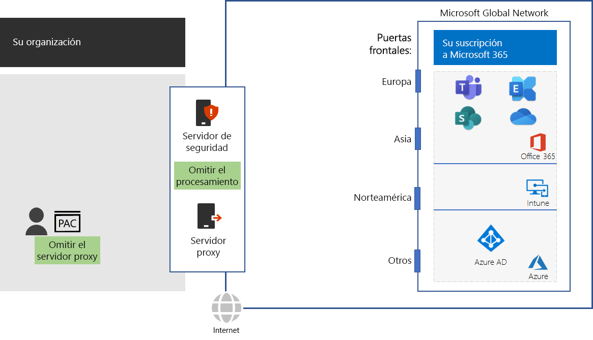

# Paso 4: Configurar la omisión de tráfico

*Este paso es opcional y es válido para las versiones E3 y E5 de Microsoft 365 Enterprise*

Como el tráfico de Internet general puede ser peligroso, en las redes de organización típicas se aplica la seguridad con dispositivos perimetrales como servidores proxy, Inspección e Interrupción SSL, dispositivos de inspección de paquetes y sistemas de prevención de pérdida de datos.  Lea sobre algunos de los problemas con los dispositivos de intercepción de red en [Usando dispositivos de red de terceros o soluciones en el tráfico de Office 365](https://support.microsoft.com/help/2690045/using-third-party-network-devices-or-solutions-with-office-365).

Pero los nombres de dominio DNS y las direcciones IP que se usan en los servicios basados en la nube de Microsoft 365 son conocidos. Además, el tráfico y los propios servicios están protegidos con muchas características de seguridad. Como esta protección y seguridad ya está aplicada, no es necesario que los dispositivos perimetrales la dupliquen. Los destinos intermedios y el procesamiento de seguridad duplicado para el tráfico de Microsoft 365 pueden reducir considerablemente el rendimiento.

El primer paso para eliminar los destinos intermedios y el procesamiento duplicado de la seguridad consiste en identificar el tráfico de Microsoft 365. Microsoft ha definido los siguientes tipos de nombres de dominio DNS e intervalos de direcciones IP, conocidos como puntos de conexión:

- **Optimizar**: obligatorios para la conectividad a todos los servicios de Office 365 y representan más del 75 % del ancho de banda, las conexiones y el volumen de datos de Microsoft 365. Estos puntos de conexión representan escenarios de Microsoft 365 que son más sensibles al rendimiento, la latencia y la disponibilidad de la red.
- **Permitir**: obligatorios para la conectividad a características y servicios específicos de Microsoft 365, pero no son tan sensibles al rendimiento y la latencia de la red como los de la categoría Optimizar.
 - **Predeterminados**: representan servicios y dependencias de Microsoft 365 que no requieren ninguna optimización. Puede tratar los puntos de conexión de la categoría Predeterminados como tráfico de Internet normal.

Puede encontrar los nombres de dominio DNS y los intervalos de direcciones IP en [https://aka.ms/o365endpoints](https://aka.ms/o365endpoints).

Microsoft le recomienda:

- Use scripts de Configuración Automática de Proxy (PAC) en los exploradores de Internet de los equipos locales para omitir los servidores proxy de los nombres de dominio DNS de los servicios basados en la nube de Microsoft 365.  Para consultar el último script de Microsoft 365 PAC, consulte [Obtener el paquete de archivos del script de PowerShell](https://docs.microsoft.com/office365/enterprise/managing-office-365-endpoints#use-a-pac-file-for-direct-routing-of-vital-office-365-traffic). 

- Analizar los dispositivos perimetrales para determinar el procesamiento duplicado y configurarlos para reenviar el tráfico a puntos de conexión de la categoría Optimizar y Permitir sin procesamiento. Esto se conoce como omisión de tráfico. 

A continuación algunas recomendaciones sobre la infraestructura de red.

Los dispositivos perimetrales incluyen firewalls, Inspección e Interrupción SSL, dispositivos de inspección de paquetes y sistemas de prevención de pérdida de datos. Para configurar y actualizar las configuraciones de los dispositivos perimetrales, puede usar un script o una llamada REST para consumir una lista estructurada de puntos de conexión desde el servicio web de Puntos de conexión de Office 365. Para obtener más información, consulte[Dirección IP de Office 365 y servicio web de URL ](https://docs.microsoft.com/office365/enterprise/office-365-ip-web-service).

Tenga en cuenta que solo se omite el procesamiento de seguridad de red y proxy normal para el tráfico a los puntos de conexión de las categorías Optimizar y Permitir de Microsoft 365. El resto del tráfico general de Internet se dirige a través de un proxy y se somete al procesamiento de seguridad de red existente.

## Optimizar el tráfico para trabajadores remotos que usan conexiones VPN

Los trabajadores remotos suelen usar las conexiones de red privada virtual (VPN) para tener acceso a los recursos de la intranet de una organización. Una conexión VPN convencional redirige todo el tráfico, incluido el tráfico de Internet, a la intranet de la organización. El tráfico de Internet se redirige a la red perimetral de la organización y a los dispositivos de procesamiento de paquetes. Este tráfico está sujeto a retrasos de desplazamiento y procesamiento que pueden disminuir considerablemente el rendimiento y afectar a la productividad de los trabajadores remotos. 

El túnel dividido es la función de una conexión VPN para redirigir el tráfico especificado por Internet en vez de enviarlo a través de la conexión VPN a la intranet. Para optimizar el rendimiento de los trabajadores remotos en servicios críticos de Microsoft 365 como Teams, SharePoint Online y Exchange Online, configure las conexiones VPN de túnel dividido para enviar tráfico a los puntos de conexión de Office 365 de la categoría Optimizar directamente a través de Internet. 

Para obtener más información, consulte [Optimizar la conectividad de Office 365 para usuarios remotos que usan túnel dividido de VPN](https://docs.microsoft.com/office365/enterprise/office-365-vpn-split-tunnel).

Como punto de control provisional, puede ver los [criterios de salida](networking-exit-criteria.md#crit-networking-step4) de este paso.

## Siguiente paso

|||
|:-------|:-----|
||[Optimizar el rendimiento del servicio de Office 365 y el cliente](networking-optimize-tcp-performance.md) |

