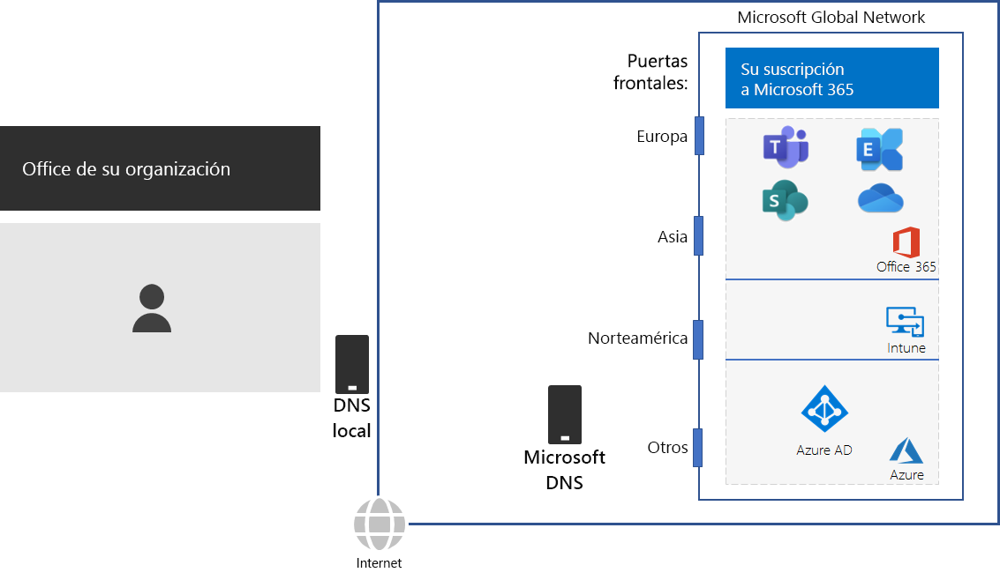
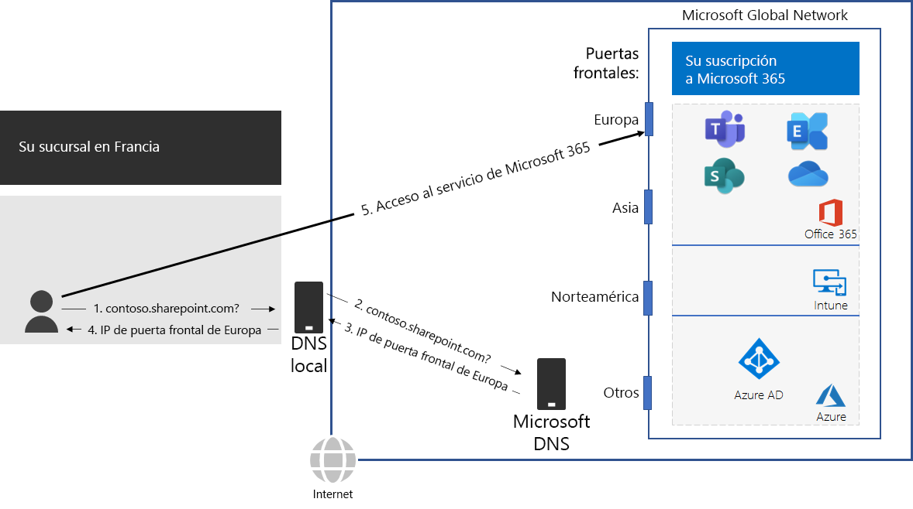

# Paso 2: Configurar conexiones a Internet locales para cada oficina

*Este paso es obligatorio y se aplica a las versiones E3 y E5 de Microsoft 365 Enterprise*

En el paso 2, se asegura de que todas las oficinas tienen conexión local a Internet y usan servidores DNS locales. Estos dos elementos son necesarios para reducir la latencia de la conexión y asegurarse de que los equipos cliente locales establecen conexiones con el punto de entrada más próximo a los servicios basados en la nube de Microsoft 365.

En las redes tradicionales para grandes organizaciones, el tráfico de Internet se desplaza por la red troncal a una conexión a Internet central. Esto no es adecuado para optimizar el rendimiento de una infraestructura de Software como Servicio (SaaS) distribuida globalmente, que incluye los productos Office 365 e Intune en Microsoft 365.

La Red Global de Microsoft incluye una infraestructura de *Servicio Front End Distribuido*, un perímetro de red altamente disponible y escalable con ubicaciones geográficas. Termina las conexiones de usuario final en un servidor front-end y enruta eficazmente el tráfico de usuario final en la Red Global de Microsoft.

Para obtener el mejor rendimiento, los clientes locales deben acceder a un servidor front-end que esté geográficamente más próximo a ellos, en lugar de enviar el tráfico a través de una red troncal al servidor front-end más próximo a la conexión de Internet central de la organización.

He aquí un ejemplo.

Cuando un usuario de la sucursal de París desea tener acceso a un sitio de SharePoint Online:

1. Envía una consulta DNS para resolver un nombre, como contoso.sharepoint.com. 
2. El servidor DNS que proporcionó el ISP reenvía esa consulta a un servidor DNS de Microsoft.
3. Los servidores DNS de Microsoft coinciden con la dirección IP de origen de la consulta DNS reenviada a la región del mundo asignada a la dirección. El servidor DNS de Microsoft responde con la dirección IP del servidor front-end de la red de Microsoft más cercana en Europa.
4. El servidor DNS de ISP envía esta dirección IP al usuario.
5. El usuario inicia una conexión con el servidor de SharePoint a través del servidor front-end de Europa.

Para dirigir una solicitud de cliente al servidor front-end más cercano geográficamente, los servidores DNS de Microsoft usan las consultas DNS correspondientes a la solicitud de conexión inicial del cliente.  Por tanto, para obtener la latencia de red más baja:

- Todas las oficinas de la organización deben tener conexiones locales a Internet para el tráfico de red de la categoría [Optimizar](https://docs.microsoft.com/office365/enterprise/office-365-network-connectivity-principles#new-office-365-endpoint-categories).
- Todas las conexiones locales a Internet deben usar un servidor DNS local de la región para el tráfico de Internet saliente desde esa ubicación.

Para obtener más información, vea [Conexiones de red de salida de forma local](https://docs.microsoft.com/office365/enterprise/office-365-network-connectivity-principles#egress-network-connections-locally). 

Para probar lo cerca que está de un punto de entrada para la red global de Microsoft y lo cerca que está del punto en que la red de su organización se conecta a su Proveedor de servicios de Internet (ISP), use la [Herramienta de integración de red de Office 365](https://connectivity.office.com/).

Como punto de control provisional, puede ver los [criterios de salida](networking-exit-criteria.md#crit-networking-step2) de este paso.

## Siguiente paso

|||
|:-------|:-----|
||[Evitar las redirecciones de red](networking-avoid-network-hairpins.md)|
