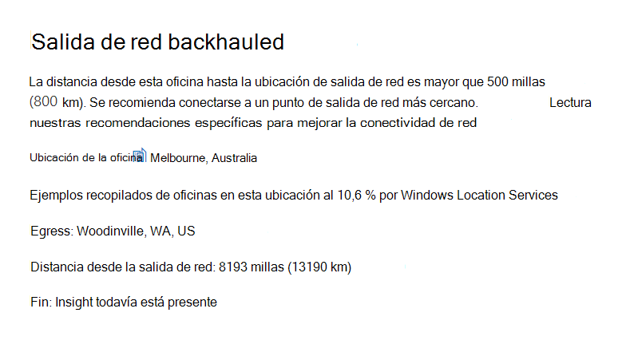
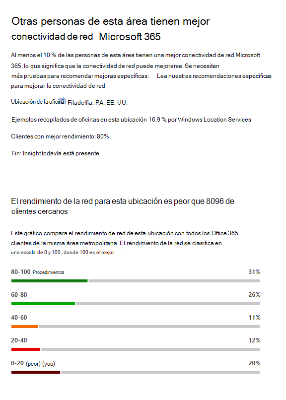
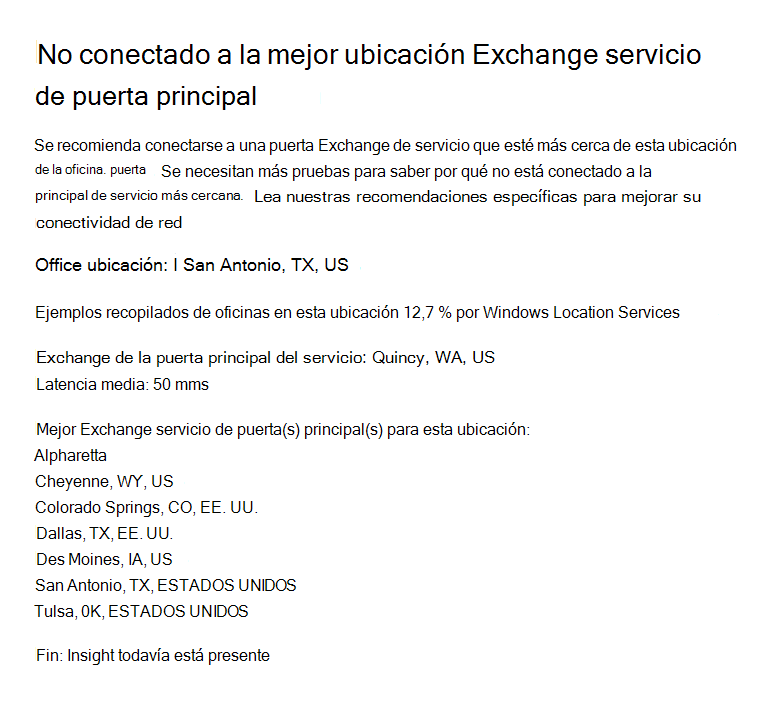
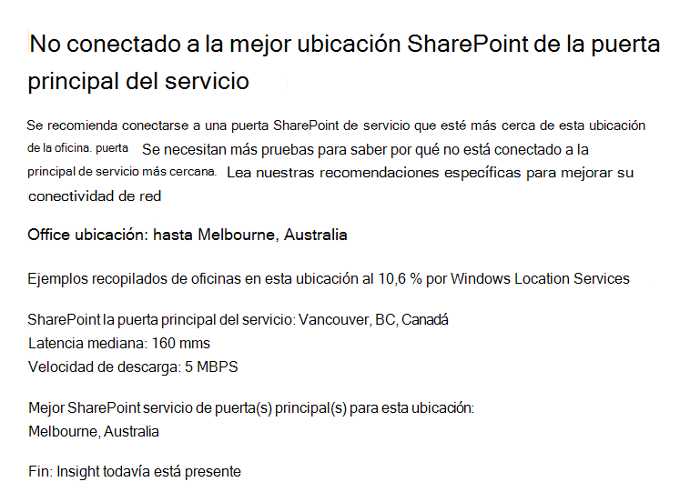

# Microsoft 365 Network Insights (versión preliminar)

**Las perspectivas de** red son métricas de rendimiento recopiladas de su inquilino de Microsoft 365 y disponibles para que las puedan ver solo los usuarios administrativos de su espacio empresarial. Las conclusiones se muestran en el Centro de administración de Microsoft 365 en <https://portal.microsoft.com/adminportal/home#/networkperformance> .

Insights está pensado para ayudar a diseñar perímetros de red para las ubicaciones de las oficinas. Cada información proporciona detalles en directo sobre las características de rendimiento de un problema común específico para cada ubicación geográfica en la que los usuarios acceden a su espacio empresarial.

Hay seis perspectivas de red específicas que se pueden mostrar para cada ubicación de la oficina:

- [Salida de red contralada](#backhauled-network-egress)
- [Dispositivo intermediario de red](#network-intermediary-device)
- [Mejor rendimiento detectado para clientes cercanos](#better-performance-detected-for-customers-near-you)
- [Uso de una puerta de servicio de Exchange Online no óptima](#use-of-a-non-optimal-exchange-online-service-front-door)
- [Uso de una puerta de servicio de SharePoint Online no óptima](#use-of-a-non-optimal-sharepoint-online-service-front-door)
- [Baja velocidad de descarga desde la puerta principal de SharePoint](#low-download-speed-from-sharepoint-front-door)
- [Salida de red óptima para usuarios de China](#china-user-optimal-network-egress)

Hay dos perspectivas de red de nivel de inquilino que se pueden mostrar para el inquilino. También aparecen en las páginas de puntuación de producción:

- [Conexiones de ejemplo de Exchange afectadas por problemas de conectividad](#exchange-sampled-connections-impacted-by-connectivity-issues)
- [Conexiones de ejemplo de SharePoint afectadas por problemas de conectividad](#sharepoint-sampled-connections-impacted-by-connectivity-issues)

>[!IMPORTANT]
>Información de red, recomendaciones de rendimiento y evaluaciones en el Centro de administración de Microsoft 365 se encuentra actualmente en estado de vista previa y solo está disponible para los inquilinos de Microsoft 365 que se han inscrito en el programa de vista previa de características.

## Salida de red contralada

Esta información se mostrará si el servicio de información de red detecta que la distancia desde una ubicación de usuario determinada a la salida de red es superior a 500 millas (800 kilómetros), lo que indica que el tráfico de Microsoft 365 se está reenlazando a un proxy o dispositivo perimetral de Internet común.

Esta información se abrevia como "Salida" en algunas vistas de resumen.

### Escenario

Esto identifica que la distancia entre la ubicación de la oficina y la salida de red es de más de 500 millas (800 kilómetros). La ubicación de la oficina se identifica mediante una ubicación de máquina cliente oculta y la ubicación de salida de red se identifica mediante la dirección IP inversa a las bases de datos de ubicación. La ubicación de la oficina puede ser inexacta si los Servicios de ubicación de Windows están deshabilitados en las máquinas. La ubicación de salida de red puede ser inexacta si la información de la base de datos de direcciones IP inversas es inexacta.

Los detalles de esta información incluyen la ubicación de la oficina, el porcentaje estimado del usuario del espacio empresarial total en la ubicación, la ubicación de salida de red actual, la relevancia de la ubicación de salida, la distancia entre la ubicación y el punto de salida actual, la fecha en que se detectó por primera vez la condición y la fecha en que se resolvió la condición.

### ¿Qué tengo que hacer?

Para esta información, recomendamos la salida de red más cerca de la ubicación de la oficina para que la conectividad pueda enrutar de forma óptima a la red global de Microsoft y a la puerta principal del servicio de Microsoft 365 más cercana. Cerrar la salida de red a las ubicaciones de oficina de los usuarios también permite mejorar el rendimiento en el futuro, ya que Microsoft expande los puntos de presencia de red y las puertas frontales del servicio de Microsoft 365 en el futuro.

Para obtener más información acerca de cómo resolver este problema, consulte [Conexiones](microsoft-365-network-connectivity-principles.md#egress-network-connections-locally) de red de salida localmente en principios de conectividad de red de [Office 365.](microsoft-365-network-connectivity-principles.md)

## Dispositivo intermediario de red

Esta información se mostrará si detectamos dispositivos entre los usuarios y la red de Microsoft, lo que puede afectar a la experiencia del usuario de Office 365. Se recomienda que se omitan para el tráfico de red específico de Microsoft 365 destinado a centros de datos de Microsoft. Esta recomendación se describe además en los Principios de conectividad de [red de Microsoft 365](microsoft-365-network-connectivity-principles.md)

### Escenario

Los dispositivos intermediarios de red como servidores proxy, VPN y dispositivos de prevención de pérdida de datos pueden afectar al rendimiento y la estabilidad de los clientes de Microsoft 365 en los que el tráfico está intermedio.

### ¿Qué tengo que hacer?

Configurar el dispositivo intermediario de red que se detectó para omitir el procesamiento del tráfico de red de Microsoft 365.

## Mejor rendimiento detectado para clientes cercanos

Esta información se mostrará si el servicio de información de red detecta que un número significativo de clientes de su área de metro tienen un mejor rendimiento que los usuarios de su organización en esta ubicación de la oficina.

Esta información se abrevia como "Pares" en algunas vistas de resumen.

### Escenario

Esta información examina el rendimiento agregado de los clientes de Microsoft 365 en la misma ciudad que esta ubicación de la oficina. Esta información se muestra si la latencia media de los usuarios es un 10 % mayor que la latencia media de los inquilinos vecinos.

### ¿Qué tengo que hacer?

Puede haber muchas razones para esta condición, incluida la latencia en la red corporativa o isp, cuellos de botella o problemas de diseño de arquitectura. Examine la latencia entre cada salto de la ruta entre la red de la oficina y la puerta principal actual de Microsoft 365. Para obtener más información, consulte Principios de conectividad de red [de Microsoft 365.](microsoft-365-network-connectivity-principles.md)

## Uso de una puerta de servicio de Exchange Online no óptima

Esta información se mostrará si el servicio de información de red detecta que los usuarios de una ubicación específica no se conectan a una puerta de servicio de Exchange Online óptima.

Esta información se abrevia como "Enrutamiento" en algunas vistas de resumen.

### Escenario

Enumeramos las puertas frontales del servicio de Exchange Online que son adecuadas para su uso desde la ciudad de la ubicación de la oficina con un buen rendimiento. Si la prueba actual muestra el uso de una puerta de servicio de Exchange Online que no está en esta lista, llamamos a esta recomendación.

### ¿Qué tengo que hacer?

El uso de una puerta frontal de servicio de Exchange Online no óptima podría deberse a la reenlace de la red antes de la salida de la red corporativa, en cuyo caso se recomienda la salida de red local y directa. También podría deberse al uso de un servidor de resolución recursiva DNS remoto, en cuyo caso se recomienda alinear el servidor de resolución recursiva dns con la salida de red.

## Uso de una puerta de servicio de SharePoint Online no óptima

Esta información se mostrará si el servicio de información de red detecta que los usuarios de una ubicación específica no se conectan a la puerta principal del servicio de SharePoint Online más cercano.

Esta información se abrevia como "Afd" en algunas vistas de resumen.

### Escenario

Identificamos la puerta principal del servicio de SharePoint Online con la que se conecta el cliente de prueba. A continuación, para la ciudad de la ubicación de la oficina, lo comparamos con la puerta de entrada del servicio de SharePoint Online prevista para esa ciudad. Si no coincide, le recomendamos que lo haga.

### ¿Qué tengo que hacer?

El uso de una puerta frontal de servicio de SharePoint Online no óptima podría deberse a la reenlace de la red antes de la salida de la red corporativa, en cuyo caso se recomienda la salida de red local y directa. También podría deberse al uso de un servidor de resolución recursiva DNS remoto, en cuyo caso se recomienda alinear el servidor de resolución recursiva dns con la salida de red.

## Baja velocidad de descarga desde la puerta principal de SharePoint

Esta información se mostrará si el servicio de información de red detecta que el ancho de banda entre la ubicación de la oficina específica y SharePoint Online es inferior a 1 MBps.

Esta información se abrevia como "Rendimiento" en algunas vistas de resumen.

### Escenario

La velocidad de descarga que un usuario puede obtener de las puertas frontales del servicio de OneDrive para la Empresa y SharePoint Online se mide en megabytes por segundo (MBps). Si este valor es menor que 1 MBps, proporcionamos esta información.

### ¿Qué tengo que hacer?

Para mejorar las velocidades de descarga, es posible que sea necesario aumentar el ancho de banda. Como alternativa, puede haber congestión de la red entre las máquinas de usuario en la ubicación de la oficina y la puerta principal del servicio de SharePoint Online. Esto a veces se denomina pérdida congestiva y restringe la velocidad de descarga disponible para los usuarios incluso si hay suficiente ancho de banda disponible.

## Salida de red óptima para usuarios de China

Esta información se mostrará si su organización tiene usuarios en China que se conectan a su espacio empresarial de Microsoft 365 en otras ubicaciones geográficas. 

### Escenario

Si su organización tiene conectividad WAN privada, le recomendamos que configure un circuito WAN de red desde sus ubicaciones de oficina en China que tenga salida de red a Internet en cualquiera de las siguientes ubicaciones:

- Hong Kong
- Japón
- Taiwán
- Corea del Sur
- Singapur
- Malasia

La salida de Internet más alejada de los usuarios que estas ubicaciones reducirá el rendimiento, y la salida en China puede causar problemas de conectividad y latencia alta debido a la congestión entre fronteras.

### ¿Qué tengo que hacer?

Para obtener más información acerca de cómo mitigar los problemas de rendimiento relacionados con esta información, vea Optimización del rendimiento global de los inquilinos de [Microsoft 365 para los usuarios de China.](microsoft-365-networking-china.md)

## Conexiones de ejemplo de Exchange afectadas por problemas de conectividad

Esta información mostrará cuándo se verán afectadas el 50 % o más de las conexiones muestreadas. El impacto lo define la evaluación de Exchange por debajo del 60 % para cada muestra.

### Escenario

Es una indicación de que es probable que la mayoría de los usuarios experimente problemas de experiencia de usuario con Outlook conectándose a Exchange Online. Es probable que el porcentaje de muestras represente el porcentaje de usuarios que se muestran por debajo de 60 puntos.  

### ¿Qué tengo que hacer?

Habilite la visibilidad de la conectividad de red de la ubicación de la oficina si aún no lo ha hecho. Desea identificar qué oficinas se verán afectadas por una conectividad de red deficiente que está afectando a Exchange y buscar formas de mejorar el perímetro de red en cada una de las oficinas que conecta a los usuarios con la red de Microsoft.

## Conexiones de ejemplo de SharePoint afectadas por problemas de conectividad

Esta información mostrará cuándo se verán afectadas el 50 % o más de las conexiones muestreadas. El impacto lo define la evaluación de SharePoint por debajo del 40 % para cada ejemplo.

### Escenario

Es una indicación de que es probable que la mayoría de los usuarios experimente problemas de experiencia del usuario con SharePoint y OneDrive. Es probable que el porcentaje de muestras represente el porcentaje de usuarios que se muestran por debajo de 40 puntos.  

### ¿Qué tengo que hacer?

Habilite la visibilidad de la conectividad de red de la ubicación de la oficina si aún no lo ha hecho. Desea identificar qué oficinas se verán afectadas por una conectividad de red deficiente que esté afectando a SharePoint y buscar formas de mejorar el perímetro de red en cada una de las oficinas que conecta a los usuarios con la red de Microsoft.

## Temas relacionados

[Conectividad de red en el Centro de administración de Microsoft 365 (versión preliminar)](office-365-network-mac-perf-overview.md)

[Evaluación de red de Microsoft 365 (versión preliminar)](office-365-network-mac-perf-score.md)

[Herramienta de prueba de conectividad de red de Microsoft 365 (versión preliminar)](office-365-network-mac-perf-onboarding-tool.md)

[Servicios de ubicación de conectividad de red de Microsoft 365 (versión preliminar)](office-365-network-mac-location-services.md)
