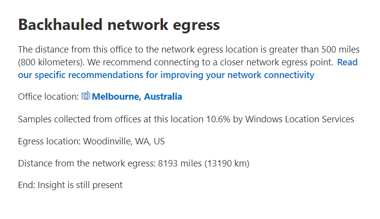

# Microsoft 365 Network Insights (versión preliminar)Microsoft 365 Network Insights (preview)

**Las perspectivas de** red son métricas de rendimiento recopiladas de su inquilino de Microsoft 365 y disponibles para que las puedan ver solo los usuarios administrativos de su espacio empresarial.**Network insights** are performance metrics collected from your Microsoft 365 tenant, and available to view only by administrative users in your tenant. Las conclusiones se muestran en el Centro de administración de Microsoft 365 en <https://portal.microsoft.com/adminportal/home#/networkperformance> .Insights are displayed in the Microsoft 365 Admin Center at <https://portal.microsoft.com/adminportal/home#/networkperformance>.

Insights está pensado para ayudar a diseñar perímetros de red para las ubicaciones de las oficinas.Insights are intended to help in designing network perimeters for your office locations. Cada información proporciona detalles en directo sobre las características de rendimiento de un problema común específico para cada ubicación geográfica en la que los usuarios acceden a su espacio empresarial.Each insight provides live details about the performance characteristics for a specific common issue for each geographic location where users are accessing your tenant.

Hay seis perspectivas de red específicas que se pueden mostrar para cada ubicación de la oficina:There are six specific network insights that may be shown for each office location:

- [Salida de red contraladaBackhauled network egress](#backhauled-network-egress)
- [Dispositivo intermediario de redNetwork intermediary device](#network-intermediary-device)
- [Mejor rendimiento detectado para clientes cercanosBetter performance detected for customers near you](#better-performance-detected-for-customers-near-you)
- [Uso de una puerta de servicio de Exchange Online no óptimaUse of a non-optimal Exchange Online service front door](#use-of-a-non-optimal-exchange-online-service-front-door)
- [Uso de una puerta de servicio de SharePoint Online no óptimaUse of a non-optimal SharePoint Online service front door](#use-of-a-non-optimal-sharepoint-online-service-front-door)
- [Baja velocidad de descarga desde la puerta principal de SharePointLow download speed from SharePoint front door](#low-download-speed-from-sharepoint-front-door)
- [Salida de red óptima para usuarios de ChinaChina user optimal network egress](#china-user-optimal-network-egress)

Hay dos perspectivas de red de nivel de inquilino que se pueden mostrar para el inquilino.There are two tenant level network insights that may be shown for the tenant. También aparecen en las páginas de puntuación de producción:These also appear in the producvitivy score pages:

- [Conexiones de ejemplo de Exchange afectadas por problemas de conectividadExchange sampled connections impacted by connectivity issues](#exchange-sampled-connections-impacted-by-connectivity-issues)
- [Conexiones de ejemplo de SharePoint afectadas por problemas de conectividadSharePoint sampled connections impacted by connectivity issues](#sharepoint-sampled-connections-impacted-by-connectivity-issues)

>[!IMPORTANT]
>Información de red, recomendaciones de rendimiento y evaluaciones en el Centro de administración de Microsoft 365 se encuentra actualmente en estado de vista previa y solo está disponible para los inquilinos de Microsoft 365 que se han inscrito en el programa de vista previa de características.Network insights, performance recommendations and assessments in the Microsoft 365 Admin Center is currently in preview status, and is only available for Microsoft 365 tenants that have been enrolled in the feature preview program.

## Salida de red contraladaBackhauled network egress

Esta información se mostrará si el servicio de información de red detecta que la distancia desde una ubicación de usuario determinada a la salida de red es superior a 500 millas (800 kilómetros), lo que indica que el tráfico de Microsoft 365 se está reenlazando a un proxy o dispositivo perimetral de Internet común.This insight will be displayed if the network insights service detects that the distance from a given user location to the network egress is greater than 500 miles (800 kilometers), indicating that Microsoft 365 traffic is being backhauled to a common Internet edge device or proxy.

Esta información se abrevia como "Salida" en algunas vistas de resumen.This insight is abbreviated as "Egress" in some summary views.

### EscenarioWhat does this mean?

Esto identifica que la distancia entre la ubicación de la oficina y la salida de red es de más de 500 millas (800 kilómetros).This identifies that the distance between the office location and the network egress is more than 500 miles (800 kilometers). La ubicación de la oficina se identifica mediante una ubicación de máquina cliente oculta y la ubicación de salida de red se identifica mediante la dirección IP inversa a las bases de datos de ubicación.The office location is identified by an obfuscated client machine location and the network egress location is identified by using reverse IP Address to location databases. La ubicación de la oficina puede ser inexacta si los Servicios de ubicación de Windows están deshabilitados en las máquinas.The office location may be inaccurate if Windows Location Services is disabled on machines. La ubicación de salida de red puede ser inexacta si la información de la base de datos de direcciones IP inversas es inexacta.The network egress location may be inaccurate if the reverse IP Address database information is inaccurate.

Los detalles de esta información incluyen la ubicación de la oficina, el porcentaje estimado del usuario del espacio empresarial total en la ubicación, la ubicación de salida de red actual, la relevancia de la ubicación de salida, la distancia entre la ubicación y el punto de salida actual, la fecha en que se detectó por primera vez la condición y la fecha en que se resolvió la condición.Details for this insight include the office location, estimated percentage of total tenant user at the location, the current network egress location, relevance of the egress location, the distance between the location and the current egress point, the date the condition was first detected, and the date the condition was resolved.

### ¿Qué tengo que hacer?What should I do?

Para esta información, recomendamos la salida de red más cerca de la ubicación de la oficina para que la conectividad pueda enrutar de forma óptima a la red global de Microsoft y a la puerta principal del servicio de Microsoft 365 más cercana.For this insight, we would recommend network egress closer to the office location so that connectivity can route optimally to Microsoft's global network and to the nearest Microsoft 365 service front door. Cerrar la salida de red a las ubicaciones de oficina de los usuarios también permite mejorar el rendimiento en el futuro, ya que Microsoft expande los puntos de presencia de red y las puertas frontales del servicio de Microsoft 365 en el futuro.Having close network egress to users office locations also allows for improved performance in the future as Microsoft expands both network points of presence and Microsoft 365 service front doors in the future.

Para obtener más información acerca de cómo resolver este problema, consulte [Conexiones](microsoft-365-network-connectivity-principles.md#egress-network-connections-locally) de red de salida localmente en principios de conectividad de red de [Office 365.](microsoft-365-network-connectivity-principles.md)For more information about how to resolve this issue, see [Egress network connections locally](microsoft-365-network-connectivity-principles.md#egress-network-connections-locally) in [Office 365 Network Connectivity Principles](microsoft-365-network-connectivity-principles.md).

## Dispositivo intermediario de redNetwork intermediary device

Esta información se mostrará si detectamos dispositivos entre los usuarios y la red de Microsoft, lo que puede afectar a la experiencia del usuario de Office 365.This insight will be displayed if we detected devices between your users and Microsoft's network which may impact the Office 365 user experience. Se recomienda que se omitan para el tráfico de red específico de Microsoft 365 destinado a centros de datos de Microsoft.It is recommended that these be bypassed for specific Microsoft 365 network traffic that is destined for Microsoft datacenters. Esta recomendación se describe además en los Principios de conectividad de [red de Microsoft 365](microsoft-365-network-connectivity-principles.md)This recommendation is additionally described in [Microsoft 365 Network Connectivity Principles](microsoft-365-network-connectivity-principles.md)

### EscenarioWhat does this mean?

Los dispositivos intermediarios de red como servidores proxy, VPN y dispositivos de prevención de pérdida de datos pueden afectar al rendimiento y la estabilidad de los clientes de Microsoft 365 en los que el tráfico está intermedio.Network intermediary devices such as proxy servers, VPNs, and data loss prevention devices can affect performance and stability of Microsoft 365 clients where traffic is intermediated.

### ¿Qué tengo que hacer?What should I do?

Configurar el dispositivo intermediario de red que se detectó para omitir el procesamiento del tráfico de red de Microsoft 365.Configure the network intermediary device that was detected to bypass processing for Microsoft 365 network traffic.

## Mejor rendimiento detectado para clientes cercanosBetter performance detected for customers near you

Esta información se mostrará si el servicio de información de red detecta que un número significativo de clientes de su área de metro tienen un mejor rendimiento que los usuarios de su organización en esta ubicación de la oficina.This insight will be displayed if the network insights service detects that a significant number of customers in your metro area have better performance than users in your organization at this office location.

Esta información se abrevia como "Pares" en algunas vistas de resumen.This insight is abbreviated as "Peers" in some summary views.

### EscenarioWhat does this mean?

Esta información examina el rendimiento agregado de los clientes de Microsoft 365 en la misma ciudad que esta ubicación de la oficina.This insight examines the aggregate performance of Microsoft 365 customers in the same city as this office location. Esta información se muestra si la latencia media de los usuarios es un 10 % mayor que la latencia media de los inquilinos vecinos.This insight is displayed if the average latency of your users is 10% greater than the average latency of neighboring tenants.

### ¿Qué tengo que hacer?What should I do?

Puede haber muchas razones para esta condición, incluida la latencia en la red corporativa o isp, cuellos de botella o problemas de diseño de arquitectura.There could be many reasons for this condition, including latency in your corporate network or ISP, bottlenecks, or architecture design issues. Examine la latencia entre cada salto de la ruta entre la red de la oficina y la puerta principal actual de Microsoft 365.Examine the latency between each hop in the route between your office network and the current Microsoft 365 front door. Para obtener más información, consulte Principios de conectividad de red [de Microsoft 365.](microsoft-365-network-connectivity-principles.md)For more information, see [Microsoft 365 Network Connectivity Principles](microsoft-365-network-connectivity-principles.md).

## Uso de una puerta de servicio de Exchange Online no óptimaUse of a non-optimal Exchange Online service front door

Esta información se mostrará si el servicio de información de red detecta que los usuarios de una ubicación específica no se conectan a una puerta de servicio de Exchange Online óptima.This insight will be displayed if the network insights service detects that users in a specific location are not connecting to an optimal Exchange Online service front door.

Esta información se abrevia como "Enrutamiento" en algunas vistas de resumen.This insight is abbreviated as "Routing" in some summary views.

### EscenarioWhat does this mean?

Enumeramos las puertas frontales del servicio de Exchange Online que son adecuadas para su uso desde la ciudad de la ubicación de la oficina con un buen rendimiento.We list Exchange Online service front doors which are suitable for use from the office location city with good performance. Si la prueba actual muestra el uso de una puerta de servicio de Exchange Online que no está en esta lista, llamamos a esta recomendación.If the current test shows use of an Exchange Online service front door not on this list, then we call out this recommendation.

### ¿Qué tengo que hacer?What should I do?

El uso de una puerta frontal de servicio de Exchange Online no óptima podría deberse a la reenlace de la red antes de la salida de la red corporativa, en cuyo caso se recomienda la salida de red local y directa.Use of a non-optimal Exchange Online service front door could be caused by network backhaul before the corporate network egress in which case we recommend local and direct network egress. También podría deberse al uso de un servidor de resolución recursiva DNS remoto, en cuyo caso se recomienda alinear el servidor de resolución recursiva dns con la salida de red.It could also be caused by use of a remote DNS Recursive Resolver server in which case we recommend aligning the DNS Recursive Resolver server with the network egress.

## Uso de una puerta de servicio de SharePoint Online no óptimaUse of a non-optimal SharePoint Online service front door

Esta información se mostrará si el servicio de información de red detecta que los usuarios de una ubicación específica no se conectan a la puerta principal del servicio de SharePoint Online más cercano.This insight will be displayed if the network insights service detects that users in a specific location are not connecting to the closest SharePoint Online service front door.

Esta información se abrevia como "Afd" en algunas vistas de resumen.This insight is abbreviated as "Afd" in some summary views.

### EscenarioWhat does this mean?

Identificamos la puerta principal del servicio de SharePoint Online con la que se conecta el cliente de prueba.We identify the SharePoint Online service front door that the test client is connecting to. A continuación, para la ciudad de la ubicación de la oficina, lo comparamos con la puerta de entrada del servicio de SharePoint Online prevista para esa ciudad.Then for the office location city we compare that to the expected SharePoint Online service front door for that city. Si no coincide, le recomendamos que lo haga.If it doesn't match, then we make this recommendation.

### ¿Qué tengo que hacer?What should I do?

El uso de una puerta frontal de servicio de SharePoint Online no óptima podría deberse a la reenlace de la red antes de la salida de la red corporativa, en cuyo caso se recomienda la salida de red local y directa.Use of a non-optimal SharePoint Online service front door could be caused by network backhaul before the corporate network egress in which case we recommend local and direct network egress. También podría deberse al uso de un servidor de resolución recursiva DNS remoto, en cuyo caso se recomienda alinear el servidor de resolución recursiva dns con la salida de red.It could also be caused by use of a remote DNS Recursive Resolver server in which case we recommend aligning the DNS Recursive Resolver server with the network egress.

## Baja velocidad de descarga desde la puerta principal de SharePointLow download speed from SharePoint front door

Esta información se mostrará si el servicio de información de red detecta que el ancho de banda entre la ubicación de la oficina específica y SharePoint Online es inferior a 1 MBps.This insight will be displayed if the network insights service detects that bandwidth between the specific office location and SharePoint Online is less than 1 MBps.

Esta información se abrevia como "Rendimiento" en algunas vistas de resumen.This insight is abbreviated as "Throughput" in some summary views.

### EscenarioWhat does this mean?

La velocidad de descarga que un usuario puede obtener de las puertas frontales del servicio de OneDrive para la Empresa y SharePoint Online se mide en megabytes por segundo (MBps).The download speed that a user can get from SharePoint Online and OneDrive for Business service front doors is measured in megabytes per second (MBps). Si este valor es menor que 1 MBps, proporcionamos esta información.If this value is less than 1 MBps then we provide this insight.

### ¿Qué tengo que hacer?What should I do?

Para mejorar las velocidades de descarga, es posible que sea necesario aumentar el ancho de banda.To improve download speeds, bandwidth may need to be increased. Como alternativa, puede haber congestión de la red entre las máquinas de usuario en la ubicación de la oficina y la puerta principal del servicio de SharePoint Online.Alternatively, there may be network congestion between user machines at the office location and the SharePoint Online service front door. Esto a veces se denomina pérdida congestiva y restringe la velocidad de descarga disponible para los usuarios incluso si hay suficiente ancho de banda disponible.This is sometimes called congestive loss and it restricts the download speed available to users even if sufficient bandwidth is available.

## Salida de red óptima para usuarios de ChinaChina user optimal network egress

Esta información se mostrará si su organización tiene usuarios en China que se conectan a su espacio empresarial de Microsoft 365 en otras ubicaciones geográficas.This insight will be displayed if your organization has users in China connecting to your Microsoft 365 tenant in other geographic locations. 

### EscenarioWhat does this mean?

Si su organización tiene conectividad WAN privada, le recomendamos que configure un circuito WAN de red desde sus ubicaciones de oficina en China que tenga salida de red a Internet en cualquiera de las siguientes ubicaciones:If your organization has private WAN connectivity, we recommend configuring a network WAN circuit from your office locations in China that has network egress to the Internet in any of the following locations:

- Hong KongHong Kong
- JapónJapan
- TaiwánTaiwan
- Corea del SurSouth Korea
- SingapurSingapore
- MalasiaMalaysia

La salida de Internet más alejada de los usuarios que estas ubicaciones reducirá el rendimiento, y la salida en China puede causar problemas de conectividad y latencia alta debido a la congestión entre fronteras.Internet egress further away from users than these locations will reduce performance, and egress in China may cause high latency and connectivity issues due to cross-border congestion.

### ¿Qué tengo que hacer?What should I do?

Para obtener más información acerca de cómo mitigar los problemas de rendimiento relacionados con esta información, vea Optimización del rendimiento global de los inquilinos de [Microsoft 365 para los usuarios de China.](microsoft-365-networking-china.md)For more information about how to mitigate performance issues related to this insight, see [Microsoft 365 global tenant performance optimization for China users](microsoft-365-networking-china.md).

## Conexiones de ejemplo de Exchange afectadas por problemas de conectividadExchange sampled connections impacted by connectivity issues

Esta información mostrará cuándo se verán afectadas el 50 % o más de las conexiones muestreadas.This insight will show when 50% or more of the sampled connections are impacted. El impacto lo define la evaluación de Exchange por debajo del 60 % para cada muestra.The impact is defined by the Exchange assessment being below 60% for each sample.

### EscenarioWhat does this mean?

Es una indicación de que es probable que la mayoría de los usuarios experimente problemas de experiencia de usuario con Outlook conectándose a Exchange Online.It is an indication that the majority of your users are likely to be experiencing user experience issues with Outlook connecting to Exchange Online. Es probable que el porcentaje de muestras represente el porcentaje de usuarios que se muestran por debajo de 60 puntos.The percentage of samples likely represents the percentage of users who show below 60 points.  

### ¿Qué tengo que hacer?What should I do?

Habilite la visibilidad de la conectividad de red de la ubicación de la oficina si aún no lo ha hecho.Enable office location network connectivity visibility if you have not already done so. Desea identificar qué oficinas se verán afectadas por una conectividad de red deficiente que está afectando a Exchange y buscar formas de mejorar el perímetro de red en cada una de las oficinas que conecta a los usuarios con la red de Microsoft.You want to identify which offices are impacted by poor network connectivity that is impacting Exchange and find ways to improve the network perimeter at each that connects the users to Microsoft's network.

## Conexiones de ejemplo de SharePoint afectadas por problemas de conectividadSharePoint sampled connections impacted by connectivity issues

Esta información mostrará cuándo se verán afectadas el 50 % o más de las conexiones muestreadas.This insight will show when 50% or more of the sampled connections are impacted. El impacto lo define la evaluación de SharePoint por debajo del 40 % para cada ejemplo.The impact is defined by the SharePoint assessment being below 40% for each sample.

### EscenarioWhat does this mean?

Es una indicación de que es probable que la mayoría de los usuarios experimente problemas de experiencia del usuario con SharePoint y OneDrive.It is an indication that the majority of your users are likely to be experiencing user experience issues with SharePoint and OneDrive. Es probable que el porcentaje de muestras represente el porcentaje de usuarios que se muestran por debajo de 40 puntos.The percentage of samples likely represents the percentage of users who show below 40 points.  

### ¿Qué tengo que hacer?What should I do?

Habilite la visibilidad de la conectividad de red de la ubicación de la oficina si aún no lo ha hecho.Enable office location network connectivity visibility if you have not already done so. Desea identificar qué oficinas se verán afectadas por una conectividad de red deficiente que esté afectando a SharePoint y buscar formas de mejorar el perímetro de red en cada una de las oficinas que conecta a los usuarios con la red de Microsoft.You want to identify which offices are impacted by poor network connectivity that is impacting SharePoint and find ways to improve the network perimeter at each that connects the users to Microsoft's network.

## Temas relacionadosRelated topics

[Conectividad de red en el Centro de administración de Microsoft 365 (versión preliminar)Network connectivity in the Microsoft 365 Admin Center (preview)](office-365-network-mac-perf-overview.md)

[Evaluación de red de Microsoft 365 (versión preliminar)Microsoft 365 network assessment (preview)](office-365-network-mac-perf-score.md)

[Herramienta de prueba de conectividad de red de Microsoft 365 (versión preliminar)Microsoft 365 network connectivity test tool (preview)](office-365-network-mac-perf-onboarding-tool.md)

[Servicios de ubicación de conectividad de red de Microsoft 365 (versión preliminar)Microsoft 365 Network Connectivity Location Services (preview)](office-365-network-mac-location-services.md)
