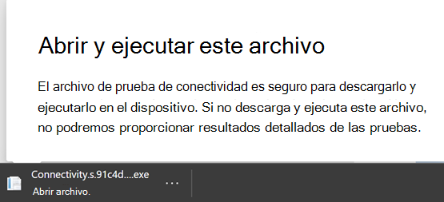
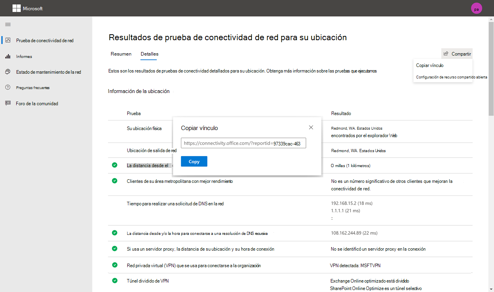
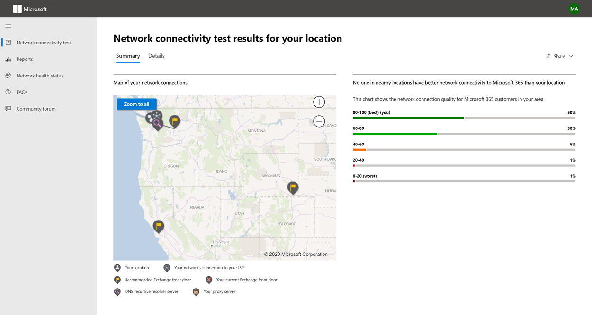
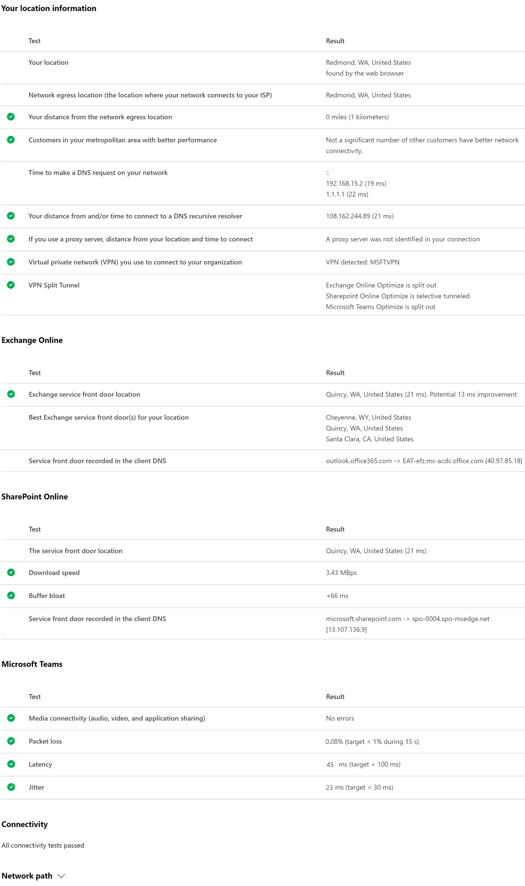

# Prueba de conectividad de red 365 de Microsoft (versión preliminar)

La herramienta de prueba de conectividad de red de Microsoft 365 se encuentra en <https://connectivity.office.com> . Se trata de una herramienta de Adjunct a la información de evaluación de red y de información de red disponible en el centro de administración de Microsoft 365 en el área **mantenimiento | Menú conectividad** .

>[!NOTE]
>La herramienta de prueba de conectividad de red es compatible con los inquilinos de WW Commercial y Alemania, pero no con GCC moderate, GCC High, DoD o China.

La información de red del centro de administración de Microsoft 365 se basa en las mediciones habituales del producto de su inquilino de Microsoft 365 que se agregan cada día. En comparación, la información de red de la prueba de conectividad de red de Microsoft 365 se ejecuta de forma local y una vez en la herramienta. Las pruebas que se pueden llevar a cabo en el producto son limitadas y al ejecutar pruebas locales para el usuario se pueden recopilar más datos, lo que da lugar a una información más profunda. Considere que en la información de red del centro de administración de Microsoft 365 se muestra que hay un problema de red para usar Microsoft 365 en una ubicación específica de la oficina. La prueba de conectividad de Microsoft 365 puede ayudarle a identificar la causa raíz de ese problema, lo que provoca una acción recomendada para mejorar el rendimiento de la red.

Le recomendamos que se usen conjuntamente donde el estado de calidad de la red se pueda evaluar para cada ubicación de la oficina en el centro de administración de Microsoft 365 y se puedan encontrar más detalles tras la implementación de las pruebas basadas en la prueba de conectividad de Microsoft 365.

>[!IMPORTANT]
>Información sobre la red, recomendaciones de rendimiento y evaluaciones en el centro de administración de Microsoft 365 se encuentra actualmente en estado de versión preliminar y solo está disponible para los inquilinos de Microsoft 365 que se han inscrito en el programa de vista previa de características.

## Aplicación cliente de pruebas avanzadas

La prueba de conectividad de red de Microsoft 365 es de dos partes: el sitio Web <https://connectivity.office.com> y una aplicación cliente de Windows descargable que ejecuta pruebas avanzadas de conectividad de red. La mayoría de las pruebas requieren que se ejecute la aplicación. Se rellenarán los resultados de nuevo en la página web mientras se ejecuta.

Se le pedirá que descargue la aplicación de prueba de cliente avanzada desde el sitio web una vez que se hayan completado las pruebas del explorador Web. Abra y ejecute el archivo cuando se le solicite.

## Compartir el informe de pruebas

El informe de prueba requiere iniciar sesión en su cuenta de Office 365. El administrador selecciona cómo puede compartir el informe de prueba.

### Compartir el informe con el administrador

Todos los informes de pruebas mientras ha iniciado sesión se comparten con el administrador.

### Uso compartido con su equipo de cuentas de Microsoft, soporte u otro personal

Los informes de pruebas excepto cualquier identificación personal se comparten con los empleados de Microsoft. Esta opción está habilitada de forma predeterminada y el administrador puede deshabilitarla en el grupo **mantenimiento | Página conectividad de red** en el centro de administración de Microsoft 365.

### Compartir con otros usuarios que inician sesión en el mismo inquilino de Office 365

Puede elegir los usuarios con los que desea compartir el informe y esta opción está habilitada de forma predeterminada. El administrador también puede deshabilitarlo.

### Compartir con todos los usuarios que usan un vínculo de ReportID

Puede compartir su informe de pruebas con cualquier persona proporcionando acceso a un vínculo de ReportID. Esto genera una dirección URL que puede enviar a un usuario para que pueda visualizar el informe de prueba sin iniciar sesión. Esta opción está deshabilitada de forma predeterminada y el administrador debe habilitarla.

## Resultados de prueba de conectividad de red

Los resultados se muestran en las pestañas **Resumen** y **detalles** . La pestaña Resumen muestra un mapa del perímetro de red detectado y una comparación de la evaluación de la red con otros clientes de Office 365 cercanos. También permite compartir el informe de prueba. Este es el aspecto de la vista de resultados del Resumen.

Este es un ejemplo de la salida de la pestaña detalles que muestra la herramienta. En la pestaña detalles, mostramos una marca de verificación en un círculo verde si el resultado se comparó de forma favorable a un umbral. Se muestra un signo de exclamación de triángulo rojo si el resultado ha superado un umbral que indica un conocimiento de la red. En las secciones siguientes se describe cada una de las filas de resultados de la pestaña detalles y se explican los umbrales usados para la información de red.

### Información de la ubicación

En esta sección se muestran los resultados de pruebas relacionados con la ubicación.

#### La ubicación

La ubicación del usuario se detecta desde el explorador Web de los usuarios o se puede escribir en las opciones de los usuarios. Se usa para identificar distancias de red a partes específicas del perímetro de la red de la empresa. Solo se guarda en el informe la ciudad de esta detección de ubicación y la distancia a otros puntos de red.

La ubicación de la oficina de usuario se muestra en la vista del mapa.

#### Ubicación de salida de red (la ubicación donde la red se conecta al ISP)

Identificamos la dirección IP de salida de red en el lado servidor. Las bases de datos de ubicación se usan para buscar la ubicación aproximada de salida de la red. Estas bases de datos suelen tener una precisión de aproximadamente el 90% de las direcciones IP. Si la ubicación buscada en la dirección IP de salida de red no es precisa, esto podría producir un resultado falso en esta prueba. Para comprobar si este error se produce en una dirección IP específica, puede usar los sitios web de ubicación de direcciones IP de red de acceso público para compararlos con la ubicación real.

#### La distancia de la ubicación de salida de red

Determinamos la distancia desde esa ubicación a la ubicación de la oficina. Esto se muestra como un conocimiento de la red si la distancia es superior a **500 millas** (800 kilómetros), ya que es probable que aumente la latencia TCP por más de 25ms y que pueda afectar a la experiencia del usuario.

La ubicación de salida de red se muestra en la vista del mapa y se conecta a la ubicación de la oficina del usuario que indica el backhaul de red dentro de la WAN empresarial.

La implementación de salidas de red locales y directas desde ubicaciones de oficinas de usuario a Internet se recomienda para la conectividad de red de Microsoft 365. Las mejoras en la salida local y directa son la mejor forma de afrontar esta visión de la red.

#### Información del servidor proxy

Se identifican los servidores proxy configurados en el equipo local. Se identifica si cualquiera de estos se configura en la ruta de red para optimizar el tráfico de red de Microsoft 365. Se identifica la distancia desde la ubicación de la oficina del usuario hacia los servidores proxy. La distancia se prueba primero por ping ICMP y, si se produce un error, se prueba con el comando TCP Ping y, finalmente, si se produce un error al buscar la dirección IP del servidor proxy en una base de datos de ubicación de direcciones IP. Se muestra un conocimiento de la red si el servidor proxy es superior a **500 millas** (800 kilómetros) lejos de la ubicación de la oficina del usuario.

#### Red privada virtual (VPN) que se usa para conectarse a la organización

Esto detecta si está usando una VPN para conectarse a Office 365. Se mostrará un resultado satisfactorio si no tiene ninguna VPN o si tiene una VPN con una configuración de túnel dividida recomendada para Office 365.

#### Túnel dividido de VPN

Cada ruta de categoría optimizada para Exchange Online, SharePoint Online y Microsoft Teams se prueba para ver si está en túnel en la red privada virtual (VPN). Una carga de trabajo dividida evita completamente la VPN. Una carga de trabajo de túnel se envía a través de la VPN. Una carga de trabajo de túnel selectivo tiene algunas rutas enviadas a través de VPN y otras divididas. Se mostrará un resultado satisfactorio si todas las cargas de trabajo se dividen o si se realiza un túnel selectivo.

#### Clientes de su área metropolitana con mejor rendimiento

La latencia TCP de red de la ubicación de la oficina del usuario al servicio de Exchange Online se compara con otros clientes de Microsoft 365 en la misma zona metropolitana. Se muestra un conocimiento de la red si el 10% o más de los clientes de la misma área metropolitana tienen un mejor rendimiento. Esto significa que sus usuarios tendrán un mejor rendimiento en la interfaz de usuario de Microsoft 365.

Este conocimiento de red se genera sobre la base de que todos los usuarios de una ciudad tienen acceso a la misma infraestructura de telecomunicaciones y a la misma proximidad a los circuitos de Internet y la red de Microsoft.

#### Tiempo para realizar una solicitud de DNS en la red

Muestra el servidor DNS configurado en el equipo cliente que ejecutó las pruebas. Es posible que sea un servidor de resolución de recursiva de DNS, pero no es frecuente. Es más probable que sea un servidor de reenviador DNS que almacene los resultados de DNS y reenvíe las solicitudes de DNS que no estén en caché a otro servidor DNS.

Se proporciona solo para información y no contribuye a ningún conocimiento de la red.

#### La distancia desde y/o la hora para conectarse a una resolución de DNS recursiva

La resolución de problemas de DNS en uso se identifica mediante la realización de una solicitud de DNS específica y, a continuación, preguntando al servidor de nombres DNS la dirección IP que recibió la misma solicitud. Esta dirección IP es la resolución de DNS recursiva y se buscará en las bases de datos de ubicación de direcciones IP para buscar la ubicación. A continuación, se calcula la distancia desde la ubicación de la oficina del usuario hasta la ubicación del servidor de resolución de DNS recursivo. Esto se muestra como un conocimiento de la red si la distancia es superior a **500 millas** (800 kilómetros).

Es posible que la ubicación buscada en la dirección IP de salida de red no sea precisa y esto provocaría un resultado falso en esta prueba. Para validar si se produce este error para una dirección IP específica, puede usar sitios web de ubicación de direcciones IP de red de acceso público.

Este conocimiento de la red afectará específicamente a la selección de la puerta del servicio de Exchange Online. Para resolver esta visión, la salida local y directa de la red debe ser un requisito previo y, a continuación, la resolución de nombres recursivos de DNS se debe encontrar cerca de la salida de la red.

### Exchange en línea

En esta sección se muestran los resultados de pruebas relacionados con Exchange Online.

#### Ubicación de la puerta frontal del servicio de Exchange

La puerta de la puerta del servicio de Exchange en uso se identifica de la misma forma que lo hace Outlook, pero se mide la latencia de TCP de red de la ubicación del usuario al mismo. Se muestra la latencia TCP y la puerta de la puerta del servicio Exchange en uso se compara con la lista de las puertas de los mejores servicios para la ubicación actual. Esto se muestra como un conocimiento de la red si una de las puertas de las puertas de los mejores servicios de Exchange no está en uso.

No usar una de las puertas de las puertas de los mejores servicios de Exchange podrían deberse a la backhaul? n de red antes de que la red corporativa se des en cuyo caso recomendamos la salida de red local y directa. También podría deberse al uso de un servidor remoto de resolución de recursiva de DNS, en cuyo caso se recomienda alinear el servidor de resolución de DNS recursivo con la salida de red.

Se calcula una posible mejora de la latencia de TCP (MS) en la puerta de la puerta del servicio de Exchange. Esto se realiza examinando la latencia de red de la ubicación de la oficina de usuario probada y restando la latencia de red de la ubicación actual a la puerta principal de los servicios de Exchange. La diferencia representa la posible oportunidad de mejora.

#### La mejor puerta o puertas del servicio de Exchange para su ubicación

Muestra las ubicaciones de las puertas de las puertas de los servicios de Exchange más adecuadas por ciudad en su ubicación.

#### Puerta de servicio registrada en el DNS del cliente

Muestra el nombre DNS y la dirección IP del servidor de la puerta de servicio de Exchange al que se dirigió. Se proporciona solo para información y no hay ningún conocimiento de la red asociado.

### SharePoint en linea

En esta sección se muestran los resultados de pruebas relacionados con SharePoint Online y OneDrive.

#### La ubicación de la puerta del servicio

La puerta frontal del servicio de SharePoint en uso se identifica de la misma manera que el cliente de OneDrive y medimos la latencia de TCP de red de la ubicación de la oficina de usuario a ella.

#### Velocidad de descarga

Medimos la velocidad de descarga de un archivo de 15 MB desde la puerta frontal del servicio de SharePoint. El resultado se muestra en megabytes por segundo para indicar el tamaño del archivo en megabytes que se puede descargar de SharePoint o OneDrive en **un segundo**. El número debe ser similar a una décima parte del ancho de banda mínimo del circuito en megabits por segundo. Por ejemplo, si tiene una conexión a Internet de 100Mbps, es posible que espere 10 Megabytes por segundo (10MBps).

#### Saturación del búfer

Durante la descarga de 15 MB, medimos la latencia TCP en la puerta frontal del servicio de SharePoint. Esta es la latencia en carga y se compara con la latencia cuando no se carga. El aumento de la latencia cuando en carga suele ser atribuible a los búferes de los dispositivos de red del consumidor que se cargan (o se retrasan). Se muestra un conocimiento de la red por un incremento de 1.000 o más.

#### Puerta de servicio registrada en el DNS del cliente

Muestra el nombre de DNS y la dirección IP del servidor de puerta de FrontPage del servicio de SharePoint al que se le dirigió. Se proporciona solo para información y no hay ningún conocimiento de la red asociado.

### Microsoft Teams

En esta sección se muestran los resultados de pruebas relacionados con Microsoft Teams.

#### Conectividad de medios (audio, vídeo y uso compartido de aplicaciones)

Esto comprueba la conectividad UDP con el servicio de Microsoft Teams puerta de delante. Si está bloqueado, es posible que Microsoft Teams siga funcionando con TCP, pero el audio y el vídeo se verán perjudicados. Obtenga más información sobre estas medidas de red UDP que también se aplican a Microsoft Teams en [calidad de medios y rendimiento de conectividad de red en Skype empresarial online](https://docs.microsoft.com/skypeforbusiness/optimizing-your-network/media-quality-and-network-connectivity-performance) .

#### Pérdida de paquetes

Muestra la pérdida de paquetes UDP medida en una llamada de prueba de audio de 10 segundos desde el cliente hasta la puerta de frontal del servicio de Microsoft Teams. Debe ser inferior al **1,00%** para una pasada.

### Latencia

Muestra la latencia UDP medida, que debe ser inferior a **100 ms**.

#### JIT

Muestra la vibración UDP medida, que debe ser inferior a **30ms**.

#### Conectividad

Se prueba la conectividad HTTP desde la ubicación de la oficina del usuario hasta todos los puntos de conexión de red de Microsoft 365 necesarios. Se publican en [https://aka.ms/o365ip](https://aka.ms/o365ip) . Se muestra un conocimiento de red para cualquier punto de conexión de red necesario al que no se pueda conectar.

La conectividad de Ay será bloqueada por un servidor proxy, un firewall u otro dispositivo de seguridad de red en el perímetro de red de la empresa o en uso como proxy en la nube.

Probamos el certificado SSL en cada punto de conexión de red de Microsoft 365 necesario que se encuentra en la categoría optimizar o permitir como se define en [https://aka.ms/o365ip](https://aka.ms/o365ip) . Si alguna de las pruebas no encuentra un certificado SSL de Microsoft, la red cifrada conectada debe haber sido interceptada por un dispositivo de red intermediario. Se muestra un conocimiento de red en cualquier punto de conexión de red cifrado interceptado.

Donde se encuentra un certificado SSL que Microsoft no proporciona, se muestra el FQDN de la prueba y el propietario del certificado SSL en uso. Este propietario de certificado SSL puede ser un proveedor de servidor proxy o un certificado autofirmado de empresa.

#### Ruta de red

En esta sección se muestran los resultados de ICMP traceroute en la puerta frontal del servicio de Exchange Online, el servicio de SharePoint Online y la puerta principal del servicio de Microsoft Teams. Se proporciona solo para información y no hay ningún conocimiento de la red asociado. Se proporcionan tres traceroute. Un traceroute a _Outlook.Office365.com_, un traceroute a los clientes front end de SharePoint o a _Microsoft.SharePoint.com_ si no se proporcionó ninguno y un traceroute a _World.tr.Teams.Microsoft.com_.

## Informes de conectividad

Si ha iniciado sesión, puede revisar los informes anteriores que ha ejecutado. También puede compartirlas o eliminarlas de la lista.

## Estado de mantenimiento de la red

Esto muestra los problemas de salud significativos con la red global de Microsoft, lo que puede afectar a los clientes de Microsoft 365.

## Preguntas frecuentes

Estas son las respuestas a algunas de las preguntas más frecuentes.

### ¿Esta herramienta se ha lanzado y es compatible con Microsoft?

Actualmente, se trata de una versión preliminar y planea proporcionar actualizaciones periódicamente hasta que lleguen al estado de lanzamiento de disponibilidad general con soporte de Microsoft. Envíe sus comentarios para ayudarnos a mejorar. Planeamos publicar una guía de incorporación más detallada de la red de Office 365 como parte de esta herramienta, que se ha personalizado para la organización mediante los resultados de la prueba.

### ¿Qué es el servicio de Microsoft 365 puerta frontal?

La puerta de entrada del servicio 365 de Microsoft es un punto de entrada en la red global de Microsoft donde los clientes y servicios de Office terminan su conexión de red. Para obtener una conexión de red óptima a Microsoft 365, se recomienda que la conexión de red se termine en la puerta frontal de Microsoft 365 más cercana en su ciudad o metro.

Nota: la puerta de servicio de Microsoft 365 no tiene ninguna relación directa con el producto de **servicio de puerta frontal de Azure** disponible en Azure Marketplace.

### ¿Cuál es la mejor puerta frontal del servicio Microsoft 365?

Una de las mejores puertas de la puerta delantera del servicio 365 de Microsoft (anteriormente conocida como servicio óptimo) es la más cercana a la salida de la red, generalmente en la ciudad o en el área metropolitana. Use la herramienta de rendimiento de red de 365 de Microsoft para determinar la ubicación de su puerta de servicio de Microsoft 365 y del mejor de las puertas de servicio. Si la herramienta determina que la puerta delantera en uso es una de las mejores, debe esperar una gran conectividad a la red global de Microsoft.

### ¿Qué es una ubicación de salida de Internet?

La ubicación de salida de Internet es la ubicación en la que el tráfico de red sale de la red de la empresa y se conecta a Internet. También se identifica como la ubicación en la que tiene un dispositivo de traducción de direcciones de red (NAT) y normalmente donde se conecta con un proveedor de servicios de Internet (ISP). Si ve una larga distancia entre su ubicación y la ubicación de salida de Internet, puede identificar un backhaul de WAN importante.

## Temas relacionados

[Recomendaciones de rendimiento de red en el centro de administración de Microsoft 365 (versión preliminar)](office-365-network-mac-perf-overview.md)

[Microsoft 365 Network performance Insight (versión preliminar)](office-365-network-mac-perf-insights.md)

[Evaluación de red de Microsoft 365 (versión preliminar)](office-365-network-mac-perf-score.md)

[Servicios de ubicación de conectividad de red 365 de Microsoft (versión preliminar)](office-365-network-mac-location-services.md)
