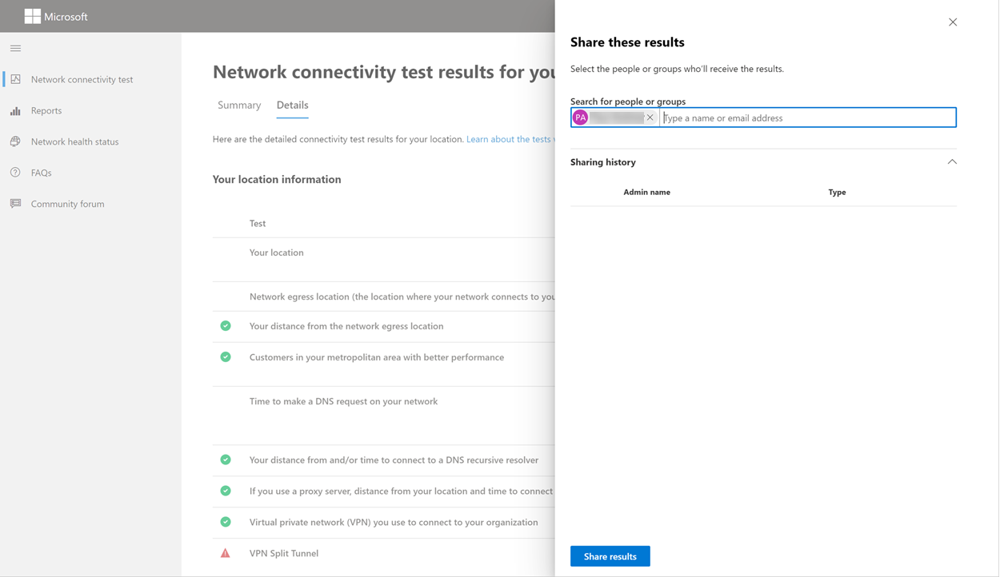

# Herramienta de prueba de conectividad de red de Microsoft 365 (versión preliminar)Microsoft 365 network connectivity test tool (preview)

La herramienta de prueba de conectividad de red de Microsoft 365 se encuentra en <https://connectivity.office.com> .The Microsoft 365 network connectivity test tool is located at <https://connectivity.office.com>. Se trata de una herramienta adjunta a la información de evaluación de red e información de red disponible en el Centro de administración de Microsoft 365 en el área de **| Menú** Conectividad.It is an adjunct tool to the network assessment and network insights information available in the Microsoft 365 admin center under the **Health | Connectivity** menu.

> [!IMPORTANT]
> Es importante iniciar sesión en el inquilino de Microsoft 365, ya que todos los informes de prueba se comparten con el administrador y se cargan en el inquilino mientras se inicia sesión.It is important to sign in to your Microsoft 365 tenant as all test reports are shared with your administrator and uploaded to the tenant while you are signed in.

>[!NOTE]
>La herramienta de prueba de conectividad de red admite inquilinos en WW Commercial y Alemania, pero no GCC Moderate, GCC High, DoD o China.The network connectivity test tool supports tenants in WW Commercial and Germany but not GCC Moderate, GCC High, DoD or China.

Los conocimientos de red del Centro de administración de Microsoft 365 se basan en medidas regulares del producto para el inquilino de Microsoft 365 que se agregan cada día.The network insights in the Microsoft 365 Admin Center are based on regular in-product measurements for your Microsoft 365 tenant which are aggregated each day. En comparación, los conocimientos de red de la prueba de conectividad de red de Microsoft 365 se ejecutan localmente y una vez en la herramienta.In comparison, the network insights from the Microsoft 365 network connectivity test are run locally and one time in the tool. Las pruebas que se pueden realizar en el producto son limitadas y al ejecutar pruebas locales para el usuario se pueden recopilar más datos, lo que da como resultado información más detallada.Testing that can be done in-product is limited and by running tests local to the user more data can be gathered resulting in deeper insights. Tenga en cuenta que las perspectivas de red del Centro de administración de Microsoft 365 mostrarán que hay un problema de red para el uso de Microsoft 365 en una ubicación de oficina específica.Consider then that the network insights in the Microsoft 365 Admin Center will show that there is a networking problem for use of Microsoft 365 at a specific office location. La prueba de conectividad de Microsoft 365 puede ayudar a identificar la causa raíz de ese problema que lleva a una acción recomendada de mejora del rendimiento de la red.The Microsoft 365 connectivity test can help to identify the root cause of that problem leading to a recommended network performance improvement action.

Se recomienda que se usen juntos donde se pueda evaluar el estado de calidad de las redes para cada ubicación de oficina en el Centro de administración de Microsoft 365 y se puedan encontrar más detalles después de la implementación de pruebas basadas en la prueba de conectividad de Microsoft 365.We recommend that these be used together where networking quality status can be assessed for each office location in the Microsoft 365 Admin Center and more specifics can be found after deployment of testing based on the Microsoft 365 connectivity test.

>[!IMPORTANT]
>Los conocimientos de red, las recomendaciones de rendimiento y las evaluaciones del Centro de administración de Microsoft 365 se encuentran actualmente en estado de vista previa y solo están disponibles para los inquilinos de Microsoft 365 que se han inscrito en el programa de vista previa de características.Network insights, performance recommendations and assessments in the Microsoft 365 Admin Center is currently in preview status, and is only available for Microsoft 365 tenants that have been enrolled in the feature preview program.

## Qué sucede en cada paso de pruebaWhat happens at each test step

### Identificación de ubicación de OfficeOffice location identification

Al hacer clic en el botón ejecutar prueba, se muestra la página de prueba en ejecución e identificamos la ubicación de la oficina.When you click the run test button we show the running test page and identify the office location. Puede escribir su ubicación por ciudad, estado y país o puede detectarla desde el explorador web.You can type in your location by city, state, and country or you can have it detected from the web browser. If you detect it then we request the latitude and longitude from the web browser and limit the accuracy to 300m by 300m before use.If you detect it then we request the latitude and longitude from the web browser and limit the accuracy to 300m by 300m before use. Lo hacemos porque no es necesario identificar la ubicación con más precisión que el edificio para el rendimiento de la red.We do this because it is not necessary to identify the location more accurately than the building for network performance. 

### Pruebas de JavaScriptJavaScript tests

Después de la identificación de ubicación de la oficina, ejecutamos una prueba de latencia TCP en JavaScript y solicitamos datos del servicio sobre los servidores de puerta principal de servicio de Office 365 recomendados y en uso.After office location identification we run a TCP latency test in JavaScript and we request data from the service about in-use and recommended Office 365 service front door servers. Cuando se completan, se muestran en el mapa y en la pestaña detalles donde se pueden ver antes del paso siguiente.When these are completed we show them on the map and in the details tab where they can be viewed prior to the next step.

### Descargar la aplicación cliente de pruebas avanzadasDownload the advanced tests client application

A continuación, iniciamos la descarga de la aplicación cliente de pruebas avanzadas.Next we start the download of the advanced tests client application. Dependemos del usuario para iniciar la aplicación cliente y también debe tener instalado .NET Core.We rely on the user to launch the client application and they must also have .NET Core installed.

Hay dos partes en la prueba de conectividad de red de Microsoft 365; el sitio web y una aplicación cliente de Windows descargable <https://connectivity.office.com> que ejecuta pruebas avanzadas de conectividad de red.There are two parts to the Microsoft 365 network connectivity test; the web site <https://connectivity.office.com> and a downloadable Windows client application that runs advanced network connectivity tests. La mayoría de las pruebas requieren que se ejecute la aplicación.Most of the tests require the application to be run. Rellenará los resultados de nuevo en la página web mientras se ejecuta.It will populate results back into the web page as it runs.

Se le pedirá que descargue la aplicación de prueba de cliente avanzada del sitio web una vez completadas las pruebas del explorador web.You will be prompted to download the advanced client test application from the web site after the web browser tests have completed. Abra y ejecute el archivo cuando se le pida.Open and run the file when prompted.

### Iniciar la aplicación cliente de pruebas avanzadasStart the advanced tests client application

Una vez que la aplicación cliente inicia la página web se actualizará para mostrar esto y los datos de prueba empezarán a recibirse en la página web.Once the client application starts the web page will update to show this and test data will start to be received to the web page. Se actualiza cada vez que se reciben nuevos datos y puede revisar los datos a medida que llegan.It updates each time new data is received and you can review the data as it arrives.

### Pruebas avanzadas completadas y carga de informes de pruebaAdvanced tests completed and test report upload

Una vez completadas las pruebas, la página web y el cliente de pruebas avanzadas lo indicarán y si el usuario ha iniciado sesión en el informe de prueba se cargará en el inquilino de clientes.Once the tests are completed the web page and the advanced tests client will both indicate this and if the user is signed in the test report will be uploaded to the customers tenant.

## Compartir el informe de pruebaSharing your test report

El informe de prueba requiere iniciar sesión en su cuenta de Office 365.The test report requires sign-in to your Office 365 account. El administrador selecciona cómo puede compartir el informe de prueba.Your administrator selects how you can share your test report.

### Compartir el informe con el administradorSharing your report with your administrator

Todos los informes de prueba mientras ha iniciado sesión se comparten con el administrador.All test reports while you are signed in are shared with your administrator.

### Uso compartido con el equipo de cuenta de Microsoft, soporte técnico u otro personalSharing with your Microsoft account team, support or other personnel

Los informes de prueba que excluyen cualquier identificación personal se comparten con los empleados de Microsoft.Test reports excluding any personal identification are shared with Microsoft employees. Esto está habilitado de forma predeterminada y el administrador puede deshabilitarlo en el servicio **de mantenimiento | Página Conectividad de** red en el Centro de administración de Microsoft 365.This is enabled by default and can be disabled by your administrator in the **Health | Network Connectivity** page in the Microsoft 365 Admin Center.

### Uso compartido con otros usuarios que inician sesión en el mismo inquilino de Office 365Sharing with other users who sign in to the same Office 365 tenant

Puede elegir los usuarios con los que compartir el informe y esto está habilitado de forma predeterminada.You can choose users to share your report with and this is enabled by default. También puede deshabilitarlo el administrador.It can also be disabled by your administrator.

### Compartir con cualquier persona que use un vínculo ReportIDSharing with anyone using a ReportID link

Puede compartir el informe de prueba con cualquier persona proporcionando acceso a un vínculo ReportID.You can share your test report with anyone by providing access to a ReportID link. Esto genera una dirección URL que puede enviar a alguien para que pueda presentar el informe de prueba sin iniciar sesión.This generates a URL that you can send to someone so that they can bring up the test report without signing in. Esto está deshabilitado de forma predeterminada y el administrador debe habilitarlo.This is disabled by default and must be enabled by your administrator.

## Resultados de la prueba de conectividad de redNetwork Connectivity Test Results

Los resultados se muestran en **las** pestañas Resumen **y** Detalles.The results are shown in the **Summary** and **Details** tabs. La pestaña resumen muestra un mapa del perímetro de red detectado y una comparación de la evaluación de red con otros clientes de Office 365 cercanos.The summary tab shows a map of the detected network perimeter and a comparison of the network assessment to other Office 365 customers nearby. También permite compartir el informe de prueba.It also allows for sharing of the test report. Este es el aspecto de la vista de resultados de resumen.Here's what the summary results view looks like.

Este es un ejemplo de la salida de pestaña de detalles que muestra la herramienta.Here is an example of the details tab output that the tool shows. En la pestaña detalles se muestra una marca de verificación de círculo verde si el resultado se comparó de forma favorable con un umbral.On the details tab we show a green circle check mark if the result was compared favorably to a threshold. Se muestra un signo de exclamación de triángulo rojo si el resultado superó un umbral que indica una información de red.We show a red triangle exclamation point if the result exceeded a threshold indicating a network insight. En las secciones siguientes se describen cada una de las filas de resultados de pestañas de detalles y se explican los umbrales usados para la información de red.The following sections describe each of the details tab results rows and explains the thresholds used for network insights.

### Información de ubicaciónYour location information

En esta sección se muestran los resultados de las pruebas relacionados con la ubicación.This section shows test results related to your location.

#### Su ubicaciónYour location

La ubicación del usuario se detecta desde el explorador web de los usuarios o se puede escribir en la elección de los usuarios.The user location is detected from the users web browser, or it can be typed in at the users choice. Se usa para identificar distancias de red a partes específicas del perímetro de red empresarial.It is used to identify network distances to specific parts of the enterprise network perimeter. Solo la ciudad desde esta detección de ubicación y la distancia a otros puntos de red se guardan en el informe.Only the city from this location detection and the distance to other network points are saved in the report.

La ubicación de la oficina de usuario se muestra en la vista de mapa.The user office location is shown on the map view.

#### Ubicación de salida de red (la ubicación donde se conecta la red al ISP)Network egress location (the location where your network connects to your ISP)

Identificamos la dirección IP de salida de red en el lado del servidor.We identify the network egress IP address on the server side. Las bases de datos de ubicación se usan para buscar la ubicación aproximada de la salida de red.Location databases are used to look up the approximate location for the network egress. Estas bases de datos suelen tener una precisión de aproximadamente el 90 % de las direcciones IP.These databases typically have an accuracy of about 90% of IP addresses. Si la ubicación buscada desde la dirección IP de salida de red no es precisa, esto daría lugar a un resultado falso de esta prueba.If the location looked up from the network egress IP address is not accurate then this would lead to a false result from this test. Para validar si se produce este error para una dirección IP específica, puede usar sitios web de ubicación de direcciones IP de red accesibles públicamente para comparar con su ubicación real.To validate if this error is occurring for a specific IP address you can use publicly accessible network IP address location web sites to compare to your actual location.

#### Distancia desde la ubicación de salida de redYour distance from the network egress location

Determinamos la distancia desde esa ubicación a la ubicación de la oficina.We determine the distance from that location to the office location. Esto se muestra como una información de red si la distancia es mayor que **500 millas** (800 kilómetros), ya que es probable que aumente la latencia TCP en más de 25 ms y puede afectar a la experiencia del usuario.This is shown as a network insight if the distance is greater than **500 miles** (800 kilometers) since that is likely to increase the TCP latency by more than 25ms and may affect user experience.

La ubicación de salida de red se muestra en la vista de mapa y se conecta a la ubicación de la oficina del usuario que indica el backhaul de red dentro de la WAN de empresa.The network egress location is shown on the map view and connected to the user office location indicating the network backhaul inside of the enterprise WAN.

Para la conectividad de red de Microsoft 365 se recomienda implementar salidas de red locales y directas desde ubicaciones de oficina de usuario a Internet.Implementing local and direct network egress from user office locations to the Internet is recommended for Microsoft 365 network connectivity. Las mejoras en la salida local y directa son la mejor manera de abordar esta información de red.Improvements to local and direct egress are the best way to address this network insight.

#### Información del servidor proxyProxy server information

Identificamos los servidores proxy configurados en el equipo local.We identify proxy server(s) configured on the local machine. Identificamos si alguno de estos está configurado en la ruta de acceso de red para optimizar el tráfico de red de Microsoft 365.We identify if any of these are configured in the network path for optimize category Microsoft 365 network traffic. Identificamos la distancia desde la ubicación de la oficina de usuario hasta los servidores proxy.We identify the distance from the user office location to the proxy servers. La distancia se prueba primero mediante el ping ICMP y, si esto falla, se prueba con ping TCP y, por último, si se produce un error, buscamos la dirección IP del servidor proxy en una base de datos de ubicación de direcciones IP.The distance is tested first by ICMP ping and if that fails we test with TCP ping and finally if that fails we look up the proxy server IP Address in an IP Address location database. Mostramos una información de red si el servidor proxy está a más de **500 millas** (800 kilómetros) de distancia de la ubicación de la oficina del usuario.We show a network insight if the proxy server is further than **500 miles** (800 kilometers) away from the user office location.

#### Red privada virtual (VPN) que usa para conectarse a su organizaciónVirtual private network (VPN) you use to connect to your organization

Esto detecta si usa una VPN para conectarse a Office 365.This detects if you are using a VPN to connect to Office 365. Un resultado de paso mostrará si no tiene VPN o si tiene una VPN con la configuración de túnel dividido recomendada para Office 365.A passing result will show if you have no VPN, or if you have a VPN with recommended split tunnel configuration for Office 365.

#### Túnel dividido de VPNVPN Split Tunnel

Cada ruta de categorías de optimización para Exchange Online, SharePoint Online y Microsoft Teams se prueba para ver si está tunelada en la VPN o no.Each optimize category route for Exchange Online, SharePoint Online, and Microsoft Teams is tested to see if it is tunneled on the VPN or not. Una carga de trabajo dividida evita la VPN por completo.A split out workload avoids the VPN entirely. Una carga de trabajo tunelada se envía a través de la VPN.A tunneled workload is all sent over the VPN. Una carga de trabajo de túnel selectiva tiene algunas rutas enviadas a través de la VPN y otras divididas. Un resultado de paso mostrará si todas las cargas de trabajo se dividen o se tunelización selectiva.A selective tunneled workload has some routes sent over the VPN and some split out. A passing result will show if all workloads are split out or selective tunneled.

#### Clientes de su área metropolitana con un mejor rendimientoCustomers in your metropolitan area with better performance

La latencia TCP de red de la ubicación de la oficina del usuario en la puerta principal del servicio Exchange Online se compara con otros clientes de Microsoft 365 en la misma área metropolitana.The network TCP latency of the user office location to the Exchange Online service front door is compared to other Microsoft 365 customers in the same metro area. Se muestra una información de red si el 10 % o más de los clientes de la misma área metropolitana tienen un mejor rendimiento.A network insight is shown if 10% or more of customers in the same metro area have better performance. Esto significa que sus usuarios tendrán un mejor rendimiento en la interfaz de usuario de Microsoft 365.This means their users will have better performance in the Microsoft 365 user interface.

Esta información de red se genera sobre la base de que todos los usuarios de una ciudad tienen acceso a la misma infraestructura de telecomunicaciones y la misma proximidad a los circuitos de Internet y a la red de Microsoft.This network insight is generated on the basis that all users in a city have access to the same telecommunications infrastructure and the same proximity to Internet circuits and Microsoft's network.

#### Hora de realizar una solicitud DNS en la redTime to make a DNS request on your network

Esto muestra el servidor DNS configurado en el equipo cliente que ejecutó las pruebas.This shows the DNS server configured on the client machine that ran the tests. Puede ser un servidor de resolución recursiva DNS, pero esto es poco común.It might be a DNS Recursive Resolver server however this is uncommon. Es más probable que sea un servidor de reenviador DNS que almacena en caché los resultados dns y reenvía las solicitudes DNS sin almacenar en caché a otro servidor DNS.It is more likely to be a DNS forwarder server which caches DNS results and forwards any uncached DNS requests to another DNS server.

Esto se proporciona solo para la información y no contribuye a ninguna información de red.This is provided for information only and does not contribute to any network insight.

#### Distancia desde y/o tiempo para conectarse a un solucionador recursivo DNSYour distance from and/or time to connect to a DNS recursive resolver

El solucionador recursivo DNS en uso se identifica realizando una solicitud DNS específica y, a continuación, solicitando al servidor de nombres DNS la dirección IP de la que recibió la misma solicitud.The in-use DNS Recursive Resolver is identified by making a specific DNS request and then asking the DNS Name Server for the IP Address that it received the same request from. Esta dirección IP es el solucionador recursivo DNS y se buscará en las bases de datos de ubicación de direcciones IP para encontrar la ubicación.This IP Address is the DNS Recursive Resolver and it will be looked up in IP Address location databases to find the location. A continuación, se calcula la distancia desde la ubicación de la oficina de usuario a la ubicación del servidor de resolución recursiva DNS.The distance from the user office location to the DNS Recursive Resolver server location is then calculated. Esto se muestra como una información de red si la distancia es mayor que **500 millas** (800 kilómetros).This is shown as a network insight if the distance is greater than **500 miles** (800 kilometers).

Es posible que la ubicación buscada desde la dirección IP de salida de red no sea precisa y esto daría lugar a un resultado falso de esta prueba.The location looked up from the network egress IP Address may not be accurate and this would lead to a false result from this test. Para validar si se produce este error para una dirección IP específica, puede usar sitios web de ubicación de direcciones IP de red accesibles públicamente.To validate if this error is occurring for a specific IP Address you can use publicly accessible network IP Address location web sites.

Esta información de red afectará específicamente a la selección de la puerta principal del servicio de Exchange Online.This network insight will specifically impact the selection of the Exchange Online service front door. Para abordar esta información, la salida de red local y directa debe ser un requisito previo y, a continuación, el solucionador recursivo DNS debe encontrarse cerca de esa salida de red.To address this insight local and direct network egress should be a pre-requisite and then DNS Recursive Resolver should be located close to that network egress.

### Exchange en líneaExchange Online

En esta sección se muestran los resultados de las pruebas relacionados con Exchange Online.This section shows test results related to Exchange Online.

#### Ubicación de la puerta principal del servicio exchangeExchange service front door location

La puerta principal del servicio exchange en uso se identifica de la misma manera que Outlook lo hace y medimos la latencia TCP de red desde la ubicación del usuario hasta ella.The in-use Exchange service front door is identified in the same way that Outlook does this and we measure the network TCP latency from the user location to it. Se muestra la latencia TCP y la puerta principal del servicio de Exchange en uso se compara con la lista de puertas frontales de mejor servicio para la ubicación actual.The TCP latency is shown and the in-use Exchange service front door is compared to the list of best service front doors for the current location. Esto se muestra como una información de red si una de las puertas frontales del mejor servicio de Exchange no está en uso.This is shown as a network insight if one of the best Exchange service front door(s) is not in use.

No usar una de las puertas frontales del mejor servicio de Exchange podría deberse al backhaul de red antes de la salida de la red corporativa, en cuyo caso se recomienda la salida de red local y directa.Not using one of the best Exchange service front door(s) could be caused by network backhaul before the corporate network egress in which case we recommend local and direct network egress. También podría deberse al uso de un servidor de resolución recursiva de DNS remoto, en cuyo caso se recomienda alinear el servidor de resolución recursiva DNS con la salida de red.It could also be caused by use of a remote DNS recursive resolver server in which case we recommend aligning the DNS recursive resolver server with the network egress.

Calculamos una posible mejora en la latencia TCP (ms) en la puerta principal del servicio Exchange.We calculate a potential improvement in TCP latency (ms) to the Exchange service front door. Para ello, observa la latencia de red de la ubicación de la oficina de usuario probada y resta la latencia de red de la ubicación actual a la puerta principal del servicio Exchange.This is done by looking at the tested user office location network latency and subtracting the network latency from the current location to the closets Exchange service front door. La diferencia representa la oportunidad potencial de mejora.The difference represents the potential opportunity for improvement.

#### Puertas frontales del mejor servicio de Exchange para su ubicaciónBest Exchange service front door(s) for your location

Esto enumera las mejores ubicaciones de la puerta principal del servicio Exchange por ciudad para su ubicación.This lists the best Exchange service front door locations by city for your location.

#### Puerta principal del servicio registrada en el DNS del clienteService front door recorded in the client DNS

Esto muestra el nombre DNS y la dirección IP del servidor de puerta principal del servicio exchange al que se le ha dirigido.This shows the DNS name and IP Address of the Exchange service front door server that you were directed to. Solo se proporciona para la información y no hay información de red asociada.It is provided for information only and there is no associated network insight.

### SharePoint en lineaSharePoint Online

En esta sección se muestran los resultados de las pruebas relacionadas con SharePoint Online y OneDrive.This section shows test results related to SharePoint Online and OneDrive.

#### Ubicación de la puerta principal del servicioThe service front door location

La puerta principal del servicio de SharePoint en uso se identifica de la misma manera que lo hace el cliente de OneDrive y medimos la latencia TCP de red desde la ubicación de la oficina del usuario hasta ella.The in-use SharePoint service front door is identified in the same way that the OneDrive client does and we measure the network TCP latency from the user office location to it.

#### Velocidad de descargaDownload speed

Medimos la velocidad de descarga de un archivo de 15 Mb desde la puerta principal del servicio de SharePoint.We measure the download speed for a 15Mb file from the SharePoint service front door. El resultado se muestra en megabytes por segundo para indicar qué archivo de tamaño en megabytes se puede descargar desde SharePoint o OneDrive en **un segundo.**The result is shown in megabytes per second to indicate what size file in megabytes can be downloaded from SharePoint or OneDrive in **one second**. El número debe ser similar a una décima parte del ancho de banda mínimo del circuito en megabits por segundo.The number should be similar to one tenth of the minimum circuit bandwidth in megabits per second. Por ejemplo, si tiene una conexión a Internet de 100mbps, puede esperar 10 megabytes por segundo (10 MBps).For example if you have a 100mbps internet connection, you may expect 10 megabytes per second (10MBps).

#### Bloat de búferBuffer bloat

Durante la descarga de 15 Mb, se mide la latencia TCP en la puerta principal del servicio de SharePoint.During the 15Mb download we measure the TCP latency to the SharePoint service front door. Esta es la latencia bajo carga y se compara con la latencia cuando no está bajo carga.This is the latency under load and it is compared to the latency when not under load. El aumento de la latencia cuando se carga a menudo es atribuible a los búferes de dispositivos de red del consumidor que se cargan (o se saturan).The increase in latency when under load is often attributable to consumer network device buffers being loaded (or bloated). Se muestra una información de red para cualquier bloat de 1.000 o más.A network insight is shown for any bloat of 1,000 or more.

#### Puerta principal del servicio registrada en el DNS del clienteService front door recorded in the client DNS

Esto muestra el nombre DNS y la dirección IP del servidor de puerta principal del servicio de SharePoint al que se le ha dirigido.This shows the DNS name and IP Address of the SharePoint service front door server that you were directed to. Solo se proporciona para la información y no hay información de red asociada.It is provided for information only and there is no associated network insight.

### Microsoft TeamsMicrosoft Teams

En esta sección se muestran los resultados de las pruebas relacionadas con Microsoft Teams.This section shows test results related to Microsoft Teams.

#### Conectividad de medios (audio, vídeo y uso compartido de aplicaciones)Media connectivity (audio, video, and application sharing)

Esto prueba la conectividad UDP a la puerta principal del servicio de Microsoft Teams.This tests for UDP connectivity to the Microsoft Teams service front door. Si esto está bloqueado, Microsoft Teams puede seguir funcionando con TCP, pero el audio y el vídeo se verán dañados.If this is blocked then Microsoft Teams may still work using TCP, but audio and video will be impaired. Obtenga más información sobre estas medidas de red UDP que también se aplican a Microsoft Teams en Calidad de medios y Rendimiento de conectividad de red [en Skype Empresarial Online](/skypeforbusiness/optimizing-your-network/media-quality-and-network-connectivity-performance)Read more about these UDP network measurements which also apply to Microsoft Teams at [Media Quality and Network Connectivity Performance in Skype for Business Online](/skypeforbusiness/optimizing-your-network/media-quality-and-network-connectivity-performance)

#### Pérdida de paquetesPacket loss

Muestra la pérdida de paquetes UDP medida en una llamada de audio de prueba de 10 segundos desde el cliente a la puerta principal del servicio de Microsoft Teams.Shows the UDP packet loss measured in a 10 second test audio call from the client to the Microsoft Teams service front door. Esto debe ser inferior al **1,00 %** para un pase.This should be lower than **1.00%** for a pass.

#### LatenciaLatency

Muestra la latencia UDP medida, que debe ser inferior a **100 ms**.Shows the measured UDP latency, which should be lower than **100ms**.

#### VibraciónJitter

Muestra el vibración UDP medido, que debe ser inferior a **30 ms.**Shows the measured UDP jitter, which should be lower than **30ms**.

#### ConectividadConnectivity

Se prueba la conectividad HTTP desde la ubicación de la oficina del usuario a todos los extremos de red de Microsoft 365 necesarios.We test for HTTP connectivity from the user office location to all of the required Microsoft 365 network endpoints. Se publican en [https://aka.ms/o365ip](./urls-and-ip-address-ranges.md) .These are published at [https://aka.ms/o365ip](./urls-and-ip-address-ranges.md). Se muestra una información de red para los puntos de conexión de red necesarios a los que no se puede conectar.A network insight is shown for any required network endpoints which cannot be connected to.

Un servidor proxy, un firewall u otro dispositivo de seguridad de red del perímetro de red empresarial pueden bloquear la conectividad.Connectivity may be blocked by a proxy server, a firewall, or another network security device on the enterprise network perimeter. La conectividad al puerto TCP 80 se prueba con una solicitud HTTP y la conectividad al puerto TCP 443 se prueba con una solicitud HTTPS.Connectivity to TCP port 80 is tested with an HTTP request and connectivity to TCP port 443 is tested with an HTTPS request. Si no hay respuesta, el FQDN se marca como un error.If there is no response the FQDN is marked as a failure. Si hay un código de respuesta HTTP 407, el FQDN se marca como un error.If there is an HTTP response code 407 the FQDN is marked as a failure. Si hay un código de respuesta HTTP 403, comprobaremos el atributo Server de la respuesta y, si parece ser un servidor proxy, lo marcamos como un error.If there is an HTTP response code 403 then we check the Server attribute of the response and if it appears to be a proxy server we mark this as a failure. Puedes simular las pruebas que llevamos a cabo con la herramienta de línea de comandos de Windows curl.exe.You can simulate the tests we perform with the Windows command line tool curl.exe.

Se prueba el certificado SSL en cada extremo de red de Microsoft 365 necesario que se encuentra en la categoría optimizar o permitir tal como se define en [https://aka.ms/o365ip](./urls-and-ip-address-ranges.md) .We test the SSL certificate at each required Microsoft 365 network endpoint that is in the optimize or allow category as defined at [https://aka.ms/o365ip](./urls-and-ip-address-ranges.md). Si alguna prueba no encuentra un certificado SSL de Microsoft, la red cifrada conectada debe haber sido interceptada por un dispositivo de red intermediario.If any tests do not find a Microsoft SSL certificate, then the encrypted network connected must have been intercepted by an intermediary network device. Se muestra una información de red en los puntos de conexión de red cifrados interceptados.A network insight is shown on any intercepted encrypted network endpoints.

Cuando se encuentra un certificado SSL que no proporciona Microsoft, se muestra el FQDN de la prueba y el propietario del certificado SSL en uso.Where an SSL certificate is found that isn't provided by Microsoft, we show the FQDN for the test and the in-use SSL certificate owner. Este propietario de certificado SSL puede ser un proveedor de servidores proxy o puede ser un certificado autofirmado de empresa.This SSL certificate owner may be a proxy server vendor, or it may be an enterprise self-signed certificate.

#### Ruta de acceso de redNetwork path

En esta sección se muestran los resultados de una ruta de seguimiento ICMP a la puerta principal del servicio de Exchange Online, a la puerta principal del servicio de SharePoint Online y a la puerta principal del servicio de Microsoft Teams.This section shows the results of an ICMP traceroute to the Exchange Online service front door, the SharePoint Online service front door, and the Microsoft Teams service front door. Solo se proporciona para la información y no hay información de red asociada.It is provided for information only and there is no associated network insight. Se proporcionan tres rutas de seguimiento.There are three traceroutes provided. Un traceroute a _outlook.office365.com_, un traceroute a los clientes cliente de SharePoint front-end o _a microsoft.sharepoint.com_ si no se proporcionó uno y un traceroute a _world.tr.teams.microsoft.com_.A traceroute to _outlook.office365.com_, a traceroute to the customers SharePoint front end or to _microsoft.sharepoint.com_ if one was not provided, and a traceroute to _world.tr.teams.microsoft.com_.

## Informes de conectividadConnectivity reports

Cuando haya iniciado sesión, puede revisar los informes anteriores que haya ejecutado.When you are signed in you can review previous reports that you have run. También puede compartirlos o eliminarlos de la lista.You can also share them or delete them from the list.

## Estado de mantenimiento de la redNetwork health status

Esto muestra cualquier problema de mantenimiento significativo con la red global de Microsoft que podría afectar a los clientes de Microsoft 365.This shows any significant health issues with Microsoft's global network which might impact Microsoft 365 customers.

## Preguntas más frecuentesFAQ

Estas son las respuestas a algunas de nuestras preguntas más frecuentes.Here are answers to some of our frequently asked questions.

### ¿Microsoft ha lanzado y admitido esta herramienta?Is this tool released and supported by Microsoft?

Actualmente es una versión preliminar y tenemos previsto proporcionar actualizaciones periódicamente hasta que alcancemos el estado de la versión de disponibilidad general con el soporte técnico de Microsoft.It is currently a preview and we plan to provide updates regularly until we reach general availability release status with support from Microsoft. Proporcione comentarios para ayudarnos a mejorar.Please provide feedback to help us improve. Estamos planeando publicar una guía de incorporación de red de Office 365 más detallada como parte de esta herramienta personalizada para la organización por sus resultados de prueba.We are planning to publish a more detailed Office 365 Network Onboarding guide as part of this tool which is customized for the organization by its test results.

### ¿Qué es necesario para ejecutar el cliente de prueba avanzada?What is required to run the advanced test client?

El cliente de prueba avanzada requiere .NET Core 3.1 Desktop Runtime.The advanced test client requires .NET Core 3.1 Desktop Runtime. Si ejecuta el cliente de prueba avanzada sin que esté instalado, se le dirigirá a la página del instalador [de .NET Core 3.1](https://dotnet.microsoft.com/download/dotnet-core/3.1).If you run the advanced test client without that installed you will be directed to [the .NET Core 3.1 installer page](https://dotnet.microsoft.com/download/dotnet-core/3.1). Asegúrese de instalar Desktop Runtime y no el SDK, o el ASP.NET Core Runtime que están más arriba en la página.Be sure to install the Desktop Runtime and not the SDK, or the ASP.NET Core Runtime which are higher up on the page. Los permisos de administrador en el equipo son necesarios para instalar .NET Core.Administrator permissions on the machine is required to install .NET Core.

### ¿Qué es la puerta principal del servicio de Microsoft 365?What is Microsoft 365 service front door?

La puerta principal del servicio de Microsoft 365 es un punto de entrada en la red global de Microsoft donde los clientes y servicios de Office terminan su conexión de red.The Microsoft 365 service front door is an entry point on Microsoft's global network where Office clients and services terminate their network connection. Para una conexión de red óptima a Microsoft 365, se recomienda que la conexión de red finalice en la puerta principal de Microsoft 365 más cercana en su ciudad o metro.For an optimal network connection to Microsoft 365, it is recommended that your network connection is terminated into the closest Microsoft 365 front door in your city or metro.

Nota: La puerta principal del servicio de Microsoft 365 no tiene ninguna relación directa con el producto del servicio de puerta frontal de **Azure** disponible en azure marketplace.Note: Microsoft 365 service front door has no direct relationship to the **Azure Front Door Service** product available in the Azure marketplace.

### ¿Cuál es la mejor puerta principal de servicio de Microsoft 365?What is the best Microsoft 365 service front door?

Una mejor puerta frontal de servicio de Microsoft 365 (anteriormente conocida como puerta principal de servicio óptimo) es la más cercana a la salida de la red, generalmente en su ciudad o área metropolitana.A best Microsoft 365 service front door (formerly known as an optimal service front door) is one that is closest to your network egress, generally in your city or metro area. Use la herramienta de rendimiento de red de Microsoft 365 para determinar la ubicación de la puerta principal del servicio en uso de Microsoft 365 y las puertas frontales de mejor servicio.Use the Microsoft 365 network performance tool to determine location of your in-use Microsoft 365 service front door and the best service front door(s). Si la herramienta determina que la puerta principal en uso es una de las mejores, debería esperar una gran conectividad a la red global de Microsoft.If the tool determines your in-use front door is one of the best ones, then you should expect great connectivity into Microsoft's global network.

### ¿Qué es una ubicación de salida de Internet?What is an internet egress location?

La ubicación de salida de Internet es la ubicación donde el tráfico de red sale de la red empresarial y se conecta a Internet.The internet egress Location is the location where your network traffic exits your enterprise network and connects to the Internet. Esto también se identifica como la ubicación donde tiene un dispositivo de traducción de direcciones de red (NAT) y, por lo general, donde se conecta con un proveedor de servicios de Internet (ISP).This is also identified as the location where you have a Network Address Translation (NAT) device and usually where you connect with an Internet Service Provider (ISP). Si ves una larga distancia entre la ubicación y la ubicación de salida de Internet, esto puede identificar un backhaul wan significativo.If you see a long distance between your location and your internet egress location, then this may identify a significant WAN backhaul.

## Temas relacionadosRelated topics

[Conectividad de red en el Centro de administración de Microsoft 365 (versión preliminar)Network connectivity in the Microsoft 365 Admin Center (preview)](office-365-network-mac-perf-overview.md)

[Información de rendimiento de red de Microsoft 365 (versión preliminar)Microsoft 365 network performance insights (preview)](office-365-network-mac-perf-insights.md)

[Evaluación de red de Microsoft 365 (versión preliminar)Microsoft 365 network assessment (preview)](office-365-network-mac-perf-score.md)

[Servicios de ubicación de conectividad de red de Microsoft 365 (versión preliminar)Microsoft 365 Network Connectivity Location Services (preview)](office-365-network-mac-location-services.md)