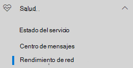
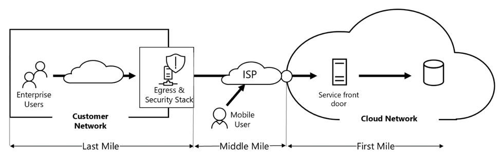
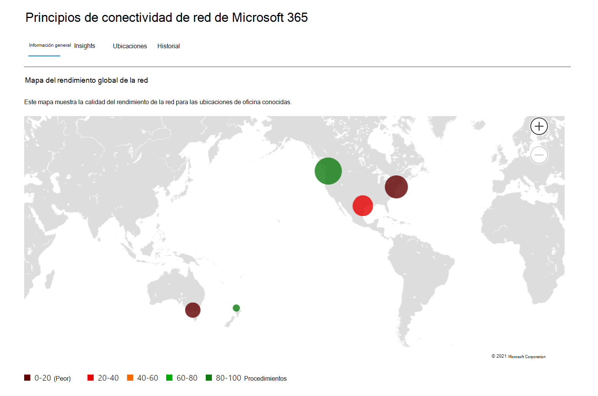
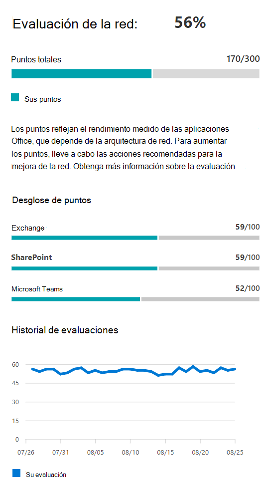
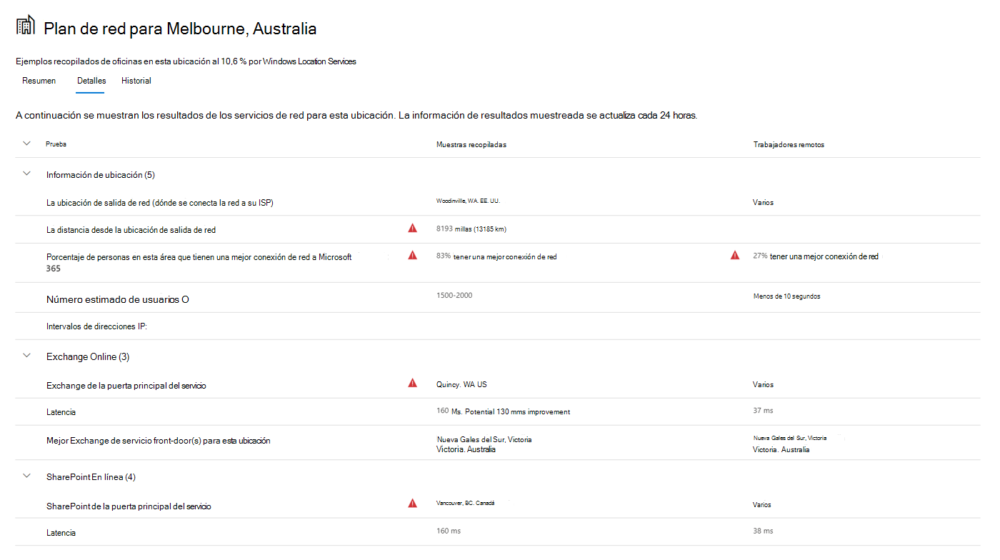
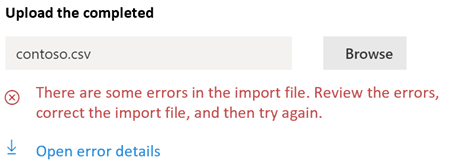

# Conectividad de red en el centro de administración de 365 de Microsoft (versión preliminar)Network connectivity in the Microsoft 365 Admin Center (preview)

El centro de administración de Microsoft 365 ahora incluye métricas de conectividad de red agregadas recopiladas de su inquilino de Microsoft 365 y disponibles para que las vean solo los usuarios administrativos de su espacio empresarial.The Microsoft 365 Admin Center now includes aggregated network connectivity metrics collected from your Microsoft 365 tenant and available to view only by administrative users in your tenant. Las **evaluaciones de red** y la información de **red** se muestran en el centro de administración de Microsoft 365 bajo **Health | Conectividad**.**Network assessments** and **network insights** are displayed in the Microsoft 365 Admin Center under **Health | Connectivity**.

Cuando navegue por primera vez a la página conectividad de red, verá un panel de información general que contiene un mapa de rendimiento global de la red, una evaluación de red con ámbito de todo el inquilino y una lista de problemas actuales.When you first navigate to the network connectivity page, you will see an overview pane containing a map of global network performance, a network assessment scoped to the entire tenant, and a list of current issues. Desde la introducción, puede profundizar para ver las métricas de rendimiento de red y los problemas específicos por ubicación.From the overview, you can drill down to view specific network performance metrics and issues by location. Para obtener más información, consulte [Network performance Overview en el centro de administración de Microsoft 365](#network-connectivity-overview-in-the-microsoft-365-admin-center).For more information, see [Network performance overview in the Microsoft 365 Admin Center](#network-connectivity-overview-in-the-microsoft-365-admin-center).

## Requisitos previos para que aparezcan las evaluaciones de conectividad de redPre-requisites for network connectivity assessments to appear

Hay tres opciones para obtener evaluaciones de red desde sus ubicaciones de oficina:There are three options for getting network assessments from your office locations:

### 1. habilitar los servicios de ubicación de Windows1. Enable Windows Location Services

Para esta opción, debe tener al menos dos equipos en ejecución en cada ubicación de oficina que admita los requisitos previos.For this option you must have at least two computers running at each office location that support the pre-requisites. La versión **19,232** o superior de OneDrive para Windows debe estar instalada en cada equipo.OneDrive for Windows version **19.232** or above must be installed on each computer. Para obtener más información sobre las versiones de OneDrive, consulte las notas de la [versión de onedrive](https://support.office.com/article/onedrive-release-notes-845dcf18-f921-435e-bf28-4e24b95e5fc0).For more information on OneDrive versions, see the [OneDrive release notes](https://support.office.com/article/onedrive-release-notes-845dcf18-f921-435e-bf28-4e24b95e5fc0). Se planea que las medidas de red se agreguen en otras aplicaciones cliente de Office 365 en un futuro próximo.Network measurements are planned to be added in other Office 365 client applications in the near future.

El servicio de ubicación de Windows debe estar Consent en los equipos.Windows Location Service must be consented on the machines. Puede probar esto ejecutando la aplicación **mapas** y buscándolo.You can test this by running the **Maps** app and locating yourself. Se puede habilitar en un único equipo con **configuración | Privacidad | Ubicación** en la que la configuración permite que las _aplicaciones tengan acceso a su ubicación_ debe estar habilitada.It can be enabled on a single machine with **Settings | Privacy | Location** where the setting _Allow apps to access your location_ must be enabled. El consentimiento de los servicios de ubicación de Windows se puede implementar en equipos que usen MDM o la Directiva de grupo con la configuración _LetAppsAccessLocation_.Windows Location Services consent can be deployed to PCs using MDM or Group Policy with the setting _LetAppsAccessLocation_.

No es necesario agregar ubicaciones en el centro de administración con este método, ya que se identifican automáticamente en la resolución de la ciudad.You do not need to add locations in the Admin Center with this method as they are automatically identified at the city resolution. No puede mostrar varias ubicaciones de oficina dentro de una ciudad con los servicios de ubicación de Windows.You cannot show multiple office locations within a city using Windows Location Services.

Los equipos deben tener una red Wi-Fi en lugar de un cable Ethernet.The machines should have Wi-Fi networking rather than an ethernet cable. Los equipos con un cable Ethernet no tienen información precisa sobre la ubicación.Machines with an ethernet cable do not have accurate location information.

Las muestras de medidas y las ubicaciones de la oficina deberían empezar a parecer 24 horas después de que se hayan cumplido estos requisitos previos.Measurement samples and office locations should start to appear 24 hours after these pre-requisites have been met.

### 2. agregar ubicaciones y proporcionar información de subred de LAN2. Add locations and provide LAN subnet information

Para esta opción no se necesitan servicios de ubicación de Windows ni Wi-Fi.For this option neither Windows Location Services nor Wi-Fi are required. Necesita la versión 20,161 o posterior de OneDrive para Windows instalada en todos los equipos de la ubicación.You need OneDrive for Windows version 20.161 or above installed on each computer at the location.

También tiene que agregar ubicaciones en la página conectividad de red del centro de administración o importarlas desde un archivo CSV.You also need to add locations in the Admin Center network connectivity page or to import those from a CSV file. Las ubicaciones agregadas deben incluir la información de subred de la LAN de Office.The locations added must include your office LAN subnet information.

Como está agregando las ubicaciones, puede tener varias oficinas definidas en una ciudad.Because you are adding the locations, you can have multiple offices defined within a city.

Las muestras de medidas y las ubicaciones de la oficina deberían empezar a parecer 24 horas después de que se hayan cumplido estos requisitos previos.Measurement samples and office locations should start to appear 24 hours after these pre-requisites have been met.

### 3. reúna manualmente los informes de prueba con la herramienta de prueba de conectividad de red de Microsoft 3653. Manually gather test reports with the Microsoft 365 network connectivity test tool

Para esta opción, debe identificar a una persona en cada ubicación.For this option you need to identify a person at each location. Pídale al explorador que [pruebe la prueba de conectividad de red de Microsoft 365](https://connectivity.office.com) en un equipo con Windows en el que tenga permisos de administrador.Ask them to browser to [Microsoft 365 network connectivity test](https://connectivity.office.com) on a Windows machine that they have administrative permissions on. En el sitio web, es necesario que inicie sesión en su cuenta de Office 365 en el mismo inquilino en el que desea ver los resultados.On the web site, they need to sign-in to their Office 365 account on the same tenant that you want to see the results. A continuación, haga clic en Ejecutar prueba.Then they click Run test. Durante la prueba, hay un archivo EXE de prueba de conectividad descargado.During the test there is a downloaded Connectivity test EXE. También necesitan abrirlo y ejecutarlo.They need to open and execute that also. Una vez finalizadas las pruebas, el resultado de la prueba se carga en Microsoft.Once the tests are completed, the test result is uploaded to Microsoft.

Los informes de prueba están vinculados a una ubicación si se agregaron con información de subred de LAN, de lo contrario solo se muestran en el almacén de la ciudad.Test reports are linked to a location if it was added with LAN subnet information, otherwise they are shown at the city location only.

Las muestras de medida y las ubicaciones de oficina deberían empezar a aparecer 2-3 minutos después de que se complete un resultado de prueba.Measurement samples and office locations should start to appear 2-3 minutes after a test result is completed.

## ¿Cómo puedo usar esta información?How do I use this information?

**Network Insights**, las recomendaciones de rendimiento y las evaluaciones de red relacionadas con el mismo tienen como objetivo ayudarle a diseñar perímetros de red para sus ubicaciones de oficina.**Network insights**, their related performance recommendations and network assessments are intended to help in designing network perimeters for your office locations. Cada conocimiento proporciona detalles sobre las características de rendimiento de un problema común específico para cada ubicación geográfica en la que los usuarios obtienen acceso a su inquilino.Each insight provides details about the performance characteristics for a specific common issue for each geographic location where users are accessing your tenant. Las **recomendaciones de rendimiento** para cada visión de red ofrecen cambios de diseño de arquitectura de red específicos que puede realizar para mejorar la experiencia del usuario con la conectividad de red de Microsoft 365.**Performance recommendations** for each network insight offer specific network architecture design changes you can make to improve user experience related to Microsoft 365 network connectivity. La evaluación de la red muestra cómo la conectividad de red afecta a la experiencia del usuario, lo que permite comparar distintas conexiones de red de ubicación de usuario.The network assessment shows how network connectivity impacts user experience, allowing for comparison of different user location network connections.

Las **evaluaciones de red** transforman una amplia variedad de métricas de rendimiento de red en una instantánea del estado de la red de la empresa, representada por un valor Points de 0-100.**Network assessments** distill an aggregate of many network performance metrics into a snapshot of your enterprise network health, represented by a points value from 0 - 100. Las evaluaciones de red están en el ámbito de todo el inquilino y en cada ubicación geográfica desde la que los usuarios se conectan a su espacio empresarial, lo que proporciona a los administradores de Microsoft 365 una manera fácil de captar de forma instantánea un Gestalt del estado de la red de la empresa y profundizar rápidamente en un informe detallado de cualquier ubicación global de la oficina.Network assessments are scoped to both the entire tenant and for each geographic location from which users connect to your tenant, providing Microsoft 365 administrators with an easy way to instantly grasp a gestalt of the enterprise's network health and quickly drill down into a detailed report for any global office location.

Las empresas complejas con varias ubicaciones de oficina y arquitecturas de perímetro de red no triviales pueden beneficiarse de esta información, ya sea durante su incorporación inicial a Microsoft 365 o para corregir los problemas de rendimiento de red detectados con el crecimiento de uso.Complex enterprises with multiple office locations and non-trivial network perimeter architectures can benefit from this information either during their initial onboarding to Microsoft 365 or to remediate network performance issues discovered with usage growth. Esto no suele ser necesario para las empresas pequeñas con Microsoft 365 o para las empresas que ya tienen conectividad de red sencilla y directa.This is usually not necessary for small businesses using Microsoft 365, or any enterprises who already have simple and direct network connectivity. Se espera que las empresas con más de 500 usuarios y varias ubicaciones de oficina disfruten de lo máximo.Enterprises with over 500 users and multiple office locations are expected to benefit the most.

>[!IMPORTANT]
>Información sobre la red, recomendaciones de rendimiento y evaluaciones en el centro de administración de Microsoft 365 se encuentra actualmente en estado de versión preliminar y solo está disponible para los inquilinos de Microsoft 365 que se han inscrito en el programa de vista previa de características.Network insights, performance recommendations and assessments in the Microsoft 365 Admin Center is currently in preview status, and is only available for Microsoft 365 tenants that have been enrolled in the feature preview program.

## Desafíos de conectividad de red empresarialEnterprise network connectivity challenges

Muchas empresas tienen configuraciones de perímetro de red que han crecido con el tiempo y están diseñadas principalmente para acomodar el acceso al sitio web de Internet de los empleados, donde la mayoría de los sitios web no se conocen de antemano y no son de confianza.Many enterprises have network perimeter configurations which have grown over time and are primarily designed to accommodate employee Internet web site access where most web sites are not known in advance and are untrusted. El enfoque predominante y necesario evita los ataques de malware y de pesca de estos sitios web desconocidos.The prevailing and necessary focus is avoiding malware and fishing attacks from these unknown web sites. Esta estrategia de configuración de red, a la vez que resulta útil por motivos de seguridad, puede llevar a una degradación del rendimiento del usuario y de la experiencia del usuario de Microsoft 365.This network configuration strategy, while helpful for security purposes, can lead to degradation of Microsoft 365 user performance and user experience.

## Cómo podemos resolver estos desafíosHow we can solve these challenges

Las empresas pueden mejorar la experiencia general del usuario y proteger su entorno siguiendo los [principios de conectividad de Office 365](https://aka.ms/pnc) y con la característica conectividad de red del centro de administración de Microsoft 365.Enterprises can improve general user experience and secure their environment by following [Office 365 connectivity principles](https://aka.ms/pnc) and by using the Microsoft 365 Admin Center network connectivity feature. En la mayoría de los casos, los siguientes principios generales tendrán un impacto positivo significativo en la latencia del usuario final, la confiabilidad del servicio y el rendimiento general de Microsoft 365.In most cases, following these general principles will have a significant positive impact on end user latency, service reliability and overall performance of Microsoft 365.

A veces, Microsoft se le pide que investigue los problemas de rendimiento de la red con Microsoft 365 para grandes clientes empresariales, y estos suelen tener una causa raíz relacionada con la infraestructura de salida de red de los clientes.Microsoft is sometimes asked to investigate network performance issues with Microsoft 365 for large enterprise customers, and these frequently have a root cause related to the customers network egress infrastructure. Cuando se encuentra una causa de raíz común de un problema con el perímetro de la red del cliente, buscamos la identificación de medidas de prueba simples que la identifiquen.When a common root cause of a customer network perimeter issue is found we seek to identify simple test measurements that identifies it. Una prueba con un umbral de medida que identifica un problema específico es valiosa porque podemos probar la misma medida en cualquier ubicación, saber si esta causa es la que está presente allí y compartirla como un conocimiento de red con el administrador.A test with a measurement threshold that identifies a specific problem is valuable because we can test the same measurement at any location, tell whether this root cause is present there and share it as a network insight with the administrator.

En algunos detalles de red, simplemente se indica un problema que necesita una investigación más.Some network insights will merely indicate a problem that needs further investigation. Un conocimiento de la red donde se tienen suficientes pruebas para mostrar una acción de corrección específica para corregir la causa raíz aparece como una **Acción recomendada**.A network insight where we have enough tests to show a specific remediation action to correct the root cause is listed as a **recommended action**. Estas recomendaciones, basadas en las métricas activas que revelan los valores que se encuentran fuera de un umbral predeterminado, son mucho más valiosas que los consejos de prácticas recomendadas generales, ya que son específicas de su entorno y muestran la mejora real una vez que se han realizado los cambios recomendados.These recommendations, based on live metrics that reveal values that fall outside a predetermined threshold, are much more valuable than general best practice advice since they are specific to your environment and will show the actual improvement once the recommended changes have been made.

## Introducción a la conectividad de red en el centro de administración de Microsoft 365Network connectivity overview in the Microsoft 365 Admin Center

Microsoft tiene medidas de red existentes desde varios clientes Web y de escritorio de Office que admiten el funcionamiento de Microsoft 365.Microsoft has existing network measurements from several Office desktop and web clients which support the operation of Microsoft 365. Estas mediciones ahora se usan para proporcionar información de diseño de arquitectura de red y una evaluación de red que se muestran en la página **conectividad de red** en el centro de administración de Microsoft 365.These measurements are now being used to provide network architecture design insights and a network assessment which are shown in the **Network connectivity** page in the Microsoft 365 Admin Center.

De forma predeterminada, la información de ubicación aproximada asociada con las medidas de red identifica la ciudad en la que se encuentran los dispositivos cliente.By default, approximate location information associated with the network measurements identify the city where client devices are located. La evaluación de la red en cada ubicación se muestra con color y el número relativo de usuarios en cada ubicación se representa por el tamaño del círculo.The network assessment at each location is shown with color and the relative number of users at each location is represented by the size of the circle.

La página de información general también muestra la evaluación de la red para el cliente como un promedio ponderado en todas las ubicaciones de la oficina.The overview page also shows the network assessment for the customer as a weighted average across all office locations.

## Información específica sobre el rendimiento y el resumen del rendimiento de red de una ubicación de OfficeSpecific office location network performance summary and insights

Al seleccionar una ubicación de la oficina se abre una página de Resumen específica de ubicación que muestra los detalles de las salidas de red que se han identificado a partir de las medidas de esa ubicación de la oficina.Selecting an office location opens a location-specific summary page showing details of the network egress that has been identified from measurements for that office location.

La página de Resumen de ubicación de oficinas muestra además la evaluación de la red de la ubicación, el historial de la evaluación de la red, una comparación de la evaluación de esta ubicación con otros clientes de la misma ciudad y una lista de información específica y recomendaciones que puede emprender para mejorar el rendimiento y la fiabilidad de la red.The office location summary page additionally shows the location's network assessment, network assessment history, a comparison of this location's assessment to other customers in the same city, and a list of specific insights and recommendations that you can undertake to improve network performance and reliability. Las ubicaciones con recomendaciones específicas también pueden incluir una posible mejora de la latencia.Locations with specific recommendations may also include an estimated potential latency improvement.

Las comparaciones entre clientes en la misma ciudad se basan en la expectativa de que todos los clientes tengan el mismo acceso a los proveedores de servicios de red, la infraestructura de telecomunicaciones y los puntos cercanos de presencia de la red de Microsoft.Comparisons between customers in the same city are based on the expectation that all customers have equal access to network service providers, telecommunications infrastructure, and nearby Microsoft network points of presence.

La pestaña detalles de la página ubicación de la oficina muestra los resultados de medidas específicos que se usaron para provenir de información, recomendaciones y la evaluación de la red.The details tab on the office location page shows the specific measurement results that were used to come up with any insights, recommendations, and the network assessment. Esto se proporciona para que los ingenieros de red puedan validar las recomendaciones y el factor de las restricciones o los detalles de su entorno.This is provided so that network engineers can validate the recommendations and factor in any constraints or specifics in their environment.

## Importación de CSV para ubicaciones de oficinas de subred de LANCSV Import for LAN subnet office locations

Para la identificación de la oficina de subred de LAN, debe agregar cada ubicación por adelantado.For LAN subnet office identification, you need to add each location in advance. En lugar de agregar ubicaciones de oficina individuales en la ficha **ubicaciones** , puede importarlas desde un archivo CSV.Instead of adding individual office locations in the **Locations** tab you can import them from a CSV file. Es posible que pueda obtener estos datos desde otros lugares que haya almacenado, como el panel de calidad de llamadas o los sitios y servicios de Active Directory.You may be able to obtain this data from other places you have stored it such as the Call Quality Dashboard or Active Directory Sites and Services

En el archivo CSV, una ubicación de ciudad detectada tiene la etiqueta **ciudad**y una ubicación de oficina agregada manualmente con la etiqueta **Ubicación**.In the CSV file a discovered city location is labeled **City**, and a manually added office location is labeled **Location**.

1. En la ventana principal _conectividad a Microsoft 365_ , haga clic en la pestaña **ubicaciones** .In the main _Connectivity to Microsoft 365_ window, click the **Locations** tab.
1. Haga clic en el botón **importar** , justo encima de la lista ubicaciones.Click the **Import** button just above the locations list. Aparecerá el control flotante **ubicaciones de importación** .The **Import office locations** flyout will appear.

   

1. Haga clic en el vínculo **Descargar ubicaciones actuales de Office (. csv)** para exportar la lista de ubicaciones actuales a un archivo CSV y guárdelo en el disco duro local.Click the **Download current office locations (.csv)** link to export the current locations list to a CSV file, and save it to your local hard disk. Esto le proporcionará un archivo CSV con el formato correcto con los encabezados de columna a los que puede Agregar ubicaciones.This will provide you with a correctly formatted CSV with column headings to which you can add locations. Puede dejar las ubicaciones exportadas existentes tal como están; no se duplicarán cuando importe el CSV actualizado.You can leave the existing exported locations as they are; they will not be duplicated when you import the updated CSV. Si desea cambiar la dirección de una ubicación existente, se actualizará cuando importe el archivo CSV.If you wish to change the address of an existing location, it will be updated when you import the CSV. No puede cambiar la dirección de una ciudad descubierta.You cannot change the address of a discovered city.
1. Abra el archivo CSV y agregue sus ubicaciones rellenando los siguientes campos en una nueva línea para cada ubicación que desee agregar.Open the CSV and add your locations by filling out the following fields on a new line for each location you want to add. Deje todos los demás campos en blanco; se omitirán los valores que especifique en otros campos.Leave all other fields blank; values you enter in other fields will be ignored.
   1. **Dirección** (obligatorio): dirección física de la oficina**Address** (required): The physical address of the office
   1. **Latitud** (opcional): se rellena desde la búsqueda de mapas de Bing si está en blanco**Latitude** (optional): Populated from Bing maps lookup if blank
   1. **Longitud** (opcional): se rellena desde la búsqueda de mapas de Bing si está en blanco**Longitude** (optional): Populated from Bing maps lookup if blank
   1. **Intervalos de direcciones IP de salida 1-5** (opcional): para cada intervalo, escriba el nombre del circuito seguido de una lista separada por espacios de direcciones CIDR IPv4 o IPv6 válidas.**Egress IP Address ranges 1-5** (optional): For each range, enter the circuit name followed by a space separated list of valid IPv4 or IPv6 CIDR addresses. Estos valores se usan para diferenciar varias ubicaciones de oficina en las que se usan las mismas direcciones IP de subred de LAN.These values are used to differentiate multiple office locations where you use the same LAN subnet IP Addresses.
   1. **LanIps** (obligatorio): enumerar los intervalos de subred de LAN en uso en esta ubicación de la oficina.**LanIps** (required): List the LAN subnet ranges in use at this office location.
1. Una vez que haya agregado las ubicaciones de la oficina y guardado el archivo, haga clic en el botón **examinar** situado junto al campo **cargar el completado** y seleccione el archivo CSV guardado.When you have added your office locations and saved the file, click the **Browse** button next to the **Upload the completed** field and select the saved CSV file.
1. El archivo se validará automáticamente.The file will be automatically validated. Si hay errores de validación, verá un mensaje de error que indica que _hay algunos errores en el archivo de importación. Revise los errores, corrija el archivo de importación y, a continuación, vuelva a intentarlo._If there are validation errors, you will see the error message _There are some errors in the import file. Review the errors, correct the import file, and then try again._ Haga clic en el vínculo **abrir detalles de error** para obtener una lista de errores de validación de campo específicos.Click the link **Open error details** for a list of specific field validation errors.

   

1. Si no hay errores en el archivo, verá el mensaje _el informe está listo. Se han encontrado x ubicaciones para agregar y x ubicaciones que se van a actualizar._If there are no errors in the file, you will see the message _The report is ready. Found x locations to add and x locations to update._ Haga clic en el botón **importar** para cargar el archivo CSV.Click the **Import** button to upload the CSV.

   

## Preguntas frecuentesFAQ

### ¿Qué es una puerta de servicio de Microsoft 365?What is a Microsoft 365 service front door?

La puerta de entrada del servicio 365 de Microsoft es un punto de entrada en la red global de Microsoft donde los clientes y servicios de Office terminan su conexión de red.The Microsoft 365 service front door is an entry point on Microsoft's global network where Office clients and services terminate their network connection. Para obtener una conexión de red óptima a Microsoft 365, se recomienda que la conexión de red finalice con la más cercana a la puerta trasera de Microsoft 365.For an optimal network connection to Microsoft 365, it is recommended that your network connection is terminated into the closest Microsoft 365 front door.

>[!NOTE]
>La puerta de servicio de Microsoft 365 no tiene ninguna relación directa con el producto de servicio de puerta de Azure Front-Door disponible en Azure Marketplace.Microsoft 365 service front door has no direct relationship to the Azure Front Door Service product available in the Azure marketplace.

### ¿Qué es una puerta de servicio de Microsoft 365 óptima?What is an optimal Microsoft 365 service front door?

Una puerta frontal de servicio Microsoft 365 óptima es la que más se aproxime a la salida de la red, generalmente en su ciudad o área metropolitana.An optimal Microsoft 365 service front door is one that is closest to your network egress, generally in your city or metro area. Use la [prueba de conectividad de microsoft 365](office-365-network-mac-perf-onboarding-tool.md) para determinar la ubicación de la puerta frontal del servicio de Microsoft 365 y la puerta de servicio óptima.Use the [Microsoft 365 connectivity test](office-365-network-mac-perf-onboarding-tool.md) to determine location of your in-use Microsoft 365 service front door and optimal service front door. Si la herramienta determina que la puerta frontal en uso es óptima, se está conectando de forma óptima a la red global de Microsoft.If the tool determines your in-use front door is optimal, then you are optimally connecting into Microsoft's global network.

### ¿Qué es una ubicación de salida de Internet?What is an internet egress location?

La ubicación de salida de Internet es la ubicación en la que el tráfico de red sale de la red de la empresa y se conecta a Internet.The internet egress location is the location where your network traffic exits your enterprise network and connects to the Internet. También se identifica como la ubicación en la que tiene un dispositivo de traducción de direcciones de red (NAT) y normalmente donde se conecta con un proveedor de servicios de Internet (ISP).This is also identified as the location where you have a Network Address Translation (NAT) device and usually where you connect with an Internet Service Provider (ISP). Si ve una larga distancia entre su ubicación y la ubicación de salida de Internet, esto puede indicar una backhaul? a WAN importante.If you see a long distance between your location and your internet egress location, then this may indicate a significant WAN backhaul.

## Temas relacionadosRelated topics

[Información de la red de 365 de Microsoft (versión preliminar)Microsoft 365 network insights (preview)](office-365-network-mac-perf-insights.md)

[Evaluación de red de Microsoft 365 (versión preliminar)Microsoft 365 network assessment (preview)](office-365-network-mac-perf-score.md)

[Prueba de conectividad de Microsoft 365 en el centro de administración de M365 (versión preliminar)Microsoft 365 connectivity test in the M365 Admin Center (preview)](office-365-network-mac-perf-onboarding-tool.md)

[Servicios de ubicación de conectividad de red 365 de Microsoft (versión preliminar)Microsoft 365 Network Connectivity Location Services (preview)](office-365-network-mac-location-services.md)

[Herramienta de prueba de conectividad de red 365 de Microsoft (versión preliminar)Microsoft 365 network connectivity test tool (preview)](office-365-network-mac-perf-onboarding-tool.md)
