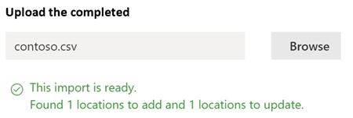

# Conectividad de red en el centro de administración de 365 de Microsoft (versión preliminar)

El centro de administración de Microsoft 365 ahora incluye métricas de conectividad de red agregadas recopiladas de su inquilino de Microsoft 365 y disponibles para que las vean solo los usuarios administrativos de su espacio empresarial.

Las **evaluaciones de red** y la información de **red** se muestran en el centro de administración de Microsoft 365 bajo **Health | Conectividad**.

Es posible que se le pida que se una a la versión preliminar pública de esta característica en nombre de su organización. La aceptación suele ocurrir inmediatamente y, a continuación, verá la página conectividad de red. 

Al navegar a la página conectividad de red, verá un panel de información general que contiene un mapa de rendimiento global de la red, una evaluación de red con ámbito en todo el espacio empresarial y una lista de problemas actuales. Para tener acceso a esta página, debe ser administrador de la organización en Microsoft 365. El rol administrativo del lector de informes tendrá acceso de lectura a esta información. Para configurar ubicaciones y otros elementos de la conectividad de red, un administrador debe formar parte de un rol de administrador de servidores como, por ejemplo, el rol de administrador de compatibilidad de servicio. Desde la introducción, puede profundizar para ver las métricas de rendimiento de red y los problemas específicos por ubicación. Para obtener más información, consulte [Network performance Overview en el centro de administración de Microsoft 365](#network-connectivity-overview-in-the-microsoft-365-admin-center).

## Requisitos previos para que aparezcan las evaluaciones de conectividad de red

Mientras que la conectividad de red puede evaluarse en toda la organización, es necesario realizar mejoras en el diseño de red para ubicaciones específicas de la oficina. Se proporciona información de conectividad de red para cada ubicación de la oficina una vez que se pueden determinar dichas ubicaciones. Hay tres opciones para obtener evaluaciones de red desde sus ubicaciones de oficina:

### 1. habilitar los servicios de ubicación de Windows

Para esta opción, debe tener al menos dos equipos en ejecución en cada ubicación de oficina que admita los requisitos previos. La versión **19,232** o superior de OneDrive para Windows debe estar instalada en cada equipo. Para obtener más información sobre las versiones de OneDrive, consulte las notas de la [versión de onedrive](https://support.office.com/article/onedrive-release-notes-845dcf18-f921-435e-bf28-4e24b95e5fc0). Se planea que las medidas de red se agreguen en otras aplicaciones cliente de Office 365 en un futuro próximo.

El servicio de ubicación de Windows debe estar Consent en los equipos. Puede probar esto ejecutando la aplicación **mapas** y buscándolo. Se puede habilitar en un único equipo con **configuración | Privacidad | Ubicación** en la que la configuración permite que las _aplicaciones tengan acceso a su ubicación_ debe estar habilitada. El consentimiento de los servicios de ubicación de Windows se puede implementar en equipos que usen MDM o la Directiva de grupo con la configuración _LetAppsAccessLocation_.

No es necesario agregar ubicaciones en el centro de administración con este método, ya que se identifican automáticamente en la resolución de la ciudad. No puede mostrar varias ubicaciones de oficina dentro de una ciudad con los servicios de ubicación de Windows. La información de ubicación también se redondea a los 300 metros más próximos por 300 metros antes de cargarse para que no sea posible acceder a la información de ubicación más precisa.

Los equipos deben tener una red Wi-Fi en lugar de un cable Ethernet. Los equipos con un cable Ethernet no tienen información precisa sobre la ubicación.

Las muestras de medidas y las ubicaciones de la oficina deberían empezar a parecer 24 horas después de que se hayan cumplido estos requisitos previos.

### 2. agregar ubicaciones y proporcionar información de subred de LAN

Para esta opción no se necesitan servicios de ubicación de Windows ni Wi-Fi. Necesita la versión **20,161** o posterior de OneDrive para Windows instalada en todos los equipos de la ubicación.

También tiene que agregar ubicaciones en la página conectividad de red del centro de administración o importarlas desde un archivo CSV. Las ubicaciones agregadas deben incluir la información de subred de la LAN de Office.

Como está agregando las ubicaciones, puede tener varias oficinas definidas en una ciudad.

Las muestras de medidas y las ubicaciones de la oficina deberían empezar a parecer 24 horas después de que se hayan cumplido estos requisitos previos.

### 3. reúna manualmente los informes de prueba con la herramienta de prueba de conectividad de red de Microsoft 365

Para esta opción, debe identificar a una persona en cada ubicación. Pídales que exploren la [prueba de conectividad de red de Microsoft 365](https://connectivity.office.com) en un equipo con Windows en el que tenga permisos de administrador. En el sitio web, es necesario que inicie sesión en su cuenta de Office 365 para la misma organización en la que desea ver los resultados. A continuación, deben hacer clic en **Ejecutar prueba**. Durante la prueba, hay un archivo EXE de prueba de conectividad descargado. También necesitan abrirlo y ejecutarlo. Una vez finalizadas las pruebas, el resultado de la prueba se carga en Office 365.

Los informes de prueba están vinculados a una ubicación si se agregaron con información de subred de LAN, de lo contrario solo se muestran en el almacén de la ciudad.

Las muestras de medidas y las ubicaciones de la oficina deberían empezar a aparecer 2-3 minutos después de que se complete un informe de prueba. Para obtener más información, vea [Microsoft 365 Network Connectivity test (Preview)](office-365-network-mac-perf-onboarding-tool.md).

## ¿Cómo puedo usar esta información?

**Network Insights**, las recomendaciones de rendimiento y las evaluaciones de red relacionadas con el mismo tienen como objetivo ayudarle a diseñar perímetros de red para sus ubicaciones de oficina. Cada conocimiento proporciona detalles sobre las características de rendimiento de un problema común específico para cada ubicación geográfica en la que los usuarios obtienen acceso a su inquilino. Las **recomendaciones de rendimiento** para cada visión de red ofrecen cambios de diseño de arquitectura de red específicos que puede realizar para mejorar la experiencia del usuario con la conectividad de red de Microsoft 365. La evaluación de la red muestra cómo la conectividad de red afecta a la experiencia del usuario, lo que permite comparar distintas conexiones de red de ubicación de usuario.

Las **evaluaciones de red** transforman una amplia variedad de métricas de rendimiento de red en una instantánea del estado de la red de la empresa, representada por un valor Points de 0-100. Las evaluaciones de red están en el ámbito de todo el inquilino y en cada ubicación geográfica desde la que los usuarios se conectan a su espacio empresarial, lo que proporciona a los administradores de Microsoft 365 una manera fácil de captar de forma instantánea un Gestalt del estado de la red de la empresa y profundizar rápidamente en un informe detallado de cualquier ubicación global de la oficina.

Las empresas complejas con varias ubicaciones de oficina y arquitecturas de perímetro de red no triviales pueden beneficiarse de esta información, ya sea durante su incorporación inicial a Microsoft 365 o para corregir los problemas de rendimiento de red detectados con el crecimiento de uso. Esto no suele ser necesario para las empresas pequeñas con Microsoft 365 o para las empresas que ya tienen conectividad de red sencilla y directa. Se espera que las empresas con más de 500 usuarios y varias ubicaciones de oficina disfruten de lo máximo.

>[!IMPORTANT]
>Información sobre la red, recomendaciones de rendimiento y evaluaciones en el centro de administración de Microsoft 365 se encuentra actualmente en estado de versión preliminar y solo está disponible para los inquilinos de Microsoft 365 que se han inscrito en el programa de vista previa de características.

## Desafíos de conectividad de red empresarial

Muchas empresas tienen configuraciones de perímetro de red que han crecido con el tiempo y están diseñadas principalmente para acomodar el acceso al sitio web de Internet de los empleados, donde la mayoría de los sitios web no se conocen de antemano y no son de confianza. El enfoque predominante y necesario evita los ataques de malware y de pesca de estos sitios web desconocidos. Esta estrategia de configuración de red, a la vez que resulta útil por motivos de seguridad, puede llevar a una degradación del rendimiento del usuario y de la experiencia del usuario de Microsoft 365.

## Cómo podemos resolver estos desafíos

Las empresas pueden mejorar la experiencia general del usuario y proteger su entorno siguiendo los [principios de conectividad de Office 365](https://aka.ms/pnc) y con la característica conectividad de red del centro de administración de Microsoft 365. En la mayoría de los casos, los siguientes principios generales tendrán un impacto positivo significativo en la latencia del usuario final, la confiabilidad del servicio y el rendimiento general de Microsoft 365.

A veces, Microsoft se le pide que investigue los problemas de rendimiento de la red con Microsoft 365 para grandes clientes empresariales, y estos suelen tener una causa raíz relacionada con la infraestructura del perímetro de red de los clientes. Cuando se encuentra una causa de raíz común de un problema con el perímetro de la red del cliente, buscamos la identificación de medidas de prueba simples que la identifiquen. Una prueba con un umbral de medida que identifica un problema específico es valiosa porque podemos probar la misma medida en cualquier ubicación, saber si esta causa es la que está presente allí y compartirla como un conocimiento de red con el administrador.

En algunos detalles de red, simplemente se indica un problema que necesita una investigación más. Un conocimiento de la red donde se tienen suficientes pruebas para mostrar una acción de corrección específica para corregir la causa raíz aparece como una **Acción recomendada**. Estas recomendaciones, basadas en las métricas activas que revelan los valores que se encuentran fuera de un umbral predeterminado, son mucho más valiosas que los consejos de prácticas recomendadas generales, ya que son específicas de su entorno y muestran la mejora real una vez que se han realizado los cambios recomendados.

## Introducción a la conectividad de red en el centro de administración de Microsoft 365

Microsoft tiene medidas de red existentes desde varios clientes Web y de escritorio de Office que admiten el funcionamiento de Microsoft 365. Estas mediciones ahora se usan para proporcionar información de diseño de arquitectura de red y una evaluación de red que se muestran en la página **conectividad de red** en el centro de administración de Microsoft 365.

De forma predeterminada, la información de ubicación aproximada asociada con las medidas de red identifica la ciudad en la que se encuentran los dispositivos cliente. La evaluación de la red en cada ubicación se muestra con color y el número relativo de usuarios en cada ubicación se representa por el tamaño del círculo.

La página de información general también muestra la evaluación de la red para el cliente como un promedio ponderado en todas las ubicaciones de la oficina.

Puede ver una vista de tabla de las ubicaciones en las que se pueden filtrar, ordenar y modificar en la ficha ubicaciones. Las ubicaciones con recomendaciones específicas también pueden incluir una posible mejora de la latencia. Se calcula al tomar la latencia media de los usuarios de la organización en la ubicación y restar la latencia mediana de todas las organizaciones de la misma ciudad.

## Información específica sobre el rendimiento y el resumen del rendimiento de red de una ubicación de Office

Al seleccionar una ubicación de la oficina se abre una página de Resumen específica de ubicación que muestra los detalles de las salidas de red que se han identificado a partir de las medidas de esa ubicación de la oficina.

Un mapa de la red perimetral para los usuarios de la organización en la ubicación se muestra con algunos o todos los elementos siguientes:

- **Ubicación** de la oficina: ubicación de la oficina de la página en la que está mirando
- **Perímetro de red** : la ubicación de la dirección IP de origen para las conexiones desde la ubicación de la oficina. Esto depende de la precisión de las bases de datos de ubicación de IP geográfica
- **Servicio óptimo de Exchange puerta frontal** -una de las puertas de las front-end recomendadas del servicio de Exchange a la que se deben conectar los usuarios de esta ubicación de la oficina
- **Exchange sub-optimal Front-Door** : puerta frontal del servicio de Exchange a la que están conectados los usuarios, pero no se recomienda.
- **Puerta delantera del servicio óptimo de SharePoint** : una de las puertas de la parte del servicio de SharePoint recomendadas que los usuarios de esta ubicación de la oficina deben conectarse
- **Puerta frontal del servicio secundario de SharePoint** : puerta frontal del servicio de SharePoint a la que están conectados los usuarios, pero no se recomienda.
- **Servidor de resolución de recursiva de DNS** : la ubicación de una base de datos IP geográfica de la resolución de nombres DNS detectada que se ha usado para Exchange Online (si está disponible)
- **Su servidor proxy** -la ubicación de una base de datos de IP geográfica del servidor proxy detectado (si está disponible) 

La página de Resumen de ubicación de oficinas muestra además la evaluación de la red de la ubicación, el historial de la evaluación de la red, una comparación de la evaluación de esta ubicación con otros clientes de la misma ciudad y una lista de información específica y recomendaciones que puede emprender para mejorar el rendimiento y la fiabilidad de la red.

Las comparaciones entre clientes en la misma ciudad se basan en la expectativa de que todos los clientes tengan el mismo acceso a los proveedores de servicios de red, la infraestructura de telecomunicaciones y los puntos cercanos de presencia de la red de Microsoft.

La pestaña detalles de la página ubicación de la oficina muestra los resultados de medidas específicos que se usaron para provenir de información, recomendaciones y la evaluación de la red. Esto se proporciona para que los ingenieros de red puedan validar las recomendaciones y el factor de las restricciones o los detalles de su entorno.

## Importación de CSV para ubicaciones de oficinas de subred de LAN

Para la identificación de la oficina de subred de LAN, debe agregar cada ubicación por adelantado. En lugar de agregar ubicaciones de oficina individuales en la ficha **ubicaciones** , puede importarlas desde un archivo CSV. Es posible que pueda obtener estos datos desde otros lugares que haya almacenado, como el panel de calidad de llamadas o los sitios y servicios de Active Directory.

En el archivo CSV, una ubicación de ciudad detectada se muestra en la columna userEntered como en blanco y una ubicación de oficina agregada manualmente se muestra como 1.

1. En la ventana principal _conectividad a Microsoft 365_ , haga clic en la pestaña **ubicaciones** .
1. Haga clic en el botón **importar** , justo encima de la lista ubicaciones. Aparecerá el control flotante **ubicaciones de importación** .

   

1. Haga clic en el vínculo **Descargar ubicaciones actuales de Office (. csv)** para exportar la lista de ubicaciones actuales a un archivo CSV y guárdelo en el disco duro local. Esto le proporcionará un archivo CSV con el formato correcto con los encabezados de columna a los que puede Agregar ubicaciones. Puede dejar las ubicaciones exportadas existentes tal como están; no se duplicarán cuando importe el CSV actualizado. Si desea cambiar la dirección de una ubicación existente, se actualizará cuando importe el archivo CSV. No puede cambiar la dirección de una ciudad descubierta.
1. Abra el archivo CSV y agregue sus ubicaciones rellenando los siguientes campos en una nueva línea para cada ubicación que desee agregar. Deje todos los demás campos en blanco; se omitirán los valores que especifique en otros campos.
   1. **userEntered** (obligatorio): debe ser 1 para una nueva ubicación de la oficina de subred de LAN.
   1. **Dirección** (obligatorio): dirección física de la oficina
   1. **Latitud** (opcional): se rellena desde mapas de Bing buscar en la dirección si está en blanco
   1. **Longitud** (opcional): se rellena desde mapas de Bing búsqueda de la dirección si está en blanco
   1. **Intervalos de direcciones IP de salida 1-5** (opcional): para cada intervalo, escriba el nombre del circuito seguido de una lista separada por espacios de direcciones CIDR IPv4 o IPv6 válidas. Estos valores se usan para diferenciar varias ubicaciones de oficina en las que se usan las mismas direcciones IP de subred de LAN.
   1. **LanIps** (obligatorio): enumerar los intervalos de subred de LAN en uso en esta ubicación de la oficina.
1. Una vez que haya agregado las ubicaciones de la oficina y guardado el archivo, haga clic en el botón **examinar** situado junto al campo **cargar el completado** y seleccione el archivo CSV guardado.
1. El archivo se validará automáticamente. Si hay errores de validación, verá un mensaje de error que indica que _hay algunos errores en el archivo de importación. Revise los errores, corrija el archivo de importación y, a continuación, vuelva a intentarlo._ Haga clic en el vínculo **abrir detalles de error** para obtener una lista de errores de validación de campo específicos.

   

1. Si no hay errores en el archivo, verá el mensaje _el informe está listo. Se han encontrado x ubicaciones para agregar y x ubicaciones que se van a actualizar._ Haga clic en el botón **importar** para cargar el archivo CSV.

   

## Preguntas frecuentes

### ¿Qué es una puerta de servicio de Microsoft 365?

La puerta de entrada del servicio 365 de Microsoft es un punto de entrada en la red global de Microsoft donde los clientes y servicios de Office terminan su conexión de red. Para obtener una conexión de red óptima a Microsoft 365, se recomienda que la conexión de red finalice con la más cercana a la puerta trasera de Microsoft 365.

>[!NOTE]
>La puerta de servicio de Microsoft 365 no tiene ninguna relación directa con el producto de servicio de puerta de Azure Front-Door disponible en Azure Marketplace.

### ¿Qué es una puerta de servicio de Microsoft 365 óptima?

Una puerta frontal de servicio Microsoft 365 óptima es la que más se aproxime a la salida de la red, generalmente en su ciudad o área metropolitana. Use la [herramienta de prueba de conectividad de 365 de Microsoft (versión preliminar)](office-365-network-mac-perf-onboarding-tool.md) para determinar la ubicación de la puerta frontal del servicio de Microsoft 365 y el servicio de puerta de servicio óptima. Si la herramienta determina que la puerta frontal en uso es óptima, se está conectando de forma óptima a la red global de Microsoft.

### ¿Qué es una ubicación de salida de Internet?

La ubicación de salida de Internet es la ubicación en la que el tráfico de red sale de la red de la empresa y se conecta a Internet. También se identifica como la ubicación en la que tiene un dispositivo de traducción de direcciones de red (NAT) y normalmente donde se conecta con un proveedor de servicios de Internet (ISP). Si ve una larga distancia entre su ubicación y la ubicación de salida de Internet, esto puede indicar una backhaul? a WAN importante.

## Temas relacionados

[Información de la red de 365 de Microsoft (versión preliminar)](office-365-network-mac-perf-insights.md)

[Evaluación de red de Microsoft 365 (versión preliminar)](office-365-network-mac-perf-score.md)

[Herramienta de prueba de conectividad de Microsoft 365 (versión preliminar)](office-365-network-mac-perf-onboarding-tool.md)

[Servicios de ubicación de conectividad de red 365 de Microsoft (versión preliminar)](office-365-network-mac-location-services.md)
