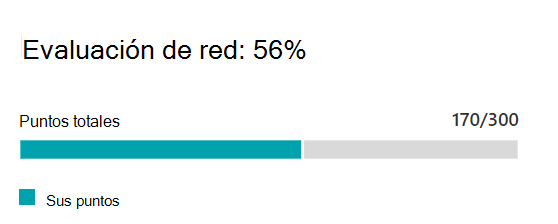

# Evaluación de red de Microsoft 365 (versión preliminar)

En la conectividad de red del centro de administración de 365 de Microsoft, las **evaluaciones de red** transforman una amplia variedad de métricas de rendimiento de red en una instantánea del estado del perímetro de la red de la empresa, representada por un valor Points de 0-100. Una evaluación de la red indica el grado en que el diseño de red responsable del cliente está afectando A la experiencia del usuario de Office 365. Las evaluaciones de red están en el ámbito de todo el inquilino y en cada ubicación geográfica desde la que los usuarios se conectan a su espacio empresarial, lo que proporciona a los administradores de Microsoft 365 una manera fácil de captar de forma instantánea un Gestalt del estado de la red de la empresa y profundizar rápidamente en un informe detallado de cualquier ubicación global de la oficina.

El valor de puntos de evaluación de red es una media de latencia TCP, una velocidad de descarga y métricas de calidad de conexión UDP compiladas una vez al día. Las métricas de rendimiento para las redes que son propiedad de Microsoft se excluyen de estas medidas para garantizar que los resultados de la evaluación sean inequívocos y específicos de la red corporativa.

Un valor muy bajo de evaluación de la red sugiere que los clientes de Microsoft 365 tendrán problemas importantes para conectarse al inquilino o mantener una experiencia de usuario con capacidad de respuesta, mientras que un valor alto indica una red configurada correctamente con pocos problemas de rendimiento continuos. Un valor de 80% representa una línea de base sana en la que no debería esperar recibir quejas de los usuarios habituales sobre la conectividad de Microsoft 365 o la capacidad de respuesta debido al rendimiento de la red. A medida que se realizan mejoras de conectividad de red reiterativas, este valor aumentará junto con la experiencia del usuario.

| Evaluación de la red | Experiencia de usuario esperada |
| :----------------- | :----------------------- |
| 100                | Procedimientos                     |
| 80                 | Cumple con las recomendaciones    |
| 60                 | Aceptable               |
| 40                 | Los usuarios pueden experimentar problemas |
| 20                 | Los usuarios pueden quejarse       |
| comprendi                  | Problemas de red un tema común de discusión |

>[!IMPORTANT]
>Información sobre la red, recomendaciones de rendimiento y evaluaciones en el centro de administración de Microsoft 365 se encuentra actualmente en estado de versión preliminar y solo está disponible para los inquilinos de Microsoft 365 que se han inscrito en el programa de vista previa de características.

## Panel evaluación de red

Cada evaluación de la red, ya sea en el ámbito del inquilino o en una ubicación específica de la oficina, muestra un panel con detalles sobre la evaluación. Este panel muestra un gráfico de barras de la evaluación como un porcentaje y como los puntos totales para cada carga de trabajo de componente, incluidas solo cargas de trabajo en las que se recibieron datos de medición. Para una evaluación de red de ubicación de oficina, también se muestra una comparación con el porcentaje de clientes de Microsoft 365 en cada uno de los cinco Quintiles que han notificado datos en la misma ciudad que la ubicación de la oficina.

El **desglose** de la evaluación en el panel muestra la evaluación de cada una de las cargas de trabajo de componentes.

El **historial** de la evaluación muestra los últimos 30 días de la evaluación y el Banco de pruebas. También puede informar sobre el historial de métricas de cualquier ubicación de la oficina durante un máximo de dos años mediante la ficha historial. La ficha historial permite seleccionar los atributos para informar sobre ellos y elegir un período de tiempo del informe puede resaltar el impacto de un proyecto de actualización de red y ver la mejora de la evaluación de la red.

## Evaluaciones de red de inquilinos y evaluaciones de red de ubicación de oficina

Una evaluación de la red mide el diseño del perímetro de la red de una ubicación de la oficina a la red de Microsoft. Las mejoras en el perímetro de la red se realizan mejor en cada ubicación de la oficina.

Se muestra un valor de evaluación de red para todo el espacio empresarial de Microsoft 365 en la página información general de rendimiento de red, que es un promedio ponderado de las evaluaciones de red para todas las ubicaciones de oficina. También hay un valor de evaluación de red específico para cada ubicación de la oficina detectada en la página de Resumen de esa ubicación.

## Exchange en línea

Para Exchange Online se mide la latencia TCP desde el equipo cliente al servicio de Exchange de la puerta frontal. Esto puede verse afectado por la distancia que la red viaja a través de la LAN y la WAN de los clientes. También puede verse afectado por servicios o dispositivos intermedios de red que retrasn la conectividad o provocan la reenvío de paquetes. Y se ve afectada por la distancia de la puerta frontal del servicio de Exchange más cercana. La mediana (también denominada percentil 50 o P50) se realiza para todas las medidas en los tres días anteriores.

La evaluación de Exchange Online se realiza mediante la tabla siguiente. Cualquier número de latencia TCP entre los umbrales se asignan puntos de forma lineal dentro de la banda.

| Latencia TCP   | Points |
| :------------ | :----- |
| 10 ms o menos  | 100    |
| 25ms          | 80     |
| 100 ms         | 60     |
| 200ms         | 40     |
| 300ms         | 20     |
| 350ms o más | comprendi      |

## SharePoint Online

Para SharePoint Online, se mide la velocidad de descarga disponible para que un usuario tenga acceso a un documento desde SharePoint o OneDrive. Esto puede verse afectado por el ancho de banda disponible en los circuitos de red entre el equipo cliente y la red de Microsoft. También suele afectar a la congestión de la red que existe en los cuellos de botella en dispositivos de red complejos o en áreas de Wi-Fi de mala cobertura. La velocidad de descarga se mide en megabytes por segundo, que es aproximadamente una décima parte de los circuitos clasificados en megabits por segundo. La unidad de MegaByte por segundo es útil porque puede ver directamente el tamaño que puede descargar el archivo en 1 segundo. El percentil 25 (también conocido como medida P25) se realiza para todas las medidas en los tres días anteriores. Este percentil 25 ayuda a reducir el impacto de la congestión variable a lo largo del tiempo.

La evaluación de SharePoint Online se realiza mediante la tabla siguiente. Cualquier número de velocidad de descarga entre los umbrales se asignan puntos de forma lineal en la banda.

| Velocidad de descarga | Points |
| :------------- | :----- |
| 20MBps o más | 100    |
| 14MBps         | 80     |
| 8MBps          | 60     |
| 4MBps          | 40     |
| 2          | 20     |
| 0MBps          | comprendi      |

## Microsoft Teams

Para Microsoft Teams, la calidad de la red se mide como latencia UDP, vibración UDP y pérdida de paquetes UDP. UDP se usa para la conectividad de medios de audio y vídeo de conferencias y llamadas de Microsoft Teams. Esto se puede ver afectado por los mismos factores que para la latencia y la velocidad de descarga, además de las brechas de conectividad en la compatibilidad con UDP de una red, ya que UDP se configura por separado en el protocolo TCP más común. La mediana (también denominada percentil 50 o P50) se realiza para todas las medidas en los tres días anteriores. 

Se calcula una puntuación de opinión media a partir de estas mediciones UDP para una escala de una a cinco. A continuación, lo asignamos a la escala de 0-100 puntos para la evaluación de la red de Microsoft Teams.  La buena general es más de 87,5 puntos y el malo general está por debajo de 50 puntos.

## Temas relacionados

[Conectividad de red en el centro de administración de 365 de Microsoft (versión preliminar)](office-365-network-mac-perf-overview.md)

[Microsoft 365 Network performance Insight (versión preliminar)](office-365-network-mac-perf-insights.md)

[Herramienta de prueba de conectividad de red 365 de Microsoft (versión preliminar)](office-365-network-mac-perf-onboarding-tool.md)

[Servicios de ubicación de conectividad de red 365 de Microsoft (versión preliminar)](office-365-network-mac-location-services.md)
