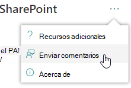
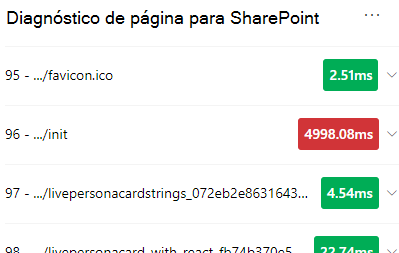
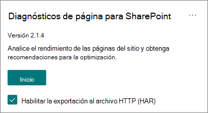
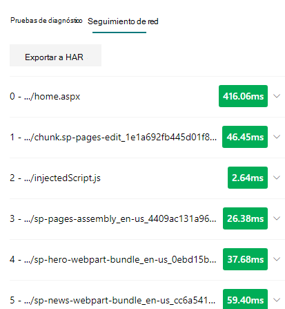

# Usar la herramienta Diagnóstico de página para SharePoint

En este artículo se describe cómo usar la herramienta Diagnóstico de página para SharePoint para analizar las páginas de sitio modernas y **clásicas** de SharePoint Online con un conjunto predefinido de criterios de rendimiento.

La herramienta Diagnóstico de página para SharePoint se puede instalar para:

- **Microsoft Edge** [(extensión perimetral)](https://microsoftedge.microsoft.com/addons/detail/ocemkolpnamjcacndljdfmhlpcaoipji)
- **Chrome** [(extensión de Chrome)](https://chrome.google.com/webstore/detail/inahogkhlkbkjkkaleonemeijihmfagi)

>[!TIP]
>La **versión 2.0.0 y posteriores** incluye compatibilidad con páginas modernas además de páginas de sitio clásicas. Si no está seguro de qué versión de la  herramienta está usando, puede seleccionar el vínculo Acerca de o los puntos suspensivos (...) para comprobar la versión. **Actualiza siempre a la versión más reciente** al usar la herramienta.

La herramienta de Diagnóstico de páginas para SharePoint es una extensión de explorador para los nuevos exploradores de Microsoft Edge (https://www.microsoft.com/edge) y Chrome que analiza las páginas del sitio de publicación clásicas y las modernas del portal de SharePoint Online. Esta herramienta solo funciona para SharePoint Online y no se puede usar en una página del sistema de SharePoint.

La herramienta genera un informe para cada página analizada que muestra el rendimiento de la página con un conjunto predefinido de reglas y muestra información detallada cuando los resultados de una prueba están fuera del valor de línea base. Los administradores y diseñadores de SharePoint Online pueden usar la herramienta para solucionar problemas de rendimiento y asegurarse de que las páginas nuevas estén optimizadas antes de la publicación.

La herramienta Diagnóstico de página está diseñada para analizar solo páginas de sitio de SharePoint, no páginas del sistema como *allitems.aspx* o *sharepoint.aspx*. Si intenta ejecutar la herramienta en una página del sistema o en cualquier otra página que no sea de sitio, recibirá un mensaje de error que le aconseja que la herramienta no se puede ejecutar para ese tipo de página.

> [!div class="mx-imgBorder"]
> 

No se trata de un error en la herramienta, ya que no hay ningún valor en la evaluación de bibliotecas o páginas del sistema. Vaya a una página de sitio de SharePoint para usar la herramienta. Si este error se produce en una página de SharePoint, compruebe la página maestra para asegurarse de que no se han quitado las etiquetas meta de SharePoint.

Para proporcionar comentarios sobre la herramienta, seleccione los puntos suspensivos en la esquina superior derecha de la herramienta y, a continuación, [seleccione Dar comentarios](https://go.microsoft.com/fwlink/?linkid=874109).

> [!div class="mx-imgBorder"]
> 
  
## Instalar la herramienta Diagnóstico de página para SharePoint

El procedimiento de instalación de esta sección funcionará para los exploradores Chrome y Microsoft Edge.

> [!IMPORTANT]
> Microsoft no lee los datos ni el contenido de la página que analiza la herramienta Diagnósticos de página para SharePoint y no capturamos información personal, sitio web ni información de descarga. La única información identificable registrada en Microsoft por la herramienta es el nombre del inquilino, los recuentos de reglas que han fallado y la fecha y hora en que se ha ejecutado la herramienta. Microsoft usa esta información para comprender mejor las tendencias de uso de sitios de publicación y portales modernos y los problemas comunes de rendimiento.

1. Instale la herramienta Diagnóstico de página para SharePoint **para Microsoft Edge** [(extensión perimetral)](https://microsoftedge.microsoft.com/addons/detail/ocemkolpnamjcacndljdfmhlpcaoipji) **o Chrome** [(extensión de Chrome).](https://chrome.google.com/webstore/detail/inahogkhlkbkjkkaleonemeijihmfagi) Revisa la Directiva de privacidad del usuario que se proporciona en la página de descripción de la tienda. Al agregar la herramienta al explorador, verá el siguiente aviso de permisos.

    > [!div class="mx-imgBorder"]
    > 

    Este aviso está en su lugar porque una página puede contener contenido de ubicaciones fuera de SharePoint en función de los elementos web y personalizaciones de la página. Esto significa que la herramienta leerá las solicitudes y respuestas cuando se haga clic en el botón inicio y solo para la pestaña activa de SharePoint donde se ejecuta la herramienta. Esta información la captura localmente el explorador web y está disponible a través del botón  Exportar a **JSON** o Exportar a **HAR** en la pestaña Seguimiento de red de la herramienta. Microsoft no envía ni captura la **información.** (La herramienta respeta la directiva de privacidad de Microsoft accesible [aquí).)](https://go.microsoft.com/fwlink/p/?linkid=857875)

    El _permiso Administrar las descargas_ abarca el uso de la funcionalidad Exportar a JSON de **la** herramienta. Siga las directrices de privacidad de su empresa antes de compartir el archivo JSON fuera de su organización, ya que los resultados contienen direcciones URL y se pueden clasificar como PII (Información de identificación personal).
1. Si quieres usar la herramienta en modo Incognito o InPrivate, sigue el procedimiento para el explorador:
    1. En Microsoft Edge, vaya a **Extensiones** o _escriba edge://extensions_ en la barra de direcciones URL y seleccione **Detalles** para la extensión. En la configuración de extensión, active la casilla **permitir en InPrivate**.
    1. En Chrome, vaya a **Extensiones** o escriba _chrome://extensions_ en la barra url y seleccione **Detalles** para la extensión. En la configuración de extensión, seleccione el control deslizante para **permitir en Incognito**.
1. Vaya a la página del sitio de SharePoint en SharePoint Online que le gustaría revisar. Hemos permitido "retrasar la carga" de elementos en las páginas; por lo tanto, la herramienta no se detendrá automáticamente (esto es por diseño para dar cabida a todos los escenarios de carga de página). Para detener la colección, seleccione **Detener**. Asegúrese de que la carga de página se haya completado antes de detener la recopilación de datos o de que solo capturará un seguimiento parcial.
1. Haga clic en el botón de la barra de herramientas de la extensión  para cargar la herramienta y se le mostrará la siguiente ventana emergente de extensión:

    

Seleccione **Inicio para** empezar a recopilar datos para su análisis.

## Lo que verá en la herramienta Diagnóstico de página para SharePoint

1. Haga clic en los puntos suspensivos (...) en la esquina superior derecha de la herramienta para buscar los vínculos siguientes:
   1. El **vínculo Recursos adicionales** proporciona instrucciones generales y detalles sobre la herramienta, incluido un vínculo a este artículo.
   1. El **vínculo Enviar comentarios** proporciona un vínculo al sitio sitios de _SharePoint y al sitio de voz del usuario de colaboración._
   1. El **vínculo** Acerca de incluye la versión instalada actualmente de la herramienta y un vínculo directo al aviso de terceros de la herramienta.  
1. El **identificador de correlación, SPRequestDuration, SPIISLatency,** **el** tiempo de carga de página y los detalles de la **dirección URL** son informativos y se pueden usar para algunos fines.

    > [!div class="mx-imgBorder"]
    > 

   - **CorrelationID** es un elemento importante al trabajar con el soporte técnico de Microsoft, ya que les permite recopilar datos de diagnóstico adicionales para la página específica.
   - **SPRequestDuration** es el tiempo que SharePoint necesita para procesar la página. La navegación estructural, las imágenes grandes y muchas llamadas API podrían contribuir a duraciones más largas.
   - **SPIISLatency es** el tiempo en milisegundos que se toma para SharePoint Online empezar a cargar la página. Este valor no incluye el tiempo necesario para que la aplicación web responda.
   - **El tiempo de carga de** página es el tiempo total registrado por la página desde el momento de la solicitud hasta el momento en que se recibió y representó la respuesta en el explorador. Este valor se ve afectado por diversos factores, como la latencia de red, el rendimiento del equipo y el tiempo que tarda el explorador en cargar la página.
   - La **dirección URL de página** (localizador uniforme de recursos) es la dirección web de la página actual.

1. La [**pestaña Pruebas de**](#how-to-use-the-diagnostic-tests-tab) diagnóstico muestra los resultados del análisis en tres categorías; **No se requiere ninguna acción,** **se requieren oportunidades de mejora** y **atención**. Cada resultado de la prueba se representa mediante un elemento en una de estas categorías, tal como se describe en la tabla siguiente:

    |Categoría  |Color  |Descripción  |
    |---------|---------|---------|
    |**Atención necesaria** |Rojo |El resultado de la prueba está fuera del valor de línea base y está afectando al rendimiento de la página. Siga las instrucciones de corrección.|
    |**Oportunidades de mejora** |Amarillo |El resultado de la prueba está fuera del valor de línea base y podría contribuir a problemas de rendimiento. Pueden aplicarse criterios específicos de la prueba.|
    |**No se requiere ninguna acción.** |Verde |El resultado de la prueba se encuentra dentro del valor de línea base de la prueba.|

    > [!div class="mx-imgBorder"]
    > 

1. Una [**pestaña Seguimiento de**](#how-to-use-the-network-trace-tab-and-how-to-export-a-har-file) red proporciona detalles sobre las solicitudes de compilación de páginas y las respuestas.

## Cómo usar la pestaña Pruebas de diagnóstico

Al analizar una página del portal moderno de SharePoint o una página de sitio de publicación clásica con la herramienta Diagnóstico de página  para SharePoint, los resultados se analizan mediante reglas predefinidas que comparan los resultados con los valores de línea base y se muestran en la pestaña Pruebas de diagnóstico. Las reglas para determinadas pruebas pueden usar valores de línea base diferentes para sitios de publicación clásicos y portales modernos, en función de la diferencia entre las características de rendimiento específicas entre los dos.

Los resultados de las pruebas que aparecen en las categorías Oportunidades de mejora o Atención requerida indican áreas que deben revisarse en función de las prácticas **recomendadas** y se pueden seleccionar para mostrar información adicional sobre el resultado.  Los detalles de cada elemento incluyen un vínculo _Más_ información que le llevará directamente a la guía adecuada relacionada con la prueba. Los resultados de las pruebas que aparecen en la categoría **Sin** acción requerida indican el cumplimiento de la regla relevante y no muestran detalles adicionales cuando se seleccionan.

La información de la pestaña Pruebas de diagnóstico no le dirá cómo diseñar páginas, pero resaltará factores que pueden afectar al rendimiento de la página. Algunas personalizaciones y funciones de página tienen un impacto inevitable en el rendimiento de la página y deben revisarse en busca de posibles correcciones u omisión de la página si su impacto es considerable.

Los resultados rojos o amarillos también pueden indicar elementos web que actualizan datos con demasiada frecuencia. Por ejemplo, las noticias corporativas no se actualizan cada segundo, pero los elementos web personalizados suelen crearse para capturar las últimas noticias cada segundo en lugar de implementar elementos de almacenamiento en caché que podrían mejorar la experiencia general del usuario. Tenga en cuenta al incluir elementos web en una página que a menudo hay formas sencillas de reducir su impacto en el rendimiento evaluando el valor de cada parámetro disponible para asegurarse de que se establece correctamente para su propósito.

>[!NOTE]
>Los sitios de grupo clásicos que no tienen habilitada la característica de publicación no pueden usar cdnes. Al ejecutar la herramienta en estos sitios, se espera que la prueba de CDN falle y se pueda omitir, pero todas las pruebas restantes son aplicables. La funcionalidad adicional de la característica de publicación de SharePoint puede aumentar los tiempos de carga de página, por lo que no debe habilitarse solo para permitir la funcionalidad de la red CDN.

>[!IMPORTANT]
>Las reglas de prueba se agregan y actualizan regularmente, por lo que consulte la versión más reciente de la herramienta para obtener más información sobre las reglas actuales y la información específica incluida en los resultados de la prueba. Puede comprobar la versión administrando las extensiones y la extensión le informará si hay disponible una actualización.

## Cómo usar la pestaña Seguimiento de red y cómo exportar un archivo HAR

La **pestaña Seguimiento de** red proporciona información detallada sobre ambas solicitudes para crear la página y las respuestas recibidas desde SharePoint.

1. **Busque los tiempos de carga de elementos marcados como rojos.** Cada solicitud y respuesta está codificada en color para indicar su impacto en el rendimiento general de la página mediante las siguientes métricas de latencia:
    - Verde: \< 500 ms
    - Amarillo: 500-1000 ms
    - Rojo: \> 1000 ms

    > [!div class="mx-imgBorder"]
    > 

    En la imagen anterior, el elemento rojo pertenece a la página predeterminada. Siempre se mostrará en rojo a menos que la página se cargue en \< 1000 ms (menos de 1 segundo).

2. **Tiempos de carga de elementos de prueba.** En algunos casos no habrá ningún indicador de hora o color porque el explorador ya ha almacenado en caché los elementos. Para probar esto correctamente, abra la página,  desactive la caché del explorador y, a continuación, haga clic en Inicio, ya que eso forzará una carga de página "en frío" y será un verdadero reflejo de la carga inicial de la página. A continuación, debe compararse con la carga de página "templada", ya que también ayudará a determinar qué elementos se almacenan en caché en la página.

3. **Compartir detalles relevantes con otras personas que puedan ayudar a investigar problemas**. Para compartir los detalles o la información proporcionada en la herramienta con los desarrolladores o una persona de soporte técnico, el método recomendado es habilitar la exportación a **HTTP Archive (HAR).** 

   > [!div class="mx-imgBorder"]
   > 

Debe habilitarse antes de hacer clic en Inicio, que habilitará el modo de depuración en el explorador. Generará un archivo de archivo HTTP (HAR) al que se puede acceder a través de la pestaña "Seguimiento de red". Haga clic en el botón "Exportar a HAR" y descargará el archivo en el equipo y, a continuación, podrá compartirlo en consecuencia. El archivo se puede abrir en una variedad de herramientas de depuración, como F12 Developer Tools y Fiddler.

> [!div class="mx-imgBorder"]
> 

> [!IMPORTANT]
> Estos resultados contienen direcciones URL y se pueden clasificar como PII (Información de identificación personal). Asegúrese de seguir las directrices de su organización antes de distribuir esa información.

## Interactuar con el soporte técnico de Microsoft

Hemos incluido una característica de **nivel de soporte** técnico de Microsoft que solo debe usarse al trabajar directamente en un caso de soporte técnico. El uso de esta característica no le proporcionará ninguna ventaja cuando se usa sin la participación del equipo de soporte técnico y puede hacer que la página realice un rendimiento significativamente más lento. No hay información adicional al usar esta característica en la herramienta, ya que la información adicional se agrega al registro en el servicio.

No hay ningún cambio visible, excepto que se le notificará que lo ha habilitado y que el rendimiento de la página se degradará significativamente entre 2 y 3 veces más lento mientras está habilitado. Solo será relevante para la página en particular y para la sesión activa. Por este motivo, esto debe usarse con moderación y solo cuando esté activamente implicado con soporte técnico.

### Para habilitar la característica de nivel de soporte técnico de Microsoft

1. Abra la herramienta Diagnóstico de página para SharePoint.
2. En el teclado, presione **ALT-Shift-L**. Se mostrará la casilla **Habilitar registro de** soporte técnico.
3. Active la casilla y, a continuación, haga clic en **Inicio** para volver a cargar la página y generar un registro detallado.

   > [!div class="mx-imgBorder"]
   > 
  
    Debe tener en cuenta correlationID (que se muestra en la parte superior de la herramienta) y proporcionarlo al representante de soporte técnico para que pueda recopilar información adicional acerca de la sesión de diagnóstico.

## Temas relacionados

[Ajustar el rendimiento de SharePoint Online](tune-sharepoint-online-performance.md)

[Ajustar el rendimiento de Office 365](tune-microsoft-365-performance.md)

[Rendimiento en la experiencia moderna de SharePoint](/sharepoint/modern-experience-performance)

[Redes de entrega de contenido](content-delivery-networks.md)

[Uso de la red de entrega de contenido (CDN) de Office 365 con SharePoint Online](use-microsoft-365-cdn-with-spo.md)