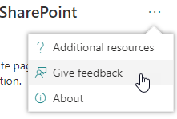

# Uso de la herramienta Diagnóstico de páginas para SharePoint

En este artículo se describe cómo usar la **herramienta Diagnóstico de páginas para SharePoint** para analizar páginas de sitio modernas y clásicas de SharePoint Online con un conjunto predefinido de criterios de rendimiento.

La herramienta Diagnósticos de página para SharePoint se puede instalar para:

- **Microsoft Edge** [(extensión Edge)](https://microsoftedge.microsoft.com/addons/detail/ocemkolpnamjcacndljdfmhlpcaoipji)
- **Chrome** [(extensión de Chrome)](https://chrome.google.com/webstore/detail/inahogkhlkbkjkkaleonemeijihmfagi)

>[!TIP]
>La versión **2.0.0** y posteriores incluye compatibilidad con páginas modernas, además de páginas de sitio clásicas. Si no está seguro de qué versión de la herramienta está usando, puede seleccionar el vínculo **Acerca** de o los puntos suspensivos (...) para comprobar la versión. **Actualice siempre a la versión más reciente** cuando use la herramienta.

La herramienta de Diagnóstico de páginas para SharePoint es una extensión de explorador para los nuevos exploradores de Microsoft Edge (https://www.microsoft.com/edge) y Chrome que analiza las páginas del sitio de publicación clásicas y las modernas del portal de SharePoint Online. Esta herramienta solo funciona para SharePoint Online y no se puede usar en una página del sistema de SharePoint.

La herramienta genera un informe para cada página analizada que muestra cómo funciona la página con un conjunto predefinido de reglas y muestra información detallada cuando los resultados de una prueba quedan fuera del valor de línea base. Los administradores y diseñadores de SharePoint Online pueden usar la herramienta para solucionar problemas de rendimiento y asegurarse de que las páginas nuevas están optimizadas antes de la publicación.

La herramienta Diagnóstico de páginas está diseñada para analizar solo páginas de sitio de SharePoint, no páginas del sistema como *allitems.aspx* o *sharepoint.aspx*. Si intenta ejecutar la herramienta en una página del sistema o en cualquier otra página que no sea de sitio, recibirá un mensaje de error que le avisa de que la herramienta no se puede ejecutar para ese tipo de página.

> [!div class="mx-imgBorder"]
> 

Esto no es un error en la herramienta, ya que no hay ningún valor en la evaluación de bibliotecas o páginas del sistema. Vaya a una página de sitio de SharePoint para usar la herramienta. Si este error se produce en una página de SharePoint, compruebe la página maestra para asegurarse de que no se han quitado las metatags de SharePoint.

Para proporcionar comentarios sobre la herramienta, seleccione los puntos suspensivos en la esquina superior derecha de la herramienta y, a continuación, seleccione **Dar comentarios**.

> [!div class="mx-imgBorder"]
> 
  
## Instalación de la herramienta Diagnósticos de página para SharePoint

El procedimiento de instalación de esta sección funcionará para los exploradores Chrome y Microsoft Edge.

> [!IMPORTANT]
> Microsoft no lee los datos ni el contenido de la página que analiza la herramienta Diagnóstico de páginas para SharePoint y no capturamos ninguna información personal, sitio web o información de descarga. La única información identificable registrada en Microsoft por la herramienta es el nombre del inquilino, los recuentos de reglas que han producido errores y la fecha y hora en que se ejecutó la herramienta. Microsoft usa esta información para comprender mejor las tendencias de uso del sitio de publicación y el portal moderno y los problemas comunes de rendimiento.

1. Instale la herramienta Diagnósticos de página para SharePoint para **Microsoft Edge** [(extensión edge)](https://microsoftedge.microsoft.com/addons/detail/ocemkolpnamjcacndljdfmhlpcaoipji) o **Chrome** [(extensión de Chrome).](https://chrome.google.com/webstore/detail/inahogkhlkbkjkkaleonemeijihmfagi) Revise la directiva de privacidad de usuario proporcionada en la página de descripción de la tienda. Al agregar la herramienta al explorador, verá el siguiente aviso de permisos.

    > [!div class="mx-imgBorder"]
    > 

    Este aviso está implementado porque una página puede contener contenido de ubicaciones fuera de SharePoint en función de los elementos web y las personalizaciones de la página. Esto significa que la herramienta leerá las solicitudes y respuestas cuando se haga clic en el botón de inicio y solo para la pestaña de SharePoint activa donde se ejecuta la herramienta. Esta información la captura localmente el explorador web y está disponible a través del botón **Exportar a JSON** o **Exportar a HAR** de la pestaña _Seguimiento_ de red de la herramienta. **Microsoft no envía ni captura la información.** (La herramienta respeta la directiva de privacidad de Microsoft accesible [aquí](https://go.microsoft.com/fwlink/p/?linkid=857875)).

    El permiso _Administrar las descargas_ cubre el uso de la funcionalidad **Exportar a JSON** de la herramienta. Siga las propias directrices de privacidad de su empresa antes de compartir el archivo JSON fuera de su organización, ya que los resultados contienen direcciones URL y que se pueden clasificar como PII (Información de identificación personal).
1. Si desea usar la herramienta en el modo Incognito o InPrivate, siga el procedimiento del explorador:
    1. En Microsoft Edge, vaya a **Extensiones** o escriba _edge://extensions_ en la barra de direcciones URL y seleccione **Detalles** para la extensión. En la configuración de la extensión, active la casilla **permitir en InPrivate**.
    1. En Chrome, vaya a **Extensiones** o escriba _chrome://extensions_ en la barra de direcciones URL y seleccione **Detalles** para la extensión. En la configuración de la extensión, seleccione el control deslizante para **permitir en Incógnito**.
1. Vaya a la página del sitio de SharePoint en SharePoint Online que desea revisar. Hemos permitido "retrasar la carga" de elementos en las páginas; por lo tanto, la herramienta no se detendrá automáticamente (esto es por diseño para dar cabida a todos los escenarios de carga de página). Para detener la recopilación, seleccione **Detener**. Asegúrese de que la carga de página se ha completado antes de detener la recopilación de datos o solo capturará un seguimiento parcial.
1. Haga clic en el botón de la barra de herramientas de la extensión.  para cargar la herramienta y se le presentará la siguiente ventana emergente de extensión:

    

Seleccione **Iniciar** para empezar a recopilar datos para su análisis.

## Lo que verá en la herramienta Diagnóstico de página para SharePoint

1. Haga clic en los puntos suspensivos (...) en la esquina superior derecha de la herramienta para buscar los vínculos siguientes:
   1. El vínculo **Recursos adicionales** proporciona instrucciones generales y detalles sobre la herramienta, incluido un vínculo a este artículo.
   1. El vínculo **Dar comentarios** proporciona un vínculo al sitio _De voz de usuario de colaboración y sitios de SharePoint_ .
   1. El vínculo **Acerca** de incluye la versión instalada actualmente de la herramienta y un vínculo directo al aviso de terceros de la herramienta.  
1. El **identificador de correlación, SPRequestDuration, SPIISLatency**, **el tiempo de carga de la página** y los detalles de **la dirección URL** son informativos y se pueden usar con algunos fines.

    > [!div class="mx-imgBorder"]
    > 

   - **CorrelationID** es un elemento importante al trabajar con soporte técnico de Microsoft, ya que les permite recopilar más datos de diagnóstico para la página específica.
   - **SPRequestDuration** es el tiempo necesario para que SharePoint procese la página. La navegación estructural, imágenes grandes, muchas llamadas API podrían contribuir a duraciones más largas.
   - **SPIISLatency** es el tiempo en milisegundos que tarda SharePoint Online en empezar a cargar la página. Este valor no incluye el tiempo necesario para que la aplicación web responda.
   - **El tiempo de carga** de página es el tiempo total registrado por la página desde el momento de la solicitud hasta el momento en que se recibió y representó la respuesta en el explorador. Este valor se ve afectado por varios factores, como la latencia de red, el rendimiento del equipo y el tiempo que tarda el explorador en cargar la página.
   - La **dirección URL de página** (localizador uniforme de recursos) es la dirección web de la página actual.

1. La pestaña [**Pruebas de diagnóstico**](#how-to-use-the-diagnostic-tests-tab) muestra los resultados del análisis en tres categorías; **No se requiere ninguna acción**, **se requieren oportunidades de mejora** y **atención**. Cada resultado de la prueba se representa mediante un elemento de una de estas categorías, como se describe en la tabla siguiente:

    |Categoría  |Color  |Descripción  |
    |---------|---------|---------|
    |**Atención requerida** |Rojo |El resultado de la prueba está fuera del valor de línea base y afecta al rendimiento de la página. Siga las instrucciones de corrección.|
    |**Oportunidades de mejora** |Amarillo |El resultado de la prueba está fuera del valor de línea base y podría estar contribuyendo a problemas de rendimiento. Se pueden aplicar criterios específicos de prueba.|
    |**No se requiere ninguna acción.** |Verde |El resultado de la prueba se encuentra dentro del valor de línea base de la prueba.|

    > [!div class="mx-imgBorder"]
    > 

1. Una pestaña [**Seguimiento de red**](#how-to-use-the-network-trace-tab-and-how-to-export-a-har-file) proporciona detalles sobre las solicitudes y respuestas de compilación de páginas.

## Uso de la pestaña Pruebas de diagnóstico

Al analizar una página del portal moderno de SharePoint o una página de sitio de publicación clásica con la herramienta Diagnóstico de páginas para SharePoint, los resultados se analizan mediante reglas predefinidas que comparan los resultados con los valores de línea base y se muestran en la pestaña **Pruebas de diagnóstico** . Las reglas de determinadas pruebas pueden usar valores de línea base diferentes para portales modernos y sitios de publicación clásicos en función de la diferencia entre las características de rendimiento específicas.

Los resultados de las pruebas que aparecen en las categorías **Oportunidades de mejora** o **Atención requerida** indican áreas que se deben revisar con respecto a las prácticas recomendadas y se pueden seleccionar para mostrar información adicional sobre el resultado. Los detalles de cada elemento incluyen un vínculo _Más información_ , que le llevará directamente a las instrucciones adecuadas relacionadas con la prueba. Los resultados de la prueba que aparecen en la categoría **Sin acción necesaria** indican el cumplimiento con la regla pertinente y no muestran detalles adicionales cuando se seleccionan.

La información de la pestaña Pruebas de diagnóstico no le indicará cómo diseñar páginas, pero resaltará los factores que pueden afectar al rendimiento de las páginas. Algunas personalizaciones y funcionalidades de página tienen un impacto inevitable en el rendimiento de la página y se deben revisar para detectar posibles correcciones u omisiones de la página si su impacto es sustancial.

Los resultados rojos o amarillos también pueden indicar elementos web que actualizan los datos con demasiada frecuencia. Por ejemplo, las noticias corporativas no se actualizan cada segundo, pero los elementos web personalizados a menudo se crean para capturar las últimas noticias cada segundo en lugar de implementar elementos de almacenamiento en caché que podrían mejorar la experiencia general del usuario. Tenga en cuenta al incluir elementos web en una página que a menudo hay formas sencillas de reducir su impacto en el rendimiento mediante la evaluación del valor de cada parámetro disponible para asegurarse de que se establece correctamente para su propósito previsto.

>[!NOTE]
>Los sitios de equipo clásicos que no tienen habilitada la característica de publicación no pueden usar redes CDN. Al ejecutar la herramienta en estos sitios, se espera que se produzca un error en la prueba de red CDN y se pueda omitir, pero todas las pruebas restantes son aplicables. La funcionalidad adicional de la característica de publicación de SharePoint puede aumentar los tiempos de carga de página, por lo que no debe habilitarse solo para permitir la funcionalidad de red CDN.

>[!IMPORTANT]
>Las reglas de prueba se agregan y actualizan con regularidad, por lo que consulte la versión más reciente de la herramienta para obtener más información sobre las reglas actuales y la información específica incluida en los resultados de la prueba. Puede comprobar la versión administrando las extensiones y la extensión le indicará si hay una actualización disponible.

## Cómo usar la pestaña Seguimiento de red y cómo exportar un archivo HAR

La pestaña **Seguimiento de red** proporciona información detallada sobre las solicitudes para compilar la página y las respuestas recibidas de SharePoint.

1. **Busque tiempos de carga de elementos marcados como rojos**. Cada solicitud y respuesta está codificada en color para indicar su impacto en el rendimiento general de la página mediante las siguientes métricas de latencia:
    - Verde: \< 500 ms
    - Amarillo: 500-1000 ms
    - Rojo: \> 1000 ms

    > [!div class="mx-imgBorder"]
    > 

    En la imagen mostrada anteriormente, el elemento rojo pertenece a la página predeterminada. Siempre se mostrará en rojo a menos que la página se cargue en \< 1000 ms (menos de 1 segundo).

2. **Tiempos de carga de elementos de prueba**. En algunos casos no habrá ningún indicador de tiempo o color porque el explorador ya ha almacenado en caché los elementos. Para probar esto correctamente, abra la página, borre la caché del explorador y, a continuación, haga clic en **Iniciar** , ya que forzará una carga de página "en frío" y será un verdadero reflejo de la carga inicial de la página. A continuación, se debe comparar con la carga de página "activa", ya que también ayudará a determinar qué elementos se almacenan en caché en la página.

3. **Comparta los detalles pertinentes con otros usuarios que puedan ayudar a investigar los problemas**. Para compartir los detalles o la información proporcionada en la herramienta con los desarrolladores o una persona de soporte técnico, el enfoque recomendado es **habilitar la exportación al archivo HTTP (HAR** ). 

   > [!div class="mx-imgBorder"]
   > 

Debe habilitarse antes de hacer clic en Inicio, lo que habilitará el modo de depuración en el explorador. Generará un archivo de archivo HTTP (HAR) al que se puede acceder a través de la pestaña "Seguimiento de red". Haga clic en "Exportar a HAR" y descargará el archivo en el equipo y, a continuación, puede compartirlo en consecuencia. El archivo se puede abrir en varias herramientas de depuración, como F12 Developer Tools y Fiddler.

> [!div class="mx-imgBorder"]
> 

> [!IMPORTANT]
> Estos resultados contienen direcciones URL y que se pueden clasificar como PII (Información de identificación personal). Asegúrese de seguir las directrices de su organización antes de distribuir esa información.

## Interacción con el soporte técnico de Microsoft

Hemos incluido una característica de **nivel de soporte técnico de Microsoft** que solo se debe usar al trabajar directamente en un caso de soporte técnico. El uso de esta característica no le proporcionará ninguna ventaja cuando se use sin la participación del equipo de soporte técnico y puede hacer que la página funcione significativamente más lentamente. No hay información adicional al usar esta característica en la herramienta, ya que la información adicional se agrega al registro en el servicio.

No se ve ningún cambio, excepto que se le notificará que lo ha habilitado y que el rendimiento de la página se verá significativamente degradado por un rendimiento 2-3 veces más lento mientras esté habilitado. Solo será relevante para la página determinada y esa sesión activa. Por este motivo, se debe usar con moderación y solo cuando se emplee activamente con soporte técnico.

### Para habilitar la característica de nivel de soporte técnico de Microsoft

1. Abra la herramienta Diagnósticos de página para SharePoint.
2. En el teclado, presione **ALT-Mayús-L**. Se mostrará la casilla **Habilitar registro de soporte** técnico.
3. Active la casilla y, a continuación, haga clic en **Iniciar** para volver a cargar la página y generar un registro detallado.

   > [!div class="mx-imgBorder"]
   > 
  
    Debe tener en cuenta correlationID (que se muestra en la parte superior de la herramienta) y proporcionarlo a su representante de soporte técnico para que pueda recopilar información adicional sobre la sesión de diagnóstico.

## Temas relacionados

[Ajustar el rendimiento de SharePoint Online](tune-sharepoint-online-performance.md)

[Ajustar el rendimiento de Office 365](tune-microsoft-365-performance.md)

[Rendimiento en la experiencia moderna de SharePoint](/sharepoint/modern-experience-performance)

[Redes de entrega de contenido](content-delivery-networks.md)

[Uso de la red de entrega de contenido (CDN) de Office 365 con SharePoint Online](use-microsoft-365-cdn-with-spo.md)