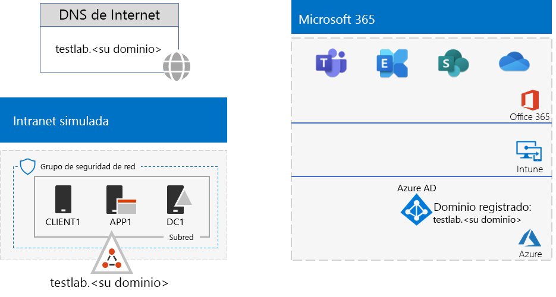

# <a name="password-hash-synchronization-for-your-microsoft-365-test-environment"></a><span data-ttu-id="0053a-103">Sincronización de hash de contraseñas para el entorno de prueba de Microsoft 365</span><span class="sxs-lookup"><span data-stu-id="0053a-103">Password hash synchronization for your Microsoft 365 test environment</span></span>

<span data-ttu-id="0053a-104">*Esta guía del laboratorio de pruebas puede usarse tanto para entornos de prueba de Microsoft 365 Enterprise como de Office 365 Enterprise.*</span><span class="sxs-lookup"><span data-stu-id="0053a-104">*This Test Lab Guide can be used for both Microsoft 365 Enterprise and Office 365 Enterprise test environments.*</span></span>

<span data-ttu-id="0053a-105">Muchas organizaciones utilizan la sincronización de hash de Azure AD Connect y contraseña para sincronizar el conjunto de cuentas de su bosque de cuentas en su Active Directory Domain Services (AD DS) local para el conjunto de cuentas en el inquilino de Azure AD de sus suscripciones a Microsoft 365.</span><span class="sxs-lookup"><span data-stu-id="0053a-105">Many organizations use Azure AD Connect and password hash synchronization to synchronize the set of accounts in their on-premises Active Directory Domain Services (AD DS) forest to the set of accounts in the Azure AD tenant of their Microsoft 365 subscription.</span></span> <span data-ttu-id="0053a-106">En este artículo se describe cómo puede añadir la sincronización hash de contraseñas al entorno de pruebas de Microsoft 365, dando como resultado la configuración siguiente:</span><span class="sxs-lookup"><span data-stu-id="0053a-106">This article describes how you can add password hash synchronization to your Microsoft 365 test environment, resulting in the following configuration:</span></span>
  

  
<span data-ttu-id="0053a-108">Existen dos fases para configurar el entorno de pruebas:</span><span class="sxs-lookup"><span data-stu-id="0053a-108">There are two phases to setting up this test environment:</span></span>
  
1. <span data-ttu-id="0053a-109">Crear el entorno de pruebas empresarial simulado de Microsoft 365.</span><span class="sxs-lookup"><span data-stu-id="0053a-109">Create the Microsoft 365 simulated enterprise test environment.</span></span>
2. <span data-ttu-id="0053a-110">Instalar y configurar Azure AD Connect en APP1.</span><span class="sxs-lookup"><span data-stu-id="0053a-110">Install and configure Azure AD Connect on APP1.</span></span>
    
> [!TIP]
> <span data-ttu-id="0053a-111">Haga clic [aquí](../media/m365-enterprise-test-lab-guides/Microsoft365EnterpriseTLGStack.pdf) para ver un mapa visual de todos los artículos de la pila Guía del entorno de pruebas de Microsoft 365 Enterprise.</span><span class="sxs-lookup"><span data-stu-id="0053a-111">Click [here](../media/m365-enterprise-test-lab-guides/Microsoft365EnterpriseTLGStack.pdf) for a visual map to all the articles in the Microsoft 365 Enterprise Test Lab Guide stack.</span></span>
  
## <a name="phase-1-create-the-microsoft-365-simulated-enterprise-test-environment"></a><span data-ttu-id="0053a-112">Fase 1: crear el entorno de pruebas empresarial simulado de Microsoft 365.</span><span class="sxs-lookup"><span data-stu-id="0053a-112">Phase 1: Create the Microsoft 365 simulated enterprise test environment</span></span>

<span data-ttu-id="0053a-p102">Siga las instrucciones de la [configuración básica empresarial simulada para Microsoft 365](simulated-ent-base-configuration-microsoft-365-enterprise.md). Esta la configuración resultante.</span><span class="sxs-lookup"><span data-stu-id="0053a-p102">Follow the instructions in [simulated enterprise base configuration for Microsoft 365](simulated-ent-base-configuration-microsoft-365-enterprise.md). Here is your resulting configuration.</span></span>
  

  
<span data-ttu-id="0053a-116">Esta configuración se compone de:</span><span class="sxs-lookup"><span data-stu-id="0053a-116">This configuration consists of:</span></span> 
  
- <span data-ttu-id="0053a-117">Suscripciones de prueba o de pago de Microsoft 365 E5 u Office 365 E5.</span><span class="sxs-lookup"><span data-stu-id="0053a-117">Microsoft 365 E5 or Office 365 E5 trial or paid subscriptions.</span></span>
- <span data-ttu-id="0053a-118">La intranet de una organización simplificada conectada a Internet, que consta de las máquinas virtuales DC1, APP1 y CLIENTE1 en una red virtual de Azure.</span><span class="sxs-lookup"><span data-stu-id="0053a-118">A simplified organization intranet connected to the Internet, consisting of the DC1, APP1, and CLIENT1 virtual machines in an Azure virtual network.</span></span> <span data-ttu-id="0053a-119">DC1 es un controlador de dominio para el laboratorio de pruebas. \<su nombre de dominio público > dominio AD DS.</span><span class="sxs-lookup"><span data-stu-id="0053a-119">DC1 is a domain controller for the testlab.\<your public domain name> AD DS domain.</span></span> <span data-ttu-id="0053a-120">Fase 2: crear y registrar el dominio de laboratorio de pruebas</span><span class="sxs-lookup"><span data-stu-id="0053a-120">Phase 2: Create and register the testlab domain</span></span>

## <a name="phase-2-create-and-register-the-testlab-domain"></a><span data-ttu-id="0053a-121">En esta fase agregará un dominio DNS público y a su suscripción.</span><span class="sxs-lookup"><span data-stu-id="0053a-121">In this phase you add a public DNS domain and add it to your subscription.</span></span>

<span data-ttu-id="0053a-122">First, work with your public DNS registration provider to create a new public DNS domain name based on your current domain name and add it to your subscription.</span><span class="sxs-lookup"><span data-stu-id="0053a-122">First, work with your public DNS registration provider to create a new public DNS domain name based on your current domain name and add it to your subscription.</span></span>

<span data-ttu-id="0053a-p104">Primero, trabaje con su proveedor de registro de DNS para crear un nombre de dominio DNS público en función de su nombre de dominio actual y agregarlo a su suscripción. Se recomienda usar el nombre **testlab.**\<su dominio público>. Por ejemplo, si su nombre de dominio público es **<span>contoso</span>.com**, agregue el nombre de dominio público **<span>testlab</span>.contoso.com**.</span><span class="sxs-lookup"><span data-stu-id="0053a-p104">First, work with your public DNS registration provider to create a new public DNS domain name based on your current domain name and add it to your subscription. We recommend using the name **testlab.**\<your public domain>. For example, if your public domain name is **<span>contoso</span>.com**, add the public domain name **<span>testlab</span>.contoso.com**.</span></span>
  
<span data-ttu-id="0053a-126">Esto consiste en añadir más registros DNS al **testlab.** \<su dominio público > dominio.</span><span class="sxs-lookup"><span data-stu-id="0053a-126">This consists of adding additional DNS records to the **testlab.**\<your public domain> domain.</span></span> <span data-ttu-id="0053a-127">Para obtener más información, vea [Agregar un dominio a Office 365](https://docs.microsoft.com/office365/admin/setup/add-domain).</span><span class="sxs-lookup"><span data-stu-id="0053a-127">For more information, see [Add a domain to Office 365](https://docs.microsoft.com/office365/admin/setup/add-domain).</span></span> <span data-ttu-id="0053a-128">Este es el resultado de la configuración.</span><span class="sxs-lookup"><span data-stu-id="0053a-128">Here is your resulting configuration.</span></span> <span data-ttu-id="0053a-129">El registro del nombre de dominio del laboratorio de pruebas</span><span class="sxs-lookup"><span data-stu-id="0053a-129">The registration of your testlab domain name</span></span> <span data-ttu-id="0053a-130">Esta configuración se compone de:</span><span class="sxs-lookup"><span data-stu-id="0053a-130">This configuration consists of:</span></span> 

<span data-ttu-id="0053a-131">Suscripciones de prueba o de pago de Microsoft 365 E5 u Office 365 E5 con el dominio DNS testlab. \<su nombre de dominio público > registrado.</span><span class="sxs-lookup"><span data-stu-id="0053a-131">Microsoft 365 E5 or Office 365 E5 trial or paid subscriptions with the DNS domain testlab.\<your public domain name> registered.</span></span>
  

  
<span data-ttu-id="0053a-133">Observe cómo está ahora el testlab.\<su nombre de dominio público>:</span><span class="sxs-lookup"><span data-stu-id="0053a-133">Notice how the testlab.\<your public domain name> is now:</span></span>

- <span data-ttu-id="0053a-134">Compatible con los registros DNS públicos.</span><span class="sxs-lookup"><span data-stu-id="0053a-134">Supported by public DNS records.</span></span> <span data-ttu-id="0053a-135">Registrado en las suscripciones de Microsoft 365.</span><span class="sxs-lookup"><span data-stu-id="0053a-135">Registered in your Microsoft 365 subscriptions.</span></span>
- <span data-ttu-id="0053a-136">El dominio de AD DS de la intranet simulada.</span><span class="sxs-lookup"><span data-stu-id="0053a-136">The AD DS domain on your simulated intranet.</span></span>

<span data-ttu-id="0053a-p107">Cuando se le pida un nombre de usuario y una contraseña, especifique <strong>user1@testlab.</strong>\<su nombre de dominio > y la contraseña de Usuario1. Debería iniciar sesión correctamente como Usuario1.</span><span class="sxs-lookup"><span data-stu-id="0053a-p107">When prompted for a user name and password, specify <strong>user1@testlab.</strong>\<your domain name> and the User1 password. You should successfully sign in as User1.</span></span>

- <span data-ttu-id="0053a-139">Primero, instale y configure Azure AD Connect en APP1.</span><span class="sxs-lookup"><span data-stu-id="0053a-139">First, you install and configure Azure AD Connect on APP1.</span></span>
- <span data-ttu-id="0053a-140">Desde el [Azure Portal](https://portal.azure.com), inicie sesión con su cuenta de administrador global y conéctese a APP1 con la cuenta TESTLAB\\Usuario1.</span><span class="sxs-lookup"><span data-stu-id="0053a-140">From the [Azure portal](https://portal.azure.com), sign in with your global administrator account, and then connect to APP1 with the TESTLAB\\User1 account.</span></span>
- <span data-ttu-id="0053a-141">Desde el escritorio de APP1, abra un símbolo del sistema de Windows PowerShell con el nivel de administrador y ejecute estos comandos para deshabilitar la seguridad mejorada de Internet Explorer:</span><span class="sxs-lookup"><span data-stu-id="0053a-141">From the desktop of APP1, open an administrator-level Windows PowerShell command prompt, and then run these commands to disable Internet Explorer Enhanced Security:</span></span>
     
## <a name="phase-3-install-azure-ad-connect-on-app1"></a><span data-ttu-id="0053a-142">En la barra de tareas, haga clic en **Internet Explorer** y vaya a [https://aka.ms/aadconnect](https://aka.ms/aadconnect).</span><span class="sxs-lookup"><span data-stu-id="0053a-142">From the task bar, click **Internet Explorer** and go to [https://aka.ms/aadconnect](https://aka.ms/aadconnect).</span></span>

<span data-ttu-id="0053a-143">En la página de Microsoft Azure Active Directory Connect, haga clic en **Descargar** y, después, en **Ejecutar**.</span><span class="sxs-lookup"><span data-stu-id="0053a-143">On the Microsoft Azure Active Directory Connect page, click **Download**, and then click **Run**.</span></span>
  
<span data-ttu-id="0053a-144">En la página **Bienvenido a Azure AD Connect**, haga clic en **Acepto** y, después, en **Continuar**.</span><span class="sxs-lookup"><span data-stu-id="0053a-144">On the **Welcome to Azure AD Connect** page, click **I agree**, and then click **Continue**.</span></span>

1. <span data-ttu-id="0053a-145">En la página **Configuración rápida**, haga clic en **Usar configuración rápida**.</span><span class="sxs-lookup"><span data-stu-id="0053a-145">On the **Express Settings** page, click **Use express settings**.</span></span>
    
2. <span data-ttu-id="0053a-146">En la página **Conectar a Azure AD**, escriba el nombre de la cuenta de administrador global en **Nombre de usuario**, escriba la contraseña en **Contraseña** y, después, haga clic en **Siguiente**.</span><span class="sxs-lookup"><span data-stu-id="0053a-146">On the **Connect to Azure AD** page, type your global administrator account name in **Username,** type its password in **Password**, and then click **Next**.</span></span>
    
   ```powershell
   Set-ItemProperty -Path "HKLM:\SOFTWARE\Microsoft\Active Setup\Installed Components\{A509B1A7-37EF-4b3f-8CFC-4F3A74704073}" -Name "IsInstalled" -Value 0
   Set-ItemProperty -Path "HKLM:\SOFTWARE\Microsoft\Active Setup\Installed Components\{A509B1A8-37EF-4b3f-8CFC-4F3A74704073}" -Name "IsInstalled" -Value 0
   Stop-Process -Name Explorer -Force
   ```

3. <span data-ttu-id="0053a-147">En la página **Conectarse a AD DS**, escriba **TESTLAB\\Usuario1** en **Nombre de usuario**, escriba la contraseña en **Contraseña** y después haga clic en **Siguiente**.</span><span class="sxs-lookup"><span data-stu-id="0053a-147">On the **Connect to AD DS** page, type **TESTLAB\\User1** in **Username,** type its password in **Password**, and then click **Next**.</span></span>
    
4. <span data-ttu-id="0053a-148">En la página **Listo para configurar**, haga clic en **Instalar**.</span><span class="sxs-lookup"><span data-stu-id="0053a-148">On the **Ready to configure** page, click **Install**.</span></span>
    
5. <span data-ttu-id="0053a-149">En la página **Configuración completada** de página, haga clic en **Salir**.</span><span class="sxs-lookup"><span data-stu-id="0053a-149">On the **Configuration complete** page, click **Exit**.</span></span>
    
6. <span data-ttu-id="0053a-150">En Internet Explorer, vaya al Centro de administración de Microsoft 365 ([https://portal.microsoft.com](https://portal.microsoft.com)).</span><span class="sxs-lookup"><span data-stu-id="0053a-150">In Internet Explorer, go to the Microsoft 365 admin center ([https://portal.microsoft.com](https://portal.microsoft.com)).</span></span>
    
7. <span data-ttu-id="0053a-151">En el panel de navegación izquierdo, haga clic en **Usuarios > Usuarios activos**.</span><span class="sxs-lookup"><span data-stu-id="0053a-151">In the left navigation, click **Users > Active users**.</span></span>
    
8. <span data-ttu-id="0053a-152">Observe la cuenta llamada **Usuario1**.</span><span class="sxs-lookup"><span data-stu-id="0053a-152">Note the account named **User1**.</span></span>
    
9. <span data-ttu-id="0053a-153">Esta cuenta pertenece al dominio de AD DS de TESTLAB y es una prueba de que la sincronización de directorios funcionó correctamente.</span><span class="sxs-lookup"><span data-stu-id="0053a-153">This account is from the TESTLAB AD DS domain and is proof that directory synchronization has worked.</span></span>
    
10. <span data-ttu-id="0053a-154">Haga clic en la cuenta **Usuario1** y después, haga clic en **Licencias y aplicaciones**.</span><span class="sxs-lookup"><span data-stu-id="0053a-154">Click the **User1** account, and then click **Licenses and apps**.</span></span>
    
11. <span data-ttu-id="0053a-155">En **Licencias de producto**, seleccione su ubicación (si es necesario), deshabilite la licencia de **Office 365 E5** y habilite la licencia de **Microsoft 365 E5**.</span><span class="sxs-lookup"><span data-stu-id="0053a-155">In **Product licenses**, select your location (if needed), disable the **Office 365 E5** license and enable the **Microsoft 365 E5** license.</span></span>
    
12. <span data-ttu-id="0053a-156">Haga clic en **Guardar** en la parte inferior de la página y después haga clic en **Cerrar**.</span><span class="sxs-lookup"><span data-stu-id="0053a-156">Click **Save** at the bottom of the page, and then click **Close**.</span></span>
    
    <span data-ttu-id="0053a-157">Después, compruebe si puede iniciar sesión en su suscripción con el nombre de usuario <strong>user1@testlab.</strong>\< su nombre de dominio > nombre de usuario de la cuenta Usuario1.</span><span class="sxs-lookup"><span data-stu-id="0053a-157">Next, you test the ability to sign in to your subscription with the <strong>user1@testlab.</strong>\<your domain name> user name of the User1 account.</span></span> <span data-ttu-id="0053a-158">Desde APP1, cierre la sesión y vuelva a iniciarla, pero esta vez especifique una cuenta diferente.</span><span class="sxs-lookup"><span data-stu-id="0053a-158">From APP1, sign out, and then sign in again, this time specifying a different account.</span></span>
    
13. <span data-ttu-id="0053a-159">When prompted for a user name and password, specify <strong>user1@testlab.</strong>\<your domain name> and the User1 password.</span><span class="sxs-lookup"><span data-stu-id="0053a-159">When prompted for a user name and password, specify <strong>user1@testlab.</strong>\<your domain name> and the User1 password.</span></span>
    
14. <span data-ttu-id="0053a-160">You should successfully sign in as User1.</span><span class="sxs-lookup"><span data-stu-id="0053a-160">You should successfully sign in as User1.</span></span> 

15. <span data-ttu-id="0053a-161">Tenga en cuenta que, aunque User1 tiene permisos de administrador de dominio para el dominio TESTLAB AD DS, no es un administrador global.</span><span class="sxs-lookup"><span data-stu-id="0053a-161">Notice that although User1 has domain administrator permissions for the TESTLAB AD DS domain, it is not a global administrator.</span></span>
    
<span data-ttu-id="0053a-162">Por lo tanto, no verá el icono de **administrador** como opción.</span><span class="sxs-lookup"><span data-stu-id="0053a-162">Therefore, you will not see the **Admin** icon as an option.</span></span> <span data-ttu-id="0053a-163">Este es el resultado de la configuración.</span><span class="sxs-lookup"><span data-stu-id="0053a-163">Here is your resulting configuration.</span></span>

1. <span data-ttu-id="0053a-164">La empresa simulada con el entorno de prueba con la sincronización de hash de contraseñas</span><span class="sxs-lookup"><span data-stu-id="0053a-164">The simulated enterprise with password hash synchronization test environment</span></span>

2. <span data-ttu-id="0053a-165">Esta configuración se compone de:</span><span class="sxs-lookup"><span data-stu-id="0053a-165">This configuration consists of:</span></span> <span data-ttu-id="0053a-166">Suscripciones de prueba o de pago de Microsoft 365 E5 u Office 365 E5 con el dominio DNS TESTLAB.\<su nombre de dominio > registrado.</span><span class="sxs-lookup"><span data-stu-id="0053a-166">Microsoft 365 E5 or Office 365 E5 trial or paid subscriptions with the DNS domain TESTLAB.\<your domain name> registered.</span></span> <span data-ttu-id="0053a-167">La intranet de una organización simplificada conectada a Internet, que consta de las máquinas virtuales DC1, APP1 y CLIENTE1 en una subred de una red virtual de Azure.</span><span class="sxs-lookup"><span data-stu-id="0053a-167">A simplified organization intranet connected to the Internet, consisting of the DC1, APP1, and CLIENT1 virtual machines on a subnet of an Azure virtual network.</span></span> 
 
<span data-ttu-id="0053a-168">Azure AD Connect se ejecuta en APP1 para sincronizar periódicamente el dominio TESTLAB de AD DS con el espacio empresarial de Azure AD de sus suscripciones de Microsoft 365.</span><span class="sxs-lookup"><span data-stu-id="0053a-168">Azure AD Connect runs on APP1 to synchronize the TESTLAB AD DS domain to the Azure AD tenant of your Microsoft 365 subscription periodically.</span></span> <span data-ttu-id="0053a-169">La cuenta User1 en el dominio AD DS de TESTLAB se ha sincronizado con la cuenta empresarial de Azure AD.</span><span class="sxs-lookup"><span data-stu-id="0053a-169">The User1 account in the TESTLAB  AD DS domain has been synchronized with the Azure AD tenant.</span></span> 

<span data-ttu-id="0053a-170">Paso siguiente</span><span class="sxs-lookup"><span data-stu-id="0053a-170">Next step</span></span>

 adicionales y funcionalidades en su entorno de prueba.](../media/password-hash-sync-m365-ent-test-environment/Phase3.png)

<span data-ttu-id="0053a-172">Vea también</span><span class="sxs-lookup"><span data-stu-id="0053a-172">See also</span></span> 
  
- [<span data-ttu-id="0053a-173">Guías de laboratorio de pruebas de Microsoft 365 Enterprise</span><span class="sxs-lookup"><span data-stu-id="0053a-173">Microsoft 365 Enterprise Test Lab Guides</span></span>](m365-enterprise-test-lab-guides.md) [<span data-ttu-id="0053a-174">Implementar Microsoft 365 Enterprise</span><span class="sxs-lookup"><span data-stu-id="0053a-174">Deploy Microsoft 365 Enterprise</span></span>](deploy-microsoft-365-enterprise.md)
- [<span data-ttu-id="0053a-175">Documentación y recursos de Microsoft 365 Enterprise</span><span class="sxs-lookup"><span data-stu-id="0053a-175">Microsoft 365 Enterprise documentation</span></span>](https://docs.microsoft.com/microsoft-365-enterprise/) Azure AD Connect runs on APP1 to synchronize the TESTLAB AD DS domain to the Azure AD tenant of your Microsoft 365 subscription periodically.
- The User1 account in the TESTLAB  AD DS domain has been synchronized with the Azure AD tenant.

## <a name="next-step"></a>Next step

Explore additional <bpt id="p1">[</bpt>identity<ept id="p1">](m365-enterprise-test-lab-guides.md#identity)</ept> features and capabilities in your test environment.

## <a name="see-also"></a>See also

<bpt id="p1">[</bpt>Microsoft 365 Enterprise Test Lab Guides<ept id="p1">](m365-enterprise-test-lab-guides.md)</ept>

<bpt id="p1">[</bpt>Deploy Microsoft 365 Enterprise<ept id="p1">](deploy-microsoft-365-enterprise.md)</ept>

<bpt id="p1">[</bpt>Microsoft 365 Enterprise documentation<ept id="p1">](https://docs.microsoft.com/microsoft-365-enterprise/)</ept>


