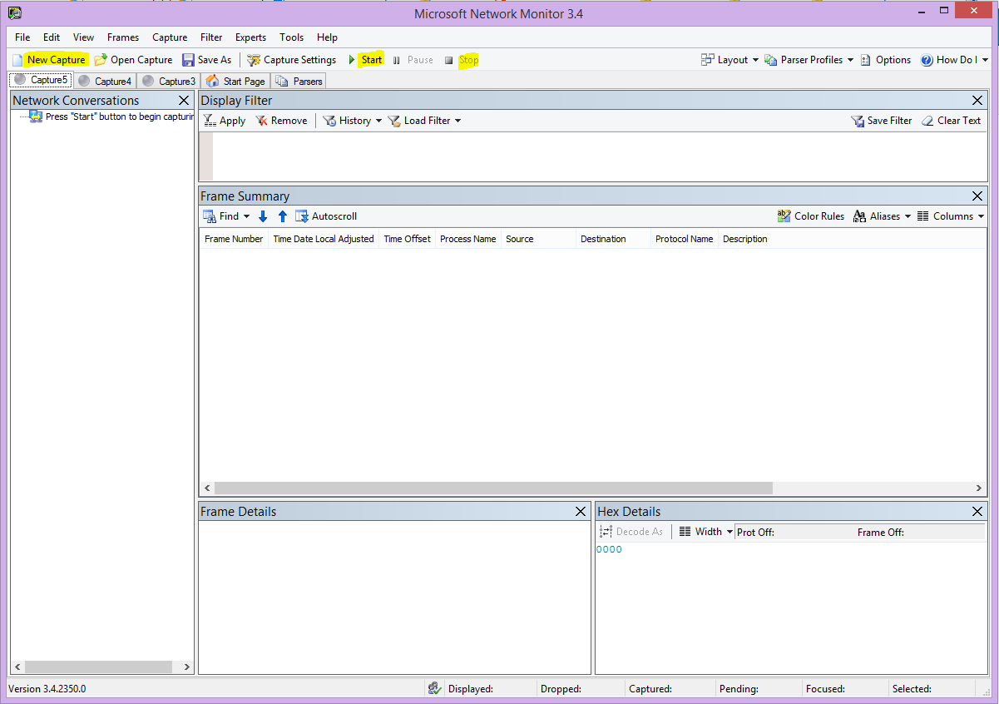
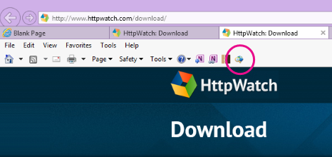
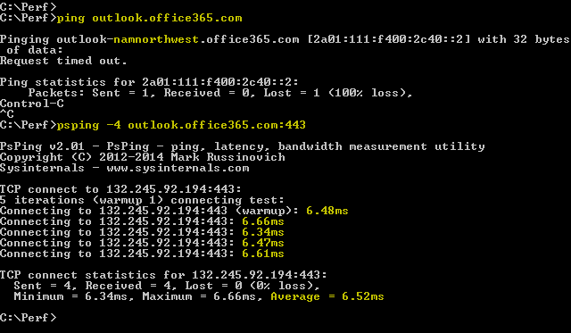
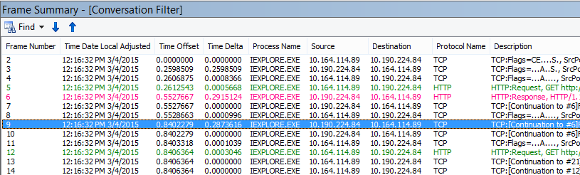
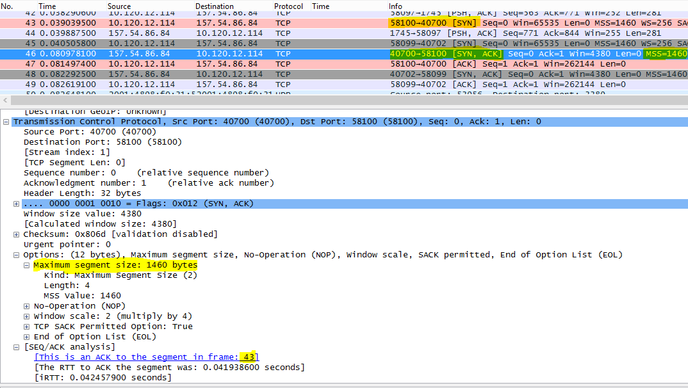
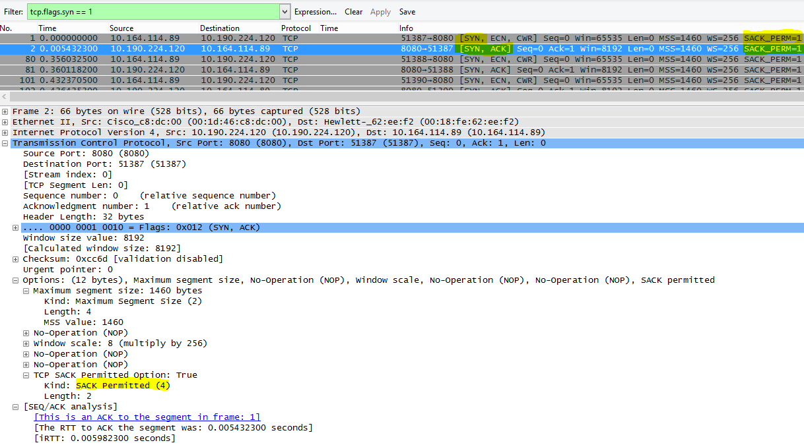

# <a name="performance-troubleshooting-plan-for-office-365"></a>Plan de solución de problemas de rendimiento para Office 365

¿Necesita conocer los pasos a seguir para identificar y corregir los rezagos, los ahorcados y el rendimiento lento entre SharePoint Online, OneDrive para la Empresa, Exchange Online o Skype Empresarial Online y el equipo cliente? Antes de llamar al soporte técnico, este artículo puede ayudarle a solucionar Office 365 problemas de rendimiento e incluso solucionar algunos de los problemas más comunes.

En realidad, este artículo es un plan de acción de ejemplo que puede usar para capturar datos valiosos sobre el problema de rendimiento mientras se está produciendo. Algunos de los principales problemas también se incluyen en este artículo.

Si es nuevo en el rendimiento de la red y desea realizar un plan a largo plazo para supervisar el rendimiento entre las máquinas cliente y Office 365, consulte Office 365 performance [tuning and troubleshooting - Admin and IT Pro](performance-tuning-using-baselines-and-history.md).

## <a name="sample-performance-troubleshooting-action-plan"></a>Plan de acción de solución de problemas de rendimiento de ejemplo

Este plan de acción contiene dos partes; una fase de preparación y una fase de registro. Si tiene un problema de rendimiento en este momento y necesita realizar la recopilación de datos, puede empezar a usar este plan de inmediato.

### <a name="prepare-the-client-computer"></a>Preparar el equipo cliente

- Busque un equipo cliente que pueda reproducir el problema de rendimiento. Este equipo se usará durante el transcurso de la solución de problemas.
- Anote los pasos que hacen que se produce el problema de rendimiento para que esté listo cuando llegue el momento de la prueba.
- Instalar herramientas para recopilar y grabar información:
  - Instale [Netmon 3.4](https://www.microsoft.com/download/details.aspx?id=4865) (o use una herramienta de seguimiento de red equivalente).
  - Instale la edición básica gratuita de [HTTPWatch](https://www.httpwatch.com/download/) (o use una herramienta de seguimiento de red equivalente).
  - Use una grabadora de pantalla o ejecute la Grabadora de pasos (PSR.exe) que viene con Windows Vista y versiones posteriores, para mantener un registro de los pasos que realiza durante las pruebas.

### <a name="log-the-performance-issue"></a>Registrar el problema de rendimiento

- Cierre todos los exploradores de Internet extraneosos.
- Inicie la Grabadora de pasos u otra grabadora de pantalla.
- Inicie la captura de Netmon (o herramienta de seguimiento de red).
- Borra la memoria caché DNS en el equipo cliente de la línea de comandos escribiendo ipconfig /flushdns.
- Inicie una nueva sesión del explorador y active HTTPWatch.
- Opcional: si está probando Exchange Online, ejecute la herramienta analizador de rendimiento Exchange cliente desde la Office 365 de administración.
- Reproduce los pasos exactos que causan el problema de rendimiento.
- Detenga el seguimiento de Netmon u otra herramienta.
- En la línea de comandos, ejecute una ruta de seguimiento a Office 365 suscripción escribiendo el siguiente comando y presionando ENTRAR:

  ``` cmd
  tracert <subscriptionname>.onmicrosoft.com
  ```

- Detenga la Grabadora de pasos y guarde el vídeo. Asegúrese de incluir la fecha y hora de la captura y si muestra un rendimiento bueno o malo.
- Guarde los archivos de seguimiento. De nuevo, asegúrese de incluir la fecha y hora de la captura y si muestra un rendimiento bueno o malo.

Si no está familiarizado con la ejecución de las herramientas mencionadas en este artículo, no se preocupe porque le proporcionamos estos pasos a continuación. Si estás acostumbrado a realizar este tipo de captura de red, puedes pasar a [Cómo](performance-tuning-using-baselines-and-history.md#how-to-collect-baselines)recopilar líneas base, que describe el filtrado y la lectura de los registros.

### <a name="flush-the-dns-cache-first"></a>Vaciar primero la caché DNS

¿Por qué? Al vaciar la memoria caché DNS, estás iniciando las pruebas con una pizarra limpia. Al borrar la memoria caché, se restablece el contenido del solucionador DNS a las entradas más actualizadas. Recuerde que un vaciado no quita entradas de archivo HOST. Si usa entradas de archivo HOST de forma extensiva, debe copiar esas entradas en un archivo de otro directorio y, a continuación, vaciar el archivo HOST.

#### <a name="flush-your-dns-resolver-cache"></a>Vaciar la memoria caché de resolución DNS

1. Abra el símbolo del sistema , **(inicie Ejecutar** cmd o \>  \>  **Windows cmd** \> **clave**).
2. Escriba el siguiente comando y presione ENTRAR:

    ``` cmd
    ipconfig /flushdns
    ```

## <a name="netmon"></a>Netmon

La herramienta de supervisión de red de Microsoft[(Netmon)](https://www.microsoft.com/download/details.aspx?id=4865)analiza los paquetes, es decir, el tráfico, que pasa entre equipos en redes. Al usar Netmon para rastrear el tráfico con Office 365 puede capturar, ver y leer encabezados de paquetes, identificar dispositivos que intervienen, comprobar la configuración importante en el hardware de red, buscar paquetes eliminados y seguir el flujo de tráfico entre equipos de la red corporativa y Office 365. Dado que el cuerpo real del tráfico está cifrado, es decir, it(travels on port 443 via SSL/TLS, you can't read the files being sent. En su lugar, obtiene un seguimiento sin filtrar de la ruta de acceso que toma el paquete que puede ayudarle a rastrear el comportamiento del problema.

Asegúrese de no aplicar un filtro en este momento. En su lugar, ejecute los pasos y demuestre el problema antes de detener el seguimiento y guardar.

Después de instalar Netmon 3.4, abra la herramienta y siga estos pasos:

### <a name="take-a-netmon-trace-and-reproduce-the-issue"></a>Realizar un seguimiento de Netmon y reproducir el problema

1. Inicie Netmon 3.4.
Hay tres paneles en  la página Inicio: **Capturas** recientes, **Seleccionar** redes y Introducción a **Microsoft Network Monitor 3.4. Observe**. El panel Seleccionar redes también le dará una lista de las redes predeterminadas desde las que puede capturar. Asegúrese de que las tarjetas de red están seleccionadas aquí.

2. Haga **clic en Nueva captura** en la parte superior de la **página** Inicio. Esto agrega una nueva pestaña junto a **la pestaña Página** inicio denominada Captura **1**.


3. Para realizar una captura sencilla, haga clic **en Inicio en** la barra de herramientas.

4. Reproduce los pasos que presentan un problema de rendimiento.

5. Haga **clic en Detener** \> **guardar** archivo \> **como**. Recuerde dar la fecha y la hora con la zona horaria y mencionar si muestra un rendimiento malo o bueno.

## <a name="httpwatch"></a>HTTPWatch

[HTTPWatch](https://www.httpwatch.com/download/) viene cargado y una edición gratuita. La edición básica gratuita cubre todo lo que necesita para esta prueba. HTTPWatch supervisa el tráfico de red y el tiempo de carga de la página directamente desde la ventana del explorador. HTTPWatch es un complemento de Internet Explorer que describe gráficamente el rendimiento. El análisis se puede guardar y ver en HTTPWatch Studio.

> [!NOTE]
> Si usa otro explorador, como Firefox, Google Chrome o si no puede instalar HTTPWatch en Internet Explorer, abra una nueva ventana del explorador y presione F12 en el teclado. Debería ver la ventana emergente Herramienta de desarrollo en la parte inferior del explorador. Si usa Opera, presione CTRL+MAYÚS+I para Inspector  web y, a continuación, haga clic en la pestaña Red y complete las pruebas descritas a continuación. La información será ligeramente diferente, pero los tiempos de carga seguirán mostrárselo en milisegundos. > HTTPWatch también es muy útil para problemas con los tiempos de carga SharePoint página en línea.

### <a name="run-httpwatch-and-reproduce-the-issue"></a>Ejecutar HTTPWatch y reproducir el problema

HTTPWatch es un complemento de explorador, por lo que exponer la herramienta en el explorador es ligeramente diferente para cada versión de Internet Explorer. Normalmente, puede encontrar HTTPWatch en la barra Comandos en el explorador internet Explorer. Si no ve el complemento HTTPWatch en la ventana del explorador, compruebe  la versión del explorador haciendo clic en Ayuda acerca de , o en versiones posteriores de Internet Explorer, haga clic en el símbolo del engranaje y acerca de \>  **Internet Explorer**. Para iniciar la **barra comandos,** haga clic con el botón secundario en la barra de menús de Internet Explorer y haga clic en **Barra de comandos**.

En el pasado, HTTPWatch se ha asociado con las barras Comandos y Explorador, por lo que una vez instalado, si no ve inmediatamente el icono (incluso después del reinicio) compruebe Herramientas y las barras de herramientas para el icono. Recuerde que las barras de herramientas se pueden personalizar y se pueden agregar opciones a ellas.



1. Inicie HTTPWatch en una ventana del explorador de Internet Explorer. Aparecerá acoplada al explorador en la parte inferior de esa ventana. Haga clic **en Grabar**.

2. Reproduce los pasos exactos implicados en el problema de rendimiento. Haga clic en **el botón** Detener en HTTPWatch.

3. **Guarde** httpwatch o **enviar por correo electrónico**. Recuerde nombrar el archivo para que incluya información de fecha y hora y una indicación de si el reloj contiene una demostración de buen o mal rendimiento.


Esta captura de pantalla es de la Professional de HTTPWatch. Puede abrir los seguimientos tomados en la versión básica en un equipo con una Professional y leerla allí. Es posible que haya información adicional disponible desde el seguimiento a través de ese método.

## <a name="problem-steps-recorder"></a>Grabadora de pasos de problemas

Steps Recorder o PSR.exe, le permite registrar problemas a medida que se producen. Es una herramienta muy útil y muy sencilla de ejecutar.

### <a name="run-problem-steps-recorder-psrexe-to-record-your-work"></a>Ejecutar grabadora de pasos de problemas (PSR.exe) para grabar el trabajo

1. Use el **tipo** Iniciar ejecuciónPSR.exeAceptar o, haga clic en el Windows Tipo dePSR.exey, a \>  \>  \>   \> continuación,  \> presione ENTRAR.

2. Cuando aparezca la PSR.exe pequeña, haga clic en **Iniciar registro** y reproduzca los pasos que reproducen el problema de rendimiento. Puede agregar comentarios según sea necesario, haciendo clic **en Agregar comentarios**.

3. Haga **clic en Detener registro** cuando haya completado los pasos. Si el problema de rendimiento es un procesamiento de página, espere a que se represente la página antes de detener la grabación.

4. Haga clic en **Guardar**.


La fecha y la hora se registran por usted. Esto vincula el PSR con el seguimiento de Netmon y HTTPWatch a tiempo y ayuda a solucionar problemas de precisión. La fecha y hora del registro PSR puede mostrar que se ha transcurrido un minuto entre el inicio de sesión y la exploración de la dirección URL y la representación parcial del sitio de administración, por ejemplo.

## <a name="read-your-traces"></a>Leer los seguimientos

No es posible enseñar todo sobre la solución de problemas de red y rendimiento que alguien necesita saber a través de un artículo. Obtener un buen rendimiento requiere experiencia y conocimientos sobre cómo funciona la red y, por lo general, funciona. Pero es posible redondear una lista de los principales problemas y mostrar cómo las herramientas pueden facilitar la eliminación de los problemas más comunes.

Si desea obtener conocimientos para leer los seguimientos de red de sus sitios de Office 365, no hay mejor profesor que crear seguimientos de cargas de página con regularidad y obtener experiencia al leerlos. Por ejemplo, cuando tenga una oportunidad, cargue un Office 365 y rastree el proceso. Filtre el seguimiento del tráfico DNS o busque en FrameData el nombre del servicio que ha explorado. Analice el seguimiento para obtener una idea de los pasos que se producen cuando se carga el servicio. Esto le ayudará a aprender cómo debe ser la carga de página normal y, en el caso de la solución de problemas, especialmente en relación con el rendimiento, comparar los seguimientos buenos con los malos puede enseñarte mucho.

Netmon usa Microsoft Intellisense en el campo Filtro de visualización. Intellisense, o finalización de código inteligente, es ese truco en el que se escribe en un período y todas las opciones disponibles se muestran en un cuadro de selección desplegable. Si, por ejemplo, le preocupa el escalado de ventanas TCP, puede encontrar el camino a un filtro (por  `.protocol.tcp.window < 100` ejemplo, ) por este medio.


Los seguimientos de Netmon pueden tener mucho tráfico en ellos. Si no tiene experiencia al leerlos, es probable que se agote al abrir el seguimiento la primera vez. Lo primero que debe hacer es separar la señal del ruido de fondo en el seguimiento. Ha probado con Office 365 y ese es el tráfico que desea ver. Si estás acostumbrado a navegar por los seguimientos, es posible que no necesites esta lista.

El tráfico entre el cliente y Office 365 viaja a través de TLS, lo que significa que el cuerpo del tráfico se cifrará y no podrá leerse en un seguimiento de Netmon genérico. El análisis de rendimiento no necesita conocer los detalles de la información del paquete. Sin embargo, está muy interesado en los encabezados de paquetes y la información que contienen.

### <a name="tips-to-get-a-good-trace"></a>Sugerencias obtener un buen seguimiento

- Conozca el valor de la dirección IPv4 o IPv6 del equipo cliente. Para obtener esto en el símbolo del sistema, escriba **IPConfig** y, a continuación, presione ENTRAR. Conocer esta dirección te permitirá saber de un vistazo si el tráfico en el seguimiento implica directamente al equipo cliente. Si hay un proxy conocido, haga ping y obtenga también su dirección IP.

- Vaciar la memoria caché de resolución dns y, si es posible, cerrar todos los exploradores excepto el en el que se están ejecutando las pruebas. Si no puede hacerlo, por ejemplo, si la compatibilidad usa alguna herramienta basada en explorador para ver el escritorio del equipo cliente, esté preparado para filtrar el seguimiento.

- En un seguimiento de disponibilidad, busque el Office 365 que está usando. Si nunca o rara vez ha visto el tráfico antes, este es un paso útil para separar el problema de rendimiento de otro ruido de red. Hay varias maneras de hacerlo. Directamente antes de la prueba, puede usar _ping_ o _PsPing_ en la dirección URL del servicio específico ( `ping outlook.office365.com` o , por `psping -4 microsoft-my.sharepoint.com:443` ejemplo). También puede encontrar fácilmente ese ping o PsPing en un seguimiento de Netmon (por su nombre de proceso). Eso le dará un lugar donde empezar a buscar.

If you're only using Netmon tracing at the time of the problem, that's okay too. Para orientarse, use un filtro como `ContainsBin(FrameData, ASCII, "office")` o `ContainsBin(FrameData, ASCII, "outlook")` . Puede registrar el número de fotograma desde el archivo de seguimiento. También es posible que desee desplazar el panel _Resumen_ de fotogramas hasta la derecha y buscar la columna Id. de conversación. Hay un número indicado allí para el identificador de esta conversación específica que también puede registrar y ver de forma aislada más adelante. Recuerde quitar este filtro antes de aplicar cualquier otro filtrado.

> [!TIP]
> Netmon tiene muchos filtros integrados útiles. Pruebe el **botón Cargar filtro** en la parte superior del panel _de_ filtro Mostrar.


Familiarícese con el tráfico y aprenda a buscar la información que necesita. Por ejemplo, aprenda a determinar qué paquete del seguimiento tiene la primera referencia al servicio de Office 365 que está usando (como "Outlook").

Tomando Office 365 Outlook Online como ejemplo, el tráfico comienza algo así:

- Consulta estándar DNS y respuesta DNS para outlook.office365.com con queryIDs que coincidan. Es importante tener en cuenta el desplazamiento de tiempo para este giro, así como dónde en el mundo el DNS global de Office 365 envía la solicitud de resolución de nombres. Idealmente, lo más localmente posible, en lugar de la mitad del mundo.

- Solicitud HTTP GET cuyo informe de estado se movió permanentemente (301)

- RWS Tráfico, incluidos Conectar rws y Conectar respuestas. (Se trata de Winsock remoto que realiza una conexión).

- Una conversación DE TCP SYN y TCP SYN/ACK. Gran parte de la configuración de esta conversación afecta al rendimiento.

- A continuación, una serie de tráfico TLS:TLS que es donde se llevan a cabo las conversaciones de protocolo de enlace TLS y certificado TLS. (Recuerde que los datos se cifran a través de SSL/TLS).

Todas las partes del tráfico son importantes y conectadas, pero pequeñas partes del seguimiento contienen información especialmente importante en términos de solución de problemas de rendimiento, por lo que nos centraremos en esas áreas. Además, dado que hemos realizado suficientes tareas de solución de problemas de rendimiento de Office 365 en Microsoft para compilar una lista de los diez principales problemas comunes, nos centraremos en esos problemas y en cómo usar las herramientas que tenemos para solucionarlos a continuación.

Si no los ha instalado todos listos, la siguiente matriz usa varias herramientas. Siempre que sea posible. Se proporcionan vínculos a los puntos de instalación. La lista incluye herramientas comunes de seguimiento de red como [Netmon](https://www.microsoft.com/download/details.aspx?id=4865) y [Wireshark,](https://www.wireshark.org/)pero usa cualquier herramienta de seguimiento con la que estés cómodo y en la que estés acostumbrado a filtrar el tráfico de red. Cuando esté probando, recuerde:

- *Cierre los exploradores y pruebe con un solo explorador en ejecución:*  esto reducirá el tráfico general que capture. Hace que el seguimiento sea menos ocupado.
- *Vaciar la memoria caché de resolución dns*  en el equipo cliente: esto le dará una pizarra limpia cuando empiece a realizar la captura, para un seguimiento más limpio.

## <a name="common-issues"></a>Problemas comunes

Algunos problemas comunes que puede tener que enfrentar y cómo encontrarlos en el seguimiento de red.

### <a name="tcp-windows-scaling"></a>Escala de Windows TCP

Se encuentra en SYN - SYN/ACK. Es posible que el hardware heredado o antiguo no aproveche el escalado de ventanas TCP.  Sin una configuración de escalado de windows TCP adecuada, el búfer predeterminado de 16 bits en encabezados TCP se rellena en milisegundos.  El tráfico no puede seguir enviándose hasta que el cliente reciba una confirmación de que se han recibido los datos originales, lo que provoca retrasos.

#### <a name="tools"></a>Herramientas

- Netmon
- Wireshark

#### <a name="what-to-look-for"></a>Qué buscar

Busque el tráfico SYN- SYN/ACK en el seguimiento de red.  En Netmon, use un filtro como  `tcp.flags.syn == 1` . Este filtro es el mismo en Wireshark.


Observe que para cada SYN hay un número de puerto de origen (SrcPort) que coincide en el puerto de destino (DstPort) del acuse de recibo relacionado (SYN/ACK).

Para ver el Windows de escalado que usa la conexión de red, expanda primero SYN y, a continuación, SYN/ACK relacionado.


### <a name="tcp-idle-time-settings"></a>Tiempo de inactividad TCP Configuración

Históricamente, la mayoría de las redes perimetrales están configuradas para conexiones transitorias, lo que significa que las conexiones inactivas suelen finalizar. Los servidores proxy y firewalls pueden finalizar las sesiones TCP inactivas en un tiempo superior a 100 a 300 segundos. Esto es problemático para Outlook Online porque crea y usa conexiones a largo plazo, independientemente de si están inactivas o no.

Cuando los dispositivos proxy o firewall finalizan las conexiones, el cliente no está informado y un intento de usar Outlook Online significará que un equipo cliente intentará, repetidamente, reactivar la conexión antes de crear una nueva. Es posible que veas que se cuelga el producto, las indicaciones o el rendimiento lento en la carga de la página.

#### <a name="tools"></a>Herramientas

- Netmon
- Wireshark

#### <a name="what-to-look-for"></a>Qué buscar

En Netmon, consulta el campo Desplazamiento de tiempo para un recorrido de ida y vuelta. Un recorrido de ida y vuelta es el tiempo entre el cliente que envía una solicitud al servidor y recibe una respuesta. Compruebe entre el cliente y el punto de salida (por ejemplo. Client -- \> Proxy) o client to Office 365 (Client -- \> Office 365). Esto se puede ver en muchos tipos de paquetes.

Por ejemplo, el filtro de Netmon puede tener el aspecto  `.Protocol.IPv4.Address == 10.102.14.112 AND .Protocol.IPv4.Address == 10.201.114.12` de , o, en Wireshark,  `ip.addr == 10.102.14.112 &amp;&amp; ip.addr == 10.201.114.12` .

> [!TIP]
> ¿No sabe si la dirección IP del seguimiento pertenece al servidor DNS? Intenta buscarlo en la línea de comandos. Haga **clic en** Iniciar \> **ejecución** y escriba \> **cmd** o presione Windows Tecla **y** escriba \> **cmd**. En el símbolo del sistema, escriba  `nslookup <the IP address from the network trace>` . Para probar, usa nslookup en la dirección IP de tu propio equipo. > Para ver una lista de los intervalos IP de Microsoft, vea Office 365 direcciones URL e [intervalos de direcciones IP](./urls-and-ip-address-ranges.md).

Si hay un problema, espere que aparezcan desplazamientos de tiempo largos, en este caso (Outlook Online), especialmente en paquetes TLS:TLS que muestran el paso de los datos de la aplicación (por ejemplo, en Netmon puede encontrar paquetes de datos de aplicación a través de `.Protocol.TLS AND Description == "TLS:TLS Rec Layer-1 SSL Application Data"` ). Debería ver una progresión suave en el tiempo durante toda la sesión. Si ve retrasos largos al actualizar Outlook Online, esto podría deberse a un alto grado de restablecimiento que se envía.

### <a name="latencyround-trip-time"></a>Tiempo de latencia/ida y vuelta

La latencia es una medida que puede cambiar mucho en función de muchas variables, como la actualización de dispositivos de edad, la adición de un gran número de usuarios a una red y el porcentaje de ancho de banda general consumido por otras tareas en una conexión de red.

Hay calculadoras de ancho de banda Office 365 disponibles en esta página De [planeación](network-planning-and-performance.md) de red y ajuste del rendimiento para Office 365 página.

¿Necesita medir la velocidad de la conexión o el ancho de banda de la conexión ISP? Pruebe este sitio (o sitios como él): [Speedtest Official Site](https://www.speedtest.net/)o consulte su motor de búsqueda favorito para la prueba de **velocidad de frase**.

#### <a name="tools"></a>Herramientas

- Ping
- PsPing
- Netmon
- Wireshark

#### <a name="what-to-look-for"></a>Qué buscar

Para realizar un seguimiento de la latencia en un seguimiento, se beneficiará de haber registrado la dirección IP del equipo cliente y la dirección IP del servidor DNS en Office 365. Esto se hace con el fin de facilitar el filtrado de seguimiento. Si se conecta a través de un proxy, necesitará la dirección IP del equipo cliente, la dirección IP de proxy/salida y la dirección IP dns Office 365, para facilitar el trabajo.

Una solicitud de ping enviada a outlook.office365.com le dirá el nombre del centro de datos que recibe la solicitud, incluso si  *ping*  puede no poder conectarse para enviar los paquetes ICMP consecutivos de marca comercial. Si usa PsPing (una herramienta gratuita para descargar) y especifica el puerto (443) y quizás para usar IPv4 (-4) recibirá un promedio de ida y vuelta para los paquetes enviados. Esto funcionará para otras direcciones URL de los servicios Office 365, como `psping -4 yourSite.sharepoint.com:443` . De hecho, puede especificar una serie de pings para obtener una muestra más grande para su promedio, pruebe algo como `psping -4 -n 20 yourSite-my.sharepoint.com:443` .

> [!NOTE]
> PsPing no envía paquetes ICMP. Hace ping con paquetes TCP a través de un puerto específico, por lo que puede usar cualquiera que sepa que está abierto. En Office 365, que usa SSL/TLS, intente adjuntar el puerto :443 a su PsPing.



Si cargó la página de Office 365 de rendimiento lento mientras realiza un seguimiento de red, debe filtrar un seguimiento de Netmon o Wireshark para `DNS` . Este es uno de los IP que estamos buscando.

Estos son los pasos a seguir para filtrar netmon para obtener la dirección IP (y echar un vistazo a la latencia DNS). En este ejemplo outlook.office365.com, pero también puede usar la dirección URL de un inquilino de SharePoint online (hithere.sharepoint.com por ejemplo).

1. Haga ping en la dirección URL y, en los resultados, registre el nombre y la dirección IP del servidor DNS al que `ping outlook.office365.com` se envió la solicitud de ping.
2. Seguimiento de red abriendo la página, o realizando la acción que le da el problema de rendimiento, o, si ve una latencia alta en el ping, en sí, seguimiento de red.
3. Abra el seguimiento en Netmon y filtre para DNS (este filtro también funciona en Wireshark, pero es confidencial para case `-- dns` ). Dado que conoce el nombre del servidor DNS de su ping, también puede filtrar más rápidamente en Netmon de esta manera: , que tiene este aspecto en El dns de Wireshark y el marco contiene `DNS AND ContainsBin(FrameData, ASCII, "namnorthwest")` "namnorthwest".<br/>Abra el paquete de respuesta y, en la ventana Detalles del marco **netmon,** haga clic en **DNS** para expandir para obtener más información. En la información de DNS, encontrará la dirección IP del servidor DNS a la que fue la solicitud en Office 365. Necesitará esta dirección IP para el siguiente paso (la herramienta PsPing). Quite el filtro, haga clic con el botón secundario en la respuesta DNS en Netmon (**Resumen** de fotogramas Buscar conversaciones DNS ) para ver la consulta DNS y la respuesta en \>  \> paralelo.
4. En Netmon, también tenga en cuenta la columna Desplazamiento de tiempo entre la solicitud y la respuesta dns. En el siguiente paso, la herramienta [PsPing](/sysinternals/downloads/psping) fácil de instalar y usar resulta muy útil, tanto porque ICMP suele bloquearse en firewalls como porque PsPing realiza un seguimiento elegante de la latencia en milisegundos. PsPing completa una conexión TCP a una dirección y un puerto (en nuestro caso puerto abierto 443).
5. Instalar PsPing.
6. Abra un símbolo del sistema (inicie Ejecutar tipo cmd o Windows Tipo de clave cmd) y cambie el directorio al directorio donde instaló PsPing para ejecutar el \> \> comando \> PsPing. En mis ejemplos puede ver que he hecho una carpeta "Perf" en la raíz de C. Puede hacer lo mismo para obtener acceso rápido.
7. Escribe el comando para que estés realizando el PsPing en la dirección IP del servidor DNS de Office 365 desde el seguimiento de Netmon anterior, incluido el número de puerto, como `psping -n 20 132.245.24.82:445` . Esto le dará un muestreo de 20 pings y promediará la latencia cuando se detenga PsPing.

Si va a Office 365 a través de un servidor proxy, los pasos son un poco diferentes. Primero, psping en el servidor proxy para obtener un valor de latencia promedio en milisegundos para proxy/salida y atrás, y luego ejecutar PsPing en el proxy, o en un equipo con una conexión directa a Internet para obtener el valor que falta (el de Office 365 y atrás).

Si elige ejecutar PsPing desde el proxy, tendrá dos valores de milisegundos: equipo cliente a servidor proxy o punto de salida y servidor proxy a Office 365. Y ya has terminado. Bueno, los valores de grabación, de todos modos.

Si ejecuta PsPing en otro equipo cliente que tenga una conexión directa a Internet, es decir, sin un proxy, tendrá dos valores de milisegundos: equipo cliente a servidor proxy o punto de salida y equipo cliente a Office 365. En este caso, resta el valor del equipo cliente al servidor proxy o el punto de salida del valor del equipo cliente a Office 365, y tendrá los números RTT del equipo cliente al servidor proxy o punto de salida, y desde el servidor proxy o la salida apuntan a Office 365.

Sin embargo, si puede encontrar un equipo cliente en la ubicación afectada que está conectado directamente o omite el proxy, puede elegir ver si el problema se reproduce allí para empezar y probar su uso a partir de entonces.

La latencia, como se ve en un seguimiento de Netmon, esos milisegundos adicionales pueden sumar, si hay suficientes en una sesión determinada.



> [!NOTE]
> La dirección IP puede ser diferente de las IP que se muestran aquí, por ejemplo, el ping puede devolver algo más parecido a 157.56.0.0/16 o un intervalo similar. Para obtener una lista de intervalos usados por Office 365, consulte Office 365 direcciones URL e [intervalos de direcciones IP](./urls-and-ip-address-ranges.md).

Recuerde expandir todos los nodos (hay un botón en la parte superior para esto) si desea buscar, por ejemplo, 132.245.

### <a name="proxy-authentication"></a>Autenticación de proxy

Esto solo se aplica a usted si está pasando por un servidor proxy. Si no es así, puede omitir estos pasos. Cuando funciona correctamente, la autenticación de proxy debe tener lugar en milisegundos, de forma coherente. No debería ver un mal rendimiento intermitente durante los períodos de uso máximo (por ejemplo).

Si la autenticación de proxy está activa, cada vez que realice una nueva conexión TCP a Office 365 para obtener información, debe pasar por un proceso de autenticación en segundo plano. Por lo tanto, por ejemplo, al cambiar de Calendario a Correo en Outlook Online, se autenticará. Y en SharePoint Online, si una página muestra medios o datos de varios sitios o ubicaciones, se autenticará para cada conexión TCP diferente que sea necesaria para representar los datos.

En Outlook Online, es posible que experimente tiempos de carga lentos siempre que cambie entre Calendar y su buzón, o que las cargas de página lentas en SharePoint Online. Sin embargo, hay otros síntomas que no aparecen aquí.

La autenticación de proxy es una configuración en el servidor proxy de salida. Si está causando un problema de rendimiento con Office 365, debe consultar al equipo de red.

#### <a name="tools"></a>Herramientas

- Netmon
- Wireshark

#### <a name="what-to-look-for"></a>Qué buscar

La autenticación de proxy tiene lugar siempre que se debe habilitar una nueva sesión TCP, normalmente para solicitar archivos o información desde el servidor, o para proporcionar información. Por ejemplo, puede ver la autenticación de proxy en torno a solicitudes HTTP GET o HTTP POST. Si desea ver los marcos donde va a autenticar solicitudes en el seguimiento, agregue la columna "Resumen NTLMSSP" a Netmon y filtre  `.property.NTLMSSPSummary` para . Para ver cuánto tiempo tarda la autenticación, agregue la columna Delta de tiempo.

Para agregar una columna a Netmon:

1. Haga clic con el botón secundario en una columna como **Description**.
2. Haga clic **en Elegir columnas**.
3. Busque _NTLMSSP Resumen y_ Delta de _tiempo_ en la lista y haga clic **en Agregar**.
4. Mueva las nuevas columnas en su lugar antes o detrás de la _columna Descripción_ para que pueda leerlas en paralelo.
5. Haga clic en **Aceptar**.

Incluso si no agrega la columna, el filtro Netmon funcionará. Pero la solución de problemas será mucho más fácil si puede ver en qué fase de autenticación se encuentra.

Cuando busque instancias de autenticación de proxy, asegúrese de estudiar todos los fotogramas en los que haya un desafío NTLM o un mensaje de autenticación. Si es necesario, haga clic con el botón secundario en la parte específica del tráfico y Busque \> conversaciones TCP. Tenga en cuenta los valores de Delta de tiempo en estas conversaciones.


Un retraso de cuatro segundos en la autenticación de proxy como se ve en Wireshark. El **delta de** tiempo de la columna de marco mostrada anterior se realizó haciendo clic con el botón secundario en el campo del mismo nombre en los detalles del marco y seleccionando Agregar como columna.  <br/> 

### <a name="dns-performance"></a>Rendimiento dns

La resolución de nombres funciona mejor y más rápidamente cuando tiene lugar lo más cerca posible del país del cliente.

Si la resolución de nombres DNS se está llevando a cabo en el extranjero, puede agregar segundos a las cargas de página. Lo ideal es que la resolución de nombres se haga en menos de 100 ms. Si no es así, debe seguir investigando.

> [!TIP]
> ¿No está seguro de cómo funciona la conectividad de cliente Office 365? Echa un vistazo al documento referencia de conectividad de [cliente aquí](/previous-versions//dn741250(v=technet.10)).

#### <a name="tools"></a>Herramientas

- Netmon
- Wireshark
- PsPing

#### <a name="what-to-look-for"></a>Qué buscar

El análisis del rendimiento dns suele ser otro trabajo para un seguimiento de red. Sin embargo, PsPing también es útil para descartar o descartar una posible causa.

El tráfico DNS se basa en solicitudes TCP y UDP y las respuestas se marcan claramente con un identificador que ayudará a hacer coincidir una solicitud específica con su respuesta específica. Verá el tráfico DNS cuando, por ejemplo, SharePoint Online usa un nombre de red o una dirección URL en una página web. Como regla general, la mayor parte de este tráfico, excepto al transferir zonas, se ejecuta a través de UDP.

En Netmon y Wireshark, el filtro más básico que le permitirá ver el tráfico DNS es simplemente `dns` . Asegúrese de usar minúsculas al especificar el filtro. Recuerde vaciar la memoria caché de resolución dns antes de empezar a reproducir el problema en el equipo cliente. Por ejemplo, si tiene una carga lenta de página de SharePoint Online para la página principal, debe cerrar todos los exploradores, abrir un nuevo explorador, iniciar el seguimiento, vaciar la memoria caché de resolución de DNS y examinar el sitio de SharePoint Online. Una vez que se resuelva toda la página, debe detener y guardar el seguimiento.


Desea ver el desplazamiento de hora aquí. Y puede ser útil agregar la columna **Delta** de tiempo a Netmon que puede hacer completando estos pasos:

1. Haga clic con el botón secundario en una columna como **Description**.
2. Haga clic **en Elegir columnas**.
3. Busque _Delta de tiempo_ en la lista y haga clic en **Agregar**.
4. Mueva la nueva columna en su lugar antes o detrás de la _columna Descripción_ para que pueda leerlas en paralelo.
5. Haga clic en **Aceptar**.

Si encuentra una consulta de interés, considere aislarla haciendo clic con el botón secundario en esa consulta en el panel de detalles del marco, eligiendo **Buscar** \> **conversaciones DNS**. Observe que el panel Conversaciones de red salta directamente a la conversación específica en su registro de tráfico UDP.


En Wireshark puede crear una columna para la hora DNS. Tome el seguimiento (o abra un seguimiento) en Wireshark y filtre `dns` por , o, de manera más útil,  `dns.time` . Haga clic en cualquier consulta DNS y, en el panel que muestra detalles, expanda los  `Domain Name System (response)` detalles. Verá un campo para el tiempo (por ejemplo, `[Time: 0.001111100 seconds]` . Haga clic con el botón secundario en esta hora y **seleccione Aplicar como columna**. Esto le dará una columna **Time** para ordenar el seguimiento con mayor rapidez. Haga clic en la nueva columna para ordenar por valores descendentes para ver qué llamada DNS tardó más tiempo en resolverse.

[Una exploración de SharePoint Online filtrada en Wireshark por dns.time (minúscula), con el tiempo de los detalles convertido en columna y ordenado de forma ascendente.](../media/1439dcc2-12ff-4ee2-9ef3-1484cf79c384.PNG)

Si desea realizar más investigaciones sobre el tiempo de resolución de DNS, pruebe un PsPing con el puerto DNS usado por TCP (por ejemplo,  `psping <IP address of DNS server>:53` ) . ¿Todavía ve un problema de rendimiento? Si lo hace, es más probable que el problema sea un problema de red más amplio que un problema específico de la aplicación DNS a la que está llegando para solucionarlo. También vale la pena mencionar, de nuevo, que un ping a outlook.office365.com le dirá dónde se está llevando a cabo la resolución de nombres DNS para Outlook Online (por ejemplo, outlook-namnorthwest.office365.com).

Si el problema parece ser específico de DNS, es posible que sea necesario ponerse en contacto con su departamento de TI para ver las configuraciones dns y los reenviadores dns para investigar más a fondo este problema.

### <a name="proxy-scalability"></a>Escalabilidad de proxy

Servicios como Outlook Online en Office 365 conceder a los clientes varias conexiones a largo plazo. Por lo tanto, cada usuario puede usar más conexiones que requieran una vida más larga.

#### <a name="tools"></a>Herramientas

Matemáticas

#### <a name="what-to-look-for"></a>Qué buscar

No hay ninguna herramienta de seguimiento de red o solución de problemas específica para esto. En su lugar, se basa en cálculos de ancho de banda dadas limitaciones y otras variables.

### <a name="tcp-max-segment-size"></a>Tamaño de segmento máximo tcp

Se encuentra en SYN - SYN/ACK.  Haga esta comprobación en cualquier seguimiento de red de rendimiento que haya realizado para asegurarse de que los paquetes TCP están configurados para llevar la cantidad máxima de datos posible.

El objetivo es ver un MSS de 1460 bytes para la transmisión de datos. Si está detrás de un proxy o está usando una NAT, recuerde ejecutar esta prueba de cliente a proxy/salida/NAT, y de proxy/egress/NAT a Office 365 para obtener mejores resultados. Se trata de diferentes sesiones TCP.

#### <a name="tools"></a>Herramientas

Netmon

#### <a name="what-to-look-for"></a>Qué buscar

Tcp Max Segment Size (MSS) es otro parámetro del protocolo de enlace triple en el seguimiento de red, lo que significa que encontrará los datos que necesita en el paquete SYN - SYN/ACK. MSS es realmente bastante sencillo de ver.

Abra cualquier seguimiento de red de rendimiento que tenga y encuentre la conexión que le interesa o que demuestre el problema de rendimiento.

> [!NOTE]
> Si está buscando un seguimiento y necesita encontrar el tráfico relevante para la conversación, filtre por la DIRECCIÓN IP del cliente, la DIRECCIÓN IP del servidor proxy o el punto de salida, o ambos. Si va directamente, tendrá que hacer ping en la dirección URL que está probando para la dirección IP de Office 365 en el seguimiento y filtrar por ella.

¿Está mirando el seguimiento de segunda mano? Intente usar filtros para orientarse. En Netmon, ejecute una búsqueda basada en la dirección URL, como `Containsbin(framedata, ascii, "sphybridExample")` , tome nota del número de fotograma.

En Wireshark, use algo como  `frame contains "sphybridExample"` . Si observa que ha encontrado tráfico de Winsock remoto (RWS) (puede aparecer como un [PSH, ACK] en Wireshark), recuerde que las conexiones RWS se pueden ver poco antes de SYN - SYN/ACKs relevantes, como se mencionó anteriormente.

En este punto, puede registrar el número de fotograma, colocar el filtro y hacer clic en **Todo** el tráfico en la ventana Conversaciones de red de Netmon para ver el SYN más cercano.

Es importante destacar que si no recibió ninguna información de dirección IP en el momento del seguimiento, buscar la dirección URL en el seguimiento (parte de , por ejemplo), le dará direcciones IP para filtrar `sphybridExample-my.sharepoint.com` por.

Busque la conexión en el seguimiento que le interesa ver. Para ello, puede examinar el seguimiento, filtrar por direcciones IP o seleccionar determinados IDs de conversación mediante la ventana Conversaciones de red en Netmon. Una vez que haya encontrado el paquete SYN, expanda TCP (en Netmon) o Protocolo de control de transmisión (en Wireshark) en el panel Detalles del marco. Expanda Opciones TCP y MaxSegmentSize. Busque el marco SYN-ACK relacionado y Expanda opciones TCP y MaxSegmentSize. El más pequeño de los dos valores será el Tamaño máximo de segmento. En esta imagen, hago uso de la columna integrada en Netmon denominada Solución de problemas de TCP.


La columna integrada se encuentra en la parte superior del panel **Detalles del** marco. (Para volver a la vista normal, vuelva a hacer clic en **Columnas** y, a continuación, elija **Zona horaria**).)


Este es un seguimiento filtrado en Wireshark. Hay un filtro específico del valor MSS ( `tcp.options.mss` ). Los fotogramas de un protocolo de enlace SYN, SYN/ACK, ACK se vinculan en la parte inferior de Wireshark equivalente a Detalles de fotograma (por lo tanto, fotograma 47 ACK, vínculos a 46 SYN/ACK, vínculos a 43 SYN) para facilitar este tipo de trabajo.



Si necesita comprobar la confirmación **selectiva** (siguiente tema de esta matriz), no cierre el seguimiento.

### <a name="selective-acknowledgment"></a>Confirmación selectiva

Se encuentra en SYN - SYN/ACK. Debe informarse como Permitido en SYN y SYN/ACK. La confirmación selectiva (SACK) permite una retransmisión más suave de los datos cuando falta un paquete o paquetes. Los dispositivos pueden deshabilitar esta característica, lo que puede provocar problemas de rendimiento.

Si está detrás de un proxy o está usando una NAT, recuerde ejecutar esta prueba de cliente a proxy/salida/NAT, y de proxy/egress/NAT a Office 365 para obtener mejores resultados. Se trata de diferentes sesiones TCP.

#### <a name="tools"></a>Herramientas

Netmon

#### <a name="what-to-look-for"></a>Qué buscar

La confirmación selectiva (SACK) es otro parámetro del protocolo de enlace SYN-SYN/ACK. Puede filtrar el seguimiento de SYN - SYN/ACK de muchas maneras.

Busque la conexión en el seguimiento que le interesa ver explorando el seguimiento, filtrando por direcciones IP o haciendo clic en un identificador de conversación mediante la ventana Conversaciones de red en Netmon. Una vez que haya encontrado el paquete SYN, expanda TCP en Netmon o protocolo de control de transmisión en Wireshark en la sección Detalles del marco. Expanda Opciones TCP y, a continuación, SAQUE. Busque el marco SYN-ACK relacionado y expanda opciones TCP y su campo DESASO. Asegúrese de que SE PERMITE EL SAQUE en SYN y SYN/ACK. Estos son los valores DESA, como se ve en Netmon y Wireshark.




### <a name="dns-geolocation"></a>Geolocalización DNS

Donde en el mundo Office 365 intenta resolver la llamada DNS afecta la velocidad de conexión.

En Outlook Online, una vez completada la primera búsqueda dns, la ubicación de ese DNS se usará para conectarse al centro de datos más cercano. You will be connected to an Outlook Online CAS server, which will use the backbone network to connect to the datacenter (dC) where your data is stored. Esto es más rápido.

Al obtener acceso a SharePoint Online, se dirigirá a un usuario que viaje al extranjero a su centro de datos activo; es decir, el dC cuya ubicación se basa en la base de inicio de su inquilino de SPO (por lo tanto, un dC en estados Unidos si el usuario está basado en EE.UU.).

Lync Online tiene nodos activos en más de un dC a la vez. Cuando se envían solicitudes para instancias de Lync Online, el DNS de Microsoft determinará de dónde salió la solicitud y devolverá direcciones IP del DC regional más cercano donde Lync Online está activo.

> [!TIP]
> ¿Necesita saber más acerca de cómo se conectan los clientes a Office 365? Echa un vistazo al artículo [de referencia de conectividad](/previous-versions//dn741250(v=technet.10)) de cliente (y sus gráficos útiles).

#### <a name="tools"></a>Herramientas

- Ping
- PsPing

#### <a name="what-to-look-for"></a>Qué buscar

En la mayoría de los casos, las solicitudes de resolución de nombres desde los servidores DNS del cliente a los servidores DNS de Microsoft deben dar como resultado que Dns de Microsoft devuelva la dirección IP de un centro de datos regional (dC). ¿Qué significa esto para usted? Si su sede central está en Bangalore, India, pero está de viaje en los Estados Unidos, cuando el explorador realiza una solicitud para Outlook Online, los servidores DNS de Microsoft deben entregar direcciones IP a centros de datos en los Estados Unidos, un centro de datos regional. Si se necesita correo Outlook, estos datos se desplazarán a través de la red troncal rápida de Microsoft entre los centros de datos.

DNS funciona más rápido cuando la resolución de nombres se realiza lo más cerca posible de la ubicación del usuario. Si está en Europa, quiere ir a un DNS de Microsoft en Europa y (idealmente) tratar con un centro de datos en Europa. El rendimiento de un cliente en Europa que va a DNS y un centro de datos en Estados Unidos será más lento.

Ejecute la herramienta Ping en outlook.office365.com para determinar dónde se enruta la solicitud DNS en el mundo. Si está en Europa, debería ver una respuesta de algo como outlook-emeawest.office365.com. En América, espere algo como outlook-namnorthwest.office365.com.

Abra el símbolo del sistema en el equipo cliente (a través de Iniciar \> ejecutar cmd o Windows tipo de clave \> \> cmd). Escriba ping outlook.office365.com y presione ENTRAR. Recuerde que para especificar -4 si desea especificar ping a través de IPv4. Es posible que no obtenga una respuesta de los paquetes ICMP, pero debería ver el nombre del DNS al que se enrutó la solicitud. Si desea ver los números de latencia de esta conexión, pruebe PsPing a la dirección IP del servidor que devuelve ping.


### <a name="office-365-application-troubleshooting"></a>Office 365 Solución de problemas de aplicaciones

#### <a name="tools"></a>Herramientas

- Netmon
- HTTPWatch
- Consola F12 en el explorador

No tratamos las herramientas usadas en la solución de problemas específicas de la aplicación en este artículo específico de red. Pero encontrará los recursos que *puede* usar [en esta página.](https://support.office.com/article/Network-planning-and-performance-tuning-for-Office-365-e5f1228c-da3c-4654-bf16-d163daee8848)

## <a name="related-topics"></a>Temas relacionados

[Administrar puntos de conexión de Office 365](https://support.office.com/article/99cab9d4-ef59-4207-9f2b-3728eb46bf9a)

[Preguntas frecuentes sobre extremos de Office 365](https://support.office.com/article/d4088321-1c89-4b96-9c99-54c75cae2e6d)