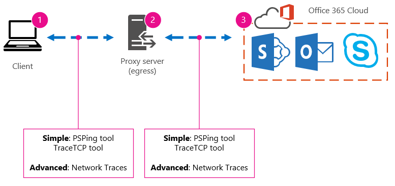

# Ajuste del rendimiento de Office 365 mediante líneas base y el historial de rendimiento

Hay algunas maneras sencillas de comprobar el rendimiento de la conexión entre Office 365 y su empresa que le permitirán establecer una línea base aproximada de su conectividad. Conocer el historial de rendimiento de las conexiones del equipo cliente puede ayudarle a detectar problemas emergentes de forma anticipada, identificar y predecir problemas.
  
Si no está acostumbrado a trabajar en problemas de rendimiento, este artículo está diseñado para ayudarle a tener en cuenta algunas preguntas comunes, como ¿Cómo sabe que el problema que está viendo es un problema de rendimiento y no un incidente de servicio de Office 365? ¿Cómo se puede planear un buen rendimiento a largo plazo? ¿Cómo puede mantenerse al tanto del rendimiento? If your team or clients are seeing slow performance while using Office 365, and you wonder about any of these questions, read on.
  
> [!IMPORTANT]
> **¿Tiene un problema de rendimiento entre su cliente y Office 365 en este momento?** Siga los pasos descritos en el plan de solución de problemas [de rendimiento para Office 365.](performance-troubleshooting-plan.md) 
    
## Algo que debe saber sobre el rendimiento de Office 365

Office 365 reside dentro de una red de Microsoft dedicada de alta capacidad que se supervisa continuamente no solo mediante automatización, sino por personas reales. Parte del rol de mantener la nube de Office 365 es mejorar el ajuste del rendimiento y optimizarlo donde sea posible. Dado que los clientes de la nube de Office 365 tienen que conectarse a través de Internet, hay un esfuerzo continuo para ajustar también el rendimiento en todos los servicios de Office 365. Las mejoras de rendimiento nunca se detienen realmente en la nube y hay una gran cantidad de experiencia acumulada para mantener la nube en buen estado y rápida. Si experimenta un problema de rendimiento al conectarse desde su ubicación a Office 365, es mejor no empezar con un caso de soporte técnico y esperarlo. En su lugar, debe empezar a investigar el problema desde "dentro hacia afuera". Es decir, empiece dentro de la red y salga de Office 365. Antes de abrir un caso con el Soporte técnico de Office 365, puede recopilar datos y realizar acciones que explorarán y pueden resolver el problema.
  
> [!IMPORTANT]
> Tenga en cuenta la planeación de capacidad y los límites de Office 365. Esa información te colocará por delante de la curva al intentar resolver un problema de rendimiento. Este es un vínculo a las descripciones del servicio [de Microsoft 365 y Office 365.](https://docs.microsoft.com/office365/servicedescriptions/office-365-service-descriptions-technet-library) Este es un concentrador central y todos los servicios ofrecidos por Office 365 tienen un vínculo que va a sus propias descripciones de servicio desde aquí. Esto significa que, si necesita ver los límites estándar para SharePoint Online, por ejemplo, debería hacer clic en Descripción del servicio [de SharePoint Online](https://technet.microsoft.com/library/sharepoint-online-service-description.aspx) y encontrar su sección Límites [de SharePoint Online.](https://go.microsoft.com/fwlink/p/?LinkID=856113) 
  
Asegúrate de entrar en la solución de problemas al comprender que el rendimiento es una escala deslizante, no se trata de lograr un valor idealizado y mantenerlo permanentemente (si crees que esto es así, en ocasiones las tareas de ancho de banda alto, como la incorporación de un gran número de usuarios, o realizar migraciones de datos grandes serán muy estresantes, así que planea las consecuencias en el rendimiento). Puedes y debes tener una idea aproximada de los objetivos de rendimiento, pero muchas variables juegan en el rendimiento, por lo tanto, el rendimiento varía. Esa es la naturaleza del rendimiento. 
  
La solución de problemas de rendimiento no se trata de cumplir objetivos específicos y mantener esos números indefinidamente, se trata de mejorar las actividades existentes, dadas todas las variables. 
  
## ¿Qué aspecto tiene un problema de rendimiento?

En primer lugar, debe asegurarse de que lo que está experimentando es realmente un problema de rendimiento y no un incidente de servicio. Un problema de rendimiento es diferente de un incidente de servicio en Office 365. Aquí te explicamos cómo diferenciarlos.
  
Si el servicio de Office 365 tiene problemas, es un incidente de servicio. You will see red or yellow icons under **Current health** in the Microsoft 365 admin center, you may also notice slow performance on client computers connecting to Office 365. Por ejemplo, si el estado actual  informa de un icono rojo y ve Investigando junto a Exchange, es posible que también reciba un montón de llamadas de personas de su organización que se quejan de que los buzones de cliente que usan Exchange Online están funcionando mal. En ese caso, es razonable suponer que el rendimiento de Exchange Online acaba de convertirse en una víctima de problemas dentro del servicio. 
  

  
En este punto, usted, el administrador de  Office 365, debe comprobar el estado actual y, a continuación, ver los detalles y el **historial,** con frecuencia, para mantenerse al día sobre el mantenimiento que llevamos a cabo en el sistema. El **panel de** estado actual se ha realizado para actualizarlo sobre los cambios y problemas en el servicio. Las notas y explicaciones escritas en el historial de mantenimiento, de administrador a administrador, están ahí para ayudarle a evaluar su impacto y para mantenerlo informado sobre el trabajo en curso. 
  

  
Un problema de rendimiento no es un incidente de servicio, aunque los incidentes pueden causar un rendimiento lento. Un problema de rendimiento tiene este aspecto:
  
- Se produce un problema de rendimiento  independientemente de lo que informe el estado actual del centro de administración para el servicio. 
    
-  Un comportamiento que antes era relativamente transparente tarda mucho tiempo en completarse o nunca se completa. 
    
- También puede replicar el problema o, al menos, sabe que ocurrirá si va a realizar la serie de pasos correcta.
    
-  Si el problema es intermitente, todavía hay un patrón, por ejemplo, sabe que antes de las 10:00 am tendrá llamadas de usuarios que no pueden acceder de forma confiable a Office 365 y que las llamadas se detendrán alrededor del mediodía. 
    
Probablemente esto suene familiar; quizás demasiado familiar. Una vez que sabe que es un problema de rendimiento, la pregunta es: "¿Qué hace a continuación?". El resto de este artículo le ayudará a determinar exactamente eso.
  
## Cómo definir y probar el problema de rendimiento

Los problemas de rendimiento suelen surgir con el tiempo, por lo que puede resultar difícil definir el problema real. Debes crear una buena declaración de problema y una buena idea del contexto del problema y, a continuación, debes repetir los pasos de prueba para ganar el día. De lo contrario, sin ningún error propio, puede perderse. ¿Por qué? Bueno, estos son algunos ejemplos de instrucciones de problemas que no proporcionan información suficiente:
  
- Cambiar de mi Bandeja de entrada a mi calendario era algo que no noté y ahora es una pausa. ¿Puede hacer que actúe como antes?
    
- La carga de mis archivos en SharePoint Online tarda una vez más. ¿Por qué es lento en la tarde, pero en cualquier otro momento, es rápido? ¿No puede ser tan rápido?
    
Existen varios desafíos importantes que se plantea en las instrucciones de problema anteriores. En concreto, hay muchas ambigüedades que tratar. Por ejemplo:
  
- No está claro cómo se usaba el cambio entre la Bandeja de entrada y el Calendario para actuar en el portátil.
    
- Cuando el usuario dice: "No puede ser rápido", ¿qué es "rápido"?
    
- ¿Cuánto tiempo es "para siempre"? ¿Son varios segundos o minutos, o podría el usuario ir a la comida y terminaría diez minutos después de que el usuario se recuperara?
    
Todo esto es sin tener en cuenta que el administrador y el solucionador de problemas no pueden tener en cuenta muchos detalles de instrucciones de problema como estas. Por ejemplo, cuando el problema empezó a ocurrir; Que el usuario trabaja desde casa y solo ve un cambio lento mientras está en una red doméstica; Que el usuario debe ejecutar varias otras aplicaciones de RAM intensivas en el cliente local, o que el usuario está ejecutando un sistema operativo anterior o que no ha ejecutado actualizaciones recientes.
  
Cuando los usuarios informan de un problema de rendimiento, hay una gran cantidad de información para recopilar. Recopilar esta información forma parte de un proceso denominado ámbito del problema o investigarlo. A continuación se muestra una lista de ámbitos básica que puede usar para recopilar información sobre el problema de rendimiento. Esta lista no es exhaustiva, pero es un lugar para empezar uno de los suyos propios: 
  
- ¿En qué fecha ocurrió el problema y en qué hora del día o de la noche?
    
- ¿Qué tipo de equipo cliente estaba usando y cómo se conecta a la red empresarial (VPN, cableada, inalámbrica)?
    
- ¿Estaba trabajando de forma remota o estaba en la oficina?
    
- ¿Ha intentado realizar las mismas acciones en otro equipo y ha visto el mismo comportamiento?
    
- Siga los pasos que le están dando los problemas para que pueda escribir las acciones que lleve a cabo.
    
- ¿Qué tan lento es el rendimiento en segundos o minutos?
    
- ¿Dónde se encuentra en el mundo?
    
Algunas de estas preguntas son más obvias que otras. La mayoría de los usuarios comprenderán que un solucionador de problemas necesita los pasos exactos para reproducir el problema. Después de todo, ¿cómo se puede registrar lo que está mal y cómo se puede probar si se ha corregido el problema? Menos obvias son las cosas como "¿Qué fecha y hora ha visto el problema?" y "¿Dónde se encuentra el mundo?", información que se puede usar conjuntamente. Según el momento en que el usuario estaba trabajando, unas horas de diferencia de tiempo puede significar que el mantenimiento ya está en curso en partes de la red de su empresa. Si, por ejemplo, su empresa tiene una implementación híbrida, como una búsqueda híbrida de SharePoint, que puede consultar índices de búsqueda tanto en SharePoint Online como en una instancia local de SharePoint Server 2013, es posible que haya actualizaciones en curso en la granja de servidores local. Si su empresa está en la nube, el mantenimiento del sistema puede incluir agregar o quitar hardware de red, implementar actualizaciones en toda la empresa o realizar cambios en DNS u otra infraestructura principal.
  
Al solucionar un problema de rendimiento, es un poco parecido a una escena delictiva, debes ser preciso y observador para extraer las conclusiones de las evidencias. Para ello, debe obtener una buena declaración de problema mediante la recopilación de pruebas. Debe incluir el contexto del equipo, el contexto del usuario, cuándo comenzó el problema y los pasos exactos que exponen el problema de rendimiento. Esta instrucción de problema debe ser y permanecer en la parte superior de las notas. Al volver a recorrer la declaración del problema después de trabajar en la resolución, está llevando a cabo los pasos para probar y demostrar si las acciones que lleva a cabo han resuelto el problema. Esto es fundamental para saber cuándo se realiza el trabajo.
  
## ¿Sabe cómo se ve el rendimiento cuando era bueno?

Si no está seguro, nadie lo sabe. Nadie tenía números. Eso significa que nadie puede responder a la sencilla pregunta "¿Cuántos segundos se tardaron en abrir una Bandeja de entrada en Office 365?", o "¿Cuánto tiempo tardaron los ejecutivos en tener una reunión de Lync Online?", que es un escenario común para muchas empresas.
  
Lo que falta aquí es una línea base de rendimiento.
  
Las líneas base le dan un contexto para su rendimiento. Debes tomar una línea base ocasionalmente a menudo, en función de las necesidades de tu empresa. Si es una empresa más grande, el equipo de operaciones puede tomar ya las líneas base para su entorno local. Por ejemplo, si se revisiones todos los servidores de Exchange el primer lunes del mes y todos los servidores de SharePoint el tercer lunes, es probable que el equipo de operaciones tenga una lista de tareas y escenarios que ejecuta después de la revisión, para demostrar que las funciones críticas están operativas. Por ejemplo, abrir la Bandeja de entrada, hacer clic en Enviar o recibir y asegurarse de que las carpetas se actualizan o, en SharePoint, explorar la página principal del sitio, ir a la página de búsqueda enterprise y realizar una búsqueda que devuelva resultados.
  
Si las aplicaciones están en Office 365, algunas de las líneas base más básicas que puede tomar miden el tiempo (en milisegundos) desde un equipo cliente dentro de la red hasta un punto de salida o el punto en el que sale de la red y sale a Office 365. Estas son algunas líneas base útiles que puede investigar y registrar:
  
- Identifique los dispositivos entre el equipo cliente y el punto de salida, por ejemplo, el servidor proxy.
    
  - Debes conocer los dispositivos para que tenga contexto (direcciones IP, tipo de dispositivo, etc.) para los problemas de rendimiento que surjan.
    
  - Los servidores proxy son puntos de salida comunes, por lo que puede comprobar el explorador web para ver qué servidor proxy está configurado para usar, si lo hay.
    
  - Existen herramientas de terceros que pueden detectar y asignar la red, pero la forma más segura de saber cuáles son los dispositivos es preguntar a un miembro del equipo de red.
    
- Identifique su proveedor de servicios de Internet (ISP), anote su información de contacto y pregunte cuántos circuitos tiene.
    
- Dentro de su empresa, identifique los recursos para los dispositivos entre el cliente y el punto de salida, o identifique un contacto de emergencia con el que hablar sobre problemas de red.
    
Estas son algunas líneas base que las pruebas sencillas con herramientas pueden calcular automáticamente:
  
- Tiempo desde el equipo cliente hasta el punto de salida en milisegundos
    
- Tiempo desde la salida a Office 365 en milisegundos
    
- Ubicación en el mundo del servidor que resuelve las direcciones URL de Office 365 al examinar
    
- La velocidad de la resolución DNS del ISP en milisegundos, incoherencias en la llegada de paquetes (vibración de red), tiempos de carga y descarga en milisegundos
    
Si no está familiarizado con cómo llevar a cabo estos pasos, detallaremos más detalles en este artículo. 
  
## ¿Qué es una línea base?

You'll know the impact when it goes bad, but if you don't know your historical performance data, it's not possible to have a context for how bad it may have become, and when. Por lo tanto, sin una línea base, te falta la pista clave para resolver el puzzle: la imagen en el cuadro del puzzle. En la solución de problemas de rendimiento, necesita un punto de *comparación.* Las líneas base de rendimiento sencillas no son difíciles de tomar. El equipo de operaciones puede tener la tarea de llevar a cabo estas tareas según una programación. Por ejemplo, supongamos que la conexión tiene este aspecto: 
  

  
Eso significa que ha comprobado con su equipo de red y ha descubierto que deja su empresa para Internet a través de un servidor proxy y que el proxy controla todas las solicitudes que el equipo cliente envía a la nube. En este caso, debes dibujar una versión simplificada de la conexión que enumera todos los dispositivos que intervienen. Ahora, inserte herramientas que pueda usar para probar el rendimiento entre el cliente, el punto de salida (donde deja la red para Internet) y la nube de Office 365.
  

  
Las opciones se enumeran como **sencillas** y avanzadas **debido** a la cantidad de experiencia que necesitas para encontrar los datos de rendimiento. Un seguimiento de red llevará mucho tiempo, en comparación con la ejecución de herramientas de línea de comandos como PsPing y TraceTCP. Estas dos herramientas de línea de comandos se han elegido porque no usan paquetes ICMP, que estarán bloqueados por Office 365, y porque dan el tiempo en milisegundos necesario para salir del equipo cliente o servidor proxy (si tiene acceso) y llegar a Office 365. Cada salto individual de un equipo a otro terminará con un valor de tiempo, y eso es excelente para líneas base. Igual de importante, estas herramientas de línea de comandos le permiten agregar un número de puerto al comando, esto es útil porque Office 365 se comunica a través del puerto 443, que es el puerto usado por capa de sockets seguros y seguridad de la capa de transporte (SSL y TLS). Sin embargo, otras herramientas de terceros pueden ser mejores soluciones para su situación. Microsoft no admite todas estas herramientas, por lo que si, por algún motivo, no puedes hacer que PsPing y TraceTCP funcionen, pasa a un seguimiento de red con una herramienta como Netmon. 
  
Puede tomar una línea base antes del horario comercial, de nuevo durante un uso intenso y, a continuación, de nuevo después del horario comercial. Esto significa que es posible que tenga una estructura de carpetas un poco similar a esta al final:
  

  
También debe elegir una convención de nomenclatura para los archivos. Aquí le mostramos otros ejemplos:
  
- Feb_09_2015_9amPST_PerfBaseline_Netmon_ClientToEgress_Normal
    
- Jan_10_2015_3pmCST_PerfBaseline_PsPing_ClientToO365_bypassProxy_SLOW
    
- Feb_08_2015_2pmEST_PerfBaseline_BADPerf
    
- Feb_08_2015_8-30amEST_PerfBaseline_GoodPerf
    
Hay muchas formas diferentes de hacerlo, pero el uso del formato **\<dateTime\>\<what's happening in the test\>** es un buen punto de inicio. Ser cuidadoso sobre esto le ayudará mucho cuando intente solucionar problemas más adelante. Más adelante, podrá decir "He tomado dos seguimientos el 8 de febrero, uno mostró un buen rendimiento y otro se mostró mal, por lo que podemos compararlos". Esto es muy útil para solucionar problemas. 
  
Debe tener una forma organizada para mantener las líneas base históricas. En este ejemplo, los métodos sencillos generaron tres salidas de línea de comandos y los resultados se recopilaron como capturas de pantalla, pero es posible que tenga archivos de captura de red en su lugar. Usa el método que mejor se adapte a ti. Almacene las líneas base históricas y remítalas en los puntos en los que observe cambios en el comportamiento de los servicios en línea. 
  
## ¿Por qué recopilar datos de rendimiento durante un piloto?

No hay mejor momento para empezar a hacer líneas base que durante una prueba piloto del servicio de Office 365. Su oficina puede tener miles de usuarios, cientos de miles o puede tener cinco, pero incluso con un número reducido de usuarios, puede realizar pruebas para medir las variaciones en el rendimiento. En el caso de una gran empresa, se puede proyectar hacia afuera una muestra representativa de varios cientos de usuarios que piloten Office 365 para que sepa dónde pueden surgir problemas antes de que ocurran.
  
En el caso de una pequeña empresa, donde la incorporación significa que todos los usuarios van al servicio al mismo tiempo y no hay ninguna prueba piloto, mantenga las medidas de rendimiento para que tenga datos que mostrar a cualquier persona que tenga que solucionar problemas de una operación con un mal rendimiento. Por ejemplo, si observa que de pronto puede recorrer el edificio en el tiempo que tarda en cargar un gráfico de tamaño mediano donde solía ocurrir muy rápidamente.
  
## Cómo recopilar líneas base

Para todos los planes de solución de problemas, necesita identificar estos aspectos como mínimo:
  
- El equipo cliente que está usando (el tipo de equipo o dispositivo, una dirección IP y las acciones que causaron el problema)
    
- Ubicación del equipo cliente en el mundo (por ejemplo, si este usuario está en una VPN a la red, trabajando de forma remota o en la intranet de la empresa)
    
- El punto de salida que el equipo cliente usa desde la red (el punto en el que el tráfico deja la empresa para un ISP o Internet)
    
 Puedes averiguar el diseño de la red del administrador de red. Si estás en una red pequeña, echa un vistazo a los dispositivos que te conectan a Internet y llama a tu ISP si tienes preguntas sobre el diseño. Crea un gráfico del diseño final de tu referencia. 
  
Esta sección se divide en métodos y herramientas de línea de comandos simples y opciones de herramientas más avanzadas. En primer lugar, hablaremos de métodos sencillos. Pero si tiene un problema de rendimiento en este momento, debe saltar a métodos avanzados y probar el plan de acción de solución de problemas de rendimiento de ejemplo.
  
### Métodos sencillos

El objetivo de estos métodos sencillos es aprender a tomar, comprender y almacenar correctamente líneas base de rendimiento simples con el tiempo para que se le informe sobre el rendimiento de Office 365. Este es el diagrama muy sencillo, como ya ha visto antes:
  

  
> [!NOTE]
> TraceTCP se incluye en esta captura de pantalla porque es una herramienta útil para mostrar, en milisegundos, cuánto tarda una solicitud en procesarse y cuántos saltos de red, o conexiones de un equipo al siguiente, tarda la solicitud en llegar a un destino. TraceTCP también puede proporcionar los nombres de los servidores usados durante los saltos, lo que puede resultar útil para un solucionador de problemas de Microsoft Office 365 en soporte técnico. > comandos TraceTCP pueden ser muy sencillos, como: >> Recuerde incluir el número de puerto  `tracetcp.exe outlook.office365.com:443` en el comando. > [TraceTCP](https://simulatedsimian.github.io/tracetcp_download.html) es una descarga gratuita, pero se basa en Wincap. Wincap es una herramienta que Netmon también usa e instala. También usamos Netmon en la sección de métodos avanzados. 
  
 Si tiene varias oficinas, también tendrá que conservar un conjunto de datos de un cliente en cada una de esas ubicaciones. Esta prueba mide la latencia, que en este caso es un valor numérico que describe la cantidad de tiempo entre un cliente que envía una solicitud a Office 365 y Office 365 que responde a la solicitud. Las pruebas se originan dentro de su dominio en un equipo cliente y busca medir un viaje de ida y vuelta desde dentro de la red, a través de un punto de salida, a través de Internet a Office 365 y de vuelta. 
  
Hay varias formas de abordar el punto de salida, en este caso, el servidor proxy. Puedes realizar un seguimiento de 1 a 2 y luego de 2 a 3 y, a continuación, agregar los números en milisegundos para obtener un total final al borde de la red. O bien, puede configurar la conexión para omitir el proxy para las direcciones de Office 365. En una red más grande con un firewall, un proxy inverso o una combinación de los dos, es posible que deba realizar excepciones en el servidor proxy que permitirán que el tráfico pase para una gran cantidad de direcciones URL. Para obtener la lista de puntos de conexión usados por Office 365, vea direcciones URL e intervalos de direcciones [IP de Office 365.](https://support.office.com/article/8548a211-3fe7-47cb-abb1-355ea5aa88a2) Si tiene un proxy de autenticación, empiece probando excepciones para lo siguiente:
  
- Puertos 80 y 443
    
- TCP y HTTPs
    
- Conexiones salientes a cualquiera de estas direcciones URL:
    
- \*.microsoftonline.com
    
- \*.microsoftonline-p.com
    
- \*.sharepoint.com
    
- \*.outlook.com
    
- \*.lync.com
    
- osub.microsoft.com
    
Todos los usuarios deben tener permiso para acceder a estas direcciones sin ninguna autenticación ni interferencias de proxy. En una red más pequeña, debe agregarlos a la lista de omisión de proxy en el explorador web. 
  
Para agregarlos a la lista de omisión de proxy en Internet Explorer, vaya **a** Herramientas de opciones de \> **Internet** \> **Configuración** \> **LAN avanzada.** \>  La pestaña avanzada también es donde encontrará el servidor proxy y el puerto del servidor proxy. Es posible que tenga que hacer clic en la casilla **Usar un servidor proxy para la LAN** para obtener acceso al **botón** Avanzado. Querrá asegurarse de que está activada la omisión del **servidor proxy para direcciones** locales. Una vez que **haga clic** en Avanzadas, verá un cuadro de texto donde puede escribir excepciones. Separe las direcciones URL con caracteres comodín enumeradas anteriormente con punto y coma, por ejemplo:
  
\*.microsoftonline.com; \*.sharepoint.com
  
Una vez que omita el proxy, podrá usar ping o PsPing directamente en una dirección URL de Office 365. El siguiente paso será probar el ping **outlook.office365.com**. O bien, si usa PsPing u otra herramienta que le permitirá proporcionar un número de puerto al comando, PsPing contra **portal.microsoftonline.com:443** para ver el tiempo promedio de ida y vuelta en milisegundos. 
  
El tiempo de ida y vuelta, o RTT, es un valor numérico que mide cuánto tiempo se tarda en enviar una solicitud HTTP a un servidor como outlook.office365.com y obtener una respuesta que reconozca que el servidor sabe que lo ha hecho. A veces verás esto abreviado como RTT. Debe ser una cantidad de tiempo relativamente corta.
  
Debe usar [PSPing](https://technet.microsoft.com/sysinternals/jj729731.aspx) u otra herramienta que no use paquetes ICMP bloqueados por Office 365 para realizar esta prueba. 
  
 **Cómo usar PsPing para obtener un tiempo de ida y vuelta general en milisegundos directamente desde una dirección URL de Office 365**
  
1. Para ejecutar un símbolo del sistema con privilegios elevados, siga estos pasos:
    
1. Haga clic en **Iniciar**.
    
2. En el **cuadro Iniciar búsqueda,** escriba cmd y, a continuación, presione CTRL+MAYÚS+ENTRAR.
    
3. Si aparece el cuadro de diálogo **Control de cuentas de usuario**, confirme que la acción que muestra es la que desea y, a continuación, haga clic en **Continuar**.
    
2. Navegue a la carpeta donde está instalada la herramienta (en este caso, PsPing) y pruebe estas direcciones URL de Office 365:
    
  - portal.office.com:443
    
  - microsoft-my.sharepoint.com:443
    
  - outlook.office365.com:443
    
  - www.yammer.com:443
    
    
  
Asegúrese de incluir el número de puerto 443. Recuerde que Office 365 funciona en un canal cifrado. Si psPing sin el número de puerto, se producirá un error en la solicitud. Una vez que hayas hecho ping en la lista corta, busca el tiempo promedio en milisegundos (ms). Eso es lo que quiere grabar.
  

  
Si no está familiarizado con la omisión de proxy y prefiere realizar las cosas paso a paso, primero debe averiguar el nombre del servidor proxy. En Internet Explorer, vaya a **Herramientas** \> **de opciones de Internet** \> **Conexiones** \> **laN configuración** \> **avanzada.** La **pestaña** Avanzadas es donde verá el servidor proxy en la lista. Haga ping a ese servidor proxy en un símbolo del sistema completando esta tarea: 
  
 **Para hacer ping al servidor proxy y obtener un valor de ida y vuelta en milisegundos para la fase 1 a la 2**
  
1. Para ejecutar un símbolo del sistema con privilegios elevados, siga estos pasos:
    
1. Haga clic en **Iniciar**.
    
2. En el **cuadro Iniciar búsqueda,** escriba cmd y, a continuación, presione CTRL+MAYÚS+ENTRAR.
    
3. Si aparece el cuadro de diálogo **Control de cuentas de usuario**, confirme que la acción que muestra es la que desea y, a continuación, haga clic en **Continuar**.
    
2. Escriba ping \<the name of the proxy server your browser uses, or the IP address of the proxy server\> y, a continuación, presione ENTRAR. Si tienes psPing o alguna otra herramienta instalada, puedes elegir usar esa herramienta en su lugar. 
    
    El comando puede ser parecido a cualquiera de estos ejemplos: 
    
  - ping ourproxy.ourdomain.industry.business.com
    
  - ping 155.55.121.55
    
  - ping ourproxy
    
  - ourproxy.ourdomain.industry.business.com:80
    
  - 155.55.121.55:80
    
  - crear ourproxy:80
    
3. Cuando el seguimiento deje de enviar paquetes de prueba, verá un pequeño resumen que enumera un promedio, en milisegundos, y ese es el valor que está buscando. Haga una captura de pantalla del mensaje y guárdelo con la convención de nomenclatura. En este punto, también puede ayudar a rellenar el diagrama con el valor.
    
Tal vez haya realizado un seguimiento en la mañana y su cliente pueda acceder rápidamente al proxy (o a cualquier servidor de salida que salga a Internet). En este caso, los números pueden tener este aspecto:
  

  
Si el equipo cliente es uno de los pocos seleccionados con acceso al servidor proxy (o de salida), puede ejecutar la siguiente sección de la prueba conectándose de forma remota a ese equipo, ejecutando el símbolo del sistema en PsPing a una dirección URL de Office 365 desde allí. Si no tiene acceso a ese equipo, puede ponerse en contacto con los recursos de red para obtener ayuda con la siguiente sección y obtener números exactos de esa manera. Si eso no es posible, tome un PsPing con la dirección URL de Office 365 en cuestión y compárelo con el tiempo de PsPing o Ping con el servidor proxy. 
  
Por ejemplo, si tiene 51,84 milisegundos desde el cliente a la dirección URL de Office 365 y tiene 2,8 milisegundos desde el cliente hasta el proxy (o el punto de salida), tiene 49,04 milisegundos desde la salida a Office 365. Del mismo modo, si tiene un PsPing de 12,25 milisegundos desde el cliente al proxy durante el alto del día y 62,01 milisegundos desde el cliente a la dirección URL de Office 365, el valor promedio para la salida de proxy a la dirección URL de Office 365 es de 49,76 milisegundos.
  

  
En términos de solución de problemas, es posible que encuentre algo interesante al conservar estas líneas base. Por ejemplo, si generalmente tiene entre 40 y 59 milisegundos de latencia desde el proxy o el punto de salida a la dirección URL de Office 365, y tener un cliente para proxy o una latencia de punto de salida de unos 3 a 7 milisegundos (dependiendo de la cantidad de tráfico de red que esté viendo durante esa hora del día), entonces sabrá que algo es problemático si los tres últimos clientes a proxy o líneas base de salida muestran una latencia de 45 milisegundos.
  
### Métodos avanzados

Si realmente quiere saber lo que sucede con sus solicitudes de Internet a Office 365, debe familiarizarse con los seguimientos de red. No importa qué herramientas prefiera para estos seguimientos, HTTPWatch, Netmon, Message Analyzer, Wireshark, Fiddler, Developer Dashboard o cualquier otra herramienta lo hará siempre que esa herramienta pueda capturar y filtrar el tráfico de red. Verá en esta sección que es conveniente ejecutar más de una de estas herramientas para obtener una imagen más completa del problema. Cuando realizas pruebas, algunas de estas herramientas también actúan como servidores proxy por sí mismos. Las herramientas usadas en el artículo complementario, Plan de solución de problemas de rendimiento para [Office 365](performance-troubleshooting-plan.md), incluyen [Netmon 3.4](https://www.microsoft.com/download/details.aspx?id=4865), [HTTPWatch](https://www.httpwatch.com/download/)o [WireShark](https://www.wireshark.org/).
  
Tomar una línea base de rendimiento es la parte simple de este método y muchos de los pasos son los mismos que cuando se soluciona un problema de rendimiento. Los métodos más avanzados de creación de líneas base para el rendimiento requieren que se tomen y almacenen seguimientos de red. La mayoría de los ejemplos de este artículo usan SharePoint Online, pero debe desarrollar una lista de acciones comunes en los servicios de Office 365 a los que se suscriba para probar y registrar. Este es un ejemplo de línea base:
  
- Lista de línea base para SPO - ** Paso 1: ** Examinar la página principal del sitio web de SPO y realizar un seguimiento de red. Guarde el seguimiento. 
    
- Lista de línea base para SPO- **Paso 2:** Buscar un término (como el nombre de la compañía) a través de Enterprise Search y realizar un seguimiento de red. Guarde el seguimiento. 
    
- Lista de línea base para SPO- **Paso 3:** Cargar un archivo grande en una biblioteca de documentos de SharePoint Online y realizar un seguimiento de red. Guarde el seguimiento. 
    
- Lista de línea base para SPO - **Paso 4:** Examinar la página principal del sitio web de OneDrive y realizar un seguimiento de red. Guarde el seguimiento. 
    
Esta lista debe incluir las acciones más importantes comunes que los usuarios llevan a cabo en SharePoint Online. Tenga en cuenta que el último paso, para realizar un seguimiento de cómo ir a OneDrive para la Empresa, se basa en una comparación entre la carga de la página principal de SharePoint Online (que a menudo las empresas personalizan) y la página principal de OneDrive para la Empresa, que rara vez se personaliza. Esta es una prueba muy básica cuando se trata de un sitio de SharePoint Online de carga lenta. Puedes crear un registro de esta diferencia en las pruebas.
  
Si se encuentra en medio de un problema de rendimiento, muchos de los pasos son los mismos que al tomar una línea base. Los seguimientos de red se convierten en fundamentales, por lo que controlaremos  *cómo*  realizar los seguimientos importantes a continuación. 
  
Para abordar un problema de  *rendimiento,*  en este momento, debe realizar un seguimiento en el momento en que experimenta el problema de rendimiento. Necesita tener las herramientas adecuadas disponibles para recopilar registros y necesita un plan de acción, es decir, una lista de acciones de solución de problemas que se deben realizar para recopilar la mejor información que pueda. Lo primero que hay que hacer es registrar la fecha y la hora de la prueba para que los archivos se puedan guardar en una carpeta que refleje el tiempo. A continuación, limite los pasos del problema por sí mismos. Estos son los pasos exactos que usarás para las pruebas. No olvide los conceptos básicos: si el problema solo es con Outlook, asegúrese de registrar que el comportamiento del problema se produce en un solo servicio de Office 365. Restringir el ámbito de este problema le ayudará a centrarse en algo que pueda resolver. 
  
## Vea también

[Administrar puntos de conexión de Office 365](https://support.office.com/article/99cab9d4-ef59-4207-9f2b-3728eb46bf9a)

