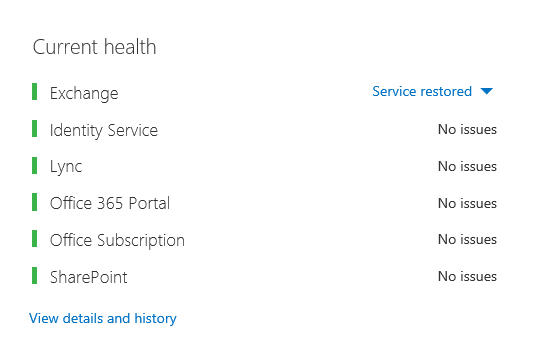

# Ajuste del rendimiento de Office 365 mediante líneas base y el historial de rendimientoOffice 365 performance tuning using baselines and performance history

Hay algunas maneras sencillas de comprobar el rendimiento de la conexión entre Office 365 y su empresa que le permitirán establecer una línea base aproximada de la conectividad.There are some simple ways to check the connection performance between Office 365 and your business that will let you establish a rough baseline of your connectivity. Conocer el historial de rendimiento de las conexiones del equipo cliente puede ayudarle a detectar problemas emergentes de forma anticipada, identificar y predecir problemas.Knowing the performance history of your client computer connections can help you detect emerging issues early, identify, and predict problems.
  
Si no está acostumbrado a trabajar en problemas de rendimiento, este artículo está diseñado para ayudarle a considerar algunas preguntas comunes, como ¿Cómo sabe que el problema que está viendo es un problema de rendimiento y no un incidente de servicio de Office 365?If you're not used to working on performance issues, this article is designed to help you consider some common questions, like How do you know the problem you're seeing is a performance issue and not an Office 365 service incident? ¿Cómo puede planear un buen rendimiento a largo plazo?How can you plan for good performance, long term? ¿Cómo puede estar atento al rendimiento?How can you keep an eye on performance? Si el equipo o los clientes ven un rendimiento lento al usar Office 365 y se pregunta por alguna de estas preguntas, siga leyendo.If your team or clients are seeing slow performance while using Office 365, and you wonder about any of these questions, read on.
  
> [!IMPORTANT]
> **¿Tiene un problema de rendimiento entre su cliente y Office 365 en este momento?****Have a performance issue between your client and Office 365 right now?** Siga los pasos descritos en el plan de solución de problemas de rendimiento [para Office 365](performance-troubleshooting-plan.md).Follow the steps outlined in the [Performance troubleshooting plan for Office 365](performance-troubleshooting-plan.md). 
    
## Algo que debe saber sobre el rendimiento de Office 365Something you should know about Office 365 performance

Office 365 vive dentro de una red de Microsoft dedicada de alta capacidad que se supervisa constantemente no solo mediante la automatización, sino por personas reales.Office 365 lives inside a high-capacity, dedicated Microsoft network that is steadily monitored not just by automation, but by real people. Parte del rol de mantenimiento de la nube de Office 365 es la optimización y optimización del rendimiento de la creación cuando sea posible.Part of the role of maintaining the Office 365 cloud is building-in performance tuning and streamlining where it's possible. Dado que los clientes de la nube de Office 365 tienen que conectarse a través de Internet, también hay un esfuerzo continuo para ajustar el rendimiento en todos los servicios de Office 365.Since clients of the Office 365 cloud have to connect across the Internet, there is a continuous effort to fine-tune the performance across Office 365 services too. Las mejoras de rendimiento nunca se detienen realmente en la nube y hay una gran cantidad de experiencia acumulada para mantener la nube en buen estado y rápido.Performance improvements never really stop in the cloud, and there is a lot of accumulated experience with keeping the cloud healthy and quick. Si experimenta un problema de rendimiento al conectarse desde su ubicación a Office 365, lo mejor es no empezar con un caso de soporte técnico y esperarlo.Should you experience a performance issue connecting from your location to Office 365, it's best not to start with, and wait on, a Support case. En su lugar, debe empezar a investigar el problema desde "desde dentro hacia fuera".Instead, you should begin investigating the problem from 'the inside out'. Es decir, comience dentro de la red y salga a Office 365.That is, start inside of your network, and work your way out to Office 365. Antes de abrir un caso con soporte técnico de Office 365, puede recopilar datos y realizar acciones que explorarán y pueden resolver el problema.Before you open a case with Office 365 Support, you can gather data and take actions that will explore, and may resolve, your problem.
  
> [!IMPORTANT]
> Tenga en cuenta la planeación de capacidad y los límites en Office 365.Be aware of capacity planning and limits in Office 365. Esa información le pondrá por delante de la curva al intentar resolver un problema de rendimiento.That information will put you ahead of the curve when trying to resolve a performance issue. Este es un vínculo a las descripciones de servicio de [Microsoft 365 y Office 365](/office365/servicedescriptions/office-365-service-descriptions-technet-library).Here's a link to the [Microsoft 365 and Office 365 service descriptions](/office365/servicedescriptions/office-365-service-descriptions-technet-library). Este es un concentrador central y todos los servicios ofrecidos por Office 365 tienen un vínculo que va a sus propias descripciones de servicio desde aquí.This is a central hub, and all the services offered by Office 365 have a link that goes to their own Service Descriptions from here. Es decir, si necesita ver los límites estándar de SharePoint Online, por ejemplo, haga clic en Descripción del servicio [de SharePoint Online](/office365/servicedescriptions/sharepoint-online-service-description/sharepoint-online-service-description) y busque su sección [Límites de SharePoint Online](/office365/servicedescriptions/sharepoint-online-service-description/sharepoint-online-limits).That means, should you need to see the standard limits for SharePoint Online, for example, you would click [SharePoint Online Service Description](/office365/servicedescriptions/sharepoint-online-service-description/sharepoint-online-service-description) and locate its [SharePoint Online Limits section](/office365/servicedescriptions/sharepoint-online-service-description/sharepoint-online-limits). 
  
Asegúrese de ir a la solución de problemas con la comprensión de que el rendimiento es una escala deslizante, no se trata de lograr un valor idealizado y mantenerlo permanentemente (si cree que esto es así, las tareas ocasionales de ancho de banda alto, como la incorporación de un gran número de usuarios o la realización de migraciones de datos grandes serán muy estresantes, así que planee los impactos en el rendimiento entonces).Make sure you go into your troubleshooting with the understanding that performance is a sliding scale, it's not about achieving an idealized value and maintaining it permanently (if you believe this is so, then occasional high-bandwidth tasks like on-boarding a large number of users, or doing large data migrations will be very stressful -- so do plan for performance impacts then). Puede y debe tener una idea aproximada de los objetivos de rendimiento, pero muchas variables se reproducen en el rendimiento, por lo tanto, el rendimiento varía.You can, and should, have a rough idea of your performance targets, but a lot of variables play into performance, therefore, performance varies. Esa es la naturaleza del rendimiento.That's the nature of performance. 
  
La solución de problemas de rendimiento no se trata de cumplir objetivos específicos y mantener esos números indefinidamente, se trata de mejorar las actividades existentes, dadas todas las variables.Performance troubleshooting isn't about meeting specific goals and maintaining those numbers indefinitely, it's about improving existing activities, given all the variables. 
  
## ¿Cómo es un problema de rendimiento?Okay, what does a performance problem look like?

En primer lugar, debe asegurarse de que lo que está experimentando es realmente un problema de rendimiento y no un incidente de servicio.First, you need to make sure that what you are experiencing is indeed a performance issue and not a service incident. Un problema de rendimiento es diferente de un incidente de servicio en Office 365.A performance problem is different from a service incident in Office 365. Este es el modo de diferenciarlos.Here's how to tell them apart.
  
Si el servicio de Office 365 tiene problemas, es un incidente de servicio.If the Office 365 service is having issues, that's a service incident. Verá iconos rojos o  amarillos en Estado actual en el Centro de administración de Microsoft 365, también puede observar un rendimiento lento en los equipos cliente que se conectan a Office 365.You will see red or yellow icons under **Current health** in the Microsoft 365 admin center, you may also notice slow performance on client computers connecting to Office 365. Por ejemplo, si estado actual informa  de un icono rojo y ve Investigar junto a Exchange, es posible que también reciba un montón de llamadas de personas de su organización que se quejan de que los buzones de cliente que usan Exchange Online están funcionando mal.For example, if Current health reports a red icon and you see **Investigating** beside Exchange, you might then also receive a bunch of calls from people in your organization who complain that client mailboxes that use Exchange Online are performing badly. En ese caso, es razonable suponer que el rendimiento de Exchange Online acaba de convertirse en una víctima de problemas dentro del Servicio.In that case, it's reasonable to assume that your Exchange Online performance just became a victim of issues within the Service. 
  

  
En este momento, usted, el administrador de  Office 365, debe comprobar estado actual y, a continuación, ver detalles e **historial,** con frecuencia, para mantenerse al día del mantenimiento que llevamos a cabo en el sistema.At this point, you, the Office 365 admin, should check **Current health** and then **View details and history**, frequently, to keep up to date on maintenance we perform on the system. El **panel de mantenimiento** actual se ha realizado para actualizarlo acerca de los cambios y problemas en el servicio.The **Current health** dashboard was made to update you about changes to, and problems in, the service. Las notas y explicaciones escritas en el historial de mantenimiento, de administrador a administrador, están ahí para ayudarle a medir su impacto y para mantenerte informado sobre el trabajo en curso.The notes and explanations written to health history, admin to admin, are there to help you gauge your impact, and to keep you posted about ongoing work. 
  

  
Un problema de rendimiento no es un incidente de servicio, aunque los incidentes pueden causar un rendimiento lento.A performance issue isn't a service incident, even though incidents can cause slow performance. Un problema de rendimiento tiene este aspecto:A performance issue looks like this:
  
- Se produce un problema de rendimiento independientemente de lo que informe el centro de **administración** Estado actual del servicio.A performance issue occurs no matter what the admin center **Current health** is reporting for the service. 
    
-  Un comportamiento que solía ser relativamente transparente tarda mucho tiempo en completarse o nunca se completa.A behavior that used to be relatively seamless takes a long time to complete or never completes. 
    
- También puede replicar el problema o, al menos, sabe que ocurrirá si hace la serie correcta de pasos.You can replicate the problem too, or, at least, you know it will happen if you do the right series of steps.
    
-  Si el problema es intermitente, todavía hay un patrón, por ejemplo, sabe que a las 10:00 a.m. tendrá llamadas de usuarios que no pueden acceder de forma confiable a Office 365 y que las llamadas se detendrán alrededor del mediodía.If the problem is intermittent, there is still a pattern, for example, you know that by 10:00 AM you will have calls from users who can't reliably access Office 365, and that the calls will die down around noon. 
    
Esto probablemente suena familiar; quizás demasiado familiar.This probably sounds familiar; maybe too familiar. Una vez que sepas que es un problema de rendimiento, la pregunta pasa a ser: "¿Qué haces a continuación?".Once you know it's a performance problem, the question becomes, "What do you do next?" El resto de este artículo le ayuda a determinar exactamente eso.The rest of this article helps you determine exactly that.
  
## Cómo definir y probar el problema de rendimientoHow to define and test the performance problem

Los problemas de rendimiento suelen surgir con el tiempo, por lo que puede resultar difícil definir el problema real.Performance issues often emerge over time, so it can be challenging to define the actual problem. Debe crear una buena instrucción de problema y una buena idea del contexto del problema y, a continuación, debe repetir los pasos de prueba para ganar el día.You need to create a good problem statement and a good idea of issue context, and then you need to repeatable testing steps to win the day. De lo contrario, si no hay ningún error propio, es posible que se pierda.Otherwise, through no fault of your own, you may be lost. ¿Por qué?Why? Bueno, estos son algunos ejemplos de instrucciones de problemas que no proporcionan suficiente información:Well, here are some examples of problems statements that don't provide enough information:
  
- Cambiar de la Bandeja de entrada a mi calendario solía ser algo que no noté y ahora es un descanso.Switching from my Inbox to my Calendar used to be something I didn't notice, and now it's a coffee-break. ¿Puede hacer que actúe como antes?Can you make it act like it used to?
    
- Cargar mis archivos en SharePoint Online tarda para siempre.Uploading my files to SharePoint Online is taking forever. ¿Por qué es lento en la tarde, pero en cualquier otro momento, es rápido?Why is it slow in the afternoon, but any other time, it's fast? ¿No puede ser rápido?Can't it just be fast?
    
Las instrucciones de problema anteriores plantean varios desafíos de gran tamaño.There are several large challenges posed by the problem statements above. En concreto, hay muchas ambigüedades que tratar.Specifically, there are a lot of ambiguities to deal with. Por ejemplo:for example:
  
- No está claro cómo se usaba el cambio entre bandeja de entrada y calendario para actuar en el portátil.It's unclear how switching between Inbox and Calendar used to act on the laptop.
    
- Cuando el usuario dice: "¿No puede ser rápido?", ¿qué es "rápido"?When the user says, "Can't it just be fast", what's "fast"?
    
- ¿Cuánto tiempo es "para siempre"?How long is "forever"? ¿Son varios segundos, minutos o podría el usuario ir al almuerzo y terminaría diez minutos después de que el usuario vuelva?Is that several seconds, or minutes, or could the user go to lunch and it would finish up ten minutes after the user got back?
    
Todo esto es sin tener en cuenta que el administrador y el solucionador de problemas no pueden tener en cuenta muchos detalles de instrucciones de problema como estas.All of this is without considering that the admin and troubleshooter can't be aware of many details from problem statements like these. Por ejemplo, cuando el problema comenzó a suceder; Que el usuario funciona desde casa y solo ve un cambio lento mientras está en una red doméstica; Que el usuario debe ejecutar varias otras aplicaciones intensivas de RAM en el cliente local, o que el usuario ejecuta un sistema operativo anterior o que no ha ejecutado actualizaciones recientes.For example, when the problem started happening; That the user works from home and only ever sees slow switching while on a home network; That the user must run several other RAM intensive applications on the local client, or the user is running an older operating system or hasn't run recent updates.
  
Cuando los usuarios informan de un problema de rendimiento, hay mucha información que recopilar.When users report a performance problem, there's a lot of information to collect. Recopilar esta información forma parte de un proceso denominado ámbito del problema o investigarlo.Collecting this information is part of a process called scoping the issue, or investigating it. A continuación se muestra una lista básica de ámbitos que puede usar para recopilar información sobre el problema de rendimiento.The following is a basic scoping list you can use to collect information about your performance issue. Esta lista no es exhaustiva, pero es un lugar para empezar uno de los suyos:This list is not exhaustive, but it's a place to start one of your own: 
  
- ¿En qué fecha se ha sucedido el problema y en qué hora del día o de la noche?On what date did the issue happen, and around what time of day or night?
    
- ¿Qué tipo de equipo cliente estaba usando y cómo se conecta a la red empresarial (VPN, Wired, Wireless)?What kind of client computer were you using, and how does it connect to the business network (VPN, Wired, Wireless)?
    
- ¿Estaba trabajando de forma remota o estaba en la oficina?Were you working remotely or were you in the office?
    
- ¿Ha hecho las mismas acciones en otro equipo y ha visto el mismo comportamiento?Did you try the same actions on another computer and see the same behavior?
    
- Siga los pasos que le están dando problemas para que pueda escribir las acciones que lleve a cabo.Walk through the steps that are giving you the trouble so that you can write the actions you take down.
    
- ¿Qué tan lento es el rendimiento en segundos o minutos?How slow in seconds or minutes is the performance?
    
- ¿Dónde se encuentra en el mundo?Where in the world are you located?
    
Algunas de estas preguntas son más obvias que otras.Some of these questions are more obvious than others. La mayoría de los usuarios comprenderán que un solucionador de problemas necesita los pasos exactos para reproducir el problema.Most everyone will understand a troubleshooter needs the exact steps to reproduce the issue. Después de todo, ¿cómo se puede registrar lo que está mal y cómo probar si se soluciona el problema?After all, how else can you record what's wrong, and how else can you test if the issue is fixed? Menos obvias son las cosas como "¿Qué fecha y hora ha visto el problema?", y "¿Dónde se encuentra?", información que se puede usar en tándem.Less obvious are things like "What date and time did you see the issue?", and "Where in the world are you located?", information that can be used in tandem. Según el momento en que el usuario estaba trabajando, unas pocas horas de diferencia de tiempo puede significar que el mantenimiento ya está en curso en partes de la red de su empresa.Depending on when the user was working, a few hours of time difference may mean maintenance is already underway on parts of your company's network. Si, por ejemplo, su empresa tiene una implementación híbrida, como una búsqueda híbrida de SharePoint, que puede consultar índices de búsqueda en SharePoint Online y una instancia local de SharePoint Server 2013, es posible que las actualizaciones se den en curso en la granja de servidores local.If, for example, your company has a hybrid implementation, like a hybrid SharePoint Search, which can query search indexes in both SharePoint Online and an On-premises SharePoint Server 2013 instance, updates may be underway in the on-premises farm. Si su empresa está en la nube, el mantenimiento del sistema puede incluir agregar o quitar hardware de red, implementar actualizaciones en toda la empresa o realizar cambios en DNS u otra infraestructura principal.If your company is all in the cloud, system maintenance may include adding or removing network hardware, rolling out updates that are company-wide, or making changes to DNS, or other core infrastructure.
  
Cuando está solucionando un problema de rendimiento, es un poco como una escena del crimen, debe ser preciso y observador para extraer conclusiones de la evidencia.When you're troubleshooting a performance problem, it's a bit like a crime scene, you need to be precise and observant to draw any conclusions from the evidence. Para ello, debe obtener una buena declaración de problema mediante la recopilación de pruebas.In order to do this, you must get a good problem statement by gathering evidence. Debe incluir el contexto del equipo, el contexto del usuario, cuándo comenzó el problema y los pasos exactos que exponen el problema de rendimiento.It should include the computer's context, the user's context, when the problem began, and the exact steps that exposed the performance issue. Esta instrucción de problema debe ser, y permanecer, la página superior de las notas.This problem statement should be, and stay, the topmost page in your notes. Al volver a recorrer la instrucción de problema después de trabajar en la resolución, está llevando a cabo los pasos para probar y demostrar si las acciones que lleva a cabo han resuelto el problema.By walking through the problem statement again after you work on the resolution, you are taking the steps to test and prove whether the actions you take have resolved the issue. Esto es fundamental para saber cuándo se realiza el trabajo.This is critical to knowing when your work, there, is done.
  
## ¿Sabe cómo se ve el rendimiento cuando era bueno?Do you know how performance used to look when it was good?

Si no tiene suerte, nadie lo sabe.If you're unlucky, nobody knows. Nadie tenía números.Nobody had numbers. Eso significa que nadie puede responder a la pregunta sencilla "¿Cuántos segundos se tardaron en abrir una Bandeja de entrada en Office 365?", o "¿Cuánto tiempo tardaron los ejecutivos en tener una reunión de Lync Online?", que es un escenario común para muchas empresas.That means nobody can answer the simple question "About how many seconds did it used to take to bring up an Inbox in Office 365?", or "How long did it used to take when the Executives had a Lync Online meeting?", which is a common scenario for many companies.
  
Lo que falta aquí es una línea base de rendimiento.What's missing here is a performance baseline.
  
Las líneas base le dan un contexto para el rendimiento.Baselines give you a context for your performance. Debe tomar una línea base de vez en cuando a con frecuencia, según las necesidades de su empresa.You should take a baseline occasionally to frequently, depending on the needs of your company. Si es una empresa más grande, el equipo de operaciones puede tomar ya las líneas base para su entorno local.If you are a larger company, your Operations team may take baselines for your on-premises environment already. Por ejemplo, si se revisiones todos los servidores de Exchange el primer lunes del mes y todos los servidores de SharePoint el tercer lunes, el equipo de operaciones probablemente tenga una lista de tareas y escenarios que ejecuta después de la revisión, para demostrar que las funciones críticas están operativas.For example, if you patch all the Exchange servers on the first Monday of the month, and all your SharePoint servers on the third Monday, your Operations team probably has a list of tasks and scenarios it runs post-patching, to prove that critical functions are operational. Por ejemplo, abrir la Bandeja de entrada, hacer clic en Enviar o recibir y asegurarse de que las carpetas se actualicen o, en SharePoint, explorar la página principal del sitio, ir a la página de búsqueda de empresa y realizar una búsqueda que devuelva resultados.For example, opening the Inbox, clicking Send/Receive, and making sure the folders update, or, in SharePoint, browsing the main page of the site, going into the enterprise Search page, and doing a search that returns results.
  
Si las aplicaciones se encuentran en Office 365, algunas de las líneas base más fundamentales pueden medir el tiempo (en milisegundos) desde un equipo cliente dentro de la red, hasta un punto de salida o el punto en el que sale de la red y sale a Office 365.If your applications are in Office 365, some of the most fundamental baselines you can take measure the time (in milliseconds) from a client computer inside your network, to an egress point, or the point where you leave your network and go out to Office 365. Estas son algunas líneas base útiles que puede investigar y registrar:Here are some helpful baselines that you can investigate and record:
  
- Identifique los dispositivos entre el equipo cliente y el punto de salida, por ejemplo, el servidor proxy.Identify the devices between your client computer and your egress point, for example, your proxy server.
    
  - Debes conocer los dispositivos para que tenga contexto (direcciones IP, tipo de dispositivo, etc.) para los problemas de rendimiento que se presenten.You need to know your devices so that you have context (IP addresses, type of device, et cetera) for performance problems that arise.
    
  - Los servidores proxy son puntos de salida comunes, por lo que puede comprobar el explorador web para ver qué servidor proxy está configurado para usar, si lo hay.Proxy servers are common egress points, so you can check your web browser to see what proxy server it is set to use, if any.
    
  - Existen herramientas de terceros que pueden detectar y asignar la red, pero la forma más segura de conocer los dispositivos es preguntar a un miembro del equipo de red.There are third party tools that can discover and map your network, but the safest way to know your devices is to ask a member of your network team.
    
- Identifique su proveedor de servicios de Internet (ISP), anote su información de contacto y pregunte cuántos circuitos tiene el ancho de banda.Identify your Internet service provider (ISP), write down their contact information, and ask how many circuits how much bandwidth you have.
    
- Dentro de la empresa, identifique los recursos para los dispositivos entre el cliente y el punto de salida, o identifique un contacto de emergencia con el que hablar sobre problemas de red.Inside your company, identify resources for the devices between your client and the egress point, or identify an emergency contact to talk to about networking issues.
    
Estas son algunas líneas base que las pruebas sencillas con herramientas pueden calcular por usted:Here are some baselines that simple testing with tools can calculate for you:
  
- Tiempo desde el equipo cliente hasta el punto de salida en milisegundosTime from your client computer to your egress point in milliseconds
    
- El tiempo desde la salida apunta a Office 365 en milisegundosTime from your egress point to Office 365 in milliseconds
    
- Ubicación en el mundo del servidor que resuelve las direcciones URL de Office 365 al examinarLocation in the world of the server that resolves the URLS for Office 365 when you browse
    
- La velocidad de la resolución DNS del ISP en milisegundos, incoherencias en la llegada de paquetes (vibración de red), tiempos de carga y descarga en milisegundosThe speed of your ISP's DNS resolution in milliseconds, inconsistencies in packet arrival (network jitter), upload and download times in milliseconds
    
Si no está familiarizado con cómo llevar a cabo estos pasos, vamos a entrar en más detalles en este artículo.If you're unfamiliar with how to carry out these steps, we'll go into more detail in this article. 
  
## ¿Qué es una línea base?What is a baseline?

Conocerá el impacto cuando salga mal, pero si no conoce los datos de rendimiento históricos, no es posible tener un contexto de lo malo que puede haber sido y cuándo.You'll know the impact when it goes bad, but if you don't know your historical performance data, it's not possible to have a context for how bad it may have become, and when. Por lo tanto, sin una línea base, te falta la clave para resolver el puzzle: la imagen en el cuadro del puzzle.So without a baseline, you're missing the key clue to solve the puzzle: the picture on the puzzle box. En la solución de problemas de rendimiento, necesita un punto de  *comparación*  .In performance troubleshooting, you need a point of  *comparison*  . Las líneas base de rendimiento simples no son difíciles de tomar.Simple performance baselines aren't difficult to take. El equipo de operaciones puede tener la tarea de llevar a cabo estas tareas en una programación.Your Operations team can be tasked with carrying these out on a schedule. Por ejemplo, supongamos que la conexión tiene este aspecto:For example, let's say your connection looks like this: 
  

  
Eso significa que ha comprobado con su equipo de red y ha descubierto que deja su empresa para Internet a través de un servidor proxy y que el proxy controla todas las solicitudes que el equipo cliente envía a la nube.That means you've checked with your network team and found out that you leave your company for the Internet through a proxy server, and that proxy handles all the requests your client computer sends to the cloud. En este caso, debe dibujar una versión simplificada de la conexión que enumera todos los dispositivos que intervienen.In this case, you should draw a simplified version of your connection that lists all the intervening devices. Ahora, inserte las herramientas que puede usar para probar el rendimiento entre el cliente, el punto de salida (donde deja la red para Internet) y la nube de Office 365.Now, insert tools that you can use to test the performance between the client, the egress point (where you leave your network for the Internet), and the Office 365 cloud.
  

  
Las opciones se enumeran como **Simple** y **Advanced** debido a la cantidad de experiencia que necesita para encontrar los datos de rendimiento.The options are listed as **Simple** and **Advanced** because of the amount of expertise you need in order to find the performance data. Un seguimiento de red llevará mucho tiempo, en comparación con la ejecución de herramientas de línea de comandos como PsPing y TraceTCP.A network trace will take a lot of time, compared to running command-line tools like PsPing and TraceTCP. Estas dos herramientas de línea de comandos se han elegido porque no usan paquetes ICMP, que estarán bloqueados por Office 365, y porque dan el tiempo en milisegundos que se tarda en salir del equipo cliente o del servidor proxy (si tiene acceso) y llegar a Office 365.These two command-line tools were chosen because they don't use ICMP packets, which will be blocked by Office 365, and because they give the time in milliseconds that it takes to leave the client computer, or proxy server (if you have access) and arrive at Office 365. Cada salto individual de un equipo a otro terminará con un valor de tiempo, y eso es ideal para las líneas base.Each individual hop from one computer to another will end up with a time value, and that's great for baselines! Igual de importante, estas herramientas de línea de comandos le permiten agregar un número de puerto al comando, esto es útil porque Office 365 se comunica a través del puerto 443, que es el puerto que usa la capa de sockets seguros y la seguridad de la capa de transporte (SSL y TLS).Just as importantly, these command-line tools allow you to add a port number onto the command, this is useful because Office 365 communicates over port 443, which is the port used by Secure Sockets Layer and Transport Layer Security (SSL and TLS). Sin embargo, otras herramientas de terceros pueden ser mejores soluciones para su situación.However, other third-party tools may be better solutions for your situation. Microsoft no admite todas estas herramientas, por lo que si, por algún motivo, no puede hacer que PsPing y TraceTCP funcionen, pase a un seguimiento de red con una herramienta como Netmon.Microsoft doesn't support all of these tools, so if, for some reason, you can't get PsPing and TraceTCP working, move on to a network trace with a tool like Netmon. 
  
Puede tomar una línea base antes del horario laboral, de nuevo durante el uso intenso y, a continuación, de nuevo después del horario laboral.You can take a baseline before business hours, again during heavy use, and then again after hours. Esto significa que puede tener una estructura de carpetas que tenga un aspecto similar al siguiente al final:This means you may have a folder structure that looks a bit like this in the end:
  

  
También debe elegir una convención de nomenclatura de los archivos.You should also pick a naming convention your files. Aquí le mostramos otros ejemplos:Here are some examples:
  
- Feb_09_2015_9amPST_PerfBaseline_Netmon_ClientToEgress_NormalFeb_09_2015_9amPST_PerfBaseline_Netmon_ClientToEgress_Normal
    
- Jan_10_2015_3pmCST_PerfBaseline_PsPing_ClientToO365_bypassProxy_SLOWJan_10_2015_3pmCST_PerfBaseline_PsPing_ClientToO365_bypassProxy_SLOW
    
- Feb_08_2015_2pmEST_PerfBaseline_BADPerfFeb_08_2015_2pmEST_PerfBaseline_BADPerf
    
- Feb_08_2015_8-30amEST_PerfBaseline_GoodPerfFeb_08_2015_8-30amEST_PerfBaseline_GoodPerf
    
Hay muchas maneras diferentes de hacerlo, pero el uso del formato **\<dateTime\>\<what's happening in the test\>** es un buen lugar para empezar.There are lots of different ways to do this, but using the format **\<dateTime\>\<what's happening in the test\>** is a good place to start. Ser diligente con esto ayudará mucho cuando intente solucionar problemas más adelante.Being diligent about this will help a lot when you are trying to troubleshoot issues later. Más adelante, podrá decir "El 8 de febrero hice dos seguimientos, uno mostró un buen rendimiento y otro se mostró mal, por lo que podemos compararlos".Later, you'll be able to say "I took two traces on February 8th, one showed good performance and one showed bad, so we can compare them". Esto es extremadamente útil para solucionar problemas.This is extremely helpful for troubleshooting. 
  
Debe tener una forma organizada de mantener las líneas base históricas.You need to have an organized way to keep your historical baselines. En este ejemplo, los métodos simples produjeron tres salidas de línea de comandos y los resultados se recopilaron como capturas de pantalla, pero es posible que tenga archivos de captura de red en su lugar.In this example, the simple methods produced three command line outputs and the results were collected as screen shots, but you may have network capture files instead. Use el método que mejor se adapte a usted.Use the method that works best for you. Almacene las líneas base históricas y haga referencia a ellas en los puntos en los que observe cambios en el comportamiento de los servicios en línea.Store your historical baselines and refer to them at points where you notice changes in the behavior of online services. 
  
## ¿Por qué recopilar datos de rendimiento durante un piloto?Why collect performance data during a pilot?

No hay mejor momento para empezar a hacer líneas base que durante un piloto del servicio de Office 365.There is no better time to start making baselines than during a pilot of the Office 365 service. Su oficina puede tener miles de usuarios, cientos de miles o puede tener cinco, pero incluso con un número reducido de usuarios, puede realizar pruebas para medir las variaciones en el rendimiento.Your office may have thousands of users, hundreds of thousands, or it may have five, but even with a small number of users, you can perform tests to measure fluctuations in performance. En el caso de una empresa grande, una muestra representativa de varios cientos de usuarios que pilota Office 365 se puede proyectar hacia fuera a varios miles para que sepa dónde pueden surgir problemas antes de que sucedan.In the case of a large company, a representative sample of several hundred users piloting Office 365 can be projected outward to several thousands so you know where issues might arise before they happen.
  
En el caso de una pequeña empresa, donde el internado significa que todos los usuarios van al servicio al mismo tiempo y no hay ningún piloto, mantenga las medidas de rendimiento para que tenga datos que mostrar a cualquier persona que pueda tener que solucionar problemas de una operación de mal rendimiento.In the case of a small company, where on-boarding means that all users go to the service at the same time and there is no pilot, keep performance measures so that you have data to show to anyone who may have to troubleshoot a badly performing operation. Por ejemplo, si observa que de repente puede recorrer el edificio en el tiempo que tarda en cargar un gráfico de tamaño mediano donde solía ocurrir muy rápidamente.For example, if you notice that all of a sudden you can walk around your building in the time it takes to upload a medium-sized graphic where it used to happen very quickly.
  
## Cómo recopilar líneas baseHow to collect baselines

Para todos los planes de solución de problemas, debe identificar estas cosas como mínimo:For all troubleshooting plans you need to identify these things at a minimum:
  
- El equipo cliente que está usando (el tipo de equipo o dispositivo, una dirección IP y las acciones que provocaron el problema)The client computer you're using (the type of computer or device, an IP address, and the actions that caused the issue)
    
- Donde se encuentra el equipo cliente en el mundo (por ejemplo, si este usuario en una VPN a la red, trabajando de forma remota o en la intranet de la empresa)Where the client computer is located in the world (for example, whether this user on a VPN to the network, working remotely, or on the company intranet)
    
- El punto de salida que el equipo cliente usa desde la red (el punto en el que el tráfico deja su negocio para un ISP o Internet)The egress point the client computer uses from your network (the point at which traffic leaves your business for an ISP or the Internet)
    
 Puede averiguar el diseño de la red desde el administrador de red.You can find out the layout of your network from the network administrator. Si estás en una red pequeña, echa un vistazo a los dispositivos que te conectan a Internet y llama a tu ISP si tienes preguntas sobre el diseño.If you're on a small network, take a look at the devices connecting you to the Internet, and call your ISP if you have questions about the layout. Cree un gráfico del diseño final de la referencia.Create a graphic of the final layout for your reference. 
  
Esta sección se divide en métodos y herramientas de línea de comandos sencillas y opciones de herramientas más avanzadas.This section is broken into simple command-line tools and methods, and more advanced tools options. En primer lugar, cubriremos métodos sencillos.We'll cover simple methods first. Pero si tiene un problema de rendimiento en este momento, debe ir a métodos avanzados y probar el plan de acción de solución de problemas de rendimiento de ejemplo.But if you've got a performance problem right now, you should jump to advanced methods and try out the sample performance-troubleshooting action plan.
  
### Métodos sencillosSimple methods

El objetivo de estos métodos sencillos es aprender a tomar, comprender y almacenar correctamente líneas base de rendimiento simples con el tiempo para que esté informado sobre el rendimiento de Office 365.The objective of these simple methods is to learn to take, understand, and properly store simple performance baselines over time so that you are informed about Office 365 performance. Este es el diagrama muy sencillo para ser sencillo, como has visto antes:Here's the very simple diagram for simple, as you've seen before:
  

  
> [!NOTE]
> TraceTCP se incluye en esta captura de pantalla porque es una herramienta útil para mostrar, en milisegundos, cuánto tarda una solicitud en procesarse y cuántos saltos de red, o conexiones de un equipo al siguiente, tarda la solicitud en llegar a un destino.TraceTCP is included in this screen shot because it's a useful tool for showing, in milliseconds, how long a request takes to process, and how many network hops, or connections from one computer to the next, that the request takes to reach a destination. TraceTCP también puede dar los nombres de los servidores usados durante los saltos, lo que puede ser útil para un Microsoft Office de solución de problemas de 365 en soporte técnico.TraceTCP can also give the names of servers used during hops, which can be useful to a Microsoft Office 365 troubleshooter in Support. > comandos TraceTCP pueden ser muy sencillos, como: >> Recuerde incluir el número de puerto  `tracetcp.exe outlook.office365.com:443` en el comando.> TraceTCP commands can be very simple, such as: >  `tracetcp.exe outlook.office365.com:443`> Remember to include the port number in the command! > [TraceTCP es](https://simulatedsimian.github.io/tracetcp_download.html) una descarga gratuita, pero se basa en Wincap. > [TraceTCP](https://simulatedsimian.github.io/tracetcp_download.html) is a free download, but relies on Wincap. Wincap es una herramienta que Netmon también usa e instala.Wincap is a tool that is also used and installed by Netmon. También usamos Netmon en la sección de métodos avanzados.We also use Netmon in the advanced methods section. 
  
 Si tiene varias oficinas, también tendrá que mantener un conjunto de datos de un cliente en cada una de esas ubicaciones.If you have multiple offices, you'll need to keep a set of data from a client in each of those locations as well. Esta prueba mide la latencia, que, en este caso, es un valor numérico que describe la cantidad de tiempo entre un cliente que envía una solicitud a Office 365 y Office 365 que responde a la solicitud.This test measures latency, which, in this case, is a number value that describes the amount of time between a client sending a request to Office 365, and Office 365 responding to the request. Las pruebas se originan dentro de su dominio en un equipo cliente y busca medir un viaje de ida y vuelta desde dentro de la red, a través de un punto de salida, a través de Internet a Office 365 y de vuelta.The testing originates inside your domain on a client computer, and looks to measure a round trip from inside your network, out through an egress point, across the Internet to Office 365, and back. 
  
Hay varias formas de tratar el punto de salida, en este caso, el servidor proxy.There are a few ways to deal with the egress point, in this case, the proxy server. Puede realizar un seguimiento de 1 a 2 y luego de 2 a 3 y, a continuación, agregar los números en milisegundos para obtener un total final al borde de la red.You can either trace from 1 to 2 and then 2 to 3, and then add the numbers in milliseconds to get a final total to the edge of your network. O bien, puede configurar la conexión para omitir el proxy para las direcciones de Office 365.Or, you can configure the connection to bypass the proxy for Office 365 addresses. En una red más grande con un firewall, un proxy inverso o una combinación de los dos, es posible que deba realizar excepciones en el servidor proxy que permitirán que el tráfico pase para una gran cantidad de direcciones URL.In a larger network with a firewall, reverse proxy, or some combination of the two, you may need to make exceptions on the proxy server that will allow traffic to pass for a lot of URLs. Para obtener la lista de puntos de conexión usados por Office 365, vea Direcciones URL e [intervalos de direcciones IP de Office 365.](https://support.office.com/article/8548a211-3fe7-47cb-abb1-355ea5aa88a2)For the list of endpoints used by Office 365, see [Office 365 URLs and IP address ranges](https://support.office.com/article/8548a211-3fe7-47cb-abb1-355ea5aa88a2). Si tiene un proxy de autenticación, comience probando excepciones para lo siguiente:If you have an authenticating proxy, begin by testing exceptions for the following:
  
- Puertos 80 y 443Ports 80 and 443
    
- TCP y HTTPTCP and HTTPs
    
- Conexiones salientes a cualquiera de estas direcciones URL:Connections that are outbound to any of these URLs:
    
- \*.microsoftonline.com\*.microsoftonline.com
    
- \*.microsoftonline-p.com\*.microsoftonline-p.com
    
- \*.sharepoint.com\*.sharepoint.com
    
- \*.outlook.com\*.outlook.com
    
- \*.lync.com\*.lync.com
    
- osub.microsoft.comosub.microsoft.com
    
Todos los usuarios deben tener permiso para llegar a estas direcciones sin ninguna interferencia de proxy o autenticación.All users need to be allowed to get to these addresses without any proxy interference or authentication. En una red más pequeña, debe agregarlos a la lista de desvío de proxy en el explorador web.On a smaller network, you should add these to your proxy bypass list in your web browser. 
  
Para agregarlos a la lista de desvío de proxy en Internet Explorer, vaya a **Herramientas** \> **Opciones de Internet** \> **Configuración** \> **de LAN avanzada** \> .To add these to your proxy bypass list in Internet Explorer, go to **Tools** \> **Internet Options** \> **Connections** \> **LAN settings** \> **Advanced**. La pestaña avanzada también es donde encontrará el servidor proxy y el puerto del servidor proxy.The advanced tab is also where you will find your proxy server and proxy server port. Es posible que tenga que hacer clic en la casilla **Usar un servidor proxy para la LAN**, para obtener acceso al **botón** Avanzado.You may need to click the checkbox **Use a proxy server for your LAN**, to access the **Advanced** button. Querrá asegurarse de que está activada la opción Omitir **servidor proxy** para direcciones locales.You'll want to make sure that **Bypass proxy server for local addresses** is checked. Una vez que **haga clic en** Avanzadas, verá un cuadro de texto donde puede escribir excepciones.Once you click **Advanced**, you'll see a text box where you can enter exceptions. Separe las direcciones URL comodín enumeradas anteriormente con punto y coma, por ejemplo:Separate the wildcard URLs listed above with semi-colons, for example:
  
\*.microsoftonline.com; \*.sharepoint.com\*.microsoftonline.com; \*.sharepoint.com
  
Una vez que omite el proxy, debe poder usar ping o PsPing directamente en una dirección URL de Office 365.Once you bypass your proxy, you should be able to use ping or PsPing directly on an Office 365 URL. El siguiente paso será probar ping **outlook.office365.com**.The next step will be to test ping **outlook.office365.com**. O bien, si usa PsPing u otra herramienta que le permitirá proporcionar un número de puerto al comando, PsPing contra **portal.microsoftonline.com:443** para ver el tiempo promedio de ida y vuelta en milisegundos.Or, if you're using PsPing or another tool that will let you supply a port number to the command, PsPing against **portal.microsoftonline.com:443** to see the average round trip time in milliseconds. 
  
El tiempo de ida y vuelta, o RTT, es un valor numérico que mide cuánto tiempo se tarda en enviar una solicitud HTTP a un servidor como outlook.office365.com y obtener una respuesta que reconozca que el servidor sabe que lo hizo.The round trip time, or RTT, is a number value that measures how long it takes to send a HTTP request to a server like outlook.office365.com and get a response back that acknowledges the server knows that you did it. A veces verás esto abreviado como RTT.You'll sometimes see this abbreviated as RTT. Debe ser una cantidad de tiempo relativamente corta.This should be a relatively short amount of time.
  
Debe usar [PSPing](/sysinternals/downloads/psping) u otra herramienta que no use paquetes ICMP bloqueados por Office 365 para realizar esta prueba.You have to use [PSPing](/sysinternals/downloads/psping) or another tool that does not use ICMP packets which are blocked by Office 365 in order to do this test. 
  
 **Cómo usar PsPing para obtener un tiempo global de ida y vuelta en milisegundos directamente desde una dirección URL de Office 365****How to use PsPing to get an overall round trip time in milliseconds directly from an Office 365 URL**
  
1. Ejecute un símbolo del sistema con privilegios elevados completando estos pasos:Run an elevated command prompt by completing these steps:
    
1. Haga clic en **Iniciar**.Click **Start**.
    
2. En el **cuadro Iniciar búsqueda,** escriba cmd y, a continuación, presione CTRL+MAYÚS+ENTRAR.In the **Start Search** box, type cmd, and then press CTRL+SHIFT+ENTER.
    
3. Si aparece el cuadro de diálogo **Control de cuentas de usuario**, confirme que la acción que muestra es la que desea y, a continuación, haga clic en **Continuar**.If the **User Account Control** dialog box appears, confirm that the action it displays is what you want, and then click **Continue**.
    
2. Vaya a la carpeta donde está instalada la herramienta (en este caso PsPing) y pruebe estas direcciones URL de Office 365:Navigate to the folder where the tool (in this case PsPing) is installed and test these Office 365 URLs:
    
  - psping portal.office.com:443psping portal.office.com:443
    
  - psping microsoft-my.sharepoint.com:443psping microsoft-my.sharepoint.com:443
    
  - psping outlook.office365.com:443psping outlook.office365.com:443
    
  - psping www.yammer.com:443psping www.yammer.com:443
    
    
  
Asegúrese de incluir el número de puerto de 443.Be sure to include the port number of 443. Recuerde que Office 365 funciona en un canal cifrado.Remember that Office 365 works on an encrypted channel. Si psPing sin el número de puerto, se producirá un error en la solicitud.If you PsPing without the port number, your request will fail. Una vez que hayas hecho ping en la lista corta, busca el tiempo promedio en milisegundos (ms).Once you've pinged your short list, look for the Average time in milliseconds (ms). Eso es lo que desea grabar.That is what you want to record!
  

  
Si no está familiarizado con la omisión de proxy y prefiere realizar las cosas paso a paso, primero debe averiguar el nombre del servidor proxy.If you're not familiar with proxy bypass, and prefer to take things step-by-step, you need to first find out the name of your proxy server. En Internet Explorer, vaya a **Herramientas** \> **Opciones de Internet** \>  \> **Conexiones Configuración DE LAN** \> **Avanzada**.In Internet Explorer go to **Tools** \> **Internet Options** \> **Connections** \> **LAN settings** \> **Advanced**. La **pestaña** Avanzadas es donde verá la lista del servidor proxy.The **Advanced** tab is where you will see your proxy server listed. Haga ping a ese servidor proxy en un símbolo del sistema completando esta tarea:Ping that proxy server at a command prompt by completing this task: 
  
 **Para hacer ping al servidor proxy y obtener un valor de ida y vuelta en milisegundos para la fase 1 a 2****To ping the proxy server and get a round trip value in milliseconds for stage 1 to 2**
  
1. Ejecute un símbolo del sistema con privilegios elevados completando estos pasos:Run an elevated command prompt by completing these steps:
    
1. Haga clic en **Iniciar**.Click **Start**.
    
2. En el **cuadro Iniciar búsqueda,** escriba cmd y, a continuación, presione CTRL+MAYÚS+ENTRAR.In the **Start Search** box, type cmd, and then press CTRL+SHIFT+ENTER.
    
3. Si aparece el cuadro de diálogo **Control de cuentas de usuario**, confirme que la acción que muestra es la que desea y, a continuación, haga clic en **Continuar**.If the **User Account Control** dialog box appears, confirm that the action it displays is what you want, and then click **Continue**.
    
2. Escriba ping \<the name of the proxy server your browser uses, or the IP address of the proxy server\> y, a continuación, presione ENTRAR.Type ping \<the name of the proxy server your browser uses, or the IP address of the proxy server\> and then press ENTER. Si tienes psping o alguna otra herramienta instalada, puedes elegir usar esa herramienta en su lugar.If you have PsPing, or some other tool, installed, you can choose to use that tool instead. 
    
    El comando puede ser parecido a cualquiera de estos ejemplos:Your command may look like any of these examples: 
    
  - ping ourproxy.ourdomain.industry.business.comping ourproxy.ourdomain.industry.business.com
    
  - ping 155.55.121.55ping 155.55.121.55
    
  - ping ourproxyping ourproxy
    
  - psping ourproxy.ourdomain.industry.business.com:80psping ourproxy.ourdomain.industry.business.com:80
    
  - psping 155.55.121.55:80psping 155.55.121.55:80
    
  - psping ourproxy:80psping ourproxy:80
    
3. Cuando el seguimiento deja de enviar paquetes de prueba, se obtiene un pequeño resumen que enumera un promedio, en milisegundos, y ese es el valor que está buscando.When the trace stops sending test packets, you'll get a small summary that lists an average, in milliseconds, and that's the value you're after. Haga una captura de pantalla del símbolo del sistema y guárdelo con la convención de nomenclatura.Take a screen shot of the prompt and save it using your naming convention. En este punto, también puede ayudar a rellenar el diagrama con el valor.At this point it may also help to fill in the diagram with the value.
    
Tal vez haya realizado un seguimiento en la madrugada y su cliente pueda llegar rápidamente al proxy (o cualquier servidor de salida que salga a Internet).Maybe you've taken a trace in the early morning, and your client can get to the proxy (or whatever egress server exits to the Internet) quickly. En este caso, los números pueden tener este aspecto:In this case, your numbers may look like this:
  

  
Si el equipo cliente es uno de los pocos seleccionados con acceso al servidor proxy (o salida), puede ejecutar la siguiente etapa de la prueba conectándose de forma remota a ese equipo, ejecutando el símbolo del sistema en PsPing a una dirección URL de Office 365 desde allí.If your client computer is one of the select few with access to the proxy (or egress) server, you can run the next leg of the test by remotely connecting to that computer, running the command prompt to PsPing to an Office 365 URL from there. Si no tiene acceso a ese equipo, puede ponerse en contacto con los recursos de red para obtener ayuda con el siguiente tramo y obtener números exactos de esa manera.If you don't have access to that computer, you can contact your network resources for help with the next leg and get exact numbers that way. Si no es posible, realice un PsPing con la dirección URL de Office 365 en cuestión y compárela con el tiempo de PsPing o Ping con el servidor proxy.If that's not possible, take a PsPing against the Office 365 URL in question and compare it to the PsPing or Ping time against your proxy server. 
  
Por ejemplo, si tiene 51,84 milisegundos desde el cliente a la dirección URL de Office 365 y tiene 2,8 milisegundos desde el cliente hasta el proxy (o punto de salida), tiene 49,04 milisegundos desde la salida a Office 365.For example, if you have 51.84 milliseconds from the client to the Office 365 URL, and you have 2.8 milliseconds from the client to the proxy (or egress point), then you have 49.04 milliseconds from the egress to Office 365. Del mismo modo, si tiene un PsPing de 12,25 milisegundos del cliente al proxy durante el alto del día y 62,01 milisegundos desde el cliente a la dirección URL de Office 365, el valor promedio para la salida de proxy a la dirección URL de Office 365 es de 49,76 milisegundos.Likewise, if you have a PsPing of 12.25 milliseconds from the client to the proxy during the height of the day, and 62.01 milliseconds from the client to the Office 365 URL, then your average value for the proxy egress to the Office 365 URL is 49.76 milliseconds.
  

  
En términos de solución de problemas, es posible que encuentre algo interesante solo para mantener estas líneas base.In terms of troubleshooting, you may find something interesting just from keeping these baselines. Por ejemplo, si encuentra que generalmente tiene entre 40 y 59 milisegundos de latencia desde el proxy o la salida, apunte a la dirección URL de Office 365, y tener una latencia de punto de salida o proxy de un cliente de entre 3 y 7 milisegundos (según la cantidad de tráfico de red que esté viendo durante esa hora del día), seguramente sabrá que algo es problemático si los tres últimos clientes a las líneas base de proxy o salida muestran una latencia de 45 milisegundos.For example, if you find that you generally have about 40 to 59 milliseconds of latency from the proxy or egress point to the Office 365 URL, and have a client to proxy or egress point latency of about 3 to 7 milliseconds (depending on the amount network traffic you're seeing during that time of day) then you will surely know something is problematic if your last three client to proxy or egress baselines show a latency of 45 milliseconds.
  
### Métodos avanzadosAdvanced methods

Si realmente desea saber lo que está sucediendo con sus solicitudes de Internet a Office 365, debe familiarizarse con los seguimientos de red.If you really want to know what is happening with your Internet requests to Office 365, you need to become familiar with network traces. No importa qué herramientas prefiera para estos seguimientos, HTTPWatch, Netmon, Message Analyzer, Wireshark, Fiddler, Developer Dashboard tool o cualquier otra hará lo mismo siempre que esa herramienta pueda capturar y filtrar el tráfico de red.It does not matter which tools you prefer for these traces, HTTPWatch, Netmon, Message Analyzer, Wireshark, Fiddler, Developer Dashboard tool or any other will do as long as that tool can capture and filter network traffic. Verá en esta sección que es beneficioso ejecutar más de una de estas herramientas para obtener una imagen más completa del problema.You'll see in this section that it's beneficial to run more than one of these tools to get a more complete picture of the problem. Cuando está probando, algunas de estas herramientas también actúan como servidores proxy por su propio derecho.When you're testing, some of these tools also act as proxies in their own right. Las herramientas usadas en el artículo complementario, Plan de solución de problemas de rendimiento para [Office 365](performance-troubleshooting-plan.md), incluyen [Netmon 3.4](https://www.microsoft.com/download/details.aspx?id=4865), [HTTPWatch](https://www.httpwatch.com/download/)o [WireShark](https://www.wireshark.org/).Tools used in the companion article, [Performance troubleshooting plan for Office 365](performance-troubleshooting-plan.md), include [Netmon 3.4](https://www.microsoft.com/download/details.aspx?id=4865), [HTTPWatch](https://www.httpwatch.com/download/), or [WireShark](https://www.wireshark.org/).
  
Realizar una línea base de rendimiento es la parte sencilla de este método y muchos de los pasos son los mismos que cuando se soluciona un problema de rendimiento.Taking a performance baseline is the simple part of this method, and many of the steps are the same as when you troubleshoot a performance issue. Los métodos más avanzados para crear líneas base para el rendimiento requieren que se tomen y almacenen seguimientos de red.The more advanced methods of creating baselines for performance requires you to take and store network traces. La mayoría de los ejemplos de este artículo usan SharePoint Online, pero debe desarrollar una lista de acciones comunes en los servicios de Office 365 a los que se suscriba para probar y registrar.Most of the examples in this article use SharePoint Online, but you should develop a list of common actions across the Office 365 services to which you subscribe to test and record. Este es un ejemplo de línea base:Here is a baseline example:
  
- Lista de línea base para SPO : \*\* Paso 1: \*\* Examinar la página principal del sitio web de SPO y realizar un seguimiento de red.Baseline list for SPO - \*\* Step 1: \*\* Browse the home page of the SPO website and do a network trace. Guarde el seguimiento.Save the trace. 
    
- Lista de línea base para **SPO: Paso 2:** Buscar un término (como el nombre de la empresa) a través de Enterprise Search y realizar un seguimiento de red.Baseline list for SPO - **Step 2:** Search for a term (such as your company name) via Enterprise Search and do a network trace. Guarde el seguimiento.Save the trace. 
    
- Lista de línea base para **SPO: paso 3:** cargar un archivo grande en una biblioteca de documentos de SharePoint Online y realizar un seguimiento de red.Baseline list for SPO - **Step 3:** Upload a large file to a SharePoint Online document library and do a network trace. Guarde el seguimiento.Save the trace. 
    
- Lista de línea base para **SPO: Paso 4:** Examinar la página principal del sitio web de OneDrive y realizar un seguimiento de red.Baseline list for SPO - **Step 4:** Browse the home page of the OneDrive website and do a network trace. Guarde el seguimiento.Save the trace. 
    
Esta lista debe incluir las acciones comunes más importantes que los usuarios llevan a cabo en SharePoint Online.This list should include the most important common actions that users take against SharePoint Online. Observe que el último paso, para realizar un seguimiento de ir a OneDrive para la Empresa, crea una comparación entre la carga de la página principal de SharePoint Online (que a menudo las empresas personalizan) y la página principal de OneDrive para la Empresa, que rara vez se personaliza.Notice that the last step, to trace going to OneDrive for Business, builds-in a comparison between the load of the SharePoint Online home page (which is often customized by companies) and OneDrive for Business home page, which is seldom customized. Se trata de una prueba muy básica cuando se trata de un sitio de SharePoint Online de carga lenta.This is a very basic test when it comes to a slow-loading SharePoint Online site. Puede crear un registro de esta diferencia en las pruebas.You can build a record of this difference into your testing.
  
Si está en medio de un problema de rendimiento, muchos de los pasos son los mismos que al realizar una línea base.If you are in the middle of a performance problem, many of the steps are the same as when taking a baseline. Los seguimientos de red se vuelven críticos, por lo que controlaremos  *cómo*  realizar los seguimientos importantes a continuación.Network traces become critical, so we'll handle  *how*  to take the important traces next. 
  
Para solucionar un problema de  *rendimiento,*  en este momento, debe realizar un seguimiento en el momento en que experimenta el problema de rendimiento.To tackle a performance problem,  *right now*  , you need to be taking a trace at the time you are experiencing the performance issue. Debe tener las herramientas adecuadas disponibles para recopilar registros y necesita un plan de acción, es decir, una lista de las acciones de solución de problemas que debe realizar para recopilar la mejor información que pueda.You need to have the proper tools available to gather logs, and you need an action plan, that is, a list of troubleshooting actions to take to gather the best information that you can. Lo primero que debe hacer es registrar la fecha y hora de la prueba para que los archivos se puedan guardar en una carpeta que refleje el tiempo.The first thing to do is record the date and time of the test so that the files can be saved in a folder that reflect the timing. A continuación, limite los pasos del problema.Next, narrow down to the problem steps themselves. Estos son los pasos exactos que usará para las pruebas.These are the exact steps you will use for testing. No olvide los conceptos básicos: si el problema es solo con Outlook, asegúrese de registrar que el comportamiento del problema se produce en un solo servicio de Office 365.Don't forget the basics: if the issue is only with Outlook, make sure to record that the problem behavior happens in only one Office 365 service. Restringir el ámbito de este problema le ayudará a centrarse en algo que pueda resolver.Narrowing down the scope of this issue will help you to focus on something you can resolve. 
  
## Vea tambiénSee also

[Administrar puntos de conexión de Office 365Managing Office 365 endpoints](https://support.office.com/article/99cab9d4-ef59-4207-9f2b-3728eb46bf9a)