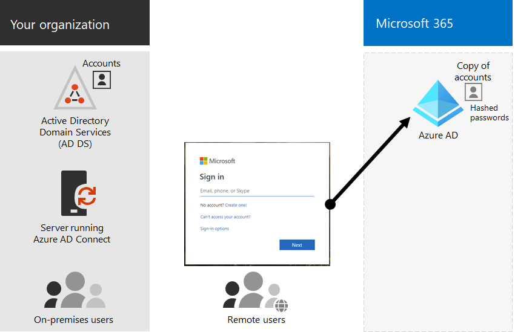

# Identidad híbrida y sincronización de directorios para Microsoft 365Hybrid identity and directory synchronization for Microsoft 365

*Este artículo afecta tanto a Office 365 Enterprise como a Microsoft 365 Enterprise**This article applies to both Microsoft 365 Enterprise and Office 365 Enterprise.*

Según las necesidades empresariales y los requisitos técnicos, el modelo de identidad híbrida y la sincronización de directorios es la opción más común para los clientes empresariales que adoptan Microsoft 365.Depending on your business needs and technical requirements, the hybrid identity model and directory synchronization is the most common choice for enterprise customers who are adopting Microsoft 365. La sincronización de directorios permite administrar identidades en los Servicios de dominio de Active Directory (AD DS) y todas las actualizaciones de cuentas de usuario, grupos y contactos se sincronizan con el inquilino de Azure Active Directory (Azure AD) de su suscripción Microsoft 365.Directory synchronization allows you to manage identities in your Active Directory Domain Services (AD DS) and all updates to user accounts, groups, and contacts are synchronized to the Azure Active Directory (Azure AD) tenant of your Microsoft 365 subscription.

>[!Note]
>Cuando las cuentas de usuario de AD DS se sincronizan por primera vez, no se les asigna automáticamente una licencia de Microsoft 365 y no pueden acceder a Microsoft 365 servicios, como el correo electrónico.When AD DS user accounts are synchronized for the first time, they are not automatically assigned a Microsoft 365 license and cannot access Microsoft 365 services, such as email. Primero debe asignarles una ubicación de uso.You must first assign them a usage location. A continuación, asigne una licencia a estas cuentas de usuario, ya sea de forma individual o dinámica a través de la pertenencia a grupos.Then, assign a license to these user accounts, either individually or dynamically through group membership.
>

## Autenticación para identidad híbridaAuthentication for hybrid identity

Hay dos tipos de autenticación al usar el modelo de identidad híbrida:There are two types of authentication when using the hybrid identity model:

- Autenticación administradaManaged authentication

  Azure AD controla el proceso de autenticación mediante una versión hash almacenada localmente de la contraseña o envía las credenciales a un agente de software local para que ad DS local lo autentique.Azure AD handles the authentication process by using a locally-stored hashed version of the password or sends the credentials to an on-premises software agent to be authenticated by the on-premises AD DS.

- Autenticación federadaFederated authentication

  Azure AD redirige el equipo cliente que solicita autenticación a otro proveedor de identidades.Azure AD redirects the client computer requesting authentication to another identity provider.

### Autenticación administradaManaged authentication

Hay dos tipos de autenticación administrada:There are two types of managed authentication:

- Sincronización de hash de contraseña (PHS)Password hash synchronization (PHS)

  Azure AD realiza la autenticación en sí.Azure AD performs the authentication itself.

- Autenticación de paso a través (PTA)Pass-through authentication (PTA)

  Azure AD tiene AD DS para realizar la autenticación.Azure AD has AD DS perform the authentication.

#### Sincronización de hash de contraseña (PHS)Password hash synchronization (PHS)

Con PHS, sincronizas tus cuentas de usuario de AD DS con Microsoft 365 y administras los usuarios locales.With PHS, you synchronize your AD DS user accounts with Microsoft 365 and manage your users on-premises. Los hash de contraseñas de usuario se sincronizan desde AD DS a Azure AD para que los usuarios tengan la misma contraseña local y en la nube.Hashes of user passwords are synchronized from your AD DS to Azure AD so that the users have the same password on-premises and in the cloud. Esta es la forma más sencilla de habilitar la autenticación para identidades de AD DS en Azure AD.This is the simplest way to enable authentication for AD DS identities in Azure AD. 

Cuando se cambian o restablecen las contraseñas locales, los nuevos hashes de contraseña se sincronizan con Azure AD para que los usuarios siempre puedan usar la misma contraseña para los recursos en la nube y los recursos locales.When passwords are changed or reset on-premises, the new password hashes are synchronized to Azure AD so that your users can always use the same password for cloud resources and on-premises resources. Las contraseñas de usuario nunca se envían a Azure AD ni se almacenan en Azure AD en texto sin formato.The user passwords are never sent to Azure AD or stored in Azure AD in clear text. Algunas características premium de Azure AD, como Identity Protection, requieren PHS independientemente del método de autenticación seleccionado.Some premium features of Azure AD, such as Identity Protection, require PHS regardless of which authentication method is selected.
  
Consulta [elegir el método de autenticación correcto](/azure/active-directory/hybrid/choose-ad-authn) para obtener más información.See [choosing the right authentication method](/azure/active-directory/hybrid/choose-ad-authn) to learn more.
  
#### Autenticación de paso a través (PTA)Pass-through authentication (PTA)

LA PTA proporciona una validación de contraseña sencilla para los servicios de autenticación de Azure AD mediante un agente de software que se ejecuta en uno o varios servidores locales para validar a los usuarios directamente con su AD DS.PTA provides a simple password validation for Azure AD authentication services using a software agent running on one or more on-premises servers to validate the users directly with your AD DS. Con la PTA, sincronizas las cuentas de usuario de AD DS Microsoft 365 y administras los usuarios locales.With PTA, you synchronize AD DS user accounts with Microsoft 365 and manage your users on-premises. 

LA PTA permite a los usuarios iniciar sesión en recursos y aplicaciones locales y Microsoft 365 con su cuenta y contraseña locales.PTA allows your users to sign in to both on-premises and Microsoft 365 resources and applications using their on-premises account and password. Esta configuración valida las contraseñas de los usuarios directamente en su AD DS local sin almacenar hashes de contraseña en Azure AD.This configuration validates users passwords directly against your on-premises AD DS without storing password hashes in Azure AD. 

La PTA también está para que las organizaciones con un requisito de seguridad exijan inmediatamente los estados de cuenta de usuario local, las directivas de contraseña y las horas de inicio de sesión.PTA is also for organizations with a security requirement to immediately enforce on-premises user account states, password policies, and logon hours. 
  
Consulta [elegir el método de autenticación correcto](/azure/active-directory/hybrid/choose-ad-authn) para obtener más información.See [choosing the right authentication method](/azure/active-directory/hybrid/choose-ad-authn) to learn more.
  
### Autenticación federadaFederated authentication

La autenticación federada es principalmente para organizaciones empresariales grandes con requisitos de autenticación más complejos.Federated authentication is primarily for large enterprise organizations with more complex authentication requirements. Las identidades de AD DS se sincronizan con Microsoft 365 y las cuentas de usuarios se administran localmente.AD DS identities are synchronized with Microsoft 365 and users accounts are managed on-premises. Con la autenticación federada, los usuarios tienen la misma contraseña local y en la nube y no tienen que volver a iniciar sesión para usar Microsoft 365.With federated authentication, users have the same password on-premises and in the cloud and they do not have to sign in again to use Microsoft 365. 

La autenticación federada puede admitir requisitos de autenticación adicionales, como la autenticación basada en tarjetas inteligentes o una autenticación multifactor de terceros, y normalmente es necesaria cuando las organizaciones tienen un requisito de autenticación que Azure AD no admite de forma nativa.Federated authentication can support additional authentication requirements, such as smartcard-based authentication or a third-party multi-factor authentication and is typically required when organizations have an authentication requirement not natively supported by Azure AD.
 
Consulta [elegir el método de autenticación correcto](/azure/active-directory/hybrid/choose-ad-authn) para obtener más información.See [choosing the right authentication method](/azure/active-directory/hybrid/choose-ad-authn) to learn more.
  
#### Proveedores de identidades y autenticación de tercerosThird-party authentication and identity providers

Los objetos de directorio locales pueden sincronizarse con Microsoft 365 y el acceso a recursos en la nube lo administra principalmente un proveedor de identidades (IdP) de terceros.On-premises directory objects may be synchronized to Microsoft 365 and cloud resource access is primarily managed by a third-party identity provider (IdP). Si su organización usa una solución de federación de terceros, puede configurar el inicio de sesión con esa solución para Microsoft 365 siempre que la solución de federación de terceros sea compatible con Azure AD.If your organization uses a third-party federation solution, you can configure sign-on with that solution for Microsoft 365 provided that the third-party federation solution is compatible with Azure AD.
  
Consulta la lista [de compatibilidad de federación de Azure AD](/azure/active-directory/connect/active-directory-aadconnect-federation-compatibility) para obtener más información.See the [Azure AD federation compatibility list](/azure/active-directory/connect/active-directory-aadconnect-federation-compatibility) to learn more.
  
## Preparación de AD DSAD DS Preparation

Para garantizar una transición sin problemas a Microsoft 365 mediante la sincronización, debe preparar el bosque de AD DS antes de comenzar la implementación Microsoft 365 sincronización de directorios.To help ensure a seamless transition to Microsoft 365 by using synchronization, you must prepare your AD DS forest before you begin your Microsoft 365 directory synchronization deployment.
  
La preparación del directorio debe centrarse en las siguientes tareas:Your directory preparation should focus on the following tasks:

- Quite los **atributos proxyAddress y** **userPrincipalName duplicados.**Remove duplicate **proxyAddress** and **userPrincipalName** attributes.
- Actualice los atributos **userPrincipalName** en blanco y no válidos con atributos **userPrincipalName** válidos.Update blank and invalid **userPrincipalName** attributes with valid **userPrincipalName** attributes.
- Quite caracteres no válidos y cuestionables en los atributos **givenName**, surname ( **sn** ), **sAMAccountName**, **displayName**, **mail**, **proxyAddresses**, **mailNickname** y **userPrincipalName.**Remove invalid and questionable characters in the **givenName**, surname ( **sn** ), **sAMAccountName**, **displayName**, **mail**, **proxyAddresses**, **mailNickname**, and **userPrincipalName** attributes. Para obtener más información acerca de la preparación de atributos, vea Lista de atributos [sincronizados por](https://go.microsoft.com/fwlink/p/?LinkId=396719)la Azure Active Directory sync tool .For details about preparing attributes, see [List of attributes that are synced by the Azure Active Directory Sync Tool](https://go.microsoft.com/fwlink/p/?LinkId=396719).

    > [!NOTE]
    > Estos son los mismos atributos que Azure AD Conectar sincroniza.These are the same attributes that Azure AD Connect synchronizes. 
  
## Consideraciones de implementación de varios bosquesMulti-forest deployment considerations

Para varios bosques y opciones de SSO, use [una instalación personalizada de Azure AD Conectar](/azure/active-directory/hybrid/how-to-connect-install-custom).For multiple forests and SSO options, use a [Custom Installation of Azure AD Connect](/azure/active-directory/hybrid/how-to-connect-install-custom).
  
Si su organización tiene varios bosques para la autenticación (bosques de inicio de sesión), se recomienda encarecidamente lo siguiente:If your organization has multiple forests for authentication (logon forests), we highly recommend the following:
  
- **Considere la posibilidad de consolidar los bosques.****Consider consolidating your forests.** En general, hay más sobrecarga necesaria para mantener varios bosques.In general, there's more overhead required to maintain multiple forests. A menos que su organización tenga restricciones de seguridad que dicten la necesidad de bosques independientes, considere la posibilidad de simplificar el entorno local.Unless your organization has security constraints that dictate the need for separate forests, consider simplifying your on-premises environment.
- **Solo se usa en el bosque de inicio de sesión principal.****Use only in your primary logon forest.** Considere la posibilidad de Microsoft 365 solo en el bosque de inicio de sesión principal para el lanzamiento inicial de Microsoft 365.Consider deploying Microsoft 365 only in your primary logon forest for your initial rollout of Microsoft 365. 

Si no puedes consolidar la implementación de AD DS de varios bosques o estás usando otros servicios de directorio para administrar identidades, es posible que puedas sincronizarlas con la ayuda de Microsoft o un partner.If you can't consolidate your multi-forest AD DS deployment or are using other directory services to manage identities, you may be able to synchronize these with the help of Microsoft or a partner.
  
Consulte [Topologías de Azure AD Conectar](/azure/active-directory/hybrid/plan-connect-topologies) para obtener más información.See [Topologies for Azure AD Connect](/azure/active-directory/hybrid/plan-connect-topologies) for more information.
  
## Características que dependen de la sincronización de directoriosFeatures that are dependent on directory synchronization
  
La sincronización de directorios es necesaria para las siguientes características y funcionalidades:Directory synchronization is required for the following features and functionality:
  
- Azure AD Seamless Single Sign-On (SSO)Azure AD Seamless Single Sign-On (SSO)
- Skype coexistenciaSkype coexistence
- Exchange implementación híbrida, incluida:Exchange hybrid deployment, including:
  - Lista global de direcciones (GAL) totalmente compartida entre el entorno Exchange local y Microsoft 365.Fully shared global address list (GAL) between your on-premises Exchange environment and Microsoft 365.
  - Sincronización de información de GAL desde varios sistemas de correo.Synchronizing GAL information from different mail systems.
  - La capacidad de agregar usuarios a y quitar usuarios de Microsoft 365 ofertas de servicio.The ability to add users to and remove users from Microsoft 365 service offerings. Esto requiere lo siguiente:This requires the following:
  - La sincronización bidireccional debe configurarse durante la instalación de sincronización de directorios.Two-way synchronization must be configured during directory synchronization setup. De forma predeterminada, las herramientas de sincronización de directorios escriben información de directorio solo en la nube.By default, directory synchronization tools write directory information only to the cloud. Al configurar la sincronización bidireccional, se habilita la funcionalidad de reescribición para que un número limitado de atributos de objeto se copien de la nube y, a continuación, se vuelvan a escribir en su AD DS local.When you configure two-way synchronization, you enable write-back functionality so that a limited number of object attributes are copied from the cloud, and then written them back to your local AD DS. La reescribición también se conoce como Exchange modo híbrido.Write-back is also referred to as Exchange hybrid mode. 
  - Una implementación híbrida Exchange localAn on-premises Exchange hybrid deployment
  - La capacidad de mover algunos buzones de usuario a Microsoft 365 mientras se mantienen otros buzones de usuario locales.The ability to move some user mailboxes to Microsoft 365 while keeping other user mailboxes on-premises.
  - Caja fuerte remitentes y remitentes bloqueados localmente se replican en Microsoft 365.Safe senders and blocked senders on-premises are replicated to Microsoft 365.
  - Función de delegación básica y envío en nombre de otra persona.Basic delegation and send-on-behalf-of email functionality.
  - Tiene una tarjeta inteligente local integrada o una solución de autenticación multifactor.You have an integrated on-premises smart card or multi-factor authentication solution.
- Sincronización de fotos, miniaturas, salas de conferencia y grupos de seguridadSynchronization of photos, thumbnails, conference rooms, and security groups

## Paso siguienteNext step

Cuando esté listo para implementar la identidad híbrida, vea [Prepare for directory synchronization](prepare-for-directory-synchronization.md).When you are ready to deploy hybrid identity, see [prepare for directory synchronization](prepare-for-directory-synchronization.md).
