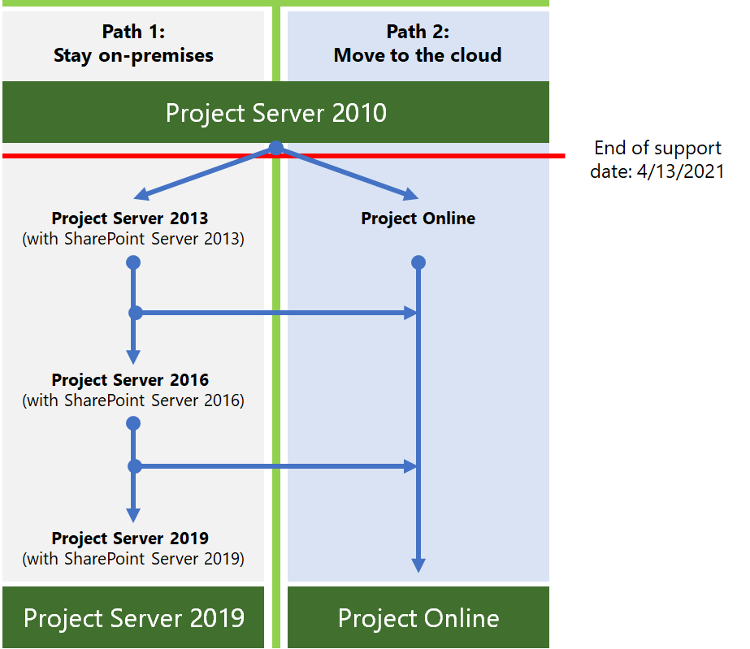

# Plan de final del soporte técnico de Project Server 2010

*Este artículo afecta tanto a Office 365 Enterprise como a Microsoft 365 Enterprise*

Project Server 2010 alcanzará el final del soporte técnico el **13 de abril de 2021.** Esta fecha se extendió desde la fecha de finalización del soporte técnico anterior del 13 de octubre de 2020. Si actualmente usa Project Server 2010, tenga en cuenta que estos productos relacionados tienen las siguientes fechas de fin de soporte técnico:

|Producto |Fecha de finalización del soporte técnico|
|---|---|
|Project 2010 Standard|13 de octubre de 2020|
|Project 2010 Professional|13 de octubre de 2020|

Para obtener más información acerca de cómo llegar al final del soporte técnico, vea Actualizar desde los servidores de [Office 2010 y los productos de cliente.](plan-upgrade-previous-versions-office.md)

## ¿Qué significa *el fin del* soporte?

Casi todos los productos de Microsoft tienen un ciclo de vida de soporte técnico, durante el cual obtienen nuevas características, correcciones de errores y actualizaciones de seguridad. Este ciclo de vida suele durar 10 años desde la versión inicial del producto. El final de este ciclo de vida se conoce como el final del soporte técnico del producto. Después de que Project Server 2010 llegue a su fin de soporte técnico el 13 de abril de 2021, Microsoft ya no proporcionará:

- Soporte técnico para los problemas que pueden producirse.

- Correcciones de errores para problemas que se detectan y que pueden afectar a la estabilidad y facilidad de uso del servidor.

- Correcciones de seguridad para las vulnerabilidades que se detectan y que pueden hacer que el servidor sea vulnerable a las infracciones de seguridad.

- Actualizaciones de zona horaria.

La instalación de Project Server 2010 seguirá funcionando después de esta fecha. Sin embargo, debido a los cambios enumerados anteriormente, se recomienda migrar desde Project Server 2010 lo antes posible.

## ¿Cuáles son mis opciones?

Las opciones de migración son:

- Migrar a Project Online

- Migrar a una versión local más reciente de Project Server (preferiblemente Project Server 2019)

Estas son las dos rutas que puede seguir para evitar el fin de la compatibilidad con Project Server 2010.

|¿Por qué preferiría migrar a Project Server 2019?|¿Por qué preferiría migrar a Project Online?|
|---|---|
|Las reglas de negocio me impiden operar mi negocio en la nube.      Necesito el control de las actualizaciones de mi entorno.|Tengo usuarios móviles o remotos.    Los costos para migrar servidores locales son una preocupación importante (hardware, software, tiempo y esfuerzo de implementación, entre otros).     Después de la migración, los costos para mantener mi entorno son una preocupación (por ejemplo, actualizaciones automáticas, tiempo de actividad garantizado, entre otros).|

> [!NOTE]
> Para obtener más información acerca de las opciones de migración, vea Recursos para ayudarle a actualizar desde clientes y servidores [de Office 2010.](upgrade-from-office-2010-servers-and-products.md) Tenga en cuenta que Project Server no admite la configuración híbrida porque Project Server y Project Online no pueden compartir el mismo grupo de recursos.

### ¿Cuáles son mis opciones para el cliente de Project?

Si usa Project Professional 2010 o Project Standard 2010, las opciones son:

- Pasar a una versión más reciente de Project Professional o Project Standard
- Mover a una solución en línea, como Project Online o Project para la web

#### Mover a una versión más reciente del cliente de Project

Si va a migrar desde Project Standard 2010, puede pasar a una versión más reciente de Project Standard (Project Standard 2016 o Project Standard 2019). Se recomienda pasar a la versión más reciente para aprovechar las características más recientes. Migrar a una versión menos actual (Project Standard 2016) también significa que tendrá que volver a migrar antes.

De forma similar, si va a migrar desde Project Professional 2010, puede pasar a una versión más reciente (Project Professional 2019 o Project Professional 2016). De nuevo, pase a la versión más reciente si es posible. Si usa Project Professional para conectarse a Project Server, asegúrese de migrar a una versión de Project Professional que se conecte con la versión de Project Server que use.

Los usuarios de Project Professional 2010 también pueden migrar al cliente de escritorio de Project Online, que es una versión basada en suscripción de Project Professional 2019. Se incluye en las suscripciones a Project Plan 3 y Project Plan 5.

#### Mover a una solución en línea

También puede migrar de Project Professional 2010 o Project Standard 2010 a una solución en línea basada en suscripción de Project. Tanto Project Plan 3 como Plan 5 incluyen Project Online y la última oferta de nube, [Project para la web.](https://support.office.com/article/what-can-you-do-with-project-for-the-web-b30f5442-be5f-43d2-9072-c95bff778ea1) Ambas ofrecen nuevas características y ventajas que merece la pena explorar.

Para obtener más información acerca de las características y licencias, vea [la descripción del servicio Microsoft Project.](https://docs.microsoft.com/office365/servicedescriptions/project-online-service-description/project-online-service-description)

## Consideraciones importantes para migrar desde Project Server 2010

Tenga en cuenta lo siguiente al planear la migración desde Project Server 2010:

- **Obtener ayuda de un proveedor de soluciones de Microsoft:** una actualización de Project Server 2010 puede ser un desafío. Requiere mucha preparación y planeación. Puede ser especialmente complicado si no ha sido la persona que ha configurado Originalmente Project Server 2010. Los proveedores de soluciones de Microsoft están disponibles para ayudarle, tanto si planea migrar a Project Server 2019 como a Project Online. Busque un proveedor de soluciones en el Centro [de proveedores de soluciones de Microsoft.](https://go.microsoft.com/fwlink/p/?linkid=841249)

- **Planear las personalizaciones:** es posible que las personalizaciones del entorno de Project Server 2010 no funcionen al migrar a Project Server 2019 o Project Online. Existen diferencias significativas en la arquitectura de Project Server entre versiones. Además, los sistemas operativos necesarios, los servidores de bases de datos y los exploradores web que funcionan con las versiones son diferentes. Tenga un plan sobre cómo probar o recompilar las personalizaciones en el nuevo entorno. Aproveche esta oportunidad para determinar si aún se necesitan personalizaciones específicas. Para más información, vea [Create a plan for current customizations during upgrade to SharePoint 2013](https://docs.microsoft.com/SharePoint/upgrade-and-update/create-a-plan-for-current-customizations-during-upgrade-to-sharepoint-2013).

- **Tiempo y paciencia:** la planeación, ejecución y pruebas de actualización llevará mucho tiempo y esfuerzo, especialmente para una actualización a Project Server 2019. Si va a migrar de Project Server 2010 a Project Server 2019, primero debe migrar a Project Server 2013, comprobar los datos, migrar a Project Server 2016 y, a continuación, a Project Server 2019. Es posible que desee consultar con un proveedor de soluciones de Microsoft para obtener un plazo de tiempo y el costo estimado para que le ayude.

## Migrar a Project Online

Si decide migrar de Project Server 2010 a Project Online, puede seguir estos pasos para migrar manualmente los datos del plan del proyecto:

1. Guarde los planes de proyecto de Project Server 2010 en formato .mpp.

2. Con Project Professional 2016, Project Professional 2019 o el cliente de escritorio de Project Online, abra cada archivo .mpp y, a continuación, guárdelo y publódelo en Project Online.

Puede crear manualmente la configuración de PWA en Project Online (por ejemplo, volver a crear los campos personalizados o calendarios de empresa necesarios). Los proveedores de soluciones de Microsoft también pueden ayudarle con este proceso.

Recursos clave:

|Recurso|Descripción|
|---|---|
|[Introducción a Project Online](https://support.office.com/article/e3e5f64f-ada5-4f9d-a578-130b2d4e5f11)|Cómo configurar y usar Project Online|
|[Descripción del servicio Project Online](https://go.microsoft.com/fwlink/p/?linkid=829088)|Información sobre los diferentes planes de Project Online disponibles|

## Migrar a una versión local más reciente de Project Server

Creemos que obtiene el mejor valor y experiencia de usuario mediante la migración a Project Online. Pero también sabemos que algunas organizaciones necesitan mantener los datos del proyecto localmente. Si decide mantener los datos del proyecto localmente, puede migrar el entorno de Project Server 2010 a Project Server 2013, Project Server 2016 o Project Server 2019.

Si no puede migrar a Project Online, se recomienda migrar a Project Server 2019. Project Server 2019 incluye la mayoría de las características clave de versiones anteriores de Project Server. Y se parece más a la experiencia disponible con Project Online, aunque algunas características solo están disponibles en Project Online.

Después de completar cada migración, asegúrese de que los datos se han migrado correctamente.

> [!NOTE]
> Si está limitado a una solución local y está considerando migrar solo a Project Server 2013, tenga en cuenta que esta versión solo tiene unos años más de soporte técnico. Fecha de finalización del soporte técnico para Project Server 2013 con Service Pack 2 de octubre de 13 de 2023. Para obtener más información acerca de las fechas de finalización del soporte técnico, consulte Directiva de ciclo de [vida del producto de Microsoft.](https://go.microsoft.com/fwlink/p/?linkid=842066)

### ¿Cómo puedo migrar a Project Server 2019?

Las diferencias de arquitectura entre Project Server 2010 y Project Server 2019 impiden una ruta de migración directa. Por lo tanto, tendrá que migrar los datos de Project Server 2010 a cada versión sucesiva de Project Server hasta llegar a Project Server 2019. Pasos para actualizar Project Server 2010 a Project Server 2019:

1. Migrar a Project Server 2013.

2. Migrar de Project Serve 2013 a Project Server 2016.

3. Migrar de Project Server 2016 a Project Server 2019.

Después de completar cada migración, asegúrese de que los datos se han migrado correctamente.

### Paso 1: Migrar a Project Server 2013

Para obtener información completa acerca de la actualización de Project Server 2010 a Project Server 2013, vea Actualizar a [Project Server 2013.](https://go.microsoft.com/fwlink/p/?linkid=841822)

Recursos clave:

- [Introducción al proceso de actualización de Project Server 2013](https://go.microsoft.com/fwlink/p/?linkid=841822)

  Obtenga información general de alto nivel sobre cómo actualizar de Project Server 2010 a Project Server 2013.
- [Planeación de la actualización a Project Server 2013](https://go.microsoft.com/fwlink/p/?linkid=841823)

  Considere las consideraciones de planeación al actualizar de Project Server 2010 a Project Server 2013, incluidos los requisitos del sistema.

- [Las novedades de la actualización de Project Server 2013](https://go.microsoft.com/fwlink/p/?linkid=841824) cubren los cambios importantes de esta versión, entre los que se incluyen:

   - No hay ninguna actualización local a Project Server 2013. El método de base de datos adjunta es la única forma compatible de actualizar de Project Server 2010 a Project Server 2013.

   - El proceso de actualización no solo convertirá los datos de Project Server 2010 al formato de Project Server 2013, sino que también consolidará las cuatro bases de datos de Project Server 2010 en una sola base de datos de Project Web App.

   - Tanto SharePoint Server 2013 como Project Server 2013 cambiaron a la autenticación basada en notificaciones de la versión anterior. Si usa la autenticación clásica, tendrá que tener esto en cuenta al actualizar. Para obtener más información, vea [Migrar del modo clásico a autenticaciones basadas en notificaciones en SharePoint 2013]( https://docs.microsoft.com/sharepoint/upgrade-and-update/migrate-from-classic-mode-to-claims-based-authentication-in-sharepoint-2013).

Recursos clave:

- [Introducción al proceso de actualización a Project Server 2013](https://go.microsoft.com/fwlink/p/?linkid=841274)

- [Actualización de las bases de datos y de las colecciones de sitios de Project Web App (Project Server 2013)](https://go.microsoft.com/fwlink/p/?linkid=841272)

- [Diagrama del proceso de actualización de Microsoft Project Server](https://go.microsoft.com/fwlink/p/?linkid=841270)

- [Consolidación excelente de bases de datos, migración de Project Server 2010 a 2013 en 8 pasos sencillos](https://go.microsoft.com/fwlink/p/?linkid=841271)

### Paso 2: Migrar a Project Server 2016

Después de migrar a Project Server 2013 y comprobar que los datos se han migrado correctamente, el siguiente paso es migrar a Project Server 2016.

Para obtener más información, [vea Actualizar a Project Server 2016](https://docs.microsoft.com/Project/upgrade-to-project-server-2016).

Recursos clave:

- [Introducción al proceso de actualización a Project Server 2016](https://docs.microsoft.com/Project/overview-of-the-project-server-2016-upgrade-process)

  Comprenda lo que debe hacer para actualizar de Project Server 2013 a Project Server 2016.

- [Planeación de la actualización a Project Server 2016](https://docs.microsoft.com/Project/plan-for-upgrade-to-project-server-2016)

  Consulte las consideraciones de planeación que se deben tener en cuenta al actualizar de Project Server 2013 a Project Server 2016.

Lo que debe saber sobre la actualización [de Project Server 2016](https://docs.microsoft.com/project/plan-for-upgrade-to-project-server-2016#thingknow) incluye cambios importantes para actualizar a esta versión, entre los que se incluyen:

- Al crear el entorno de Project Server 2016, tenga en cuenta que los archivos de instalación de Project Server 2016 se incluyen en SharePoint Server 2016. Para obtener más información, vea [Implementar Project Server 2016](https://go.microsoft.com/fwlink/p/?linkid=841829).

- Los planes de recursos están en desuso en Project Server 2016. Los planes de recursos de Project Server 2013 se migrarán a Interacciones de recursos en Project Server 2016 y en Project Online. Consulta [Información general: Interacciones de recursos](https://support.office.com/article/73eefb5a-81fe-42bf-980e-9532b1bdc870) para obtener más información.

### Paso 3: Migrar a Project Server 2019

Después de migrar a Project Server 2016 y comprobar que los datos se han migrado correctamente, el siguiente paso es migrar los datos a Project Server 2019.

Para obtener información sobre lo que debe hacer para actualizar de Project Server 2016 a Project Server 2019, vea Actualizar a [Project Server 2019](https://docs.microsoft.com/Project/upgrade-to-project-server-2016).

Recursos clave:

- [Introducción al proceso de actualización de Project Server 2019](https://docs.microsoft.com/project/overview-of-the-project-server-2019-upgrade-process)

  Obtenga información general sobre lo que necesita hacer para actualizar de Project Server 2013 a Project Server 2016.

- [Planeación de la actualización a Project Server 2019](https://docs.microsoft.com/project/plan-for-upgrade-to-project-server-2019)

  Considere las consideraciones de planeación para actualizar de Project Server 2016 a Project Server 2019.

- [Cosas que debe saber sobre la actualización de Project Server 2019](https://go.microsoft.com/fwlink/p/?linkid=841827)  Obtenga información sobre los cambios importantes para actualizar a esta versión, entre los que se incluyen:

   - El proceso de actualización migrará los datos de la base de datos de Project Server 2016 a la base de datos de contenido de SharePoint Server 2019.  Project Server 2019 ya no creará su propia base de datos de Project Server en la granja de servidores de SharePoint Server.

   - Después de la actualización, tenga en cuenta varios cambios en Project Web App.  Para obtener más información, [vea Las novedades de Project Server 2019](https://docs.microsoft.com/project/what-s-new-for-it-pros-in-project-server-2019#PWAChanges).

**Otros recursos:**

- [Descripciones de servicios de Project Online:](https://go.microsoft.com/fwlink/p/?linkid=841280)vea las características de administración de cartera incluidas con Project Server 2016 y Project Online Premium.

- [Microsoft Office de migración de Project Portfolio Server 2010](https://go.microsoft.com/fwlink/p/?linkid=841279)

## Resumen de las opciones para el cliente y los servidores de Office 2010 y Windows 7

Para obtener un resumen visual de las opciones de actualización y migración a la nube para clientes de Office 2010 y servidores de Windows 7, consulte el [póster de final del soporte técnico.](../downloads/Office2010Windows7EndOfSupport.pdf)

En este póster se muestran las distintas rutas que puede seguir para evitar el fin de la compatibilidad con los productos de cliente y servidor de Office 2010 y Windows 7, con las rutas de acceso preferidas y la compatibilidad con opciones en Microsoft 365 Enterprise resaltadas.

También puede descargar [este](https://github.com/MicrosoftDocs/microsoft-365-docs/raw/public/microsoft-365/downloads/Office2010Windows7EndOfSupport.pdf) póster e imprimirlo en formato carta, legal o tabloide (11 x 17).

## Temas relacionados

[Actualización desde SharePoint 2010](upgrade-from-sharepoint-2010.md)

[Actualizar los clientes y servidores de Office 2010](upgrade-from-office-2010-servers-and-products.md)
