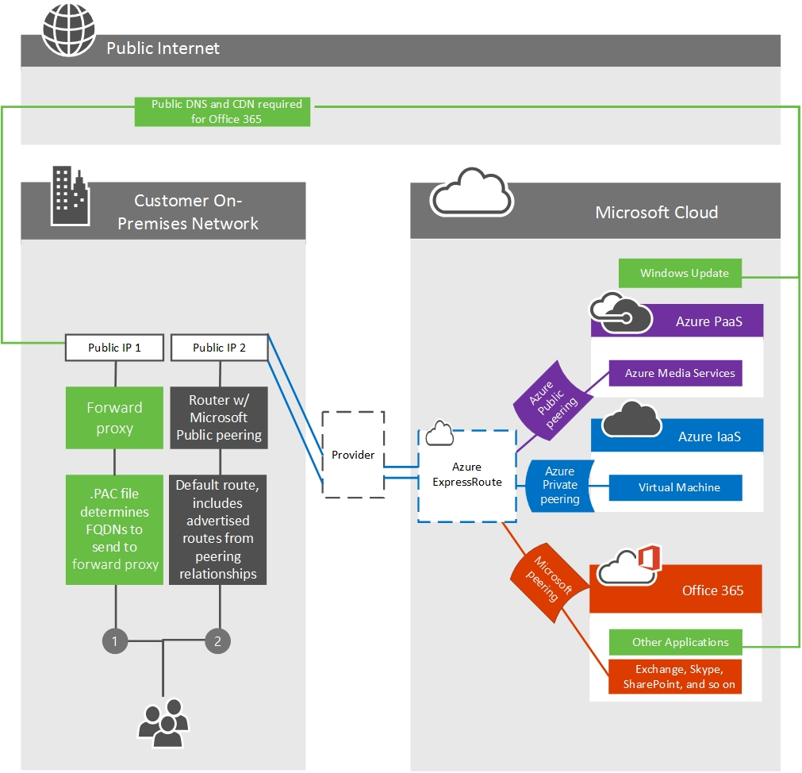

# Enrutamiento con ExpressRoute para Office 365

*Este artículo afecta tanto a Office 365 Enterprise como a Microsoft 365 Enterprise*

Para comprender correctamente el tráfico de enrutamiento a Office 365 mediante Azure ExpressRoute, necesitará una comprensión firme de los principales requisitos de enrutamiento de [ExpressRoute](/azure/expressroute/expressroute-routing) y los circuitos y dominios de enrutamiento de [ExpressRoute.](/azure/expressroute/expressroute-circuit-peerings) Estos se basan en los aspectos básicos para usar ExpressRoute Office 365 en los que los clientes se basarán.
  
Algunos de los elementos clave de los artículos anteriores que deberá comprender son:
  
- Los circuitos de ExpressRoute no están asignados a una infraestructura física específica, pero son una conexión lógica realizada en una única ubicación de emparejamiento por Microsoft y un proveedor de emparejamiento en su nombre.

- Hay una asignación 1:1 entre un circuito de ExpressRoute y una tecla S de cliente.

- Cada circuito puede admitir dos relaciones de emparejamiento independientes (emparejamiento privado de Azure y emparejamiento de Microsoft); Office 365 requiere el emparejamiento de Microsoft.

- Cada circuito tiene un ancho de banda fijo que se comparte en todas las relaciones de emparejamiento.

- Las direcciones IPv4 públicas y los números AS públicos que se usarán para el circuito de ExpressRoute deben validarse como propiedad de usted o ser asignados exclusivamente por el propietario del intervalo de direcciones.

- Los circuitos virtuales de ExpressRoute son redundantes globalmente y seguirán las prácticas de enrutamiento BGP estándar. Por este motivo, se recomiendan dos circuitos físicos por salida a su proveedor en una configuración activa o activa.

Consulta la [página preguntas más frecuentes para](/azure/expressroute/expressroute-faqs) obtener más información sobre los servicios admitidos, los costos y los detalles de configuración. Consulte el [artículo Ubicaciones de ExpressRoute](/azure/expressroute/expressroute-locations) para obtener información sobre la lista de proveedores de conectividad que ofrecen compatibilidad con emparejamiento de Microsoft. También hemos grabado una serie de Azure [ExpressRoute](https://channel9.msdn.com/series/aer) de 10 partes para Office 365 Training en channel 9 para ayudar a explicar los conceptos con máscienzuda.
  
## Garantizar la simetría de rutas

Los Office 365 front-end son accesibles tanto en Internet como en ExpressRoute. Estos servidores prefieren volver a enrutar a circuitos locales a través de ExpressRoute cuando ambos estén disponibles. Debido a esto, existe la posibilidad de la asimetría de rutas si el tráfico de la red prefiere enrutar a través de los circuitos de Internet. Las rutas asimétricas son un problema porque los dispositivos que realizan la inspección de paquetes con estado pueden bloquear el tráfico devuelto que sigue una ruta de acceso diferente a los paquetes salientes seguidos.
  
Independientemente de si inicia una conexión a Office 365 a través de Internet o ExpressRoute, el origen debe ser una dirección públicamente enrutable. Con muchos clientes emparejando directamente con Microsoft, no es viable tener direcciones privadas donde sea posible la duplicación entre clientes.
  
Los siguientes son escenarios en los que se iniciarán las comunicaciones Office 365 a la red local. Para simplificar el diseño de red, se recomienda enrutar estos a través de la ruta de Acceso a Internet.
  
- Servicios SMTP, como correo de un inquilino de Exchange Online a un host local o correo en línea SharePoint enviado desde SharePoint Online a un host local. El protocolo SMTP se usa más ampliamente en la red de Microsoft que los prefijos de ruta compartidos a través de circuitos de ExpressRoute y la publicidad de servidores SMTP locales a través de ExpressRoute provocarán errores con estos otros servicios.

- ADFS durante la validación de contraseña para iniciar sesión.

- [Exchange Server implementaciones híbridas](/exchange/exchange-hybrid).

- [SharePoint búsqueda híbrida federada](/SharePoint/hybrid/display-hybrid-federated-search-results-in-sharepoint-online).

- [SharePoint BCS híbrido](/SharePoint/hybrid/deploy-a-business-connectivity-services-hybrid-solution).

- [Skype Empresarial de](/skypeforbusiness/hybrid/plan-hybrid-connectivity?bc=%2fSkypeForBusiness%2fbreadcrumb%2ftoc.json&toc=%2fSkypeForBusiness%2ftoc.json) federación híbrida [o Skype Empresarial híbrida](/office365/servicedescriptions/skype-for-business-online-service-description/skype-for-business-online-features).

- [Skype Empresarial Cloud Connector](/skypeforbusiness/skype-for-business-hybrid-solutions/plan-your-phone-system-cloud-pbx-solution/plan-skype-for-business-cloud-connector-edition).

Para que Microsoft vuelva a la red para estos flujos de tráfico bidireccional, las rutas BGP a los dispositivos locales deben compartirse con Microsoft. Al anunciar prefijos de ruta a Microsoft a través de ExpressRoute, debe seguir estos procedimientos recomendados:

1) No anuncie el mismo prefijo de ruta de dirección IP pública a Internet público y a través de ExpressRoute. Se recomienda que los anuncios de prefijo de ruta BGP IP a Microsoft a través de ExpressRoute sean de un rango que no se anuncia en Internet en absoluto. Si esto no es posible lograr debido al espacio de direcciones IP disponible, es esencial asegurarse de que anuncia un intervalo más específico a través de ExpressRoute que cualquier circuito de Internet.

2) Use grupos DE DIRECCIONES IP NAT independientes por circuito de ExpressRoute y separados de los circuitos de Internet.

3) Tenga en cuenta que cualquier ruta anunciada a Microsoft atraerá tráfico de red desde cualquier servidor de la red de Microsoft, no solo aquellas para las que las rutas se anuncian en su red a través de ExpressRoute. Solo anuncia rutas a servidores donde el equipo define y comprende bien los escenarios de enrutamiento. Anuncie prefijos de ruta de dirección IP independientes en cada uno de los varios circuitos de ExpressRoute de la red.
  
## Decidir qué aplicaciones y características se enrutan a través de ExpressRoute

Cuando configure una relación de emparejamiento con el dominio de enrutamiento de emparejamiento de Microsoft y se apruebe para el acceso adecuado, podrá ver todos los servicios PaaS y SaaS disponibles a través de ExpressRoute. Los Office 365 diseñados para ExpressRoute se pueden administrar con [comunidades BGP](./bgp-communities-in-expressroute.md) o filtros [de ruta.](/azure/expressroute/how-to-routefilter-portal)
  
Cada una de las Office 365 que están disponibles con el  emparejamiento de Microsoft se enumeran en el artículo Office 365 puntos de conexión por tipo de aplicación y FQDN. El motivo para usar el FQDN en las tablas es permitir a los clientes administrar  el tráfico mediante archivos PAC u otras configuraciones de proxy, consulte nuestra guía para administrar puntos de conexión Office 365, por ejemplo, archivos PAC.
  
En algunas situaciones, hemos usado un dominio comodín en el que uno o varios SUB FQDN se anuncian de forma diferente que el dominio comodín de nivel superior. Esto suele ocurrir cuando el comodín representa una larga lista de servidores que se anuncian en ExpressRoute e Internet, mientras que un pequeño subconjunto de destinos solo se anuncia en Internet, o al contrario. Consulte las tablas siguientes para comprender dónde están las diferencias.
  
En esta tabla se muestran los FQDN de caracteres comodín que se anuncian en Internet y Azure ExpressRoute junto con los sub FQDN que se anuncian solo en Internet.

|**Dominio comodín que se anuncia en Circuitos de ExpressRoute e Internet**|**Solo se anuncia un FQDN en circuitos de Internet**|
|:-----|:-----|
|\*.microsoftonline.com    |click.email.microsoftonline.com    portal.microsoftonline.com    provisioningapi.microsoftonline.com    adminwebservice.microsoftonline.com    |
|\*.officeapps.live.com    |nexusRules.officeapps.live.com    nexus.officeapps.live.com    odc.officeapps.live.com    odc.officeapps.live.com    cdn.odc.officeapps.live.com    ols.officeapps.live.com    ocsredir.officeapps.live.com    ocws.officeapps.live.com    ocsa.officeapps.live.com    |

Por lo general, los archivos PAC están destinados a enviar solicitudes de red a los puntos de conexión anunciados de ExpressRoute directamente al circuito y a todas las demás solicitudes de red al proxy. Si está configurando un archivo PAC como este, redacte el archivo PAC en el siguiente orden:
  
1. Incluya los sub FQDN de la columna dos de la tabla anterior en la parte superior del archivo PAC, enviando el tráfico hacia el proxy. Hemos creado un archivo PAC de ejemplo para que lo use en nuestro artículo sobre la administración de [Office 365 extremos](./managing-office-365-endpoints.md).

2. Incluya todos los FQDN marcados  anunciados a ExpressRoute en este artículo debajo de la primera sección, enviando el tráfico directamente al circuito de ExpressRoute.

3. Incluya cualquier otro extremo de red o reglas debajo de estas dos entradas, enviando el tráfico hacia el proxy.

Esta tabla muestra los dominios comodín que se anuncian en circuitos de Internet solo junto con los sub FQDN que se anuncian en Azure ExpressRoute y los circuitos de Internet. Para el archivo PAC anterior, los FQDN de la columna 2 de la tabla siguiente aparecen como anunciados a ExpressRoute en el vínculo al que se hace referencia, lo que significa que se incluirían en el segundo grupo de entradas del archivo.

|**Dominio comodín que se anuncia solo en circuitos de Internet**|**Sub-FQDN advertised to ExpressRoute and Internet circuits**|
|:-----|:-----|
|\*.office.com    |\*.outlook.office.com    home.office.com    outlook.office.com    portal.office.com    
www.office.com
    |
|\*.office.net    |agent.office.net    |
|\*.office365.com    |outlook.office365.com    smtp.office365.com    |
|\*.outlook.com    |\*.protection.outlook.com    \*.mail.protection.outlook.com    autodiscover- \<tenant\> .outlook.com    |
|\*.windows.net    |login.windows.net    |

## Enrutamiento Office 365 tráfico a través de Internet y ExpressRoute

Para enrutar a la Office 365 de usuario que elija, deberá determinar una serie de factores clave.
  
1. Cuánto ancho de banda necesitará la aplicación. El muestreo del uso existente es el único método confiable para determinarlo en la organización.

2. Qué ubicación(s) de salida desea que el tráfico de red salga de la red. Debe planear minimizar la latencia de red para la conectividad a Office 365, ya que esto afectará al rendimiento. Dado Skype Empresarial utiliza voz y vídeo en tiempo real, es particularmente susceptible a una latencia de red deficiente.

3. Si desea que todas o un subconjunto de las ubicaciones de red usen ExpressRoute.

4. Desde qué ubicaciones ofrece ExpressRoute el proveedor de red elegido.

Una vez que determine las respuestas a estas preguntas, puede aprovisionar un circuito de ExpressRoute que satisfaga las necesidades de ancho de banda y ubicación. Para obtener más asistencia de  planeación de red, consulte la Office 365 de optimización de red y el caso práctico sobre cómo Microsoft controla la planeación [del rendimiento de red.](https://aka.ms/tunemsit)
  
### Ejemplo 1: Ubicación geográfica única
  
Este ejemplo es un escenario para una empresa ficticia llamada Trey Research que tiene una única ubicación geográfica.
  
Los empleados de Trey Research solo pueden conectarse a los servicios y sitios web de Internet que el departamento de seguridad permite explícitamente en el par de servidores proxy salientes que se encuentran entre la red corporativa y su ISP.
  
Trey Research planea usar Azure ExpressRoute para Office 365 y reconoce que algunos tráficos, como el tráfico destinado a redes de entrega de contenido, no podrán enrutar a través de ExpressRoute Office 365 conexión. Dado que todo el tráfico ya se enruta a los dispositivos proxy de forma predeterminada, estas solicitudes seguirán funcionando como antes. Después de que Trey Research determine que pueden cumplir los requisitos de enrutamiento de Azure ExpressRoute, proceden a crear un circuito, configurar el enrutamiento y vincular el nuevo circuito de ExpressRoute a una red virtual. Una vez que se haya puesto en marcha la configuración fundamental de Azure ExpressRoute, Trey Research usa el archivo PAC de #2 que publicamos para enrutar el tráfico con datos específicos del cliente [a](./managing-office-365-endpoints.md) través de ExpressRoute directo para Office 365 conexiones.
  
Como se muestra en el siguiente diagrama, Trey Research puede satisfacer el requisito de enrutar el tráfico Office 365 través de Internet y un subconjunto de tráfico a través de ExpressRoute mediante una combinación de cambios de configuración de proxy saliente y de enrutamiento.
  
1. Con el [#2 PAC que](./managing-office-365-endpoints.md) publicamos para enrutar el tráfico a través de un punto de salida de Internet independiente para Azure ExpressRoute para Office 365.

2. Los clientes están configurados con una ruta predeterminada hacia los servidores proxy de Trey Research.

En este escenario de ejemplo, Trey Research usa un dispositivo proxy saliente. Del mismo modo, es posible que los clientes que no usen Azure ExpressRoute para Office 365 quieran usar esta técnica para enrutar el tráfico en función del costo de inspeccionar el tráfico destinado a puntos de conexión de alto volumen conocidos.
  
Los FQDN de mayor volumen para Exchange Online, SharePoint Online y Skype Empresarial Online son los siguientes:
  

  
- outlook.office365.com, outlook.office.com

- \<tenant-name\>.sharepoint.com, \<tenant-name\> -my.sharepoint.com, \<tenant-name\> - \<app\> .sharepoint.com

- \*. Lync.com junto con los intervalos IP para el tráfico que no es TCP

- \*broadcast.officeapps.live.com, \* excel.officeapps.live.com, \* onenote.officeapps.live.com, \* powerpoint.officeapps.live.com, \* view.officeapps.live.com, \* visio.officeapps.live.com, \* word-edit.officeapps.live.com, \* word-view.officeapps.live.com, office.live.com

Obtenga más información [sobre cómo implementar y administrar la](/archive/blogs/deploymentguys/windows-8-supporting-proxy-services-with-static-configurations-web-hosted-pac-files-and-domain-policy-configured-proxy) configuración de proxy en Windows 8 y asegurarse de Office 365 no esté limitada por el [proxy](https://blogs.technet.com/b/onthewire/archive/2014/03/28/ensuring-your-office-365-network-connection-isn-t-throttled-by-your-proxy.aspx).
  
Con un único circuito de ExpressRoute, no hay alta disponibilidad para Trey Research. En caso de que se produzca un error en el par redundante de dispositivos perimetrales de Trey que están prestando servicio a la conectividad de ExpressRoute, no hay un circuito de ExpressRoute adicional al que realizar la conmutación por error. Esto deja a Trey Research en una situación difícil, ya que la con errores en Internet requerirá una reconfiguración manual y, en algunos casos, nuevas direcciones IP. Si Trey quiere agregar alta disponibilidad, la solución más sencilla es agregar circuitos expressroute adicionales para cada ubicación y configurar los circuitos de forma activa o activa.
  
## Enrutamiento de ExpressRoute para Office 365 con varias ubicaciones

El último escenario, el enrutamiento Office 365 tráfico a través de ExpressRoute es la base para una arquitectura de enrutamiento aún más compleja. Independientemente del número de ubicaciones, el número de continentes donde existen esas ubicaciones, el número de circuitos de ExpressRoute, y así sucesivamente, será necesario poder enrutar cierto tráfico a Internet y algún tráfico a través de ExpressRoute.
  
Las preguntas adicionales que deben responderse a los clientes con varias ubicaciones en varias geografías incluyen:
  
1. ¿Necesita un circuito de ExpressRoute en cada ubicación? Si usa Skype Empresarial Online o le preocupa la confidencialidad de latencia para SharePoint Online o Exchange Online, se recomienda un par redundante de circuitos de ExpressRoute activos/activos en cada ubicación. Consulte la guía Skype Empresarial calidad de medios y conectividad de red para obtener más información.

2. Si un circuito de ExpressRoute no está disponible en una región determinada, ¿cómo Office 365 se debe enrutar el tráfico destinado?

3. ¿Cuál es el método preferido para consolidar el tráfico en el caso de redes con muchas ubicaciones pequeñas?

Cada uno de estos presenta un desafío único que requiere que evalúe su propia red y las opciones disponibles de Microsoft.

|**Consideración**|**Componentes de red para evaluar**|
|:-----|:-----|
|Circuitos en más de una ubicación    |Se recomienda un mínimo de dos circuitos configurados de forma activa o activa.    Se deben comparar las necesidades de costo, latencia y ancho de banda.    Use el costo de ruta BGP, los archivos PAC y NAT para administrar el enrutamiento con varios circuitos.    |
|Enrutamiento desde ubicaciones sin un circuito de ExpressRoute    |Se recomienda la salida y la resolución dns tan cerca de la persona que inicia la solicitud de Office 365.    El reenvío dns se puede usar para permitir que las oficinas remotas descubran el extremo adecuado.    Los clientes de la oficina remota deben tener una ruta disponible que proporciona acceso al circuito de ExpressRoute.    |
|Consolidación de pequeñas oficinas    |El ancho de banda disponible y el uso de datos deben compararse cuidadosamente.    |

> [!NOTE]
> Microsoft prefiere ExpressRoute a través de Internet si la ruta está disponible independientemente de la ubicación física.
  
Cada una de estas consideraciones debe tenerse en cuenta para cada red única. A continuación se muestra un ejemplo.
  
### Ejemplo 2: Ubicaciones multi geográficas
  
Este ejemplo es un escenario para una compañía ficticia llamada Humongous Insurance que tiene varias ubicaciones geográficas.
  
Humongous Insurance está geográficamente disperso con oficinas en todo el mundo. Quieren implementar Azure ExpressRoute para Office 365 mantener la mayoría de sus Office 365 tráfico en conexiones de red directas. Humongous Insurance también tiene oficinas en dos continentes adicionales. Los empleados de la oficina remota en la que ExpressRoute no es viable tendrán que volver a enrutar a una o ambas instalaciones principales para usar una conexión de ExpressRoute.
  
El principio de guía es obtener el Office 365 destinado a un centro de datos de Microsoft tan pronto como sea posible. En este ejemplo, Humongous Insurance debe decidir si sus oficinas remotas deben enrutar a través de Internet para llegar a un centro de datos de Microsoft a través de cualquier conexión lo antes posible o si sus oficinas remotas deben enrutar a través de una red interna para llegar a un centro de datos de Microsoft a través de una conexión de ExpressRoute lo antes posible.
  
Los centros de datos, las redes y la arquitectura de aplicaciones de Microsoft están diseñados para tomar comunicaciones desapreociadas globalmente y ofrecer un servicio de la manera más eficaz posible. Esta es una de las redes más grandes del mundo. Las solicitudes destinadas a Office 365 que permanecen en redes de clientes durante más tiempo del necesario no podrán aprovechar esta arquitectura.
  
En la situación de Humongous Insurance, deben continuar en función de las aplicaciones que pretendan usar a través de ExpressRoute. Por ejemplo, si es un cliente de Skype Empresarial Online o planea usar la conectividad de ExpressRoute al conectarse a reuniones externas de Skype Empresarial Online, el diseño recomendado en la guía de conectividad de red y calidad de medios de Skype Empresarial Online es aprovisionar un circuito ExpressRoute adicional para la tercera ubicación. Esto puede ser más caro desde el punto de vista de las redes; sin embargo, el enrutamiento de solicitudes de un continente a otro antes de entregarse a un centro de datos de Microsoft puede provocar una experiencia deficiente o inutilizable durante las reuniones y comunicaciones de Skype Empresarial Online.
  
Si Humongous Insurance no está usando o no planea usar Skype Empresarial Online de ninguna manera, el enrutamiento del tráfico de red destinado Office 365 un continente con una conexión de ExpressRoute puede ser factible, aunque puede causar latencia innecesaria o congestión TCP. En ambos casos, se recomienda enrutar el tráfico destinado a Internet en el sitio local para aprovechar las redes de entrega de contenido en las que Office 365 se basa.
  

  
Cuando Humongous Insurance está planeando su estrategia multi-geografía, hay una serie de cosas que se deben tener en cuenta en torno al tamaño del circuito, el número de circuitos, la conmutación por error, y así sucesivamente.
  
Con ExpressRoute en una única ubicación con varias regiones que intentan usar el circuito, Humongous Insurance quiere asegurarse de que las conexiones Office 365 desde la oficina remota se envíen al centro de datos más cercano de Office 365 y la ubicación de la sede central la reciba. Para ello, Humongous Insurance implementa el reenvío dns para reducir el número de recorridos de ida y vuelta y las búsquedas DNS necesarias para establecer la conexión adecuada con el entorno de Office 365 más cercano al punto de salida de Internet de la sede. Esto evita que el cliente resuelva un servidor front-end local y garantiza que el servidor Front-End al que se conecte la persona esté cerca de la sede donde Humongous Insurance está emparejando con Microsoft. También puede aprender a [Asignar un reenviador condicional para un nombre de dominio](/previous-versions/windows/it-pro/windows-server-2008-R2-and-2008/cc794735(v=ws.10)).
  
En este escenario, el tráfico de la oficina remota resolvería la infraestructura front-end de Office 365 en Norteamérica y usaría Office 365 para conectarse a los servidores back-end según la arquitectura de la aplicación Office 365. Por ejemplo, Exchange Online terminaría la conexión en Norteamérica y esos servidores front-end se conectarían al servidor de buzones de back-end donde residía el inquilino. Todos los servicios tienen un servicio de puerta principal ampliamente distribuido compuesto por destinos de difusión unidifusión y cualquier difusión.
  
Si Humongous tiene oficinas principales en varios continentes, se recomienda un mínimo de dos circuitos activos/activos por región para reducir la latencia de aplicaciones confidenciales como Skype Empresarial Online. Si todas las oficinas están en un solo continente o no usan colaboración en tiempo real, tener un punto de salida consolidado o distribuido es una decisión específica del cliente. Cuando hay varios circuitos disponibles, el enrutamiento BGP garantizará la conmutación por error en caso de que un solo circuito no esté disponible.
  
Obtenga más información sobre las configuraciones [de enrutamiento de ejemplo](/azure/expressroute/expressroute-config-samples-routing) y [https://azure.microsoft.com/documentation/articles/expressroute-config-samples-nat/](/azure/expressroute/expressroute-config-samples-nat) .
  
## Enrutamiento selectivo con ExpressRoute

El enrutamiento selectivo con ExpressRoute puede ser necesario por diversos motivos, como probar, implementar ExpressRoute en un subconjunto de usuarios. Hay varias herramientas que los clientes pueden usar para enrutar selectivamente Office 365 de red a través de ExpressRoute:
  
1. **Filtrado o segregación de rutas:** permitir que las rutas BGP Office 365 a través de ExpressRoute a un subconjunto de subredes o enrutadores. Esto se enruta selectivamente por segmento de red de cliente o ubicación física de la oficina. Esto es común para escalonar la implementación de ExpressRoute para Office 365 y se configura en los dispositivos BGP.

2. **ARCHIVOS/DIRECCIONES URL de PAC:** dirigir Office 365 de red destinada para FQDN específicos para enrutar en una ruta de acceso específica. Esto se enruta selectivamente por equipo cliente como se identifica mediante la [implementación de archivos PAC](./managing-office-365-endpoints.md).

3. **Filtrado de rutas**  -  [Los filtros de](/azure/expressroute/how-to-routefilter-portal) ruta son una forma de consumir un subconjunto de servicios compatibles a través del emparejamiento de Microsoft.

4. **Comunidades BGP:** el filtrado basado en etiquetas de la comunidad [BGP](./bgp-communities-in-expressroute.md) permite al cliente determinar qué aplicaciones Office 365 atravesarán ExpressRoute y qué atravesarán Internet.

Este es un vínculo breve que se puede usar para volver: [https://aka.ms/erorouting]()
  
## Temas relacionados

[Evaluar la conectividad de red de Office 365](assessing-network-connectivity.md)
  
[Azure ExpressRoute para Office 365](azure-expressroute.md)
  
[Administrar ExpressRoute para la conectividad de Office 365](managing-expressroute-for-connectivity.md)
  
[Planeamiento de red con ExpressRoute para Office 365](network-planning-with-expressroute.md)
  
[Implementación de ExpressRoute para Office 365](implementing-expressroute.md)
  
[Calidad de medios y rendimiento de conectividad de red en Skype Empresarial Online](https://support.office.com/article/5fe3e01b-34cf-44e0-b897-b0b2a83f0917)
  
[Optimización de la red para Skype Empresarial Online](https://support.office.com/article/b363bdca-b00d-4150-96c3-ec7eab5a8a43)
  
[ExpressRoute y calidad del servicio en Skype Empresarial Online](https://support.office.com/article/20c654da-30ee-4e4f-a764-8b7d8844431d)
  
[Flujo de llamadas con ExpressRoute](https://support.office.com/article/413acb29-ad83-4393-9402-51d88e7561ab)
  
[Uso de comunidades BGP en ExpressRoute para Office 365 escenarios](bgp-communities-in-expressroute.md)
  
[Ajuste del rendimiento de Office 365 mediante líneas base y el historial de rendimiento](performance-tuning-using-baselines-and-history.md)
  
[Plan de solución de problemas de rendimiento para Office 365](performance-troubleshooting-plan.md)
  
[Intervalos de direcciones IP y direcciones URL de Office 365.](https://support.office.com/article/8548a211-3fe7-47cb-abb1-355ea5aa88a2)
  
[Red de Office 365 y ajuste de rendimiento](network-planning-and-performance.md)
