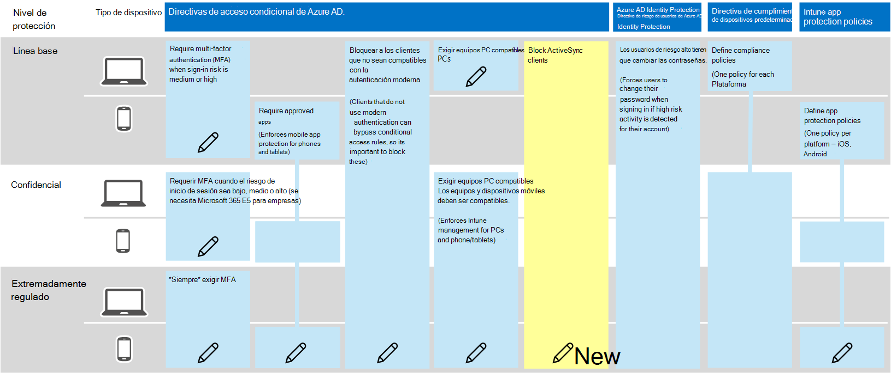

# Recomendaciones de directivas para proteger el correo electrónico

En este artículo se describe cómo implementar las directivas recomendadas de identidad y acceso a dispositivos para proteger el correo electrónico de la organización y los clientes de correo electrónico que admiten la autenticación moderna y el acceso condicional. Esta guía se basa en las [directivas comunes de identidad y acceso a dispositivos](identity-access-policies.md) , y también incluye algunas recomendaciones adicionales.

Estas recomendaciones se basan en tres niveles diferentes de seguridad y protección que se pueden aplicar en función de la granularidad de sus necesidades: **línea de base**, **confidencial**y **muy regulada**. Puede aprender más sobre estos niveles de seguridad y los sistemas operativos de cliente recomendados, a los que hacen referencia estas recomendaciones, en la [introducción a las directivas y configuraciones de seguridad recomendadas](microsoft-365-policies-configurations.md).

Estas recomendaciones requieren que los usuarios usen clientes de correo electrónico modernos, incluidos Outlook para iOS y Android, en dispositivos móviles. Outlook para iOS y Android proporcionan compatibilidad con las mejores características de Office 365. Estas aplicaciones móviles de Outlook también tienen capacidades de seguridad que admiten el uso móvil y trabajan conjuntamente con otras funciones de seguridad en la nube de Microsoft. Para obtener más información, consulte [preguntas más frecuentes sobre Outlook para iOS y Android](https://docs.microsoft.com/exchange/clients-and-mobile-in-exchange-online/outlook-for-ios-and-android/outlook-for-ios-and-android-faq).

## Actualización de directivas comunes para incluir correo electrónico

En el siguiente diagrama se ilustran las directivas comunes de identidad y acceso a dispositivos, y se indica qué directivas deben actualizarse para proteger el correo electrónico. Tenga en cuenta la adición de una nueva regla para que Exchange Online bloquee los clientes de ActiveSync. Esto fuerza el uso de Outlook Mobile.

[Ver una versión más grande de esta imagen](https://raw.githubusercontent.com/MicrosoftDocs/microsoft-365-docs/public/microsoft-365/media/identity-access-ruleset-mail.png)

Si incluyó Exchange Online y Outlook en el ámbito de las directivas al configurarlas, solo tiene que crear la nueva Directiva para bloquear a los clientes de ActiveSync. Revise las directivas enumeradas en la tabla siguiente y haga las adiciones recomendadas, o bien confirme que ya se han incluido. Cada regla tiene vínculos a las instrucciones de configuración asociadas en el artículo [Common Identity and Device Access Policies](identity-access-policies.md) .

|Nivel de protección|Directivas|Más información|
|:---------------|:-------|:----------------|
|**Baseline**|[Requerir MFA cuando el riesgo de inicio de sesión sea *medio* o *alto*](identity-access-policies.md#require-mfa-based-on-sign-in-risk)|Incluir Exchange online en la asignación de aplicaciones en la nube|
|        |[Bloquear a los clientes que no sean compatibles con la autenticación moderna](identity-access-policies.md#block-clients-that-dont-support-modern-authentication)|Incluir Exchange online en la asignación de aplicaciones en la nube|
|        |[Aplicar directivas de protección de datos de aplicaciones](identity-access-policies.md#apply-app-data-protection-policies)|Asegúrese de que Outlook está incluido en la lista de aplicaciones. Asegúrese de actualizar la Directiva para cada plataforma (iOS, Android, Windows)|
|        |[Requerir aplicaciones aprobadas y protección de aplicaciones](identity-access-policies.md#require-approved-apps-and-app-protection)|Incluir Exchange online en la lista de aplicaciones en la nube|
|        |[Exigir equipos PC compatibles](identity-access-policies.md#require-compliant-pcs-but-not-compliant-phones-and-tablets)|Incluir Exchange online en la lista de aplicaciones en la nube|
|        |[Bloquear clientes de ActiveSync](#block-activesync-clients)|Agregar esta nueva Directiva| 
|**Confidencial**|[Requerir MFA cuando el riesgo de inicio de sesión es *bajo*, *medio* o *alto*](identity-access-policies.md#require-mfa-based-on-sign-in-risk)| Incluir Exchange online en la asignación de aplicaciones en la nube|
|         |[Requerir equipos *y* dispositivos móviles compatibles](identity-access-policies.md#require-compliant-pcs-and-mobile-devices)|Incluir Exchange online en la lista de aplicaciones en la nube|
|**Extremadamente regulado**|[Requerir *siempre* MFA](identity-access-policies.md#require-mfa-based-on-sign-in-risk)|Incluir Exchange online en la asignación de aplicaciones en la nube|

## Bloquear clientes de ActiveSync

Esta directiva impide que los clientes de ActiveSync omitan otras reglas de acceso condicional. La configuración de la regla solo se aplica a los clientes de ActiveSync. Al seleccionar **[requerir Directiva de protección de aplicaciones](https://docs.microsoft.com/azure/active-directory/conditional-access/concept-conditional-access-grant#require-app-protection-policy)**, esta directiva bloquea a los clientes de ActiveSync. Puede encontrar más información sobre la creación de esta directiva en [requerir Directiva de protección de aplicaciones para Cloud Access Access con acceso condicional](https://docs.microsoft.com/azure/active-directory/conditional-access/app-protection-based-conditional-access).

1. Siga "paso 2: configurar una directiva de acceso condicional de Azure AD para Exchange Online con ActiveSync (EAS)" en el [escenario 1: las aplicaciones de Office 365 requieren aplicaciones aprobadas con directivas de protección de aplicaciones](https://docs.microsoft.com/azure/active-directory/conditional-access/app-protection-based-conditional-access#scenario-1-office-365-apps-require-approved-apps-with-app-protection-policies), lo que impide que los clientes de Exchange ActiveSync que aprovechan la autenticación básica se conecten a Exchange Online.

## Configurar el cifrado de mensajes

Con las nuevas capacidades de cifrado de mensajes de Office 365 (OME), que aprovechan las características de protección de Azure Information Protection, su organización puede compartir fácilmente el correo electrónico protegido con cualquier persona en cualquier dispositivo. Los usuarios pueden enviar y recibir mensajes protegidos con otras organizaciones de Microsoft 365, así como no clientes que usen Outlook.com, gmail y otros servicios de correo electrónico.

Para obtener más información, vea [set up New Office 365 Message Encryption Capabilities](https://docs.microsoft.com/microsoft-365/compliance/set-up-new-message-encryption-capabilities).

## Pasos siguientes

[Más información sobre las recomendaciones de directiva para la protección de sitios y archivos de SharePoint](sharepoint-file-access-policies.md)
