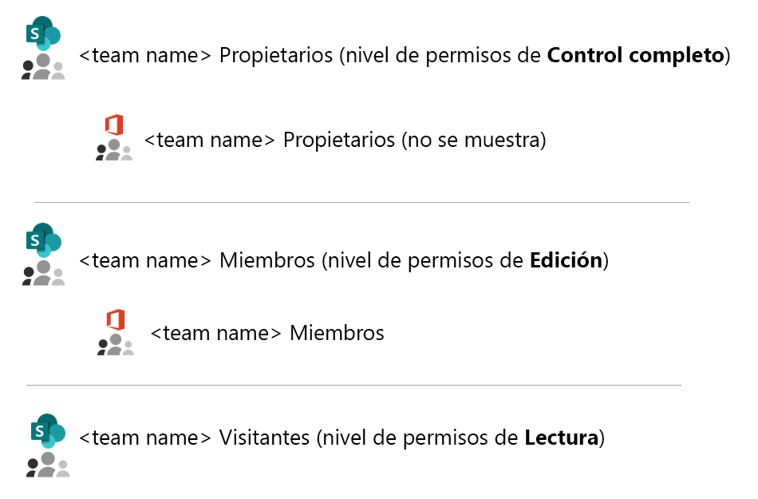
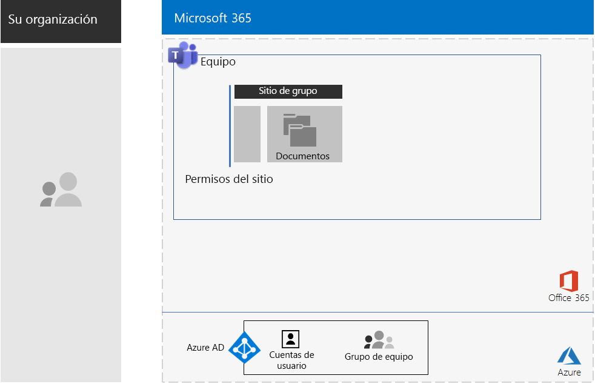
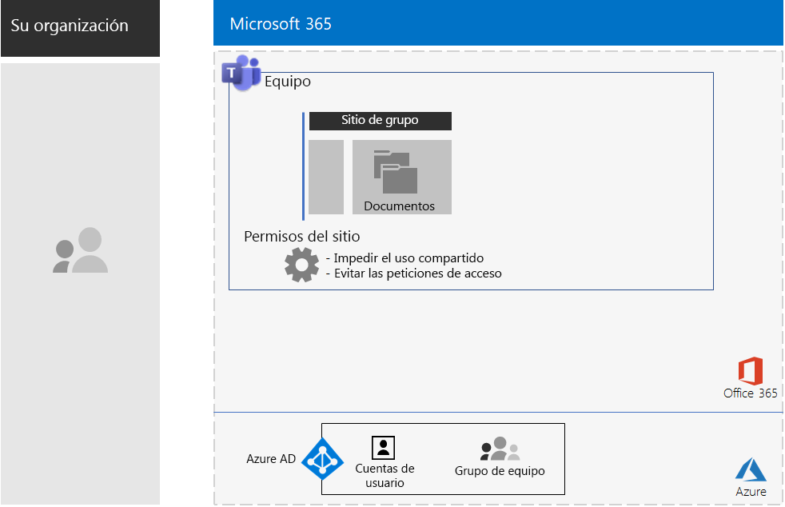
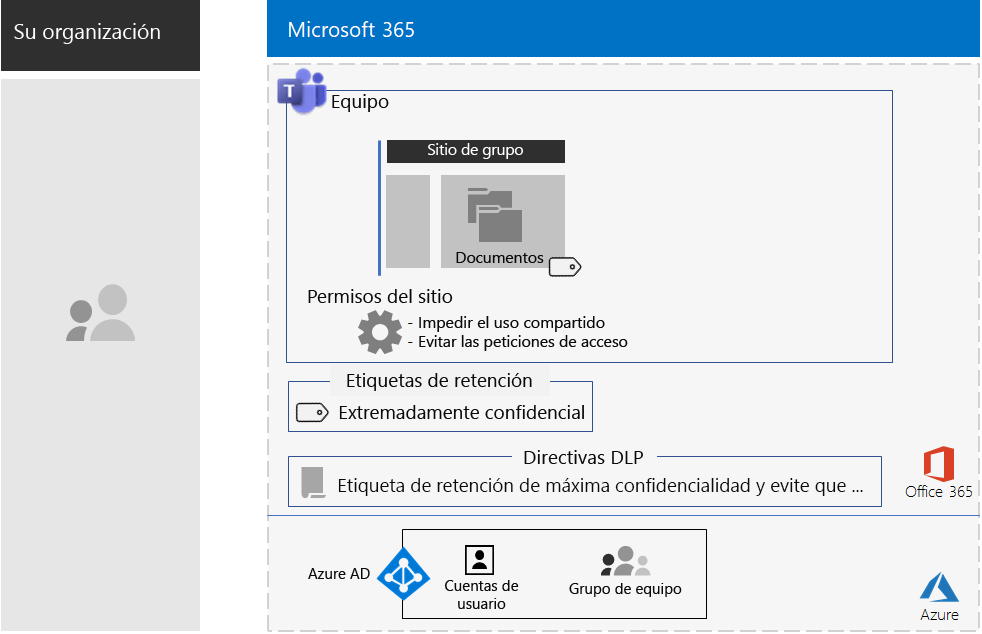
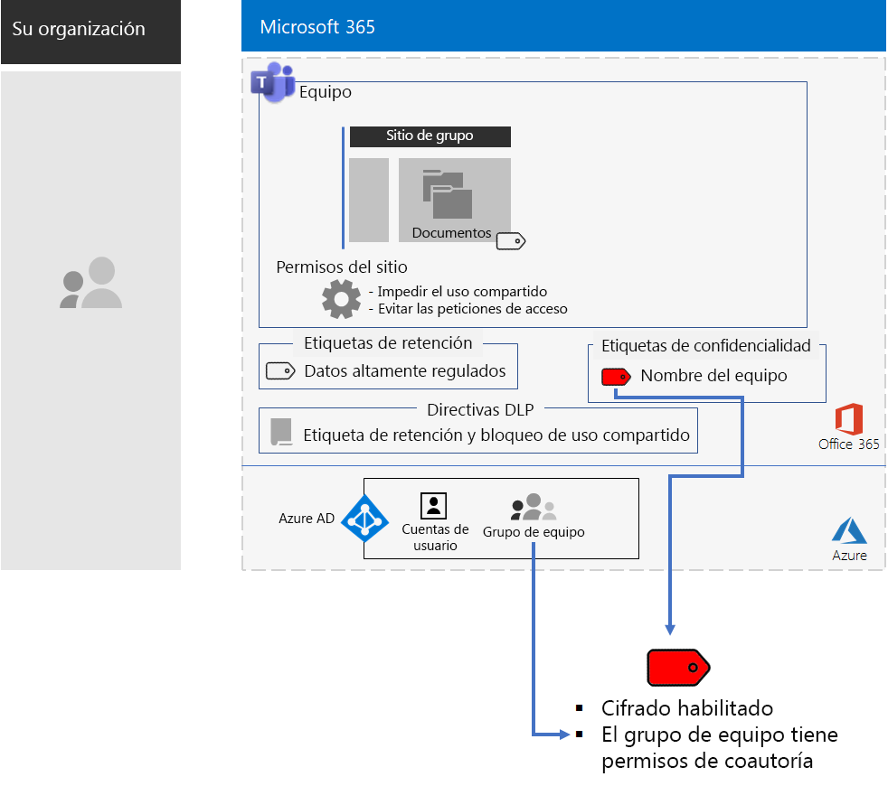
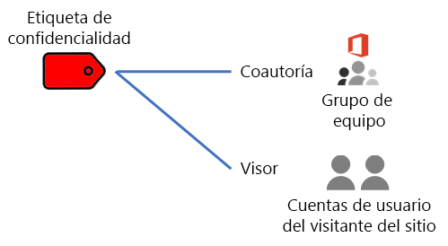
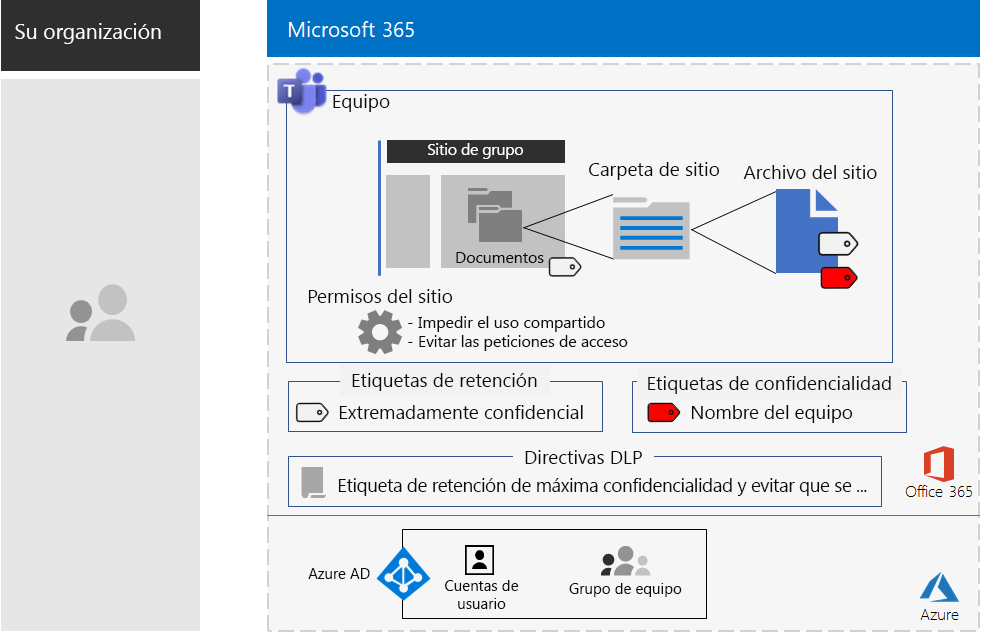

# Teams para datos altamente regulados 

Este artículo contiene recomendaciones y pasos para configurar un equipo privado en Microsoft Teams que bloquea el acceso a las características de Teams (como chats, reuniones y archivos) únicamente a los miembros y propietarios del grupo de Office 365 para el equipo. 

Más allá del acceso privado basado en el grupo de Office 365, este artículo describe cómo configurar el sitio de grupo de SharePoint privado subyacente, al que puede obtener acceso desde la sección **Archivos** de un canal de equipo, para la seguridad adicional que necesita para almacenar datos altamente regulados. En este sitio de grupo de SharePoint, puede almacenar y colaborar en archivos, páginas, un calendario compartido, tareas, un bloc de notas y listas.

>[!Note]
> [Aquí](teams-sharepoint-online-sites-highly-regulated-data.md) encontrará un escenario parecido en el que se usa SharePoint.
>

Los elementos de configuración para un equipo para datos altamente regulados son:

- Un equipo privado con el grupo de Office 365 correspondiente que tenga cuentas de usuario del propietario y de los miembros.
- Seguridad adicional en el sitio de SharePoint subyacente para el equipo que:
  - Impide que los miembros del sitio concedan acceso a otros usuarios.
  - Impide que los usuarios que no sean miembros del sitio soliciten acceso al sitio.
- Una etiqueta de retención de Office 365 para el sitio de SharePoint subyacente que se aplica automáticamente a los nuevos archivos en el sitio de forma predeterminada para definir directivas de retención.
- Una directiva de prevención de pérdida de datos (DLP) que usa la etiqueta de retención y bloquea a los usuarios para que no puedan compartir o enviar archivos fuera de la organización.
- Una etiqueta de confidencialidad de Office 365 o una subetiqueta de una etiqueta altamente regulada que tiene permisos de cifrado y coautoría en el grupo de Office 365 del equipo. Los usuarios pueden aplicar la etiqueta o subetiqueta a archivos almacenados en la sección **Archivos** del equipo desde la opción Sensibilidad de la barra de menú en Word, Excel y PowerPoint.

Esta es la configuración resultante con una etiqueta de sensibilidad.

 Para obtener un resumen de una página de este escenario, vea el [póster Equipos para datos altamente regulados](./media/secure-teams-highly-regulated-data-scenario/TeamsHighlyRegulatedData.pdf).

También puede descargar este póster en formato [PDF](https://github.com/MicrosoftDocs/microsoft-365-docs/raw/public/microsoft-365/enterprise/media/secure-teams-highly-regulated-data-scenario/TeamsHighlyRegulatedData.pdf) o [PowerPoint](https://github.com/MicrosoftDocs/microsoft-365-docs/raw/public/microsoft-365/enterprise/media/secure-teams-highly-regulated-data-scenario/Teams-Highly-Regulated-Data-Poster.pptx) e imprimirlo en tamaño carta, legal o tabloide (11 x 17).

<!--

[Quick-Learn test (vertical): PDF](./media/secure-teams-highly-regulated-data-scenario/Click-Through-Test.pdf)

[Quick-Learn test: PowerPoint](./media/secure-teams-highly-regulated-data-scenario/Click-Through-Test.pptx)

[Horizontal PDF (Quick Start)](./media/secure-teams-highly-regulated-data-scenario/Sideways.pdf)

--> 

## Fase 1: Configure un equipo para datos altamente regulados

La configuración descentralizada consta de los siguientes pasos:

1. Configure el acceso a dispositivos e identidades
2. Cree un equipo privado
3. Configure la seguridad adicional en el sitio de SharePoint subyacente.
4. Cree una etiqueta de retención y una directiva DLP.
5. Cree la etiqueta o subetiqueta de la etiqueta altamente regulada.

### Paso 1: Configure el acceso a dispositivos e identidades

Para proteger el acceso al equipo de SharePoint subyacente, asegúrese de haber configurado las [directivas de acceso de identidades y dispositivos](https://docs.microsoft.com/microsoft-365/enterprise/identity-access-policies) y las [directivas de acceso recomendadas de SharePoint Online](https://docs.microsoft.com/microsoft-365/enterprise/sharepoint-file-access-policies).

### Paso 2: Cree un equipo privado

Siga [estas instrucciones](https://support.office.com/article/create-a-team-from-scratch-174adf5f-846b-4780-b765-de1a0a737e2b) para crear un equipo privado.

Cuando se crea un equipo privado, estos son los permisos predeterminados:

- El grupo de Office 365 para el equipo (el grupo de equipo) tiene propietarios de grupos y miembros de grupos
- Para el sitio de SharePoint subyacente del equipo (el sitio de Equipo):
  - Los administradores de la colección de sitios están configurados para los propietarios del grupo de Equipo
  - Para el sitio de Equipo: 
    - El grupo de SharePoint de propietarios del sitio de Equipo (con el nivel de permisos control total) está configurado en los propietarios del grupo de Equipo.
    - El grupo de SharePoint de miembros del sitio de Equipo (con el nivel de permisos de edición) está configurado para los miembros del grupo de Equipo.
    - El grupo de SharePoint de visitantes del sitio de Equipo (con el nivel de permisos de lectura) no tiene grupos ni cuentas de usuario

Estos son los permisos predeterminados para el sitio de Equipo.

 
>[!Note]
>Si ve el grupo de SharePoint \<nombre de equipo> grupo de propietarios de SharePoint para el nivel de permisos de edición, no se mostrará \<nombre de equipo> Propietarios.
>

Los permisos resultantes permiten lo siguiente:

- Que los propietarios de los grupos de Team administren el sitio y tengan control total sobre el contenido del sitio.
- Que los miembros de los grupos de Team puedan crear y editar archivos en el sitio. 

El mantenimiento de permisos es el mismo que el mantenimiento del miembro del equipo y del propietario.

Esta es la configuración resultante hasta ahora.

 
### Paso 3: Configure la seguridad adicional en el sitio de SharePoint subyacente

Desde el sitio de Equipo, configure estos ajustes de permisos.

1. En la barra de herramientas, haga clic en el icono de configuración y luego en **Permisos del sitio**.
2. En el panel **Permisos del sitio**, en **Configuración de uso compartido**, haga clic en **Cambiar configuración de uso compartido**.
3. En **Permisos de uso compartido**, seleccione **Solo los propietarios del sitio pueden compartir archivos, carpetas y el sitio**.
4. Desactive **Permitir solicitudes de acceso** y, después, haga clic en **Guardar**.

Con estos ajustes de configuración, se deshabilita la posibilidad de que los miembros del grupo de Equipo compartan el sitio con otros miembros o que los usuarios que no son miembros soliciten el acceso al sitio de Equipo.

Esta es la configuración resultante hasta ahora.

 
### Paso 4: Cree una etiqueta de retención y una directiva DLP.

Siga [estas instrucciones](https://docs.microsoft.com/microsoft-365/security/office-365-security/deploy-teams-retention-dlp) para:

1. Crear y publicar una etiqueta de retención para datos altamente regulados (si es necesario).
2. Configurar el sitio de Equipo para la etiqueta de retención que creó en el paso 1.
3. Crear una directiva DLP para datos altamente regulados que usen la etiqueta de retención creada en el paso 2 y bloquee el envío de archivos fuera de la organización por parte de los usuarios. También puede configurar la directiva para requerimientos adicionales, como por ejemplo, las regulaciones de las industrias de salud y finanzas, en función de las [plantillas de directiva de DLP](https://docs.microsoft.com/microsoft-365/compliance/data-loss-prevention-policies#dlp-policy-templates).

Esta es la configuración resultante hasta ahora.

 
### Paso 5: crear una etiqueta de confidencialidad o una subetiqueta de la etiqueta de confidencialidad altamente regulada

A diferencia de una etiqueta de confidencialidad para datos altamente regulados que cualquier persona puede aplicar a cualquier archivo, un equipo seguro necesita su propia etiqueta o sub-etiqueta para que los archivos asignados:

- Se cifren y el cifrado se desplace con el archivo.
- Contengan permisos personalizados para que solo los miembros del grupo de Equipo puedan abrirlo.

Para lograr este nivel adicional de seguridad para los archivos almacenados en el sitio de Equipo, debe configurar una nueva etiqueta de confidencialidad que sea su propia etiqueta o una sub-etiqueta de la etiqueta general para archivos altamente regulados. Solo los miembros del grupo de Equipo la verán en su lista de etiquetas.

Usar una etiqueta de confidencialidad cuando necesite un número reducido de etiquetas tanto para los equipos de uso global como para los individuales privados. Utilice una sub etiqueta de sensibilidad cuando tenga un gran número de etiquetas o quiera organizar etiquetas para equipos privados bajo la etiqueta altamente regulada.

[Siga estas instrucciones ](https://docs.microsoft.com/microsoft-365/compliance/encryption-sensitivity-labels) para configurar una etiqueta independiente o subetiqueta con la siguiente configuración:

- El nombre de la etiqueta contiene el nombre del equipo
- El cifrado está habilitado
- El grupo de Equipo tiene permisos de Coautor

Esta es la configuración resultante con la nueva etiqueta.

Esta es la relación entre la etiqueta de confidencialidad y el grupo de Equipo.

>[!Note]
>Si configura la etiqueta o subetiqueta de confidencialidad para los permisos definidos por el usuario o con una fecha de expiración, no podrá abrir el archivo desde Teams o SharePoint Online. Debe usar una aplicación de Office.
>

### Permisos personalizados

También puede configurar permisos personalizados de sitio de SharePoint para el sitio de Equipo y, si es necesario, su etiqueta de confidencialidad correspondiente. Aquí se muestran dos ejemplos.

#### Ejemplo 1: Delegar la administración del sitio de SharePoint

Si el propietario del equipo no tiene la experiencia de administración de SharePoint o desea delegar la administración del sitio de Equipo, puede agregar la cuenta de usuario de un administrador del servicio de SharePoint a la lista de los propietarios del equipo. Sin embargo, el administrador del servicio de SharePoint tendría acceso total al equipo y a todos sus recursos, y podrá abrir un archivo con la etiqueta de sensibilidad aplicada. 

Para impedir que esto otorgue demasiados privilegios, agregue la cuenta de usuario del administrador del servicio de SharePoint al grupo de SharePoint Propietarios del sitio de Equipo en la configuración de permisos avanzados del sitio. El administrador del servicio de SharePoint puede administrar el sitio, pero no podrá tener acceso al equipo y a ninguno de sus recursos, ni abrir los archivos con la etiqueta de sensibilidad asignada.

#### Ejemplo 2: Permitir el acceso de solo lectura a archivos etiquetados

Si el personal solo necesita ver el contenido de los archivos con etiquetas en el sitio de Equipo, agregue sus cuentas de usuario individuales al:

- \<nombre de equipo > Grupo de visitantes de SharePoint, que tiene el nivel de permisos de lectura de forma predeterminada. 
- La etiqueta de sensibilidad con los permisos del Visualizador.

Estos son los permisos resultantes en la etiqueta.

 
Los visitantes del sitio podrán tener acceso al sitio de Equipo directamente y ver el contenido de los archivos que tienen la subetiqueta aplicada. Pero como no son miembros del grupo de Equipo no tendrán acceso al equipo ni a ninguno de sus recursos.

## Fase 2: Fomentar que los miembros del equipo usen las funcionalidades

Una vez que el equipo esté listo, es hora de impulsar la adopción de este equipo y la seguridad adicional para los miembros del equipo.

### Paso 1: Entrenar a los usuarios

Los miembros del grupo de Equipo pueden acceder al equipo y a todos sus recursos, incluidos los chats, las reuniones y otras aplicaciones. Al trabajar con archivos de la sección **Archivos** de un canal, los miembros del grupo de Equipo deben asignar la etiqueta o subetiqueta de confidencialidad a los archivos creados para el equipo seguro. He aquí un ejemplo.

 
Cuando la etiqueta se aplica al archivo está protegido. Los miembros del grupo de Equipo pueden abrirlo en Teams y colaborar en tiempo real. Se cifra y se incluyen los permisos de coautoría establecidos para los miembros del grupo de Equipo. Si el archivo abandona el sitio y se reenvía a un usuario malintencionado, el mismo tendrá que proporcionar credenciales de una cuenta de usuario que sea miembro del grupo de Equipo para abrir el archivo y ver su contenido. 

Entrenar a los miembros del equipo:

- Sobre la importancia de usar el nuevo equipo para los chats, las reuniones, los archivos y los demás recursos del sitio del equipo y las consecuencias de la filtración de datos altamente regulados, tales como las repercusiones legales, las multas, el ramsonware o la pérdida de ventaja frente a la competencia.
- Cómo acceder al equipo.
- Cómo crear archivos nuevos en el sitio o cargar archivos nuevos almacenados de forma local.
- Cómo la directiva DLP les impide compartir archivos de forma externa.
- Cómo etiquetar archivos con la etiqueta o la subetiqueta personalizada para el equipo.
- Cómo la etiqueta o subetiqueta protege los archivos incluso cuando se filtran del sitio.

Esta formación debería incluir ejercicios prácticos para que los miembros del equipo puedan experimentar con las funcionalidades y sus resultados.

### Paso 2: Realice revisiones periódicas de uso y responda a los comentarios de los miembros del equipo

En las semanas después de la formación haga lo siguiente:

- Responda rápidamente a los comentarios de los miembros del equipo y ajuste las directivas y las configuraciones.
- Analice el uso del equipo y compárelo con las expectativas de uso.
- Compruebe que los archivos altamente regulados se hayan etiquetado de forma correcta con la etiqueta o subetiqueta de confidencialidad personalizada.

  Puede ver qué archivos tienen una etiqueta asignada viendo una carpeta en SharePoint y añadiendo la columna **Confidencialidad** a través de la opción **Mostrar/ocultar columnas** que está en **Añadir columna**.

Volver a dar formación a los usuarios que lo necesiten.

## Demuestre esto en un entorno de prueba.

Para crear su propio entorno de prueba para probar equipos para archivos confidenciales y altamente confidenciales, consulte [estas instrucciones](https://docs.microsoft.com/microsoft-365/security/office-365-security/secure-team-for-files-in-a-dev-test-environment). 

## Cómo Contoso Corporation usó un equipo seguro para un proyecto confidencial

Contoso Corporation es un conglomerado de fabricación global que es ficticio pero representativo. Vea cómo Contoso configuró e impulsó la adopción de un [equipo seguro](contoso-team-for-top-secret-project.md) para un proyecto confidencial para desarrollar y llevar al mercado un nuevo conjunto de productos y servicios. 

## Vea también

[Sitios de SharePoint para datos altamente regulados](teams-sharepoint-online-sites-highly-regulated-data.md)

[Cargas de trabajo y escenarios de Microsoft 365 Enterprise](deploy-workloads.md)

[Biblioteca de productividad de Microsoft 365](https://aka.ms/productivitylibrary)(https://aka.ms/productivitylibrary)

[Guía de implementación](deploy-microsoft-365-enterprise.md)
