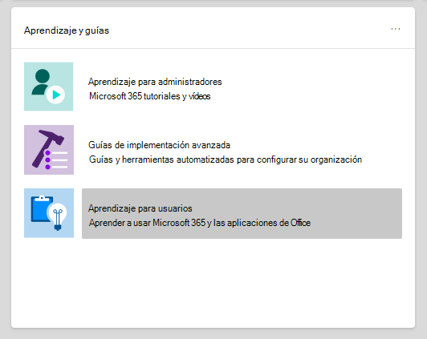
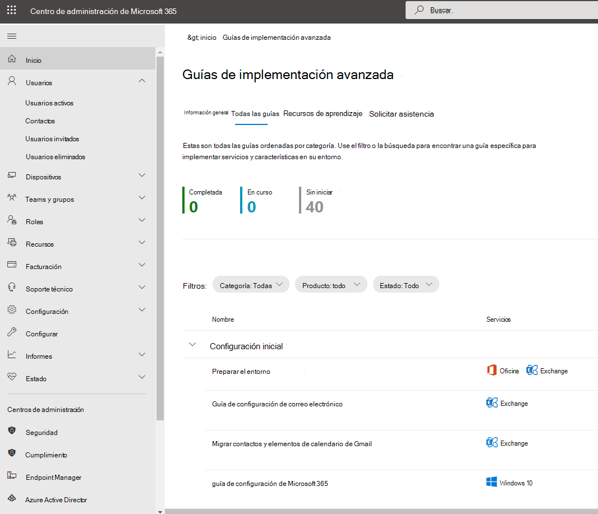

# Guías de configuración para los servicios de Office 365 y Microsoft 365Setup guides for Microsoft 365 and Office 365 services

Las guías de configuración de Microsoft 365 y Office 365 le proporcionan instrucciones y recursos personalizados para planear e implementar el espacio empresarial, las aplicaciones y los servicios.Microsoft 365 and Office 365 setup guides give you tailored guidance and resources for planning and deploying your tenant, apps, and services. Estas guías se crean con los mismos procedimientos recomendados que los especialistas de incorporación de [Microsoft 365 FastTrack](https://www.microsoft.com/fasttrack/microsoft-365) comparten en interacciones individuales y están disponibles para todos los administradores en el Centro de administración de Microsoft 365.These guides are created using the same best practices that [Microsoft 365 FastTrack](https://www.microsoft.com/fasttrack/microsoft-365) onboarding specialists share in individual interactions, and they're available to all admins within the Microsoft 365 admin center. Proporcionan información sobre la configuración del producto, habilitan características de seguridad, implementan herramientas de colaboración y proporcionan scripts para acelerar las implementaciones avanzadas.They give information on product setup, enabling security features, deploying collaboration tools, and provide scripts to speed up advanced deployments.

## Cómo acceder a las guías de configuración en el Centro de administración de Microsoft 365How to access setup guides in the Microsoft 365 admin center

Las guías de configuración son accesibles desde la [página de](https://aka.ms/setupguidance) instrucciones del programa de instalación en el Centro de administración de Microsoft 365.The setup guides are accessible from the [Setup guidance](https://aka.ms/setupguidance) page in the Microsoft 365 admin center. Puede realizar un seguimiento del estado de su progreso y tiene la opción de volver en cualquier momento para completar una guía.You can keep track of the status of your progress and you have the option to return at any time to complete a guide. Para llegar a la **página de instrucciones del programa de** instalación:To reach the **Setup guidance** page:

1. En el [Centro de administración de Microsoft 365,](https://admin.microsoft.com/)vaya a la **página** principal.In the [Microsoft 365 admin center](https://admin.microsoft.com/), go to the **Home** page.

2. Busque la **tarjeta de guías & aprendizaje.**Find the **Training & guides** card. 

   

3. Seleccione **instrucciones de configuración personalizadas.**Select **Customized setup guidance**.

   

>[!NOTE]
>Los permisos de administrador de inquilinos son necesarios para acceder al Centro de administración de Microsoft 365.Tenant administrator permissions are required to access the Microsoft 365 admin center.

## ¿Cómo funcionan las guías de configuración en el Centro de administración de Microsoft 365?How do setup guides work in the Microsoft 365 admin center?

Cada guía le proporciona instrucciones paso a paso, recursos, artículos y, cuando sea necesario, scripts que puede usar para realizar cambios en la configuración.Each guide provides you with step-by-step instructions, resources, articles, and when needed, scripts you can use to make configuration changes. Estas guías le proporcionan opciones que reflejan las necesidades específicas de organizaciones pequeñas y grandes.These guides provide you with choices that reflect the specific needs of both small and large organizations. Además, las instrucciones incluyen asistencia para administradores nuevos y más experimentados.Additionally, the guidance includes assistance for both new and more experienced admins.

Puede usar las guías para obtener más información sobre características específicas de Microsoft 365 y Office 365 durante la fase de planeación, durante la implementación y la implementación, o para volver a visitarlas después de completar una implementación para modificar una configuración.You can use the guides to learn more about specific Microsoft 365 and Office 365 features during the planning phase, during deployment and rollout, or to revisit them after you've completed a deployment to modify a setting.

## Guías para la configuración inicialGuides for initial setup

### Prepare el entornoPrepare your environment

La [guía Preparar su entorno](https://aka.ms/prepareyourenvironment) le ayuda a preparar el entorno de su organización para los servicios de Microsoft 365 y Office 365.The [Prepare your environment](https://aka.ms/prepareyourenvironment) guide helps you prepare your organization's environment for Microsoft 365 and Office 365 services. Independientemente de sus objetivos, hay tareas que deberá completar para garantizar una implementación correcta.Regardless of your goals, there are tasks you'll need to complete to ensure a successful deployment. Para evitar errores durante la preparación del entorno, se le proporcionan instrucciones paso a paso para conectar su dominio, agregar usuarios, asignar licencias, configurar el correo electrónico con Exchange Online e instalar o implementar aplicaciones de Office.To avoid any errors while preparing your environment, you're provided with step-by-step instructions to connect your domain, add users, assign licenses, set up email with Exchange Online, and install or deploy Office apps. 

### Asesor de configuración de correo electrónicoEmail setup advisor

El [asesor de configuración de](https://aka.ms/office365setup) correo electrónico le proporciona las instrucciones paso a paso necesarias para configurar Exchange Online para su organización.The [Email setup advisor](https://aka.ms/office365setup) provides you with the step-by-step guidance needed for configuring Exchange Online for your organization. Esto incluye la configuración de nuevas cuentas de correo electrónico, la migración del correo electrónico y la configuración de la protección de correo electrónico.This includes setting up new email accounts, migrating email, and configuring email protection. Para configurar correctamente el correo electrónico, use este asesor y recibirá el método de migración recomendado en función del sistema de correo actual de su organización, el número de buzones que se migran y cómo desea administrar los usuarios y su acceso.For a successful email set up, use this advisor and you'll receive the recommended migration method based on your organization's current mail system, the number of mailboxes being migrated, and how you want to manage users and their access.

### Migrar contactos y elementos de calendario de GmailMigrate Gmail contacts and calendar items

Al migrar el buzón de un usuario de Gmail a Microsoft 365, se migran los mensajes de correo electrónico, pero los contactos y los elementos de calendario no.When you migrate a Gmail user's mailbox to Microsoft 365, email messages are migrated, but contacts and calendar items are not. El asesor de calendarios y contactos de [Gmail](https://aka.ms/gmailcontactscalendar) proporciona pasos para importar contactos de Google y elementos de calendario de Google a Microsoft 365 mediante métodos de importación y exportación con Outlook.com, el cliente de Outlook o PowerShell.The [Gmail contacts and calendar advisor](https://aka.ms/gmailcontactscalendar) provides steps for importing Google contacts and Google calendar items to Microsoft 365 using import and export methods with Outlook.com, the Outlook client, or PowerShell.

### Asesor de implementación de Microsoft 365Microsoft 365 deployment advisor

El [asesor de implementación de Microsoft 365](https://aka.ms/microsoft365setupguide) le proporciona instrucciones al configurar herramientas de productividad, directivas de seguridad y capacidades de administración de dispositivos.The [Microsoft 365 deployment advisor](https://aka.ms/microsoft365setupguide) provides you with guidance when setting up productivity tools, security policies, and device management capabilities. Con una suscripción a Microsoft 365 Empresa Premium o Microsoft 365 para empresas, puede usar este asesor para configurar y configurar los dispositivos de su organización.With a Microsoft 365 Business Premium or Microsoft 365 for enterprise subscription, you can use this advisor to set up and configure your organization's devices. 

Recibirás instrucciones y acceso a recursos para habilitar los servicios en la nube, actualizar dispositivos a la última versión compatible de Windows 10 y unir dispositivos a Azure Active Directory (Azure AD), todo ello en una ubicación central.You'll receive guidance and access to resources to enable your cloud services, update devices to the latest supported version of Windows 10, and join devices to Azure Active Directory (Azure AD), all in one central location.

### Guía de configuración de trabajo remotoRemote work setup guide

La [guía de configuración](https://aka.ms/remoteworksetup) del trabajo remoto proporciona a las organizaciones las sugerencias y los recursos necesarios para garantizar que los usuarios puedan trabajar correctamente de forma remota, que los datos sean seguros y que se protejan las credenciales de los usuarios.The [Remote work setup guide](https://aka.ms/remoteworksetup) provides organizations with the tips and resources needed to ensure your users can successfully work remotely, your data is secure, and users' credentials are safeguarded. 

Recibirá instrucciones para optimizar el tráfico de dispositivos de los trabajadores remotos tanto a los recursos de Microsoft 365 en la nube como a la red de su organización, lo que reducirá la presión en la infraestructura de VPN de acceso remoto.You'll receive guidance to optimize remote workers' device traffic to both Microsoft 365 resources in the cloud and your organization's network, which will reduce the strain on your remote access VPN infrastructure. 

### Guía de configuración de Windows Virtual DesktopWindows Virtual Desktop setup guide

Windows Virtual Desktop es un servicio completo de virtualización de aplicaciones y escritorio que se ejecuta en la nube.Windows Virtual Desktop is a comprehensive desktop and app virtualization service running in the cloud. Es la única infraestructura de escritorio virtual (VDI) que ofrece administración simplificada, Windows 10 de varias sesiones, optimizaciones para aplicaciones de Microsoft 365 y compatibilidad con entornos de Servicios de Escritorio remoto (RDS).It's the only virtual desktop infrastructure (VDI) that delivers simplified management, multi-session Windows 10, optimizations for Microsoft 365 Apps, and support for Remote Desktop Services (RDS) environments. Implemente y escale los escritorios y aplicaciones de Windows en Azure en minutos y obtenga características integradas de seguridad y cumplimiento.Deploy and scale your Windows desktops and apps to Azure in minutes and get built-in security and compliance features. 

La [guía de configuración de Windows Virtual Desktop](https://aka.ms/wvdsetupguide) proporciona a los administradores recursos de planeación y los requisitos previos para la implementación, la guía de configuración y recursos adicionales.The [Windows Virtual Desktop setup guide](https://aka.ms/wvdsetupguide) provides administrators with planning resources and the prerequisites for deployment, setup guidance, and additional resources. 

### Guía de configuración de Microsoft EdgeMicrosoft Edge setup guide

Microsoft Edge se ha recompilado desde cero para ofrecerte un rendimiento y compatibilidad de primer nivel, la seguridad y privacidad que mereces y nuevas características diseñadas para ofrecerte lo mejor de la web.Microsoft Edge has been rebuilt from the ground up to bring you world-class compatibility and performance, the security and privacy you deserve, and new features designed to bring you the best of the web.

La guía de configuración de [Microsoft Edge](https://aka.ms/edgeadvisor) le ayudará a configurar la detección de sitios empresariales para ver qué sitios a los que se accede en su organización podría necesitar usar el modo IE, revisar y configurar características de seguridad importantes, configurar directivas de privacidad y directivas adicionales para satisfacer los requisitos de su organización y administrar el acceso web en sus dispositivos.The [Microsoft Edge setup guide](https://aka.ms/edgeadvisor) will help you configure Enterprise Site Discovery to see which sites accessed in your org might need to use IE mode, review and configure important security features, configure privacy policies and additional policies to meet your org's requirements, and manage web access on your devices. Puedes descargar Microsoft Edge en dispositivos individuales o te mostraremos cómo implementar para varios usuarios de tu organización con Configuration Manager o Microsoft Intune.You can download Microsoft Edge to individual devices, or we'll show you how to deploy to multiple users in your org with Configuration Manager or Microsoft Intune. 

### Guía de configuración de Microsoft SearchMicrosoft Search setup guide

Búsqueda de Microsoft ayuda a su organización a encontrar lo que necesita para completar lo que está trabajando.Microsoft Search helps your organization find what they need to complete what they're working on. Tanto si busca personas, archivos, organigramas, sitios o respuestas a preguntas comunes, su organización puede usar Búsqueda de Microsoft a lo largo de su día de trabajo para obtener respuestas.Whether it's searching for people, files, org charts, sites, or answers to common questions, your org can use Microsoft Search throughout their workday to get answers.

La [guía de configuración de Microsoft Search](https://aka.ms/MicrosoftSearchSetup) le ayuda a configurar Microsoft Search tanto si desea realizar pruebas piloto para un grupo de usuarios como si desea realizar una implementación para todos los usuarios de su organización. Asignará administradores de búsqueda y editores de búsqueda y, a continuación, personalizará la experiencia de búsqueda para los usuarios con respuestas y opciones adicionales, como agregar la extensión de Bing a Chrome o configurar Bing como motor de búsqueda predeterminado.The [Microsoft Search setup guide](https://aka.ms/MicrosoftSearchSetup) helps you configure Microsoft Search whether you want to pilot it to a group of users or roll it out to everyone in your org. You'll assign Search admins and Search editors and then customize the search experience for your users with answers and additional options, like adding the Bing extension to Chrome or setting Bing as your default search engine.

### Guía de configuración de administración co-administración de Intune Configuration ManagerIntune Configuration Manager co-management setup guide

Usa la guía de configuración de administración co-administración de Intune Configuration [Manager](https://aka.ms/comanagementsetup) para los dispositivos cliente de Configuration Manager existentes y los nuevos dispositivos basados en Internet que tu organización quiera administrar con Microsoft Intune y Configuration Manager.Use the [Intune Configuration Manager co-management setup guide](https://aka.ms/comanagementsetup) for existing Configuration Manager client devices and new internet-based devices that your org wants to co-manage with both Microsoft Intune and Configuration Manager. Esta guía de implementación de administración en co-administración te permite administrar dispositivos Windows 10 y agrega nuevas funcionalidades a los dispositivos de tu organización, a la vez que recibe las ventajas de ambas soluciones.This co-management deployment guide allows you to manage Windows 10 devices and adds new functionality to your org's devices, while receiving the benefits of both solutions.

## Guías para la autenticación y el accesoGuides for authentication and access

### Guía de configuración de Azure ADAzure AD setup guide

La [guía de configuración de Azure AD](https://aka.ms/aadpguidance) proporciona información para garantizar que la organización tenga una base de seguridad sólida.The [Azure AD setup guide](https://aka.ms/aadpguidance) provides information to ensure your organization has a strong security foundation. En esta guía configurará las características iniciales, como el control de acceso basado en roles de Azure (RBAC de Azure) para administradores, Azure AD Connect para el directorio local y Azure AD Connect Health, para que pueda supervisar el estado de su identidad híbrida durante las sincronizaciones automatizadas.In this guide you’ll set up initial features, like Azure role-based access control (Azure RBAC) for admins, Azure AD Connect for your on-premises directory, and Azure AD Connect Health, so you can monitor your hybrid identity's health during automated syncs. 

También incluye información esencial sobre cómo habilitar el restablecimiento de contraseñas de autoservicio, el acceso condicional y el inicio de sesión integrado de terceros, incluida la protección de identidad avanzada opcional y la automatización de aprovisionamiento de usuarios.It also includes essential information on enabling self-service password resets, conditional access and integrated third-party sign-on including optional advanced identity protection and user provisioning automation.

### Sincronizar usuarios desde el directorio de su organizaciónSync users from your org’s directory

El [Asistente para sincronizar usuarios del directorio](https://aka.ms/directorysyncsetup) de su organización le guiará a través de la activación de la sincronización de directorios.The [Sync users from your org’s directory wizard](https://aka.ms/directorysyncsetup) walks you through turning on directory synchronization. Esto une las identidades locales y de la nube para facilitar el acceso y simplificar la administración.This brings your on-premises and cloud identities together for easier access and simplified management. Desbloquea nuevas funcionalidades, como el inicio de sesión único, las opciones de autoservicio, el aprovisionamiento automático de cuentas, los controles de acceso condicional y las directivas de cumplimiento.Unlock new capabilities, like single sign-on, self-service options, automatic account provisioning, conditional access controls, and compliance policies. Esto garantiza que los usuarios tengan acceso a los recursos que necesitan desde cualquier lugar.This ensures that your users have access to the resources they need from anywhere.

### Planear la implementación sin contraseñaPlan your passwordless deployment

Actualice a un método de inicio de sesión alternativo que permita a los usuarios acceder a sus dispositivos de forma segura con uno de los siguientes métodos de autenticación sin contraseña:Upgrade to an alternative sign-in approach that allows users to access their devices securely with one of the following passwordless authentication methods: 

- Windows Hello para empresasWindows Hello for Business
- La aplicación de Microsoft AuthenticatorThe Microsoft Authenticator app
- Claves de seguridadSecurity keys 

Use el [Asistente para planear la implementación sin](https://aka.ms/passwordlesssetup) contraseña para descubrir los mejores métodos de autenticación sin contraseña para usar y recibir instrucciones sobre cómo implementarlos.Use the [Plan your passwordless deployment wizard](https://aka.ms/passwordlesssetup) to discover the best passwordless authentication methods to use and receive guidance on how to deploy them. 

### Planear la implementación de autoservicio de restablecimiento de contraseña (SSPR)Plan your self-service password reset (SSPR) deployment

Dar a los usuarios la capacidad de cambiar o restablecer su contraseña de forma independiente, si su cuenta está bloqueada, o bien olvidan su contraseña sin necesidad de ponerse en contacto con un ingeniero del departamento de soporte técnico.Give users the ability to change or reset their password independently, if their account is locked, or they forget their password without the need to contact a helpdesk engineer. 

Use el Asistente para [planear la](https://aka.ms/SSPRSetupGuide) implementación de autoservicio de restablecimiento de contraseña para recibir artículos e instrucciones relevantes para configurar las opciones adecuadas de Azure Portal para ayudarle a implementar SSPR en su entorno.Use the [Plan your self-service password reset deployment wizard](https://aka.ms/SSPRSetupGuide) to receive relevant articles and instructions for configuring the appropriate Azure portal options to help you deploy SSPR in your environment.

### Asesor de implementación de servicios de federación de Active Directory (AD FS)Active Directory Federation Services (AD FS) deployment advisor

El asesor de implementación de [AD FS](https://aka.ms/adfsguidance) le proporciona instrucciones paso a paso sobre la implementación de una infraestructura de AD FS local que autentique a los usuarios para los servicios de Microsoft 365 y Office 365.The [AD FS deployment advisor](https://aka.ms/adfsguidance) provides you with step-by-step guidance on deploying an on-premises AD FS infrastructure that authenticates users for Microsoft 365 and Office 365 services. Con esta guía, su organización puede revisar los componentes y requisitos de AD FS, adquirir e instalar certificados SSL necesarios para la implementación e instalar un servidor proxy de aplicación web necesario.With this guide, your organization can review AD FS components and requirements, acquire and install SSL certificates that are necessary for deployment, and install a required web application proxy server. 

## Guías de seguridad y cumplimientoGuides for security and compliance

### Guía de configuración de Microsoft IntuneMicrosoft Intune setup guide 

Configurar Microsoft Intune para administrar los dispositivos de la organización.Set up Microsoft Intune to manage devices in your organization. Para tener un control total de los dispositivos corporativos, usarás las características de administración de dispositivos móviles (MDM) de Intune.For full control of corporate devices, you’ll use Intune’s mobile device management (MDM) features. Para administrar los datos de su organización en dispositivos compartidos y personales, puede usar las características de administración de aplicaciones móviles (MAM) de Intune.To manage your organization's data on shared and personal devices, you can use Intune’s mobile application management (MAM) features. 

Con la guía de configuración de [Microsoft Intune,](https://aka.ms/intunesetupguide)configurarás las directivas de cumplimiento de dispositivos y aplicaciones, asignarás directivas de protección de aplicaciones y supervisarás el estado de protección de dispositivos y aplicaciones.With the [Microsoft Intune setup guide](https://aka.ms/intunesetupguide), you'll set up device and app compliance policies, assign app protection policies, and monitor the device and app protection status. 

### Asesor de Microsoft Defender para puntos de conexiónMicrosoft Defender for Endpoint advisor

El [asesor de Microsoft Defender para](https://aka.ms/mdatpsetup) puntos de conexión proporciona instrucciones que ayudarán a la red empresarial a prevenir, detectar, investigar y responder a amenazas avanzadas.The [Microsoft Defender for Endpoint advisor](https://aka.ms/mdatpsetup) provides instructions that will help your enterprise network prevent, detect, investigate, and respond to advanced threats. Realice una evaluación fundamentada de la vulnerabilidad de su organización y decida qué paquete de implementación y métodos de configuración son los mejores.Make an informed assessment of your organization's vulnerability and decide which deployment package and configuration methods are best. 

>[!NOTE]
>Se requiere una licencia por volumen de Microsoft para Microsoft Defender para Endpoint.A Microsoft Volume License is required for Microsoft Defender for Endpoint.

### Guía de configuración de Exchange Online ProtectionExchange Online Protection setup guide

Microsoft Exchange Online Protection (EOP) es un servicio de filtrado de correo electrónico basado en la nube para la protección contra correo no deseado y malware, con características para proteger su organización de infracciones de directivas de mensajería.Microsoft Exchange Online Protection (EOP) is a cloud-based email filtering service for protection against spam and malware, with features to safeguard your organization from messaging policy violations. 

Use la guía de configuración de [Exchange Online Protection](https://aka.ms/EOPguidance) para configurar EOP seleccionando cuál de los tres escenarios de implementación es buzones locales, buzones híbridos (combinación de locales y en la nube) o todos los buzones en la nube que se ajusten a su &mdash; &mdash; organización.Use the [Exchange Online Protection setup guide](https://aka.ms/EOPguidance) to set up EOP by selecting which of the three deployment scenarios&mdash;on-premises mailboxes, hybrid (mix of on-premises and cloud) mailboxes, or all cloud mailboxes&mdash;fits your organization. La guía proporciona información y recursos para configurar y revisar las licencias del usuario, asignar permisos en el Centro de administración de Microsoft 365 y configurar las directivas contra malware y correo no deseado de su organización en el Centro de seguridad & Cumplimiento.The guide provides information and resources to set up and review your user's licensing, assign permissions in the Microsoft 365 admin center, and configure your organization's anti-malware and spam policies in the Security & Compliance Center. 

### Asesor de Microsoft Defender para Office 365Microsoft Defender for Office 365 advisor

El asesor de Microsoft Defender para [Office 365](https://aka.ms/oatpsetup) protege su organización contra las amenazas malintencionadas que su entorno puede encontrar a través de mensajes de correo electrónico, vínculos y herramientas de colaboración de terceros.The [Microsoft Defender for Office 365 advisor](https://aka.ms/oatpsetup) safeguards your organization against malicious threats that your environment might encounter through email messages, links, and third-party collaboration tools. Esta guía le proporciona los recursos e información que le ayudarán a preparar e identificar el plan de Defender para Office 365 para adaptarlo a las necesidades de su organización.This guide provides you with the resources and information to help you prepare and identify the Defender for Office 365 plan to fit your organization's needs. 

### Guía de configuración de Microsoft Information ProtectionMicrosoft information protection setup guide

Obtenga información general sobre las capacidades que puede aplicar a su estrategia de Protección de la información para que pueda estar seguro de que su información confidencial está protegida.Get an overview of the capabilities you can apply to your Information Protection strategy so you can be confident your sensitive information is protected. Aplique un planteamiento de ciclo de vida de cuatro fases con el que detectar, clasificar, proteger y supervisar la información confidencial.Use a four-stage lifecycle approach in which you discover, classify, protect, and monitor sensitive information. La [guía de configuración de Microsoft Information Protection](https://aka.ms/mipsetupguide) proporciona instrucciones para completar cada una de estas fases.The [Microsoft information protection setup guide](https://aka.ms/mipsetupguide) provides guidance for completing each of these stages.

### Guía de configuración del gobierno de la información de MicrosoftMicrosoft information governance setup guide

La guía de configuración de gobierno de [Microsoft Information](https://aka.ms/migsetupguide) le proporciona la información que necesitará para configurar y administrar la estrategia de gobierno de su organización, para asegurarse de que los datos se clasifican y administran de acuerdo con las directrices de ciclo de vida específicas que establezca.The [Microsoft Information governance setup guide](https://aka.ms/migsetupguide) provides you with the information you'll need to set up and manage your organization's governance strategy, to ensure that your data is classified and managed according to the specific lifecycle guidelines you set. Con esta guía, aprenderá a crear, aplicar automáticamente o publicar etiquetas, directivas de etiquetas y directivas de retención que se aplican a los registros de cumplimiento y contenido reutilizables de su organización.With this guide, you'll learn how to create, auto-apply, or publish labels, label policies, and retention policies that are applied to your organization's reusable content and compliance records. También podrá obtener información sobre la importación de archivos CSV con un plan de archivos para escenarios masivos o para aplicarlos manualmente a documentos individuales.You'll also get information on importing CSV files with a file plan for bulk scenarios or for applying them manually to individual documents. 

## Guías de colaboraciónGuides for collaboration

### Asesor de implementación de Aplicaciones de Microsoft 365Microsoft 365 Apps deployment advisor

El asesor de implementación de Aplicaciones de [Microsoft 365](https://aka.ms/OPPquickstartguide) le ayuda a obtener los dispositivos de los usuarios que ejecutan la versión más reciente de productos de Office como Word, Excel, PowerPoint y OneNote.The [Microsoft 365 Apps deployment advisor](https://aka.ms/OPPquickstartguide) helps you get your users' devices running the latest version of Office products like Word, Excel, PowerPoint, and OneNote. Encontrarás instrucciones sobre los distintos métodos de implementación que incluyen opciones fáciles de instalar automáticamente para las implementaciones empresariales con herramientas de administración.You'll get guidance on the various deployment methods that include easy self-install options to enterprise deployments with management tools. Las instrucciones le ayudarán a evaluar su entorno, averiguar los requisitos de implementación específicos e implementar las herramientas de soporte necesarias para garantizar una instalación correcta.The instructions will help you assess your environment, figure out your specific deployment requirements, and implement the necessary support tools to ensure a successful install. 

### Guía de configuración de aplicaciones móvilesMobile apps setup guide

La [guía de configuración de aplicaciones móviles](https://aka.ms/officeappguidance) proporciona instrucciones para la descarga e instalación de aplicaciones de Office en sus dispositivos móviles Windows, iOS y Android.The [Mobile apps setup guide](https://aka.ms/officeappguidance) provides instructions for the download and installation of Office apps on your Windows, iOS, and Android mobile devices. Esta guía le proporciona información paso a paso para descargar e instalar aplicaciones de Microsoft 365 y Office 365 en sus dispositivos de teléfono y tableta.This guide provides you with step-by-step information to download and install Microsoft 365 and Office 365 apps on your phone and tablet devices.

### Guía de configuración de Microsoft TeamsMicrosoft Teams setup guide

La guía de configuración de [Microsoft Teams](https://aka.ms/teamsguidance) proporciona a su organización instrucciones para configurar áreas de trabajo de equipo que hospedan conversaciones en tiempo real a través de mensajería, llamadas y reuniones de audio o vídeo para la comunicación privada y del equipo.The [Microsoft Teams setup guide](https://aka.ms/teamsguidance) provides your organization with guidance to set up team workspaces that host real-time conversations through messaging, calls, and audio or video meetings for both team and private communication. Recibirá las instrucciones para determinar los requisitos de red de su organización con la herramienta Organizador de red y el asesor de Teams en el Centro de administración de Teams.You'll receive the instructions for determining your organization's network requirements by using the Network Planner tool and the Teams advisor within the Teams admin center. Una vez completada la implementación, en la guía se incluyen recursos útiles para empezar a usar Microsoft Teams.Once your deployment is complete, the guide includes helpful resources to get started using Teams.

### Guía de configuración de SharePointSharePoint setup guide

La guía de configuración de [SharePoint](https://aka.ms/spoguidance) le ayuda a configurar el almacenamiento de documentos y la administración de contenido de SharePoint, crear sitios, configurar el uso compartido externo, migrar datos y configurar opciones avanzadas, e impulsar la participación y la comunicación de los usuarios dentro de su organización.The [SharePoint setup guide](https://aka.ms/spoguidance) helps you set up your SharePoint document storage and content management, create sites, configure external sharing, migrate data and configure advanced settings, and drive user engagement and communication within your organization. Siga los pasos para configurar las directivas de permisos de uso compartido de contenido, elegir las herramientas de sincronización de migración, así como habilitar la configuración de seguridad para su entorno de SharePoint.You'll follow steps for configuring your content-sharing permission policies, choose your migration sync tools, as well as enable the security settings for your SharePoint environment. 

### Guía de configuración de OneDriveOneDrive setup guide

Use la guía [de configuración de OneDrive](https://aka.ms/ODfBquickstartguide) para empezar a usar las capacidades de almacenamiento, uso compartido, colaboración y sincronización de archivos de OneDrive.Use the [OneDrive setup guide](https://aka.ms/ODfBquickstartguide) to get started with OneDrive file storage, sharing, collaboration, and syncing capabilities. OneDrive proporciona una ubicación central donde los usuarios pueden sincronizar sus archivos de Aplicaciones de Microsoft 365, configurar el uso compartido externo, migrar datos de usuario y configurar la seguridad avanzada y la configuración de acceso a dispositivos.OneDrive provides a central location where users can sync their Microsoft 365 Apps files, configure external sharing, migrate user data, and configure advanced security and device access settings. La guía de configuración de OneDrive se puede implementar con una suscripción de OneDrive o un plan independiente de OneDrive.The OneDrive setup guide can be deployed using a OneDrive subscription or a standalone OneDrive plan. 

### Asesor de implementación de YammerYammer deployment advisor

Conéctese y interactúe en toda la organización con Yammer.Connect and engage across your organization with Yammer. El [asesor de implementación de Yammer](https://aka.ms/yammerdeploymentguide) prepara la red de Yammer agregando dominios, definiendo administradores y combinando redes de Yammer.The [Yammer deployment advisor](https://aka.ms/yammerdeploymentguide) prepares your Yammer network by adding domains, defining admins, and combining Yammer networks. Encontrará instrucciones para implementar Yammer y, a continuación, personalizar la apariencia, configurar la seguridad y el cumplimiento, y refinar la configuración.You'll get guidance to deploy Yammer and then customize the look, configure security and compliance, and refine the settings.

## Asistentes avanzadosAdvanced wizards

### Actualización local con Configuration ManagerIn-place upgrade with Configuration Manager

Usa la actualización local con la guía [de Configuration Manager](https://aka.ms/win10upgradedemo) al actualizar dispositivos Windows 7 y Windows 8.1 a la versión más reciente de Windows 10.Use the [In-place upgrade with Configuration Manager guide](https://aka.ms/win10upgradedemo) when upgrading Windows 7 and Windows 8.1 devices to the latest version of Windows 10. Usará el script proporcionado para comprobar los requisitos previos y configurar automáticamente una actualización local.You'll use the script provided to check the prerequisites and automatically configure an in-place upgrade.

### Implementar Office para los usuariosDeploy Office to your users

Implemente aplicaciones de Office desde la nube con la capacidad de personalizar la instalación mediante la Herramienta de implementación de Office.Deploy Office apps from the cloud with the ability to customize your installation by using the Office Deployment Tool. La [guía implementar Office para los ](https://aka.ms/proplusodt) usuarios le ayuda a crear una configuración personalizada de Office con opciones avanzadas o puede usar una configuración recomendada predefinida.The [Deploy Office to your users guide ](https://aka.ms/proplusodt) helps you create a customized Office configuration with advanced settings, or you can use a pre-built recommended configuration. Tanto si los usuarios llevan a cabo una instalación automática como si están implementando para los usuarios individualmente o de forma masiva, este asistente avanzado le proporciona instrucciones paso a paso para proporcionar a los usuarios una instalación de Office adaptada a su organización.Whether your users are conducting a self-install or you're deploying to your users individually or in bulk, this advanced wizard provides you with step-by-step instructions to give users an Office installation tailored to your organization.

### Implementar Office para usuarios remotosDeploy Office to remote users

Ahora que trabajar de forma remota es la norma, los usuarios deben recibir la configuración de Office de su organización cuando no están conectados a la red interna o cuando usan sus propios dispositivos.Now that working remotely is the norm, users need to receive your organization's Office settings when they're not connected to your internal network or when using their own devices. 

Use la [guía implementar Office](https://aka.ms/officeremoteinstall) para usuarios remotos para crear una instalación personalizada de Office y, a continuación, enviar a los usuarios un script de PowerShell generado que instalará Office sin problemas con la configuración.Use the [Deploy Office to remote users guide](https://aka.ms/officeremoteinstall) to create a customized Office installation and then send users a generated PowerShell script that will seamlessly install Office with your configuration.

### Implementar y actualizar Aplicaciones de Microsoft 365 con Configuration ManagerDeploy and update Microsoft 365 Apps with Configuration Manager

Para las organizaciones que usan Configuration Manager, puede usar el asesor Implementar y actualizar aplicaciones de [Microsoft 365](https://aka.ms/oppinstall) con Configuration Manager para generar un script que configurará automáticamente la implementación de Aplicaciones de Microsoft 365 mediante los procedimientos recomendados recomendados por los ingenieros de FastTrack.For organizations using Configuration Manager, you can use the [Deploy and update Microsoft 365 Apps with Configuration Manager advisor](https://aka.ms/oppinstall) to generate a script that will automatically configure your Microsoft 365 Apps deployment using best practices recommended by FastTrack engineers. Use esta guía para crear los grupos de implementación, personalizar las aplicaciones y características de Office, configurar instalaciones dinámicas o lean y, a continuación, ejecutar el script para crear las aplicaciones, las reglas de implementación automática y las colecciones de dispositivos que necesita para dirigirse a la implementación.Use this guide to build your deployment groups, customize your Office apps and features, configure dynamic or lean installations, and then run the script to create the applications, automatic deployment rules, and device collections you need to target your deployment. 
