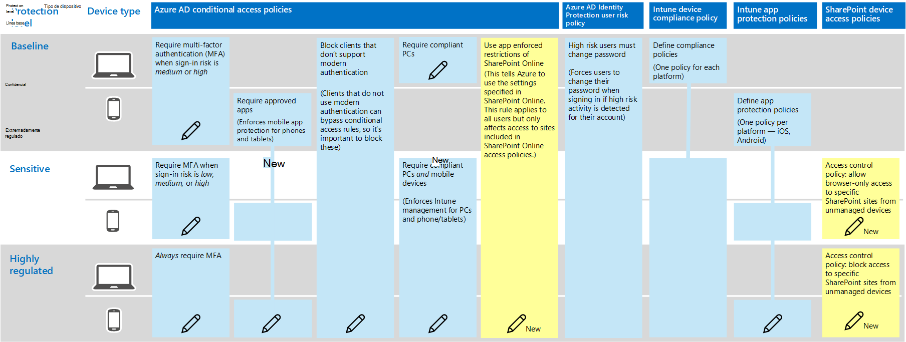
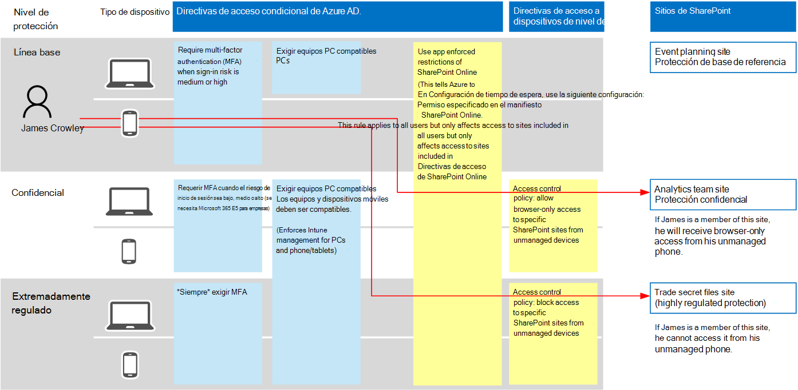

# Recomendaciones de directivas para proteger los archivos y los sitios de SharePointPolicy recommendations for securing SharePoint sites and files

En este artículo se describe cómo implementar la identidad recomendada y las directivas de acceso a dispositivos para proteger SharePoint Online y OneDrive para la empresa.This article describes how to implement the recommended identity and device-access policies to protect SharePoint Online and OneDrive for Business. Esta guía se basa en las [directivas comunes de identidad y acceso a dispositivos](identity-access-policies.md).This guidance builds on the [Common identity and device access policies](identity-access-policies.md).

Estas recomendaciones se basan en tres niveles diferentes de seguridad y protección para los archivos de SharePoint que se pueden aplicar en función de la granularidad de sus necesidades: **línea base**, **confidencial**y **altamente regulable**.These recommendations are based on three different tiers of security and protection for SharePoint files that can be applied based on the granularity of your needs: **baseline**, **sensitive**, and **highly regulated**. Puede obtener más información sobre estos niveles de seguridad y los sistemas operativos de cliente recomendados, a los que se hace referencia en estas recomendaciones en [la introducción](microsoft-365-policies-configurations.md).You can learn more about these security tiers, and the recommended client operating systems, referenced by these recommendations in [the overview](microsoft-365-policies-configurations.md).

Además de implementar esta guía, asegúrese de configurar los sitios de SharePoint con la cantidad adecuada de protección, incluida la configuración de los permisos adecuados para contenido confidencial y altamente regulado.In addition to implementing this guidance, be sure to configure SharePoint sites with the right amount of protection, including setting appropriate permissions for sensitive and highly-regulated content.

## Actualización de directivas comunes para incluir SharePoint y OneDrive para la empresaUpdating common policies to include SharePoint and OneDrive for Business

El siguiente diagrama ilustra el conjunto de directivas recomendadas para proteger archivos en SharePoint Online y OneDrive para la empresa.The following diagram illustrates the set of recommended policies for protecting files in SharePoint Online and OneDrive for Business. Indica qué directivas deben actualizarse o recién creadas para agregar protección a SharePoint Online y OneDrive para la empresa.It indicates which policies should be updated or newly created to add protection for SharePoint Online and OneDrive for Business.

Si incluyó SharePoint Online al crear las directivas comunes, solo tiene que crear las nuevas directivas.If you included SharePoint Online when you created the common policies, you only need to create the new policies. Al configurar reglas de acceso condicional, SharePoint Online incluye OneDrive para la empresa.When configuring conditional access rules, SharePoint Online includes OneDrive for Business.

Las nuevas directivas implementan la protección de dispositivos para contenido sensible y altamente regulado mediante la aplicación de requisitos de acceso específicos a los sitios de SharePoint que se especifiquen.The new policies implement device protection for sensitive and highly-regulated content by applying specific access requirements to SharePoint sites that you specify.

En la siguiente tabla se enumeran las directivas que debe revisar y actualizar o crear nuevas para SharePoint Online.The following table lists the policies you either need to review and update or create new for SharePoint Online. Las directivas comunes vinculan a las instrucciones de configuración asociadas en el artículo [Common Identity and Device Access Policies](identity-access-policies.md) .The common policies link to the associated configuration instructions in the [Common identity and device access policies](identity-access-policies.md) article.

|Nivel de protecciónProtection level|DirectivasPolicies|Más informaciónMore information|
|:---------------|:-------|:----------------|
|**Baseline****Baseline**|[Requerir MFA cuando el riesgo de inicio de sesión sea *medio* o *alto*Require MFA when sign-in risk is *medium* or *high*](identity-access-policies.md#require-mfa-based-on-sign-in-risk)|Incluir SharePoint Online en la asignación de aplicaciones en la nubeInclude SharePoint Online in the assignment of cloud apps|
|        |[Bloquear a los clientes que no sean compatibles con la autenticación modernaBlock clients that don't support modern authentication](identity-access-policies.md#block-clients-that-dont-support-modern-authentication)|Incluir SharePoint Online en la asignación de aplicaciones en la nubeInclude SharePoint Online in the assignment of cloud apps|
|        |[Aplicar directivas de protección de datos de aplicacionesApply APP data protection policies](identity-access-policies.md#apply-app-data-protection-policies)|Asegúrese de que todas las aplicaciones recomendadas se incluyen en la lista de aplicaciones.Be sure all recommended apps are included in the list of apps. Asegúrese de actualizar la Directiva para cada plataforma (iOS, Android, Windows)Be sure to update the policy for each platform (iOS, Android, Windows)|
|        |[Exigir equipos PC compatiblesRequire compliant PCs](identity-access-policies.md#require-compliant-pcs-but-not-compliant-phones-and-tablets)|Incluir SharePoint Online en la lista de aplicaciones en la nubeInclude SharePoint Online in list of cloud apps|
|        |[Usar restricciones de aplicación forzada en SharePoint OnlineUse app enforced restrictions in SharePoint Online](#use-app-enforced-restrictions-in-sharepoint-online)|Agregar esta nueva Directiva.Add this new policy. Esto indica a Azure AD que use la configuración especificada en SharePoint Online.This tells Azure AD to use the settings specified in SharePoint Online. Esta regla se aplica a todos los usuarios, pero solo afecta al acceso a los sitios incluidos en las directivas de acceso de SharePoint OnlineThis rule applies to all users, but only affects access to sites included in SharePoint Online access policies|
|**Confidencial****Sensitive**|[Requerir MFA cuando el riesgo de inicio de sesión es *bajo*, *medio* o *alto*Require MFA when sign-in risk is *low*, *medium* or *high*](identity-access-policies.md#require-mfa-based-on-sign-in-risk)|Incluir SharePoint Online en las asignaciones de aplicaciones en la nubeInclude SharePoint Online in the assignments of cloud apps|
|         |[Requerir equipos *y* dispositivos móviles compatiblesRequire compliant PCs *and* mobile devices](identity-access-policies.md#require-compliant-pcs-and-mobile-devices)|Incluir SharePoint Online en la lista de aplicaciones en la nubeInclude SharePoint Online in the list of cloud apps|
||[Directiva de control de acceso de SharePoint Online](#sharepoint-online-access-control-policies): permitir el acceso solo del explorador a sitios específicos de SharePoint desde dispositivos no administrados[SharePoint Online access control policy](#sharepoint-online-access-control-policies): Allow browser-only access to specific SharePoint sites from unmanaged devices|Esto evita la edición y descarga de archivos.This prevents edit and download of files. Usar PowerShell para especificar sitiosUse PowerShell to specify sites|
|**Extremadamente regulado****Highly regulated**|[Requerir *siempre* MFA*Always* require MFA](identity-access-policies.md#require-mfa-based-on-sign-in-risk)|Incluir SharePoint Online en la asignación de aplicaciones en la nubeInclude SharePoint Online in the assignment of cloud apps|
||[Directiva de control de acceso de SharePoint Online](#use-app-enforced-restrictions-in-sharepoint-online): bloquear el acceso a sitios específicos de SharePoint desde dispositivos no administrados[SharePoint Online access control policy](#use-app-enforced-restrictions-in-sharepoint-online): Block access to specific SharePoint sites from unmanaged devices|Usar PowerShell para especificar sitiosUse PowerShell to specify sites|

## Usar restricciones de aplicación forzada en SharePoint OnlineUse app-enforced restrictions in SharePoint Online

Si implementa controles de acceso en SharePoint Online, debe crear esta directiva de acceso condicional en Azure AD para decir a Azure AD que aplique las directivas que configure en SharePoint Online.If you implement access controls in SharePoint Online, you must create this conditional access policy in Azure AD to tell Azure AD to enforce the policies you configure in SharePoint Online. Esta regla se aplica a todos los usuarios, pero solo afecta al acceso a los sitios que se especifiquen mediante PowerShell al crear los controles de acceso en SharePoint Online.This rule applies to all users, but only affects access to the sites you specify using PowerShell when you create the access controls in SharePoint Online.

Para configurar esta Directiva, vea "bloquear o limitar el acceso a colecciones de sitios de SharePoint específicas o cuentas de OneDrive" en este artículo: [controlar el acceso desde dispositivos no administrados](https://docs.microsoft.com/sharepoint/control-access-from-unmanaged-devices).To configure this policy see "Block or limit access to specific SharePoint site collections or OneDrive accounts" in this article: [Control access from unmanaged devices](https://docs.microsoft.com/sharepoint/control-access-from-unmanaged-devices).

## Directivas de control de acceso de SharePoint OnlineSharePoint Online access control policies

Microsoft recomienda proteger el contenido de los sitios de SharePoint con contenido sensible y altamente regulado con controles de acceso a dispositivos.Microsoft recommends you protect content in SharePoint sites with sensitive and highly-regulated content with device access controls. Para ello, cree una directiva que especifique el nivel de protección y los sitios a los que se aplicará la protección.You do this by creating a policy that specifies the level of protection and the sites to apply the protection to.

- Sitios confidenciales: permitir el acceso solo del explorador.Sensitive sites: Allow browser-only access. Esto impide que los usuarios editen y descarguen archivos.This prevents users from editing and downloading files.
- Sitios altamente regulados: bloquear el acceso desde dispositivos no administrados.Highly regulated sites: Block access from unmanaged devices.

Vea "bloquear o limitar el acceso a colecciones de sitios de SharePoint específicas o cuentas de OneDrive" en este artículo: [controlar el acceso desde dispositivos no administrados](https://docs.microsoft.com/sharepoint/control-access-from-unmanaged-devices).See "Block or limit access to specific SharePoint site collections or OneDrive accounts" in this article: [Control access from unmanaged devices](https://docs.microsoft.com/sharepoint/control-access-from-unmanaged-devices).

## Funcionamiento conjunto de estas directivasHow these policies work together

Es importante comprender que los permisos de sitio de SharePoint suelen basarse en la necesidad empresarial de acceso a los sitios.It's important to understand that SharePoint site permissions are typically based on business need for access to sites. Estos permisos los administran los propietarios del sitio y pueden ser muy dinámicos.These permissions are managed by site owners and can be highly dynamic. El uso de directivas de acceso a dispositivos de SharePoint garantiza la protección de estos sitios, independientemente de si los usuarios están asignados a un grupo de Azure AD asociado con una protección de línea base, sensible o altamente regulada.Using SharePoint device access policies ensures protection to these sites, regardless of whether users are assigned to an Azure AD group associated with baseline, sensitive, or highly regulated protection.

En la siguiente ilustración se muestra un ejemplo de cómo las directivas de acceso a dispositivos de SharePoint protegen el acceso a los sitios.The following illustration provides an example of how SharePoint device access policies protect access to sites.

En la ilustración:In the illustration:

- James se asigna a las directivas de acceso condicional asociadas con la protección de línea de base, pero se le puede conceder acceso a los sitios de SharePoint asociados con una protección sensible o altamente regulada.James is assigned to conditional access policies associated with baseline protection, but he can be given access to SharePoint sites associated with sensitive or highly-regulated protection.
- Si James obtiene acceso a un sitio sensible o altamente regulado, es miembro del uso de su equipo, se concede su acceso siempre que su equipo sea compatible.If James accesses a sensitive or highly-regulated site he is a member of using his PC, his access is granted as long as his PC is compliant.
- Si James obtiene acceso a un sitio confidencial, es miembro del uso de su teléfono no administrado, lo que se permite a los usuarios de línea base, recibirá acceso solo del explorador al sitio confidencial debido a la Directiva de acceso de dispositivos configurada para este sitio.If James accesses a sensitive site he is a member of using his unmanaged phone, which is allowed for baseline users, he will receive browser-only access to the sensitive site due to the device access policy configured for this site.
- Si James obtiene acceso a un sitio altamente regulado, es miembro del uso de su teléfono no administrado, se bloqueará debido a la Directiva de acceso configurada para este sitio.If James accesses a highly regulated site he is a member of using his unmanaged phone, he will be blocked due to the access policy configured for this site. Solo puede acceder a este sitio mediante su equipo administrado y compatible.He can only access this site using his managed and compliant PC.

