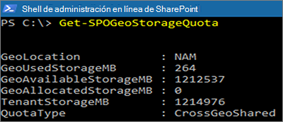

# Cuotas de almacenamiento de SharePoint en entornos multigeográficosSharePoint storage quotas in multi-geo environments

De forma predeterminada, todas las ubicaciones geográficas de un entorno multigeográfico comparten la cuota de almacenamiento del espacio empresarial disponible.By default, all geo locations of a multi-geo environment share the available tenant storage quota.

Con la configuración de cuota de almacenamiento de SharePoint geográfica, puede administrar la cuota de almacenamiento para cada ubicación geográfica.With the SharePoint geo storage quota setting, you can manage the storage quota for each geo location. Al asignar una cuota de almacenamiento de una ubicación geográfica, esta se convierte en la cantidad máxima de almacenamiento disponible para esa ubicación geográfica y se resta de la cuota de almacenamiento disponible por espacio empresarial.When you allocate a storage quota for a geo location, it becomes the maximum amount of storage available for that geo location, and is deducted from the available tenant storage quota. Luego, la cuota de almacenamiento disponible por espacio empresarial restante se comparte entre las ubicaciones geográficas configuradas a las que no se ha asignado una cuota de almacenamiento.The remaining available tenant storage quota is then shared across the configured geo locations for which a specific storage quota has not been allocated.

La cuota de almacenamiento de SharePoint para cualquier ubicación geográfica puede asignarse por el administrador de SharePoint Online mediante la conexión a la ubicación central.The SharePoint storage quota for any geo location can be allocated by the SharePoint Online administrator by connecting to the central location. Los administradores geográficos de ubicaciones satélites pueden ver la cuota de almacenamiento, pero no pueden asignarlas.Geo administrators for satellite locations can view the storage quota but cannot allocate it.

## Configurar una cuota de almacenamiento de una ubicación geográficaConfigure a storage quota for a geo location

Use el [módulo de Microsoft Office SharePoint Online](https://www.microsoft.com/download/details.aspx?id=35588 ) y conéctese a la ubicación central para asignar la cuota de almacenamiento de una ubicación geográfica.Use the [Microsoft SharePoint Online Module](https://www.microsoft.com/download/details.aspx?id=35588 ) and connect to the central location to allocate the storage quota for a geo location. 

Para asignar la cuota de almacenamiento de una ubicación, ejecute el cmdlet:To allocate Storage Quota for a location, run cmdlet:

`Set-SPOGeoStorageQuota -GeoLocation <geolocationcode> -StorageQuotaMB <value>`

Para ver la cuota de almacenamiento de la ubicación geográfica actual, ejecute:To view Storage Quota for the current geo location, run:

`Get-SPOGeoStorageQuota`

Para ver la cuota de almacenamiento de todas las ubicaciones geográficas, ejecute:To view Storage Quota for all geo locations, run:

`Get-SPOGeoStorageQuota -AllLocations`

Para quitar la cuota de almacenamiento asignada a una ubicación geográfica, establezca `StorageQuota value = 0`:To remove the allocated storage quota for a geo location, set `StorageQuota value = 0`:

`Set-SPOGeoStorageQuota -GeoLocation <geolocationcode> -StorageQuotaMB 0`
