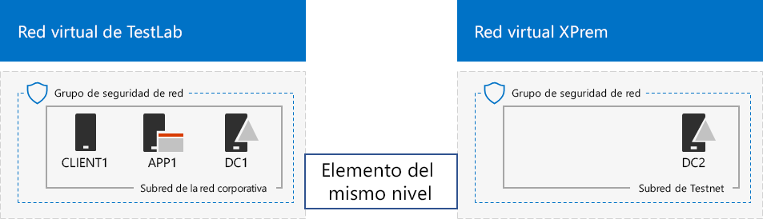
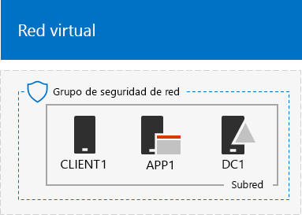
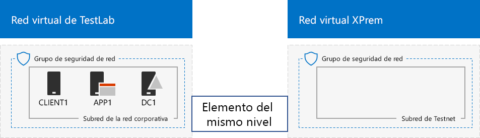

# <a name="simulated-cross-premises-virtual-network-in-a-microsoft-365-test-environment"></a>Red virtual entre locales simulada en un entorno de prueba de Microsoft 365

*Esta Guía del laboratorio de pruebas se puede usar tanto Microsoft 365 entornos de prueba empresariales como Office 365 Enterprise de prueba.*

En este artículo se le indicará el proceso de creación de un entorno de nube híbrida simulado con Microsoft Azure mediante dos redes virtuales de Azure. Esta es la configuración resultante. 
  

  
Esta configuración simula un entorno de producción de nube híbrida de IaaS de Azure y está formada por:
  
- Una red local simulada y simplificada alojada en una red virtual de Azure (la red virtual TestLab).
    
- Una red virtual entre locales simulada y alojada en Azure (XPrem).
    
- Una relación de emparejamiento de VNet entre las dos redes virtuales.
    
- Un controlador de dominio secundario en la red virtual XPrem.
    
Estos componentes constituyen la base a partir de la cual puede: 
  
- Desarrollar y probar las aplicaciones en un entorno simulado de nube de híbrida de IaaS de Azure.
    
- Crear configuraciones de prueba de los equipos, algunos dentro de la red virtual TestLab y otros dentro de la red virtual XPrem, para simular cargas de trabajo de TI basadas en nube híbrida.
    
Existen tres fases principales para configurar el entorno de pruebas:
  
1. Configurar la red virtual TestLab.
    
2. Crear la red virtual entre locales.
    
3. Configurar DC2.
    
> [!NOTE]
> Esta configuración necesita una suscripción de pago de Azure. 

Puede usar el entorno resultante para probar las características y la funcionalidad de [Microsoft 365](https://www.microsoft.com/microsoft-365/enterprise) para empresas con guías de laboratorio de prueba [adicionales](m365-enterprise-test-lab-guides.md) o por su cuenta.


> [!TIP]
> Vaya a Microsoft 365 para enterprise [Test Lab Guide Stack](../downloads/Microsoft365EnterpriseTLGStack.pdf) para obtener un mapa visual de todos los artículos de la pila Microsoft 365 guía del laboratorio de pruebas empresarial.

## <a name="phase-1-configure-the-testlab-virtual-network"></a>Fase 1: configurar la red virtual TestLab

Siga las instrucciones que se indican en **fase 1** de la [configuración base Enterprise](simulated-ent-base-configuration-microsoft-365-enterprise.md) para configurar los equipos DC1, APP1 y cliente1 en la red virtual de Azure denominada TestLab.
  
Esta es su configuración actual. 
  

  
## <a name="phase-2-create-the-xprem-virtual-network"></a>Fase 2: Crear la red virtual XPrem

En esta fase, creará y configurará la nueva red virtual XPrem y la conectará a la red virtual TestLab mediante un emparejamiento de VNet.
  
En primer lugar, inicie un símbolo del sistema de Azure PowerShell en el equipo local.
  
> [!NOTE]
> Los siguientes conjuntos de comandos utilizan la última versión de Azure PowerShell. Visite [Get started with Azure PowerShell cmdlets (Introducción a los cmdlets de Azure)](/powershell/azureps-cmdlets-docs/). 
  
Inicie sesión en su cuenta de Azure con este comando.
  
```powershell
Connect-AzAccount
```

Obtenga su nombre de suscripción mediante este comando.
  
```powershell
Get-AzSubscription | Sort Name | Select Name
```

Configure su suscripción de Azure. Reemplace todo lo que haya entre las comillas, incluidos los caracteres \< and > por los nombres correctos.
  
```powershell
$subscrName="<subscription name>"
Select-AzSubscription -SubscriptionName $subscrName
```

Después, cree la red virtual XPrem y protéjala con un grupo de seguridad de red con estos comandos.
  
```powershell
$rgName="<name of the resource group that you used for your TestLab virtual network>"
$locName=(Get-AzResourceGroup -Name $rgName).Location
$Testnet=New-AzVirtualNetworkSubnetConfig -Name "Testnet" -AddressPrefix 192.168.0.0/24
New-AzVirtualNetwork -Name "XPrem" -ResourceGroupName $rgName -Location $locName -AddressPrefix 192.168.0.0/16 -Subnet $Testnet -DNSServer 10.0.0.4
$rule1=New-AzNetworkSecurityRuleConfig -Name "RDPTraffic" -Description "Allow RDP to all VMs on the subnet" -Access Allow -Protocol Tcp -Direction Inbound -Priority 100 -SourceAddressPrefix Internet -SourcePortRange * -DestinationAddressPrefix * -DestinationPortRange 3389
New-AzNetworkSecurityGroup -Name "Testnet" -ResourceGroupName $rgName -Location $locName -SecurityRules $rule1
$vnet=Get-AzVirtualNetwork -ResourceGroupName $rgName -Name XPrem
$nsg=Get-AzNetworkSecurityGroup -Name "Testnet" -ResourceGroupName $rgName
Set-AzVirtualNetworkSubnetConfig -VirtualNetwork $vnet -Name "Testnet" -AddressPrefix 192.168.0.0/24 -NetworkSecurityGroup $nsg
$vnet | Set-AzVirtualNetwork
```

Después, cree la relación de emparejamiento de VNet entre las redes virtuales TestLab y XPrem con estos comandos.
  
```powershell
$rgName="<name of the resource group that you used for your TestLab virtual network>"
$vnet1=Get-AzVirtualNetwork -ResourceGroupName $rgName -Name TestLab
$vnet2=Get-AzVirtualNetwork -ResourceGroupName $rgName -Name XPrem
Add-AzVirtualNetworkPeering -Name TestLab2XPrem -VirtualNetwork $vnet1 -RemoteVirtualNetworkId $vnet2.Id
Add-AzVirtualNetworkPeering -Name XPrem2TestLab -VirtualNetwork $vnet2 -RemoteVirtualNetworkId $vnet1.Id
```

Esta es su configuración actual. 
  

  
## <a name="phase-3-configure-dc2"></a>Fase 3: Configurar DC2

En esta fase, creará la máquina virtual de DC2 en la red virtual XPrem y, a continuación, la configurará como un controlador de dominio de réplica.
  
En primer lugar, cree una máquina virtual para DC2. Ejecute estos comandos desde el símbolo del sistema de Azure PowerShell en su equipo local.
  
```powershell
$rgName="<your resource group name>"
$locName=(Get-AzResourceGroup -Name $rgName).Location
$vnet=Get-AzVirtualNetwork -Name XPrem -ResourceGroupName $rgName
$pip=New-AzPublicIpAddress -Name DC2-PIP -ResourceGroupName $rgName -Location $locName -AllocationMethod Dynamic
$nic=New-AzNetworkInterface -Name DC2-NIC -ResourceGroupName $rgName -Location $locName -SubnetId $vnet.Subnets[0].Id -PublicIpAddressId $pip.Id -PrivateIpAddress 192.168.0.4
$vm=New-AzVMConfig -VMName DC2 -VMSize Standard_A2_V2
$cred=Get-Credential -Message "Type the name and password of the local administrator account for DC2."
$vm=Set-AzVMOperatingSystem -VM $vm -Windows -ComputerName DC2 -Credential $cred -ProvisionVMAgent -EnableAutoUpdate
$vm=Set-AzVMSourceImage -VM $vm -PublisherName MicrosoftWindowsServer -Offer WindowsServer -Skus 2016-Datacenter -Version "latest"
$vm=Add-AzVMNetworkInterface -VM $vm -Id $nic.Id
$vm=Set-AzVMOSDisk -VM $vm -Name "DC2-OS" -DiskSizeInGB 128 -CreateOption FromImage -StorageAccountType "Standard_LRS"
$diskConfig=New-AzDiskConfig -AccountType "Standard_LRS" -Location $locName -CreateOption Empty -DiskSizeGB 20
$dataDisk1=New-AzDisk -DiskName "DC2-DataDisk1" -Disk $diskConfig -ResourceGroupName $rgName
$vm=Add-AzVMDataDisk -VM $vm -Name "DC2-DataDisk1" -CreateOption Attach -ManagedDiskId $dataDisk1.Id -Lun 1
New-AzVM -ResourceGroupName $rgName -Location $locName -VM $vm
```

Después, conéctese a la nueva máquina virtual de DC2 desde [Azure Portal](https://portal.azure.com) con el nombre de cuenta y la contraseña del administrador local.
  
Después, configure una regla de Firewall de Windows para permitir el tráfico durante la prueba de conectividad básica. Desde un símbolo del sistema de Windows PowerShell con el nivel de administrador en DC2, ejecute estos comandos: 
  
```powershell
Set-NetFirewallRule -DisplayName "File and Printer Sharing (Echo Request - ICMPv4-In)" -enabled True
ping dc1.corp.contoso.com
```

El comando ping debería devolver cuatro respuestas correctas de la dirección IP 10.0.0.4. Esta prueba para comprobar el tráfico de la relación de emparejamiento de VNet. 
  
Después, agregue el disco de datos adicional como un volumen nuevo con la letra de unidad F: con estos comandos desde el símbolo del sistema de Windows PowerShell en DC2.
  
```powershell
Get-Disk | Where PartitionStyle -eq "RAW" | Initialize-Disk -PartitionStyle MBR -PassThru | New-Partition -AssignDriveLetter -UseMaximumSize | Format-Volume -FileSystem NTFS -NewFileSystemLabel "WSAD Data"
```

Después, configure DC2 como un controlador de dominio de réplica para el dominio corp.contoso.com. Ejecute estos comandos desde el símbolo del sistema de Windows PowerShell en DC2.
  
```powershell
Install-WindowsFeature AD-Domain-Services -IncludeManagementTools
Install-ADDSDomainController -Credential (Get-Credential CORP\User1) -DomainName "corp.contoso.com" -InstallDns:$true -DatabasePath "F:\NTDS" -LogPath "F:\Logs" -SysvolPath "F:\SYSVOL"
```

Tenga en cuenta que se le pedirá que proporcione la contraseña de CORP\\User1 y una contraseña del Modo de restauración de servicios de directorio (DSRM), y que reinicie DC2. 
  
Una vez que la red virtual XPrem tenga su propio servidor DNS (DC2), deberá configurarla para que utilice este servidor DNS. Ejecute estos comandos desde el símbolo del sistema de Azure PowerShell en el equipo local.
  
```powershell
$vnet=Get-AzVirtualNetwork -ResourceGroupName $rgName -name "XPrem"
$vnet.DhcpOptions.DnsServers="192.168.0.4" 
Set-AzVirtualNetwork -VirtualNetwork $vnet
Restart-AzVM -ResourceGroupName $rgName -Name "DC2"
```

Desde el equipo local, vaya a Azure Portal y conéctese a DC1 con las credenciales de CORP\\User1. Para configurar el dominio CORP para que usuarios y equipos usen el controlador de dominio local para la autenticación, ejecute estos comandos desde un símbolo del sistema de Windows PowerShell de nivel de administrador en DC1.
  
```powershell
New-ADReplicationSite -Name "TestLab" 
New-ADReplicationSite -Name "XPrem"
New-ADReplicationSubnet -Name "10.0.0.0/8" -Site "TestLab"
New-ADReplicationSubnet -Name "192.168.0.0/16" -Site "XPrem"
```

Esta es su configuración actual. 
  

  
Ya puede probar el entorno simulado de nube híbrida de Azure.
  
Ya está listo para experimentar con características adicionales de [Microsoft 365 para empresas](https://www.microsoft.com/microsoft-365/enterprise).
  
## <a name="next-steps"></a>Pasos siguientes

Explore estos conjuntos adicionales de guías de laboratorio de pruebas:
  
- [Identidad](m365-enterprise-test-lab-guides.md#identity)
- [Administración de dispositivos móviles](m365-enterprise-test-lab-guides.md#mobile-device-management)
- [Protección de la información](m365-enterprise-test-lab-guides.md#information-protection)

## <a name="see-also"></a>Vea también

[Guías de entornos de pruebas de Microsoft 365 para empresas](m365-enterprise-test-lab-guides.md)

[Información general de Microsoft 365 Enterprise](microsoft-365-overview.md)

[Documentación para Microsoft 365 Enterprise](/microsoft-365-enterprise/)