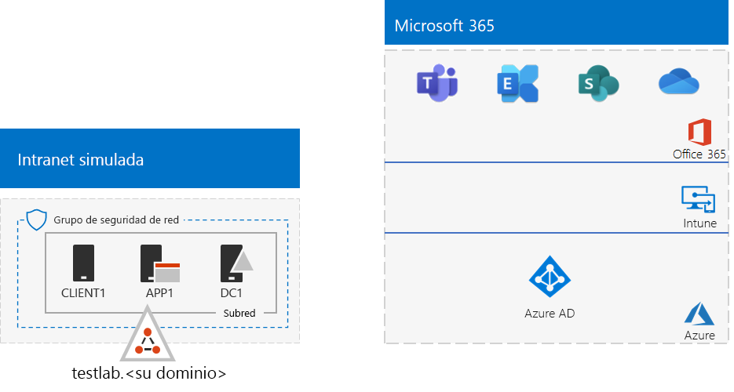
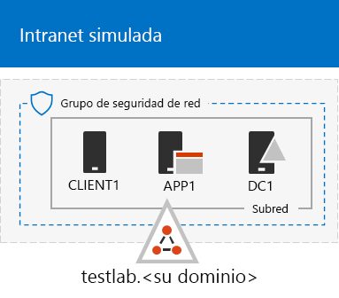
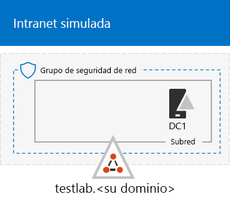
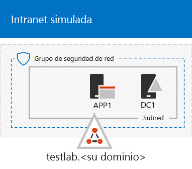

# <a name="the-simulated-enterprise-base-configuration"></a><span data-ttu-id="83ec8-103">La configuración básica empresarial simulada</span><span class="sxs-lookup"><span data-stu-id="83ec8-103">The simulated enterprise base configuration</span></span>

<span data-ttu-id="83ec8-104">*Esta guía del laboratorio de pruebas se puede usar para entornos de prueba de Microsoft 365 para empresas y office 365 Enterprise.*</span><span class="sxs-lookup"><span data-stu-id="83ec8-104">*This Test Lab Guide can be used for both Microsoft 365 for enterprise and Office 365 Enterprise test environments.*</span></span>

<span data-ttu-id="83ec8-105">En este artículo se describe cómo crear un entorno simplificado para Microsoft 365 para empresas que incluya:</span><span class="sxs-lookup"><span data-stu-id="83ec8-105">This article describes how to create a simplified environment for Microsoft 365 for enterprise that includes:</span></span>

- <span data-ttu-id="83ec8-106">Una suscripción de prueba o de pago de Microsoft 365 E5.</span><span class="sxs-lookup"><span data-stu-id="83ec8-106">A Microsoft 365 E5 trial or paid subscription.</span></span>
- <span data-ttu-id="83ec8-107">Una intranet de organización simplificada conectada a Internet, formada por tres máquinas virtuales en una red virtual de Azure (DC1, APP1 y CLIENT1).</span><span class="sxs-lookup"><span data-stu-id="83ec8-107">A simplified organization intranet connected to the internet, consisting of three virtual machines on an Azure virtual network (DC1, APP1, and CLIENT1).</span></span>
 


<span data-ttu-id="83ec8-109">La creación de un entorno de prueba simplificado implica dos fases:</span><span class="sxs-lookup"><span data-stu-id="83ec8-109">Creating a simplified test environment involves two phases:</span></span>
- [<span data-ttu-id="83ec8-110">Fase 1: Crear una intranet simulada</span><span class="sxs-lookup"><span data-stu-id="83ec8-110">Phase 1: Create a simulated intranet</span></span>](#phase-1-create-a-simulated-intranet)
- [<span data-ttu-id="83ec8-111">Fase 2: crear la suscripción a Microsoft 365 E5</span><span class="sxs-lookup"><span data-stu-id="83ec8-111">Phase 2: Create your Microsoft 365 E5 subscription</span></span>](#phase-2-create-your-microsoft-365-e5-subscription)

<span data-ttu-id="83ec8-112">Puede usar el entorno resultante para probar las características y funcionalidades de [Microsoft 365](https://www.microsoft.com/microsoft-365/enterprise) para empresas con guías de laboratorio de prueba adicionales [o](m365-enterprise-test-lab-guides.md) por su cuenta.</span><span class="sxs-lookup"><span data-stu-id="83ec8-112">You can use the resulting environment to test the features and functionality of [Microsoft 365 for enterprise](https://www.microsoft.com/microsoft-365/enterprise) with additional [Test Lab Guides](m365-enterprise-test-lab-guides.md) or on your own.</span></span>


> [!TIP]
> <span data-ttu-id="83ec8-114">Para obtener un mapa visual de todos los artículos de la pila guía del laboratorio de pruebas de Microsoft 365 para empresas, vaya a [Microsoft 365 para](../downloads/Microsoft365EnterpriseTLGStack.pdf)enterprise Test Lab Guide Stack .</span><span class="sxs-lookup"><span data-stu-id="83ec8-114">For a visual map to all the articles in the Microsoft 365 for enterprise Test Lab Guide stack, go to [Microsoft 365 for enterprise Test Lab Guide Stack](../downloads/Microsoft365EnterpriseTLGStack.pdf).</span></span>

## <a name="phase-1-create-a-simulated-intranet"></a><span data-ttu-id="83ec8-115">Fase 1: Crear una intranet simulada</span><span class="sxs-lookup"><span data-stu-id="83ec8-115">Phase 1: Create a simulated intranet</span></span>

<span data-ttu-id="83ec8-116">En esta fase, cree una intranet simulada en servicios de infraestructura de Azure que incluya un controlador de dominio de Servicios de dominio de Active Directory (AD DS), un servidor de aplicaciones y un equipo cliente.</span><span class="sxs-lookup"><span data-stu-id="83ec8-116">In this phase, build a simulated intranet in Azure infrastructure services that includes an Active Directory Domain Services (AD DS) domain controller, an application server, and a client computer.</span></span>

<span data-ttu-id="83ec8-117">Usará estos equipos en guías adicionales de [Microsoft 365](m365-enterprise-test-lab-guides.md) para el laboratorio de pruebas empresariales para configurar y demostrar la identidad híbrida y otras funcionalidades.</span><span class="sxs-lookup"><span data-stu-id="83ec8-117">You'll use these computers in additional [Microsoft 365 for enterprise Test Lab Guides](m365-enterprise-test-lab-guides.md) to configure and demonstrate hybrid identity and other capabilities.</span></span>

### <a name="method-1-build-your-simulated-intranet-with-an-azure-resource-manager-template"></a><span data-ttu-id="83ec8-118">Método 1: Crear la intranet simulada con una plantilla de Azure Resource Manager.</span><span class="sxs-lookup"><span data-stu-id="83ec8-118">Method 1: Build your simulated intranet with an Azure Resource Manager template</span></span>

<span data-ttu-id="83ec8-119">En este método, se usa una plantilla de Azure Resource Manager para crear la intranet simulada.</span><span class="sxs-lookup"><span data-stu-id="83ec8-119">In this method, you use an Azure Resource Manager template to build out the simulated intranet.</span></span> <span data-ttu-id="83ec8-120">Las plantillas de Azure Resource Manager contienen todas las instrucciones para crear la infraestructura de red de Azure, las máquinas virtuales y su configuración.</span><span class="sxs-lookup"><span data-stu-id="83ec8-120">Azure Resource Manager templates contain all of the instructions to create the Azure networking infrastructure, the virtual machines, and their configuration.</span></span>

<span data-ttu-id="83ec8-121">Antes de implementar la plantilla, lea la página [README](https://github.com/maxskunkworks/TLG/tree/master/tlg-base-config_3-vm.m365-ems) de la plantilla y tenga lista la siguiente información:</span><span class="sxs-lookup"><span data-stu-id="83ec8-121">Before deploying the template, read through the [template README page](https://github.com/maxskunkworks/TLG/tree/master/tlg-base-config_3-vm.m365-ems) and have the following information ready:</span></span>

- <span data-ttu-id="83ec8-122">El nombre de dominio DNS público del entorno de prueba (testlab. \<*your public domain*> ).</span><span class="sxs-lookup"><span data-stu-id="83ec8-122">The public DNS domain name of your test environment (testlab.\<*your public domain*>).</span></span> <span data-ttu-id="83ec8-123">Escribirá este nombre en el campo **Nombre de dominio** de la página **Implementación** personalizada.</span><span class="sxs-lookup"><span data-stu-id="83ec8-123">You'll enter this name in the **Domain Name** field of the **Custom deployment** page.</span></span>
- <span data-ttu-id="83ec8-p103">Un prefijo de etiqueta DNS para las URL de las direcciones IP públicas de sus máquinas virtuales. Tendrá que escribir esta etiqueta en el campo **Prefijo de etiqueta Dns** de la página **implementación personalizada**.</span><span class="sxs-lookup"><span data-stu-id="83ec8-p103">A DNS label prefix for the URLs of the public IP addresses of your virtual machines. You'll need to enter this label in the **Dns Label Prefix** field of the **Custom deployment** page.</span></span>

<span data-ttu-id="83ec8-126">Después de leer las instrucciones, seleccione **Implementar en Azure** en la página [README de la](https://github.com/maxskunkworks/TLG/tree/master/tlg-base-config_3-vm.m365-ems) plantilla para empezar.</span><span class="sxs-lookup"><span data-stu-id="83ec8-126">After you read through the instructions, select **Deploy to Azure** on the [template README page](https://github.com/maxskunkworks/TLG/tree/master/tlg-base-config_3-vm.m365-ems) to get started.</span></span>

>[!Note]
><span data-ttu-id="83ec8-127">La intranet simulada creada por la plantilla de Azure Resource Manager requiere una suscripción de Azure de pago.</span><span class="sxs-lookup"><span data-stu-id="83ec8-127">The simulated intranet built by the Azure Resource Manager template requires a paid Azure subscription.</span></span>

<span data-ttu-id="83ec8-128">Una vez completada la plantilla, la configuración tiene este aspecto:</span><span class="sxs-lookup"><span data-stu-id="83ec8-128">After the template is complete, your configuration looks like this:</span></span>



### <a name="method-2-build-your-simulated-intranet-with-azure-powershell"></a><span data-ttu-id="83ec8-130">Método 2: Crear la intranet simulada con Azure PowerShell</span><span class="sxs-lookup"><span data-stu-id="83ec8-130">Method 2: Build your simulated intranet with Azure PowerShell</span></span>

<span data-ttu-id="83ec8-131">En este método, utilizará Windows PowerShell y el módulo de Azure PowerShell para crear la infraestructura de red, las máquinas virtuales y su configuración.</span><span class="sxs-lookup"><span data-stu-id="83ec8-131">In this method, you use Windows PowerShell and the Azure PowerShell module to build out the networking infrastructure, the virtual machines, and their configuration.</span></span>

<span data-ttu-id="83ec8-p104">Use este método si quiere obtener experiencia en la creación de elementos de una infraestructura de Azure paso a paso con PowerShell. Puede personalizar los bloques de comandos de PowerShell para la implementación de otras máquinas virtuales en Azure.</span><span class="sxs-lookup"><span data-stu-id="83ec8-p104">Use this method if you want to get experience creating elements of Azure infrastructure one step at a time with PowerShell. You can then customize the PowerShell command blocks for your own deployment of other virtual machines in Azure.</span></span>

#### <a name="step-1-create-dc1"></a><span data-ttu-id="83ec8-134">Paso 1: Crear DC1</span><span class="sxs-lookup"><span data-stu-id="83ec8-134">Step 1: Create DC1</span></span>

<span data-ttu-id="83ec8-135">En este paso, se crea una red virtual de Azure y se agrega DC1, una máquina virtual que es un controlador de dominio para un dominio de AD DS.</span><span class="sxs-lookup"><span data-stu-id="83ec8-135">In this step, you create an Azure virtual network and add DC1, a virtual machine that is a domain controller for an AD DS domain.</span></span>

<span data-ttu-id="83ec8-136">En primer lugar, inicie un símbolo del sistema de Windows PowerShell en el equipo local.</span><span class="sxs-lookup"><span data-stu-id="83ec8-136">First, start a Windows PowerShell command prompt on your local computer.</span></span>
  
> [!NOTE]
> <span data-ttu-id="83ec8-p105">Los siguientes conjuntos de comandos utilizan la última versión de Azure PowerShell. Visite [Get started with Azure PowerShell cmdlets (Introducción a los cmdlets de Azure)](/powershell/azureps-cmdlets-docs/).</span><span class="sxs-lookup"><span data-stu-id="83ec8-p105">The following command sets use the latest version of Azure PowerShell. See [Get started with Azure PowerShell cmdlets](/powershell/azureps-cmdlets-docs/).</span></span> 
  
<span data-ttu-id="83ec8-139">Inicie sesión en su cuenta de Azure con el siguiente comando.</span><span class="sxs-lookup"><span data-stu-id="83ec8-139">Sign in to your Azure account with the following command.</span></span>
  
```powershell
Connect-AzAccount
```

<span data-ttu-id="83ec8-140">Obtenga su nombre de suscripción mediante el comando siguiente.</span><span class="sxs-lookup"><span data-stu-id="83ec8-140">Get your subscription name using the following command.</span></span>
  
```powershell
Get-AzSubscription | Sort Name | Select Name
```

<span data-ttu-id="83ec8-141">Configure su suscripción de Azure.</span><span class="sxs-lookup"><span data-stu-id="83ec8-141">Set your Azure subscription.</span></span> <span data-ttu-id="83ec8-142">Reemplace todo dentro de las comillas, incluidos los corchetes angulares ("<" y ">"), por el nombre correcto.</span><span class="sxs-lookup"><span data-stu-id="83ec8-142">Replace everything within the quotation marks, including the angle brackets ("<" and ">"), with the correct name.</span></span>
  
```powershell
$subscr="<subscription name>"
Get-AzSubscription -SubscriptionName $subscr | Select-AzSubscription
```

<span data-ttu-id="83ec8-p107">Después, cree un nuevo grupo de recursos para su entorno de pruebas empresarial simulado. Para determinar un nombre único de grupo de recursos, use este comando a fin de enumerar los grupos de recursos existentes.</span><span class="sxs-lookup"><span data-stu-id="83ec8-p107">Next, create a new resource group for your simulated enterprise test lab. To determine a unique resource group name, use this command to list your existing resource groups.</span></span>
  
```powershell
Get-AzResourceGroup | Sort ResourceGroupName | Select ResourceGroupName
```

<span data-ttu-id="83ec8-145">Cree el nuevo grupo de recursos con estos comandos.</span><span class="sxs-lookup"><span data-stu-id="83ec8-145">Create your new resource group with these commands.</span></span> <span data-ttu-id="83ec8-146">Reemplace todo dentro de las comillas, incluidos los corchetes angulares, por los nombres correctos.</span><span class="sxs-lookup"><span data-stu-id="83ec8-146">Replace everything within the quotation marks, including the angle brackets, with the correct names.</span></span>
  
```powershell
$rgName="<resource group name>"
$locName="<location name, such as West US>"
New-AzResourceGroup -Name $rgName -Location $locName
```

<span data-ttu-id="83ec8-147">A continuación, cree la red virtual TestLab que hospedará la subred de red corporativa del entorno de empresa simulado y protéjala con un grupo de seguridad de red.</span><span class="sxs-lookup"><span data-stu-id="83ec8-147">Next, create the TestLab virtual network that will host the corporate network subnet of the simulated enterprise environment and protect it with a network security group.</span></span> <span data-ttu-id="83ec8-148">Rellene el nombre del grupo de recursos y ejecute estos comandos en el símbolo del sistema de PowerShell en el equipo local.</span><span class="sxs-lookup"><span data-stu-id="83ec8-148">Fill in the name of your resource group and run these commands at the PowerShell command prompt on your local computer.</span></span>
  
```powershell
$rgName="<name of your new resource group>"
$locName=(Get-AzResourceGroup -Name $rgName).Location
$corpnetSubnet=New-AzVirtualNetworkSubnetConfig -Name Corpnet -AddressPrefix 10.0.0.0/24
New-AzVirtualNetwork -Name TestLab -ResourceGroupName $rgName -Location $locName -AddressPrefix 10.0.0.0/8 -Subnet $corpnetSubnet -DNSServer 10.0.0.4
$rule1=New-AzNetworkSecurityRuleConfig -Name "RDPTraffic" -Description "Allow RDP to all VMs on the subnet" -Access Allow -Protocol Tcp -Direction Inbound -Priority 100 -SourceAddressPrefix Internet -SourcePortRange * -DestinationAddressPrefix * -DestinationPortRange 3389
New-AzNetworkSecurityGroup -Name Corpnet -ResourceGroupName $rgName -Location $locName -SecurityRules $rule1
$vnet=Get-AzVirtualNetwork -ResourceGroupName $rgName -Name TestLab
$nsg=Get-AzNetworkSecurityGroup -Name Corpnet -ResourceGroupName $rgName
Set-AzVirtualNetworkSubnetConfig -VirtualNetwork $vnet -Name Corpnet -AddressPrefix "10.0.0.0/24" -NetworkSecurityGroup $nsg
$vnet | Set-AzVirtualNetwork
```

<span data-ttu-id="83ec8-149">Luego, debe crear la máquina virtual DC1 y configurarla como controlador de dominio para **testlab.**\<your public domain></span><span class="sxs-lookup"><span data-stu-id="83ec8-149">Next, you create the DC1 virtual machine and configure it as a domain controller for the **testlab.**\<your public domain></span></span> <span data-ttu-id="83ec8-150">Un dominio de AD DS y un servidor DNS para las máquinas virtuales de la red virtual TestLab.</span><span class="sxs-lookup"><span data-stu-id="83ec8-150">AD DS domain and a DNS server for the virtual machines of the TestLab virtual network.</span></span> <span data-ttu-id="83ec8-151">Por ejemplo, si el nombre de dominio público es **<span>contoso</span>.com**, la máquina virtual DC1 será un controlador de dominio para el dominio **<span>testlab</span>.contoso.com**.</span><span class="sxs-lookup"><span data-stu-id="83ec8-151">For example, if your public domain name is **<span>contoso</span>.com**, the DC1 virtual machine will be a domain controller for the **<span>testlab</span>.contoso.com** domain.</span></span>
  
<span data-ttu-id="83ec8-152">Para crear una máquina virtual de Azure para DC1, indique el nombre de su grupo de recursos y ejecute estos comandos desde el símbolo del sistema de PowerShell en su equipo local.</span><span class="sxs-lookup"><span data-stu-id="83ec8-152">To create an Azure virtual machine for DC1, fill in the name of your resource group and run these commands at the PowerShell command prompt on your local computer.</span></span>
  
```powershell
$rgName="<resource group name>"
$locName=(Get-AzResourceGroup -Name $rgName).Location
$vnet=Get-AzVirtualNetwork -Name TestLab -ResourceGroupName $rgName
$pip=New-AzPublicIpAddress -Name DC1-PIP -ResourceGroupName $rgName -Location $locName -AllocationMethod Dynamic
$nic=New-AzNetworkInterface -Name DC1-NIC -ResourceGroupName $rgName -Location $locName -SubnetId $vnet.Subnets[0].Id -PublicIpAddressId $pip.Id -PrivateIpAddress 10.0.0.4
$vm=New-AzVMConfig -VMName DC1 -VMSize Standard_A2_V2
$cred=Get-Credential -Message "Type the name and password of the local administrator account for DC1."
$vm=Set-AzVMOperatingSystem -VM $vm -Windows -ComputerName DC1 -Credential $cred -ProvisionVMAgent -EnableAutoUpdate
$vm=Set-AzVMSourceImage -VM $vm -PublisherName MicrosoftWindowsServer -Offer WindowsServer -Skus 2016-Datacenter -Version "latest"
$vm=Add-AzVMNetworkInterface -VM $vm -Id $nic.Id
$vm=Set-AzVMOSDisk -VM $vm -Name "DC1-OS" -DiskSizeInGB 128 -CreateOption FromImage
$diskConfig=New-AzDiskConfig -AccountType "Standard_LRS" -Location $locName -CreateOption Empty -DiskSizeGB 20
$dataDisk1=New-AzDisk -DiskName "DC1-DataDisk1" -Disk $diskConfig -ResourceGroupName $rgName
$vm=Add-AzVMDataDisk -VM $vm -Name "DC1-DataDisk1" -CreateOption Attach -ManagedDiskId $dataDisk1.Id -Lun 1
New-AzVM -ResourceGroupName $rgName -Location $locName -VM $vm
```

<span data-ttu-id="83ec8-p111">Se le pedirá un nombre de usuario y una contraseña para la cuenta de administrador local en DC1. Use una contraseña segura y registre el nombre de usuario y la contraseña en una ubicación segura.</span><span class="sxs-lookup"><span data-stu-id="83ec8-p111">You will be prompted for a user name and password for the local administrator account on DC1. Use a strong password and record both the name and password in a secure location.</span></span>
  
<span data-ttu-id="83ec8-155">A continuación, conéctese a la máquina virtual DC1:</span><span class="sxs-lookup"><span data-stu-id="83ec8-155">Next, connect to the DC1 virtual machine:</span></span>
  
1. <span data-ttu-id="83ec8-156">En [Azure Portal,](https://portal.azure.com)seleccione **Grupos** de recursos > <nombre del nuevo grupo de recursos ***_> > _* DC1**  >  **Connect**.</span><span class="sxs-lookup"><span data-stu-id="83ec8-156">In the [Azure portal](https://portal.azure.com), select **Resource Groups** > <**_the name of your new resource group_*_> > _\* DC1*\* > **Connect**.</span></span>
    
2. <span data-ttu-id="83ec8-157">En el panel abierto, seleccione **Descargar archivo RDP**.</span><span class="sxs-lookup"><span data-stu-id="83ec8-157">In the open pane, select **Download RDP file**.</span></span> <span data-ttu-id="83ec8-158">Abra el archivo DC1.rdp que se descarga y, a continuación, seleccione **Conectar**.</span><span class="sxs-lookup"><span data-stu-id="83ec8-158">Open the DC1.rdp file that is downloaded, and then select **Connect**.</span></span>
    
3. <span data-ttu-id="83ec8-159">Especifique el nombre de la cuenta del administrador local de DC1:</span><span class="sxs-lookup"><span data-stu-id="83ec8-159">Specify the DC1 local administrator account name:</span></span>
    
   - <span data-ttu-id="83ec8-160">Para Windows 7:</span><span class="sxs-lookup"><span data-stu-id="83ec8-160">For Windows 7:</span></span>
    
     <span data-ttu-id="83ec8-161">En el cuadro de diálogo Seguridad de **Windows,** **seleccione Usar otra cuenta**.</span><span class="sxs-lookup"><span data-stu-id="83ec8-161">In the **Windows Security** dialog box, select **Use another account**.</span></span> <span data-ttu-id="83ec8-162">En **Nombre de usuario,** escriba el nombre de cuenta de administrador local de **DC1 \\** < >.</span><span class="sxs-lookup"><span data-stu-id="83ec8-162">In **User name**, enter **DC1\\**<*local administrator account name*>.</span></span>
    
   - <span data-ttu-id="83ec8-163">Para Windows 8 o Windows 10:</span><span class="sxs-lookup"><span data-stu-id="83ec8-163">For Windows 8 or Windows 10:</span></span>
    
     <span data-ttu-id="83ec8-164">En el cuadro de diálogo Seguridad de **Windows,** seleccione **Más opciones** y, a continuación, **seleccione Usar una cuenta diferente.**</span><span class="sxs-lookup"><span data-stu-id="83ec8-164">In the **Windows Security** dialog box, select **More choices**, and then select **Use a different account**.</span></span> <span data-ttu-id="83ec8-165">En **Nombre de usuario,** escriba el nombre de cuenta de administrador local de **DC1 \\** < >.</span><span class="sxs-lookup"><span data-stu-id="83ec8-165">In **User name**, enter **DC1\\**<*local administrator account name*>.</span></span>
    
4. <span data-ttu-id="83ec8-166">En **Contraseña**, escriba la contraseña de la cuenta de administrador local y, a continuación, **seleccione Aceptar**.</span><span class="sxs-lookup"><span data-stu-id="83ec8-166">In **Password**, enter the password of the local administrator account, and then select **OK**.</span></span>
    
5. <span data-ttu-id="83ec8-167">Cuando se le pida, seleccione **Sí**.</span><span class="sxs-lookup"><span data-stu-id="83ec8-167">When prompted, select **Yes**.</span></span>
    
<span data-ttu-id="83ec8-168">Después, agregue otro disco de datos como nuevo volumen con la letra de unidad F: con este comando en un símbolo del sistema de Windows PowerShell con nivel de administrador en DC1.</span><span class="sxs-lookup"><span data-stu-id="83ec8-168">Next, add an extra data disk as a new volume with the drive letter F: with this command at an administrator-level Windows PowerShell command prompt on DC1.</span></span>
  
```powershell
Get-Disk | Where PartitionStyle -eq "RAW" | Initialize-Disk -PartitionStyle MBR -PassThru | New-Partition -AssignDriveLetter -UseMaximumSize | Format-Volume -FileSystem NTFS -NewFileSystemLabel "WSAD Data"
```

<span data-ttu-id="83ec8-169">A continuación, configure DC1 como controlador de dominio y servidor DNS para el dominio **testlab.**\<*your public domain*></span><span class="sxs-lookup"><span data-stu-id="83ec8-169">Next, configure DC1 as a domain controller and DNS server for the **testlab.**\<*your public domain*></span></span> <span data-ttu-id="83ec8-170">.</span><span class="sxs-lookup"><span data-stu-id="83ec8-170">domain.</span></span> <span data-ttu-id="83ec8-171">Especifique el nombre de dominio público, quite los corchetes angulares y, a continuación, ejecute estos comandos en un símbolo del sistema de nivel Windows PowerShell en DC1.</span><span class="sxs-lookup"><span data-stu-id="83ec8-171">Specify your public domain name, remove the angle brackets, and then run these commands at an administrator-level Windows PowerShell command prompt on DC1.</span></span>
  
```powershell
$yourDomain="<your public domain>"
Install-WindowsFeature AD-Domain-Services -IncludeManagementTools
Install-ADDSForest -DomainName testlab.$yourDomain -DatabasePath "F:\NTDS" -SysvolPath "F:\SYSVOL" -LogPath "F:\Logs"
```
<span data-ttu-id="83ec8-p116">Debe especificar una contraseña de administrador de modo seguro. Guarde esta contraseña en un lugar seguro.</span><span class="sxs-lookup"><span data-stu-id="83ec8-p116">You will need to specify a safe mode administrator password. Store this password in a secure location.</span></span>
  
<span data-ttu-id="83ec8-174">Tenga en cuenta que estos comandos pueden tardan unos minutos en completarse.</span><span class="sxs-lookup"><span data-stu-id="83ec8-174">Note that these commands can take a few minutes to complete.</span></span>
  
<span data-ttu-id="83ec8-175">Después de que DC1 se reinicie, vuelva a conectarse a la máquina virtual de DC1.</span><span class="sxs-lookup"><span data-stu-id="83ec8-175">After DC1 restarts, reconnect to the DC1 virtual machine.</span></span>
  
1. <span data-ttu-id="83ec8-176">En [Azure Portal,](https://portal.azure.com)seleccione **Grupos de** recursos > <nombre del grupo *de* recursos> > **DC1**  >  **Connect**.</span><span class="sxs-lookup"><span data-stu-id="83ec8-176">In the [Azure portal](https://portal.azure.com), select **Resource Groups** > <*your resource group name*> > **DC1** > **Connect**.</span></span>
    
2. <span data-ttu-id="83ec8-177">Ejecute el archivo DC1.rdp que se descarga y, a continuación, **seleccione Conectar**.</span><span class="sxs-lookup"><span data-stu-id="83ec8-177">Run the DC1.rdp file that is downloaded, and then select **Connect**.</span></span>
    
3. <span data-ttu-id="83ec8-178">En **Seguridad de Windows,** selecciona **Usar otra cuenta**.</span><span class="sxs-lookup"><span data-stu-id="83ec8-178">In **Windows Security**, select **Use another account**.</span></span> <span data-ttu-id="83ec8-179">En **Nombre de usuario,** escriba **TESTLAB \\** nombre de cuenta de administrador local < *>.*</span><span class="sxs-lookup"><span data-stu-id="83ec8-179">In **User name**, enter **TESTLAB\\**<*local administrator account name*>.</span></span>
    
4. <span data-ttu-id="83ec8-180">En el **cuadro Contraseña,** escriba la contraseña de la cuenta de administrador local y, a continuación, seleccione **Aceptar**.</span><span class="sxs-lookup"><span data-stu-id="83ec8-180">In the **Password** box, enter the password of the local administrator account, and then select **OK**.</span></span>
    
5. <span data-ttu-id="83ec8-181">Cuando se le pida, seleccione **Sí**.</span><span class="sxs-lookup"><span data-stu-id="83ec8-181">When prompted, select **Yes**.</span></span>
    
<span data-ttu-id="83ec8-182">A continuación, cree una cuenta de usuario en Active Directory que se usará al iniciar sesión en equipos miembros del dominio TESTLAB.</span><span class="sxs-lookup"><span data-stu-id="83ec8-182">Next, create a user account in Active Directory that will be used when signing in to TESTLAB domain member computers.</span></span> <span data-ttu-id="83ec8-183">En un símbolo del sistema de Windows PowerShell con un nivel de administrador, ejecute este comando:</span><span class="sxs-lookup"><span data-stu-id="83ec8-183">Run this command at an administrator-level Windows PowerShell command prompt.</span></span>
  
```powershell
New-ADUser -SamAccountName User1 -AccountPassword (read-host "Set user password" -assecurestring) -name "User1" -enabled $true -PasswordNeverExpires $true -ChangePasswordAtLogon $false
```

<span data-ttu-id="83ec8-184">Tenga en cuenta que este comando le solicita que proporcione la contraseña de la cuenta User1.</span><span class="sxs-lookup"><span data-stu-id="83ec8-184">Note that this command prompts you to supply the User1 account password.</span></span> <span data-ttu-id="83ec8-185">Esta cuenta se usará para las conexiones de escritorio remoto para todos los equipos miembros del dominio TESTLAB, así que elija una contraseña segura.</span><span class="sxs-lookup"><span data-stu-id="83ec8-185">This account will be used for remote desktop connections for all TESTLAB domain member computers, so choose a strong password.</span></span> <span data-ttu-id="83ec8-186">Anote la contraseña de la cuenta User1 y almacénela en una ubicación segura.</span><span class="sxs-lookup"><span data-stu-id="83ec8-186">Record the User1 account password and store it in a secured location.</span></span>
  
<span data-ttu-id="83ec8-p120">Después, configure la nueva cuenta User1 como administrador de esquema, empresa o dominio. En un símbolo del sistema de Windows PowerShell con nivel de administrador, ejecute este comando.</span><span class="sxs-lookup"><span data-stu-id="83ec8-p120">Next, configure the new User1 account as a domain, enterprise, and schema administrator. Run this command at the administrator-level Windows PowerShell command prompt.</span></span>
  
```powershell
$yourDomain="<your public domain>"
$domainName = "testlab."+$yourDomain
$userName="user1@" + $domainName
$userSID=(New-Object System.Security.Principal.NTAccount($userName)).Translate([System.Security.Principal.SecurityIdentifier]).Value
$groupNames=@("Domain Admins","Enterprise Admins","Schema Admins")
ForEach ($name in $groupNames) {Add-ADPrincipalGroupMembership -Identity $userSID -MemberOf (Get-ADGroup -Identity $name).SID.Value}
```

<span data-ttu-id="83ec8-189">Cierre la sesión de Escritorio remoto con DC1 y vuelva a conectarse con la cuenta TESTLAB\\User1.</span><span class="sxs-lookup"><span data-stu-id="83ec8-189">Close the Remote Desktop session with DC1 and then reconnect using the TESTLAB\\User1 account.</span></span>
  
<span data-ttu-id="83ec8-190">Después, para permitir el tráfico desde la herramienta Ping, ejecute este comando desde un símbolo del sistema de Windows PowerShell con nivel de administrador:</span><span class="sxs-lookup"><span data-stu-id="83ec8-190">Next, to allow traffic for the Ping tool, run this command at an administrator-level Windows PowerShell command prompt.</span></span>
  
```powershell
Set-NetFirewallRule -DisplayName "File and Printer Sharing (Echo Request - ICMPv4-In)" -enabled True
```

<span data-ttu-id="83ec8-191">La configuración actual tiene este aspecto:</span><span class="sxs-lookup"><span data-stu-id="83ec8-191">Your current configuration looks like this:</span></span>
  

  
#### <a name="step-2-configure-app1"></a><span data-ttu-id="83ec8-193">Paso 2: Configurar APP1</span><span class="sxs-lookup"><span data-stu-id="83ec8-193">Step 2: Configure APP1</span></span>

<span data-ttu-id="83ec8-194">En este paso, creará y configurará APP1, que es un servidor de aplicaciones que proporciona inicialmente servicios de uso compartido de archivos y web.</span><span class="sxs-lookup"><span data-stu-id="83ec8-194">In this step, you create and configure APP1, which is an application server that initially provides web and file sharing services.</span></span>

<span data-ttu-id="83ec8-195">Para crear una máquina virtual de Azure para APP1, indique el nombre de su grupo de recursos y ejecute estos comandos desde el símbolo del sistema en su equipo local.</span><span class="sxs-lookup"><span data-stu-id="83ec8-195">To create an Azure Virtual Machine for APP1, fill in the name of your resource group and run these commands at the  command prompt on your local computer.</span></span>
  
```powershell
$rgName="<resource group name>"
$locName=(Get-AzResourceGroup -Name $rgName).Location
$vnet=Get-AzVirtualNetwork -Name TestLab -ResourceGroupName $rgName
$pip=New-AzPublicIpAddress -Name APP1-PIP -ResourceGroupName $rgName -Location $locName -AllocationMethod Dynamic
$nic=New-AzNetworkInterface -Name APP1-NIC -ResourceGroupName $rgName -Location $locName -SubnetId $vnet.Subnets[0].Id -PublicIpAddressId $pip.Id
$vm=New-AzVMConfig -VMName APP1 -VMSize Standard_A2_V2
$cred=Get-Credential -Message "Type the name and password of the local administrator account for APP1."
$vm=Set-AzVMOperatingSystem -VM $vm -Windows -ComputerName APP1 -Credential $cred -ProvisionVMAgent -EnableAutoUpdate
$vm=Set-AzVMSourceImage -VM $vm -PublisherName MicrosoftWindowsServer -Offer WindowsServer -Skus 2016-Datacenter -Version "latest"
$vm=Add-AzVMNetworkInterface -VM $vm -Id $nic.Id
$vm=Set-AzVMOSDisk -VM $vm -Name "APP1-OS" -DiskSizeInGB 128 -CreateOption FromImage
New-AzVM -ResourceGroupName $rgName -Location $locName -VM $vm
```

<span data-ttu-id="83ec8-196">Después, conéctese a la máquina virtual de APP1 usando el nombre y la contraseña de la cuenta de administrador local de APP1 y abra un símbolo del sistema de Windows PowerShell.</span><span class="sxs-lookup"><span data-stu-id="83ec8-196">Next, connect to the APP1 virtual machine using the APP1 local administrator account name and password, and then open a Windows PowerShell command prompt.</span></span>
  
<span data-ttu-id="83ec8-197">Para comprobar la resolución de nombres y la comunicación de red entre APP1 y DC1, ejecute el comando **ping dc1.testlab.**\<*your public domain name*></span><span class="sxs-lookup"><span data-stu-id="83ec8-197">To check name resolution and network communication between APP1 and DC1, run the **ping dc1.testlab.**\<*your public domain name*></span></span> <span data-ttu-id="83ec8-198">y verifique que haya cuatro respuestas.</span><span class="sxs-lookup"><span data-stu-id="83ec8-198">command and verify that there are four replies.</span></span>
  
<span data-ttu-id="83ec8-199">Después, una la máquina virtual de APP1 al dominio TESTLAB con estos comandos en un símbolo del sistema de Windows PowerShell.</span><span class="sxs-lookup"><span data-stu-id="83ec8-199">Next, join the APP1 virtual machine to the TESTLAB domain with these commands at the Windows PowerShell prompt.</span></span>
  
```powershell
$yourDomain="<your public domain name>"
Add-Computer -DomainName ("testlab." + $yourDomain)
Restart-Computer
```

<span data-ttu-id="83ec8-200">Tenga en cuenta que después de ejecutar el **comando Add-Computer,** debe proporcionar las credenciales de la cuenta de dominio TESTLAB \\ User1.</span><span class="sxs-lookup"><span data-stu-id="83ec8-200">Note that you after you run the **Add-Computer** command, you must supply the TESTLAB\\User1 domain account credentials.</span></span>
  
<span data-ttu-id="83ec8-201">Una vez reiniciado APP1, conéctese a él con la cuenta TESTLAB\\User1 y luego abra un símbolo del sistema de Windows PowerShell con nivel de administrador.</span><span class="sxs-lookup"><span data-stu-id="83ec8-201">After APP1 restarts, connect to it using the TESTLAB\\User1 account, and then open an administrator-level Windows PowerShell command prompt.</span></span>
  
<span data-ttu-id="83ec8-202">Después, convierta APP1 en un servidor web con este comando en el símbolo del sistema de Windows PowerShell a nivel de administrador en APP1.</span><span class="sxs-lookup"><span data-stu-id="83ec8-202">Next, make APP1 a web server with this command at an administrator-level Windows PowerShell command prompt on APP1.</span></span>
  
```powershell
Install-WindowsFeature Web-WebServer -IncludeManagementTools
```

<span data-ttu-id="83ec8-203">Por último, cree una carpeta compartida y un archivo de texto dentro de la carpeta en APP1 con estos comandos de PowerShell.</span><span class="sxs-lookup"><span data-stu-id="83ec8-203">Next, create a shared folder and a text file within the folder on APP1 with these PowerShell commands.</span></span>
  
```powershell
New-Item -path c:\files -type directory
Write-Output "This is a shared file." | out-file c:\files\example.txt
New-SmbShare -name files -path c:\files -changeaccess TESTLAB\User1
```

<span data-ttu-id="83ec8-204">La configuración actual tiene este aspecto:</span><span class="sxs-lookup"><span data-stu-id="83ec8-204">Your current configuration looks like this:</span></span>
  

  
#### <a name="step-3-configure-client1"></a><span data-ttu-id="83ec8-206">Paso 3: Configurar CLIENT1.</span><span class="sxs-lookup"><span data-stu-id="83ec8-206">Step 3: Configure CLIENT1</span></span>

<span data-ttu-id="83ec8-207">En este paso, creará y configurará CLIENT1, que actúa como un equipo de escritorio, una tableta o un portátil típico de la intranet.</span><span class="sxs-lookup"><span data-stu-id="83ec8-207">In this step, you create and configure CLIENT1, which acts as a typical laptop, tablet, or desktop computer on the intranet.</span></span>

> [!NOTE]  
> <span data-ttu-id="83ec8-p122">El siguiente conjunto de comandos crea CLIENT1 con Windows Server 2016 Datacenter, lo que se puede realizar en todos los tipos de suscripciones de Azure. Si tiene una suscripción de Azure basada en Visual Studio, puede crear CLIENT1 con Windows 10 en [Azure Portal](https://portal.azure.com).</span><span class="sxs-lookup"><span data-stu-id="83ec8-p122">The following command set creates CLIENT1 running Windows Server 2016 Datacenter, which can be done for all types of Azure subscriptions. If you have a Visual Studio-based Azure subscription, you can create CLIENT1 running Windows 10 with the [Azure portal](https://portal.azure.com).</span></span>
  
<span data-ttu-id="83ec8-210">Para crear una máquina virtual de Azure para CLIENT1, rellene el nombre del grupo de recursos y ejecute estos comandos en el símbolo del sistema en el equipo local.</span><span class="sxs-lookup"><span data-stu-id="83ec8-210">To create an Azure Virtual Machine for CLIENT1, fill in the name of your resource group and run these commands at the command prompt on your local computer.</span></span>
  
```powershell
$rgName="<resource group name>"
$locName=(Get-AzResourceGroup -Name $rgName).Location
$vnet=Get-AzVirtualNetwork -Name TestLab -ResourceGroupName $rgName
$pip=New-AzPublicIpAddress -Name CLIENT1-PIP -ResourceGroupName $rgName -Location $locName -AllocationMethod Dynamic
$nic=New-AzNetworkInterface -Name CLIENT1-NIC -ResourceGroupName $rgName -Location $locName -SubnetId $vnet.Subnets[0].Id -PublicIpAddressId $pip.Id
$vm=New-AzVMConfig -VMName CLIENT1 -VMSize Standard_A2_V2
$cred=Get-Credential -Message "Type the name and password of the local administrator account for CLIENT1."
$vm=Set-AzVMOperatingSystem -VM $vm -Windows -ComputerName CLIENT1 -Credential $cred -ProvisionVMAgent -EnableAutoUpdate
$vm=Set-AzVMSourceImage -VM $vm -PublisherName MicrosoftWindowsServer -Offer WindowsServer -Skus 2016-Datacenter -Version "latest"
$vm=Add-AzVMNetworkInterface -VM $vm -Id $nic.Id
$vm=Set-AzVMOSDisk -VM $vm -Name "CLIENT1-OS" -DiskSizeInGB 128 -CreateOption FromImage
New-AzVM -ResourceGroupName $rgName -Location $locName -VM $vm
```

<span data-ttu-id="83ec8-211">Después, conéctese a la máquina virtual de CLIENT1 usando el nombre y la contraseña de la cuenta de administrador local de CLIENT1, y abra un símbolo del sistema de nivel de administrador de Windows PowerShell.</span><span class="sxs-lookup"><span data-stu-id="83ec8-211">Next, connect to the CLIENT1 virtual machine using the CLIENT1 local administrator account name and password, and then open an administrator-level Windows PowerShell command prompt.</span></span>
  
<span data-ttu-id="83ec8-212">Para comprobar la resolución de nombres y la comunicación de red entre CLIENT1 y DC1, ejecute el comando **ping dc1.testlab.**\<*your public domain name*></span><span class="sxs-lookup"><span data-stu-id="83ec8-212">To check name resolution and network communication between CLIENT1 and DC1, run the **ping dc1.testlab.**\<*your public domain name*></span></span> <span data-ttu-id="83ec8-213">en el símbolo del sistema de Windows PowerShell y verifique que haya cuatro respuestas.</span><span class="sxs-lookup"><span data-stu-id="83ec8-213">command at a Windows PowerShell command prompt and verify that there are four replies.</span></span>
  
<span data-ttu-id="83ec8-214">Después, una la máquina virtual de CLIENT1 al dominio TESTLAB con estos comandos en un símbolo del sistema de Windows PowerShell.</span><span class="sxs-lookup"><span data-stu-id="83ec8-214">Next, join the CLIENT1 virtual machine to the TESTLAB domain with these commands at the Windows PowerShell prompt.</span></span>
  
```powershell
$yourDomain="<your public domain name>"
Add-Computer -DomainName ("testlab." + $yourDomain)
Restart-Computer
```

<span data-ttu-id="83ec8-215">Recuerde que debe indicar las credenciales de la cuenta de dominio TESTLAB\\User1 después de ejecutar el comando **Add-Computer**.</span><span class="sxs-lookup"><span data-stu-id="83ec8-215">Note that you must supply your TESTLAB\\User1 domain account credentials after running the **Add-Computer** command.</span></span>
  
<span data-ttu-id="83ec8-216">Una vez reiniciado CLIENT1, conéctese a él con el nombre y contraseña de la cuenta TESTLAB\\User1 y luego abra un símbolo del sistema de nivel de administrador de Windows PowerShell.</span><span class="sxs-lookup"><span data-stu-id="83ec8-216">After CLIENT1 restarts, connect to it using the TESTLAB\\User1 account name and password, and then open an administrator-level Windows PowerShell command prompt.</span></span>
  
<span data-ttu-id="83ec8-217">Después, compruebe que tiene acceso a recursos compartidos de archivos y web en APP1 desde CLIENT1.</span><span class="sxs-lookup"><span data-stu-id="83ec8-217">Next, verify that you can access web and file share resources on APP1 from CLIENT1.</span></span>
  
1. <span data-ttu-id="83ec8-218">En el Administrador del servidor, en el panel de árbol, seleccione **Servidor local**.</span><span class="sxs-lookup"><span data-stu-id="83ec8-218">In Server Manager, in the tree pane, select **Local Server**.</span></span>
    
2. <span data-ttu-id="83ec8-219">En **Propiedades de CLIENT1**, seleccione **Activar junto** a Configuración de seguridad mejorada **de IE**.</span><span class="sxs-lookup"><span data-stu-id="83ec8-219">In **Properties for CLIENT1**, select **On** next to **IE Enhanced Security Configuration**.</span></span>
    
3. <span data-ttu-id="83ec8-220">En **Configuración de seguridad mejorada de Internet Explorer,** seleccione **Desactivado** **para** administradores y usuarios **y,** a continuación, seleccione **Aceptar**.</span><span class="sxs-lookup"><span data-stu-id="83ec8-220">In **Internet Explorer Enhanced Security Configuration**, select **Off** for **Administrators** and **Users**, and then select **OK**.</span></span>
    
4. <span data-ttu-id="83ec8-221">En la pantalla Inicio, **seleccione Internet Explorer** y, a continuación, seleccione **Aceptar**.</span><span class="sxs-lookup"><span data-stu-id="83ec8-221">From the Start screen, select **Internet Explorer**, and then select **OK**.</span></span>
    
5. <span data-ttu-id="83ec8-222">En la barra de direcciones, escriba **http <span>://</span>app1.testab.** \<*your public domain name*> **/** y, a continuación, presione **ENTRAR**.</span><span class="sxs-lookup"><span data-stu-id="83ec8-222">In the address bar, enter **http <span>://</span>app1.testab.**\<*your public domain name*>**/**, and then press **Enter**.</span></span> <span data-ttu-id="83ec8-223">Debería ver la página web predeterminada de Internet Information Services para APP1.</span><span class="sxs-lookup"><span data-stu-id="83ec8-223">You should see the default Internet Information Services web page for APP1.</span></span>
    
6. <span data-ttu-id="83ec8-224">En la barra de tareas de escritorio, seleccione el icono Explorador de archivos.</span><span class="sxs-lookup"><span data-stu-id="83ec8-224">On the desktop taskbar, select the File Explorer icon.</span></span>
    
7. <span data-ttu-id="83ec8-225">En la barra de direcciones, escriba **\\ \\ Archivos \\ de app1** y, a continuación, presione **Entrar**.</span><span class="sxs-lookup"><span data-stu-id="83ec8-225">In the address bar, enter **\\\\app1\\Files**, and then press **Enter**.</span></span> <span data-ttu-id="83ec8-226">Debería ver una ventana de carpeta con el contenido de la carpeta compartida Archivos.</span><span class="sxs-lookup"><span data-stu-id="83ec8-226">You should see a folder window with the contents of the Files shared folder.</span></span>
    
8. <span data-ttu-id="83ec8-p126">En la ventana de la carpeta compartida **Archivos**, haga doble clic en el archivo **Example.txt**. Debería ver el contenido del archivo Example.txt.</span><span class="sxs-lookup"><span data-stu-id="83ec8-p126">In the **Files** shared folder window, double-click the **Example.txt** file. You should see the contents of the Example.txt file.</span></span>
    
9. <span data-ttu-id="83ec8-229">Cierre las ventanas de **example.txt: Bloc de notas** y de la carpeta compartida **Archivos**.</span><span class="sxs-lookup"><span data-stu-id="83ec8-229">Close the **example.txt - Notepad** and the **Files** shared folder windows.</span></span>
    
<span data-ttu-id="83ec8-230">La configuración actual tiene este aspecto:</span><span class="sxs-lookup"><span data-stu-id="83ec8-230">Your current configuration looks like this:</span></span>
  


## <a name="phase-2-create-your-microsoft-365-e5-subscription"></a><span data-ttu-id="83ec8-232">Fase 2: crear la suscripción a Microsoft 365 E5</span><span class="sxs-lookup"><span data-stu-id="83ec8-232">Phase 2: Create your Microsoft 365 E5 subscription</span></span>

<span data-ttu-id="83ec8-p127">En esta fase, creará una nueva suscripción a Microsoft 365 E5 que usa un nuevo espacio empresarial de Azure AD, que es independiente de su suscripción de producción. Puede hacer esto de dos maneras:</span><span class="sxs-lookup"><span data-stu-id="83ec8-p127">In this phase, you create a new Microsoft 365 E5 subscription that uses a new Azure AD tenant, one that is separate from your production subscription. You can do this in two ways:</span></span>

- <span data-ttu-id="83ec8-235">Usar una suscripción de prueba de Microsoft 365 E5.</span><span class="sxs-lookup"><span data-stu-id="83ec8-235">Use a trial subscription of Microsoft 365 E5.</span></span>

  <span data-ttu-id="83ec8-p128">La suscripción de prueba de Microsoft 365 E5 es de 30 días, que puede ampliarse fácilmente a 60 días. Cuando la suscripción de prueba expire, debe convertirla en suscripción de pago o crear una nueva suscripción de prueba. Crear nuevas suscripciones de prueba significa que perderá la configuración, que podría incluir escenarios complejos.</span><span class="sxs-lookup"><span data-stu-id="83ec8-p128">The Microsoft 365 E5 trial subscription is 30 days, which can be easily extended to 60 days. When the trial subscription expires, you must either convert it to a paid subscription or create a new trial subscription. Creating new trial subscriptions means you will leave your configuration, which could include complex scenarios, behind.</span></span>  

- <span data-ttu-id="83ec8-239">Usar una suscripción de producción independiente de Microsoft 365 E5 con un pequeño número de licencias.</span><span class="sxs-lookup"><span data-stu-id="83ec8-239">Use a separate production subscription of Microsoft 365 E5 with a small number of licenses.</span></span>

  <span data-ttu-id="83ec8-240">Este es un costo adicional, pero garantiza que tiene un entorno de prueba de trabajo que no expira; en él, puede probar características, configuraciones y escenarios.</span><span class="sxs-lookup"><span data-stu-id="83ec8-240">This is an additional cost, but ensures that you have a working test environment that doesn't expire; in it, you can try features, configurations, and scenarios.</span></span> <span data-ttu-id="83ec8-241">Puede usar el mismo entorno de pruebas a largo plazo para pruebas de concepto, demostración a compañeros y administración, y desarrollo y pruebas de aplicaciones.</span><span class="sxs-lookup"><span data-stu-id="83ec8-241">You can use the same test environment over the long term for proofs of concept, demonstration to peers and management, and application development and testing.</span></span> <span data-ttu-id="83ec8-242">Esta método es el recomendado.</span><span class="sxs-lookup"><span data-stu-id="83ec8-242">This is the recommended method.</span></span>

### <a name="sign-up-for-an-office-365-e5-trial-subscription"></a><span data-ttu-id="83ec8-243">Registrarse para una suscripción de prueba de Office 365 E5</span><span class="sxs-lookup"><span data-stu-id="83ec8-243">Sign up for an Office 365 E5 trial subscription</span></span>

<span data-ttu-id="83ec8-244">Desde Azure Portal, conéctese a CLIENT1 con la cuenta CORP\User1.</span><span class="sxs-lookup"><span data-stu-id="83ec8-244">From the Azure portal, connect to CLIENT1 with the CORP\User1 account.</span></span>

<span data-ttu-id="83ec8-245">Para crear una nueva suscripción de prueba de Office 365 E5, siga las instrucciones que se indican en [Fase 1](lightweight-base-configuration-microsoft-365-enterprise.md#phase-1-create-your-microsoft-365-e5-subscription) de la guía del laboratorio de pruebas de la configuración básica ligera.</span><span class="sxs-lookup"><span data-stu-id="83ec8-245">To create a new Office 365 E5 trial subscription, perform the instructions in [Phase 1](lightweight-base-configuration-microsoft-365-enterprise.md#phase-1-create-your-microsoft-365-e5-subscription) of the lightweight base configuration Test Lab Guide.</span></span>

<span data-ttu-id="83ec8-246">Para configurar su nueva suscripción de prueba de Office 365 E5, siga las instrucciones que se indican en [Fase 2](lightweight-base-configuration-microsoft-365-enterprise.md#phase-2-configure-your-office-365-trial-subscription) de la guía del laboratorio de pruebas de la configuración básica ligera.</span><span class="sxs-lookup"><span data-stu-id="83ec8-246">To configure your new Office 365 E5 trial subscription, perform the instructions in [Phase 2](lightweight-base-configuration-microsoft-365-enterprise.md#phase-2-configure-your-office-365-trial-subscription) of the lightweight base configuration Test Lab Guide.</span></span>

#### <a name="using-an-office-365-e5-test-environment"></a><span data-ttu-id="83ec8-247">Usar un entorno de prueba de Office 365 E5</span><span class="sxs-lookup"><span data-stu-id="83ec8-247">Using an Office 365 E5 test environment</span></span>

<span data-ttu-id="83ec8-248">Si solo necesita un entorno de prueba de Office 365, no necesita leer el resto de este artículo.</span><span class="sxs-lookup"><span data-stu-id="83ec8-248">If you need only an Office 365 test environment, you do not need to read the rest of this article.</span></span>

<span data-ttu-id="83ec8-249">Para obtener guías de laboratorio de prueba adicionales que se aplican a Microsoft 365 y Office 365, vea [Microsoft 365 for enterprise Test Lab Guides](m365-enterprise-test-lab-guides.md).</span><span class="sxs-lookup"><span data-stu-id="83ec8-249">For additional Test Lab Guides that apply to both Microsoft 365 and Office 365, see [Microsoft 365 for enterprise Test Lab Guides](m365-enterprise-test-lab-guides.md).</span></span>

### <a name="add-a-microsoft-365-e5-trial-subscription"></a><span data-ttu-id="83ec8-250">Agregar una suscripción de prueba de Microsoft 365 E5</span><span class="sxs-lookup"><span data-stu-id="83ec8-250">Add a Microsoft 365 E5 trial subscription</span></span>

<span data-ttu-id="83ec8-251">Para agregar una suscripción de prueba de Microsoft 365 E5 y configurar las cuentas de usuario con licencias, siga las instrucciones de la fase [3](lightweight-base-configuration-microsoft-365-enterprise.md#phase-3-add-a-microsoft-365-e5-trial-subscription) de la Guía de pruebas de configuración básica ligera.</span><span class="sxs-lookup"><span data-stu-id="83ec8-251">To add a Microsoft 365 E5 trial subscription and configure your users accounts with licenses, perform the instructions in [Phase 3](lightweight-base-configuration-microsoft-365-enterprise.md#phase-3-add-a-microsoft-365-e5-trial-subscription) of the lightweight base configuration Test Lab Guide.</span></span>

  
## <a name="results"></a><span data-ttu-id="83ec8-252">Resultados</span><span class="sxs-lookup"><span data-stu-id="83ec8-252">Results</span></span>

<span data-ttu-id="83ec8-253">Su entorno de desarrollo y prueba ahora tiene:</span><span class="sxs-lookup"><span data-stu-id="83ec8-253">Your test environment now has:</span></span>
  
- <span data-ttu-id="83ec8-254">Suscripción de prueba de Microsoft 365 E5.</span><span class="sxs-lookup"><span data-stu-id="83ec8-254">Microsoft 365 E5 trial subscription.</span></span>
- <span data-ttu-id="83ec8-255">Todas las cuentas de usuario adecuadas están habilitadas para usar Microsoft 365 E5.</span><span class="sxs-lookup"><span data-stu-id="83ec8-255">All your appropriate user accounts are enabled to use Microsoft 365 E5.</span></span>
- <span data-ttu-id="83ec8-256">Una intranet simulada y simplificada.</span><span class="sxs-lookup"><span data-stu-id="83ec8-256">A simulated and simplified intranet.</span></span>
    
<span data-ttu-id="83ec8-257">La configuración final tiene este aspecto:</span><span class="sxs-lookup"><span data-stu-id="83ec8-257">Your final configuration looks like this:</span></span>
  

  
<span data-ttu-id="83ec8-259">Ya está listo para experimentar con características adicionales de [Microsoft 365 para empresas.](https://www.microsoft.com/microsoft-365/enterprise)</span><span class="sxs-lookup"><span data-stu-id="83ec8-259">You are now ready to experiment with additional features of [Microsoft 365 for enterprise](https://www.microsoft.com/microsoft-365/enterprise).</span></span>
  
## <a name="next-steps"></a><span data-ttu-id="83ec8-260">Pasos siguientes</span><span class="sxs-lookup"><span data-stu-id="83ec8-260">Next steps</span></span>

<span data-ttu-id="83ec8-261">Explore estos conjuntos adicionales de guías de laboratorio de pruebas:</span><span class="sxs-lookup"><span data-stu-id="83ec8-261">Explore these additional sets of Test Lab Guides:</span></span>
  
- [<span data-ttu-id="83ec8-262">Identidad</span><span class="sxs-lookup"><span data-stu-id="83ec8-262">Identity</span></span>](m365-enterprise-test-lab-guides.md#identity)
- [<span data-ttu-id="83ec8-263">Administración de dispositivos móviles</span><span class="sxs-lookup"><span data-stu-id="83ec8-263">Mobile device management</span></span>](m365-enterprise-test-lab-guides.md#mobile-device-management)
- [<span data-ttu-id="83ec8-264">Protección de la información</span><span class="sxs-lookup"><span data-stu-id="83ec8-264">Information protection</span></span>](m365-enterprise-test-lab-guides.md#information-protection)

## <a name="see-also"></a><span data-ttu-id="83ec8-265">Vea también</span><span class="sxs-lookup"><span data-stu-id="83ec8-265">See also</span></span>

[<span data-ttu-id="83ec8-266">Guías de entornos de pruebas de Microsoft 365 para empresas</span><span class="sxs-lookup"><span data-stu-id="83ec8-266">Microsoft 365 for enterprise Test Lab Guides</span></span>](m365-enterprise-test-lab-guides.md)

[<span data-ttu-id="83ec8-267">Información general de Microsoft 365 Enterprise</span><span class="sxs-lookup"><span data-stu-id="83ec8-267">Microsoft 365 for enterprise overview</span></span>](microsoft-365-overview.md)

[<span data-ttu-id="83ec8-268">Documentación para Microsoft 365 Enterprise</span><span class="sxs-lookup"><span data-stu-id="83ec8-268">Microsoft 365 for enterprise documentation</span></span>](/microsoft-365-enterprise/)