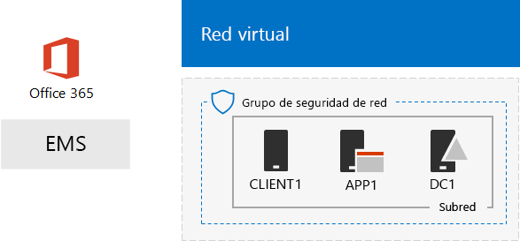
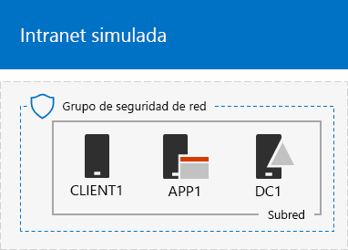
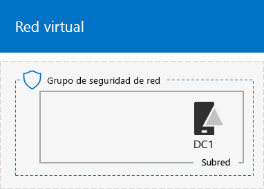
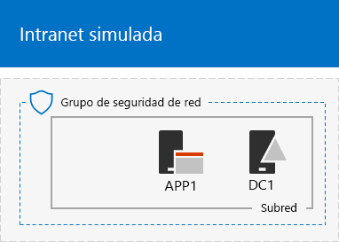

# <a name="the-simulated-enterprise-base-configuration"></a>La configuración básica empresarial simulada

*Esta guía del laboratorio de pruebas puede usarse tanto para entornos de prueba de Microsoft 365 Enterprise como de Office 365 Enterprise.*

En este artículo se ofrecen instrucciones paso a paso para crear un entorno simplificado para Microsoft 365 Enterprise que incluye:

- Una suscripción de prueba o de pago de Microsoft 365 E5.
- Una intranet de organización simplificada conectada a Internet, que consta de tres máquinas virtuales en una red virtual de Azure (DC1, APP1 y CLIENTE1).
 


Puede usar el entorno resultante para probar las características y funcionalidades de [Microsoft 365 Enterprise](https://www.microsoft.com/microsoft-365/enterprise), con [guías de laboratorio de pruebas](m365-enterprise-test-lab-guides.md) adicionales o por su cuenta.


> [!TIP]
> Haga clic [aquí](media/m365-enterprise-test-lab-guides/Microsoft365EnterpriseTLGStack.pdf) para ver un mapa visual de todos los artículos de la pila Guía de laboratorio de pruebas de Microsoft 365 Enterprise.

## <a name="phase-1-create-a-simulated-intranet"></a>Fase 1: Crear una intranet simulada

En esta fase, puede crear una intranet simulada en servicios de infraestructura de Azure que incluya un controlador de dominio de Active Directory Domain Services (AD DS), un servidor de aplicaciones y un equipo cliente. 

Utilizará estos equipos en otras [Guías del laboratorio de pruebas de Microsoft 365 Enterprise](m365-enterprise-test-lab-guides.md) para configurar y demostrar la identidad híbrida y otras funciones.

### <a name="method-1-build-your-simulated-intranet-with-an-azure-resource-manager-template"></a>Método 1: Crear la intranet simulada con una plantilla de Azure Resource Manager.

En este método, usará una plantilla de Azure Resource Manager (ARM) para crear la intranet simulada. Las plantillas ARM contienen todas las instrucciones para crear la infraestructura de red de Azure, las máquinas virtuales y su configuración.

Antes de implementar la plantilla, lea la [Página de plantilla Léame](https://github.com/maxskunkworks/TLG/tree/master/tlg-base-config_3-vm.m365-ems) y prepare la siguiente información:

- El nombre de dominio DNS público de su entorno de prueba (práctica de prueba.\<su dominio público>). Deberá escribir este nombre en el **campo Nombre de dominio** de la página **Implementación personalizada**.
- Un prefijo de etiqueta DNS para las URL de las direcciones IP públicas de sus máquinas virtuales. Tendrá que escribir esta etiqueta en el campo **Prefijo de etiqueta Dns** de la página **implementación personalizada**.

Después de leer las instrucciones, haga clic en **Implementar en Azure** en la [página de plantilla Léame](https://github.com/maxskunkworks/TLG/tree/master/tlg-base-config_3-vm.m365-ems) para empezar.

>[!Note]
>La intranet simulada creada por la plantilla ARM requiere una suscripción pagada de Azure.
>

Esta la configuración una vez completada la plantilla.



### <a name="method-2-build-your-simulated-intranet-with-azure-powershell"></a>Método 2: Crear la intranet simulada con Azure PowerShell

En este método, utilizará Windows PowerShell y el módulo de Azure PowerShell para crear la infraestructura de red, las máquinas virtuales y su configuración.

Use este método si quiere obtener experiencia en la creación de elementos de una infraestructura de Azure paso a paso con PowerShell. Puede personalizar los bloques de comandos de PowerShell para la implementación de otras máquinas virtuales en Azure.

#### <a name="step-1-create-dc1"></a>Paso 1: Crear DC1

En este paso, se crea una red virtual de Azure y se agrega DC1, una máquina virtual que es un controlador de dominio para un dominio de AD DS.

En primer lugar, inicie un símbolo del sistema de Windows PowerShell en el equipo local.
  
> [!NOTE]
> Los siguientes conjuntos de comandos utilizan la última versión de Azure PowerShell. Visite [Get started with Azure PowerShell cmdlets (Introducción a los cmdlets de Azure)](https://docs.microsoft.com/powershell/azureps-cmdlets-docs/). 
  
Inicie sesión en su cuenta de Azure con el siguiente comando.
  
```powershell
Connect-AzAccount
```

Obtenga su nombre de suscripción mediante el comando siguiente.
  
```powershell
Get-AzSubscription | Sort Name | Select Name
```

Configure su suscripción de Azure. Cambie todo el contenido entrecomillado, incluidos los caracteres < y >, por los nombres correctos.
  
```powershell
$subscr="<subscription name>"
Get-AzSubscription -SubscriptionName $subscr | Select-AzSubscription
```

Después, cree un nuevo grupo de recursos para su entorno de pruebas empresarial simulado. Para determinar un nombre único de grupo de recursos, use este comando a fin de enumerar los grupos de recursos existentes.
  
```powershell
Get-AzResourceGroup | Sort ResourceGroupName | Select ResourceGroupName
```

Cree el nuevo grupo de recursos con estos comandos. Reemplace todo el contenido entrecomillado, incluidos los caracteres < y >, por los nombres correctos.
  
```powershell
$rgName="<resource group name>"
$locName="<location name, such as West US>"
New-AzResourceGroup -Name $rgName -Location $locName
```

Después, cree una red virtual de laboratorio de pruebas para hospedar la subred de la red corporativa del entorno empresarial simulado y protegerla con un grupo de seguridad de red. Rellene el nombre de su grupo de recursos y ejecute estos comandos en el símbolo del sistema de PowerShell en el equipo local.
  
```powershell
$rgName="<name of your new resource group>"
$locName=(Get-AzResourceGroup -Name $rgName).Location
$corpnetSubnet=New-AzVirtualNetworkSubnetConfig -Name Corpnet -AddressPrefix 10.0.0.0/24
New-AzVirtualNetwork -Name TestLab -ResourceGroupName $rgName -Location $locName -AddressPrefix 10.0.0.0/8 -Subnet $corpnetSubnet -DNSServer 10.0.0.4
$rule1=New-AzNetworkSecurityRuleConfig -Name "RDPTraffic" -Description "Allow RDP to all VMs on the subnet" -Access Allow -Protocol Tcp -Direction Inbound -Priority 100 -SourceAddressPrefix Internet -SourcePortRange * -DestinationAddressPrefix * -DestinationPortRange 3389
New-AzNetworkSecurityGroup -Name Corpnet -ResourceGroupName $rgName -Location $locName -SecurityRules $rule1
$vnet=Get-AzVirtualNetwork -ResourceGroupName $rgName -Name TestLab
$nsg=Get-AzNetworkSecurityGroup -Name Corpnet -ResourceGroupName $rgName
Set-AzVirtualNetworkSubnetConfig -VirtualNetwork $vnet -Name Corpnet -AddressPrefix "10.0.0.0/24" -NetworkSecurityGroup $nsg
$vnet | Set-AzVirtualNetwork
```

Después cree la máquina virtual DC1 y configúrela como controlador de dominio para el **testlab.**\<su dominio público> dominio de AD DS y un servidor DNS para las máquinas virtuales de la red virtual de TestLab. Por ejemplo, si el nombre de dominio público es **<span>contoso</span>.com**, la máquina virtual DC1 será un controlador de dominio para el dominio **<span>testlab</span>.contoso.com**.
  
Para crear una máquina virtual de Azure para DC1, indique el nombre de su grupo de recursos y ejecute estos comandos desde el símbolo del sistema de PowerShell en su equipo local.
  
```powershell
$rgName="<resource group name>"
$locName=(Get-AzResourceGroup -Name $rgName).Location
$vnet=Get-AzVirtualNetwork -Name TestLab -ResourceGroupName $rgName
$pip=New-AzPublicIpAddress -Name DC1-PIP -ResourceGroupName $rgName -Location $locName -AllocationMethod Dynamic
$nic=New-AzNetworkInterface -Name DC1-NIC -ResourceGroupName $rgName -Location $locName -SubnetId $vnet.Subnets[0].Id -PublicIpAddressId $pip.Id -PrivateIpAddress 10.0.0.4
$vm=New-AzVMConfig -VMName DC1 -VMSize Standard_A1
$cred=Get-Credential -Message "Type the name and password of the local administrator account for DC1."
$vm=Set-AzVMOperatingSystem -VM $vm -Windows -ComputerName DC1 -Credential $cred -ProvisionVMAgent -EnableAutoUpdate
$vm=Set-AzVMSourceImage -VM $vm -PublisherName MicrosoftWindowsServer -Offer WindowsServer -Skus 2016-Datacenter -Version "latest"
$vm=Add-AzVMNetworkInterface -VM $vm -Id $nic.Id
$vm=Set-AzVMOSDisk -VM $vm -Name "DC1-OS" -DiskSizeInGB 128 -CreateOption FromImage
$diskConfig=New-AzDiskConfig -AccountType "Standard_LRS" -Location $locName -CreateOption Empty -DiskSizeGB 20
$dataDisk1=New-AzDisk -DiskName "DC1-DataDisk1" -Disk $diskConfig -ResourceGroupName $rgName
$vm=Add-AzVMDataDisk -VM $vm -Name "DC1-DataDisk1" -CreateOption Attach -ManagedDiskId $dataDisk1.Id -Lun 1
New-AzVM -ResourceGroupName $rgName -Location $locName -VM $vm
```

Se le pedirá un nombre de usuario y una contraseña para la cuenta de administrador local en DC1. Use una contraseña segura y registre el nombre de usuario y la contraseña en una ubicación segura.
  
Después conéctese a la máquina virtual DC1.
  
1. En el [Azure Portal](https://portal.azure.com), haga clic en **Grupos de recursos** [nombre del nuevo grupo de recursos nuevo] **> DC1 > Conectar**.
    
2. En el panel abierto, haga clic en **Descargar archivo RDP**. Abra el archivo DC1.rdp descargado y, después, haga clic en **Conectar**.
    
3. Especifique el nombre de la cuenta del administrador local de DC1:
    
   - Para Windows 7:
    
     En el cuadro de diálogo **Seguridad de Windows**, haga clic en **Usar otra cuenta**. En **Nombre de usuario**, escriba **DC1\\**[nombre de la cuenta de administrador local].
    
   - Para Windows 8 o Windows 10:
    
     En el cuadro de diálogo **Seguridad de Windows**, haga clic en **Más opciones** y luego en **Usar una cuenta diferente**. En **Nombre de usuario**, escriba **DC1\\**[nombre de la cuenta de administrador local]
    
4. En **Contraseña**, escriba la contraseña de la cuenta de administrador local y luego haga clic en **Aceptar**.
    
5. Cuando se le solicite, haga clic en **Sí**.
    
Después, agregue otro disco de datos como nuevo volumen con la letra de unidad F: con este comando en un símbolo del sistema de Windows PowerShell con nivel de administrador en DC1.
  
```powershell
Get-Disk | Where PartitionStyle -eq "RAW" | Initialize-Disk -PartitionStyle MBR -PassThru | New-Partition -AssignDriveLetter -UseMaximumSize | Format-Volume -FileSystem NTFS -NewFileSystemLabel "WSAD Data"
```

Luego, configure DC1 como un controlador de dominio y servidor DNS para el **testlab.**\<su dominio público > dominio. Especifique el nombre de dominio público, quite los caracteres \< y > y después ejecute estos comandos en un símbolo del sistema de Windows PowerShell de nivel de administrador en DC1.
  
```powershell
$yourDomain="<your public domain>"
Install-WindowsFeature AD-Domain-Services -IncludeManagementTools
Install-ADDSForest -DomainName testlab.$yourDomain -DatabasePath "F:\NTDS" -SysvolPath "F:\SYSVOL" -LogPath "F:\Logs"
```
Debe especificar una contraseña de administrador de modo seguro. Guarde esta contraseña en un lugar seguro.
  
Tenga en cuenta que estos comandos pueden tardan unos minutos en completarse.
  
Después de que DC1 se reinicie, vuelva a conectarse a la máquina virtual de DC1.
  
1. En [Azure Portal](https://portal.azure.com), haga clic en **Grupos de recursos >** [nombre del grupo de recursos] **> DC1 > Conectar**.
    
2. Ejecute el archivo DC1.rdp que se descarga y luego haga clic en **Conectar**.
    
3. En **Seguridad de Windows**, haga clic en **Usar otra cuenta**. En **Nombre de usuario**, escriba **TESTLAB\\**[nombre de la cuenta de administrador local].
    
4. En **Contraseña**, escriba la contraseña de la cuenta de administrador local y luego haga clic en **Aceptar**.
    
5. Cuando se le solicite, haga clic en **Sí**.
    
Después, cree una cuenta de usuario en Active Directory que se usará al iniciar sesión en equipos de miembros del dominio TESTLAB. En un símbolo del sistema de Windows PowerShell con un nivel de administrador, ejecute este comando:
  
```powershell
New-ADUser -SamAccountName User1 -AccountPassword (read-host "Set user password" -assecurestring) -name "User1" -enabled $true -PasswordNeverExpires $true -ChangePasswordAtLogon $false
```

Tenga en cuenta que este comando le solicita que proporcione la contraseña de la cuenta User1. Dado que esta cuenta se usará para las conexiones de Escritorio remoto en todos los equipos miembros del dominio TESTLAB, elija una contraseña segura. Anote la contraseña de la cuenta User1 y almacénela en una ubicación segura.
  
Después, configure la nueva cuenta User1 como administrador de esquema, empresa o dominio. En un símbolo del sistema de Windows PowerShell con nivel de administrador, ejecute este comando.
  
```powershell
$yourDomain="<your public domain>"
$domainName = "testlab"+$yourDomain
$userName="user1@" + $domainName
$userSID=(New-Object System.Security.Principal.NTAccount($userName)).Translate([System.Security.Principal.SecurityIdentifier]).Value
$groupNames=@("Domain Admins","Enterprise Admins","Schema Admins")
ForEach ($name in $groupNames) {Add-ADPrincipalGroupMembership -Identity $userSID -MemberOf (Get-ADGroup -Identity $name).SID.Value}
```

Cierre la sesión de Escritorio remoto con DC1 y vuelva a conectarse con la cuenta TESTLAB\\User1.
  
Después, para permitir el tráfico desde la herramienta Ping, ejecute este comando desde un símbolo del sistema de Windows PowerShell con nivel de administrador:
  
```powershell
Set-NetFirewallRule -DisplayName "File and Printer Sharing (Echo Request - ICMPv4-In)" -enabled True
```

Esta es su configuración actual.
  

  
#### <a name="step-2-configure-app1"></a>Paso 2: Configurar APP1

En este paso, creará y configurará APP1, que es un servidor de aplicaciones que proporciona inicialmente servicios de uso compartido de archivos y web.

Para crear una máquina virtual de Azure para APP1, indique el nombre de su grupo de recursos y ejecute estos comandos desde el símbolo del sistema en su equipo local.
  
```powershell
$rgName="<resource group name>"
$locName=(Get-AzResourceGroup -Name $rgName).Location
$vnet=Get-AzVirtualNetwork -Name TestLab -ResourceGroupName $rgName
$pip=New-AzPublicIpAddress -Name APP1-PIP -ResourceGroupName $rgName -Location $locName -AllocationMethod Dynamic
$nic=New-AzNetworkInterface -Name APP1-NIC -ResourceGroupName $rgName -Location $locName -SubnetId $vnet.Subnets[0].Id -PublicIpAddressId $pip.Id
$vm=New-AzVMConfig -VMName APP1 -VMSize Standard_A1
$cred=Get-Credential -Message "Type the name and password of the local administrator account for APP1."
$vm=Set-AzVMOperatingSystem -VM $vm -Windows -ComputerName APP1 -Credential $cred -ProvisionVMAgent -EnableAutoUpdate
$vm=Set-AzVMSourceImage -VM $vm -PublisherName MicrosoftWindowsServer -Offer WindowsServer -Skus 2016-Datacenter -Version "latest"
$vm=Add-AzVMNetworkInterface -VM $vm -Id $nic.Id
$vm=Set-AzVMOSDisk -VM $vm -Name "APP1-OS" -DiskSizeInGB 128 -CreateOption FromImage
New-AzVM -ResourceGroupName $rgName -Location $locName -VM $vm
```

Después, conéctese a la máquina virtual de APP1 usando el nombre y la contraseña de la cuenta de administrador local de APP1 y abra un símbolo del sistema de Windows PowerShell.
  
Para comprobar la comunicación de red y la resolución de nombres entre APP1 y DC1, ejecute el comando **ping dc1.testlab.**\< y compruebe que haya cuatro respuestas.
  
Después, una la máquina virtual de APP1 al dominio TESTLAB con estos comandos en un símbolo del sistema de Windows PowerShell.
  
```powershell
$yourDomain="<your public domain name>"
Add-Computer -DomainName ("testlab" + $yourDomain)
Restart-Computer
```

Recuerde que debe indicar las credenciales de la cuenta de dominio TESTLAB\\User1 después de ejecutar el comando **Add-Computer**.
  
Una vez reiniciado APP1, conéctese a él con la cuenta TESTLAB\\User1 y luego abra un símbolo del sistema de Windows PowerShell con nivel de administrador.
  
Después, convierta APP1 en un servidor web con este comando en el símbolo del sistema de Windows PowerShell a nivel de administrador en APP1.
  
```powershell
Install-WindowsFeature Web-WebServer -IncludeManagementTools
```

Por último, cree una carpeta compartida y un archivo de texto dentro de la carpeta en APP1 con estos comandos de PowerShell.
  
```powershell
New-Item -path c:\files -type directory
Write-Output "This is a shared file." | out-file c:\files\example.txt
New-SmbShare -name files -path c:\files -changeaccess TESTLAB\User1
```

Esta es su configuración actual.
  

  
#### <a name="step-3-configure-client1"></a>Paso 3: Configurar CLIENT1.

En este paso, creará y configurará CLIENT1, que actúa como un equipo de escritorio, una tableta o un portátil típico de la intranet.

> [!NOTE]  
> El siguiente conjunto de comandos crea CLIENT1 con Windows Server 2016 Datacenter, lo que se puede realizar en todos los tipos de suscripciones de Azure. Si tiene una suscripción de Azure basada en Visual Studio, puede crear CLIENT1 con Windows 10 en [Azure Portal](https://portal.azure.com). 
  
Para crear una máquina virtual de Azure para CLIENT1, indique el nombre de su grupo de recursos y ejecute estos comandos desde el símbolo del sistema en su equipo local.
  
```powershell
$rgName="<resource group name>"
$locName=(Get-AzResourceGroup -Name $rgName).Location
$vnet=Get-AzVirtualNetwork -Name TestLab -ResourceGroupName $rgName
$pip=New-AzPublicIpAddress -Name CLIENT1-PIP -ResourceGroupName $rgName -Location $locName -AllocationMethod Dynamic
$nic=New-AzNetworkInterface -Name CLIENT1-NIC -ResourceGroupName $rgName -Location $locName -SubnetId $vnet.Subnets[0].Id -PublicIpAddressId $pip.Id
$vm=New-AzVMConfig -VMName CLIENT1 -VMSize Standard_A1
$cred=Get-Credential -Message "Type the name and password of the local administrator account for CLIENT1."
$vm=Set-AzVMOperatingSystem -VM $vm -Windows -ComputerName CLIENT1 -Credential $cred -ProvisionVMAgent -EnableAutoUpdate
$vm=Set-AzVMSourceImage -VM $vm -PublisherName MicrosoftWindowsServer -Offer WindowsServer -Skus 2016-Datacenter -Version "latest"
$vm=Add-AzVMNetworkInterface -VM $vm -Id $nic.Id
$vm=Set-AzVMOSDisk -VM $vm -Name "CLIENT1-OS" -DiskSizeInGB 128 -CreateOption FromImage
New-AzVM -ResourceGroupName $rgName -Location $locName -VM $vm
```

Después, conéctese a la máquina virtual de CLIENT1 usando el nombre y la contraseña de la cuenta de administrador local de CLIENT1, y abra un símbolo del sistema de nivel de administrador de Windows PowerShell.
  
Para comprobar la comunicación de red y la resolución de nombres entre CLIENT1 y DC1, ejecute el comando **ping dc1.testlab.**\< en un símbolo del sistema de Windows PowerShell y compruebe que haya cuatro respuestas.
  
Después, una la máquina virtual de CLIENT1 al dominio TESTLAB con estos comandos en un símbolo del sistema de Windows PowerShell.
  
```powershell
$yourDomain="<your public domain name>"
Add-Computer -DomainName ("testlab" + $yourDomain)
Restart-Computer
```

Recuerde que debe indicar las credenciales de la cuenta de dominio TESTLAB\\User1 después de ejecutar el comando **Add-Computer**.
  
Una vez reiniciado CLIENT1, conéctese a él con el nombre y contraseña de la cuenta TESTLAB\\User1 y luego abra un símbolo del sistema de nivel de administrador de Windows PowerShell.
  
Después, compruebe que tiene acceso a recursos compartidos de archivos y web en APP1 desde CLIENT1.
  
1. En el panel de árbol del Administrador del servidor, haga clic en **Servidor Local**.
    
2. En **Propiedades de CLIENT1**, haga clic en la opción **Activada** al lado de **Configuración de seguridad mejorada de IE**.
    
3. En **Configuración de seguridad mejorada de Internet Explorer**, haga clic en **Desactivada** para **Administradores** y **Usuarios** y luego, en **Aceptar**.
    
4. En la pantalla Inicio, haga clic en **Internet Explorer** y, después, en **Aceptar**.
    
5. En la barra de direcciones, escriba **http<span>://</span>app1.testab.**\<su nombre de dominio público>**/** y después presione ENTRAR. Verá la página web predeterminada de Internet Information Services para APP1.
    
6. En la barra de tareas del escritorio, haga clic en el icono del Explorador de archivos.
    
7. En la barra de direcciones, escriba **\\\\app1\\Files** y luego presione ENTRAR. Debería ver una ventana de carpeta con el contenido de la carpeta compartida Archivos.
    
8. En la ventana de la carpeta compartida **Archivos**, haga doble clic en el archivo **Example.txt**. Debería ver el contenido del archivo Example.txt.
    
9. Cierre las ventanas de **example.txt: Bloc de notas** y de la carpeta compartida **Archivos**.
    
Esta es su configuración actual.
  


## <a name="phase-2-create-your-microsoft-365-e5-subscription"></a>Fase 2: Crear la suscripción a Microsoft 365 E5

En esta fase, creará una nueva suscripción a Microsoft 365 E5 que usa un nuevo inquilino de Azure AD, que es independiente de su suscripción de producción. Puede hacer esto de dos maneras:

- Usar una suscripción de prueba de Microsoft 365 E5. 

  La suscripción de prueba de Microsoft 365 E5 es de 30 días, que puede ampliarse fácilmente a 60 días. Cuando la suscripción de prueba expire, debe convertirla en suscripción de pago o crear una nueva suscripción de prueba. Crear nuevas suscripciones de prueba significa que perderá la configuración, que podría incluir escenarios complejos.  

- Usar una suscripción de producción independiente de Microsoft 365 E5 con un pequeño número de licencias.

  Esto supone un coste adicional, pero garantiza que dispone de un entorno de prueba funcional para probar escenarios, características y configuraciones que no caduca. Puede usar el mismo entorno de prueba a largo plazo para pruebas de concepto, demostraciones a compañeros y jefes, y desarrollar aplicaciones y probarlas. Este es el método recomendado.

Para iniciar la suscripción de prueba de Microsoft 365 E5, en primer lugar necesita un nombre de compañía ficticio y una nueva cuenta de Microsoft.
  
1. Le recomendamos que use una variante del nombre de la compañía Contoso para el nombre de su compañía, que es una compañía ficticia usada en contenido de ejemplo de Microsoft, pero no es imprescindible. Anote aquí el nombre de la compañía ficticia: 
    
2. Para registrarse para obtener una nueva cuenta Microsoft, vaya a [https://outlook.com](https://outlook.com) y cree una cuenta con una nueva cuenta y una dirección de correo electrónico. Usará esta cuenta para suscribirse a Office 365.
    
  - Anote aquí el nombre y los apellidos de la nueva cuenta: 
    
  - Anote aquí la dirección de la nueva cuenta de correo electrónico: @outlook.com
    
### <a name="sign-up-for-an-office-365-e5-trial-subscription"></a>Registrarse para una suscripción de prueba a Office 365 E5

Inicie con una suscripción de prueba de Office 365 E5, después, agregue la suscripción a Microsoft 365 E5.

1. Para el entorno de desarrollo y pruebas de Office 365 de la empresa ficticia, conéctese a CLIENTE1 con la cuenta CORP\Usuario1 desde Azure Portal.  En la pantalla Inicio, ejecute Microsoft Edge y vaya a [https://aka.ms/e5trial](https://aka.ms/e5trial).
    
2. En la página **Bienvenido. Permítanos conocerle**, especifique:
    
  - Su ubicación física
    
  - El nombre y apellidos de la nueva cuenta de Microsoft
    
  - La dirección de la nueva cuenta de correo
    
  - El número de teléfono del trabajo
    
  - El nombre de la compañía ficticia
    
  - El tamaño de la organización (250 a 999 personas)
    
3. Haga clic en **Un solo paso más**.
    
4. En la página **Crear su id. de usuario**, escriba un nombre de usuario basado en la nueva dirección de correo, la empresa ficticia después del signo @ (quite todos los espacios en el nombre) y una contraseña (dos veces) para esta nueva cuenta de Office 365. 
    
    Anote en un lugar seguro la contraseña que escriba.
    
    Anote aquí el nombre de la compañía ficticia, que se denominará **nombre de la organización**: 
    
5. Haga clic en **Crear mi cuenta**.
    
6. En la página **Demuestre. Que. No. Es. Un. Robot.**, escriba el número de teléfono de su teléfono compatible con texto y, después, haga clic en **Enviarme un mensaje**.
    
7. Escriba el código de verificación del mensaje de texto recibido y, después, haga clic en **Siguiente**.
    
8. Anote aquí la URL de la página de inicio de sesión (seleccionar y copiar): 
    
9. Anote aquí el identificador de usuario (seleccionar y copiar): .onmicrosoft.com
    
    Este valor se denominará **nombre de administrador global de Office 365**.
    
10. Cuando vea **Ya está listo**, haga clic.
    
11. En la página siguiente, espere hasta que Office 365 complete la configuración y estén disponibles todos los iconos.
    
Debe ver la Página principal del portal 365 de Office, desde la que puede obtener acceso a los servicios de Office y al centro de administración de Microsoft 365.
  
Tenemos que crear una suscripción de prueba de Office 365 para que su entorno de desarrollo y prueba tenga un espacio empresarial de Azure AD separado de cualquier suscripción de pago que tenga actualmente.  Esta separación significa que puede agregar y quitar usuarios y grupos en el espacio empresarial de prueba sin que afecte a las suscripciones de producción.
    
### <a name="configure-your-office-365-e5-trial-subscription"></a>Configure su suscripción de prueba de Office 365 E5

Luego, configurará la suscripción de Office 365 E5 con otros usuarios y las asignará a las licencias de Office 365 E5.
  
Siga las instrucciones que se indican en [Conectarse a Office 365 PowerShell](https://docs.microsoft.com/office365/enterprise/powershell/connect-to-office-365-powershell#connect-with-the-azure-active-directory-powershell-for-graph-module) para conectarse a la suscripción a Office 365 con el módulo de Azure Active Directory PowerShell para Graph, la máquina virtual cliente1.
    
En el cuadro de diálogo Solicitud de credenciales para Windows PowerShell, escriba el nombre de administrador global de Office 365 (por ejemplo, svalladares@contosotoycompany.onmicrosoft.com) y la contraseña.
  
Rellene el nombre de la organización (ejemplo: contosotoycompany), el código de país de dos caracteres para su ubicación, la contraseña de cuenta común y, después, ejecute los comandos siguientes desde el símbolo del sistema de PowerShell:

```powershell
$orgName="<organization name>"
$loc="<two-character country code, such as US>"
$commonPW="<common user account password>"
$PasswordProfile=New-Object -TypeName Microsoft.Open.AzureAD.Model.PasswordProfile
$PasswordProfile.Password=$commonPW

$userUPN= "user2@" + $orgName + ".onmicrosoft.com"
New-AzureADUser -DisplayName "User 2" -GivenName User -SurName 2 -UserPrincipalName $userUPN -UsageLocation $loc -AccountEnabled $true -PasswordProfile $PasswordProfile -MailNickName "user2"
$License = New-Object -TypeName Microsoft.Open.AzureAD.Model.AssignedLicense
$License.SkuId = (Get-AzureADSubscribedSku | Where-Object -Property SkuPartNumber -Value "ENTERPRISEPREMIUM" -EQ).SkuID
$LicensesToAssign = New-Object -TypeName Microsoft.Open.AzureAD.Model.AssignedLicenses
$LicensesToAssign.AddLicenses = $License
Set-AzureADUserLicense -ObjectId $userUPN -AssignedLicenses $LicensesToAssign

$userUPN= "user3@" + $orgName + ".onmicrosoft.com"
New-AzureADUser -DisplayName "User 3" -GivenName User -SurName 3 -UserPrincipalName $userUPN -UsageLocation $loc -AccountEnabled $true -PasswordProfile $PasswordProfile -MailNickName "user3"
$License = New-Object -TypeName Microsoft.Open.AzureAD.Model.AssignedLicense
$License.SkuId = (Get-AzureADSubscribedSku | Where-Object -Property SkuPartNumber -Value "ENTERPRISEPREMIUM" -EQ).SkuID
$LicensesToAssign = New-Object -TypeName Microsoft.Open.AzureAD.Model.AssignedLicenses
$LicensesToAssign.AddLicenses = $License
Set-AzureADUserLicense -ObjectId $userUPN -AssignedLicenses $LicensesToAssign

$userUPN= "user4@" + $orgName + ".onmicrosoft.com"
New-AzureADUser -DisplayName "User 4" -GivenName User -SurName 4 -UserPrincipalName $userUPN -UsageLocation $loc -AccountEnabled $true -PasswordProfile $PasswordProfile -MailNickName "user4"
$License = New-Object -TypeName Microsoft.Open.AzureAD.Model.AssignedLicense
$License.SkuId = (Get-AzureADSubscribedSku | Where-Object -Property SkuPartNumber -Value "ENTERPRISEPREMIUM" -EQ).SkuID
$LicensesToAssign = New-Object -TypeName Microsoft.Open.AzureAD.Model.AssignedLicenses
$LicensesToAssign.AddLicenses = $License
Set-AzureADUserLicense -ObjectId $userUPN -AssignedLicenses $LicensesToAssign
```
> [!NOTE]
> Se usa una contraseña común para automatizar y facilitar la configuración de un entorno de prueba y desarrollo. Evidentemente, esto no se recomienda en el caso de suscripciones de producción. 

#### <a name="record-key-information-for-future-reference"></a>Guardar información clave para futuras referencias

Es recomendable que imprima este artículo para registrar la información específica que necesitará para este entorno durante los 30 días de la suscripción de prueba de Office 365. Puede extender fácilmente la suscripción de prueba otros 30 días. Para un entorno de desarrollo y pruebas permanentes, cree una nueva suscripción de pago con un espacio empresarial de Azure AD distinto y un número reducido de licencias.

Registre estos valores:
  
- Nombre del administrador global de Office 365: .onmicrosoft.com (del paso 9 de la fase 2)
    
    Guarde también la contraseña de esta cuenta en una ubicación segura.
    
- Nombre de la organización de la suscripción de prueba:  (del paso 4 de la fase 2)
    
- Para mostrar las cuentas de los usuarios 2, 3, 4 y 5, ejecute los siguientes comandos desde el símbolo del sistema del Módulo de Windows Azure Active Directory para Windows PowerShell.
    
  ```powershell
  Get-AzureADUser | Sort UserPrincipalName | Select UserPrincipalName
  ```

    Anote aquí los nombres de las cuentas:
    
  - Nombre de la cuenta de usuario 2: usuario2@.onmicrosoft.com
    
  - Nombre de la cuenta de usuario 3: usuario3@.onmicrosoft.com
    
  - Nombre de la cuenta de usuario 4: usuario4@.onmicrosoft.com
    
  - Nombre de la cuenta de usuario 5: usuario5@.onmicrosoft.com
    
    También puede guardar la contraseña común de estas cuentas en un lugar seguro.
   

#### <a name="using-an-office-365-e5-devtest-environment"></a>Usar un entorno de desarrollo y prueba de Office 365 E5

Si solo necesita un entorno de desarrollo y prueba de Office 365, vea está información. 

Consulte las [Guías del laboratorio de pruebas de Microsoft 365 Enterprise](m365-enterprise-test-lab-guides.md) para ver otras guías del laboratorio de pruebas que se aplican a Office 365 y Microsoft 365.
  
### <a name="add-a-microsoft-365-e5-trial-subscription"></a>Agregar una suscripción de prueba de Microsoft 365 E5

Luego, tiene que registrarse para la suscripción de prueba de Microsoft 365 E5 y agregarla a la misma organización que la suscripción de prueba de Office 365 E5.
  
Primero agregue la suscripción de prueba de Microsoft 365 E5 y asigne una licencia de Microsoft 365 a su cuenta de administrador global.
  
1. Con una instancia privada de un explorador de Internet, inicie sesión en el Centro de administración de Microsoft 365 en [https://admin.microsoft.com](https://admin.microsoft.com) con sus credenciales de cuenta de administrador global.
    
2. En la página **Centro de administración de Microsoft 365**, en el panel de navegación izquierdo, haga clic en **Facturación > Servicios de compra**.
    
3. En la página **Servicios de compra**, busque el elemento **Microsoft 365 E5**. Mantenga el puntero del ratón sobre dicho elemento y haga clic en **Iniciar prueba gratuita**. 

4. En la página de la **Versión de prueba de Microsoft 365 E5**, elija entre recibir una llamada o un mensaje de texto, escriba el número de teléfono y haga clic en **Enviarme un mensaje de texto** o **Llamarme**.

5. En la página **Confirmar pedido**, haga clic en **Probar ahora**.

6. En la página **Recibo del pedido**, haga clic en **Continuar**.

7. En el Centro de administración de Microsoft 365, haga clic en **Usuarios activos** y en su cuenta de administrador.

8. Haga clic en **Editar** para **Licencias de productos**.

9. Desactive la licencia para Office 365 Enterprise E5 y active la licencia de Microsoft 365 E5.

10. Haga clic en **Guardar > Cerrar > Cerrar**.

Después, repita los pasos del 8 al 11 del procedimiento anterior para todas las demás cuentas de (usuario 2, usuario 3, usuario 4 y usuario 5).
  
> [!NOTE]
> La suscripción de prueba de Microsoft 365 E5 tiene una duración de 30 días. Para tener un entorno de prueba permanente, convierta esta suscripción de prueba en una suscripción de pago con unas pocas licencias. 
  
### <a name="results"></a>Resultados

Su entorno de desarrollo y prueba ahora tiene:
  
- Suscripción de prueba de Microsoft 365 E5.
- Todas las cuentas de usuario adecuadas están habilitadas para usar Microsoft 365 E5.
- Una intranet simulada y simplificada.
    
Esta es la configuración final.
  

  
Ahora está preparado para experimentar con otras características de [Microsoft 365 Enterprise](https://www.microsoft.com/microsoft-365/enterprise).
  
## <a name="next-steps"></a>Pasos siguientes

Explore estos conjuntos adicionales de guías de laboratorio de pruebas:
  
- [Identidad](m365-enterprise-test-lab-guides.md#identity)
- [Administración de dispositivos móviles](m365-enterprise-test-lab-guides.md#mobile-device-management)
- [Protección de la información](m365-enterprise-test-lab-guides.md#information-protection)

## <a name="see-also"></a>Vea también

[Guías de laboratorio de pruebas de Microsoft 365 Enterprise](m365-enterprise-test-lab-guides.md)

[Implementar Microsoft 365 Enterprise](deploy-microsoft-365-enterprise.md)

[Documentación y recursos de Microsoft 365 Enterprise](https://docs.microsoft.com/microsoft-365-enterprise/)
