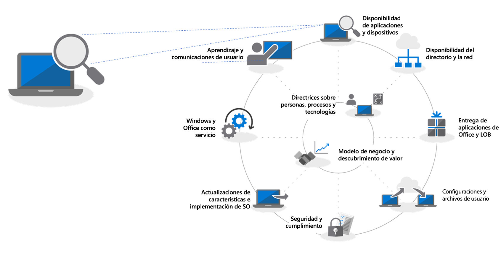
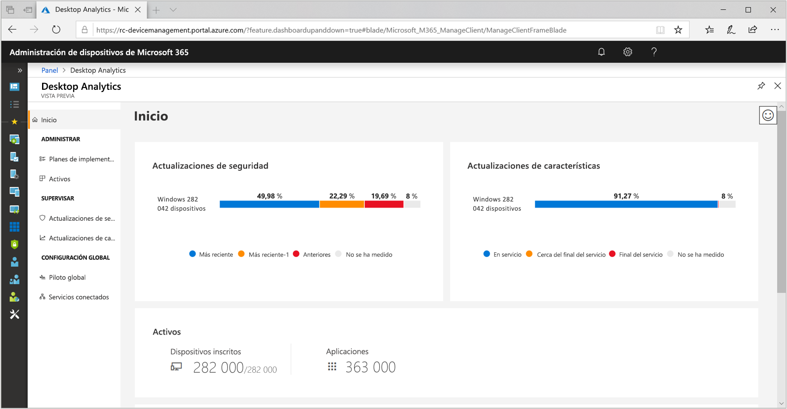
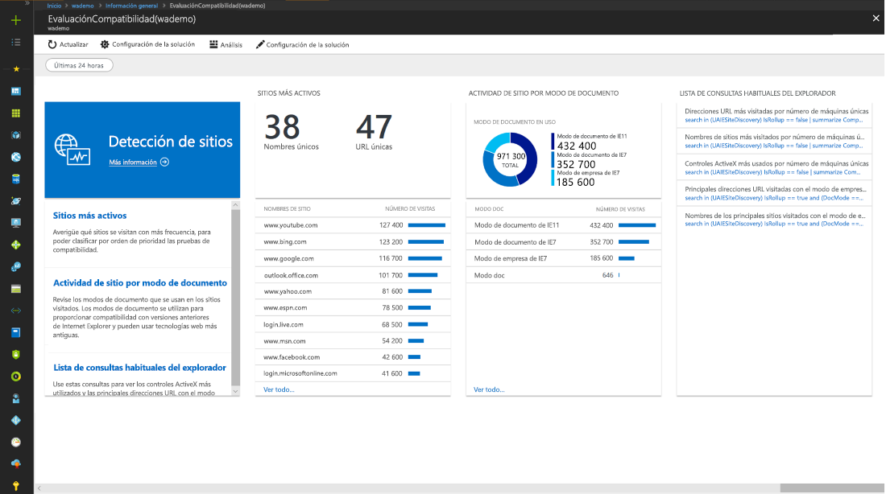
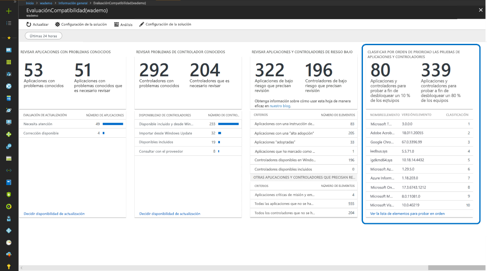
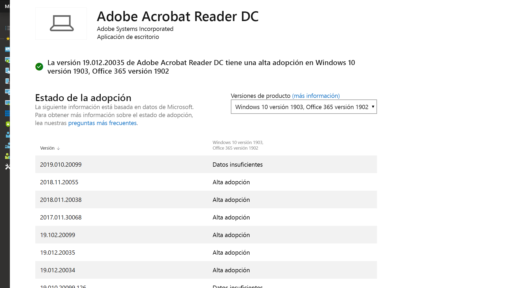
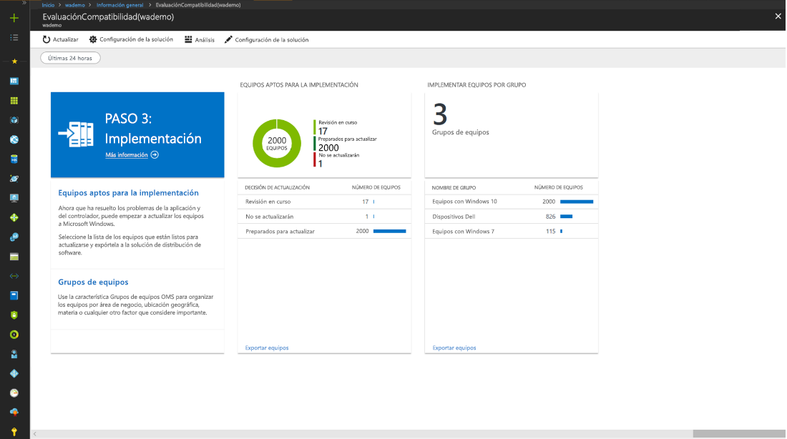

# Paso 1: Preparación de dispositivos y aplicacionesStep 1: Device and App Readiness

Inicie el proyecto de implementación de escritorio con un inventario de los dispositivos y las aplicaciones, priorice lo que quiera migrar, pruebe los dispositivos y las aplicaciones prioritarios, y corrija los aspectos necesarios para prepararse para la implementación.Begin your desktop deployment project with an inventory of your devices and apps, prioritize what you to move forward, test prioritized apps and devices, then remediate what’s needed to get ready for deployment.

<table>
<thead>
<td></td>
<td>
<strong>Paso 1: Preparación de dispositivos y aplicaciones</strong><strong>Step 1: Device and App Readiness</strong>

Inicie el proyecto de implementación de escritorio con un inventario de los dispositivos y las aplicaciones, priorice lo que quiera migrar, pruebe los dispositivos y las aplicaciones prioritarios, y corrija los aspectos necesarios para prepararse para la implementación.Begin your desktop deployment project with an inventory of your devices and apps, prioritize what you to move forward, test prioritized apps and devices, then remediate what’s needed to get ready for deployment.
</td>
<td></td>
</thead>
</table>

>[!NOTE]
>La preparación de los dispositivos y las aplicaciones es el primer paso del ciclo de proceso de implementación recomendado, que abarca los aspectos integrales de la compatibilidad del hardware y las aplicaciones. Para ver el proceso de implementación de escritorio completo, visite el [Centro de implementación de escritorios modernos](https://aka.ms/HowToShift).Device and App Readiness is the first step in our recommended deployment process wheel by covering the holistic aspects of application and hardware compatibility. To see the full desktop deployment process, visit the [Modern Desktop Deployment Center](https://aka.ms/HowToShift).
>

En el pasado, el gran obstáculo para actualizar los equipos de escritorio del usuario era la compatibilidad de las aplicaciones y el hardware. Al planear el cambio a Windows 10 y Office 365 ProPlus, la buena noticia es que casi cualquier aplicación escrita en los últimos 10 años se ejecutará en Windows 10, y que los complementos COM y macros de VBA que su organización usaba en versiones de Office anteriores a Office 2010 seguirán funcionando en las versiones más recientes de Office, sin cambios.In the past, a major hurdle to upgrading the users’ desktops is application and hardware compatibility. The good news as you plan your shift to Windows 10 and Office 365 ProPlus, is just about any application written in the last 10 years will run on Windows 10, and any COM add-ins and VBA macros your organization used on versions of Office dating back to Office 2010, will continue to work on the latest versions of Office, without modification.

Dicho esto, en función del tamaño y la antigüedad de la organización, es probable que la comprobación de la compatibilidad de las aplicaciones y el hardware siga siendo un paso inicial fundamental en el proceso de implementación en ocho fases recomendado.That said, depending on the size and age of your organization, verifying application and hardware compatibility is likely still an essential initial step in our recommended 8-phase deployment process.

Este artículo le guiará por esa primera fase —Preparación de dispositivos y aplicaciones— con la nueva herramienta Upgrade Readiness de Windows Analytics, una solución inteligente basada en la nube disponible con la licencia de Windows.In this article we take you through that first phase – Device and App Readiness – using the new Windows Analytics Upgrade Readiness tool, an intelligent cloud-based solution available with your Windows license.

Si en la actualidad no ha configurado Windows Analytics para su entorno o quiere suscribirse a una prueba, vaya a la [página de Windows Analytics](http://www.aka.ms/windowsanalytics) y empiece a trabajar.If you don’t currently have Windows Analytics set up for your environment or would like to sign up for a trial, go the [Windows Analytics page](http://www.aka.ms/windowsanalytics) and get started.

## Herramienta recomendada: Upgrade Readiness de Windows AnalyticsRecommended Tool: Windows Analytics Upgrade Readiness

Upgrade Readiness de Windows Analytics ofrece numerosas ventajas sobre los sistemas de administración de escritorio tradicionales y es la herramienta recomendada. No tiene agente; le guiará por lo que tiene que realizar, y usa la información de compatibilidad de aplicaciones y controladores que ha obtenido a través de la actualización de millones de equipos cliente para proporcionar una evaluación detallada, en la que se identifican los problemas de compatibilidad que podrían bloquear la actualización, con vínculos a correcciones sugeridas conocidas para Microsoft.Windows Analytics Upgrade Readiness offers many advantages over traditional desktop management systems and is our recommended tool. It is agentless; it guides you through what needs to be done; and, it makes use of application and driver compatibility information gathered through the upgrade of hundreds of millions of consumer PCs, to give you a detailed assessment, identifying compatibility issues that might block your upgrade, with links to suggested fixes known to Microsoft.

Para configurar Upgrade Readiness de Windows Analytics, primero debe configurar una suscripción de Azure, en la que tiene que incluir un área de trabajo de Azure Log Analytics. Una vez en ejecución el servicio Upgrade Readiness de Windows Analytics, puede inscribir cualquier dispositivo Windows 7 SP1 o versiones posteriores conectado a Internet a través de la configuración de directiva de grupo. Es muy sencillo. No hay que implementar ningún agente y el flujo de trabajo visual de Upgrade Readiness de Windows Analytics le guiará desde la implementación piloto a la de producción. Si quiere, puede exportar datos desde Upgrade Readiness de Windows Analytics a herramientas de implementación de software como System Center Configuration Manager, para seleccionar equipos como destino de forma directa y crear colecciones a medida que estén listas para la implementación.To set up Window Analytics Upgrade Readiness you’ll first need to set up an Azure subscription and include an Azure Log Analytics workspace to that. Once you have the Windows Analytics Upgrade Readiness service running, you can then enroll any Internet-connected Windows 7 SP1 or newer device via Group Policy settings. It’s that simple. There are no agents to deploy, and Windows Analytics Upgrade Readiness’s visual workflow guides you from pilot to production deployment. If you wish, you can export data from Windows Analytics Upgrade Readiness to software deployment tools such as System Center Configuration Manager, to target PCs directly and build collections as they become ready for deployment.

## Proceso de preparación de dispositivos y aplicacionesDevice and App Readiness Process

Preparación de dispositivos y aplicaciones consta de cuatro pasos: 1. Inventario, 2. Priorizar, 3. Pruebas 4. Corregir. Veamos cada uno de ellos por separado.Device and App Readiness compromises four steps: 1. Inventory, 2. Prioritize, 3. Test, 4. Remediate. Let’s look at each of these in turn.

### 1\. Inventario1\. Inventory

En Upgrade Readiness de Windows Analytics se usa un proceso sin agente para realizar el inventario de los equipos, aplicaciones y complementos de Office en el equipo de escritorio.Windows Analytics Upgrade Readiness service uses an agent-less process to inventory the computers, applications and Office add-ins across your desktop estate.

También se proporcionan informes sobre los sitios de Internet muy visitados, las aplicaciones y las ubicaciones de Intranet para ayudar con las pruebas de compatibilidad más adelante.It also provides reports on highly visited Internet sites, apps and Intranet locations to help you with compatibility testing later.

### 2\. Priorizar2\. Prioritize

Con el inventario realizado, Upgrade Readiness de Windows Analytics le ayuda a identificar y priorizar las aplicaciones y el hardware más común que se usa en la organización, y en qué centrarse para desbloquear tantos equipos como sea posible para la implementación,With inventory taken, Windows Analytics Upgrade Readiness helps you to identify and prioritize the most common apps and hardware used in your organization, and what to focus on to unblock as many PCs as possible for deployment,

además de proporcionar instrucciones para ayudarle a evaluar qué actualizaciones son necesarias para resolver problemas durante el paso siguiente: las pruebas.also providing guidance to help you assess the updates are necessary to resolve issues during the next step: testing.

### 3\. Pruebas3\. Testing

Comprobará que la mayoría de los controladores, aplicaciones y complementos del inventario funcionan tal cual. Para los elementos que Upgrade Readiness de Windows Analytics considera que tienen problemas, proporciona información conocida, incluido dónde encontrar las actualizaciones de la versión para resolver los problemas de compatibilidad. En lugar de dedicar tiempo y recursos a resolver problemas complejos en aplicaciones y dispositivos antiguos que no son críticos y apenas se implementan, puede trabajar con los usuarios para retirar y reemplazar esos elementos.You will find that most of the applications, drivers, and add-ins inventoried, will work as-is. For items Windows Analytics Upgrade Readiness assesses to have issues, it provides you with known information, including where to find version updates to resolve compatibility problems. Rather than devoting time and resource resolving complex issues in non-critical, sparsely deployed applications and older devices, you may choose instead to work with users to retire and replace these items.

También puede usar Upgrade Readiness de Windows Analytics para evaluar los problemas de compatibilidad basados en el explorador, para identificar los sitios y las aplicaciones web a las que acceden los usuarios en los que todavía se usan controles ActiveX, objetos auxiliares del explorador, VBScript u otras tecnologías heredadas que no son compatibles con el explorador Microsoft Edge. Los usuarios tendrán que seguir usando Internet Explorer 11 para estos sitios y los puede agregar a la [lista de sitios del modo de empresa](https://docs.microsoft.com/es-ES/microsoft-edge/deploy/emie-to-improve-compatibility), con Enterprise Mode Site List Manager.You can use Windows Analytics Upgrade Readiness to assess browser-based compatibility issues too, identifying websites and web apps accessed by users still using ActiveX controls, Browser Helper Objects, VBScript, or other legacy technology not supported by the Microsoft Edge browser. Your users will still need to use Internet Explorer 11 for these sites, and you can add them to the [Enterprise Mode site list](https://docs.microsoft.com/es-ES/microsoft-edge/deploy/emie-to-improve-compatibility), using the Enterprise Mode Site List Manager.

Además, para facilitar el cambio a Office 365 ProPlus, es posible que quiera usar [Readiness Toolkit para Office](https://docs.microsoft.com/es-ES/deployoffice/use-the-readiness-toolkit-to-assess-application-compatibility-for-office-365-pro) a fin de probar la compatibilidad de los complementos y las macros de Microsoft Visual Basic para Aplicaciones (VBA).Additionally, to assist in your move to Office 365 ProPlus, you may wish to make use of the [Readiness Toolkit for Office](https://docs.microsoft.com/es-ES/deployoffice/use-the-readiness-toolkit-to-assess-application-compatibility-for-office-365-pro) to test the compatibility of your add-ins and Microsoft Visual Basic for Applications (VBA) macros.

### 4\. Corrección4\. Remediation

La fase final de la preparación de las aplicaciones y los dispositivos es la "corrección". Aquí le interesará recopilar los paquetes de software o controladores necesarios; los usará para sustituir o actualizar las versiones anteriores como parte del proceso de implementación.As the final phase of device and app readiness is to ‘remediate’. Here you’ll want to collect the required software or driver packages; you are going to use these to supersede or update older versions as part of the deployment process.

Mientras recorre la lista para corregir los problemas, verá que aumenta el número de equipos "Listos para la implementación". Esto significa que las aplicaciones y los controladores en los equipos se indican como compatibles con la versión de Windows 10 seleccionada como destino para la implementación.As you work through the list remediating issues, you’ll see that more and more PCs become “Ready for Deployment”. This means that both the drivers and apps on the PCs are noted as compatible with the version of Windows 10 you are targeting for deployment.

## Uso continuado de herramientas de telemetríaContinued use of telemetry tools

Upgrade Readiness de Windows Analytics no es solo una herramienta para ayudar en el cambio a Windows 10 y Office 365 ProPlus. Una vez que haya equipos de escritorio que se ejecutan en Windows 10 y Office 365, se puede usar para ayudar a mantener la implementación y administrar las actualizaciones de características semestrales para mantenerse actualizado.Windows Analytics Upgrade Readiness isn’t just a tool to help you shift to Windows 10 and Office 365 ProPlus. Once you have desktops running on Windows 10 and Office 365 you can use it to help maintain your deployment and manage semi-annual Feature Updates so that you can stay current.

## Siguiente pasoNext Step 

## [Paso 2: Preparación de los directorios y la redStep 2: Directory and Network Readiness](https://aka.ms/mdd2)