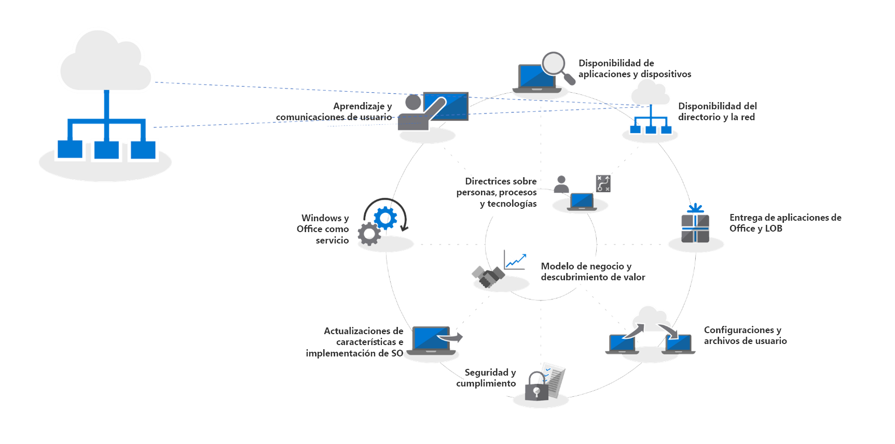
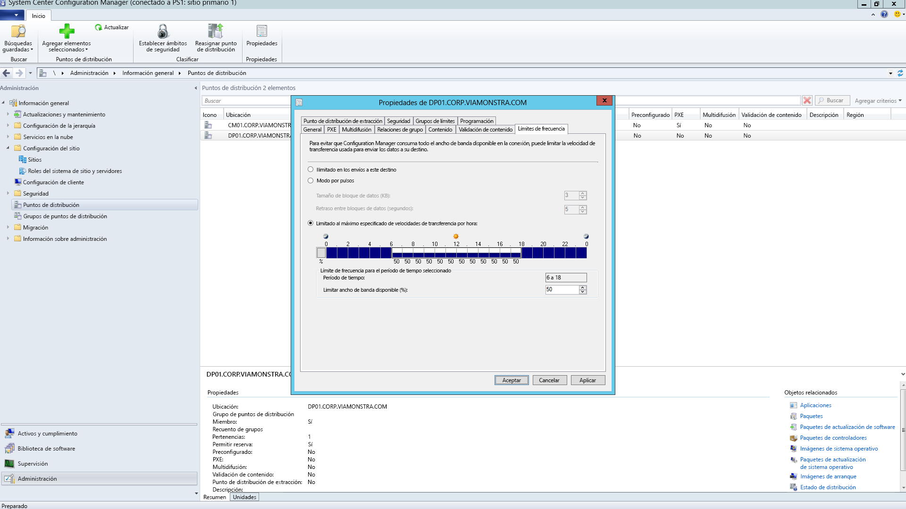
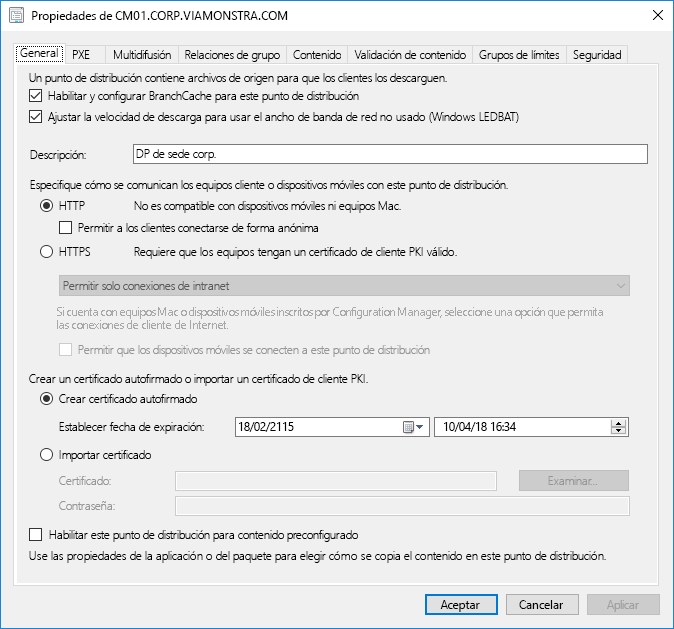
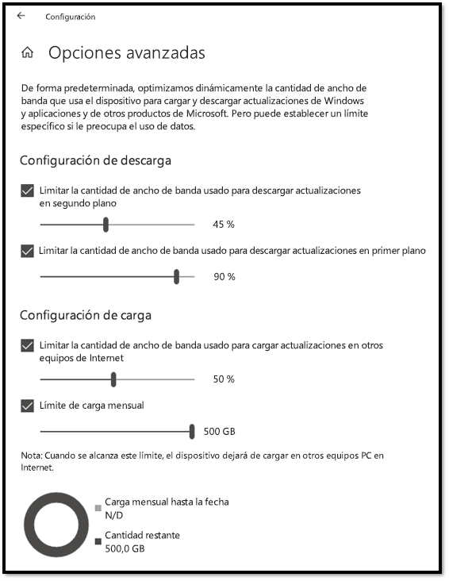
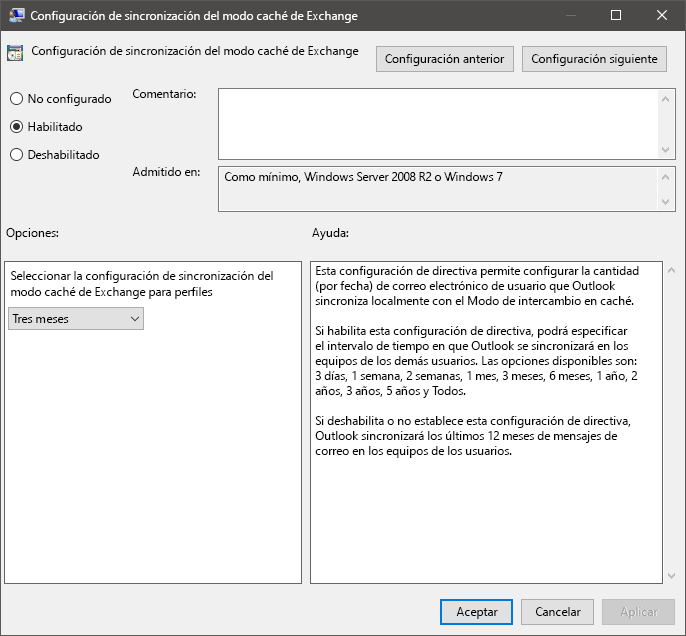
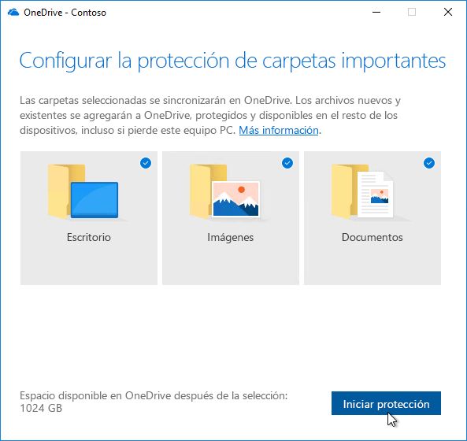

# Paso 2: Preparación de los directorios y la redStep 2: Directory and Network Readiness

Asegúrese de que su directorio y la red están configurados y listos para admitir su cambio a Windows 10 y Office 365 ProPlus. Esto requerirá que los Servicios de Azure Active Directory estén instalados para los usuarios y su red debe tener la capacidad de gestionar tanto su tráfico regular como el movimiento potencial de una gran cantidad de datos mientras se actualizan los equipos y se restauran los archivos, la configuración y las aplicaciones de los usuarios.Ensure your directory and the network are configured and ready to support to your shift to Windows 10 and Office 365 ProPlus. This will require Azure Active Directory Services to be in place for users, and your network must have the capacity to handle both its regular traffic and the movement of potentially vast amounts of data as PCs are upgraded, and users’ files, settings and applications are restored.

<table>
<thead>
<td></td>
<td>
<strong>Paso 2: Preparación de los directorios y la red</strong><strong>Step 2: Directory and Network Readiness</strong>

Los servicios conectados en la nube en Office 365 ProPlus y las nuevas opciones de implementación, como Windows Autopilot, requieren Azure Active Directory. También es importante que planifique los aspectos relacionados con la red y la conectividad para mover imágenes, aplicaciones, controladores y archivos relacionados de Windows al equipo. Obtenga información sobre cómo las nuevas herramientas y opciones de implementación reducen y simplifican el tráfico de red.Cloud connected services in Office 365 ProPlus and new deployment options like Windows Autopilot require Azure Active Directory. Your network and connectivity are also important areas to plan when moving Windows images, apps, drivers and related files to your PCs. Learn how new tools and deployment options reduce and streamline network traffic.
</td>
<td></td>
</thead>
</table>

>[!NOTE]
>La preparación de los directorios y la red es el segundo paso del ciclo de proceso de implementación recomendado, que se centra en Azure Active Directory y optimizar la red.Directory and Network Readiness is the second step in our recommended deployment process wheel focusing on Azure Active Directory and optimizing the network. Para ver el proceso de implementación de escritorio completo, visite el [Centro de implementación de escritorio](https://aka.ms/HowToShift).To see the full desktop deployment process, visit the [Desktop Deployment Center](https://aka.ms/HowToShift).
>

La preparación de los directorios y la red es fundamental para asegurar una implementación sin problemas de sistemas operativos y escritorios. Como con cualquier implementación automatizada, es importante asegurar que se puedan alcanzar los recursos compartidos de archivos y la red necesitará poder admitir la transferencia de archivos muy grandes, posiblemente a cientos o incluso miles de PC al mismo tiempo.Directory and Network readiness is fundamental to ensuring a smooth OS and desktop deployment. As with any automated deployment, it is important to ensure your file shares can be reached, and your network will need to be able to support the transfer of very large files, possibly to hundreds or even thousands of PCs at a time.

Con su cambio a Windows 10 y Office 365 ProPlus, también deberá asegurarse de que la identidad basada en la nube está establecida con Azure Active Directory. Esto es clave no solo para la activación de Office 365 ProPlus, también le permitirá aprovecharse de soluciones de aprovisionamiento modernas como Windows Autopilot.With your shift to Windows 10 and Office 365 ProPlus you also now need to make sure that cloud-based identity is set up with Azure Active Directory. This is key not only to activating Office 365 ProPlus, it also allows you to take advantage of modern provisioning solutions like Windows Autopilot.

En este artículo veremos las herramientas y opciones para preparar los servicios de directorio y los usuarios y permisos de dispositivo, listos para la implementación de Windows 10 y Office 365 ProPlus.In this article we’ll explore the tools and options to prepare your directory services, and user and device permissions, ready for deployment to Windows 10 and Office 365 ProPlus.

## Agregar acceso a Azure Active DirectoryAdding Azure Active Directory

Si su organización ya usa Office 365, Exchange Online, Microsoft Intune u otros servicios de Microsoft Online, la buena noticia es que ya usa Azure Active Directory.If your organization already uses Office 365, Exchange Online, Microsoft Intune, or other Microsoft Online services, the good news is you are already using Azure Active Directory. Si es así, solo tiene que asegurarse de que los usuarios de destino para la implementación de escritorio estén en su Azure Active Directory y que tienen licencias asignadas.If you are, you just need to ensure that the users you are targeting for desktop deployment are in your Azure Active Directory and that licenses have been assigned.

Si actualmente no usa Azure Active Directory, hay [numerosos recursos](https://docs.microsoft.com/es-ES/azure/active-directory/) para ayudarle a configurarlo.If you are not currently using Azure Active Directory, there are [numerous resources](https://docs.microsoft.com/es-ES/azure/active-directory/) to help you set it up. También pueden optar a la asistencia personalizada a través de Microsoft FastTrack, como parte de su licencia de Office 365.You may well qualify for personalized assistance via Microsoft FastTrack, as part of your Office 365 license. Puede consultar más información acerca de Microsoft FasTrack [aquí](https://fasttrack.microsoft.com).You can check out more about Microsoft Fastrack [here](https://fasttrack.microsoft.com).

Una vez que tenga Azure Active Directory, los usuarios pueden iniciar sesión y activar sus aplicaciones de Office 365 ProPlus y usted puede utilizar Microsoft Intune o Windows Autopilot para la implementación automatizada de las aplicaciones y la directiva.Once you have Azure Active Directory in place, your users can sign in to and activate their Office 365 ProPlus apps, and you can use Microsoft Intune or Windows Autopilot deployment for automated deployment of apps and policy.

## Preparación de la redNetwork Readiness

Debe tener en cuenta los requisitos de ancho de banda al planear las implementaciones.You must consider bandwidth requirements when planning your deployments. Hay tres componentes principales en una implementación que tendrán un impacto en la red: la creación de imágenes de equipos, las actualizaciones de software y la personalización de usuario.There are three main components in a deployment that will have an impact on your network – PC imaging, software updates, and user personalization. Combinadas, pueden representar más de 20 GB por equipo para la migración inicial y a menudo 1 GB o más al mes por equipo para mantenerse al día.Between them, this can mean in excess of 20 GB per PC for the initial migration, and often 1 GB or more per month per PC to stay up-to-date.

Empecemos explorando los requisitos de cada uno de estos tres componentes principales:Let’s start by exploring the requirements of each of these three main components:

### Creación de imágenes de equipoPC Imaging

Para las imágenes de Windows sin ninguna personalización debería prever que normalmente se usarán 3 GB por equipo, mientras que para imágenes personalizadas con aplicaciones deberá permitir 6 GB o más.For Windows Images with no customization you should plan typically for 3GB per PC, while for customized images with apps you may need to allow 6GB, or more. También deberá tener en cuenta los paquetes de controladores; que pueden ir de unos cuantos megabytes por equipo, hasta 1 GB.You may also need to consider Driver packages; these can be a few hundred megabytes per PC, sometimes up to 1GB.

### Actualizaciones de softwareSoftware Updates

Debe planear el ancho de banda de red para las actualizaciones de software.You’ll need to plan network bandwidth for software updates. Windows 10 y Office 365 ProPlus usan el nuevo modelo de mantenimiento que ofrece actualizaciones mensuales y semestrales.Windows 10 and Office 365 ProPlus use a new servicing model delivering monthly and semi-annual updates. Si no conoce este modelo, puede obtener más información acerca de cómo funciona [aquí](https://docs.microsoft.com/es-ES/windows/deployment/update/waas-overview).If you are new to this model, you can learn more about how this works [here](https://docs.microsoft.com/es-ES/windows/deployment/update/waas-overview).

El nuevo modelo de mantenimiento incluye actualizaciones de características para Windows dos veces al año, actualizaciones de canal semianuales de Office y actualizaciones de calidad mensuales. Las actualizaciones de características suelen tener un tamaño de 2 a 4 GB y las actualizaciones de canal semianuales de Office son 300 o 400 MB cada una. En cuanto a las actualizaciones mensuales de calidad, pueden ir desde unos cientos megabytes hasta un gigabyte. Esto se debe a que las actualizaciones mensuales son acumulables, de modo que el tamaño aumenta a lo largo de la vida del mantenimiento para cada versión de Windows 10. Dicho esto, hay herramientas que pueden ayudarle a reducir la cantidad de datos que deben pasar por la red para implementar actualizaciones. Trataremos esto con más detalle más adelante.The new servicing model includes Feature Updates for Windows twice a year, Office Semi-Annual Channel Updates, and monthly Quality Updates. Feature Updates are typically 2 – 4GB in size, and Office Semi-Annual Channel updates are 300 – 400 MB per update. Then there are the monthly Quality Updates. These may range from a few hundred megabytes to over a gigabyte. This is because monthly updates are cumulative, so these increase in size over the servicing lifetime for each Windows 10 version. That said, there are tools that can help reduce the amount of data that must pass over the network to implement updates. We will cover this in more detail below.

### Personalización de usuarioUser Personalization

El tercer componente considerar es la personalización de usuario. Aquí debe planificar el ancho de banda de red para dar cabida a la restauración de sus aplicaciones, la configuración y los archivos de usuario como parte del proceso de actualización o la sustitución del equipo. Juntos, estos elementos suelen superan 20 GB por equipo. Para algunos usuarios puede superar 100GB.The third component to consider is user personalization. Here you need to plan network bandwidth to accommodate the restoring of user files, their settings, and their applications as part of the PC refresh or replacement process. Together, these items often exceed 20 GB per PC; for some users these may exceed 100 GB.

## **Limitar el ancho de banda****Limiting Bandwidth**

Una forma de limitar el impacto del tráfico relacionado con la implementación en la red es limitarlo con la función BITS (servicio de transferencia inteligente en segundo plano) de los clientes. BITS usa una tasa de bits adaptativa (ABR) para ajustar el ancho de banda disponible para la implementación; puede configurarse en los clientes que usan la directiva de grupo.One way to limit the impact of deployment-related traffic on the network is to throttle it using the BITS (Background Intelligent Transfer Service) setting on clients. BITS uses an Adaptive Bit Rate (ABR) to adjust bandwidth available for deployment purposes; it can be configured on clients using Group Policy.

[Acerca de BITSAbout BITS](https://docs.microsoft.com/es-ES/windows/desktop/bits/about-bits)

Si usa System Center Configuration Manager, también puede configurar los puntos de distribución habilitados para BITS o habilitar la multidifusión con WDS.If you use System Center Configuration Manager, you can also configure BITS-enabled Distribution Points or enable multicast with WDS.

La limitación del tráfico específico significa que el tráfico de red normal se ve menos afectado al descargar las actualizaciones y las aplicaciones de equipos. Pero reservar un porcentaje específico de ancho de banda para estas tareas ayuda a asegurar que la productividad no se ve afectada por la implementación de Windows u Office y los procesos pueden seguir ejecutándose. Puede empeorar el tiempo de inactividad relacionado con la implementación, con usuarios que no pueden acceder a sus equipos mientras se ejecuta la implementación.Throttling specific traffic means that normal network traffic is less impacted by PCs downloading updates and applications. But carving out a certain percentage of bandwidth for these tasks helps ensure productivity isn’t impacted by Windows or Office deployment and processes continue to run as needed, it can worsen deployment-related downtime, with users locked out of their PCs while a deployment runs.

Afortunadamente, hay nuevas herramientas que facilitan la administración del impacto de la red de una implementación de escritorio a gran escala, como LEDBAT para optimizar el uso de ancho de banda disponible y las opciones de punto a punto (P2P) para mover el tráfico de implementación fuera del centro de la red y hacia el perímetro.Fortunately, there are new tools to make it easier for you to manage the network impact of a large-scale desktop deployment, including LEDBAT to optimize use of available bandwidth, and peer-to-peer (P2P) options to move deployment traffic away from the center of the network and out to the perimeter

## **Aprovechamiento del ancho de banda****Scavenging Bandwidth**

Low Extra Delay Background Transport (LEDBAT), compatible con Windows Server 2019 y System Center Configuration Manager versión 1806, está diseñado para optimizar el tráfico de red en clientes de Windows.Low Extra Delay Background Transport (LEDBAT), supported in Windows Server 2019 and System Center Configuration Manager version 1806, is designed to optimize network traffic to Windows clients.

[10 características principales de red en Windows Server 2019: \#9 LEDBAT: Latency Optimized Background TransportTop 10 Networking Features in Windows Server 2019: \#9 LEDBAT – Latency Optimized Background Transport](https://blogs.technet.microsoft.com/networking/2018/07/25/ledbat/)

A diferencia de la limitación tradicional, LEDBAT puede usar todo el ancho de banda de la red disponible como tarea en segundo plano, cediendo ancho de banda cuando sea necesario. Al contrario que BITS no hay retraso, todo es automatizado: no se requiere ajuste manual o planificación y todo se configura en el lado del servidor. Esto permite potencialmente mejorar el rendimiento.Unlike traditional throttling, LEDBAT can use all available network bandwidth as a background task, instantly yielding bandwidth when other traffic requests it. Unlike BITS there is no delay; everything is automated – no manual tuning or scheduling required, and everything is setup server side. This affords potentially massive performance gains.

## **Opciones de punto a punto****Peer-to-Peer options**

Las opciones de punto a punto se usan cada vez más en migraciones de Windows 10 para imágenes de equipo, actualizaciones de software y personalización de usuarios. Tienen un gran valor al facilitar actualizaciones de compilación a compilación tras la implementación inicial de Windows 10. A continuación, cubriremos varios ejemplos para ayudar a trasladar tráfico relacionado con Windows 10 y Office lejos del centro de la red, lo que reducirá la necesidad de la limitación tradicional y permitirá a los equipos encontrar los archivos de actualización que necesitan en otros puntos de su red local, en vez de descargarlos de un único punto de distribución en Internet.Peer-to-Peer options are increasingly being used in Windows 10 migrations, for PC imaging, software updates and user personalization. They are also valuable in facilitating build-to-build upgrades after your initial Windows 10 deployment. Here we will cover several examples to help move Windows 10 and Office-related traffic away from the center of the network, reducing the need for classic throttling approaches, and allowing PCs to find the update files they need on peers in their local network rather than downloading them from a distribution point or the internet.

**Windows BranchCache** puede ayudarle a descargar contenido en entornos de distribución sin saturar la red. Cuenta con dos opciones: Modo de caché hospedada, que le permite utilizar servidores locales para almacenar caché y modo de caché distribuida (un modo compatible con System Center Configuration Manager), que permite a los clientes compartir el contenido descargado entre ellos.**BranchCache** can help you download content in distributed environments without saturating the network. It comes in two options: Hosted Cache Mode, which lets you use local servers to cache content, and Distributed Cache Mode (a mode supported in System Center Configuration Manager), which lets clients share already downloaded content with each other.

**Caché del mismo nivel** Los clientes compatibles con System Center Configuration Manager también pueden hacer uso de Caché del mismo nivel.**Peer Cache** Clients supported by System Center Configuration Manager can also make use of Peer Cache. Esto permite equipos que están disponibles de forma fiable en la red hospedar orígenes para la distribución de contenido.This allows PCs that are reliably available on the network to host source for content distribution. No se recomienda que habilite esto en todos su equipos, use solo dispositivos con conexiones de red confiables como hosts (por ejemplo, equipos de escritorio, minitorres o equipos de torre).You won’t want to enable this all of your PCs – only target devices with reliable network connections as hosts (e.g. desktop, mini-tower, or tower PCs). La Caché del mismo nivel puede incluso usarse para tareas de implementación que se ejecutan en fases de Windows PE durante la instalación.Peer Cache can even work for deployment tasks running in Windows PE phases during setup.

Nota: Windows BranchCache y Caché del mismo nivel son complementarias y pueden funcionar juntas en el mismo entorno.Note: BranchCache and Peer Cache are complementary and can work together in the same environment.

[Windows BranchCache frente a caché del mismo nivelBranchCache vs. Peer Cache](https://blogs.technet.microsoft.com/swisspfe/2018/01/25/branch-cache-vs-peer-cache/)

**Optimización de entrega** La Optimización de entrega es otra tecnología de almacenamiento en caché de punto a punto que proporciona controles de red para las implementaciones.**Delivery Optimization** Delivery Optimization is another peer-to-peer caching technology, providing network-based controls for deployments. Use la Optimización de entrega de Windows 10 para actualizar aplicaciones UWP integradas, instalar aplicaciones desde Microsoft Store y actualizaciones de software con actualizaciones rápidas.Windows 10 Delivery Optimization to update built-in UWP apps, also to install applications from the Microsoft Store, and for software updates using Express Updates. Ha estado disponible desde las primeras versiones de Windows 10, aunque se ha integrado recientemente con System Center Configuration Manager.It has been available since early versions of Windows 10, though it has only recently integrated with System Center Configuration Manager. Desde Windows 10 versión 1803 nuevas opciones de configuración le permiten establecer límites de ancho de banda para actualizaciones en segundo plano y trabajos en primer plano como instalar una aplicación desde la Microsoft Store.Since Windows 10 version 1803 new configuration options mean you can now independently set bandwidth limits for background updates and foreground jobs such as an app install from the Store. Optimización de entrega de Windows ahora también es compatible con Office 365 ProPlus durante actualizaciones del cliente, disponible en todas los canales de actualización de cliente de Office 365 compatibles.Windows Delivery Optimization now also supports Office 365 ProPlus during client updates, available in all supported Office 365 client update channels. La compatibilidad con la Optimización de entrega de Windows durante la instalación inicial del cliente de Office 365 estará disponible próximamente.Support for Windows Delivery Optimization during Office 365 client initial installation will be coming soon.  

**Consideraciones adicionales para Office 365 ProPlus****Additional Considerations for Office 365 ProPlus**

Además de aprovechar la optimización de entrega, hay tres elementos que le ayudarán a reducir la carga de red debido a las implementaciones de Office 365 ProPlus.In addition to leveraging Delivery Optimization, here are three items that will help reduce your network load due to Office 365 ProPlus deployments.

**La compresión binaria de delta** Office 365 ProPlus utiliza compresión binaria de delta para reducir el ancho de banda consumido por actualizaciones de software al actualizar desde la versión más reciente de Office 365 ProPlus hasta la siguiente versión. Pero solo al quitar los cambios a nivel binario de la versión anterior, el impacto de las actualizaciones acumulativas se ha minimizado. Esto tiene el potencial de ahorrar cientos de megas de datos por equipo cada mes. Para poder usar esta función, sin embargo, no puede saltarse ninguna versión. Si lo hace, deberá descargar la actualización acumulativa completa.**Binary Delta Compression** Office 365 ProPlus uses Binary Delta Compression to reduce bandwidth consumed by software updates when updating from the most recent release of Office 365 ProPlus to the next release. By only pulling the binary level changes from the previous release, the impact from month-over-month growth of cumulative updates is minimized. This has the potential of saving several hundred megabytes of data, per PC, each month. In order to use this capability though, you cannot skip releases. If you do, then the full cumulative update must be downloaded.

[Descargar actualizaciones de Office 365Downloading Updates for Office 365](https://docs.microsoft.com/es-ES/deployoffice/overview-of-the-update-process-for-office-365-proplus#download-the-updates-for-office-365-proplus)

**Archivos de datos de Outlook** Outlook está configurado con frecuencia para almacenar en caché todo el buzón de los usuarios de forma local para su uso sin conexión.**Outlook Data Files** Outlook is often configured to cache users’ entire mailbox locally for use offline. En cualquier implementación de Windows, excepto en una actualización local, esto requiere que los archivos de datos de Outlook de los usuario se reconstruyan tras la actualización.In any Windows deployment, except an in-place upgrade, that requires the users’ Outlook Data Files to rebuild themselves after the upgrade. Este es un proceso automatizado, pero con los límites de buzón de Outlook que normalmente se establecen en un máximo de 100 GB, volver a almacenar en caché todo el buzón local para todos los usuarios implica una gran cantidad de transferencia de datos.This is an automated process, but with Outlook mailbox limits typically set to up to 100GB, re-caching the entire mailbox locally for all users means a lot of data transfer. Para reducir la carga de red puede que quiera considerar el uso de directivas de grupo para reducir la configuración "Correo para mantener sin conexión".To reduce the network load you may want to consider using Group Policy to reduce the “Mail to keep offline” setting. En Office 365 ProPlus u Office 2016 el valor predeterminado de Outlook se establece en 12 meses.In Office 365 ProPlus or Office 2016 the default value for Outlook is set to 12 months. Para reducir el impacto en la red considere la posibilidad configurar el almacenamiento en memoria caché para que dure de 1 a 6 meses.In order to reduce network impact consider setting the offline cache to last between 1 to 6 months. Cambiar esta configuración no afecta el tamaño del buzón en línea y se puede buscar todo el buzón a través de Outlook cuando tenga conexión.Changing this setting does not affect the size of the online mailbox, and the entire mailbox can still be searched via Outlook when online.

**Archivos de OneDrive a petición y Mover a carpeta conocida** OneDrive es una manera excelente de sincronizar y proteger los archivos de usuario de equipos y otros dispositivos en la nube.**OneDrive Files on Demand and Known Folder Move** OneDrive is a great way to synchronize and protect user files from PCs and other devices in the cloud. Con Mover a carpeta conocida, puede aplicar la sincronización de archivos desde las carpetas Escritorio, Documentos e Imágenes del usuario a OneDrive, de forma que esos archivos estén disponible al iniciar sesión en un nuevo dispositivo un equipo con una nueva imagen.With Known Folder Move, you can enforce file sync from a user’s Desktop, Documents, and Pictures folders to OneDrive making those files available when signing into a new device a or reimaged PC. No obstante, debe recordar que a causa del gran tamaño y el número de archivos que se conservan en las ubicaciones de Escritorio, Documentos e Imágenes, se recomienda que planee la implementación de directivas para habilitar y exigir OneDrive en sus equipos.Remember though, due to the sheer size and number of files kept in Desktop, Documents, and Pictures locations, you’ll want to be planful with the rollout of policies enabling and enforcing OneDrive on your PCs. Una opción es usar los controles de red de directivas de grupo para limitar el ancho de banda que usa el servicio de sincronización de OneDrive.One option is to use Group Policy Network controls to throttle bandwidth used by the OneDrive sync service.

[Configuración de Mover carpeta conocidaSetup Known Folder Move](https://techcommunity.microsoft.com/t5/Microsoft-OneDrive-Blog/Migrate-Your-Files-to-OneDrive-Easily-with-Known-Folder-Move/ba-p/207076)

[Archivos de OneDrive a peticiónOneDrive Files on Demand](https://www.microsoft.com/es-ES/microsoft-365/blog/2017/05/11/introducing-onedrive-files-on-demand-and-additional-features-making-it-easier-to-access-and-share-files/)

Si aún no ha implementado OneDrive, el cambio de Windows 7 a Windows 10 es una oportunidad perfecta para habilitar OneDrive y se integra perfectamente con Office 365 ProPlus.If you haven’t already rolled out OneDrive, the shift from Windows 7 to Windows 10 is a perfect opportunity to enable OneDrive and it integrates seamlessly Office 365 ProPlus. Considere iniciar esta implementación mientras prepara las aplicaciones y dispositivos.Consider starting this roll-out while working through your app and device readiness. Esto impulsará la sincronización de archivos antes de que empiece a mover imágenes de Windows e implementar aplicaciones a través de la red.This will give file sync a head start before you start moving Windows images and deploying apps over your network.

## Paso siguienteNext Step 

## [Paso 3: Entrega de aplicaciones de Office y de LOBStep 3: Office and LOB App Delivery](https://aka.ms/mdd3)

## Paso anterior:Previous Step:

## [Paso 1: Preparación de dispositivos y aplicacionesStep 1: Device and App Readiness](https://aka.ms/mdd1)

## ComentariosFeedback

Estaremos encantados de escuchar su opinión. Elija el tipo que le gustaría ofrecer:We'd love to hear your thoughts. Choose the type you'd like to provide:

Inicie sesión para proporcionar comentarios sobre el producto.Product feedback Sign in to give documentation feedback

El nuevo sistema comentarios está integrado en GitHub problemas. Obtenga información sobre este cambio en la entrada de blog.Our new feedback system is built on GitHub Issues. Read about this change in our blog post.
