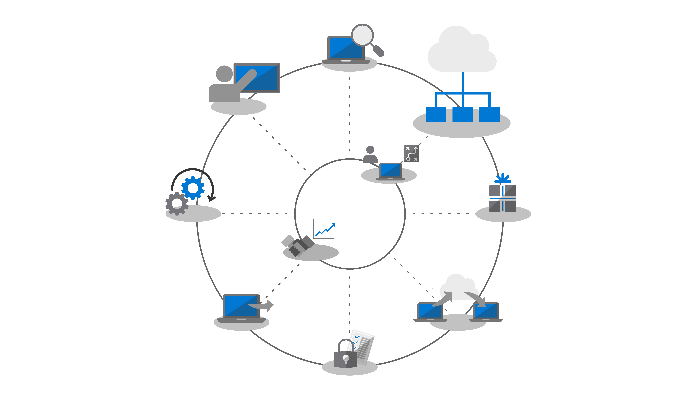
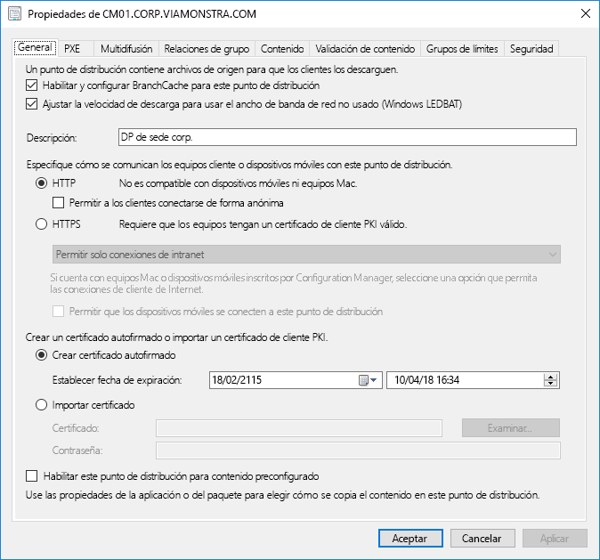
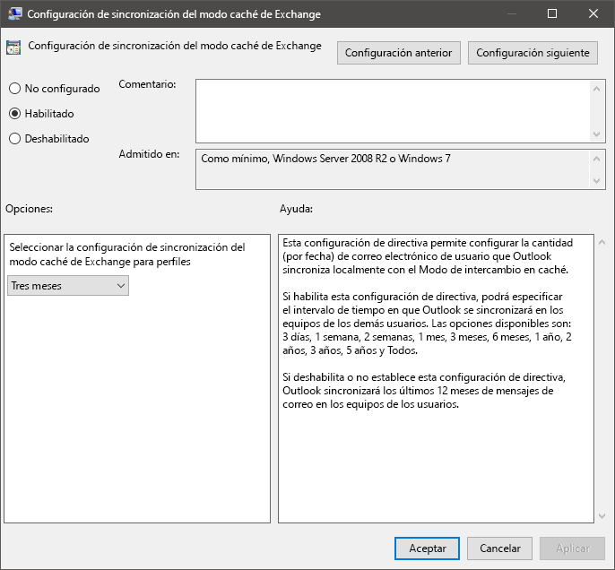
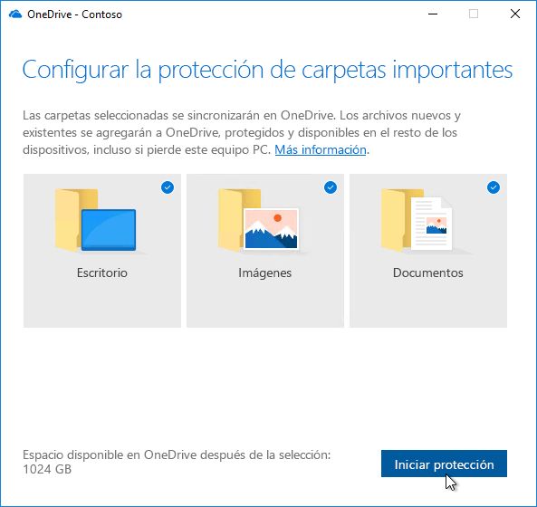

# Paso 2: Preparación de los directorios y la redStep 2: Directory and Network Readiness

Ensure your directory and the network are configured and ready to support to your shift to Windows 10 and Microsoft 365 Apps for enterprise.Ensure your directory and the network are configured and ready to support to your shift to Windows 10 and Microsoft 365 Apps for enterprise. This will require Azure Active Directory Services to be in place for users, and your network must have the capacity to handle both its regular traffic and the movement of potentially vast amounts of data as PCs are upgraded, and users’ files, settings and applications are restored.This will require Azure Active Directory Services to be in place for users, and your network must have the capacity to handle both its regular traffic and the movement of potentially vast amounts of data as PCs are upgraded, and users’ files, settings and applications are restored.

<table>
<thead>
<td></td>
<td>
<strong>Paso 2: Preparación de los directorios y la red</strong><strong>Step 2: Directory and Network Readiness</strong>

Cloud connected services in Microsoft 365 Apps for enterprise and new deployment options like Windows Autopilot require Azure Active Directory.Cloud connected services in Microsoft 365 Apps for enterprise and new deployment options like Windows Autopilot require Azure Active Directory. Your network and connectivity are also important areas to plan when moving Windows images, apps, drivers and related files to your PCs.Your network and connectivity are also important areas to plan when moving Windows images, apps, drivers and related files to your PCs. Learn how new tools and deployment options reduce and streamline network traffic.Learn how new tools and deployment options reduce and streamline network traffic.
</td>
<td></td>
</thead>
</table>

>[!NOTE]
>La preparación de los directorios y la red es el segundo paso del ciclo de proceso de implementación recomendado, que se centra en Azure Active Directory y optimizar la red.Directory and Network Readiness is the second step in our recommended deployment process wheel focusing on Azure Active Directory and optimizing the network. Para ver el proceso de implementación de escritorio completo, visite el [Centro de implementación de escritorio](https://aka.ms/HowToShift).To see the full desktop deployment process, visit the [Desktop Deployment Center](https://aka.ms/HowToShift).
>

Directory and Network readiness is fundamental to ensuring a smooth OS and desktop deployment.Directory and Network readiness is fundamental to ensuring a smooth OS and desktop deployment. As with any automated deployment, it is important to ensure your file shares can be reached, and your network will need to be able to support the transfer of very large files, possibly to hundreds or even thousands of PCs at a time.As with any automated deployment, it is important to ensure your file shares can be reached, and your network will need to be able to support the transfer of very large files, possibly to hundreds or even thousands of PCs at a time.

With your shift to Windows 10 and Microsoft 365 Apps for enterprise you also now need to make sure that cloud-based identity is set up with Azure Active Directory.With your shift to Windows 10 and Microsoft 365 Apps for enterprise you also now need to make sure that cloud-based identity is set up with Azure Active Directory. This is key not only to activating Microsoft 365 Apps for enterprise, it also allows you to take advantage of modern provisioning solutions like Windows Autopilot.This is key not only to activating Microsoft 365 Apps for enterprise, it also allows you to take advantage of modern provisioning solutions like Windows Autopilot.

En este artículo veremos las herramientas y opciones para preparar los servicios de directorio y los usuarios y permisos de dispositivo, listos para la implementación de Windows 10 y Aplicaciones de Microsoft 365 para empresas.In this article we’ll explore the tools and options to prepare your directory services, and user and device permissions, ready for deployment to Windows 10 and Microsoft 365 Apps for enterprise.

## Agregar acceso a Azure Active DirectoryAdding Azure Active Directory

Si su organización ya usa Office 365, Exchange Online, Microsoft Intune u otros servicios de Microsoft Online, la buena noticia es que ya usa Azure Active Directory.If your organization already uses Office 365, Exchange Online, Microsoft Intune, or other Microsoft Online services, the good news is you are already using Azure Active Directory. Si es así, solo tiene que asegurarse de que los usuarios de destino para la implementación de escritorio estén en su Azure Active Directory y que tienen licencias asignadas.If you are, you just need to ensure that the users you are targeting for desktop deployment are in your Azure Active Directory and that licenses have been assigned.

Si actualmente no usa Azure Active Directory, hay [numerosos recursos](https://docs.microsoft.com/azure/active-directory/) para ayudarle a configurarlo.If you are not currently using Azure Active Directory, there are [numerous resources](https://docs.microsoft.com/azure/active-directory/) to help you set it up. También pueden optar a la asistencia personalizada a través de Microsoft FastTrack, como parte de su licencia.You may well qualify for personalized assistance via Microsoft FastTrack, as part of your license. Puede consultar más información acerca de Microsoft FastTrack [aquí](https://fasttrack.microsoft.com).You can check out more about Microsoft FastTrack [here](https://fasttrack.microsoft.com).

Una vez que tenga Azure Active Directory, los usuarios pueden iniciar sesión y activar sus aplicaciones de Aplicaciones de Microsoft 365 para empresas y usted puede utilizar Microsoft Intune o Windows Autopilot para la implementación automatizada de las aplicaciones y la directiva.Once you have Azure Active Directory in place, your users can sign in to and activate their Microsoft 365 Apps for enterprise apps, and you can use Microsoft Intune or Windows Autopilot deployment for automated deployment of apps and policy.

## Preparación de la redNetwork Readiness

Debe tener en cuenta los requisitos de ancho de banda al planear las implementaciones.You must consider bandwidth requirements when planning your deployments. Hay tres componentes principales en una implementación que tendrán un impacto en la red: la creación de imágenes de equipos, las actualizaciones de software y la personalización de usuario.There are three main components in a deployment that will have an impact on your network – PC imaging, software updates, and user personalization. Combinadas, pueden representar más de 20 GB por equipo para la migración inicial y a menudo 1 GB o más al mes por equipo para mantenerse al día.Between them, this can mean in excess of 20 GB per PC for the initial migration, and often 1 GB or more per month per PC to stay up-to-date.

Empecemos explorando los requisitos de cada uno de estos tres componentes principales:Let’s start by exploring the requirements of each of these three main components:

### Creación de imágenes de equipoPC Imaging

Para las imágenes de Windows sin ninguna personalización debería prever que normalmente se usarán 3 GB por equipo, mientras que para imágenes personalizadas con aplicaciones deberá permitir 6 GB o más.For Windows Images with no customization you should plan typically for 3GB per PC, while for customized images with apps you may need to allow 6GB, or more. También deberá tener en cuenta los paquetes de controladores; que pueden ir de unos cuantos megabytes por equipo, hasta 1 GB.You may also need to consider Driver packages; these can be a few hundred megabytes per PC, sometimes up to 1GB.

### Actualizaciones de softwareSoftware Updates

Debe planear el ancho de banda de red para las actualizaciones de software.You’ll need to plan network bandwidth for software updates. Windows 10 y Aplicaciones de Microsoft 365 para empresas usan un nuevo modelo de mantenimiento que ofrece actualizaciones mensuales y semestrales.Windows 10 and Microsoft 365 Apps for enterprise use a new servicing model delivering monthly and semi-annual updates. Si no conoce este modelo, puede obtener más información acerca de cómo funciona [aquí](https://docs.microsoft.com/windows/deployment/update/waas-overview).If you are new to this model, you can learn more about how this works [here](https://docs.microsoft.com/windows/deployment/update/waas-overview).

The new servicing model includes Feature Updates for Windows twice a year, Office Semi-Annual Enterprise Channel Updates, and monthly Quality Updates.The new servicing model includes Feature Updates for Windows twice a year, Office Semi-Annual Enterprise Channel Updates, and monthly Quality Updates. Feature Updates are typically 2 – 4GB in size, and Office Semi-Annual Enterprise Channel updates are 300 – 400 MB per update.Feature Updates are typically 2 – 4GB in size, and Office Semi-Annual Enterprise Channel updates are 300 – 400 MB per update. Then there are the monthly Quality Updates.Then there are the monthly Quality Updates. These may range from a few hundred megabytes to over a gigabyte.These may range from a few hundred megabytes to over a gigabyte. This is because monthly updates are cumulative, so these increase in size over the servicing lifetime for each Windows 10 version.This is because monthly updates are cumulative, so these increase in size over the servicing lifetime for each Windows 10 version. That said, there are tools that can help reduce the amount of data that must pass over the network to implement updates.That said, there are tools that can help reduce the amount of data that must pass over the network to implement updates. We will cover this in more detail below.We will cover this in more detail below.

### Personalización de usuarioUser Personalization

The third component to consider is user personalization.The third component to consider is user personalization. Here you need to plan network bandwidth to accommodate the restoring of user files, their settings, and their applications as part of the PC refresh or replacement process.Here you need to plan network bandwidth to accommodate the restoring of user files, their settings, and their applications as part of the PC refresh or replacement process. Together, these items often exceed 20 GB per PC; for some users these may exceed 100 GB.Together, these items often exceed 20 GB per PC; for some users these may exceed 100 GB.

## Limitar el ancho de bandaLimiting Bandwidth

One way to limit the impact of deployment-related traffic on the network is to throttle it using the BITS (Background Intelligent Transfer Service) setting on clients.One way to limit the impact of deployment-related traffic on the network is to throttle it using the BITS (Background Intelligent Transfer Service) setting on clients. BITS uses an Adaptive Bit Rate (ABR) to adjust bandwidth available for deployment purposes; it can be configured on clients using Group Policy.BITS uses an Adaptive Bit Rate (ABR) to adjust bandwidth available for deployment purposes; it can be configured on clients using Group Policy.

[Acerca de BITSAbout BITS](https://docs.microsoft.com/windows/desktop/bits/about-bits)

Si usa la rama actual de Microsoft Endpoint Configuration Manager, también puede configurar los puntos de distribución habilitados para BITS o habilitar la multidifusión con WDS.If you use Microsoft Endpoint Configuration Manager (Current Branch), you can also configure BITS-enabled Distribution Points or enable multicast with WDS.

Throttling specific traffic means that normal network traffic is less impacted by PCs downloading updates and applications.Throttling specific traffic means that normal network traffic is less impacted by PCs downloading updates and applications. But carving out a certain percentage of bandwidth for these tasks helps ensure productivity isn’t impacted by Windows or Office deployment and processes continue to run as needed, it can worsen deployment-related downtime, with users locked out of their PCs while a deployment runs.But carving out a certain percentage of bandwidth for these tasks helps ensure productivity isn’t impacted by Windows or Office deployment and processes continue to run as needed, it can worsen deployment-related downtime, with users locked out of their PCs while a deployment runs.

Afortunadamente, hay nuevas herramientas que facilitan la administración del impacto de la red de una implementación de escritorio a gran escala, como LEDBAT para optimizar el uso de ancho de banda disponible y las opciones de punto a punto (P2P) para mover el tráfico de implementación fuera del centro de la red y hacia el perímetro.Fortunately, there are new tools to make it easier for you to manage the network impact of a large-scale desktop deployment, including LEDBAT to optimize use of available bandwidth, and peer-to-peer (P2P) options to move deployment traffic away from the center of the network and out to the perimeter

## Aprovechamiento del ancho de bandaScavenging Bandwidth

Low Extra Delay Background Transport (LEDBAT), compatible con Windows Server 2019 y la rama actual de Microsoft Endpoint Configuration Manager, están diseñados para optimizar el tráfico de red en clientes de Windows.Low Extra Delay Background Transport (LEDBAT), supported in Windows Server 2019 and Microsoft Endpoint Configuration Manager (Current Branch), is designed to optimize network traffic to Windows clients.

[10 características principales de red en Windows Server 2019: \#9 LEDBAT: Latency Optimized Background TransportTop 10 Networking Features in Windows Server 2019: \#9 LEDBAT – Latency Optimized Background Transport](https://blogs.technet.microsoft.com/networking/2018/07/25/ledbat/)

Unlike traditional throttling, LEDBAT can use all available network bandwidth as a background task, instantly yielding bandwidth when other traffic requests it.Unlike traditional throttling, LEDBAT can use all available network bandwidth as a background task, instantly yielding bandwidth when other traffic requests it. Unlike BITS there is no delay; everything is automated – no manual tuning or scheduling required, and everything is setup server side.Unlike BITS there is no delay; everything is automated – no manual tuning or scheduling required, and everything is setup server side. This affords potentially massive performance gains.This affords potentially massive performance gains.

## Opciones de punto a puntoPeer-to-Peer options

Peer-to-Peer options are increasingly being used in Windows 10 migrations, for PC imaging, software updates and user personalization.Peer-to-Peer options are increasingly being used in Windows 10 migrations, for PC imaging, software updates and user personalization. They are also valuable in facilitating build-to-build upgrades after your initial Windows 10 deployment.They are also valuable in facilitating build-to-build upgrades after your initial Windows 10 deployment. Here we will cover several examples to help move Windows 10 and Office-related traffic away from the center of the network, reducing the need for classic throttling approaches, and allowing PCs to find the update files they need on peers in their local network rather than downloading them from a distribution point or the internet.Here we will cover several examples to help move Windows 10 and Office-related traffic away from the center of the network, reducing the need for classic throttling approaches, and allowing PCs to find the update files they need on peers in their local network rather than downloading them from a distribution point or the internet.

**BranchCache** can help you download content in distributed environments without saturating the network.**BranchCache** can help you download content in distributed environments without saturating the network. It comes in two options: Hosted Cache Mode, which lets you use local servers to cache content, and Distributed Cache Mode (a mode supported in Configuration Manager), which lets clients share already downloaded content with each other.It comes in two options: Hosted Cache Mode, which lets you use local servers to cache content, and Distributed Cache Mode (a mode supported in Configuration Manager), which lets clients share already downloaded content with each other.

**Caché del mismo nivel** Los clientes admitidos por Configuration Manager también pueden hacer uso de Caché del mismo nivel.**Peer Cache** Clients supported by Configuration Manager can also make use of Peer Cache. Esto permite equipos que están disponibles de forma fiable en la red hospedar orígenes para la distribución de contenido.This allows PCs that are reliably available on the network to host source for content distribution. No se recomienda que habilite esto en todos su equipos, use solo dispositivos con conexiones de red confiables como hosts (por ejemplo, equipos de escritorio, minitorres o equipos de torre).You won’t want to enable this all of your PCs – only target devices with reliable network connections as hosts (e.g. desktop, mini-tower, or tower PCs). La Caché del mismo nivel puede incluso usarse para tareas de implementación que se ejecutan en fases de Windows PE durante la instalación.Peer Cache can even work for deployment tasks running in Windows PE phases during setup.

Nota: Windows BranchCache y Caché del mismo nivel son complementarias y pueden funcionar juntas en el mismo entorno.Note: BranchCache and Peer Cache are complementary and can work together in the same environment.

[Windows BranchCache frente a caché del mismo nivelBranchCache vs. Peer Cache](https://blogs.technet.microsoft.com/swisspfe/2018/01/25/branch-cache-vs-peer-cache/)

**Optimización de entrega** La Optimización de entrega es otra tecnología de almacenamiento en caché de punto a punto que proporciona controles de red para las implementaciones.**Delivery Optimization** Delivery Optimization is another peer-to-peer caching technology, providing network-based controls for deployments. Use la Optimización de entrega de Windows 10 para actualizar aplicaciones UWP integradas, instalar aplicaciones desde Microsoft Store y actualizaciones de software con actualizaciones rápidas.Windows 10 Delivery Optimization to update built-in UWP apps, also to install applications from the Microsoft Store, and for software updates using Express Updates. Ha estado disponible desde las primeras versiones de Windows 10, aunque solo se ha integrado recientemente con la rama actual de Microsoft Endpoint Configuration Manager.It has been available since early versions of Windows 10, though it has only recently integrated with Microsoft Endpoint Configuration Manager (Current Branch). Desde Windows 10 versión 1803 nuevas opciones de configuración le permiten establecer límites de ancho de banda para actualizaciones en segundo plano y trabajos en primer plano como instalar una aplicación desde la Microsoft Store.Since Windows 10 version 1803 new configuration options mean you can now independently set bandwidth limits for background updates and foreground jobs such as an app install from the Store. Optimización de entrega de Windows ahora también es compatible con Aplicaciones de Microsoft 365 para empresas durante actualizaciones del cliente, disponible en todas los canales de actualización de cliente compatibles.Windows Delivery Optimization now also supports Microsoft 365 Apps for enterprise during client updates, available in all supported client update channels. La compatibilidad con la Optimización de entrega de Windows durante la instalación inicial del cliente estará disponible próximamente.Support for Windows Delivery Optimization during client initial installation will be coming soon.  

**Consideraciones adicionales para las Aplicaciones de Microsoft 365 para empresas****Additional Considerations for Microsoft 365 Apps for enterprise**

Además de aprovechar la optimización de entrega, hay tres elementos que le ayudarán a reducir la carga de red debido a las implementaciones de Aplicaciones de Microsoft 365 para empresas.In addition to leveraging Delivery Optimization, here are three items that will help reduce your network load due to Microsoft 365 Apps for enterprise deployments.

**Binary Delta Compression** Microsoft 365 Apps for enterprise uses Binary Delta Compression to reduce bandwidth consumed by software updates when updating from the most recent release of Microsoft 365 Apps for enterprise to the next release.**Binary Delta Compression** Microsoft 365 Apps for enterprise uses Binary Delta Compression to reduce bandwidth consumed by software updates when updating from the most recent release of Microsoft 365 Apps for enterprise to the next release. By only pulling the binary level changes from the previous release, the impact from month-over-month growth of cumulative updates is minimized.By only pulling the binary level changes from the previous release, the impact from month-over-month growth of cumulative updates is minimized. This has the potential of saving several hundred megabytes of data, per PC, each month.This has the potential of saving several hundred megabytes of data, per PC, each month. In order to use this capability though, you cannot skip releases.In order to use this capability though, you cannot skip releases. If you do, then the full cumulative update must be downloaded.If you do, then the full cumulative update must be downloaded.

[Descargar actualizaciones de Aplicaciones de Microsoft 365Downloading Updates for Microsoft 365 Apps](https://docs.microsoft.com/deployoffice/overview-update-process-microsoft-365-apps#download-the-updates-for-microsoft-365-apps)

**Archivos de datos de Outlook** Outlook está configurado con frecuencia para almacenar en caché todo el buzón de los usuarios de forma local para su uso sin conexión.**Outlook Data Files** Outlook is often configured to cache users’ entire mailbox locally for use offline. En cualquier implementación de Windows, excepto en una actualización local, esto requiere que los archivos de datos de Outlook de los usuario se reconstruyan tras la actualización.In any Windows deployment, except an in-place upgrade, that requires the users’ Outlook Data Files to rebuild themselves after the upgrade. Este es un proceso automatizado, pero con los límites de buzón de Outlook que normalmente se establecen en un máximo de 100 GB, volver a almacenar en caché todo el buzón local para todos los usuarios implica una gran cantidad de transferencia de datos.This is an automated process, but with Outlook mailbox limits typically set to up to 100GB, re-caching the entire mailbox locally for all users means a lot of data transfer. Para reducir la carga de red puede que quiera considerar el uso de directivas de grupo para reducir la configuración "Correo para mantener sin conexión".To reduce the network load you may want to consider using Group Policy to reduce the “Mail to keep offline” setting. En Aplicaciones de Microsoft 365 para empresas para empresas u Office 2016 el valor predeterminado de Outlook se establece en 12 meses.In Microsoft 365 Apps for enterprise or Office 2016 the default value for Outlook is set to 12 months. Para reducir el impacto en la red considere la posibilidad configurar el almacenamiento en memoria caché para que dure de 1 a 6 meses.In order to reduce network impact consider setting the offline cache to last between 1 to 6 months. Cambiar esta configuración no afecta el tamaño del buzón en línea y se puede buscar todo el buzón a través de Outlook cuando tenga conexión.Changing this setting does not affect the size of the online mailbox, and the entire mailbox can still be searched via Outlook when online.

**Archivos de OneDrive a petición y Mover a carpeta conocida** OneDrive es una manera excelente de sincronizar y proteger los archivos de usuario de equipos y otros dispositivos en la nube.**OneDrive Files on Demand and Known Folder Move** OneDrive is a great way to synchronize and protect user files from PCs and other devices in the cloud. Con Mover a carpeta conocida, puede aplicar la sincronización de archivos desde las carpetas Escritorio, Documentos e Imágenes del usuario a OneDrive, de forma que esos archivos estén disponible al iniciar sesión en un nuevo dispositivo un equipo con una nueva imagen.With Known Folder Move, you can enforce file sync from a user’s Desktop, Documents, and Pictures folders to OneDrive making those files available when signing into a new device a or reimaged PC. No obstante, debe recordar que a causa del gran tamaño y el número de archivos que se conservan en las ubicaciones de Escritorio, Documentos e Imágenes, se recomienda que planee la implementación de directivas para habilitar y exigir OneDrive en sus equipos.Remember though, due to the sheer size and number of files kept in Desktop, Documents, and Pictures locations, you’ll want to be planful with the rollout of policies enabling and enforcing OneDrive on your PCs. Una opción es usar los controles de red de directivas de grupo para limitar el ancho de banda que usa el servicio de sincronización de OneDrive.One option is to use Group Policy Network controls to throttle bandwidth used by the OneDrive sync service.

[Configuración de Mover carpeta conocidaSetup Known Folder Move](https://techcommunity.microsoft.com/t5/Microsoft-OneDrive-Blog/Migrate-Your-Files-to-OneDrive-Easily-with-Known-Folder-Move/ba-p/207076)

[Archivos de OneDrive a peticiónOneDrive Files on Demand](https://www.microsoft.com/microsoft-365/blog/2017/05/11/introducing-onedrive-files-on-demand-and-additional-features-making-it-easier-to-access-and-share-files/)

Si aún no ha implementado OneDrive, el cambio de Windows 7 a Windows 10 es una oportunidad perfecta para habilitar OneDrive y se integra perfectamente con Aplicaciones de Microsoft 365 para empresas.If you haven’t already rolled out OneDrive, the shift from Windows 7 to Windows 10 is a perfect opportunity to enable OneDrive and it integrates seamlessly Microsoft 365 Apps for enterprise. Considere iniciar esta implementación mientras prepara las aplicaciones y dispositivos.Consider starting this roll-out while working through your app and device readiness. Esto impulsará la sincronización de archivos antes de que empiece a mover imágenes de Windows e implementar aplicaciones a través de la red.This will give file sync a head start before you start moving Windows images and deploying apps over your network.

## Paso siguienteNext Step 

## [Paso 3: Entrega de aplicaciones de Office y de LOBStep 3: Office and LOB App Delivery](https://aka.ms/mdd3)

## Paso anterior:Previous Step:

## [Paso 1: Preparación de dispositivos y aplicacionesStep 1: Device and App Readiness](https://aka.ms/mdd1)

## ComentariosFeedback

We'd love to hear your thoughts.We'd love to hear your thoughts. Choose the type you'd like to provide:Choose the type you'd like to provide:

Inicie sesión para proporcionar comentarios sobre el producto.Product feedback Sign in to give documentation feedback

Our new feedback system is built on GitHub Issues.Our new feedback system is built on GitHub Issues. Read about this change in our blog post.Read about this change in our blog post.
