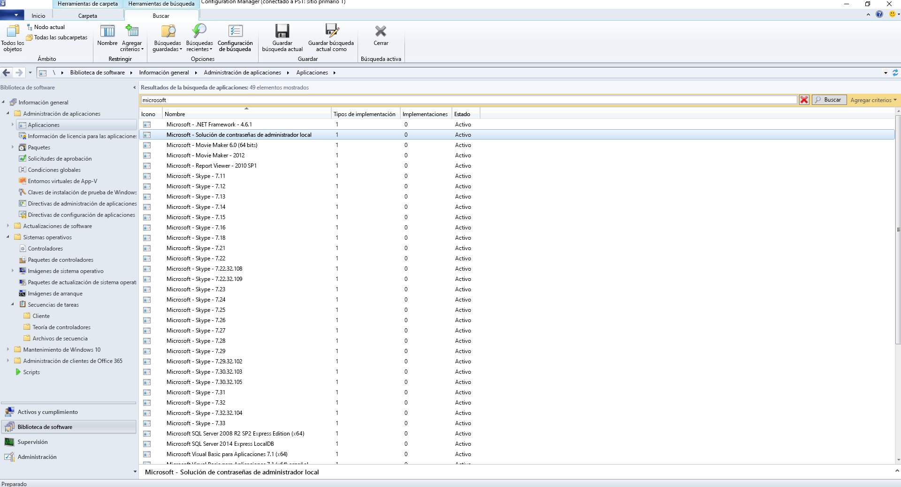
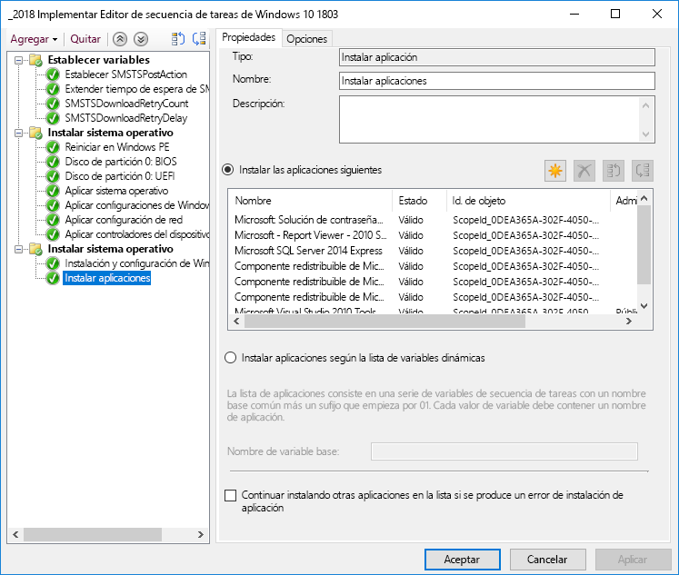
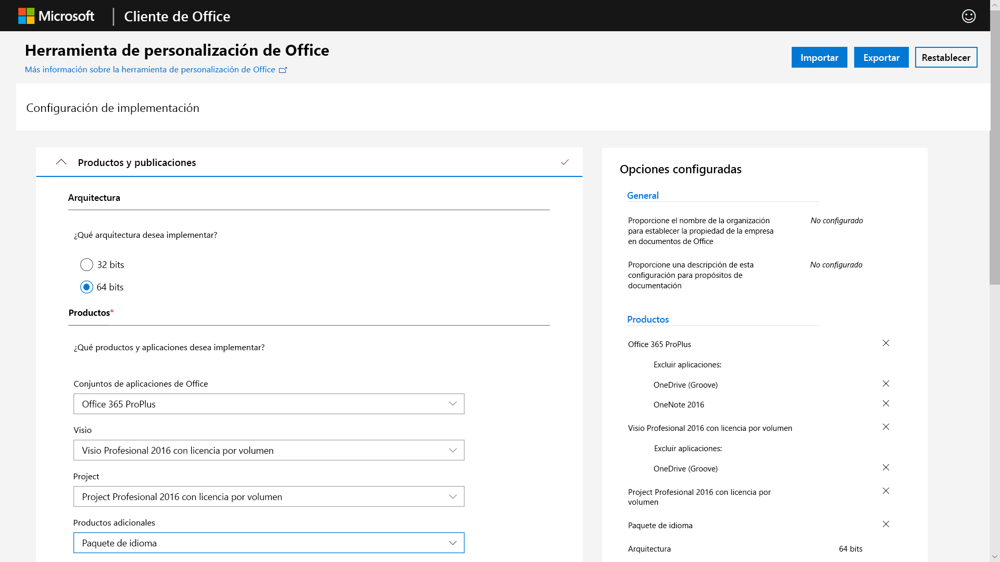
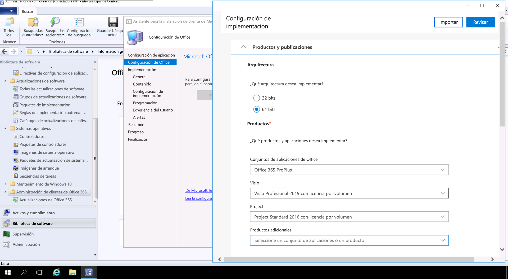

# Paso 3: Entrega de aplicaciones de Office y de LOBStep 3: Office and LOB App Delivery

<table>
<thead>
<td></td>
<td>
<strong>Paso 3: Entrega de aplicaciones de Office y de LOB</strong><strong>Step 3: Office and LOB App Delivery</strong>

Asegúrese de que las aplicaciones están empaquetadas y listas para la instalación automática. Obtenga información sobre cómo el empaquetado Hacer clic y ejecutar con Aplicaciones de Microsoft 365 para empresas ofrece opciones nuevas para configurar, entregar y mantener actualizadas las aplicaciones de Office.Ensure your apps are packaged and ready for automated installation. Learn how Click-to-Run packaging with Microsoft 365 Apps for enterprise gives you new options to configure, deliver and keep your Office apps up-to-date.
</td>
<td></td>
</thead>
</table>

>[!NOTE]
>Entrega de aplicaciones de Office y de LOB es el tercer paso en la rueda del proceso de implementación recomendado que trata las opciones para instalar y administrar Office y LOB.Office and LOB App Delivery is the third step in our recommended deployment process wheel covering the options to install and manage Office and LOB. Para lograr una implementación correcta no omita los dos primeros pasos.For successful deployment do not skip the first two steps.  Para ver el proceso de implementación de escritorio completo, visite el [Centro de implementación de escritorio](https://aka.ms/HowToShift).To see the full desktop deployment process, visit the [Desktop Deployment Center](https://aka.ms/HowToShift).
>

Ya tiene todo listo para entregar sus aplicaciones de Office y Línea de negocio (LOB). Hay varias maneras de hacerlo, incluidas algunas opciones nuevas e interesantes.You are now ready to deliver Office and your Line of Business Apps and there are a number of ways to do this, including some exciting new options. Aunque algunas aplicaciones solo están disponibles como cualquier una versión compilada de 32 bits o 64 bits, otras como Aplicaciones de Microsoft 365 para empresas ofrecen las versiones de 32 bits y 64 bits como código compilado nativo, y una de las mayores decisiones que realizará es qué versión debe implementar.While some applications are only available as either a 32-bit or 64-bit compiled version, others such as Microsoft 365 Apps for enterprise, offer both as 32-bit and 64-bit native compiled code, and one of biggest decisions you will make is which version to deploy. Para aprovechar las ventajas de la potencia de cálculo y RAM adicionales en nuevos dispositivos, Microsoft recomienda usar la versión de 64 bits cuando no haya ninguna dependencia de 32 bits.To take advantage of additional compute power and RAM on new devices Microsoft recommends using the 64-bit version when there are no 32-bit dependencies. Para determinar las dificultades de compatibilidad relacionadas con cualquier complemento o archivos que pueda tener, se recomienda que vuelva a visitar el Paso 1 Preparación de dispositivos y aplicaciones antes de continuar.To determine any add-in or file-related compatibility challenges you may have it is recommended to revisit Step 1 Device and App Readiness before you continue.

Si no hay nada que lo impida, se recomienda implementar las versiones de 64 bits de todas las aplicaciones, incluido Microsoft Office. Las aplicaciones compiladas nativas de 64 bits ofrecen el mejor rendimiento y son la mejor opción para el futuro.If nothing is blocking you, we recommend you deploy 64-bit versions of all apps, including Microsoft Office. 64-bit native compiled apps offer the best performance and is the most future-proof choice.

Existen varios métodos y modelos para instalar aplicaciones en Windows, de modo que vamos a ver las opciones de entrega.There are many methods and models for installing apps on Windows, so let’s look at your delivery options.

[Administración de aplicaciones de Windows 10Windows 10 application management](https://docs.microsoft.com/windows/application-management/)

## Implementaciones basadas en MSIMSI-based Deployments

Para las aplicaciones de línea de negocio, es probable que use paquetes basados en MSI o archivos ejecutables, y que instale las aplicaciones como parte de una secuencia de tareas de implementación de sistema operativo.For your line of business apps, you’ll probably use MSI-based packages or executable  and install apps as part of an OS deployment task sequence. Windows 10 sigue funcionando con estos paquetes.Windows 10 continues to work with these packages.

Las herramientas de implementación de software como Microsoft Endpoint Configuration Manager y Microsoft Intune también están optimizadas para la entrega de aplicaciones empaquetadas como MSI. Después de validar las aplicaciones en Windows 10, puede usar Microsoft Endpoint Configuration Manager (rama actual) para la entrega. Si usa el Portal de empresa de Microsoft Intune, puede ampliar la selección de aplicaciones autorizadas por TI disponibles para la organización con el fin de incluir las más recientes y que los usuarios seleccionen ellos mismos las que necesitan.Software deployment tools like Microsoft Endpoint Configuration Manager and Microsoft Intune are also optimized to deliver MSI-packaged apps. Once you have validated your apps on Windows 10, you can use Microsoft Endpoint Configuration Manager (current branch) for app delivery. If you use the Company Portal in Microsoft Intune you can extend the choice of IT sanctioned apps available to your organization to include the latest applications, and users to self-select what they need.

## Creación de imágenes de equipoPC Imaging

Otro método popular de entrega de aplicaciones es la creación de imágenes del equipo.Another popular method of app delivery is PC imaging. En este caso, las aplicaciones se instalan mediante una secuencia de tareas o de forma manual en un equipo de ejemplo, después se captura una imagen del sistema con las aplicaciones necesarias preinstaladas.In this case, applications are either installed via task sequence or manually on a sample PC, then a system image is captured with the required applications pre-installed. El enfoque de creación de imágenes para compilar y capturar ahorrará tiempo cuando aprovisione nuevos equipos, pero recuerde que los sistemas operativos y las aplicaciones dentro de la imagen pueden quedarse obsoletos rápidamente.The imaging approach to build and capture can save time when provisioning new PCs but remember operating systems and apps within the image can become stale quickly. El modelo de actualización acumulativo de Windows 10 y Aplicaciones de Microsoft 365 para empresas ayuda con este problema, pero no lo elimina por completo.The Cumulative Update model in Windows 10 and Microsoft 365 Apps for enterprise help with this problem, but doesn’t eliminate it completely. Por eso, se recomienda un enfoque de imagen ligera, en el que las aplicaciones se instalan desde fuera de la imagen en el momento de la implementación.This is why we recommend a thin image approach, where your applications are installed from outside the image at deploy time.

Si quiere incluir Aplicaciones de Microsoft 365 para empresas en la imagen, recuerde que se usa una activación basada en el usuario; el administrador del sistema no lo puede activar previamente. Use la herramienta de implementación de Office antes de preinstalar Office en el dispositivo del que se va a crear la imagen y omita el inicio de sesión del usuario.If you do want to include Microsoft 365 Apps for enterprise in your image, remember that this uses a user-based activation; it cannot be pre-activated by the system admin. Use the Office Deployment Tool to pre-install Office on the device you are imaging and skip the user sign-in. Cuando la imagen esté implementada, los usuarios finales pueden iniciar sesión con sus credenciales y activar Aplicaciones de Microsoft 365 para empresas.Once the image is deployed end users can sign-in using their credentials and activate Microsoft 365 Apps for enterprise.

[Creación de una secuencia de tareas para instalar el sistema operativoCreate a Task Sequence to Install an Operating System](https://docs.microsoft.com/mem/configmgr/osd/deploy-use/create-a-task-sequence-to-install-an-operating-system)

[Implementación de Aplicaciones de Microsoft 365 como parte de una imagen de sistema operativoDeploy Microsoft 365 Apps as part of an operating system image](https://docs.microsoft.com/deployoffice/deploy-microsoft-365-apps-operating-system-image)

## Hacer clic y ejecutar de OfficeOffice Click-to-Run 

Aplicaciones de Microsoft 365 para empresas se instala mediante el método Hacer clic y ejecutar, que reemplaza el empaquetado basado en MSI en todas las versiones de la próxima publicación de Office 2019 para Windows.Microsoft 365 Apps for enterprise is installed using Click-to-Run, and Click-to-Run replaces MSI-based packaging in every version of the upcoming Office 2019 release for Windows. Aporta una serie de ventajas, incluyendo instalaciones más rápidas, actualizaciones más rápidas y eficaces y desinstalación más limpias.It brings with it a number of advantages, including faster installations, faster and more efficient updating, and cleaner uninstallation. 

Los programas que se envíen a través de Hacer clic y ejecutar se ejecutan en un entorno virtual de aplicación en el equipo y de esta forma coexisten con otras aplicaciones sin conflicto, también ocupan aproximadamente la mitad del espacio en disco de lo que ocuparían como un paquete basado en MSI.Programs delivered via Click-to-Run execute in a virtual application environment on your computer and so co-exist with other applications without conflict; they also take about half the disk space they would as an MSI-based package. Las aplicaciones de Office se entregan y se administra a través de la [Herramienta de implementación de Office](https://www.microsoft.com/download/details.aspx?id=49117) que es el motor de instalación de Office es necesario descargar, configurar y personalizar las aplicaciones de Office.Office applications are delivered and managed via the [Office Deployment Tool](https://www.microsoft.com/download/details.aspx?id=49117) which is the Office setup engine needed to download, configure, and customize your Office apps. La Herramienta de implementación de Office lee un archivo XML de configuración que proporciona las instrucciones de metadatos acerca de cómo configurar y personalizar la instalación de Office.The Office Deployment Tool reads a configuration XML file which provides the metadata instructions on how to configure and customization your Office installation.

Microsoft recomienda usar la [Herramienta de personalización de Office](https://config.office.com/) para personalizar la configuración de implementación y crear el archivo XML de configuración.Microsoft recommends using the [Office Customization Tool](https://config.office.com/) to customize your deployment settings and create your configuration XML file. Mediante la Herramienta de personalización de Office puede establecer los idiomas y las aplicaciones que se instalarán, cómo se actualizarán las aplicaciones, la configuración de la aplicación y la configuración de la experiencia de instalación.Through the Office Customization Tool you can set which applications and languages will be installed, how the applications will be updated, application preferences, and installation experience settings.

Si usa Configuration Manager, puede seguir usándolo para la implementación general de Aplicaciones de Microsoft 365 para empresas. Configuration Manager (rama actual) tiene compatibilidad nativa con la Herramienta de personalización de Office actualizada, la personalización de paquetes para hacer clic y ejecutar en tiempo de instalación y la compatibilidad nativa para la administración de actualizaciones de software después de la instalación.If you use Configuration Manager, you can still use it for broad deployment of Microsoft 365 Apps for enterprise. Configuration Manager (current branch) has native support for the updated Office Customization Tool, package customization for Click-to-Run at install time, and native support for software update management post installation.

[Guía de implementación de Aplicaciones de Microsoft 365Deployment Guide for Microsoft 365 Apps](https://docs.microsoft.com/deployoffice/deployment-guide-microsoft-365-apps)

[Desinstalar versiones de MSI existentes de Office al actualizar a Aplicaciones de Microsoft 365Remove existing MSI versions of Office when upgrading to Microsoft 365 Apps](https://docs.microsoft.com/deployoffice/upgrade-from-msi-version)

[Administrar Aplicaciones de Microsoft 365 para empresas con Configuration ManagerManage Microsoft 365 Apps for enterprise with Configuration Manager](https://docs.microsoft.com/mem/configmgr/sum/deploy-use/manage-office-365-proplus-updates)

[Asignación de aplicaciones de Office 365 a dispositivos Windows 10 con Microsoft IntuneAssign Office 365 apps to Windows 10 devices with Microsoft Intune](https://docs.microsoft.com/intune/apps-add-office365)

## Aplicaciones basadas en el exploradorBrowser-based Apps

Hay algunas aspectos que debe considerar para asegurarse de que las aplicaciones basadas el explorador siguen funcionando como se esperaba. Si tiene determinados sitios y aplicaciones web con problemas de compatibilidad conocidos con Microsoft Edge, puede usar la lista de sitios del modo de empresa para que los sitios web se abran de forma automática con Internet Explorer 11.There are a few things to consider in order to make sure that your browser-based applications continue to work as expected. If you have specific web sites and apps that you know have compatibility problems with Microsoft Edge, you can use the Enterprise Mode site list so that the web sites will automatically open using Internet Explorer 11.

Además, si sabe que los sitios de la intranet no van a funcionar de forma correcta con Microsoft Edge, puede configurarlos para que se abran de forma automática con Internet Explorer 11. En este proceso se usa un archivo XML para controlar si se utiliza IE11 en cada sitio, mediante la directiva de grupo para aplicar la configuración.Additionally, if you know that your intranet sites aren't going to work properly with Microsoft Edge, you can set all intranet sites to open using Internet Explorer 11 automatically. This process uses an XML file to govern whether IE11 is used for each site, using Group Policy to enforce settings.

[¿Qué es el modo de empresaWhat is Enterprise Mode](https://docs.microsoft.com/internet-explorer/ie11-deploy-guide/what-is-enterprise-mode#what-is-enterprise-mode)

Hasta ahora, hemos analizado métodos de implementación conocidos.So far, we have covered well known deployment methods. Pero hay dos nuevos métodos para la implementación de aplicaciones que puede que desee considerar.But there are two new approaches to app deployment you may wish to consider.

## Microsoft Store para EmpresasMicrosoft Store for Business 

Microsoft Store para Empresas proporciona una manera flexible de descubrir, adquirir, administrar y distribuir aplicaciones gratuitas y de pago para dispositivos Windows 10 a escala.Microsoft Store for Business provides a flexible way discover, acquire, manage, and distribute free and paid apps to Windows 10 devices at scale. Como administrador de TI, puede publicar aplicaciones de Microsoft Store seleccionadas, junto con sus propias aplicaciones personalizadas, en su propio almacén privado al mismo tiempo que asigna y volver a usar licencias según sea necesario.As an IT admin, you can publish selected Microsoft Store apps, along with your custom own apps, to your own private store while assigning and re-using licenses as needed. Los usuarios solo pueden usar esta tienda y, por lo tanto, solo pueden buscar e instalar aplicaciones autorizadas.Your users are directed to this store only, and so can only find and install approved apps.

Las aplicaciones de la tienda se pueden crear de forma nativa como aplicaciones UWP o puede usar el Puente de dispositivo de escritorio para volver a empaquetar las aplicaciones existentes para Microsoft Store y agregar experiencias modernas para Windows 10. Excepto el código que se usa para mejorar las experiencias de Windows 10, la aplicación no se modifica y se seguirá ejecutando en modo de usuario de plena confianza.Store apps can be natively built as UWP apps or you can use the Desktop Bridge to repackage your existing apps for the Store and add modern experiences for Windows 10. Aside from the code that you use to light up Windows 10 experiences, your app remains unchanged and continues to run in full-trust user mode.

## Creación de contenedores MSIXMSIX Containerization

Una nueva opción para el paquete de aplicaciones es MSIX.A new option for application packaging is MSIX. MSIX usa la tecnología de creación de contenedores disponible en Windows, lo que une los mejores aspectos del empaquetado de MSI, UWP y Hacer clic y ejecutar.MSIX uses the containerization technology available in Windows, bringing together the best aspects of Click-to-Run, UWP and MSI packaging. Con las herramientas para migrar instaladores existentes como EXE, MSI, APPV y APPX directamente a MSIX, vemos que la Creación de contenedores MSIX proporciona una ruta unificada para las múltiples tecnologías de instalación que se usan hoy.With tools to migrate existing installers like EXE, MSI, APPV and APPX directly to MSIX we see MSIX Containerization provides a unified path for the many installation technologies in use today. La compatibilidad con MSIX se incluye en las versiones actuales de Windows: cualquier dispositivo con Windows 10 RS5 o versiones posteriores incluye todo lo que necesita para instalar y ejecutar aplicaciones empaquetadas de MSIX.MSIX support is included in current versions of Windows: any device running Windows 10 RS5 or newer includes everything you need to install and run MSIX packaged apps. Windows 10 integra dinámicamente contenedores MSIX que recibe y mantiene las aplicaciones separadas del sistema operativo.Windows 10 dynamically integrates MSIX containers it receives, while keeping the applications separate from the operating system.

La creación de contenedores significa la desinstalación y eliminación limpia de los paquetes, a diferencia de muchos paquetes actuales basados en EXE y MSI que pueden dejar elementos en el sistema. También significa que solo se necesitan credenciales de usuario estándar para instalar las aplicaciones; no se necesitan credenciales de administrador para instalar contenedores MSIX. Los contenedores MSIX también son más eficientes de actualizar. Cuando se publica una actualización, el uso de diferencias de nivel de bloque significa que solo se aplican los archivos binarios nuevos, lo que reduce la carga de la actualización, para implementaciones más rápidas con menos ancho de banda de red.Containerization means clean uninstall and removal of packages, unlike a lot of MSI and EXE-based packages today that may leave items on the system. It also means only needing Standard User credentials to install applications – you do not have to have Administrator credentials to install MSIX containers. MSIX containers are more efficient to update too. When an update is published, use of block level differentials means only net new binaries are applied, reducing the update payload, for faster deployments consuming less network bandwidth.

Encontrará más información sobre MSIX en el [sitio Tech Community de MSIX](https://techcommunity.microsoft.com/t5/MSIX/ct-p/MSIX).You can find more information on MSIX via the [MSIX Tech Community site](https://techcommunity.microsoft.com/t5/MSIX/ct-p/MSIX)

## Siguiente pasoNext Step

## [Paso 4: Archivos y configuración del usuarioStep 4: User Files and Settings](https://aka.ms/mdd4)

## Paso anteriorPrevious Step

## [Paso 2: Preparación de los directorios y la redStep 2: Directory and Network Readiness](https://aka.ms/mdd2) 
